# Rendering 18

Realtime GI, Probe Volumes, LOD Groups

- Support Realtime Global Illumination.
- Animate emissive light contribution to GI.
- Work with light probe proxy volumes.
- Use LOD groups in combination with GI.
- Cross-fade between LOD levels.

This is part 18 of a tutorial series about rendering. After wrapping up baked global illumination in [part 17](https://catlikecoding.com/unity/tutorials/rendering/part-17/), we move on to supporting realtime GI. After that, we'll also support light probe proxy volumes and cross-fading LOD groups.

From now on, this tutorial series is made with Unity 2017.1.0f3.  It won't work with older versions, because we'll end up using a new  shader function.

 					
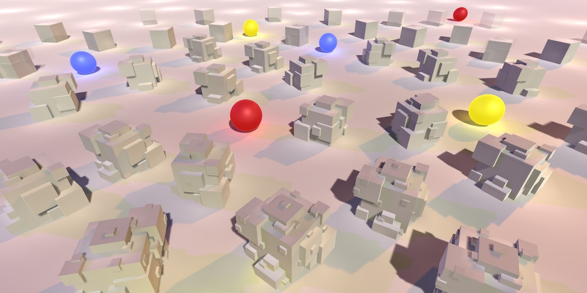 					A combination of static LOD groups and realtime GI. 				

## Realtime Global Illumination

Baking light works very well for static geometry, and also  pretty well for dynamic geometry thanks to light probes. However, it  cannot deal with dynamic lights. Lights in mixed mode can get away with  some realtime adjustments, but too much makes it obvious that the baked  indirect light doesn't change. So when you have an outdoor scene, the  sun has to be unchanging. It cannot travel across the sky like it does  in real life, as it requires gradually changing GI. So the scene has to  be frozen in time.

To make indirect lighting work with something like a moving sun,  Unity uses the Enlighten system to calculate realtime global  illumination. It works like baked indirect lighting, except that the  lightmaps and probes are computed at runtime.

Figuring out indirect light requires knowledge of how light  could bounce between static surfaces. The question is which surfaces are  potentially affected by which other surfaces, and to what degree.  Figuring out these relationships is a lot of work and cannot be done in  realtime. So this data is processed by the editor and stored for use at  runtime. Enlighten then uses it to compute the realtime lightmaps and  probe data. Even then, it's only feasible with low resolution lightmaps.

### Enabling Realtime GI

Realtime global illumination can be enabled independent of  baked lighting. You can have none, one, or both active at the same time.  It is enabled via the checkbox in the *Realtime Lighting* section of the *Lighting* window.

 							
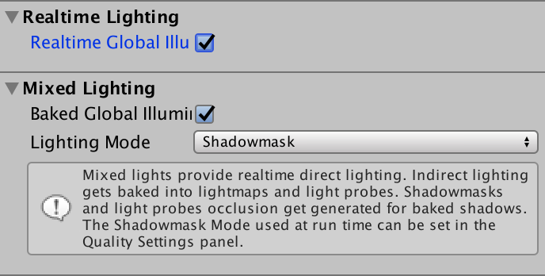 							Both realtime and baked GI enabled. 						

To see realtime GI in action, set the mode of the main light in  our test scene to realtime. As we have no other lights, this  effectively turns off baked lighting, even when it is enabled.

 							
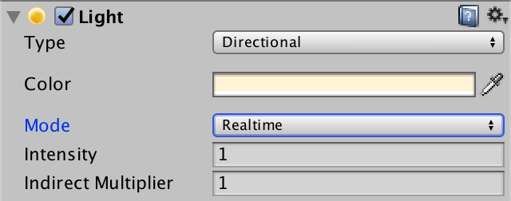 							Realtime main light. 						

Make sure that all objects in the scene use our white material.  Like last time, the spheres are all dynamic and everything else is  static geometry.

 							
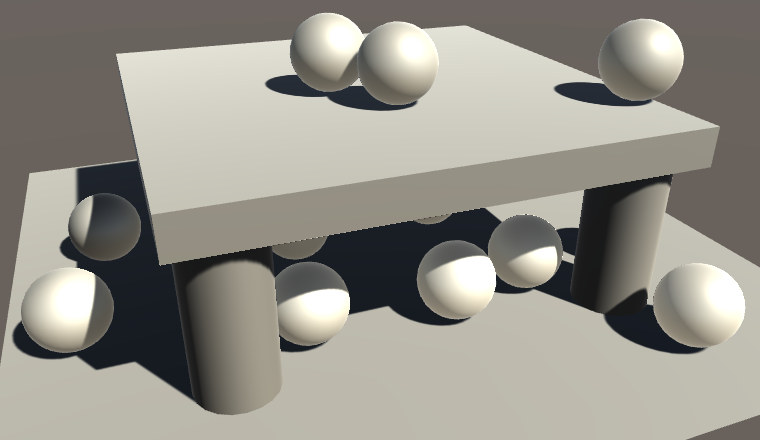 							Only dynamic objects receive realtime GI. 						

It turns out that only the dynamic objects benefit from  realtime GI. The static objects have become darker. That's because the  light probes automatically incorporated the realtime GI. Static objects  have to sample the realtime lightmaps, which are not the same as the  baked lightmaps. Our shader doesn't do this yet.

### Baking Realtime GI

Unity already generates the realtime lightmaps while in edit  mode, so you can always see the realtime GI contribution. These maps are  not retained when switching between edit and play mode, but they end up  the same. You can inspect the realtime lightmaps via the *Object maps* tab of the *Lighting* window, with a lightmap-static object selected. Choose the *Realtime Intensity* visualization to see the realtime lightmap data.

 							
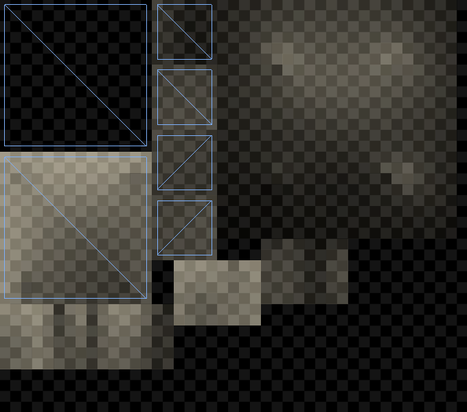 							Realtime lightmap, with roof selected. 						

Although realtime lightmaps are already baked, and they might  appear correct, our meta pass actually uses the wrong coordinates.  Realtime GI has its own lightmap coordinates, which can end up being  different than those for static lightmaps. Unity generates these  coordinates automatically, based on the lightmap and object settings.  They are stored in the third mesh UV channel. So add this data to `**VertexData**` in *My Lightmapping*.

```
struct VertexData {
	float4 vertex : POSITION;
	float2 uv : TEXCOORD0;
	float2 uv1 : TEXCOORD1;
	float2 uv2 : TEXCOORD2;
};
```

Now `MyLightmappingVertexProgram` has  to use either the second or third UV set, together with either the  static or dynamic lightmap's scale and offset. We can rely on the `UnityMetaVertexPosition` function to use the right data.

```
Interpolators MyLightmappingVertexProgram (VertexData v) {
	Interpolators i;
//	v.vertex.xy = v.uv1 * unity_LightmapST.xy + unity_LightmapST.zw;
//	v.vertex.z = v.vertex.z > 0 ? 0.0001 : 0;
//
//	i.pos = UnityObjectToClipPos(v.vertex);
	i.pos = UnityMetaVertexPosition(
		v.vertex, v.uv1, v.uv2, unity_LightmapST, unity_DynamicLightmapST
	);

	i.uv.xy = TRANSFORM_TEX(v.uv, _MainTex);
	i.uv.zw = TRANSFORM_TEX(v.uv, _DetailTex);
	return i;
}
```

 							What does `UnityMetaVertexPosition` look like? 							 						

Note that the meta pass is used for both baked and realtime  lightmapping. So when realtime GI is used, it will also be included in  builds.

### Sampling Realtime Lightmaps

To actually sample the realtime lightmaps, we have to also add the third UV set to `**VertexData**` in *My Lighting*.

```
struct VertexData {
	float4 vertex : POSITION;
	float3 normal : NORMAL;
	float4 tangent : TANGENT;
	float2 uv : TEXCOORD0;
	float2 uv1 : TEXCOORD1;
	float2 uv2 : TEXCOORD2;
};
```

When a realtime lightmap is used, we have to add its lightmap  coordinates to our interpolators. The standard shader combines both  lightmap coordinate sets in a single interpolator – multiplexed with  some other data – but we can get away with separate interpolators for  both. We know that there is dynamic light data when the *DYNAMICLIGHTMAP_ON* keyword is defined. It's part of the keyword list of the `multi_compile_fwdbase` compiler directive.

```
struct Interpolators {
	…

	#if defined(DYNAMICLIGHTMAP_ON)
		float2 dynamicLightmapUV : TEXCOORD7;
	#endif
};
```

Fill the coordinates just like the static lightmap coordinates,  except with the dynamic lightmap's scale and offset, made available via  `unity_DynamicLightmapST`.

```
Interpolators MyVertexProgram (VertexData v) {
	…

	#if defined(LIGHTMAP_ON) || ADDITIONAL_MASKED_DIRECTIONAL_SHADOWS
		i.lightmapUV = v.uv1 * unity_LightmapST.xy + unity_LightmapST.zw;
	#endif

	#if defined(DYNAMICLIGHTMAP_ON)
		i.dynamicLightmapUV =
			v.uv2 * unity_DynamicLightmapST.xy + unity_DynamicLightmapST.zw;
	#endif

	…
}
```

Sampling the realtime lightmap is done in our `CreateIndirectLight` function. Duplicate the `#if defined(LIGHTMAP_ON)` code block and make a few changes. First, the new block is based on the *DYNAMICLIGHTMAP_ON* keyword. Also, it should use `DecodeRealtimeLightmap` instead of `DecodeLightmap`,  because the realtime maps use a different color format. Because this  data might be added to baked lighting, don't immediately assign to `indirectLight.diffuse`,  but use an intermediate variable which is added to it at the end.  Finally, we should only sample spherical harmonics when neither a baked  nor a realtime lightmap is used.

```
		#if defined(LIGHTMAP_ON)
			indirectLight.diffuse =
				DecodeLightmap(UNITY_SAMPLE_TEX2D(unity_Lightmap, i.lightmapUV));
			
			#if defined(DIRLIGHTMAP_COMBINED)
				float4 lightmapDirection = UNITY_SAMPLE_TEX2D_SAMPLER(
					unity_LightmapInd, unity_Lightmap, i.lightmapUV
				);
				indirectLight.diffuse = DecodeDirectionalLightmap(
					indirectLight.diffuse, lightmapDirection, i.normal
				);
			#endif

			ApplySubtractiveLighting(i, indirectLight);
//		#else
//			indirectLight.diffuse += max(0, ShadeSH9(float4(i.normal, 1)));
		#endif

		#if defined(DYNAMICLIGHTMAP_ON)
			float3 dynamicLightDiffuse = DecodeRealtimeLightmap(
				UNITY_SAMPLE_TEX2D(unity_DynamicLightmap, i.dynamicLightmapUV)
			);

			#if defined(DIRLIGHTMAP_COMBINED)
				float4 dynamicLightmapDirection = UNITY_SAMPLE_TEX2D_SAMPLER(
					unity_DynamicDirectionality, unity_DynamicLightmap,
					i.dynamicLightmapUV
				);
            	indirectLight.diffuse += DecodeDirectionalLightmap(
            		dynamicLightDiffuse, dynamicLightmapDirection, i.normal
            	);
			#else
				indirectLight.diffuse += dynamicLightDiffuse;
			#endif
		#endif

		#if !defined(LIGHTMAP_ON) && !defined(DYNAMICLIGHTMAP_ON)
			indirectLight.diffuse += max(0, ShadeSH9(float4(i.normal, 1)));
		#endif
```

 							
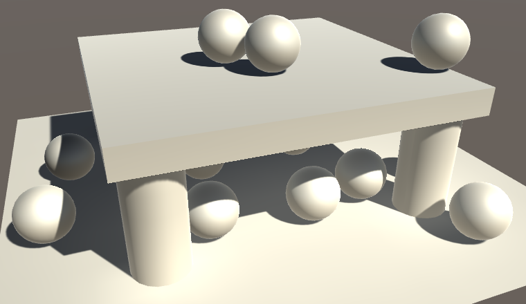 							Realtime GI applied to everything. 						

Now realtime lightmaps are used by our shader. Initially, it  might look the same as baked lighting with a mixed light, when using  distance shadowmask mode. The difference becomes obvious when turning  off the light while in play mode.

 							
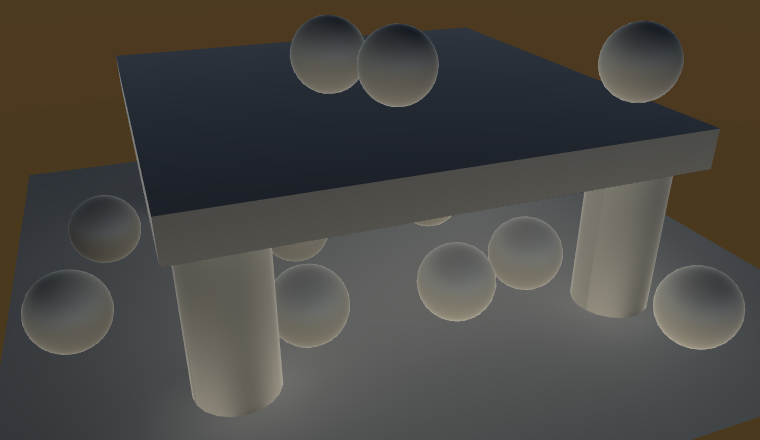 							Indirect light remains after disabling mixed light. 						

After disabling a mixed light, its indirect light will remain.  In contrast, the indirect contribution of a realtime light disappears –  and reappears – as it should. However, it might take a while before the  new situation is fully baked. Enlighten incrementally adjust the  lightmaps and probes. How quickly this happens depends on the complexity  of the scene and the *Realtime Global Illumination CPU* quality tier setting.

<iframe src="https://gfycat.com/ifr/DenseLinearCornsnake"></iframe>

Toggling realtime light with realtime GI.

All realtime lights contribute to realtime GI. However, its  typical use is with the main direction light only, representing the sun  as it moves through the sky. It is fully functional for directional  lights. Points lights and spotlights work too, but only unshadowed. So  when using shadowed point lights or spotlights you can end up with  incorrect indirect lighting.

 							 							 							Realtime spotlight with unshadowed indirect light. 						

If you want to exclude a realtime light from realtime GI, you can do so by settings its *Indirect Multiplier* for its light intensity to zero.

### Emissive Light

Realtime GI can also be used for static objects that emit  light. This makes it possible to vary their emission with matching  realtime indirect light. Let's try this out. Add a static sphere to the  scene and give it a material that uses our shader with a black albedo  and white emission color. Initially, we can only see the indirect  effects of the emitted light via the static lightmaps.

 							
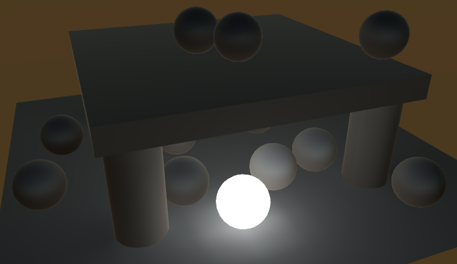 							Baked GI with emissive sphere. 						

To bake emissive light into the static lightmap, we had to set  the material's global illumination flags in our shader GUI. As we always  set the flags to `BakedEmissive`, the light ends up in the baked lightmap. This is fine when the emissive light is constant, but doesn't allow us to animate it.

To support both baked and realtime lighting for the emission,  we have to make this configurable. We can do so by adding a choice for  this to `**MyLightingShaderGUI**`, via the `MaterialEditor.LightmapEmissionProperty` method. Its single parameter is the property's indentation level.

```
	void DoEmission () {
		MaterialProperty map = FindProperty("_EmissionMap");
		Texture tex = map.textureValue;
		EditorGUI.BeginChangeCheck();
		editor.TexturePropertyWithHDRColor(
			MakeLabel(map, "Emission (RGB)"), map, FindProperty("_Emission"),
			emissionConfig, false
		);
		editor.LightmapEmissionProperty(2);
		if (EditorGUI.EndChangeCheck()) {
			if (tex != map.textureValue) {
				SetKeyword("_EMISSION_MAP", map.textureValue);
			}

			foreach (Material m in editor.targets) {
				m.globalIlluminationFlags =
					MaterialGlobalIlluminationFlags.BakedEmissive;
			}
		}
	}
```

We also have to stop overriding the flags each time an emission  property has changed. Actually, it is a bit more complicated than that.  One of the flag options is `EmissiveIsBlack`, which  indicates that computation of the emission can be skipped. This flag is  always set for new materials. To make indirect emission work, we have to  guarantee that this flag is not set, regardless whether we choose  realtime or baked. We can do this by always masking the `EmissiveIsBlack` bit of the flags value.

```
			foreach (Material m in editor.targets) {
				m.globalIlluminationFlags &=
					~MaterialGlobalIlluminationFlags.EmissiveIsBlack;
			}
```

 							 							 							Realtime GI with emissive sphere. 						

The visual difference between baked and realtime GI is that the  realtime lightmap usually has a much lower resolution than the baked  one. So when the emission doesn't change and you use baked GI anyway,  make sure to take advantage of its higher resolution.

 							What is the purpose of `EmissiveIsBlack`? 							 						

### Animating Emission

Realtime GI for emission is only possible for static objects.  While the objects are static, the emission properties of their materials  can be animated and will be picked up by the global illumination  system. Let's try this out with a simple component that oscillates  between a white and black emission color.

```
using UnityEngine;

public class EmissiveOscillator : MonoBehaviour {

	Material emissiveMaterial;

	void Start () {
		emissiveMaterial = GetComponent<MeshRenderer>().material;
	}
	
	void Update () {
		Color c = Color.Lerp(
			Color.white, Color.black,
			Mathf.Sin(Time.time * Mathf.PI) * 0.5f + 0.5f
		);
		emissiveMaterial.SetColor("_Emission", c);
	}
}
```

Add this component to our emissive sphere. When in play mode,  its emission will animate, but indirect light isn't affected yet. We  have to notify the realtime GI system that it has work to do. This can  be done by invoking the `Renderer.UpdateGIMaterials` method of the appropriate mesh renderer.

```
	MeshRenderer emissiveRenderer;
	Material emissiveMaterial;

	void Start () {
		emissiveRenderer = GetComponent<MeshRenderer>();
		emissiveMaterial = emissiveRenderer.material;
	}
	
	void Update () {
		…
		emissiveMaterial.SetColor("_Emission", c);
		emissiveRenderer.UpdateGIMaterials();
	}
```

<iframe src="https://gfycat.com/ifr/VillainousFlakyBlueandgoldmackaw"></iframe>

Realtime GI with animating emissive sphere.

Invoking `UpdateGIMaterials` triggers a complete  update of the object's emission, rendering it using its meta pass. This  is necessary when the emission is more complex than a solid color, for  example if we used a texture. If a solid color is sufficient, we can get  away with a shortcut by invoking `DynamicGI.SetEmissive`  with the renderer and the emission color. This is quicker than  rendering the object with the meta pass, so take advantage of it when  able.

```
//		emissiveRenderer.UpdateGIMaterials();
		DynamicGI.SetEmissive(emissiveRenderer, c);
```

unitypackage

## Light Probe Proxy Volumes

Both baked and realtime GI is applied to dynamic objects via  light probes. An object's position is used to interpolate light probe  data, which is then used to apply GI. This works for fairly small  objects, but is too crude for larger ones.

As an example, add long stretched cube to the test scene so that  it is subject to varying lighting conditions. It should use our white  material. As it is a dynamic cube, it ends up using a single point to  determine its GI contribution. Positioning it so that this point ends up  shadowed, the entire cube becomes dark, which is obviously wrong. To  make it very obvious, use a baked main light, so all lighting comes from  the baked and realtime GI data.

 						
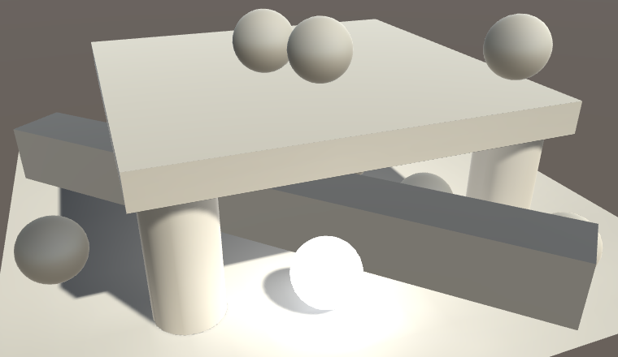 						Large dynamic object with bad lighting. 					

To make light probes work for cases like this, we can use a  light probe proxy volume, or LPPV for short. This works by feeding the  shader a grid of interpolated probe values, instead of a single one.  This requires a floating-point 3D texture with linear filtering, which  limits it to modern graphics cards. Besides that, also make sure that  LPPV support is enabled in the graphics tier settings.

 							
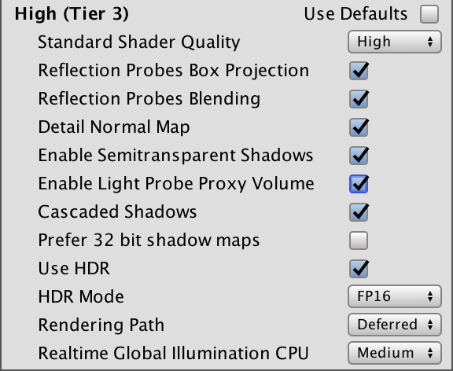 							LPPV support enabled. 						

### Adding an LPPV to an Object

An LPPV can be setup in various ways, the most straightforward  is as a component of the object that will use it. You can add it via *Component / Rendering / Light Probe Proxy Volume*.

 							
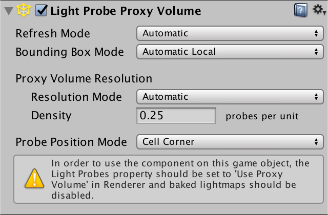 							LPPV component. 						

LPPVs work by interpolating between light probes at runtime, as  if they were a grid of regular dynamic objects. The interpolated values  are cached, with the *Refresh Mode* controlling when they are updated. The default is *Automatic*, which means that updates happen when the dynamic GI changes and when the probe group moves. *Bounding Box Mode* controls how the volume is positioned. *Automatic Local*  means that it fits the bounding box of the object it's attached to.  These default settings work well for our cube, so we'll keep them.

To have our cube actually use the LPPV, we have to set the *Light Probes* mode of its mesh renderer to *Use Proxy Volume*. The default behavior is to use the LPPV component of the object itself, but you could also force it to use another volume.

 							
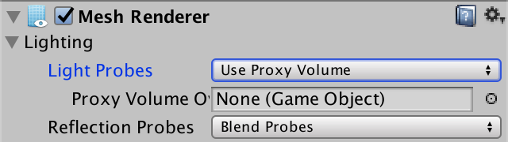 							Using a proxy volume instead of regular probes. 						

The automatic resolution mode doesn't work well for our stretched cube. So set the *Resolution Mode* to *Custom*  and make sure that there are sample points at the cube corners and  multiple along its long edges. You can see these sample points when you  have the object selected.

 							 							 							Custom probe resolution to fit the stretched cube. 						

### Sampling the Volume

The cube has become black, because our shader doesn't support  LPPV sampling yet. To make it work, we have to adjust the spherical  harmonics code inside our `CreateIndirectLight` function. When an LPPV is used, *UNITY_LIGHT_PROBE_PROXY_VOLUME* is defined as 1. Let's do nothing in that case and see what happens.

```
		#if !defined(LIGHTMAP_ON) && !defined(DYNAMICLIGHTMAP_ON)
			#if UNITY_LIGHT_PROBE_PROXY_VOLUME
			#else
				indirectLight.diffuse += max(0, ShadeSH9(float4(i.normal, 1)));
			#endif
		#endif
```

 							
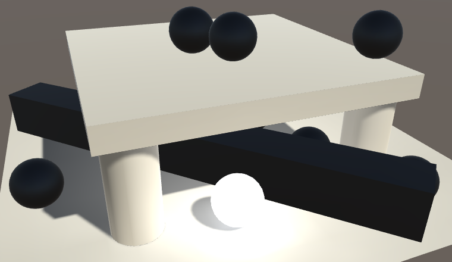 							No more spherical harmonics. 						

It turns out that all spherical harmonics are disabled, also for dynamic objects that don't use LPPVs. That's because *UNITY_LIGHT_PROBE_PROXY_VOLUME* is defined project-wide, not per object instance. Whether an individual object uses an LPPV is indicated by the X component of `unity_ProbeVolumeParams`, defined in *UnityShaderVariables*. If it is set to 1, then we have an LPPV, otherwise we should use regular spherical harmonics.

```
			#if UNITY_LIGHT_PROBE_PROXY_VOLUME
				if (unity_ProbeVolumeParams.x == 1) {
				}
				else {
					indirectLight.diffuse +=
						max(0, ShadeSH9(float4(i.normal, 1)));
				}
			#else
				indirectLight.diffuse += max(0, ShadeSH9(float4(i.normal, 1)));
			#endif
```

To sample the volume, we can use the `SHEvalLinearL0L1_SampleProbeVolume` function instead of `ShadeSH9`. This function is defined in *UnityCG* and requires the world position as an extra parameter.

```
				if (unity_ProbeVolumeParams.x == 1) {
					indirectLight.diffuse = SHEvalLinearL0L1_SampleProbeVolume(
						float4(i.normal, 1), i.worldPos
					);
					indirectLight.diffuse = max(0, indirectLight.diffuse);
				}
```

 							How does `SHEvalLinearL0L1_SampleProbeVolume` work? 							 						

 							
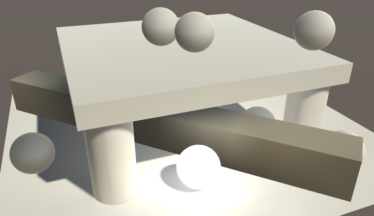 							Sampled LPPV, too dark in gamma space. 						

Our shader now samples the LPPV when needed, but the result is  too dark. At least, that is the case when working in gamma color space.  That's because the spherical harmonics data is stored in linear space.  So a color conversion might be required.

```
				if (unity_ProbeVolumeParams.x == 1) {
					indirectLight.diffuse = SHEvalLinearL0L1_SampleProbeVolume(
						float4(i.normal, 1), i.worldPos
					);
					indirectLight.diffuse = max(0, indirectLight.diffuse);
					#if defined(UNITY_COLORSPACE_GAMMA)
			            indirectLight.diffuse =
			            	LinearToGammaSpace(indirectLight.diffuse);
			        #endif
				}
```

 							
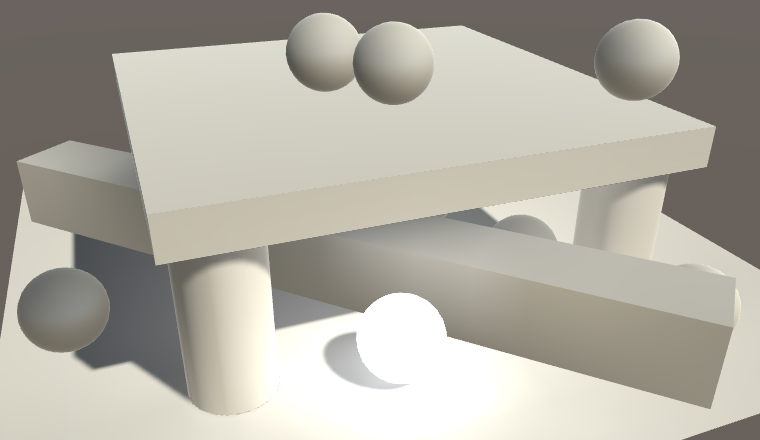 							Sampled LPPV, with correct colors. 						

unitypackage

## LOD Groups

When an object ends up covering only a small portion of the  app's window, you don't need a highly detailed mesh to render it. You  can use different meshes depending on the view size of the object. This  is known as level of detail, or LOD for short. Unity allows us to do  this via the *LOD Group* component.

### Creating a LOD Hierarchy

The idea is that you use multiple version of the same mesh at  various detail levels. The highest level – LOD 0 – has the most  vertices, sub-objects, animations, complex materials, and so on.  Additional levels become progressively simpler and cheaper to render.  Ideally, adjacent LOD levels are designed so that you can't easily tell  the difference between them when Unity switches from one to the other.  Otherwise the sudden change would be glaring. But while investigating  this technique we'll use obviously different meshes.

Create an empty game object and give it two children. The first  is a standard sphere and the second is a standard cube with its scale  set to 0.75 uniformly. The result looks like and overlapping sphere and  cube, as expected.

 							 							 							Sphere and cube as one object. 						

Add a LOD group component to the parent object, via *Component / Rendering / LOD Group*.  You'll get a LOD group with default settings, which has three LOD  levels. The percentages refer to the vertical portion of the window  covered by the object's bounding box. So the default is to switch to LOD  1 when the vertical size drops down to 60% of the window's height, and  to LOD 2 when it is reduced to 30%. When it reaches 10% it isn't  rendered at all. You can change these thresholds by dragging the edges  of the LOD boxes.

 							
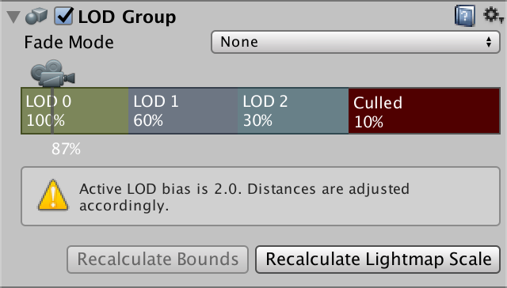 							LOD Group component. 						

The thresholds are modified by the *LOD Bias*,  which is mentioned by the component's inspector. This is a quality  settings with a default value of 2, which means that the thresholds are  effectively halved. It is also possible to set a maximum LOD level,  which results in the highest levels being skipped.

To makes it work, you have to tell the component which objects  to use per LOD level. This is done by selecting a LOD block and adding  objects to its *Renderers* list. While you could  add any object in the scene, by sure to add its child objects. Use the  sphere for LOD 0 and the cube for LOD 1. We'll leave LOD 2 empty, so we  effectively only have two LOD levels. If you want to, you can delete and  insert LOD levels via the right-click context menu.

 							
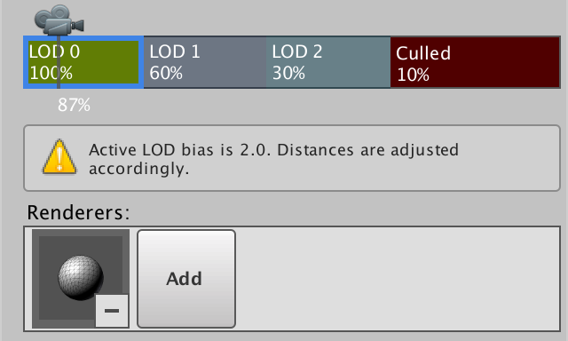 							Using the sphere child for LOD 0. 						

Once the LOD levels are configured, you can see them in action  by moving the camera. If the object ends up big enough, it'll use the  sphere, otherwise it will use the cube or won't be rendered at all.

<iframe src="https://gfycat.com/ifr/ShyAffectionateFairyfly"></iframe>

LOD transitions in action.

### Baked GI and LOD Groups

Because how a LOD group is rendered depends on its view size,  they are naturally dynamic. However, you can still make them static. Do  this for the entire object hierarchy, so both the root and its two  children. Then set the main light to baked to see what happens.

 							
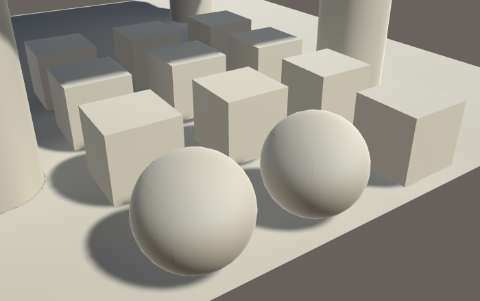 							Using baked lighting. 						

It looks like LOD 0 is used when baking static lightmaps. We  end up always seeing the sphere's shadow and indirect light  contribution, even when the LOD group switches to a cube or culls  itself. But note that the cube uses the static lightmap as well. So it  doesn't use light probes, right? Turn of the light probe group to find  out.

 							
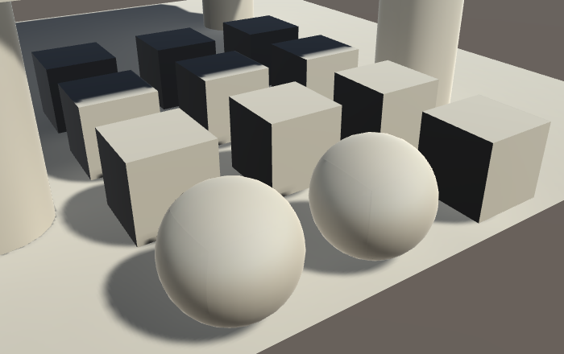 							Baked lighting without probes. 						

Disabling the probe group made the cubes darker. This means  that that they no longer receive indirect light. This happens because  LOD 0 is used when determining indirect light during the baking process.  To find the indirect light for the other LOD levels, the best Unity can  do is rely on the baked light probes. So we need light probes to get  indirect light baked for our cubes, even if we don't need light probes  at runtime.

### Realtime GI and LOD Groups

When only using realtime GI, the approach is similar, except  that our cube now uses the light probes at runtime. You can verify this  by selecting the sphere or the cube. When the cube is selected, you can  see the gizmos that show which light probes are used. The sphere doesn't  show them, because it uses the dynamic lightmap.

 							
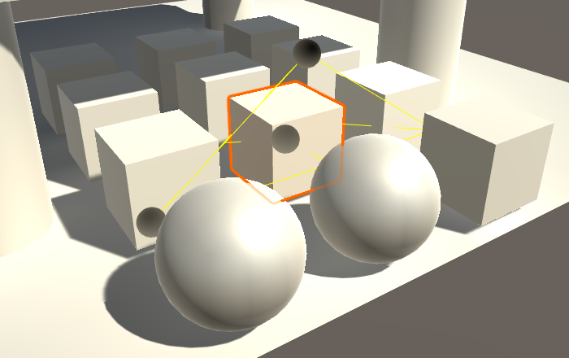 							LOD 1 uses probes for realtime GI. 						

It gets more complicated when both baked and realtime GI are  used at the same time. In that case, the cube should use lightmaps for  the baked GI and light probes for the realtime GI. Unfortunately this is  not possible, because lightmaps and spherical harmonics cannot be used  at the same time. it's either one or the other. Because lightmap data is  available for the cube, Unity ends up using that. Consequently, the  cube isn't affected by realtime GI.

 							
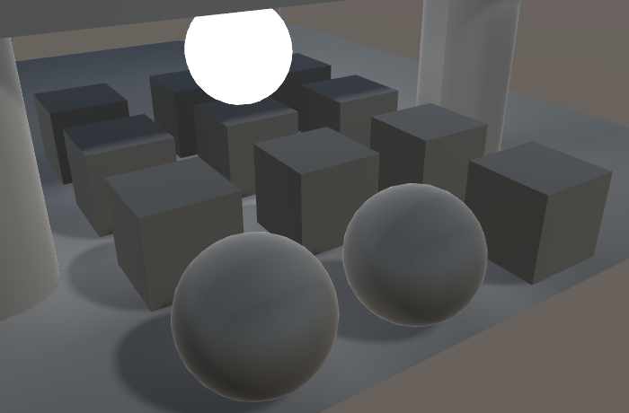 							Only baked lighting for LOD 1, using a low-intensity main light. 						

An important detail is that the baking and rendering of LOD  levels is completely independent. They don't need to use the same  settings. If realtime GI ends up more important than baked GI, you can  force the cube to use light probes by making sure that it is not  lightmap-static, while keeping the sphere static.

 							
 							LOD 1 forced to use light probes. 						

### Cross-fading Between LOD Levels

A downside of LOD groups is that it can be visually obvious  when the LOD level changes. Geometry suddenly pops into view,  disappears, or changes shape. This can be mitigated by cross-fading  between adjacent LOD levels, which is done by setting the group's *Fade Mode* to *Cross Fade*. There is also another fade mode, used by Unity for SpeedTree objects, which we won't use.

When cross-fading is enabled, each LOD level shows a *Fade Transition Width*  field that controls which portion of its block is used for fading. For  example, when set to 0.5 half the LOD's range is used to fade to the  next level. Alternatively, the fading can be animated, in which case it  takes about half a second to transition between LOD levels.

 							
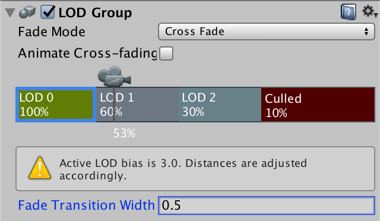 							Cross-fade with 0.5 transition width. 						

When cross-fading is enabled, two LOD levels are rendered at the same time while the group is transitioning between them.

### Supporting Cross-fading

Unity's standard shader doesn't support cross-fading by  default. You'd have to copy the standard shader and add a multi-compile  directive for the *LOD_FADE_CROSSFADE* keyword. We need to add that directive as well to support cross-fading with *My First Lighting Shader*. Add the directive to all passes except the meta pass.

```
			#pragma multi_compile _ LOD_FADE_CROSSFADE
```

We'll use dithering to transition between the LOD levels. That  approach works with both forward and deferred rendering, and also with  shadows.

We've already used dithering, when creating [semitransparent shadows](https://catlikecoding.com/unity/tutorials/rendering/part-12/).  It required the fragment's screen-space coordinates, which forced us to  use different interpolator structures for the vertex and fragment  program. So let's duplicate the `**Interpolators**` structure in *My Lighting* as well, renaming one to `**InterpolatorsVertex**`.

```
struct InterpolatorsVertex {
	…
};

struct Interpolators {
	…
};

…

InterpolatorsVertex MyVertexProgram (VertexData v) {
	InterpolatorsVertex i;
	…
}
```

The interpolators for the fragment program have to contain `vpos` when we have to cross-fade, otherwise we can keep the usual position.

```
struct Interpolators {
	#if defined(LOD_FADE_CROSSFADE)
		UNITY_VPOS_TYPE vpos : VPOS;
	#else
		float4 pos : SV_POSITION;
	#endif

	…
};
```

We can perform the cross-fading by using the `UnityApplyDitherCrossFade` function at the start of our fragment program.

```
FragmentOutput MyFragmentProgram (Interpolators i) {
	#if defined(LOD_FADE_CROSSFADE)
		UnityApplyDitherCrossFade(i.vpos);
	#endif

	…
}
```

 							How does `UnityApplyDitherCrossFade` work? 							 						

 							
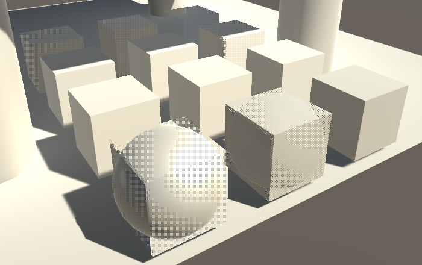 							Cross-fading geometry via dithering. 						

Crossfading now works for geometry. To make it work for shadows as well, we have to adjust *My Shadows*. First, `vpos` has to be used when we're cross-fading. Second, we also have to use `UnityApplyDitherCrossFade` at the start of the fragment program.

```
struct Interpolators {
	#if SHADOWS_SEMITRANSPARENT || defined(LOD_FADE_CROSSFADE)
		UNITY_VPOS_TYPE vpos : VPOS;
	#else
		float4 positions : SV_POSITION;
	#endif

	…
};

…

float4 MyShadowFragmentProgram (Interpolators i) : SV_TARGET {
	#if defined(LOD_FADE_CROSSFADE)
		UnityApplyDitherCrossFade(i.vpos);
	#endif

	…
}
```


<iframe src="https://gfycat.com/ifr/AcceptableClosedAmurstarfish"></iframe>

Cross-fading both geometry and shadows.

Because the cube and sphere intersect each other, we get some  strange self-shadowing while cross-fading between them. This is handy to  see that cross-fading between shadows works, but you have to watch out  for such artifacts when creating LOD geometry for actual games.

The next tutorial is [GPU Instancing](https://catlikecoding.com/unity/tutorials/rendering/part-19/).

unitypackage

PDF
