# Rendering 8

Reflections

- Sample the environment.
- Use reflection probes.
- Create rough and smooth mirrors.
- Perform box projection cube map sampling.
- Blend between reflection probes.

This is the eight part of a tutorial series about rendering. We added support for shadows in the [previous part](https://catlikecoding.com/unity/tutorials/rendering/part-7). This part introduces indirect reflections.

This tutorial was made with Unity 5.4.0f3.

 					
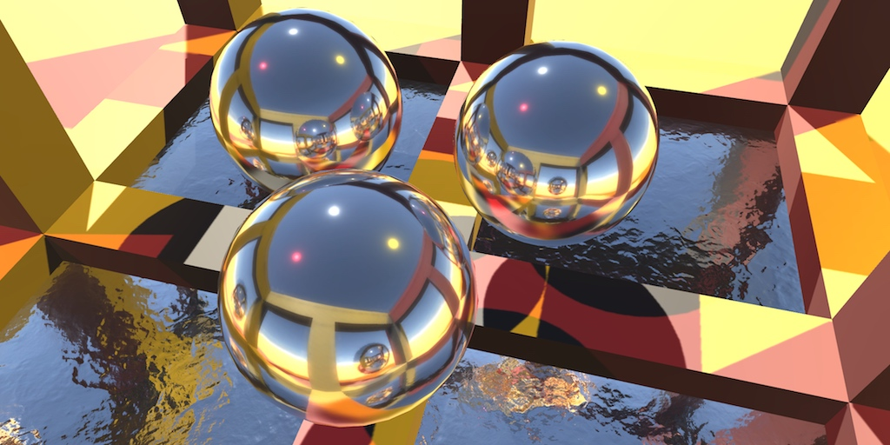 					Sometimes your work reflects on itself. 				

## Environment Mapping

Currently, our shader colors a fragment by combining the  ambient, diffuse, and specular reflections on a surface. This produces  seemingly realistic images, at least as long as the surfaces are dull.  Shiny surfaces don't look quite right, though.

Shiny surfaces act like mirrors, especially when metallic. A  perfect mirror reflects all light. This means that there is no diffuse  reflection at all. It's nothing but specular reflections. So let's turn  our material into a mirror, by settings *Metallic* to 1 and *Smoothness* to 0.95. Make it solid white as well.

 						
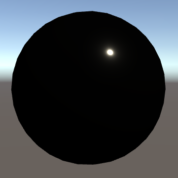 						A shiny white metal sphere. 					

The result is an almost entirely black surface, even though its  color is white. We only see a small highlight, where the light source is  directly reflected towards us. All other light gets reflected in  different directions. If you were to increase the smoothness to 1, then  the highlight would disappear as well.

This does not look like a true mirror at all. Mirrors aren't  black, they reflect things! In this case, it should reflect the skybox,  showing a blue sky with a gray ground.

### Indirect Specular Lighting

Our sphere turned out black, because we're only including  direct light. To reflect the environment, we have to include the  indirect light as well. Specifically, the indirect light for specular  reflections. In the `CreateIndirectLight` function, we configured Unity's `**UnityIndirect**` structure. So far, we've set its specular component to zero. That's why the sphere turned out black!

Set the scene's ambient intensity to zero so we can focus on  the reflections. Turn our material into a dull nonmetal again, with a  smoothness of 0.5. Then change the indirect specular color to something  obvious, like red.

```
UnityIndirect CreateIndirectLight (Interpolators i) {
	UnityIndirect indirectLight;
	indirectLight.diffuse = 0;
	indirectLight.specular = 0;

	#if defined(VERTEXLIGHT_ON)
		indirectLight.diffuse = i.vertexLightColor;
	#endif

	#if defined(FORWARD_BASE_PASS)
		indirectLight.diffuse += max(0, ShadeSH9(float4(i.normal, 1)));
		indirectLight.specular = float3(1, 0, 0);
	#endif

	return indirectLight;
}
```

 							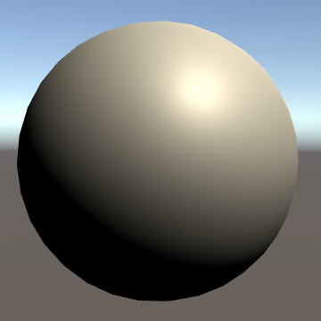 							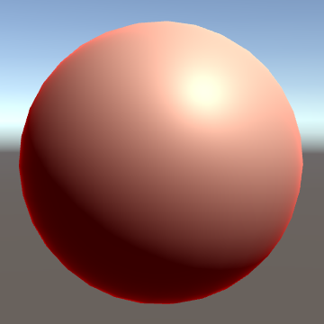 							Black and red indirect specular color, smoothness 0.5. 						

The sphere has picked up a red tint. In this case, red is an  indication of reflectivity. So our sphere reflects some environmental  light towards us from its center. And apparently, it reflects more at  its edge. That's because every surface becomes more reflective as the  view angle becomes more shallow. At glancing angles, most light is  reflected, and everything becomes a mirror. This is known as Fresnel  reflection. The version of `**UNITY_BRDF_PBS**` that we're using computes it for us.

The smoother a surface, the stronger the Fresnel reflections. When using a high smoothness, the red ring becomes very obvious.

 							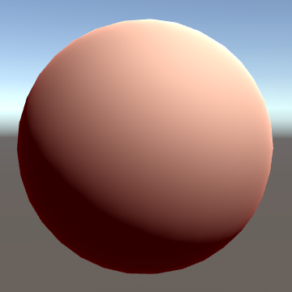 							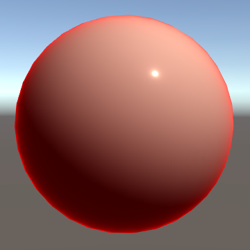 							Smoothness 0.15 and 0.95. 						

Because the reflection comes from indirect light, it is  independent of the direct light source. As a result, the reflection is  independent of the shadows of that light source as well. So the Fresnel  reflection becomes very obvious in the otherwise shadowed edge of the  sphere.

In the case of metals, the indirect reflections dominate everywhere. Instead of a black sphere, we now get a red one.

 							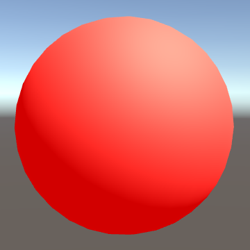 							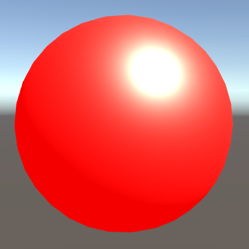 							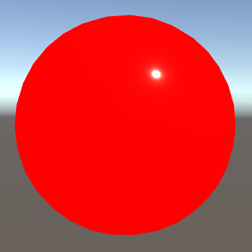 							Metallic with smoothness 0.15, 0.50, and 0.95. 						

### Sampling the Environment

To reflect the actual environment, we have to sample the skybox cube map. It is defined as `unity_SpecCube0` in *UnityShaderVariables*. The type of this variable depends on the target platform, which is determined in *HSLSupport*.

A cube map is sampled with a 3D vector, which specifies a sample direction. We can use the `**UNITY_SAMPLE_TEXCUBE**`  macro for that, which takes care of the type differences for us. Let's  begin by just using the normal vector as the sample direction.

```
	#if defined(FORWARD_BASE_PASS)
		indirectLight.diffuse += max(0, ShadeSH9(float4(i.normal, 1)));
		float3 envSample = UNITY_SAMPLE_TEXCUBE(unity_SpecCube0, i.normal);
		indirectLight.specular = envSample;
	#endif
```

 							
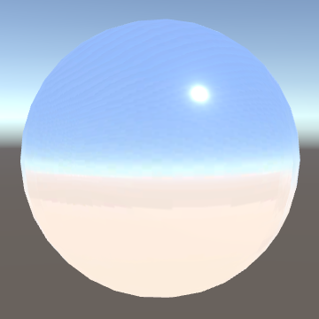 							Environment sampling. 						

The skybox shows up, but it is far too bright. That's because  the cube map contains high dynamic range colors, which allows it to  contain brightness values larger than one. We have to convert the  samples from HDR format to RGB.

*UnityCG* contains the `DecodeHDR` function, which we can use. The HDR data is stored in four channels, using the RGBM format. So we have to sample a `**float4**` value, then convert.

```
		indirectLight.diffuse += max(0, ShadeSH9(float4(i.normal, 1)));
		float4 envSample = UNITY_SAMPLE_TEXCUBE(unity_SpecCube0, i.normal);
		indirectLight.specular = DecodeHDR(envSample, unity_SpecCube0_HDR);
```

 							
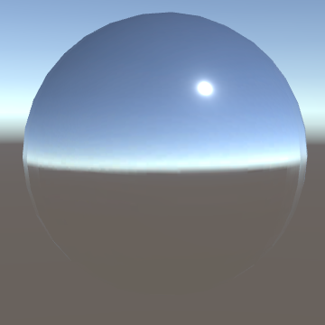 							HDR decoded. 						

 							What does `DecodeHDR` look like? 							 						

### Tracing Reflections

We get the correct colors, but we're not seeing an actual  reflection yet. Because we're using the sphere's normals to sample the  environment, the projection doesn't depend on the view direction. So  it's like a sphere with the environment painted on it.

To produce an actual reflection, we have to take the direction  from the camera to the surface, and reflect it using the surface normal.  We can use the `reflect` function for this, like we did in [part 4, The First Light](https://catlikecoding.com/unity/tutorials/rendering/part-4/). In this case, we need the view direction, so add it as a parameter to `CreateIndirectLight`.

```
UnityIndirect CreateIndirectLight (Interpolators i, float3 viewDir) {
	…
	
	#if defined(FORWARD_BASE_PASS)
		indirectLight.diffuse += max(0, ShadeSH9(float4(i.normal, 1)));
		float3 reflectionDir = reflect(-viewDir, i.normal);
		float4 envSample = UNITY_SAMPLE_TEXCUBE(unity_SpecCube0, reflectionDir);
		indirectLight.specular = DecodeHDR(envSample, unity_SpecCube0_HDR);
	#endif

	return indirectLight;
}

…

float4 MyFragmentProgram (Interpolators i) : SV_TARGET {
	…

	return UNITY_BRDF_PBS(
		albedo, specularTint,
		oneMinusReflectivity, _Smoothness,
		i.normal, viewDir,
		CreateLight(i), CreateIndirectLight(i, viewDir)
	);
}
```

 							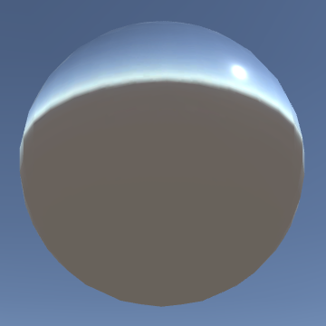 							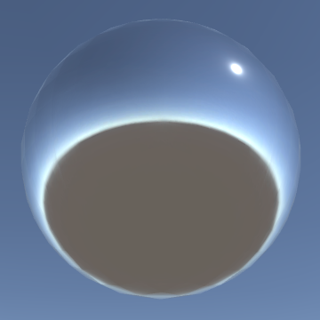 							Using normals vs. reflection directions. 						

### Using a Reflection Probe

Reflecting the skybox is nice, but it's even nicer to reflect  actual scene geometry. So let's create a simple building. I used a  rotated quad as a floor and placed a few cube pillars on top of it, and  some cube beams on top of those. The sphere hovers in the center of the  building.

 							
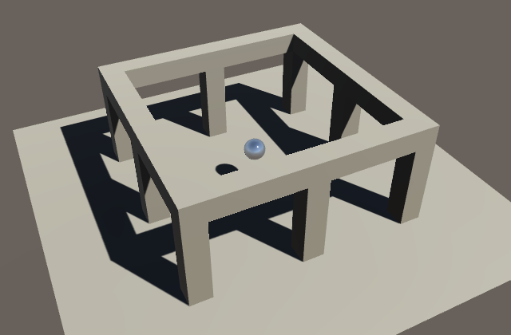 							Something to reflect. 						

To see the reflection of the building, we have to capture it first. This is done with a reflection probe, which you can add via *GameObject / Light / Reflection Probe*. Create one and put it in the same position as our sphere.

 							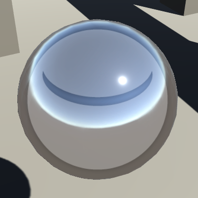 							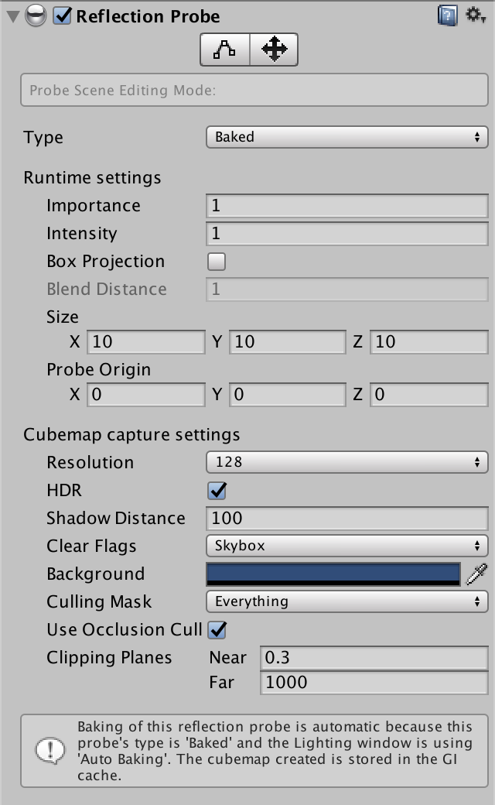 							A default reflection Probe. 						

The scene view indicates the presence of the reflection probe  with a round gizmo. Its appearance depends on the configuration of the  scene view. As the gizmo obstructs the view of our sphere, let's turn it  off. You can do this by opening the *Gizmo* dropdown menu in the scene view toolbar, scrolling down to *ReflectionProbe*, and clicking on its icon.

 							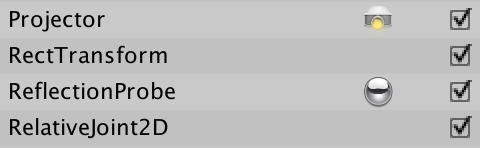 							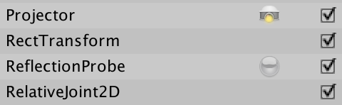 							Turning off the reflection probe gizmo. 						

The reflection probe captures the environment by rendering a  cube map. This means that it renders the scene six times, once per face  of the cube. By default, its *Type* is set to *Baked*.  In this mode, the cube map is generated by the editor and included in  builds. These maps only include static geometry. So our building has to  be static before it gets rendered into the cube map.

Alternatively, we could change the reflection probe's type to *Realtime*.  Such probes are rendered at run time, and you can choose when an how  often. There is also a custom mode, to give you total control.

While real-time probes are most flexible, they are also the  most expensive, when updated frequently. Also, real-time probes are not  updated in edit mode, while baked probes are updated when they or static  geometry is edited. So let's stick to baked probes and make our  building static. 

Objects don't actually need to be completely static. You can  mark them static for the purposes of various subsystems. In this case,  the relevant setting is *Reflection Probe Static*.  When enabled, the objects are rendered to the baked probes. You can  move them at run time, but their reflections remain frozen.

 							
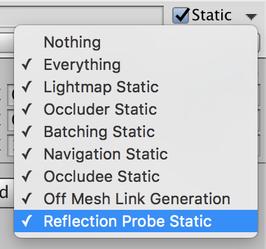 							Reflection Probe Static. 						

After the building has been marked as static, the reflection  probe will be updated. It will appear black for a moment, and then the  reflections will appear. The reflective sphere isn't part of the  reflections itself, so keep it dynamic.

 							
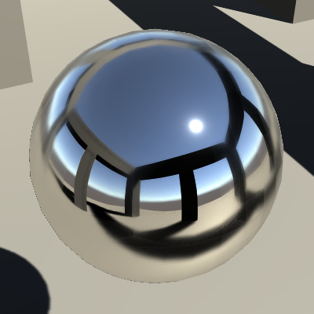 							Reflected geometry. 						

unitypackage

## Imperfect Reflections

Only perfectly smooth surfaces produce perfectly sharp  reflections. The rougher a surface becomes, the more diffuse its  reflections get. Dull mirrors produce blurry reflections. How can we  blur the reflections?

Textures can have mipmaps, which are down-sampled versions of  the original image. When viewed at full size, higher mipmaps thus  produce blurrier images. These would be blocky images, but Unity uses a  different algorithm to generate the mipmaps of environment maps. These  convolved maps represent a nice progression from sharp to blurry.

 						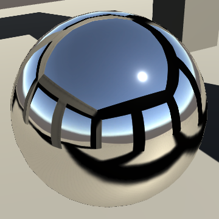 						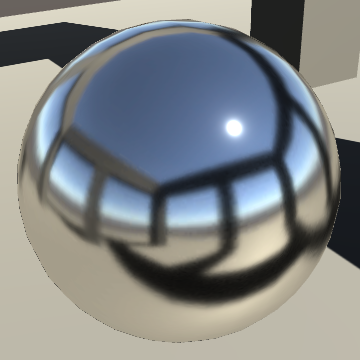 						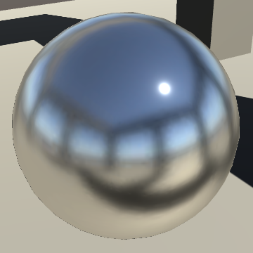 						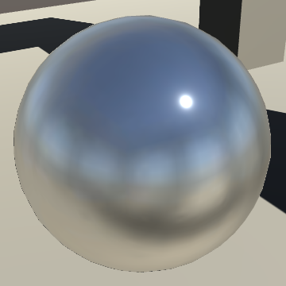 						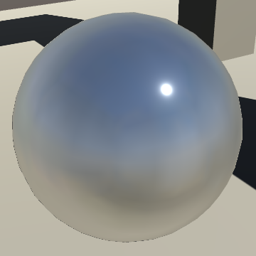 						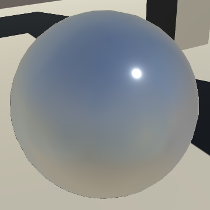 						Mipmap levels from 0 to 5. 					

### Rough Mirrors

We can use the `**UNITY_SAMPLE_TEXCUBE_LOD**`  macro to sample a cube map at a specific mipmap level. The environment  cube maps use trilinear filtering, so we can blend between adjacent  levels. This allows us base the mipmap selection on the material's  smoothness. The rougher a material is, the higher a mipmap level we  should use.

As roughness goes from 0 to 1, we have to scale it by the mipmap range that we're using. Unity uses the `**UNITY_SPECCUBE_LOD_STEPS**` macro to determine this range, so let's use it too.

```
		float roughness = 1 - _Smoothness;
		float4 envSample = UNITY_SAMPLE_TEXCUBE_LOD(
			unity_SpecCube0, reflectionDir, roughness * UNITY_SPECCUBE_LOD_STEPS
		);
```

 							Where is `**UNITY_SPECCUBE_LOD_STEPS**` defined? 							 						

 							
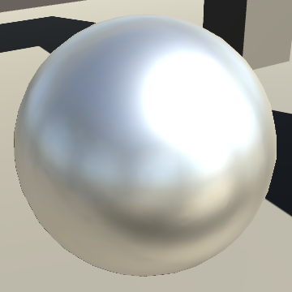 							Smoothness 0.5. 						

Actually, the relation between roughness and mipmap level is not linear. Unity uses the conversion formula 1.7r−0.7r2

, where 

r

 is the original roughness.

 							
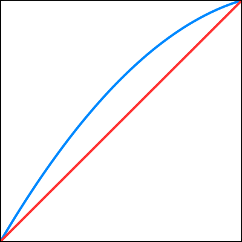 							1.7r−0.7r2

 vs. linear. 						

```
		float roughness = 1 - _Smoothness;
		roughness *= 1.7 - 0.7 * roughness;
		float4 envSample = UNITY_SAMPLE_TEXCUBE_LOD(
			unity_SpecCube0, reflectionDir, roughness * UNITY_SPECCUBE_LOD_STEPS
		);
```

 							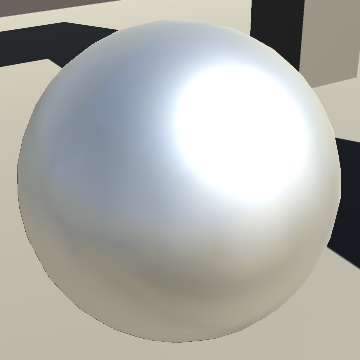 							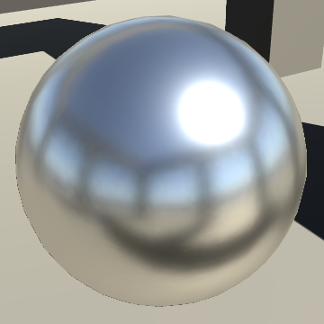 							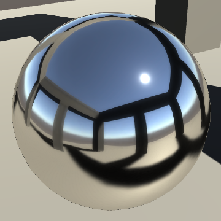 							Smoothness 0.5, 0.75, and 0.95. 						

The *UnityStandardBRDF* include file contains the `Unity_GlossyEnvironment`  function. It contains all the code to convert the roughness, sample the  cube map, and convert from HDR. So let's use that function in place of  our own code.

To pass the cube map as an argument, we have to use the `**UNITY_PASS_TEXCUBE**` macro. This takes care of the type differences. Also, the roughness and reflection direction have to be packed in a `**Unity_GlossyEnvironmentData**` structure.

```
		indirectLight.diffuse += max(0, ShadeSH9(float4(i.normal, 1)));
		float3 reflectionDir = reflect(-viewDir, i.normal);
//		float roughness = 1 - _Smoothness;
//		roughness *= 1.7 - 0.7 * roughness;
//		float4 envSample = UNITY_SAMPLE_TEXCUBE_LOD(
//			unity_SpecCube0, reflectionDir, roughness * UNITY_SPECCUBE_LOD_STEPS
//		);
//		indirectLight.specular = DecodeHDR(envSample, unity_SpecCube0_HDR);
		Unity_GlossyEnvironmentData envData;
		envData.roughness = 1 - _Smoothness;
		envData.reflUVW = reflectionDir;
		indirectLight.specular = Unity_GlossyEnvironment(
			UNITY_PASS_TEXCUBE(unity_SpecCube0), unity_SpecCube0_HDR, envData
		);
```

 							Does `Unity_GlossyEnvironment` do anything different? 							 						

### Bumpy Mirrors

Besides using smoothness to represent rougher mirrors, you can  of course also use normal maps to add larger deformations. As we're  using the perturbed normal to determine the reflection direction, this  just works.

 							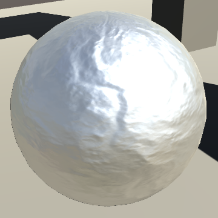 							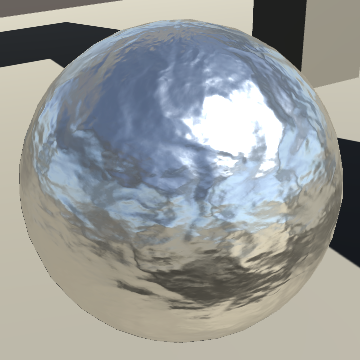 							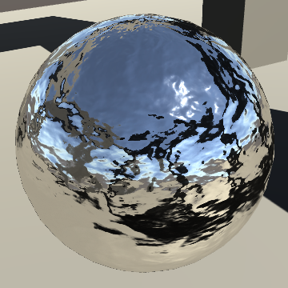 							Bumped mirrors with smoothness 0.5, 0.75, and 0.95. 						

### Metals vs. Nonmetals

Both metallic and nonmetallic surfaces can produce clear  reflections, they just look different. Specular reflections can appear  just fine on shiny dielectric materials, but they don't dominate their  appearance. There still is plenty of diffuse reflection visible.

 							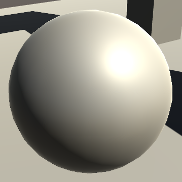 							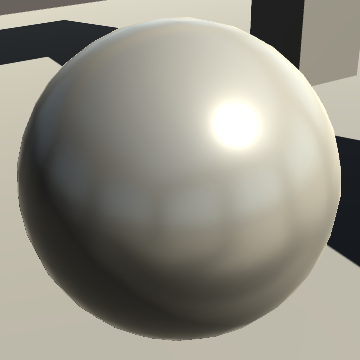 							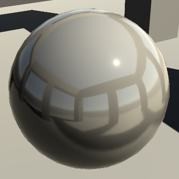 							Nonmetallic with smoothness 0.5, 0.75, and 0.95. 						

Recall that a metal colorizes its specular reflections, while a  nonmetal doesn't. This is true for the specular highlight, and also for  the specular environmental reflections.

 							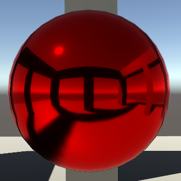 							 							Red metal and nonmetal. 						

### Mirrors and Shadows

As we saw earlier, indirect reflections are independent of the  direct illumination of a surface. This is most obvious for otherwise  shadowed areas. In the case of nonmetals, this simply results in  visually brighter surfaces. You can still see the shadows cast by the  direct light.

 							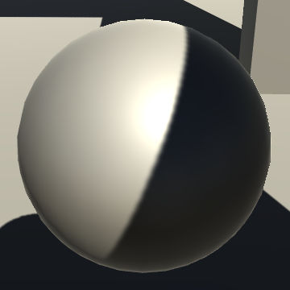 							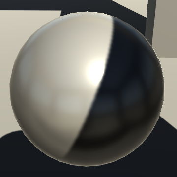 							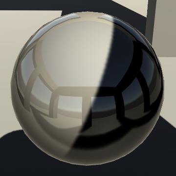 							Nonmetallic with smoothness 0.5, 0.75, and 1. 						

The same rules apply for metals, but the indirect reflections  dominate. Hence, the direct light and shadows disappear as shininess  increases. There are no shadows on a perfect mirror.

 							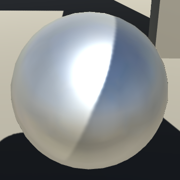 							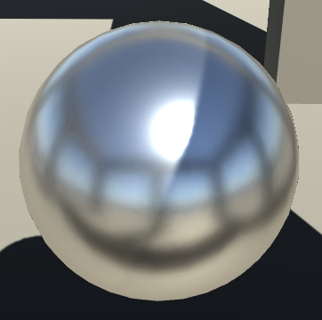 							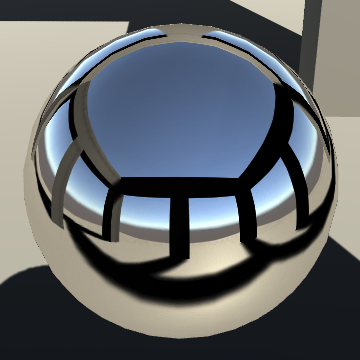 							Metallic with smoothness 0.5, 0.75, and 1. 						

While this is physically correct, real life is rarely perfect.  For example, you could see direct light and shadows on the dirt and dust  that sticks to an otherwise perfect mirror. And there are many  materials that are a mix of metallic and dielectric components. You can  simulate this by setting the *Metallic* slider somewhere in between 0 and 1.

 							
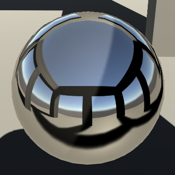 							Metallic 0.75, a dirty mirror. 						

unitypackage

## Box Projection

We currently have one reflective sphere and one reflection  probe. Both hover at the center of our building. Let's add some more  spheres, placing them near the edges of the inner square area. But let's  stick to just a single probe, at the center.

 						
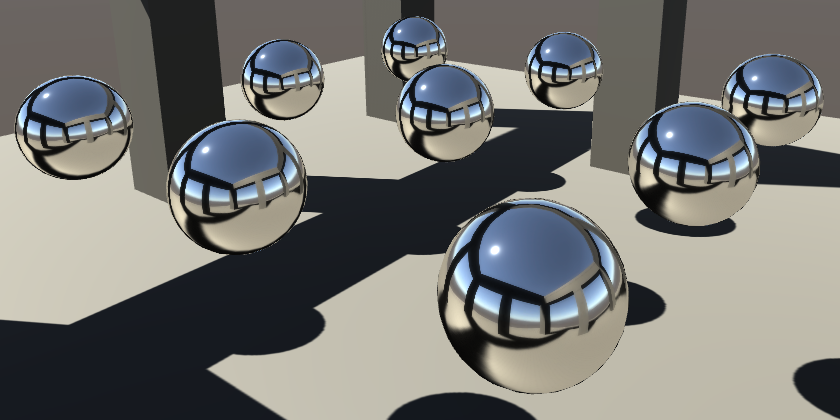 						All reflections are the same. 					

There's something wrong with the reflections. They all look the  same. The view angle is slightly different, but all spheres reflect the  environment as if they're positioned at the center of the building.  They're not, but the reflection probe is!

If we want more realistic reflections, then we have to create  one probe per sphere, placing them in the appropriate positions. That  way, each sphere gets an environment map from its own point of view.

 						
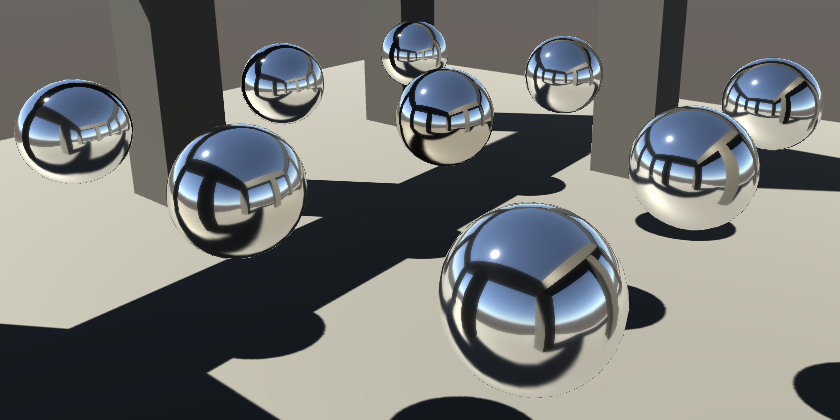 						One probe per sphere, different reflections. 					

While this is better, it is still not perfectly realistic. To  achieve that, we'd have to use one reflection probe per fragment that we  render. That would require many probes positioned on the surfaces of  the spheres. Fortunately, the approximation is not too bad for spheres.  But what about a flat mirror?

First, remove all but the central reflection probe. Then create a  quad and position it so that it covers the inside of the building and  touches the midpoints of the pillars. Turn it into a mirror and observe  the reflections.

 						
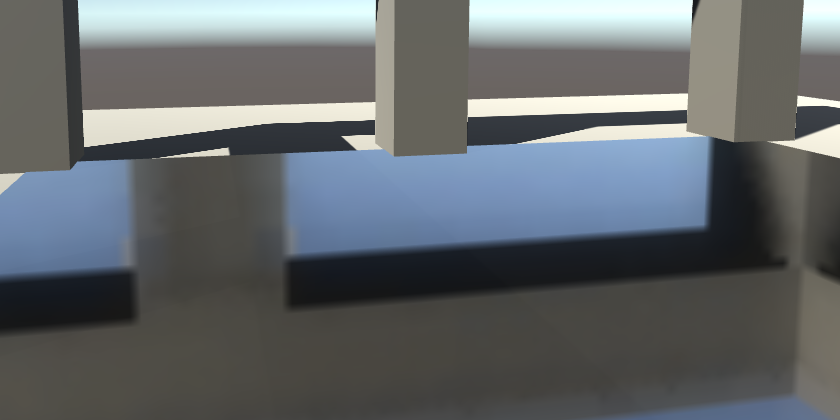 						Incorrect floor reflections. 					

The reflections don't match at all! The orientation appears  correct, but the scale and position is wrong. Had we used one probe per  fragment, the reflections would be fine. But we only have one probe.  This approximation is sufficient for things that are effectively  infinitely far away, like the skybox. But it is not appropriate for  reflections of nearby things.

When a piece of the environment is infinitely far away, we don't  care about the view position when determining its reflection. But when  most of the environment is nearby, we do care. Suppose we have a  reflection probe in the middle of an empty cubic room. Its environment  map contains the walls, floor, and ceiling of this room. If the cube map  and the room are aligned, then each face of the cube map corresponds  exactly with one of the walls, the floor, or the ceiling.

Next, suppose that we have a surface position and a reflection  direction anywhere in this room. The vector will end up intersecting the  edge of the cube somewhere. We can calculate this intersection point  with a little math. Then we can construct a vector from the center of  the room to this point. Using this vector, we can sample the cube map  and end up with correct reflection.

 						
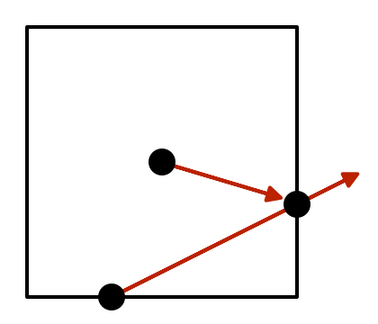 						Projecting to find the sample direction. 					

The room doesn't have to be a cube for this to work. Any  rectangular shape will do, like the inside of our building. However, the  room and the cube map have to be aligned.

### Reflection Probe Box

Reflection probes have a size and a probe origin, which define a  cubic area in world space, relative to its position. It is always  axis-aligned, which means that it ignores all rotations. It ignores  scaling too.

This area is used for two purposes. First, Unity uses these  areas to decide which probe is used when rendering an object. Second,  this area is used for box projections, which is what we are going to do.

You can show the box in the scene view when you have the probe selected. At the top of the reflection probe's inspector is a *Probe Scene Editing Mode* toggle. The left button turns on the box projection bounds gizmos.

 							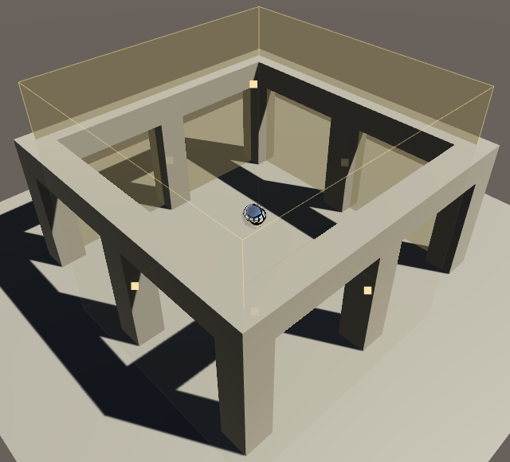 							 							Box projection bounds. 						

You can use the yellow dots at the center of the bounds faces to adjust them. You can also adjust them by editing *Size* and *Probe Origin*  vectors in the inspector. By adjusting the origin, you can move the box  relative to the sample point. You can also adjust it in the scene with  other edit mode, but it's finicky and doesn't currently work well with  undo.

Adjust the box so it covers the inside of the building,  touching the pillars and reaching all the way to the highest point. I  made it a tiny bit larger than that, to prevent flickering due to  Z-fighting of the gizmos in the scene view.

 							 							 							Adjusted bounds. 						

While we're at it, enable *Box Projection*, because that's what we want to do.

### Adjusting the Sample Direction

To compute the box projection, we require the initial  reflection direction, the position we're sampling from, the cube map  position, and the box bounds. Add a function for that to our shader,  somewhere above `CreateIndirectLight`.

```
float3 BoxProjection (
	float3 direction, float3 position,
	float3 cubemapPosition, float3 boxMin, float3 boxMax
) {
	return direction;
}
```

First, adjust the bounds so they're relative to the surface position.

```
	boxMin -= position;
	boxMax -= position;
	return direction;
```

Next, we have to scale the direction vector so it goes from the  position to the desired intersection point. Let's consider the X  dimension first. If the direction's X component is positive, then it  points towards the maximum bounds. Otherwise, it points towards the  minimum bounds. Dividing the appropriate bounds by the X component of  the direction gives us the scalar that we need. This also works when the  direction is negative, because the minimum bounds are negative as well,  producing a positive result after the division.

```
	boxMin -= position;
	boxMax -= position;
	float x = (direction.x > 0 ? boxMax.x : boxMin.x) / direction.x;
```

The same is true for the Y and Z dimensions.

```
	float x = (direction.x > 0 ? boxMax.x : boxMin.x) / direction.x;
	float y = (direction.y > 0 ? boxMax.y : boxMin.y) / direction.y;
	float z = (direction.z > 0 ? boxMax.z : boxMin.z) / direction.z;
```

We now have three scalars, but which is the correct one? That  depends on which scalar is smallest. That indicates which bounds face is  closest.

 							
 							Choosing the smallest factor. 						

```
	float z = (direction.z > 0 ? boxMax.z : boxMin.z) / direction.z;
	float scalar = min(min(x, y), z);
```

 							What happens when one of the divisions is by zero? 							 						

Now we can find the intersection point by adding the scaled  direction to the position. And by subtracting the position of the cube  map from that, we get the new projected sample direction.

 							
 							Finding the new projection direction. 						

```
	float scalar = min(min(x, y), z);
	return direction * scalar + (position - cubemapPosition);
```

 							Doesn't the new direction have to be normalized? 							 						

We can simplify this code a bit by combining the three candidate factors in a single `**float3**` expression, postponing the subtraction and division until after the appropriate bounds are selected.

```
float3 BoxProjection (
	float3 direction, float3 position,
	float3 cubemapPosition, float3 boxMin, float3 boxMax
) {
	float3 factors = ((direction > 0 ? boxMax : boxMin) - position) / direction;
	float scalar = min(min(factors.x, factors.y), factors.z);
	return direction * scalar + (position - cubemapPosition);
}
```

Now use our new function in `CreateIndirectLight` to modify the environment sample vector.

```
		envData.reflUVW = BoxProjection(
			reflectionDir, i.worldPos,
			unity_SpecCube0_ProbePosition,
			unity_SpecCube0_BoxMin, unity_SpecCube0_BoxMax
		);
```

 							
 							Projected reflections. 						

The adjusted reflections look a lot better for our flat mirror.  But it is important that the reflective surface doesn't extend beyond  the probe bounds. Scale the mirror down so it matches the bounds  exactly, touching the pillars.

 							
 							Tweaked floor mirror. 						

The reflections of the pillars now perfectly match the real  ones. At least, exactly at the edge of the mirror and probe bounds.  Everything that's closer of further away is misaligned, because the  projection is wrong for those points. This is the best we can do with a  single reflection probe.

Another thing that is obviously wrong, is that we see part of  the floor reflected by the floor mirror. This happens because the  environment map is rendered from a point of view above the floor mirror.  This can be fixed by lowering the probe origin to only slightly above  the mirror, while keeping the bounds as they are.

 							
 							Lowered probe center. 						

While such a low sample points is better for the floor mirror,  it's not so good for the floating spheres. So let's move it back up  again and have a look at the spheres.

 							 							
 							One projected probe vs. nine unprojected probes. 						

It turns out that a single box-projected probe produces  reflections quite similar to those of nine separate probes! So box  projection is a very handy trick, though it's not perfect.

### Optional Projection

Whether box projection is used varies per probe, which is controlled by their *Box Projection*  toggle. Unity stores this information in a fourth component of the cube  map position. If that component is larger than zero, then the probe  should use box projection. Let's use an if-statement to take care of  this.

```
float3 BoxProjection (
	float3 direction, float3 position,
	float4 cubemapPosition, float3 boxMin, float3 boxMax
) {
	if (cubemapPosition.w > 0) {
		float3 factors =
			((direction > 0 ? boxMax : boxMin) - position) / direction;
		float scalar = min(min(factors.x, factors.y), factors.z);
		direction = direction * scalar + (position - cubemapPosition);
	}
	return direction;
}
```

Even though we use an if-statement, that doesn't mean that the  compiled code also contains one. For example, OpenGL Core ends up with a  conditional assignment, which is not a branch.

```
    u_xlatb22 = 0.0<unity_SpecCube0_ProbePosition.w;
    u_xlat0.xyz = (bool(u_xlatb22)) ? u_xlat2.xyz : u_xlat0.xyz;
```

The same goes for Direct3D 11.

```
 147: lt r1.w, l(0.000000), cb4[2].w
 148: movc r0.xyz, r1.wwww, r2.xyzx, r0.xyzx
```

We can request and actual branch by inserting the `**UNITY_BRANCH**`  macro before our own branch. While branches should be avoided in  shaders, it is not so bad in this case. That's because the condition is  uniform. All fragments of an object use the same probe settings, so end  up taking the same branch.

```
	UNITY_BRANCH
	if (cubemapPosition.w > 0) {
		…
	}
```

The OpenGL Core now contains an obvious branch.

```
    u_xlatb29 = 0.0<unity_SpecCube0_ProbePosition.w;
    if(u_xlatb29){
        u_xlatb7.xyz = lessThan(vec4(0.0, 0.0, 0.0, 0.0), u_xlat6.xyzx).xyz;
        u_xlat7.x = (u_xlatb7.x) ? unity_SpecCube0_BoxMax.x : unity_SpecCube0_…
        u_xlat7.y = (u_xlatb7.y) ? unity_SpecCube0_BoxMax.y : unity_SpecCube0_…
        u_xlat7.z = (u_xlatb7.z) ? unity_SpecCube0_BoxMax.z : unity_SpecCube0_…
        u_xlat7.xyz = u_xlat7.xyz + (-vs_TEXCOORD4.xyz);
        u_xlat7.xyz = u_xlat7.xyz / u_xlat6.xyz;
        u_xlat29 = min(u_xlat7.y, u_xlat7.x);
        u_xlat29 = min(u_xlat7.z, u_xlat29);
        u_xlat7.xyz = vs_TEXCOORD4.xyz + (-unity_SpecCube0_ProbePosition.xyz);
        u_xlat6.xyz = u_xlat6.xyz * vec3(u_xlat29) + u_xlat7.xyz;
    //ENDIF
    }
```

And so does Direct3D 11.

```
  68: lt r5.w, l(0.000000), cb4[2].w
  69: if_nz r5.w
  70:   lt r7.xyz, l(0.000000, 0.000000, 0.000000, 0.000000), r6.xyzx
  71:   movc r7.xyz, r7.xyzx, cb4[0].xyzx, cb4[1].xyzx
  72:   add r7.xyz, r7.xyzx, -v4.xyzx
  73:   div r7.xyz, r7.xyzx, r6.xyzx
  74:   min r5.w, r7.y, r7.x
  75:   min r5.w, r7.z, r5.w
  76:   add r7.xyz, v4.xyzx, -cb4[2].xyzx
  77:   mad r6.xyz, r6.xyzx, r5.wwww, r7.xyzx
  78: endif 
```

 							Isn't there a Unity function for box projection? 							 						

unitypackage

## Blending Reflection Probes

We have nice reflections going on inside our building, but what  about outside? Once you move one of the spheres outside of the probe's  bounds, it will switch to the skybox.

 						
 						Spheres inside and outside of the probe box. 					

The switch between probe and skybox is abrupt. We could increase  the probe's box so it also covers space outside of the building. Then  we can move a sphere in and out of the building, and its reflection will  change gradually. However, the probe's point of view lies inside the  building. Using it outside of the building produces very weird  reflections.

 						
 						One large box. 					

To get decent reflection both inside and outside of the building, we have to use multiple reflection probes.

 						
 						Second reflection probe. 					

These reflections make sense, but there's still a sudden and clear transition between two different probe areas.

### Interpolating Probes

Unity supplies shaders with data of two reflection probes, so we can blend between them. The second probe is `unity_SpecCube1`.  We can sample both environment maps and interpolate depending on which  is more dominant. Unity calculates this for us, and stored the  interpolator in the fourth coordinate of `unity_SpecCube0_BoxMin`. It's set to 1 when only the first probe is used, and to lower value if there's a blend.

```
		envData.reflUVW = BoxProjection(
			reflectionDir, i.worldPos,
			unity_SpecCube0_ProbePosition,
			unity_SpecCube0_BoxMin, unity_SpecCube0_BoxMax
		);
		float3 probe0 = Unity_GlossyEnvironment(
			UNITY_PASS_TEXCUBE(unity_SpecCube0), unity_SpecCube0_HDR, envData
		);
		envData.reflUVW = BoxProjection(
			reflectionDir, i.worldPos,
			unity_SpecCube1_ProbePosition,
			unity_SpecCube1_BoxMin, unity_SpecCube1_BoxMax
		);
		float3 probe1 = Unity_GlossyEnvironment(
			UNITY_PASS_TEXCUBE(unity_SpecCube1), unity_SpecCube0_HDR, envData
		);
		indirectLight.specular = lerp(probe1, probe0, unity_SpecCube0_BoxMin.w);
```

The above code will most likely produce a compile error. Apparently, the `samplerunity_SpecCube1`  variable does not exist. That's because accessing textures requires  both a texture resource and a sampler, and the second probe doesn't have  any. Instead, it relies on the sampler of the first probe.

Use the `**UNITY_PASS_TEXCUBE_SAMPLER**` macro to combine the second probe's texture with the only sampler that we have. that gets rid of the error.

```
		float3 probe1 = Unity_GlossyEnvironment(
			UNITY_PASS_TEXCUBE_SAMPLER(unity_SpecCube1, unity_SpecCube0),
			unity_SpecCube0_HDR, envData
		);
```

 							 							Still no blending. 						

### Overlapping Probe Boxes

To make blending work, the bounds of multiple probes have to  overlap. So adjust the box of the second so it extends into the  building. The spheres in the overlap region should get blended  reflections. The inspector of the mesh renderer components also shows  which probes are being used, along with their weights.

 							 							 							Overlapping probe boxes enable blending. 						

If the transition isn't smooth enough for your liking, you can  add a third probe in between the other two. This probe's box overlaps  the other two. So when moving outside, you first blend between the inner  and middle probe, and the between the middle and outer probe.


<iframe src="https://gfycat.com/ifr/MasculineBriefBlackandtancoonhound"></iframe>

Three probes.

It is also possible to blend between a probe and the skybox. You have to change an object's *Reflection Probes* mode from  *Blend Probes* to *Blend Probes and Skybox*. The blend will happen when an object's bounding box ends up partially outside of the bounds of a probe.

 							 							 							Blending one probe and the skybox. 						

 							What about the other *Reflection Probes* modes? 							 						

### Optimizations

Sampling two probes is a lot of work. We should only do so when  there's something to blend. So add a branch based on the interpolator.  Unity also does this in the standard shaders. Once again, it's a  universal branch.

```
		float interpolator = unity_SpecCube0_BoxMin.w;
		UNITY_BRANCH
		if (interpolator < 0.99999) {
			float3 probe1 = Unity_GlossyEnvironment(
				UNITY_PASS_TEXCUBE_SAMPLER(unity_SpecCube1, unity_SpecCube0),
				unity_SpecCube0_HDR, envData
			);
			indirectLight.specular = lerp(probe1, probe0, interpolator);
		}
		else {
			indirectLight.specular = probe0;
		}
```

Unity's shaders also disable blending when the target platform is deemed incapable of handling it. This is controlled by `**UNITY_SPECCUBE_BLENDING**`,  which is defined as 1 when blending is possible, and 0 otherwise. We  can use a preprocessor conditional block to only include the code when  desired.

```
		#if UNITY_SPECCUBE_BLENDING
			float interpolator = unity_SpecCube0_BoxMin.w;
			UNITY_BRANCH
			if (interpolator < 0.99999) {
				float3 probe1 = Unity_GlossyEnvironment(
					UNITY_PASS_TEXCUBE_SAMPLER(unity_SpecCube1, unity_SpecCube0),
					unity_SpecCube0_HDR, envData
				);
				indirectLight.specular = lerp(probe1, probe0, interpolator);
			}
			else {
				indirectLight.specular = probe0;
			}
		#else
			indirectLight.specular = probe0;
		#endif
```

 							Shouldn't we use `#if defined(UNITY_SPECCUBE_BLENDING)`? 							 						

A similar optimization exists for box projection, based on the definition of `**UNITY_SPECCUBE_BOX_PROJECTION**`.

```
float3 BoxProjection (
	float3 direction, float3 position,
	float4 cubemapPosition, float3 boxMin, float3 boxMax
) {
	#if UNITY_SPECCUBE_BOX_PROJECTION
		UNITY_BRANCH
		if (cubemapPosition.w > 0) {
			float3 factors =
				((direction > 0 ? boxMax : boxMin) - position) / direction;
			float scalar = min(min(factors.x, factors.y), factors.z);
			direction = direction * scalar + (position - cubemapPosition);
		}
	#endif
	return direction;
}
```

 							Where are these two values defined? 							 						

unitypackage

## Bouncing Reflections

When you have two mirrors facing each other, you end up with a  seemingly endless cascade of nested reflections. Can we get the same in  Unity?

 						
 						No bouncing reflections. 					

Our mirrors are not included in the reflections themselves,  because they're not static. So let's make the floor mirror static. The  spheres should remain dynamic, because otherwise the probe couldn't look  through them anymore, producing weird reflections.

 						
 						Static floor mirror, black reflection. 					

The mirror now shows up in our single reflection probe, but it  appears solid black. That's because when rendering the probe, it's  environment map doesn't exist yet. It is trying to reflect itself, and  fails!

By default, Unity doesn't include reflections in environment maps. But this can be changed via the lighting settings. The *Environment Settings* section contains the *Reflection Bounces* slider, which is set to 1 by default. Let's set it to 2 instead.

 						
						
 						Two bounces. 					

When set to two bounces, Unity begins by rendering each  reflection probe as normal. Then it renders them a second time, using  the now available reflection data. As a result, the initial reflections  from the floor mirror now get included in the environment map.

Unity supports up to five bounces. That requires a lot of  rendering, so you definitely don't want to use this at run time! To see  it in action, duplicate the floor mirror and turn it into a ceiling  mirror.

 						
 						Mirrored floor and ceiling, with five bounces. 					

So it is possible to get nested reflections in Unity, but  they're limited. Also, the projection is wrong, because the probe's  bounds don't extend into the virtual space beyond the mirrors.

 						With all these limitations, are reflections useful? 						 					

The next tutorial is [Complex Materials](https://catlikecoding.com/unity/tutorials/rendering/part-9/).

unitypackage

PDF
