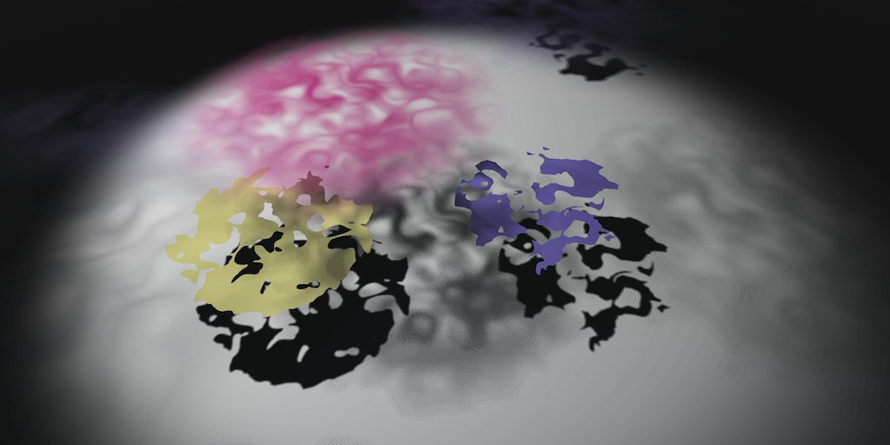
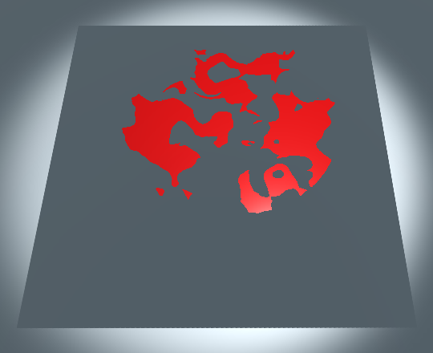
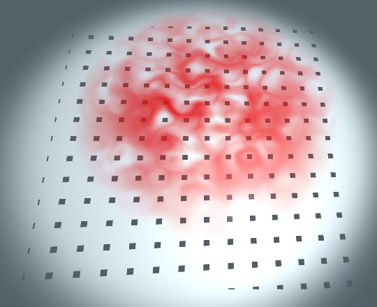
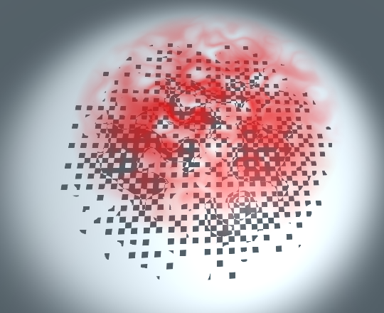
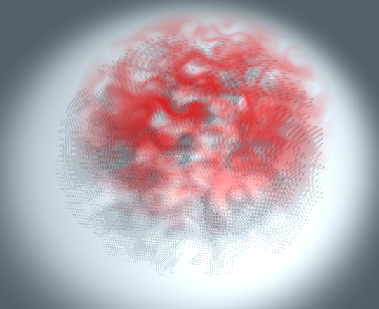
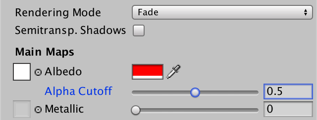

# Rendering 12

Semitransparent Shadows

- Support cutout shadows.
- Use dithering.
- Approximate semitransparent shadow.
- Toggle between semitransparent and cutout shadows.

This is part 12 of a tutorial series about rendering. In the [previous part](https://catlikecoding.com/unity/tutorials/rendering/part-11), we made it possible to render semitransparent surfaces, but we didn't cover their shadows yet. Now we'll take care of that.

This tutorial was made with Unity 5.5.0f3.

 					
 					When objects fade, so do their shadows. 				

## Cutout Shadows

Currently, the shadows of our transparent materials are always  cast as if they were solid, because that's what our shader assumes. As a  result, the shadows might appear very strange, until you realize that  you're seeing the shadows of a solid object. In the case of directional  shadows, this can also lead to invisible geometry blocking shadows.

 						 						 						Opaque and cutout rendering mode, same directional shadows. 					

In the case of spotlight or point light shadows, you'll simply get a solid shadow.

 						
 						Solid spotlight shadow. 					

### Refactoring My Shadows

In order to take transparency into account, we have to access  the alpha value in the shadow caster shader pass. This means that we'll  need to sample the albedo texture. However, this is not needed when  using the opaque rendering mode. So we're going to need multiple shader  variants for our shadows.

Right now we have two versions of our shadow programs. One  version for cube shadow maps, which is required for point lights, and  one for the other light types. Now we need to mix in even more variants.  To make this easier, we're going to rewrite our *My Shadow* include file. We'll use interpolators for all variants, and create a single vertex and fragment program.

First, move the definition of `**Interpolators**` out of the conditional block. Then make the light vector conditional instead.

```
struct VertexData {
	float4 position : POSITION;
	float3 normal : NORMAL;
};

struct Interpolators {
	float4 position : SV_POSITION;
	#if defined(SHADOWS_CUBE)
		float3 lightVec : TEXCOORD0;
	#endif
};
```

Next, write a new vertex program, which contains copies of the  two different versions. The non-cube code has to be slightly adjusted to  work with the new `**Interpolators**` output.

```
Interpolators MyShadowVertexProgram (VertexData v) {
	Interpolators i;
	#if defined(SHADOWS_CUBE)
		i.position = UnityObjectToClipPos(v.position);
		i.lightVec =
			mul(unity_ObjectToWorld, v.position).xyz - _LightPositionRange.xyz;
	#else
		i.position = UnityClipSpaceShadowCasterPos(v.position.xyz, v.normal);
		i.position = UnityApplyLinearShadowBias(i.position);
	#endif
	return i;
}
```

Do the same for the fragment program. Then get rid of the old conditional programs.

```
float4 MyShadowFragmentProgram (Interpolators i) : SV_TARGET {
	#if defined(SHADOWS_CUBE)
		float depth = length(i.lightVec) + unity_LightShadowBias.x;
		depth *= _LightPositionRange.w;
		return UnityEncodeCubeShadowDepth(depth);
	#else
		return 0;
	#endif
}

//#if defined(SHADOWS_CUBE)
//	…
//#endif
```

### Clipping Shadow Fragments

We'll take care of cutout shadows first. We cut holes in the shadows by discarding fragments, like we do for the *Coutout*  rendering mode in the other rendering passes. For this we need the  material's tint, albedo texture, and alpha cutoff settings. Add  variables for them to the top of *My Shadows*.

```
#include "UnityCG.cginc"

float4 _Tint;
sampler2D _MainTex;
float4 _MainTex_ST;
float _AlphaCutoff;
```

So we have to sample the albedo texture when we're using *Cutout*  rendering mode. Actually, we must only do this when we're not using the  albedo's alpha value to determine smoothness. When these conditions are  met, we have to pass the UV coordinates to the fragment program. We'll  define `SHADOWS_NEED_UV` as 1 when these conditions are met. This way, we can conveniently use `#if SHADOWS_NEED_UV`.

```
#include "UnityCG.cginc"

#if defined(_RENDERING_CUTOUT) && !defined(_SMOOTHNESS_ALBEDO)
	#define SHADOWS_NEED_UV 1
#endif
```

Add the UV coordinates to the vertex input data. We don't need  to make that conditional. Then conditionally add the UV to the  interpolators.

```
struct VertexData {
	float4 position : POSITION;
	float3 normal : NORMAL;
	float2 uv : TEXCOORD0;
};

struct Interpolators {
	float4 position : SV_POSITION;
	#if SHADOWS_NEED_UV
		float2 uv : TEXCOORD0;
	#endif
	#if defined(SHADOWS_CUBE)
		float3 lightVec : TEXCOORD1;
	#endif
};
```

Pass the UV coordinates on to the the interpolators in the vertex program, when needed.

```
Interpolators MyShadowVertexProgram (VertexData v) {
	…

	#if SHADOWS_NEED_UV
		i.uv = TRANSFORM_TEX(v.uv, _MainTex);
	#endif
	return i;
}
```

Copy the `GetAlpha` method from *My Lighting* to *My Shadows*. Here, whether the texture is sampled has to depend on *SHADOWS_NEED_UV*. So check for that instead of whether *_SMOOTHNESS_ALBEDO* is defined. I marked the difference.

```
float GetAlpha (Interpolators i) {
	float alpha = _Tint.a;
	#if SHADOWS_NEED_UV
		alpha *= tex2D(_MainTex, i.uv.xy).a;
	#endif
	return alpha;
}
```

Now we can retrieve the alpha value in the fragment program, and use it to clip when in *Cutout* rendering mode.

```
float4 MyShadowFragmentProgram (Interpolators i) : SV_TARGET {
	float alpha = GetAlpha(i);
	#if defined(_RENDERING_CUTOUT)
		clip(alpha - _AlphaCutoff);
	#endif
	
	…
}
```

To make this actually work, add shader features for *_RENDERING_CUTOUT* and *_SMOOTHNESS_ALBEDO* to the shadow caster pass of *My First Lighting Shader*.

```
		Pass {
			Tags {
				"LightMode" = "ShadowCaster"
			}

			CGPROGRAM

			#pragma target 3.0

			#pragma shader_feature _RENDERING_CUTOUT
			#pragma shader_feature _SMOOTHNESS_ALBEDO
			
			…
		}
```

 							 							 							Cutout shadows, directional and spotlight. 						

### Refactoring My Lighting

Before we move on, let's tweak *My Lighting* a bit as well. Notice how we've used `UnityObjectToClipPos` to transform the vertex position in *My Shadows*. We can use this function in *My Lighting* as well, instead of performing a matrix multiplication ourselves. The `UnityObjectToClipPos`  function also performs this multiplication, but uses the constant value  1 as the fourth position coordinate, instead of relying on the mesh  data.

```
Interpolators MyVertexProgram (VertexData v) {
	Interpolators i;
//	i.pos = mul(UNITY_MATRIX_MVP, v.vertex);
	i.pos = UnityObjectToClipPos(v.vertex);
	…
}
```

The data supplied via the mesh is always 1, but the shader  compiler doesn't know this. As a result, using a constant is more  efficient. Beginning with version 5.6, Unity will give a performance  warning when using an unoptimized multiplication with `**UNITY_MATRIX_MVP**`.

unitypackage

## Partial Shadows

To also support shadows for the *Fade* and *Transprant*  rendering modes, we have to add their keywords to the shader feature of  or shadow caster pass. Like the other passes, the rendering feature now  has four possible states.

```
#pragma shader_feature _ _RENDERING_CUTOUT _RENDERING_FADE _RENDERING_TRANSPARENT
```

These two modes are semitransparent instead of cutout. So their  shadows should be semitransparent as well. Let's define a convenient *SHADOWS_SEMITRANSPARENT* macro in *My Shadows* when this is the case.

```
#if defined(_RENDERING_FADE) || defined(_RENDERING_TRANSPARENT)
	#define SHADOWS_SEMITRANSPARENT 1
#endif
```

Now we have to adjust the definition of *SHADOWS_NEED_UV*, so it also gets defined in the case of semitransparent shadows.

```
#if SHADOWS_SEMITRANSPARENT || defined(_RENDERING_CUTOUT)
	#if !defined(_SMOOTHNESS_ALBEDO)
		#define SHADOWS_NEED_UV 1
	#endif
#endif
```

### Dithering

Shadow maps contain the distance to surfaces that block light.  Either the light is blocked at some distance, or it is not. Hence, there  is no way to specify that light is partially blocked by semitransparent  surfaces.

What we can do, is clip part of the shadow surface. That's what  we do for cutout shadows. But instead of clipping based on a threshold,  we could clip fragments uniformly. For example, if a surface lets half  the light through, we could clip every other fragment, using a  checkerboard pattern. Overall, the resulting shadow will appear half as  strong as a full shadow.

We don't always have to use the same pattern. Depening on the  alpha value, we can use a pattern with more or less holes. And if we mix  these patterns, we can create smooth transitions of shadow density.  Basically, we're using only two states to approximate a gradient. This  technique is known as dithering.

Unity contains a dither pattern atlas that we can use. It  contains 16 different patterns of 4 by 4 pixels. It starts with a  completely empty pattern. Each successive pattern fills one additional  pixel, until there are seven filled. Then the pattern is inverted and  reverses, until all pixels are filled.

 							
 							Dither patterns used by Unity. 						

### VPOS

To apply a dither patter to our shadow, we have to sample it.  We cannot use the UV coordinates of the mesh, because those aren't  uniform in shadow space. Instead, we'll need to use the screen-space  coordinates of the fragment. As shadow maps are rendered from the point  of view of the light, this aligns the patterns with the shadow map.

The screen-space position of a fragment can be accessed in the fragment program, by adding a parameter with the `**VPOS**` semantic to it. These coordinates are not explicitly output by the vertex program, but the GPU can make them available to us.

Unfortunately, the `**VPOS**` and `**SV_POSITION**`  semantics don't play nice. On some platforms, they end up mapped to the  same position semantic. So we cannot use both at the same time in our `**Interpolators**` struct. Fortunately, we only need to use `**SV_POSITION**` in the vertex program, while `**VPOS**` is only needed in the fragment program. So we can use a separate struct for each program.

First, rename `**Interpolators**` to `**InterpolatorsVertex**` and adjust `MyShadowVertexProgram` accordingly. Do not adjust `MyShadowFragmentProgram`.

```
struct InterpolatorsVertex {
	float4 position : SV_POSITION;
	#if SHADOWS_NEED_UV
		float2 uv : TEXCOORD0;
	#endif
	#if defined(SHADOWS_CUBE)
		float3 lightVec : TEXCOORD1;
	#endif
};

…

InterpolatorsVertex MyShadowVertexProgram (VertexData v) {
	InterpolatorsVertex i;
	#if defined(SHADOWS_CUBE)
		i.position = UnityObjectToClipPos(v.position);
		i.lightVec =
			mul(unity_ObjectToWorld, v.position).xyz - _LightPositionRange.xyz;
	#else
		i.position = UnityClipSpaceShadowCasterPos(v.position.xyz, v.normal);
		i.position = UnityApplyLinearShadowBias(i.position);
	#endif

	#if SHADOWS_NEED_UV
		i.uv = TRANSFORM_TEX(v.uv, _MainTex);
	#endif
	return i;
}
```

Then create a new `**Interpolators**` struct for use in the fragment program. It is a copy of the other struct, except that it should contain `**UNITY_VPOS_TYPE** vpos : **VPOS**` instead of `**float4** positions : **SV_POSITION**` when semitransparent shadows are needed. The `**UNITY_VPOS_TYPE**` macro is defined in *HLSLSupport*. It's usually a `**float4**`, except for Direct3D 9, which needs it to be a `**float2**`.

```
struct InterpolatorsVertex {
	…
}

struct Interpolators {
	#if SHADOWS_SEMITRANSPARENT
		UNITY_VPOS_TYPE vpos : VPOS;
	#else
		float4 positions : SV_POSITION;
	#endif
	
	#if SHADOWS_NEED_UV
		float2 uv : TEXCOORD0;
	#endif
	#if defined(SHADOWS_CUBE)
		float3 lightVec : TEXCOORD1;
	#endif
};
```

 							Do we need `position` at all in the fragment program? 							 						

### Dithering

To access Unity's dither pattern texture, add a `_DitherMaskLOD` variable to *My Shadows*. The different patterns are stored in layers of a 3D texture, so its type has to be `**sampler3D**` instead of `**sampler2D**`.

```
sampler3D _DitherMaskLOD;
```

Sample this texture in `MyShadowFragmentProgram`, if we need semitransparent shadows. This is done via the `**tex3D**`  function, which requires 3D coordinates. The third coordinate should be  in the 0–1 range and is used to select a 3D slice. As there are 16  patterns, the Z coordinate of the first pattern is 0, the coordinate for  the second pattern is 0.0625, the third is 0.128, and so on. Let's  begin by always choosing the second pattern.

```
float4 MyShadowFragmentProgram (Interpolators i) : SV_TARGET {
	float alpha = GetAlpha(i);
	#if defined(_RENDERING_CUTOUT)
		clip(alpha - _AlphaCutoff);
	#endif

	#if SHADOWS_SEMITRANSPARENT
		tex3D(_DitherMaskLOD, float3(i.vpos.xy, 0.0625));
	#endif
	
	…
}
```

The alpha channel of the dither texture is zero when a fragment  should be discarded. So subtract a small value from it and use that to  clip.

```
	#if SHADOWS_SEMITRANSPARENT
		float dither =
			tex3D(_DitherMaskLOD, float3(i.vpos.xy, 0.0625)).a;
		clip(dither - 0.01);
	#endif
```

To actually see a pattern, we have to scale it. To get a good  look at it, magnify it by a factor of 100, which is done by multiplying  the position by 0.01. A spotlight shadow allows us to get a good look at  it.

```
		tex3D(_DitherMaskLOD, float3(i.vpos.xy * 0.01, 0.0625)).a;
```

 							
 							Uniform dithering, in fade mode. 						

You can inspect all 16 dither patterns by increasing the Z  coordinate in steps of 0.0625. The shadows get fully clipped at 0, and  are fully rendered at 0.9375.

<iframe src="https://gfycat.com/ifr/BaggyUnrulyAcouchi"></iframe>

Changing dither patterns.

### Approximating Semitransparency

Instead of using a uniform pattern, we have to base the  selection of the dither pattern on the surface's alpha value. As full  opacity is reached at 0.9375, multiply the alpha value by this factor,  then use it as the Z coordinate.

```
			tex3D(_DitherMaskLOD, float3(i.vpos.xy * 0.01, alpha * 0.9375)).a;
```

 							
 							Dithering based on alpha. 						

The dithering now varies based on the surface opacity. To make  it look more like a true shadow, we'll have to scale down the pattern  size. Unity uses a factor of 0.25, so we'll use that as well.

```
			tex3D(_DitherMaskLOD, float3(i.vpos.xy * 0.25, alpha * 0.9375)).a;
```

 							
 							Scaled dithering. 						

This looks a lot better, but it's not perfect. How obvious the  dithering is depends on the resolution of the shadow map. The higher its  resolution, the smaller and less obvious the patterns.

Dithering works better with soft directional shadows. The  screen-space filtering smudges the dithered fragments to such a degree  that they're no longer obvious. The result is something that approaches  actual semitransparent shadows.

 							 							 							Hard and soft directional shadows with dithering. 						

Unfortunately, dithering is not visually stable. When things  move, you can get very obvious shadow swimming. Not just along the edge,  but across the entire shadow!

<iframe src="https://gfycat.com/ifr/GiantHotDalmatian"></iframe>

Swimming dithering.

 							What about receiving shadows on semitransparent surfaces? 							 						

unitypackage

## Optional Semitransparent Shadows

Considering the limitations of semitransparent shadows, you  might decide not to use them. You can entirely disable the shadows of an  object via the *Cast Shadows* mode of its *Mesh Renderer*  component. However, it could be that cutout shadows work just fine for a  semitransparent object. For example, when a significant portion of its  surface is fully opaque. So let's make it possible to choose between  both types of shadows.

To support this choice, add a shader feature to the shadow caster pass for a new keyword, *_SEMITRANSPARENT_SHADOWS*.

```
			#pragma shader_feature _SEMITRANSPARENT_SHADOWS
```

In *My Shadows*, only define *SHADOWS_SEMITRANSPARENT* if the *_SEMITRANSPARENT_SHADOWS* shader keyword is set.

```
#if defined(_RENDERING_FADE) || defined(_RENDERING_TRANSPARENT)
	#if defined(_SEMITRANSPARENT_SHADOWS)
		#define SHADOWS_SEMITRANSPARENT 1
	#endif
#endif
```

If the new shader feature is not enabled, then we should fall back to cutout shadows. We can do this by manually defining *_RENDERING_CUTOUT*.

```
#if defined(_RENDERING_FADE) || defined(_RENDERING_TRANSPARENT)
	#if defined(_SEMITRANSPARENT_SHADOWS)
		#define SHADOWS_SEMITRANSPARENT 1
	#else
		#define _RENDERING_CUTOUT
	#endif
#endif
```

Because the new shader feature isn't enabled yet, we now get cutout shadows when using the *Fade* or *Transparent* rendering mode.

 						
 						Fade rendering, with cutout shadows. 					

### Toggling Semitransparency

To enable semitransparent shadows again, we have to add an option for it to our custom shader UI. So add a `DoSemitransparentShadows` method to `**MyLightingShaderGUI**`.

```
	void DoSemitransparentShadows () {
	}
```

We only need to show this option when using the *Fade* or *Transparent* rendering mode. We know which mode we're using inside `DoRenderingMode`. So invoke `DoSemitransparentShadows` at the end of this method, if needed.

```
	void DoRenderingMode () {
		…

		if (mode == RenderingMode.Fade || mode == RenderingMode.Transparent) {
			DoSemitransparentShadows();
		}
	}
```

As this is a binary choice, we can represent it with a toggle button. Because the label *Semitransparent Shadows*  is wider than Unity's default inspector window width, I've abbreviated  it. For clarity, I gave it a tooltip that isn't abbreviated.

```
	void DoSemitransparentShadows () {
		bool semitransparentShadows =
			EditorGUILayout.Toggle(
				MakeLabel("Semitransp. Shadows", "Semitransparent Shadows"),
				IsKeywordEnabled("_SEMITRANSPARENT_SHADOWS")
			);
	}
```

 							
 							Semitransparent shadows checkbox. 						

Like with the other keywords, check whether the user makes a change and set the keyword accordingly.

```
	void DoSemitransparentShadows () {
		EditorGUI.BeginChangeCheck();
		bool semitransparentShadows =
			EditorGUILayout.Toggle(
				MakeLabel("Semitransp. Shadows", "Semitransparent Shadows"),
				IsKeywordEnabled("_SEMITRANSPARENT_SHADOWS")
			);
		if (EditorGUI.EndChangeCheck()) {
			SetKeyword("_SEMITRANSPARENT_SHADOWS", semitransparentShadows);
		}
	}
```

### Showing Alpha Cutoff for Shadows

When using cutout shadows, we might like to change the *Alpha Cutoff* threshold. Currently, it only shows up in our UI when using the *Cutout* rendering mode. However, it must now also be accessible in *Fade* and *Transparent* mode, when not using semitransparent shadows. We can support this by setting `shouldShowAlphaCutoff` to `**true**` in `DoSemitransparentShadows`, when appropriate.

```
	void DoSemitransparentShadows () {
		…
		if (!semitransparentShadows) {
			shouldShowAlphaCutoff = true;
		}
	}
```

 							
 							Alpha cutoff appears when needed. 						

The next tutorial is [Deferred Shading](https://catlikecoding.com/unity/tutorials/rendering/part-13/).

unitypackage

PDF
