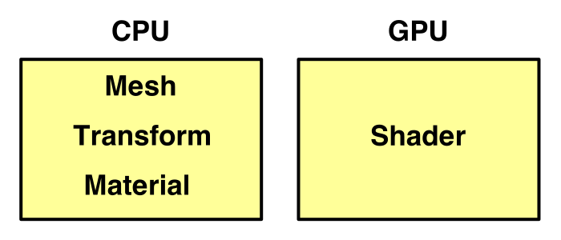
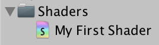
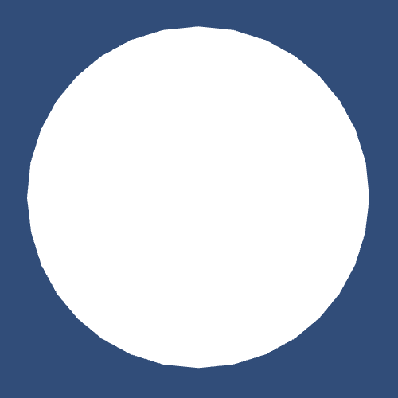
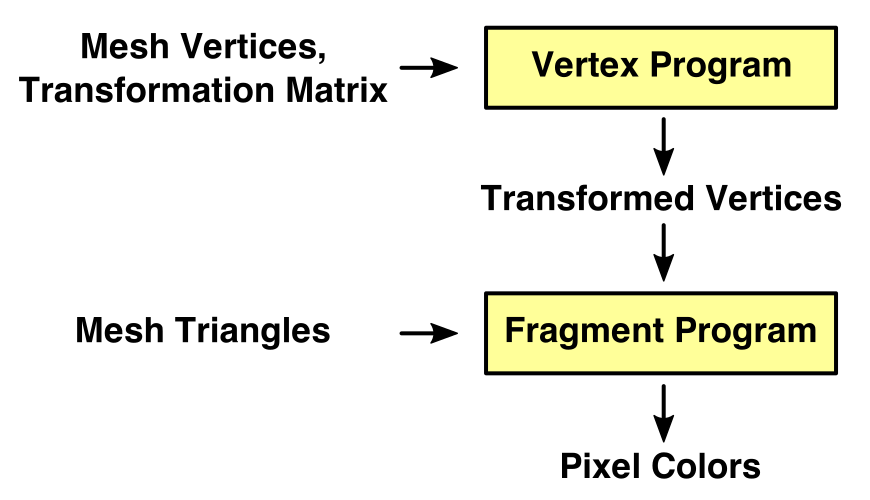
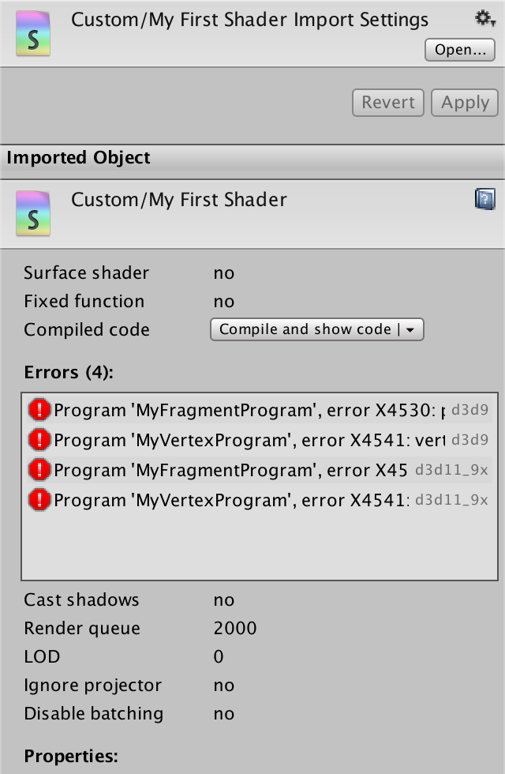
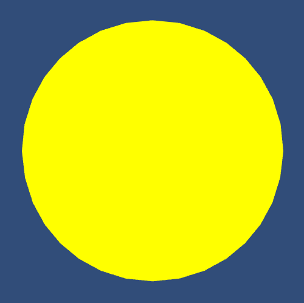
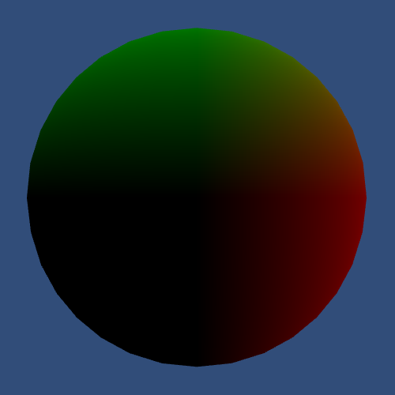
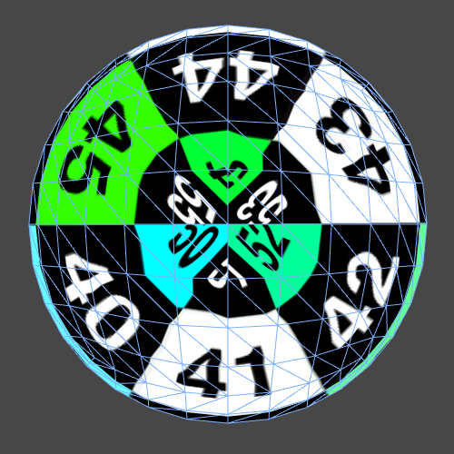
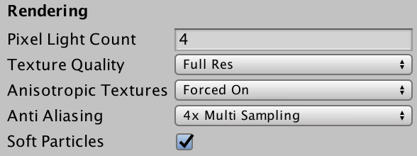

# Rendering 2

Shader Fundamentals

- Transform vertices.
- Color pixels.
- Use shader properties.
- Pass data from vertices to fragments.
- Inspect compiled shader code.
- Sample a texture, with tiling and offset.

This is the second part of a tutorial series about rendering. The [first part](https://catlikecoding.com/unity/tutorials/rendering/part-1) was about matrices. This time we'll write our first shader and import a texture.

This tutorials was made using Unity 5.4.0b10.

 					
 					Texturing a sphere. 				

## Default Scene

When you create a new scene in Unity, you start with a default camera and directional light. Create a simple sphere via *GameObject / 3D Object / Sphere*, put it at the origin, and place the camera just in front of it.

 						
 						Default sphere in default scene. 					

This is a very simple scene, yet there is already a lot of  complex rendering going on. To get a good grip on the rendering process,  it helps to get rid of all the fancy stuff and fist concern us with the  fundamentals only.

### Stripping It Down

Have a look at the lighting settings for the scene, via *Window / Lighting*. This will summon a lighting window with three tabs. We're only interested in the *Scene* tab, which is active by default.

 							
 							Default lighting settings. 						

There is a section about environmental lighting, where you can  select a skybox. This skybox is currently used for the scene background,  for ambient lighting, and for reflections. Set it to none so it is  switched off.

While you're at it, you can also switch off the precomputed and  real-time global illumination panels. We're not going to use those  anytime soon.

 							
 							No more skybox. 						

Without a skybox, the ambient source automatically switches to a  solid color. The default color is dark gray with a very slight blue  tint. Reflections become solid black, as indicated by a warning box.

As you might expect, the sphere has become darker and the  background is now a solid color. However, the background is dark blue.  Where does that color come from?

 							
 							Simplified lighting. 						

The background color is defined per camera. It renders the skybox by default, but it too falls back to a solid color.

 							
 							Default camera settings. 						

 							Why is the background color alpha 5 instead of 255? 							 						

To further simplify the rendering, deactivate the directional  light object, or delete it. This will get rid of the direct lighting in  the scene, as well as the shadows that would be cast by it. What's left  is the solid background, with the silhouette of the sphere in the  ambient color.

 							
 							In the dark. 						

unitypackage

## From Object to Image

Our very simple scene is drawn in two steps. First, the image is  filled with the background color of the camera. Then our sphere's  silhouette is drawn on top of that. 

How does Unity know that it has to draw a sphere? We have a  sphere object, and this object has a mesh renderer component. If this  object lies inside the camera's view, it should be rendered. Unity  verifies this by checking whether the object's bounding box intersects  the camera's view frustum.

 						What's a bounding box? 						 					

 						
 						Default sphere object. 					

The transform component is used to alter the position,  orientation, and size of the mesh and bounding box. Actually, the entire  transformation hierarchy is used, as described in [part 1, Matrices](https://catlikecoding.com/unity/tutorials/rendering/part-1). If the object ends up in the camera's view, it is scheduled for rendering.

Finally, the GPU is tasked with rendering the object's mesh. The  specific rendering instructions are defined by the object's material.  The material references a shader – which is a GPU program – plus any  settings it might have.

 						
 						Who controls what. 					

Our object currently has the default material, which uses  Unity's Standard shader. We're going to replace it with our own shader,  which we'll build from the ground up.

### Your First Shader

Create a new shader via *Assets / Create / Shader / Unlit Shader* and name it something like *My First Shader*.

 							
 							Your first shader. 						

Open the shader file and delete its contents, so we can start from scratch.

A shader is defined with the `**Shader**`  keyword. It is followed by a string that describes the shader menu item  that you can use to select this shader. It doesn't need to match the  file name. After that comes the block with the shader's contents.

```
Shader "Custom/My First Shader" {

}
```

Save the file. You will get a warning that the shader is not  supported, because it has no sub-shaders or fallbacks. That's because  it's empty.

Although the shader is nonfunctional, we can already assign it to a material. So create a new material via *Assets / Create / Material* and select our shader from the shader menu.

 							 							 							Material with your shader. 						

Change our sphere object so it uses our own material, instead  of the default material. The sphere will become magenta. This happens  because Unity will switch to an error shader, which uses this color to  draw your attention to the problem.

 							 							 							Material with your shader. 						

The shader error mentioned sub-shaders. You can use these to  group multiple shader variants together. This allows you to provide  different sub-shaders for different build platforms or levels of detail.  For example, you could have one sub-shader for desktops and another for  mobiles. We need just one sub-shader block.

```
Shader "Custom/My First Shader" {

	SubShader {
		
	}
}
```

The sub-shader has to contain at least one pass. A shader pass  is where an object actually gets rendered. We'll use one pass, but it's  possible to have more. Having more than one pass means that the object  gets rendered multiple times, which is required for a lot of effects.

```
Shader "Custom/My First Shader" {

	SubShader {

		Pass {

		}
	}
}
```

Our sphere might now become white, as we're using the default  behavior of an empty pass. If that happens, it means that we no longer  have any shader errors. However, you might still see old errors in the  console. They tend to stick around, not getting cleared when a shader  recompiles without errors.

 							
 							A white sphere. 						

### Shader Programs

It is now time to write our own shader program. We do so with  Unity's shading language, which is a variant of the HLSL and CG shading  languages. We have to indicate the start of our code with the `CGPROGRAM` keyword. And we have to terminate with the `ENDCG` keyword.

```
		Pass {
			CGPROGRAM

			ENDCG
		}
```

 							Why are those keywords needed? 							 						

The shader compiler is now complaining that our shader doesn't  have vertex and fragment programs. Shaders consist of two programs each.  The vertex program is responsible for processing the vertex data of a  mesh. This includes the conversion from object space to display space,  just like we did in [part 1, Matrices](https://catlikecoding.com/unity/tutorials/rendering/part-1). The fragment program is responsible for coloring individual pixels that lie inside the mesh's triangles.

 							
 							Vertex and fragment program. 						

We have to tell the compiler which programs to use, via pragma directives.

```
			CGPROGRAM

			#pragma vertex MyVertexProgram
			#pragma fragment MyFragmentProgram

			ENDCG
```

 							What's a pragma? 							 						

The compiler again complains, this time because it cannot find  the programs that we specified. That's because we haven't defined them  yet.

The vertex and fragment programs are written as methods, quite  like in C#, though they're typically referred to as functions. Let's  simply create two empty void methods with the appropriate names.

```
			CGPROGRAM

			#pragma vertex MyVertexProgram
			#pragma fragment MyFragmentProgram

			void MyVertexProgram () {

			}

			void MyFragmentProgram () {

			}

			ENDCG
```

At this point the shader will compile, and the sphere will  disappear. Or you will still get errors. It depends on which rendering  platform your editor is using. If you're using Direct3D 9, you'll  probably get errors.

### Shader Compilation

Unity's shader compiler takes our code and transforms it into a  different program, depending on the target platform. Different  platforms require different solutions. For example, Direct3D for  Windows, OpenGL for Macs, OpenGL ES for mobiles, and so on. We're not  dealing with a single compiler here, but multiple.

Which compiler you end up using depends on what you're  targeting. And as these compilers are not identical, you can end up with  different results per platform. For example, our empty programs work  fine with OpenGL and Direct3D 11, but fail when targeting Direct3D 9.

Select the shader in the editor and look at the inspector  window. It displays some information about the shader, including the  current compiler errors. There is also a *Compiled code* entry with a *Compile and show code*  button and a dropdown menu. If you click the button, Unity will compile  the shader and open its output in your editor, so you can inspect the  generated code.

 							
 							Shader inspector, with errors for all platforms. 						

You can select which platforms you manually compile the shader  for, via the dropdown menu. The default is to compile for the graphics  device that's used by your editor. You can manually compile for other  platforms as well, either your current build platform, all platforms you  have licenses for, or a custom selection. This enables you to quickly  make sure that your shader compiles on multiple platforms, without  having to make complete builds.

 							
 							Selecting OpenGLCore. 						

To compile the selected programs, close the pop-up and click the *Compile and show code* button. Clicking the little *Show* button inside the pop-up will show you the used shader variants, which is not useful right now.

For example, here is the resulting code when our shader is compiled for OpenGlCore.

```
// Compiled shader for custom platforms, uncompressed size: 0.5KB

// Skipping shader variants that would not be included into build of current scene.

Shader "Custom/My First Shader" {
SubShader { 
 Pass {
  GpuProgramID 16807
Program "vp" {
SubProgram "glcore " {
"#ifdef VERTEX
#version 150
#extension GL_ARB_explicit_attrib_location : require
#extension GL_ARB_shader_bit_encoding : enable
void main()
{
    return;
}
#endif
#ifdef FRAGMENT
#version 150
#extension GL_ARB_explicit_attrib_location : require
#extension GL_ARB_shader_bit_encoding : enable
void main()
{
    return;
}
#endif
"
}
}
Program "fp" {
SubProgram "glcore " {
"// shader disassembly not supported on glcore"
}
}
 }
}
}
```

The generated code is split into two blocks, vp and fp, for the  vertex and fragment programs. However, in the case of OpenGL both  programs end up in the vp block. The two main functions correspond two  our empty methods. So let's focus on those and ignore the other code.

```
#ifdef VERTEX
void main()
{
    return;
}
#endif
#ifdef FRAGMENT
void main()
{
    return;
}
#endif
```

And here is the generated code for Direct3D 11, stripped down  to the interesting parts. It looks quite different, but it's obvious  that the code doesn't do much.

```
Program "vp" {
SubProgram "d3d11 " {
      vs_4_0
   0: ret 
}
}
Program "fp" {
SubProgram "d3d11 " {
      ps_4_0
   0: ret 
}
}
```

As we work on our programs, I will often show the compiled code  for OpenGLCore and D3D11, so you can get an idea of what's happening  under the hood.

### Including Other Files

To produce a functional shader you need a lot of boilerplate  code. Code that defines common variables, functions, and other things.  Were this a C# program, we'd put that code in other classes. But shaders  don't have classes. They're just one big file with all the code,  without the grouping provided by classes or namespaces.

Fortunately, we can split the code into multiple files. You can use the `#include` directive to load a different file's contents into the current file. A typical file to include is *UnityCG.cginc*, so let's do that.

```
			CGPROGRAM

			#pragma vertex MyVertexProgram
			#pragma fragment MyFragmentProgram

			#include "UnityCG.cginc"

			void MyVertexProgram () {

			}

			void MyFragmentProgram () {

			}

			ENDCG
```

*UnityCG.cginc* is one of the shader include files that  are bundled with Unity. It includes a few other essential files, and  contains some generic functionality.

 							
 							Include file hierarchy, starting at UnityCG. 						

*UnityShaderVariables.cginc* defines a whole bunch of  shader variables that are necessary for rendering, like transformation,  camera, and light data. These are all set by Unity when needed.

*HLSLSupport.cginc* sets things up so you can use the same  code no matter which platform you're targeting. So you don't need to  worry about using platform-specific data types and such.

*UnityInstancing.cginc* is specifically for instancing  support, which is a specific rendering technique to reduce draw calls.  Although it doesn't include the file directly, it depends on *UnityShaderVariables*.

Note that the contents of these files are effectively copied  into your own file, replacing the including directive. This happens  during a pre-processing step, which carries out all the pre-processing  directives. Those directives are all statements that start with a hash,  like `#include` and `#pragma`. After that step is finished, the code is processed again, and it is actually compiled.

 							What happens when you include a file more than once? 							 						

### Producing Output

To render something, our shader programs have to produce  results. The vertex program has to return the final coordinates of a  vertex. How many coordinates? Four, because we're using 4 by 4  transformation matrices, as described in [part 1, Matrices](https://catlikecoding.com/unity/tutorials/rendering/part-1).

Change the function's type from `**void**` to `**float4**`. A `**float4**` is simply a collection of four floating-point numbers. Just return 0 for now.

```
			float4 MyVertexProgram () {
				return 0;
			}
```

 							Is 0 a valid value to return? 							 						

We're now getting an error about missing semantics. The  compiler sees that we're returning a collection of four floats, but it  doesn't know what that data represents. So it doesn't know what the GPU  should do with it. We have to be very specific about the output of our  program.

In this case, we're trying to output the position of the vertex. We have to indicate this by attaching the `**SV_POSITION**` semantic to our method. *SV* stands for system value, and *POSITION* for the final vertex position.

```
			float4 MyVertexProgram () : SV_POSITION {
				return 0;
			}
```

The fragment program is supposed to output an RGBA color value for one pixel. We can use a `**float4**` for that as well. Returning 0 will produce solid back.

```
			float4 MyFragmentProgram () {
				return 0;
			}
```

 							Wouldn't 0 alpha be fully transparent? 							 						

The fragment program requires semantics as well. In this case,  we have to indicate where the final color should be written to. We use `**SV_TARGET**`, which is the default shader target. This is the frame buffer, which contains the image that we are generating.

```
			float4 MyFragmentProgram () : SV_TARGET {
				return 0;
			}
```

But wait, the output of the vertex program is used as input for  the fragment program. This suggests that the fragment program should  get a parameter that matches the vertex program's output.

```
			float4 MyFragmentProgram (float4 position) : SV_TARGET {
				return 0;
			}
```

It doesn't matter what name we give to the parameter, but we have to make sure to use the correct semantic.

```
			float4 MyFragmentProgram (
				float4 position : SV_POSITION
			) : SV_TARGET {
				return 0;
			}
```

 							Can we omit the position parameter? 							 						

Our shader once again compiles without errors, but there sphere  has disappeared. This shouldn't be surprising, because we collapse all  its vertices to a single point.

If you look at the compiled OpenGLCore programs, you'll see  that they now write to output values. And our single values have indeed  been replaced with four-component vectors.

```
#ifdef VERTEX
void main()
{
    gl_Position = vec4(0.0, 0.0, 0.0, 0.0);
    return;
}
#endif
#ifdef FRAGMENT
layout(location = 0) out vec4 SV_TARGET0;
void main()
{
    SV_TARGET0 = vec4(0.0, 0.0, 0.0, 0.0);
    return;
}
#endif
```

The same is true for the D3D11 programs, although the syntax is different.

```
Program "vp" {
SubProgram "d3d11 " {
      vs_4_0
      dcl_output_siv o0.xyzw, position
   0: mov o0.xyzw, l(0,0,0,0)
   1: ret 
}
}
Program "fp" {
SubProgram "d3d11 " {
      ps_4_0
      dcl_output o0.xyzw
   0: mov o0.xyzw, l(0,0,0,0)
   1: ret 
}
}
```

### Transforming Vertices

To get our sphere back, our vertex program has to produce a  correct vertex position. To do so, we need to know the object-space  position of the vertex. We can access it by adding a variable with the `**POSITION**` semantic to our function. The position will then be provided as homogeneous coordinates of the form ⎡⎢ ⎢ ⎢ ⎢⎣xyz1⎤⎥ ⎥ ⎥ ⎥⎦

, so its type is `**float4**`.

```
			float4 MyVertexProgram (float4 position : POSITION) : SV_POSITION {
				return 0;
			}
```

Let's start by directly returning this position.

```
			float4 MyVertexProgram (float4 position : POSITION) : SV_POSITION {
				return position;
			}
```

The compiled vertex programs will now have a vertex input and copy it to their output.

```
in  vec4 in_POSITION0;
void main()
{
    gl_Position = in_POSITION0;
    return;
}
Bind "vertex" Vertex
      vs_4_0
      dcl_input v0.xyzw
      dcl_output_siv o0.xyzw, position
   0: mov o0.xyzw, v0.xyzw
   1: ret
```

 							
 							Raw vertex positions. 						

A black sphere will become visible, but it will be distorted.  That's because we're using the object-space positions as if they were  display positions. As such, moving the sphere around will make no  difference, visually.

We have to multiply the raw vertex position with the  model-view-projection matrix. This matrix combines the object's  transform hierarchy with the camera transformation and projection, like  we did in [part 1, Matrices](https://catlikecoding.com/unity/tutorials/rendering/part-1).

The 4 by 4 MVP matrix is defined in *UnityShaderVariables* as ```**UNITY_MATRIX_MVP**`. We can use the `mul`  function to multiply it with the vertex position. This will correctly  project our sphere onto the display. You can also move, rotate, and  scale it and the image will change as expected.

```
			float4 MyVertexProgram (float4 position : POSITION) : SV_POSITION {
				return mul(UNITY_MATRIX_MVP, position);
			}
```

 							
 							Correctly positioned. 						

If you check the OpenGLCore vertex program, you will notice  that a lot of uniform variables have suddenly appeared. Even though they  aren't used, and will be ignored, accessing the matrix triggered the  compiler to include the whole bunch.

 							What are uniform variables? 							 						

You will also see the matrix multiplication, encoded as a bunch of multiplications and additions.

```
uniform 	vec4 _Time;
uniform 	vec4 _SinTime;
uniform 	vec4 _CosTime;
uniform 	vec4 unity_DeltaTime;
uniform 	vec3 _WorldSpaceCameraPos;
…
in  vec4 in_POSITION0;
vec4 t0;
void main()
{
    t0 = in_POSITION0.yyyy * glstate_matrix_mvp[1];
    t0 = glstate_matrix_mvp[0] * in_POSITION0.xxxx + t0;
    t0 = glstate_matrix_mvp[2] * in_POSITION0.zzzz + t0;
    gl_Position = glstate_matrix_mvp[3] * in_POSITION0.wwww + t0;
    return;
}
```

The D3D11 compiler doesn't bother with including unused variables. It encodes the matrix multiplication with a `mul` and three `mad` instructions. The mad instruction represents a multiplication followed by an addition.

```
Bind "vertex" Vertex
ConstBuffer "UnityPerDraw" 352
Matrix 0 [glstate_matrix_mvp]
BindCB  "UnityPerDraw" 0
      vs_4_0
      dcl_constantbuffer cb0[4], immediateIndexed
      dcl_input v0.xyzw
      dcl_output_siv o0.xyzw, position
      dcl_temps 1
   0: mul r0.xyzw, v0.yyyy, cb0[1].xyzw
   1: mad r0.xyzw, cb0[0].xyzw, v0.xxxx, r0.xyzw
   2: mad r0.xyzw, cb0[2].xyzw, v0.zzzz, r0.xyzw
   3: mad o0.xyzw, cb0[3].xyzw, v0.wwww, r0.xyzw
   4: ret
```

unitypackage

## Coloring Pixels

Now that we got the shape right, let's add some color. The simplest is to use a constant color, for example yellow.

```
			float4 MyFragmentProgram (
				float4 position : SV_POSITION
			) : SV_TARGET {
				return float4(1, 1, 0, 1);
			}
```

 						
 						Yellow sphere. 					

Of course you don't always want yellow objects. Ideally, our  shader would support any color. Then you could use the material to  configure which color to apply. This is done via shader properties.

### Shader Properties

Shader properties are declared in a separate block. Add it at the top of the shader.

```
Shader "Custom/My First Shader" {

	Properties {
	}

	SubShader {
		…
	}
}
```

Put a property named *_Tint* inside the new block. You  could give it any name, but the convention is to start with an  underscore followed by a capital letter, and lowercase after that. The  idea is that nothing else uses this convention, which prevents  accidental duplicate names.

```
	Properties {
		_Tint
	}
```

The property name must be followed by a string and a type, in  parenthesis, as if you're invoking a method. The string is used to label  the property in the material inspector. In this case, the type is `**Color**`.

```
	Properties {
		_Tint ("Tint", Color)
	}
```

The last part of the property declaration is the assignment of a default value. Let's set it to white.

```
	Properties {
		_Tint ("Tint", Color) = (1, 1, 1, 1)
	}
```

Our tint property should now show up in the properties section of our shader's inspector.

 							
 							Shader Properties. 						

When you select your material, you will see the new *Tint* property, set to white. You can change it to any color you like, for example green.

 							
 							Material Properties. 						

### Accessing Properties

To actually use the property, we have to add a variable to the  shader code. Its name has to exactly match the property name, so it'll  be `_Tint`. We can then simply return that variable in our fragment program.

```
			#include "UnityCG.cginc"

			float4 _Tint;

			float4 MyVertexProgram (float4 position : POSITION) : SV_POSITION {
				return mul(UNITY_MATRIX_MVP, position);
			}

			float4 MyFragmentProgram (
				float4 position : SV_POSITION
			) : SV_TARGET {
				return _Tint;
			}
```

Note that the variable has to be defined before it can be used.  While you could change the order of fields and methods in a C# class  without issues, this is not true for shaders. The compiler works from  top to bottom. It will not look ahead.

The compiled fragment programs now include the tint variable.

```
uniform 	vec4 _Time;
uniform 	vec4 _SinTime;
uniform 	vec4 _CosTime;
uniform 	vec4 unity_DeltaTime;
uniform 	vec3 _WorldSpaceCameraPos;
…
uniform 	vec4 _Tint;
layout(location = 0) out vec4 SV_TARGET0;
void main()
{
    SV_TARGET0 = _Tint;
    return;
}
ConstBuffer "$Globals" 112
Vector 96 [_Tint]
BindCB  "$Globals" 0
      ps_4_0
      dcl_constantbuffer cb0[7], immediateIndexed
      dcl_output o0.xyzw
   0: mov o0.xyzw, cb0[6].xyzw
   1: ret
```

 							
 							Green sphere. 						

### From Vertex To Fragment

So far we've given all pixels the same color, but that is quite  limiting. Usually, vertex data plays a big role. For example, we could  interpret the position as a color. However, the transformed position  isn't very useful. So let's instead use the local position in the mesh  as a color. How do we pass that extra data from the vertex program to  the fragment program?

The GPU creates images by rasterizing triangles. It takes three  processed vertices and interpolates between them. For every pixel  covered by the triangle, it invokes the fragment program, passing along  the interpolated data.

 							
 							Interpolating vertex data. 						

 So the output of the vertex program isn't directly used as  input for the fragment program at all. The interpolation process sits in  between. Here the `**SV_POSITION**` data gets interpolated, but other things can be interpolated as well.

To access the interpolated local position, add a parameter to  the fragment program. As we only need the X, Y, and Z components, we can  suffice with a `**float3**`.  We can then output the position as if it were a color. We do have to  provide the fourth color component, which can simply remain 1.

```
			float4 MyFragmentProgram (
				float4 position : SV_POSITION,
				float3 localPosition
			) : SV_TARGET {
				return float4(localPosition, 1);
			}
```

Once again we have to use semantics to tell the compiler how to interpret this data. We'll use `**TEXCOORD0**`.

```
			float4 MyFragmentProgram (
				float4 position : SV_POSITION,
				float3 localPosition : TEXCOORD0
			) : SV_TARGET {
				return float4(localPosition, 1);
			}
```

 							We're not working with texture coordinates, so why TEXCOORD0? 							 						

The compiled fragment shaders will now use the interpolated data instead of the uniform tint.

```
in  vec3 vs_TEXCOORD0;
layout(location = 0) out vec4 SV_TARGET0;
void main()
{
    SV_TARGET0.xyz = vs_TEXCOORD0.xyz;
    SV_TARGET0.w = 1.0;
    return;
}
     ps_4_0
      dcl_input_ps linear v0.xyz
      dcl_output o0.xyzw
   0: mov o0.xyz, v0.xyzx
   1: mov o0.w, l(1.000000)
   2: ret
```

Of course the vertex program has to output the local position  for this to work. We can do that by adding an output parameter to it,  with the same `**TEXCOORD0**` semantic. The parameter names of the vertex and fragment functions do not need to match. It's all about the semantics.

```
			float4 MyVertexProgram (
				float4 position : POSITION,
				out float3 localPosition : TEXCOORD0
			) : SV_POSITION {
				return mul(UNITY_MATRIX_MVP, position);
			}
```

To pass the data through the vertex program, copy the X, Y, and Z components from `position` to `localPosition`.

```
			float4 MyVertexProgram (
				float4 position : POSITION,
				out float3 localPosition : TEXCOORD0
			) : SV_POSITION {
				localPosition = position.xyz;
				return mul(UNITY_MATRIX_MVP, position);
			}
```

 							What does `.**xyz**` do? 							 						

The extra vertex program output gets included in the compiler shaders, and we'll see our sphere get colorized.

```
in  vec4 in_POSITION0;
out vec3 vs_TEXCOORD0;
vec4 t0;
void main()
{
    t0 = in_POSITION0.yyyy * glstate_matrix_mvp[1];
    t0 = glstate_matrix_mvp[0] * in_POSITION0.xxxx + t0;
    t0 = glstate_matrix_mvp[2] * in_POSITION0.zzzz + t0;
    gl_Position = glstate_matrix_mvp[3] * in_POSITION0.wwww + t0;
    vs_TEXCOORD0.xyz = in_POSITION0.xyz;
    return;
}
Bind "vertex" Vertex
ConstBuffer "UnityPerDraw" 352
Matrix 0 [glstate_matrix_mvp]
BindCB  "UnityPerDraw" 0
      vs_4_0
      dcl_constantbuffer cb0[4], immediateIndexed
      dcl_input v0.xyzw
      dcl_output_siv o0.xyzw, position
      dcl_output o1.xyz
      dcl_temps 1
   0: mul r0.xyzw, v0.yyyy, cb0[1].xyzw
   1: mad r0.xyzw, cb0[0].xyzw, v0.xxxx, r0.xyzw
   2: mad r0.xyzw, cb0[2].xyzw, v0.zzzz, r0.xyzw
   3: mad o0.xyzw, cb0[3].xyzw, v0.wwww, r0.xyzw
   4: mov o1.xyz, v0.xyzx
   5: ret
```

 							
 							Interpreting local positions as colors. 						

### Using Structures

Do you think that the parameter lists of our programs look  messy? It will only get worse as we pass more and more data between  them. As the vertex output should match the fragment input, it would be  convenient if we could define the parameter list in one place.  Fortunately, we can do so.

We can define data structures, which are simply a collection of  variables. They are akin to structs in C#, except that the syntax is a  little different. Here is a struct that defines the data that we're  interpolating. Note the usage of a semicolon after its definition.

```
			struct Interpolators {
				float4 position : SV_POSITION;
				float3 localPosition : TEXCOORD0;
			};
```

Using this structure makes our code a lot tidier.

```
			float4 _Tint;
			
			struct Interpolators {
				float4 position : SV_POSITION;
				float3 localPosition : TEXCOORD0;
			};

			Interpolators MyVertexProgram (float4 position : POSITION) {
				Interpolators i;
				i.localPosition = position.xyz;
				i.position = mul(UNITY_MATRIX_MVP, position);
				return i;
			}

			float4 MyFragmentProgram (Interpolators i) : SV_TARGET {
				return float4(i.localPosition, 1);
			}
```

### Tweaking Colors

Because negative colors get clamped to zero, our sphere ends up  rather dark. As the default sphere has an object-space radius of ½, the  color channels end up somewhere between −½ and ½. We want to move them  into the 0–1 range, which we can do by adding ½ to all channels.

```
				return float4(i.localPosition + 0.5, 1);
```

 							
 							Local position recolored. 						

We can also apply our tint by factoring it into the result.

```
				return float4(i.localPosition + 0.5, 1) * _Tint;
uniform 	vec4 _Tint;
in  vec3 vs_TEXCOORD0;
layout(location = 0) out vec4 SV_TARGET0;
vec4 t0;
void main()
{
    t0.xyz = vs_TEXCOORD0.xyz + vec3(0.5, 0.5, 0.5);
    t0.w = 1.0;
    SV_TARGET0 = t0 * _Tint;
    return;
}
ConstBuffer "$Globals" 128
Vector 96 [_Tint]
BindCB  "$Globals" 0
      ps_4_0
      dcl_constantbuffer cb0[7], immediateIndexed
      dcl_input_ps linear v0.xyz
      dcl_output o0.xyzw
      dcl_temps 1
   0: add r0.xyz, v0.xyzx, l(0.500000, 0.500000, 0.500000, 0.000000)
   1: mov r0.w, l(1.000000)
   2: mul o0.xyzw, r0.xyzw, cb0[6].xyzw
   3: ret
```

 							
 							Local position with a red tint, so only X remains. 						

unitypackage

## Texturing

If you want to add more apparent details and variety to a mesh,  without adding more triangles, you can use a texture. You're then  projecting an image onto the mesh triangles.

Texture coordinates are used to control the projection. These  are 2D coordinate pairs that cover the entire image in a one-unit square  area, regardless of the actual aspect ratio of the texture. The  horizontal coordinate is known as U and the vertical coordinate as V.  Hence, they're usually referred to as UV coordinates.

 						
 						UV coordinates covering an image. 					

The U coordinate increases from left to right. So it is 0 at the  left side of the image, ½ halfway, and 1 at the right side. The V  coordinate works the same way, vertically. It increases from bottom to  top, except for Direct3D, where it goes from top to bottom. You almost  never need to worry about this difference.

### Using UV Coordinates

Unity's default meshes have UV coordinates suitable for texture  mapping. The vertex program can access them via a parameter with the `**TEXCOORD0**` semantic.

```
			Interpolators MyVertexProgram (
				float4 position : POSITION,
				float2 uv : TEXCOORD0
			) {
				Interpolators i;
				i.localPosition = position.xyz;
				i.position = mul(UNITY_MATRIX_MVP, position);
				return i;
			}
```

Our vertex program now uses more than one input parameter. Once again, we can use a struct to group them.

```
			struct VertexData {
				float4 position : POSITION;
				float2 uv : TEXCOORD0;
			};
			
			Interpolators MyVertexProgram (VertexData v) {
				Interpolators i;
				i.localPosition = v.position.xyz;
				i.position = mul(UNITY_MATRIX_MVP, v.position);
				return i;
			}
			
```

Let's just pass the UV coordinates straight to the fragment program, replacing the local position.

```
			struct Interpolators {
				float4 position : SV_POSITION;
				float2 uv : TEXCOORD0;
//				float3 localPosition : TEXCOORD0;
			};

			Interpolators MyVertexProgram (VertedData v) {
				Interpolators i;
//				i.localPosition = v.position.xyz;
				i.position = mul(UNITY_MATRIX_MVP, v.position);
				i.uv = v.uv;
				return i;
			}
```

We can make the UV coordinates visible, just like the local  position, by interpreting them as color channels. For example, U becomes  red, V becomes green, while blue is always 1.

```
			float4 MyFragmentProgram (Interpolators i) : SV_TARGET {
				return float4(i.uv, 1, 1);
			}
```

You'll see that the compiled vertex programs now copy the UV coordinates from the vertex data to the interpolator output.

```
in  vec4 in_POSITION0;
in  vec2 in_TEXCOORD0;
out vec2 vs_TEXCOORD0;
vec4 t0;
void main()
{
    t0 = in_POSITION0.yyyy * glstate_matrix_mvp[1];
    t0 = glstate_matrix_mvp[0] * in_POSITION0.xxxx + t0;
    t0 = glstate_matrix_mvp[2] * in_POSITION0.zzzz + t0;
    gl_Position = glstate_matrix_mvp[3] * in_POSITION0.wwww + t0;
    vs_TEXCOORD0.xy = in_TEXCOORD0.xy;
    return;
}
Bind "vertex" Vertex
Bind "texcoord" TexCoord0
ConstBuffer "UnityPerDraw" 352
Matrix 0 [glstate_matrix_mvp]
BindCB  "UnityPerDraw" 0
      vs_4_0
      dcl_constantbuffer cb0[4], immediateIndexed
      dcl_input v0.xyzw
      dcl_input v1.xy
      dcl_output_siv o0.xyzw, position
      dcl_output o1.xy
      dcl_temps 1
   0: mul r0.xyzw, v0.yyyy, cb0[1].xyzw
   1: mad r0.xyzw, cb0[0].xyzw, v0.xxxx, r0.xyzw
   2: mad r0.xyzw, cb0[2].xyzw, v0.zzzz, r0.xyzw
   3: mad o0.xyzw, cb0[3].xyzw, v0.wwww, r0.xyzw
   4: mov o1.xy, v1.xyxx
   5: ret
```

Unity wraps the UV coordinates around its sphere, collapsing  the top and bottom of the image at the poles. You'll see a seam run from  the north to the south pole where the left and right sides of the image  are joined. So along that seam you'll have U coordinate values of both 0  and 1. This is done by having duplicate vertices along the seam, being  identical except for their U coordinates.

 							 							 							UV as colors, head-on and from above. 						

### Adding a Texture

To add a texture, you need to import an image file. Here is the one I'll use for testing purposes.

 							
 							Texture for testing. 						

You can add an image to your project by dragging it onto the project view. You could also do it via the *Asset / Import New Asset...* menu item. The image will be imported as a 2D texture with the default settings, which are fine.

 							 							 							Imported texture with default settings. 						

To use the texture, we have to add another shader property. The type of a regular texture property is *2D*, as there are also other types of textures. The default value is a string referring one of Unity's default textures, either *white*, *black*, or *gray*.

The convention is to name the main texture `_MainTex`, so we'll use that. This also enables you to use the convenient `Material.mainTexture` property to access it via a script, in case you need to.

```
	Properties {
		_Tint ("Tint", Color) = (1, 1, 1, 1)
		_MainTex ("Texture", 2D) = "white" {}
	}
```

 							What are the curly brackets for? 							 						

Now we can assign the texture to our material, either by dragging or via the *Select* button.

 							
 							Texture assigned to our material. 						

We can access the texture in our shader by using a variable with type `**sampler2D**`.

```
			float4 _Tint;
			sampler2D _MainTex;
```

Sampling the texture with the UV coordinates is done in the fragment program, by using the `tex2D` function.

```
			float4 MyFragmentProgram (Interpolators i) : SV_TARGET {
				return tex2D(_MainTex, i.uv);
			}
uniform  sampler2D _MainTex;
in  vec2 vs_TEXCOORD0;
layout(location = 0) out vec4 SV_TARGET0;
void main()
{
    SV_TARGET0 = texture(_MainTex, vs_TEXCOORD0.xy);
    return;
}
SetTexture 0 [_MainTex] 2D 0
      ps_4_0
      dcl_sampler s0, mode_default
      dcl_resource_texture2d (float,float,float,float) t0
      dcl_input_ps linear v0.xy
      dcl_output o0.xyzw
   0: sample o0.xyzw, v0.xyxx, t0.xyzw, s0
   1: ret
```

 							 							 							Textured sphere. 						

Now that the texture is sampled for each fragment, it will  appear projected on the sphere. It is wrapped around it, as expected,  but it will appear quite wobbly near the poles. Why is this so?

The texture distortion happens because interpolation is linear  across triangles. Unity's sphere only has a few triangles near the  poles, where the UV coordinates are distorted most. So UV coordinates  change nonlinearly from vertex to vertex, but in between vertices their  change is linear. As a result, straight lines in the texture suddenly  change direction at triangle boundaries.

 							
 							Linear interpolation across triangles. 						

Different meshes have different UV coordinates, which produces  different mappings. Unity's default sphere uses longitude-latitude  texture mapping, while the mesh is a low-resolution cube sphere. It's  sufficient for testing, but you're better off using a custom sphere mesh  for better results.

<iframe src="https://gfycat.com/ifr/BelatedCompleteCooter"></iframe>

Different texture preview shapes.

Finally, we can factor in the tint to adjust the textured appearance of the sphere.

```
				return tex2D(_MainTex, i.uv) * _Tint;
```

 							
 							Textured with yellow tint. 						

### Tiling and Offset

After we added a texture property to our shader, the material  inspector didn't just add a texture field. It also added tiling and  offset controls. However, changing these 2D vectors currently has no  effect.

This extra texture data is stored in the material and can also  be accessed by the shader. You do so via a variable that has the same  name as the associated material, plus the *_ST* suffix. The type of this variable must be `**float4**`.

 							What does _ST mean? 							 						

```
			sampler2D _MainTex;
			float4 _MainTex_ST;
```

The tiling vector is used to scale the texture, so it is (1, 1)  by default. It is stored in the XY portion of the variable. To use it,  simply multiply it with the UV coordinates. This can be done either in  the vertex shader or the fragment shader. It makes sense to do it in the  vertex shader, so we perform the multiplications only for each vertex  instead of for every fragment.

```
			Interpolators MyVertexProgram (VertexData v) {
				Interpolators i;
				i.position = mul(UNITY_MATRIX_MVP, v.position);
				i.uv = v.uv * _MainTex_ST.xy;
				return i;
			}
```

<iframe src="https://gfycat.com/ifr/HorribleEnviousGrunion"></iframe>

Tiling.

The offset portion moves the texture around and is stored in  the ZW portion of the variable. It is added to the UV after scaling.

```
				i.uv = v.uv * _MainTex_ST.xy + _MainTex_ST.zw;
```

<iframe src="https://gfycat.com/ifr/IlliterateEarlyBarnswallow"></iframe>

Offset.

*UnityCG.cginc* contains a handy macro that simplifies this boilerplate for us. We can use it as a convenient shorthand.

```
				i.uv = TRANSFORM_TEX(v.uv, _MainTex);
```

 							What's a macro? 							 						

unitypackage

## Texture Settings

So far we've used the default texture import settings. Let's have a look at a few of the options, to see what they do.

 						
 						Default import settings. 					

The *Wrap Mode* dictates what happens when sampling with UV  coordinates that lie outside of the 0–1 range. When the wrap mode is  set to clamped, the UV are constrained to remain inside the 0–1 range.  This means that the pixels beyond the edge are the same as those that  lie on the edge. When the wrap mode is set to repeat, the UV wrap  around. This means that the pixels beyond the edge are the same as those  on the opposite side of the texture. The default mode is to repeat the  texture, which causes it to tile.

If you don't have a tiling texture, you'd want to clamp the UV  coordinates instead. This prevents the texture from repeating, instead  the texture boundary will be replicated, causing it to look stretched.

 						
						Tilingat(2,2) while clamped. 					

 						Does the wrap mode matter when staying within the 0–1 range? 						 					

### Mipmaps and Filtering

What happens when the pixels of a texture – texels – don't  exactly match the pixels they are projected onto? There is a mismatch,  which has to be resolved somehow. How this is done is controlled by the *Filter Mode*.

The most straightforward filtering mode is *Point (no filter)*.  This means that when a texture is sampled at some UV coordinates, the  nearest texel is used. This will give the texture a blocky appearance,  unless texels map exactly to display pixels. So it is typically used for  pixel-perfect rendering, or when a blocky style is desired.

The default is to use bilinear filtering. When a texture is  sampled somewhere in between two texels, those two texels are  interpolated. As textures are 2D, this happens both along the U and the V  axis. Hence bilinear filtering, not just linear filtering.

This approach works when the texel density is less than the  display pixel density, so when you're zooming in to the texture. The  result will look blurry. It doesn't work in the opposite case, when  you're zooming out of the texture. Adjacent display pixels will end up  with samples that are more than one texel apart. This means that parts  of the texture will be skipped, which will cause harsh transitions, as  if the image was sharpened.

The solution to this problem is to use a smaller texture  whenever the texel density becomes too high. The smaller the texture  appears on the display, the smaller a version of it should be used.  These smaller versions are known as mipmaps and are automatically  generated for you. Each successive mipmap has half the width and height  of the previous level. So when the original texture size is 512x512, the  mip maps are 256x256, 128x128, 64x64, 32x32, 16x16, 8x8, 4x4, and 2x2.

 							What does mipmap mean? 							 						

<iframe src="https://gfycat.com/ifr/MemorableRipeImago"></iframe>

Mipmap levels.

You can disable mipmaps if you like. First, you have the set the *Texture Type* type to *Advanced*.  They you can disable the mipmaps and apply the change. A good way to  see the difference is to use a flat object like a quad and look at it  from an angle.

 							 							 							With and without mipmaps. 						

So which mipmap level is used where, and how different do they look? We can make the transitions visible by enabling *Fadeout Mip Maps* in the advanced texture settings. When enabled, a *Fade Range*  slider will show up in the inspector. It defines a mipmap range across  which the mipmaps will transition to solid gray. By making this  transition a single step, you will get a sharp transition to gray. The  further you move the one-step range to the right, the later the  transition will occur.

 							
 							Advanced settings for mipmaps. 						

 							What is the use of fading to gray? 							 						

To get a good view of this effect, set the texture's *Aniso Level* to 0 for now.

 							 							 							 							Successive mipmap levels. 						

Once you know where the various mipmaps levels are, you should  be able to see the sudden change in texture quality between them. As the  texture projection gets smaller, the texel density increases, which  makes it look sharper. Until suddenly the next mipmap level kicks in,  and it is becomes blurry again.

So without mipmaps you go from blurry to sharp, to too sharp.  With mipmaps you go from blurry to sharp, to suddenly blurry again, to  sharp, to suddenly blurry again, and so on.

Those blurry-sharp bands are characteristic for bilinear filtering. You can get rid of them by switching the filter mode to *Trilinear*.  This works the same as bilinear filtering, but it also interpolates  between adjacent mipmap levels. Hence trilinear. This makes sampling  more expensive, but it smoothes the transitions between mipmap levels.

 							
 							Trilinear filtering between normal and gray mipmaps. 						

Another useful technique is anisotropic filtering. You might  have noticed that when you set it to 0, the texture became blurrier.  This has to do with the selection of the mipmap level.

 							What does anisotropic mean? 							 						

When a texture gets projected at an angle, due to perspective,  you often end up with one of its dimension being distorted much more  than the other. A good example is a textured ground plane. At a  distance, the forward-backward dimension of the texture will appear much  smaller that the left-right dimension.

Which mipmap level get selected is based on the worst  dimension. If the difference is large, then you will get a result that  is very blurry in one dimension. Anisotropic filtering mitigates this by  decoupling the dimensions. Besides uniformly scaling down the texture,  it also provides versions that are scaled different amounts in either  dimension. So you don't just have a mipmap for 256x256, but also for  256x128, 256x64, and so on.

 							 							 							Without and with anisotropic filtering. 						

Note that those extra mipmaps aren't pre-generated like the  regular mipmaps. Instead, they are simulated by performing extra texture  samples. So they don't require more space, but are more expensive to  sample.

 							
 							Anisotropic bilinear filtering, transitioning to gray. 						

How deep the anisotropic filtering goes is controlled by *Aniso Level*.  At 0, it is disabled. At 1, it becomes enabled and provides the minimum  effect. At 16, it is at its maximum. However, these settings are  influence by the project's quality settings.

You can access the quality settings via *Edit / Project Settings / Quality*. You will find a *Anisotropic Textures* setting in the *Rendering* section.

 							
 							Rendering quality settings. 						

When anisotropic textures are disabled, no anisotropic  filtering will happen, regardless of a texture's settings. When it is  set to *Per Texture*, it is fully controlled by each individual texture. It can also be set to *Forced On*, which will act as if each texture's *Aniso Level* is set to at least 9. However, a texture with an *Aniso Level* set to 0 still won't use anisotropic filtering.

The next tutorial is [Combining Textures](https://catlikecoding.com/unity/tutorials/rendering/part-3/).
