# Rendering 16

Static Lighting

- Sample from and render to lightmaps.
- Make baked light work with normal maps.
- Use a light probe group.

This is part 16 of a tutorial series about rendering. [Last time](https://catlikecoding.com/unity/tutorials/rendering/part-15), we rendered our own deferred lights. In this part, we'll move on to lightmapping.

This tutorial was made with Unity 5.6.0.

 					
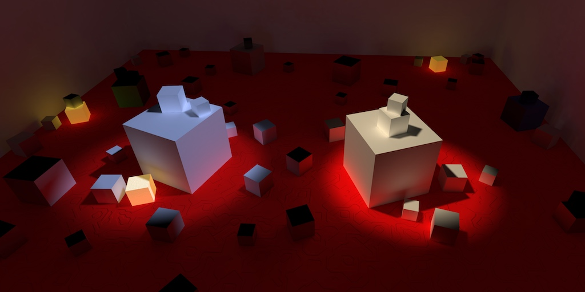 					Baking some light. 				

## Lightmapping

Performing lighting calculations is expensive. Deferred  rendering allows us to use many lights, but shadows are still a limiting  factor. If our scene is dynamic, then we cannot avoid performing these  calculations. But if both the lights and the geometry are unchanging,  then we could calculate the lighting once and reuse it. This allows use  to put many lights in our scenes, without having to render them at run  time. It also makes it possible to use area lights, which are not  available as realtime lights.

How much of the lighting is pre-computed can vary. In this  tutorial, we'll go all the way and bake everything into lightmaps. So  there won't be any dynamic lighting at all.

To try out lightmapping, I've created a simple test scene that  has a simple structure that provides shadow, plus a few spheres placed  around and inside it. Everything has the default Unity material.

 						
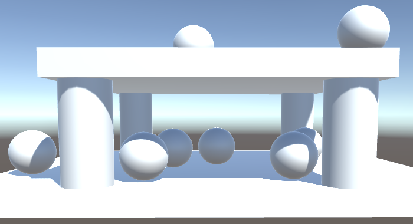 						Lightmapping test scene. 					

### Baked Lights

To begin lightmapping, change the *Mode* of the only light object to *Baked* instead of *Realtime*.

 							
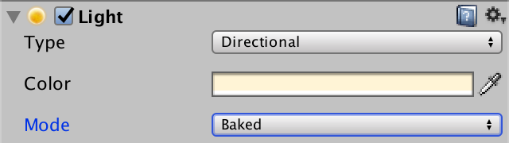 							Baked main directional light. 						

After turning the main directional light into a baked light, it  will no longer be included in dynamic lighting. From the point of view  of dynamic objects, the light doesn't exist. The only thing that remains  is the environmental lighting, which is still based on the main light.

 							
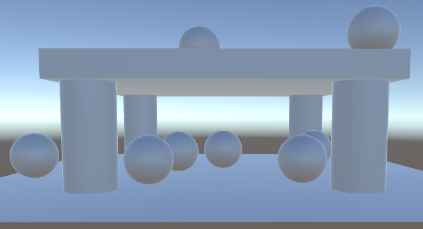 							No more direct lighting. 						

To actually enable lightmapping, turn on *Baked Global Illumination* in the *Mixed Lighting* section of the lighting window. Then set the *Lighting Mode* to *Baked Indirect*.  Despite the name, this also includes direct lighting. It's just  typically used to add indirect light to a scene. Also, make sure that *Realtime Global Illumination* is disabled, because we're not supporting that yet.

 							
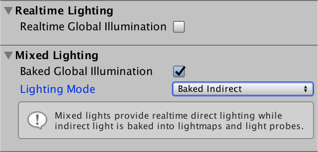 							Baked indirect mode. 						

### Static Geometry

The objects of the scene are all supposed to be fixed. They  should never be moved. To communicate this to Unity, mark them as  static. You can do that by enabling the *Static* toggle at the top right of the inspector window.

 							Do lights also have to be marked as static? 							 						

There are various subsystems that care about whether things are static or not. *Static*  also has a dropdown menu that you can use to fine-tune which systems  treat the object as being static. Right now we only care about  lightmapping, but it's simplest to just make everything completely  static.

 							
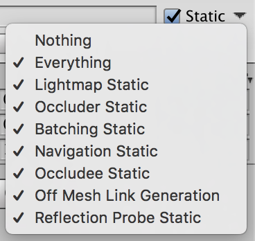 							Static object. 						

Whether an object is static for lightmapping purposes can also be seen and edited via the inspector of its mesh renderer.

 							
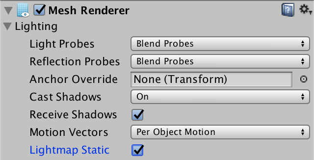 							Lightmap-static object. 						

Now that all the objects are static, they will be included in the lightmapping process.

 							
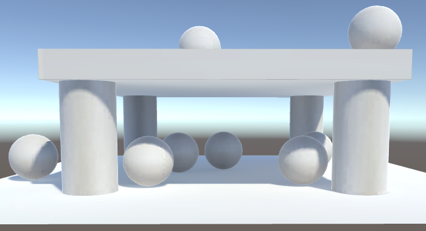 							Scene with baked lighting. 						

Note that the lightmapped result is less bright than when using  realtime lighting. That's because the specular lighting is missing,  it's only diffuse lighting. Specular lighting depends on the view angle,  so it depends on the camera. Typically, the camera is mobile, so it  cannot be included in lightmapping. This limitation means that  lightmapping can work for subtle lights and dull surfaces, but not for  strong direct lights or shiny surfaces. If you want specular lighting,  you'll have to use realtime lights. So you often end up with a mix of  baked and realtime lights.

 							Why don't I get baked light? 							 						

### Lightmapping Settings

The lighting window contains a section dedicated to  lightmapping settings. Here you can make a trade-off between quality,  size, and baking time. You can also switch between the *Enlighten* lightmapping engine and the *Progressive*  lightmapper. The latter incrementally generates lightmaps, giving  priority to what's visible in the scene view, which is convenient while  editing. I used *Enlighten* for this tutorial.

 							
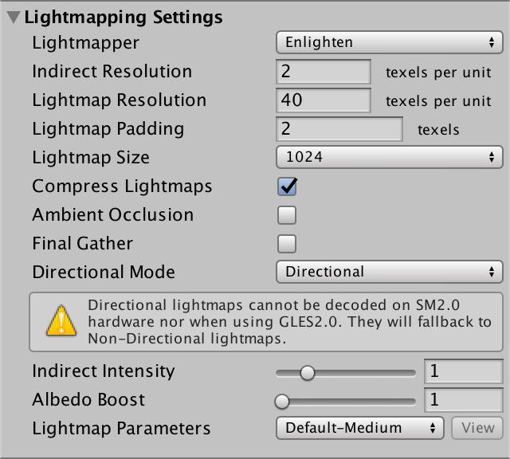 							Default lightmap settings. 						

Before you do anything else, set the *Directional Mode* to *Non-Direction*. We'll deal with the other mode later.

 							
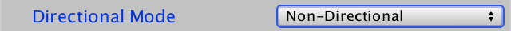 							Non-directional lightmaps. 						

The baked lighting is stored in textures. You can view them by switching the lighting window from *Scene* to *Global Maps* mode. With the default settings, my test scene easily fits in a single 1024×1024 map.

 							
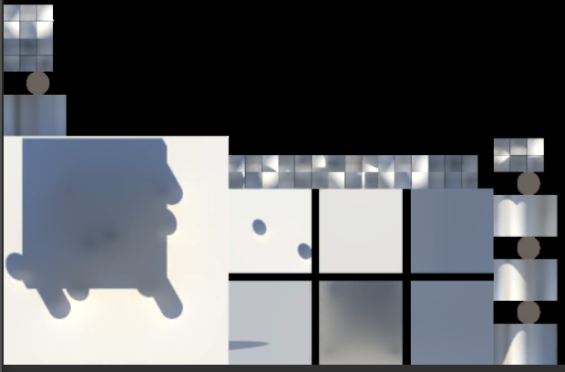 							The lightmap. 						

Unity's default objects all have UV coordinates configured for  lightmapping. For imported meshes, you either provide your own  coordinates, or let Unity generate them for you. After baking, the  texture unwraps can been seen in the lightmap. How much space they  require depends on the object's size in the scene and the lightmap  resolution settings. If they don't fit in a single map, Unity will  create additional maps.

 							 							 							Lightmap resolution makes a big difference. 						

Which settings are best varies per project. You have to tweak  the settings until you arrive at a good trade-off. Note that the visual  quality also greatly depends on the quality of the texture unwrap used  for lightmapping. The presence of absence of texture seams can produce  obvious artifacts. Unity's default sphere is a good example of this. It  is not suited for lightmapping.

### Indirect Light

While baking light means that we lose specular lighting, we  gain indirect lighting. This is light that bounces off multiple surfaces  before it reaches our eyes. Because light bounces around corners, areas  that would otherwise be shadowed still get illuminated. We cannot  compute this at realtime, but we can include bounced light while baking.

To clearly see the difference between realtime and baked  lighting, set the intensity of the environmental lighting to zero. This  eliminates the skybox, so all light comes from the directional light  only.

 							 							 							No environmental lighting, realtime vs. lightmapped. 						

Each time that a photon bounces, it loses some of its energy,  getting colored by the material it interacted with. Unity takes this  into consideration when baking indirect light. As a result, objects get  colored based on what's nearby.

 							 							 							Green floor, realtime vs. lightmapped. 						

Emissive surfaces also affect baked light. They become indirect light sources.

 							 							 							Emissive floor, realtime vs. lightmapped. 						

A special setting for indirect light is *Ambient Occlusion*.  This refers to the shadowing of indirect light that happens in corners  and creases. It is an artificial boost, which can enhance the feeling of  depth.

 							 							 							Using ambient occlusion. 						

The ambient occlusion effect is solely based on how hidden a  surface is. It doesn't consider where the light is actually coming from.  This doesn't always make sense, for example in combination with  emissive surfaces.

 							
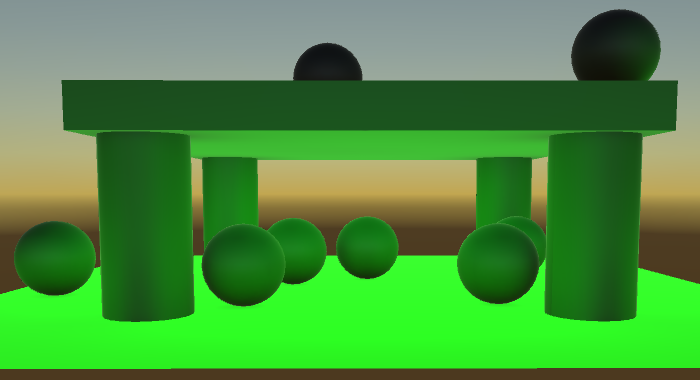 							Obviously wrong ambient occlusion. 						

### Transparency

Lightmapping can deal with semitransparent surfaces, up to a  point. Light will pass through them, although its color doesn't get  filtered by them.

 							
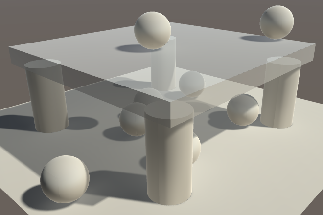 							Semitransparent roof. 						

Cutout materials work too.

 							
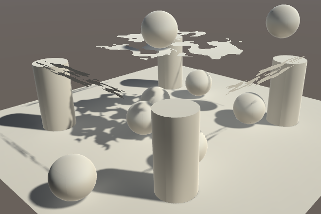 							Cutout roof. 						

However, this only works when using closed surfaces. When using  single-sided geometry like quads, the light becomes corrupted on the  non-existing side. This is fine when there's nothing on the other side,  but leads to problems when working with single-sided transparent  surfaces.

 							
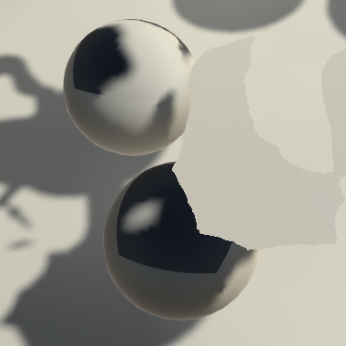 							Quad produces errors. 						

To deal with this, you have to tell the lightmapping system to  treat these surfaces as transparent. This can be done via custom  lightmapping settings. You can create these via *Asset / Create / Lightmap Parameters*.  These assets allow you to customize the lightmap calculations per  object. In this case, we're only interested in indicating that we're  dealing with a transparent object. So enable *Is Transparent*. Although it is part of the *Precomputed Realtime GI* section, it will affect all baked lighting.

 							
 							Indicating transparency. 						

To use these settings, select them via the object's mesh  renderer inspector. Your asset's name will show up in the dropdown list  for *Lightmap Parameters*.

 							 							 							Using custom parameters for transparent quads. 						

Marking an object as transparent also changes how it  contributes to indirect lighting. Transparent objects let indirect light  pass, while opaque objects block it.

unitypackage

## Using Lightmaps

Now that we know how lightmaps work, we can add support for them to *My First Lighting Shader*.  The first step of this process is to sample the lightmaps. Adjust the  spheres in the scene so they use the white material with our shader.

 						
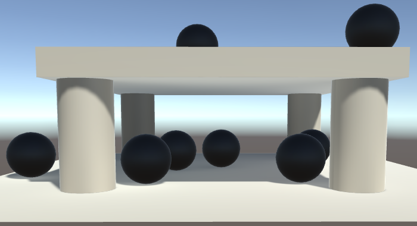 						Spheres using our white material. 					

### Lightmapped Shader Variants

When a shader is supposed to use lightmaps, Unity will look for a variant associated with the *LIGHTMAP_ON*  keyword. So we have to add a multi-compile directive for this keyword.  When using the forward rendering path, lightmaps are sampled in the base  pass only.

```
			#pragma multi_compile _ SHADOWS_SCREEN
			#pragma multi_compile _ VERTEXLIGHT_ON
			#pragma multi_compile _ LIGHTMAP_ON
			#pragma multi_compile_fog
```

When lightmaps are used, Unity will never include vertex  lights. Their keywords are mutually exclusive. So we don't need a  variant with both *VERTEXLIGHT_ON* and *LIGHTMAP_ON* at the same time.

```
			#pragma multi_compile _ SHADOWS_SCREEN
//			#pragma multi_compile _ VERTEXLIGHT_ON
//			#pragma multi_compile _ LIGHTMAP_ON
			#pragma multi_compile _ LIGHTMAP_ON VERTEXLIGHT_ON
			#pragma multi_compile_fog
```

Lightmaps are also supported in the deferred rendering path, so add the keyword to the deferred pass as well.

```
			#pragma multi_compile _ UNITY_HDR_ON
			#pragma multi_compile _ LIGHTMAP_ON
```

### Lightmap Coordinates

The coordinates used to sample the lightmap are stored in the second texture coordinates channel, uv1. So add this channel to `**VertexData**` in *My Lighting*.

```
struct VertexData {
	float4 vertex : POSITION;
	float3 normal : NORMAL;
	float4 tangent : TANGENT;
	float2 uv : TEXCOORD0;
	float2 uv1 : TEXCOORD1;
};
```

The lightmap coordinates have to be interpolated as well. Because they're mutually exclusive with vertex lights, both can use `**TEXCOORD6**`.

```
struct Interpolators {
	…

	#if defined(VERTEXLIGHT_ON)
		float3 vertexLightColor : TEXCOORD6;
	#endif

	#if defined(LIGHTMAP_ON)
		float2 lightmapUV : TEXCOORD6;
	#endif
};
```

The coordinates from the vertex data define the texture unwrap  of the mesh for lightmapping. But this doesn't tell us where in the  lightmap this unwrap is placed, nor its size. We have to scale and  offset the coordinates to arrive at the final lightmap coordinates. This  work like the transformation applied to regular texture coordinates,  except that the transformation is object-specific, instead of  material-specific. The lightmap texture is define in *UnityShaderVariables* as `unity_Lightmap`.

```
Interpolators MyVertexProgram (VertexData v) {
	…

	i.uv.xy = TRANSFORM_TEX(v.uv, _MainTex);
	i.uv.zw = TRANSFORM_TEX(v.uv, _DetailTex);

	#if defined(LIGHTMAP_ON)
		i.lightmapUV = TRANSFORM_TEX(v.uv1, unity_Lightmap);
	#endif

	…
}
```

Unfortunately, we cannot use the convenient `**TRANSFORM_TEX**` macro, because it assumes that the lightmap transformation is defined as `unity_Lightmap_ST`, while it actually is `unity_LightmapST`. Due to this inconsistency, we have to do it manually.

```
		i.lightmapUV = v.uv1 * unity_LightmapST.xy + unity_LightmapST.zw;
```

### Sampling the Lightmap

Because the lightmap data is considered to be indirect light, we'll sample it in the `CreateIndirectLight`  function. When lightmaps are available, we have to use them as the  source for the indirect light, instead of the spherical harmonics.

```
UnityIndirect CreateIndirectLight (Interpolators i, float3 viewDir) {
	…
	
	#if defined(VERTEXLIGHT_ON)
		indirectLight.diffuse = i.vertexLightColor;
	#endif

	#if defined(FORWARD_BASE_PASS) || defined(DEFERRED_PASS)
		#if defined(LIGHTMAP_ON)
			indirectLight.diffuse = 0;
		#else
			indirectLight.diffuse += max(0, ShadeSH9(float4(i.normal, 1)));
		#endif
		float3 reflectionDir = reflect(-viewDir, i.normal);
		…
	#endif

	return indirectLight;
}
```

 							Why assign instead of add to `indirectLight.diffuse`? 							 						

The exact form of `unity_Lightmap` depends on the target platform. It is defined as `**UNITY_DECLARE_TEX2D**(unity_Lightmap)`. To sample it, we'll use the `**UNITY_SAMPLE_TEX2D**` macro instead of `tex2D`. We'll get to the reason for this later.

```
			indirectLight.diffuse =
				UNITY_SAMPLE_TEX2D(unity_Lightmap, i.lightmapUV);
```

 							
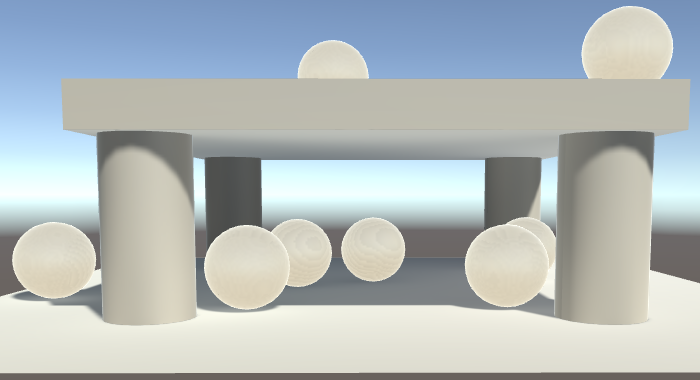 							Using raw lightmap data. 						

We now get baked indirect lighting, but it looks wrong. That's  because the lightmap data has been encoded. The colors are either stored  in RGBM format or at half intensity, to support high-intensity light.  The `DecodeLightmap` function from *UnityCG* takes care of decoding this for us.

```
			indirectLight.diffuse = DecodeLightmap(
				UNITY_SAMPLE_TEX2D(unity_Lightmap, i.lightmapUV)
			);
```

 							
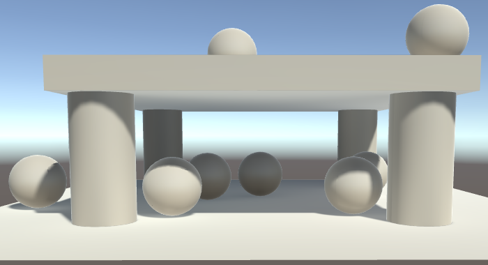 							Using decoded lightmap data. 						

unitypackage

## Creating Lightmaps

While lightmaps already seem to work with our shader, that's  only true for our simple test scene. Currently, the lightmapper always  treats our objects as opaque and solid white, even when they're not. We  have to make some adjustments to our shader and even add another pass to  fully support lightmapping.

From now on, use our own shader for all objects in the scene. The default material should no longer be used.

### Semitransprant Shadows

The lightmapper doesn't use the realtime rendering pipeline, so  it doesn't use our shader to do its work. This is most obvious when  trying to use semitransparent shadows. Make the roof cube  semitransparent by giving it a material with its tint's alpha component  set to less that 1.

 							
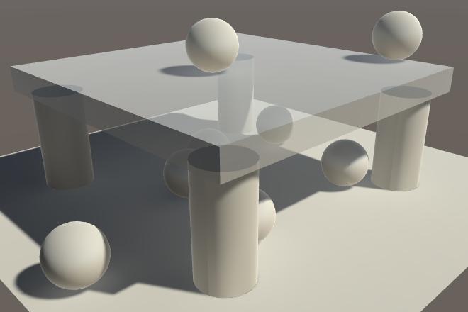 							Semitransparent roof, incorrect. 						

The lightmapper still treats the roof as if it were solid,  which is incorrect. It uses the render type of the material to determine  how to treat surfaces, which should have told it that our object is  semitransparent. In fact, it does know that the roof is semitransparent,  it just treats it as if we made it full opaque. This happens because it  uses the alpha component of the *_Color* material property, along with the main texture, to set the opacity. But we don't have that property, we use *_Tint* instead!

Unfortunately, there is not way to tell the lightmapper which  property to use. So to make lightmapping work, we have no other option  than to replace our usage of *_Tint* with *_Color*. First, update the properties of our shader.

```
	Properties {
//		_Tint ("Tint", Color) = (1, 1, 1, 1)
		_Color ("Tint", Color) = (1, 1, 1, 1)
		…
	}
```

Then, to keep our shader functional, we also have to replace the corresponding variable in *My Lighting*.

```
//float4 _Tint;
float4 _Color;
…

float3 GetAlbedo (Interpolators i) {
	float3 albedo = tex2D(_MainTex, i.uv.xy).rgb * _Color.rgb;
	…
}

float GetAlpha (Interpolators i) {
	float alpha = _Color.a;
	…
}
```

The same goes for *My Shadows*.

```
//float4 _Tint;
float4 _Color;
…

float GetAlpha (Interpolators i) {
	float alpha = _Color.a;
	…
}
```

And we also have to adjust `**MyLightingShaderGUI**`.

```
	void DoMain () {
		GUILayout.Label("Main Maps", EditorStyles.boldLabel);

		MaterialProperty mainTex = FindProperty("_MainTex");
		editor.TexturePropertySingleLine(
			MakeLabel(mainTex, "Albedo (RGB)"), mainTex, FindProperty("_Color")
		);

		…
	}
```

 							
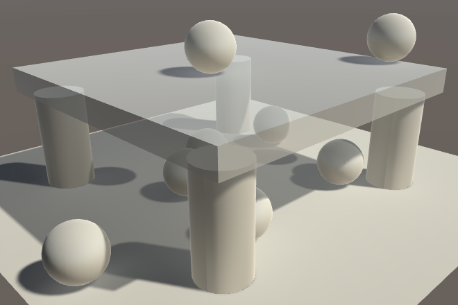 							Semitransparent roof, correct. 						

### Cutout Shadows

Cutout shadows have a similar problem. The lightmapper expects the alpha cutoff value to be stored in the *_Cutoff* property, but we're using *_AlphaCutoff*. As a result, it uses a default cutoff of 1.

 							
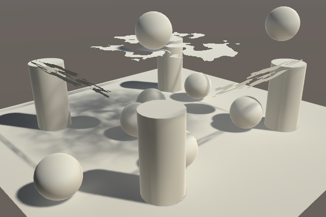 							Cutout roof, incorrect. 						

The solution is to again adopt Unity's naming convention. So replace the property.

```
	Properties {
		…

//		_AlphaCutoff ("Alpha Cutoff", Range(0, 1)) = 0.5
		_Cutoff ("Alpha Cutoff", Range(0, 1)) = 0.5

		…
	}
```

Adjust *My Lighting* to match the new name.

```
//float _AlphaCutoff;
float _Cutoff;

…

FragmentOutput MyFragmentProgram (Interpolators i) {
	float alpha = GetAlpha(i);
	#if defined(_RENDERING_CUTOUT)
		clip(alpha - _Cutoff);
	#endif

	…
}
```

Update *My Shadows* too.

```
//float _AlphaCutoff;
float _Cutoff;

…

float4 MyShadowFragmentProgram (Interpolators i) : SV_TARGET {
	float alpha = GetAlpha(i);
	#if defined(_RENDERING_CUTOUT)
		clip(alpha - _Cutoff);
	#endif

	…
}
```

And `**MyLightingShaderGUI**` as well.

```
	void DoAlphaCutoff () {
		MaterialProperty slider = FindProperty("_Cutoff");
		EditorGUI.indentLevel += 2;
		editor.ShaderProperty(slider, MakeLabel(slider));
		EditorGUI.indentLevel -= 2;
	}
```

 							
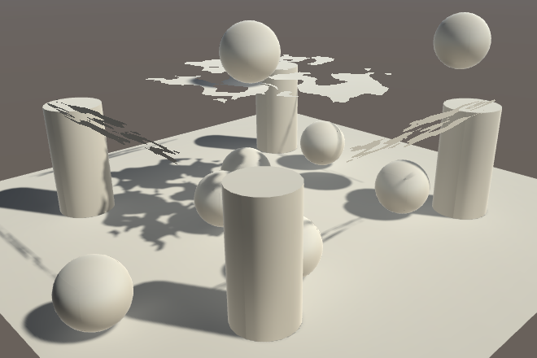 							Cutout roof, correct. 						

### Adding a Meta Pass

The next step is to make sure that the lightmapper uses the  correct surface albedo and emission. Right now, everything is always  solid white. You can see this by making the floor green. It should  result in green indirect light, but it stays white.

 							
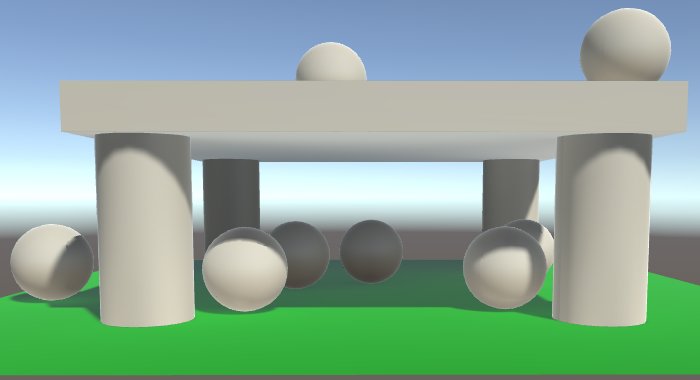 							Green floor, incorrect. 						

To figure out the surface color of objects, the lightmapper looks for a shader pass with its light mode set to *Meta*.  This pass is only used by the lightmapper and isn't included in builds.  So let's add such a pass to our shader. It's a basic pass that  shouldn't use culling. Put the code for it in a new *My Lightmapping* include file.

```
		Pass {
			Tags {
				"LightMode" = "Meta"
			}

			Cull Off

			CGPROGRAM

			#pragma vertex MyLightmappingVertexProgram
			#pragma fragment MyLightmappingFragmentProgram

			#include "My Lightmapping.cginc"

			ENDCG
		}
```

Now we need to determine the albedo, specular color,  smoothness, and emission. So copy the required variables and functions  from *My Lighting* to *My Lightmapping*.  We only need the vertex position and uv coordinates for this. Normals  and tangents are not used, but we will need the lightmap coordinates in  the vertex shader.  						 						 						 						

```
#if !defined(MY_LIGHTMAPPING_INCLUDED)
#define MY_LIGHTMAPPING_INCLUDED

#include "UnityPBSLighting.cginc"

float4 _Color;
sampler2D _MainTex, _DetailTex, _DetailMask;
float4 _MainTex_ST, _DetailTex_ST;

sampler2D _MetallicMap;
float _Metallic;
float _Smoothness;

sampler2D _EmissionMap;
float3 _Emission;

struct VertexData {
	float4 vertex : POSITION;
	float2 uv : TEXCOORD0;
	float2 uv1 : TEXCOORD1;
};

struct Interpolators {
	float4 pos : SV_POSITION;
	float4 uv : TEXCOORD0;
};

float GetDetailMask (Interpolators i) {
	…
}

float3 GetAlbedo (Interpolators i) {
	…
}

float GetMetallic (Interpolators i) {
	…
}

float GetSmoothness (Interpolators i) {
	…
}

float3 GetEmission (Interpolators i) {
	…
}

#endif
```

We can use the functions as they are, except for `GetEmission`. That function only does something when it's used in either the forwards base pass or the deferred pass. In *My Lightmapping*, we can simply remove this restriction.

```
float3 GetEmission (Interpolators i) {
//	#if defined(FORWARD_BASE_PASS) || defined(DEFERRED_PASS)
	#if defined(_EMISSION_MAP)
		return tex2D(_EmissionMap, i.uv.xy) * _Emission;
	#else
		return _Emission;
	#endif
//	#else
//		return 0;
//	#endif
}
```

These functions will only work when the appropriate keywords are defined, so add shader features for them to the pass.

```
			#pragma vertex MyLightmappingVertexProgram
			#pragma fragment MyLightmappingFragmentProgram

			#pragma shader_feature _METALLIC_MAP
			#pragma shader_feature _ _SMOOTHNESS_ALBEDO _SMOOTHNESS_METALLIC
			#pragma shader_feature _EMISSION_MAP
			#pragma shader_feature _DETAIL_MASK
			#pragma shader_feature _DETAIL_ALBEDO_MAP

			#include "My Lightmapping.cginc"
```

### Vertex Program

The vertex program is simple for this pass. Convert the position and transform the texture coordinates.

```
Interpolators MyLightmappingVertexProgram (VertexData v) {
	Interpolators i;
    i.pos = UnityObjectToClipPos(v.vertex);

	i.uv.xy = TRANSFORM_TEX(v.uv, _MainTex);
	i.uv.zw = TRANSFORM_TEX(v.uv, _DetailTex);
	return i;
}
```

However, we're not actually rendering for a camera, we're  rendering for the lightmapper. We're associating colors with an object's  texture unwrap in the lightmap. To perform this mapping, we have to use  the lightmap coordinates instead of the vertex position, with the  appropriate transformation.

```
	Interpolators i;
	v.vertex.xy = v.uv1 * unity_LightmapST.xy + unity_LightmapST.zw;
	v.vertex.z = 0;
    i.pos = UnityObjectToClipPos(v.vertex);
```

It turns out that to make this work on all machines, the Z  coordinate of the vertex position has to be used somehow, even though we  don't use it. Unity's shaders use a dummy value for this, so we'll  simply do the same.

```
	Interpolators i;
	v.vertex.xy = v.uv1 * unity_LightmapST.xy + unity_LightmapST.zw;
	v.vertex.z = v.vertex.z > 0 ? 0.0001 : 0;
    i.pos = UnityObjectToClipPos(v.vertex);
```

### Fragment Program

In the fragment program, we'll have to output both the albedo  and emissive colors. The lightmapper will do this by performing the pass  twice, once for each output. To make this easy for us, we can use the `UnityMetaFragment` function defined in the *UnityMetaPass* include file. It has a `**UnityMetaInput**`  structure as parameter which contains both the albedo and emission. The  function will decide which one to output and how to encode it.

`**UnityMetaInput**`  also contains the specular color, even though it isn't stored in the  lightmap. It's used for some editor visualizations, which we'll ignore  at this point.

```
#include "UnityPBSLighting.cginc"
#include "UnityMetaPass.cginc"

…

float4 MyLightmappingFragmentProgram (Interpolators i) : SV_TARGET {
	UnityMetaInput surfaceData;
	surfaceData.Emission = 0;
	surfaceData.Albedo = 0;
	surfaceData.SpecularColor = 0;
	return UnityMetaFragment(surfaceData);
}
```

 							What does `UnityMetaFragment` look like? 							 						

 							
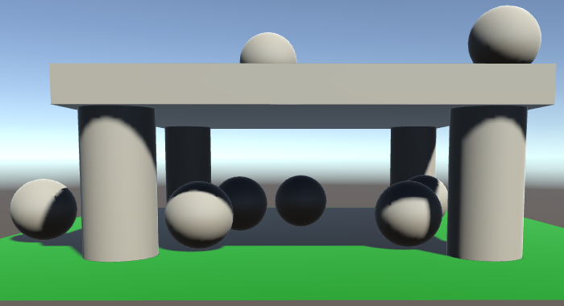 							Indirect light set to zero. 						

To get the emissive color, we can simple use `GetEmission`. To get the albedo, we have to use `DiffuseAndSpecularFromMetallic`  again. That function has output parameters for the specular color and  reflectivity, so we have to provide those even though we don't use them  outside the function. We can use `surfaceData.SpecularColor` to catch the specular color.

```
float4 MyLightmappingFragmentProgram (Interpolators i) : SV_TARGET {
	UnityMetaInput surfaceData;
	surfaceData.Emission = GetEmission(i);
	float oneMinusReflectivity;
	surfaceData.Albedo = DiffuseAndSpecularFromMetallic(
		GetAlbedo(i), GetMetallic(i),
		surfaceData.SpecularColor, oneMinusReflectivity
	);
//	surfaceData.SpecularColor = 0;
	return UnityMetaFragment(surfaceData);
}
```

 							
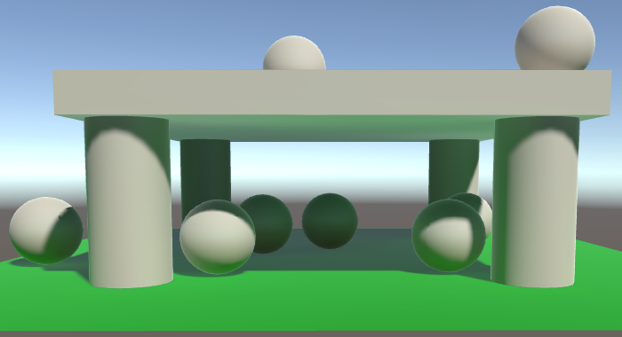 							Colored indirect light. 						

This works for indirect light, but emissive light might not yet  appear in the light map. That's because the lightmapper doesn't always  include a pass for the emissive light. Materials have to signal that  they have emissive light to contribute to the baking process. This is  done via the `Material.globalIlluminationFlags` property. For now, let's always indicate that the emissive light should be baked, when its emission is edited.

```
	void DoEmission () {
		…
		if (EditorGUI.EndChangeCheck()) {
			if (tex != map.textureValue) {
				SetKeyword("_EMISSION_MAP", map.textureValue);
			}

			foreach (Material m in editor.targets) {
				m.globalIlluminationFlags =
					MaterialGlobalIlluminationFlags.BakedEmissive;
			}
		}
	}
```

### Rough Metals

Our shader now appears to work correctly, but it doesn't  exactly match the results of the standard shader. This is most obvious  when using a colored metal with very low smoothness.

 							 							 							Rough green metal, standard vs. our shader. 						

The idea is that very rough metals should produce more indirect  light than our current calculations suggest. The standard shader  compensates for this by adding part of the specular color to the albedo.  It uses the `SmoothnessToRoughness` function from *UnityStandardBRDF* to determine a roughness value based on smoothness, halves it, and uses that to scale the specular color.

```
	float roughness = SmoothnessToRoughness(GetSmoothness(i)) * 0.5;
	surfaceData.Albedo += surfaceData.SpecularColor * roughness;

	return UnityMetaFragment(surfaceData);
```

 							What does `SmoothnessToRoughness` compute? 							 						

 							
 							Tweaked albedo. 						

unitypackage

## Directional Lightmaps

The lightmapper only uses the vertex data of geometry, it  doesn't take normal maps into account. The lightmap resolution is too  low to capture the details provided by typical normal maps. This means  that the static lighting will be flat. This becomes very obvious when  using a material with a normal map.

 						 						 						Using normal maps, realtime vs. lightmapped. 					

When switching from realtime to baked lighting, the influence of  the normal maps almost completely disappear. You only see them because  they're still used for environmental reflections.

### Directionality

It is possible to make normal maps work with baked lighting, by changing the *Directional Mode* back to *Directional*.

 							
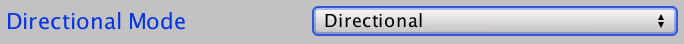 							Enabling directional lightmaps again. 						

When using directional lightmaps, Unity will create two maps  instead of just one. The first map contains the lighting information as  usual, known as the intensity map. The second map is known as the  directionality map. It contains the direction that most of the baked  light is coming from.

 							
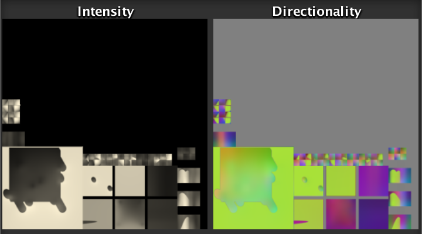 							Intensity and directionality maps. 						

When the directionality map is available, we can use it to  perform simple diffuse shading with the baked light. This makes it  possible to apply normal maps. Note that only a single light direction  is known, so the shading will be an approximation. As long as there is  at least a fairly dominant light direction when the lighting is strong,  the results will appear fine.

### Sampling the Direction

When directional lightmaps are available, Unity will look for a shader variant with both the *LIGHTMAP_ON* and *DIRLIGHTMAP_COMBINED* keywords. Instead of adding multi-compile directives for that manually, we can use `#pragma multi_compile_fwdbase` in the forward base pass. It will take care of all the lightmapping keywords, and also the *VERTEXLIGHT_ON* keyword.

```
//			#pragma multi_compile _ SHADOWS_SCREEN
//			#pragma multi_compile _ LIGHTMAP_ON VERTEXLIGHT_ON
			#pragma multi_compile_fwdbase
			#pragma multi_compile_fog
```

We can do the same for the deferred pass, but here we have to use the `#pragma multi_compile_prepassfinal` directive. It takes care of the lightmapping and the HDR keywords.

 							What is prepass final? 							 						

```
//			#pragma multi_compile _ UNITY_HDR_ON
//			#pragma multi_compile _ LIGHTMAP_ON
			#pragma multi_compile_prepassfinal
```

The baked light direction is needed directly after retrieving the baked light itself, in `CreateIndirectLight`. The directionality map is made available via `unity_LightmapInd`.

```
		#if defined(LIGHTMAP_ON)
			indirectLight.diffuse =
				DecodeLightmap(UNITY_SAMPLE_TEX2D(unity_Lightmap, i.lightmapUV));
			
			#if defined(DIRLIGHTMAP_COMBINED)
				float4 lightmapDirection = UNITY_SAMPLE_TEX2D(
					unity_LightmapInd, i.lightmapUV
				);
			#endif
		#else
			indirectLight.diffuse += max(0, ShadeSH9(float4(i.normal, 1)));
		#endif
```

However, this will result in a compile error. That's because a  texture variable actually consists of two parts. There's the texture  resource, and there's the sampler state. The sampler state determines  how the texture is sampled, which includes the filter and clamp mode.  Usually, both parts are defined per texture, but this is not required on  all platforms. It can also be possible to separate them, which allows  us to define a single sampler state for multiple textures.

Because the intensity and the directionality maps are always  sampled in the same way, Unity uses a single sampler state for them,  when possible. That's why we had to use the `**UNITY_SAMPLE_TEX2D**`  macro when sampling the intensity map. The directionality map has been  defined without a sampler. To sample it, we have to use the `**UNITY_SAMPLE_TEX2D_SAMPLER**` macro to explicitly tell it which sampler to use.

```
				float4 lightmapDirection = UNITY_SAMPLE_TEX2D_SAMPLER(
					unity_LightmapInd, unity_Lightmap, i.lightmapUV
				);
```

### Using the Direction

To use the direction, we first have to decode it. Then we can  perform the dot product with the normal vector to find the diffuse  factor and apply it to the color. But the directionality map doesn't  actually contain a unit-length direction, it is a bit more involved than  that. Fortunately, we can use the `DecodeDirectionalLightmap` function from *UnityCG* to both decode the directionality data and perform the shading for us.

```
				float4 lightmapDirection = UNITY_SAMPLE_TEX2D_SAMPLER(
					unity_LightmapInd, unity_Lightmap, i.lightmapUV
				);
				indirectLight.diffuse = DecodeDirectionalLightmap(
					indirectLight.diffuse, lightmapDirection, i.normal
				);
```

 							
 							Using directional lightmaps. 						

 							What does `DecodeDirectionalLightmap` do? 							 						

unitypackage

## Light Probes

Lightmaps only work for static objects, not dynamic ones. As a  result, dynamic objects do not fit into a scene with baked lighting.  This is extremely obvious when there are no realtime lights at all.

 						
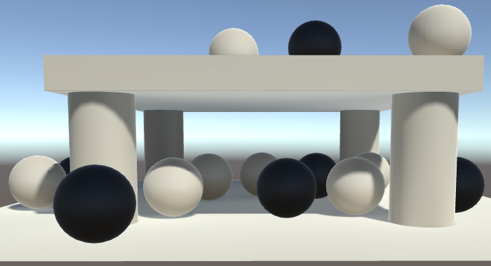 						Dynamic objects are obvious. 					

 					 					To better mix static and dynamic objects, we have to somehow apply  the baked lighting to dynamic objects as well. Unity has light probes  for that. A light probe is a point in space that has information about  the lighting at that location. Instead of a texture, it uses spherical  harmonics to store this information. When available, these probes will  be used for dynamic objects, instead of the global environmental data.  So all we have to do is create some probes, wait until they're baked,  and our shader will automatically use them. 					 					

### Creating a Light Probe Group

Add a group of light probes to the scene via *GameObject / Light / Light Probe Group*.  This will create a new game object with eight probes in a cube  formation. They will immediately be used when shading dynamic objects.

 							
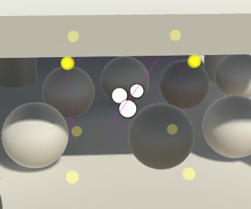 							A new light probe group. 						

Via its inspector, you can edit the light probe group, after enabling the *Edit Light Probes*  mode. When enabled, you can select individual probes and either move  them in the scene view, or adjust them via the inspector. You can  manipulate, duplicate, and delete individual probes as if they were game  objects.

 							
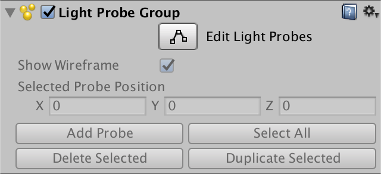 							Light probe group inspector. 						

You do not have to explicitly enable the edit mode. Selecing  the group in the scene view is enough to start editing the probes. To  stop editing them, deselect the group.

### Placing Light Probes

The light probe group divides the volume it encloses into  tetrahedral regions. Four probes define the corners of a tetrahedron.  These probes are interpolated to determine the final spherical harmonics  that are used for a dynamic object, depending on its position inside  the tetrahedron. This means that dynamic objects are treated as a single  point, so it only works well for fairly small objects.

The tetrahedrons are generated automatically while you edit the  probes. You don't need to know their configuration, but their  visualization can help you see the relative position of probes.

Placing light probes is a matter of tweaking them until you get  acceptable results, just like fiddling with lightmap settings. Begin by  encasing the area that will contain dynamic objects.

 							
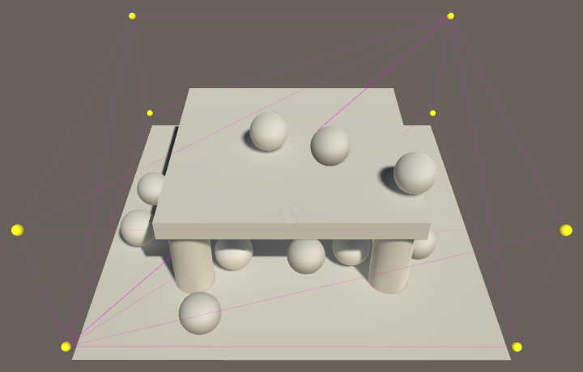 							Encasing the area. 						

Then add more probes depending on how the lighting conditions  change. It is essential that you do not place them inside static  geometry. Also don't put them on the wrong side of single-sided geometry  that isn't transparent.

 							
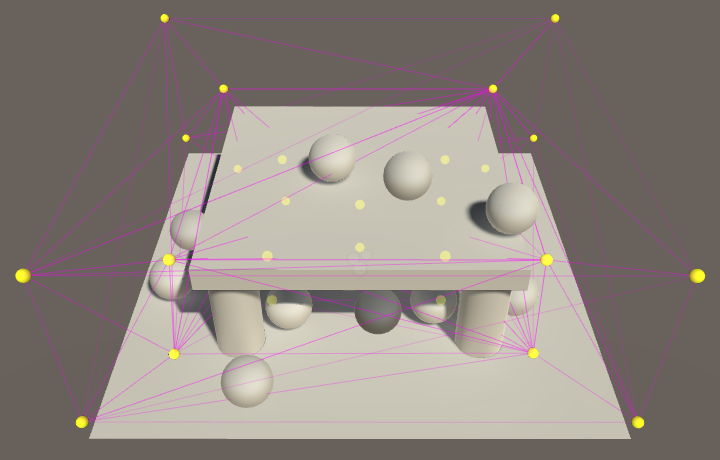 							Placing more probes. 						

Keep adding and moving probes until you have reasonable  lighting conditions in all areas and the transitions between them are  acceptable.

 							
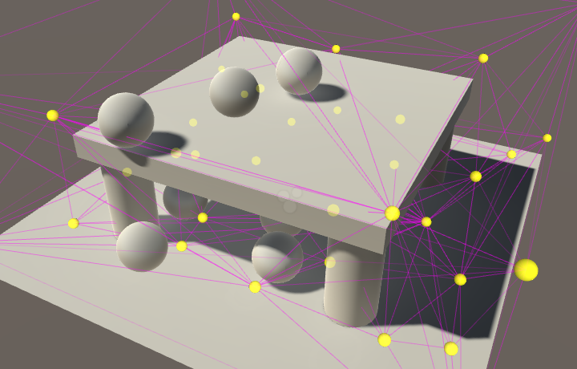 							Tweaking Probes. 						

You can test the probes by moving dynamic objects around. When a  dynamic object is selected, the probes that are currently affecting it  will be shown as well. The probes will show their lighting, instead of  just being yellow spheres. You can also see the interpolated data used  for the dynamic object.

<iframe src="https://gfycat.com/ifr/PreciousFaintGalapagosdove"></iframe>

Moving a dynamic object through a probe group.

The next tutorial is [Mixed Lighting](https://catlikecoding.com/unity/tutorials/rendering/part-17/).

unitypackage

PDF
