# Rendering 11

Transparency

- Cut holes with a shader.
- Use a different render queue.
- Support semitransparent materials.
- Combine reflections and transparency.

This is the eleventh part of a tutorial series about rendering. [Previously](https://catlikecoding.com/unity/tutorials/rendering/part-10),  we made our shader capable of rendering complex materials. But these  materials have always been fully opaque. Now we'll add support for  transparency.

This tutorial was made with Unity 5.5.0f3.

 					
 					Some quads aren't fully there. 				

## Cutout Rendering

To create a transparent material, we have to know the  transparency of each fragment. This information is most often stored in  the alpha channel of colors. In our case, that's the alpha channel of  the main albedo texture, and the alpha channel of the color tint.

Here is an example transparency map. It's a solid white texture  with fading smooth noise in the alpha channel. It's white so we can  fully focus on the transparency, without being distracted by an albedo  pattern.

 						
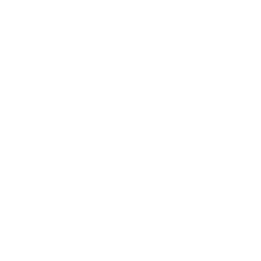 						Transparency map on a black background. 					

Assigning this texture to our material just makes it white. The  alpha channel is ignored, unless you chose to use it as the smoothness  source. But when you select a quad with this material, you'll see a  mostly-circular selection outline.

 						
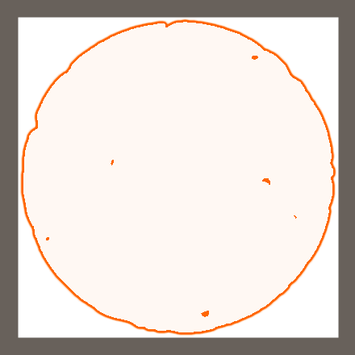 						Selection outline on a solid quad. 					

 						How do I get a selection outline? 						 					

### Determing the Alpha Value

To retrieve the alpha value, we can use add a `GetAlpha` function to the *My Lighting* include file. Like albedo, we find it by multiplying the tint and main texture alpha values.

```
float GetAlpha (Interpolators i) {
	return _Tint.a * tex2D(_MainTex, i.uv.xy).a;
}
```

However, we should only use the texture when we're not using  its alpha channel to determine the smoothness. If we didn't check for  that, we could be misinterpreting the data.

```
float GetAlpha (Interpolators i) {
	float alpha = _Tint.a;
	#if !defined(_SMOOTHNESS_ALBEDO)
		alpha *= tex2D(_MainTex, i.uv.xy).a;
	#endif
	return alpha;
}
```

### Cutting Holes

In the case of opaque materials, every fragment that passes its  depth test is rendered. All fragments are fully opaque and write to the  depth buffer. Transparency complicates this.

The simplest way to do transparency is to keep it binary.  Either a fragment is fully opaque, or it's fully transparent. If it is  transparent, then it's simply not rendered at all. This makes it  possible to cut holes in surfaces.

To abort rendering a fragment, we can use the `clip`  function. If the argument of this function is negative, then the  fragment will be discarded. The GPU won't blend its color, and it won't  write to the depth buffer. If that happens, we don't need to worry about  all the other material properties. So it's most efficient to clip as  early as possible. In our case, that's at the beginning of the `MyFragmentProgram` function.

We'll use the alpha value to determine whether we should clip  or not. As alpha lies somewhere in between zero and one, we'll have to  subtract something to make it negative. By subtracting ½, we'll make the  bottom half of the alpha range negative. This means that fragments with  an alpha value of at least ½ will be rendered, while all others will be  clipped.

```
float4 MyFragmentProgram (Interpolators i) : SV_TARGET {
	float alpha = GetAlpha(i);
	clip(alpha - 0.5);

	…
}
```

 							
 							Clipping everything below alpha 0.5. 						

### Variable Cutoff

Subtracting ½ from alpha is arbitrary. We could've subtracted  another number instead. If we subtract a higher value from alpha, then a  large range will be clipped. So this value acts as a cutoff threshold.  Let's make it variable. First, add an *Alpha Cutoff* property to our shader.

```
	Properties {
		…

		_AlphaCutoff ("Alpha Cutoff", Range(0, 1)) = 0.5
	}
```

Then add the corresponding variable to *My Lighting* and subtract it from the alpha value before clipping, instead of ½.

```
float _AlphaCutoff;

…

float4 MyFragmentProgram (Interpolators i) : SV_TARGET {
	float alpha = GetAlpha(i);
	clip(alpha - _AlphaCutoff);

	…
}
```

Finally, we also have to add the cutoff to our custom shader  UI. The standard shader shows the cutoff below the albedo line, so we'll  do that as well. We'll show an indented slider, just like we do for *Smoothness*.

```
	void DoMain () {
		GUILayout.Label("Main Maps", EditorStyles.boldLabel);

		MaterialProperty mainTex = FindProperty("_MainTex");
		editor.TexturePropertySingleLine(
			MakeLabel(mainTex, "Albedo (RGB)"), mainTex, FindProperty("_Tint")
		);

		DoAlphaCutoff();
		…
	}

	void DoAlphaCutoff () {
		MaterialProperty slider = FindProperty("_AlphaCutoff");
		EditorGUI.indentLevel += 2;
		editor.ShaderProperty(slider, MakeLabel(slider));
		EditorGUI.indentLevel -= 2;
	}
```

 							
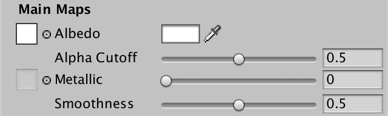 							Alpha cutoff slider. 						

Now you can adjust the cutoff as you like. You could also  animate it, for example to create a materializing or de-materializing  effect.

<iframe src="https://gfycat.com/ifr/SelfishCloudyAyeaye"></iframe>

Varying alpha cutoff.

The shader compiler converts a clip to a discard instruction. Here's the relevant OpenGL Core code fragment.

```
    u_xlat10_0 = texture(_MainTex, vs_TEXCOORD0.xy);
    u_xlat1.xyz = u_xlat10_0.xyz * _Tint.xyz;
    u_xlat30 = _Tint.w * u_xlat10_0.w + (-_AlphaCutoff);
    u_xlatb30 = u_xlat30<0.0;
    if((int(u_xlatb30) * int(0xffffffffu))!=0){discard;}
```

And here it is for Direct3D 11.

```
   0: sample r0.xyzw, v1.xyxx, t0.xyzw, s1
   1: mul r1.xyz, r0.xyzx, cb0[4].xyzx
   2: mad r0.w, cb0[4].w, r0.w, -cb0[9].x
   3: lt r0.w, r0.w, l(0.000000)
   4: discard_nz r0.w
```

 							What about shadows? 							 						

### Rendering Mode

Clipping doesn't come for free. It isn't that bad for desktop  GPUs, but mobile GPUs that use tiled rendering don't like to discard  fragments at all. So we should only include the clip statement if we're  really rendering a cutout material. Fully opaque materials don't need  it. To do this, let's make it dependent on a new keyword, *_RENDERING_CUTOUT*.

```
	float alpha = GetAlpha(i);
	#if defined(_RENDERING_CUTOUT)
		clip(alpha - _AlphaCutoff);
	#endif
```

Add a shader feature for this keyword, both to the base pass and the additive pass.

```
			#pragma shader_feature _RENDERING_CUTOUT
			#pragma shader_feature _METALLIC_MAP
```

In our custom UI script, add a `**RenderingMode**` enumeration, offering a choice between opaque and cutout rendering.

```
	enum RenderingMode {
		Opaque, Cutout
	}
```

Add a separate method to display a line for the rendering mode.  We'll use an enumeration popup based on the keyword, like we do for the  smoothness source. Set the mode based on the existence of the *_RENDERING_CUTOUT* keyword. Show the popup, and if the user changes it, set the keyword again.

```
	void DoRenderingMode () {
		RenderingMode mode = RenderingMode.Opaque;
		if (IsKeywordEnabled("_RENDERING_CUTOUT")) {
			mode = RenderingMode.Cutout;
		}

		EditorGUI.BeginChangeCheck();
		mode = (RenderingMode)EditorGUILayout.EnumPopup(
			MakeLabel("Rendering Mode"), mode
		);
		if (EditorGUI.EndChangeCheck()) {
			RecordAction("Rendering Mode");
			SetKeyword("_RENDERING_CUTOUT", mode == RenderingMode.Cutout);
		}
	}
```

Like the standard shader, we'll show the rendering mode at the top of our UI.

```
	public override void OnGUI (
		MaterialEditor editor, MaterialProperty[] properties
	) {
		this.target = editor.target as Material;
		this.editor = editor;
		this.properties = properties;
		DoRenderingMode();
		DoMain();
		DoSecondary();
	}
```

 							
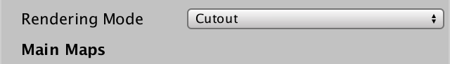 							Rendering mode choice. 						

We can now switch between fully opaque and cutout rendering.  However, the alpha cutoff slider remains visible, even in opaque mode.  Ideally, it should only be shown when needed. The standard shader does  this as well. To communicate this between `DoRenderingMode` and `DoMain`, add a boolean field that indicated whether the alpha cutoff should be shown.

```
	bool shouldShowAlphaCutoff;
	
	…
	
	void DoRenderingMode () {
		RenderingMode mode = RenderingMode.Opaque;
		shouldShowAlphaCutoff = false;
		if (IsKeywordEnabled("_RENDERING_CUTOUT")) {
			mode = RenderingMode.Cutout;
			shouldShowAlphaCutoff = true;
		}

		…
	}

	void DoMain () {
		…

		if (shouldShowAlphaCutoff) {
			DoAlphaCutoff();
		}
		…
	}
```

### Rendering Queue

Although our rendering modes are now fully functional, there is  another thing that Unity's shaders do. They put cutout materials in a  different render queue that opaque materials. Opaque things are rendered  first, followed by the cutout stuff. This is done because clipping is  more expensive. Rendering opaque objects first means that we'll never  render cutout objects that end up behind solid objects.

Internally, each object has a number that corresponds with its  queue. The default queue is 2000. The cutout queue is 2450. Lower queues  are rendered first.

You can set the queue of a shader pass using the *Queue* tag. You can use the queue names, and also add an offset for more precise control over when objects get rendered. For example, `"Queue" = "Geometry+1"`

But we don't have a fixed queue. It depends on the rendering  mode. So instead of using the tag, we'll have our UI set a custom render  queue, which overrules the shader's queue. You can find out what the  custom render queue of a material is by selecting it while the inspector  is in debug mode. You'll be able to see its *Custom Render Queue* field. Its default value is −1, which indicates that there is no custom value set, so the shader's *Queue* tag should be used.

 							
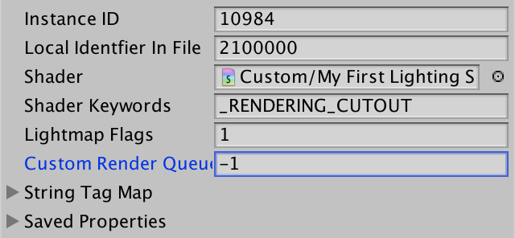 							Custom render queue. 						

We don't really care what the exact number of a queue is. They might even change in future Unity versions. Fortunately, the `UnityEngine.Rendering` namespace contains the `RenderQueue` enum, which contains the correct values. So let's use that namespace in our UI script.

```
using UnityEngine;
using UnityEngine.Rendering;
using UnityEditor;

public class MyLightingShaderGUI : ShaderGUI {
	…
}
```

When a change is detected inside `DoRenderingMode`, determine the correct render queue. Then, iterate through the selected materials and update their queue overrides.

```
		if (EditorGUI.EndChangeCheck()) {
			RecordAction("Rendering Mode");
			SetKeyword("_RENDERING_CUTOUT", mode == RenderingMode.Cutout);

			RenderQueue queue = mode == RenderingMode.Opaque ?
				RenderQueue.Geometry : RenderQueue.AlphaTest;
			foreach (Material m in editor.targets) {
				m.renderQueue = (int)queue;
			}
		}
```

### Render Type Tag

Another detail is the *RenderType* tag.  This shader tags doesn't do anything by itself. It is a hint that tells  Unity what kind of shader it is. This is used by replacement shaders to  determine whether objects should be rendered or not.

 							What are replacement shaders? 							 						

To adjust the *RenderType* tag, we have to use the `Material.SetOverrideTag`  method. Its first parameter is the tag to override. The second  parameter is the string containing the tag value. For opaque shaders, we  can use the default, which is accomplished by providing an empty  string. For cutout shaders, it's *TransparentCutout*.

```
			RenderQueue queue = mode == RenderingMode.Opaque ?
				RenderQueue.Geometry : RenderQueue.AlphaTest;
			string renderType = mode == RenderingMode.Opaque ?
				"" : "TransparentCutout";
			foreach (Material m in editor.targets) {
				m.renderQueue = (int)queue;
				m.SetOverrideTag("RenderType", renderType);
			}
```

After switching your material to cutout mode, it will now get an entry in its *String Tag Map* list, which you can view via the debug inspector.

 							
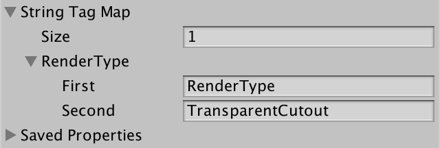 							Render type tag. 						

unitypackage

## Semitransparent Rendering

Cutout rendering is sufficient when you want to cut a hole into  something, but not when you desire semi-transparency. Also, cutout  rendering is per fragment, which means that the edges will be aliased.  There is no smooth transition between opaque and transparent parts of  the surface. To solve this, we have to add support for another rendering  mode. This mode will support semi-transparency. Unity's standard  shaders name this mode *Fade*, so we'll use the same name. Add it to our `**RenderingMode**` enumeration.

```
	enum RenderingMode {
		Opaque, Cutout, Fade
	}
```

We'll use the *_RENDERING_FADE* keyword for this mode. Adjust `DoRenderingMode` to work with this keyword as well.

```
	void DoRenderingMode () {
		RenderingMode mode = RenderingMode.Opaque;
		shouldShowAlphaCutoff = false;
		if (IsKeywordEnabled("_RENDERING_CUTOUT")) {
			mode = RenderingMode.Cutout;
			shouldShowAlphaCutoff = true;
		}
		else if (IsKeywordEnabled("_RENDERING_FADE")) {
			mode = RenderingMode.Fade;
		}

		…
		
		if (EditorGUI.EndChangeCheck()) {
			RecordAction("Rendering Mode");
			SetKeyword("_RENDERING_CUTOUT", mode == RenderingMode.Cutout);
			SetKeyword("_RENDERING_FADE", mode == RenderingMode.Fade);
			
			…
		}
	}
```

### Rendering Settings

*Fade* mode comes with its own render  queue and render type. The queue number is 3000, which is the default  for transparent objects. The render type is *Transparent*.

Instead of making `DoRenderingMode` more complex, let's define a struct inside our UI class to hold the settings per rendering type.

```
	enum RenderingMode {
		Opaque, Cutout, Fade
	}

	struct RenderingSettings {
		public RenderQueue queue;
		public string renderType;
	}
```

Now we can create a static settings array for all of our rendering types.

```
	struct RenderingSettings {
		public RenderQueue queue;
		public string renderType;

		public static RenderingSettings[] modes = {
			new RenderingSettings() {
				queue = RenderQueue.Geometry,
				renderType = ""
			},
			new RenderingSettings() {
				queue = RenderQueue.AlphaTest,
				renderType = "TransparentCutout"
			},
			new RenderingSettings() {
				queue = RenderQueue.Transparent,
				renderType = "Transparent"
			}
		};
	}
```

Inside `DoRenderingMode`, use the mode to retrieve the correct settings, then configure all materials.

```
		if (EditorGUI.EndChangeCheck()) {
			RecordAction("Rendering Mode");
			SetKeyword("_RENDERING_CUTOUT", mode == RenderingMode.Cutout);
			SetKeyword("_RENDERING_FADE", mode == RenderingMode.Fade);

//			RenderQueue queue = mode == RenderingMode.Opaque ?
//				RenderQueue.Geometry : RenderQueue.AlphaTest;
//			string renderType = mode == RenderingMode.Opaque ?
//				"" : "TransparentCutout";
			
			RenderingSettings settings = RenderingSettings.modes[(int)mode];
			foreach (Material m in editor.targets) {
				m.renderQueue = (int)settings.queue;
				m.SetOverrideTag("RenderType", settings.renderType);
			}
		}
```

### Rendering Transparent Geometry

You're now able to switch your material to *Fade*  rendering mode. Because our shader does not support that mode yet, it  will revert to opaque. However, you'll notice a difference when using  the frame debugger.

When using *Opaque* or *Cutout* rendering mode, objects using our material are rendered by the `Render.OpaqueGeometry` method. This has always been the case. But it's different when using `Fade` rendering mode. Then they're rendered by the `Render.TransparentGeometry` method. This happens because we're using a different render queue.

 							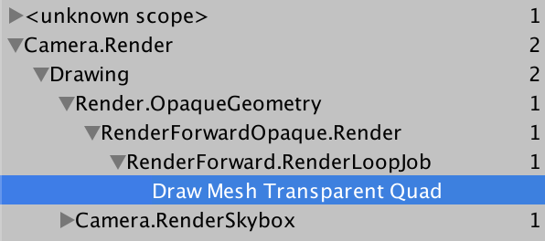 							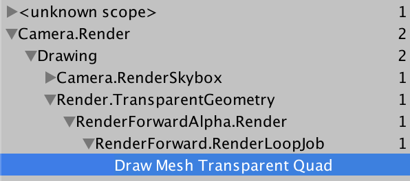 							Opaque vs. semitransparent rendering. 						

If you have both opaque and transparent objects in view, both the `Render.OpaqueGeometry` and the `Render.TransparentGeometry`  methods will be invoked. The opaque and cutout geometry is rendered  first, followed by the transparent geometry. So semitransparent objects  are never drawn behind solid objects.

### Blending Fragments

To make *Fade* mode work, we first have  to adjust our rendering shader feature. We now support three modes with  two keywords, both for the base and additive pass.

```
			#pragma shader_feature _ _RENDERING_CUTOUT _RENDERING_FADE
```

In the case of *Fade* mode, we have to  blend the color of our current fragment with whatever's already been  drawn. This blending is done by the GPU, outside of our fragment  program. It needs the fragment's alpha value to do this, so we have to  output it, instead of the constant value – one – that we've used until  now.

```
	color.rgb += GetEmission(i);
	#if defined(_RENDERING_FADE)
		color.a = alpha;
	#endif
	return color;
```

To create a semitransparent effect, we have to use a different  blend mode than the one we use for opaque and cutout materials. Like  with the additive pass, we have to add the new color to the already  existing color. However, we can't simply add them together. The blend  should depend on our alpha value.

When alpha is one, then we're rendering something that's fully opaque. In that case, we should use `**Blend** **One** **Zero**` for the base pass, and `**Blend** **One** **One**`  for the additive pass, as usual. But when alpha is zero, what we're  rendering is fully transparent. In that case, we shouldn't change a  thing. Then blend mode has to be `**Blend** **Zero** **One**` for both passes. And if alpha were ¼, then we'd need something like `**Blend** 0.25 0.75` and `**Blend** 0.25 **One**`.

To make this possible, we can use the `**SrcAlpha**` and `**OneMinusSrcAlpha**` blend keywords.

```
		Pass {
			Tags {
				"LightMode" = "ForwardBase"
			}
			Blend SrcAlpha OneMinusSrcAlpha

			…
		}

		Pass {
			Tags {
				"LightMode" = "ForwardAdd"
			}

			Blend SrcAlpha One
			ZWrite Off

			…
		}
```

 							
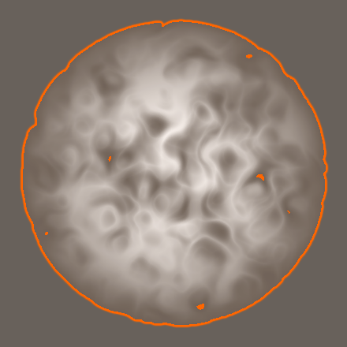 							A semitransparent quad. 						

While this works, these blend modes are only appropriate for the *Fade*  rendering mode. So we have to make them variable. Fortunately, this is  possible. Begin by adding two float properties for the source and  destination blend modes.

```
	Properties {
		…
		
		_SrcBlend ("_SrcBlend", Float) = 1
		_DstBlend ("_DstBlend", Float) = 0
	}
```

As these properties depend on the rendering mode, we're not  going to show them in our UI. If we weren't using a custom UI, we  could've hidden them using the *HideInInspector* attribute. I'll add those attributes anyway.

```
		[HideInInspector] _SrcBlend ("_SrcBlend", Float) = 1
		[HideInInspector] _DstBlend ("_DstBlend", Float) = 0
```

Use these float properties in place of the blend keywords that  have to be variable. You'll have to put them inside square brackets.  This is old shader syntax, to configure the GPU. We don't need to access  these properties in our vertex and fragment programs.

```
		Pass {
			Tags {
				"LightMode" = "ForwardBase"
			}
			Blend [_SrcBlend] [_DstBlend]

			…
		}

		Pass {
			Tags {
				"LightMode" = "ForwardAdd"
			}

			Blend [_SrcBlend] One
			ZWrite Off

			…
		}
```

To control these parameters, add two `BlendMode` fields to our `**RenderingSettings**` struct, and initialize them appropriately.

```
	struct RenderingSettings {
		public RenderQueue queue;
		public string renderType;
		public BlendMode srcBlend, dstBlend;

		public static RenderingSettings[] modes = {
			new RenderingSettings() {
				queue = RenderQueue.Geometry,
				renderType = "",
				srcBlend = BlendMode.One,
				dstBlend = BlendMode.Zero
			},
			new RenderingSettings() {
				queue = RenderQueue.AlphaTest,
				renderType = "TransparentCutout",
				srcBlend = BlendMode.One,
				dstBlend = BlendMode.Zero
			},
			new RenderingSettings() {
				queue = RenderQueue.Transparent,
				renderType = "Transparent",
				srcBlend = BlendMode.SrcAlpha,
				dstBlend = BlendMode.OneMinusSrcAlpha
			}
		};
	}
```

Inside `DoRenderingMode`, we have to directly set the *_SrcBlend* and *_DstBlend* properties of the materials. We can do this via the `Material.SetInt` method.

```
			foreach (Material m in editor.targets) {
				m.renderQueue = (int)settings.queue;
				m.SetOverrideTag("RenderType", settings.renderType);
				m.SetInt("_SrcBlend", (int)settings.srcBlend);
				m.SetInt("_DstBlend", (int)settings.dstBlend);
			}
```

### Depth Trouble

When working with a single object in *Fade*  mode, everything seems to work fine. However, when you have multiple  semitransparent objects close together, you might get weird results. For  example, partially overlap two quads, placing one slightly above the  other. From some view angles, one of the quads appears to cut away part  of the other.

 							
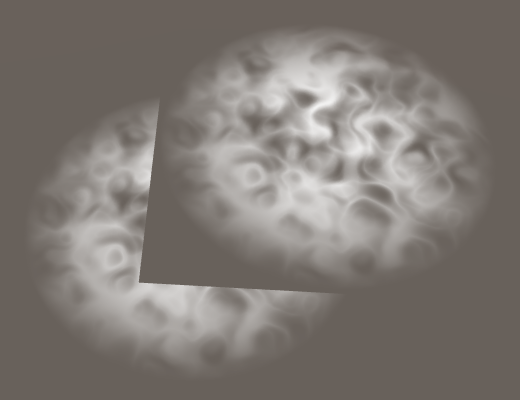 							Strange results. 						

Unity tries to draw the opaque objects that are closest to the  camera first. This is the most efficient way to render overlapping  geometry. Unfortunately, this doesn't work for semitransparent geometry,  because it has to be blended with whatever lies behind it. So  transparent geometry has to be drawn the other way around. The furthest  objects are drawn first, and the closest are drawn last. That's why  transparent things are more expensive to draw than opaque things.

To determine the draw order of geometry, Unity uses the the  position of their centers. This works fine for small objects that are  far apart. But it doesn't work so well for large geometry, or for flat  geometry that's positioned close together. In those cases, the draw  order can suddenly flip while you change the view angle. This can cause a  sudden change in the appearance of overlapping semitransparent objects.

There's no way around this limitation, especially not when  considering intersecting geometry. However, it often isn't noticeable.  But in our case, certain draw orders produce obviously wrong results.  This happens because our shaders still write to the depth buffer. The  depth buffer is binary and doesn't care about transparency. If a  fragment isn't clipped, its depth ends up written to the buffer. Because  the draw order of semitransparent objects isn't perfect, this isn't  desirable. The depth values of invisible geometry can end up preventing  otherwise visible stuff from being rendered. So we have to disable  writing to the depth buffer when using the *Fade* rendering mode.

### Controlling ZWrite

Like for the blend modes, we can use a property to control the *ZWrite*  mode. We need to explicitly set this mode in the base pass, using the  property. The additive pass never writes to the depth buffer, so it  requires no change.

```
		[HideInInspector] _SrcBlend ("_SrcBlend", Float) = 1
		[HideInInspector] _DstBlend ("_DstBlend", Float) = 0
		[HideInInspector] _ZWrite ("_ZWrite", Float) = 1
		
		…
		
			Blend [_SrcBlend] [_DstBlend]
			ZWrite [_ZWrite]
```

Add a boolean field `**RenderingSettings**` to indicate whether writing to the depth buffer should be enabled. This is only true for the *Opaque* and *Cutout* modes.

```
	struct RenderingSettings {
		public RenderQueue queue;
		public string renderType;
		public BlendMode srcBlend, dstBlend;
		public bool zWrite;

		public static RenderingSettings[] modes = {
			new RenderingSettings() {
				queue = RenderQueue.Geometry,
				renderType = "",
				srcBlend = BlendMode.One,
				dstBlend = BlendMode.Zero,
				zWrite = true
			},
			new RenderingSettings() {
				queue = RenderQueue.AlphaTest,
				renderType = "TransparentCutout",
				srcBlend = BlendMode.One,
				dstBlend = BlendMode.Zero,
				zWrite = true
			},
			new RenderingSettings() {
				queue = RenderQueue.Transparent,
				renderType = "Transparent",
				srcBlend = BlendMode.SrcAlpha,
				dstBlend = BlendMode.OneMinusSrcAlpha,
				zWrite = false
			}
		};
	}
```

Include the *_ZWrite* property inside `DoRenderingMode`, again using the `Material.SetInt` method.

```
			foreach (Material m in editor.targets) {
				m.renderQueue = (int)settings.queue;
				m.SetOverrideTag("RenderType", settings.renderType);
				m.SetInt("_SrcBlend", (int)settings.srcBlend);
				m.SetInt("_DstBlend", (int)settings.dstBlend);
				m.SetInt("_ZWrite", settings.zWrite ? 1 : 0);
			}
```

Switch our material to another rendering mode, and then back to *Fade*  mode. While the draw order of semitransparent objects can still flip,  we no longer get unexpected holes in our semitransparent geometry.

 							
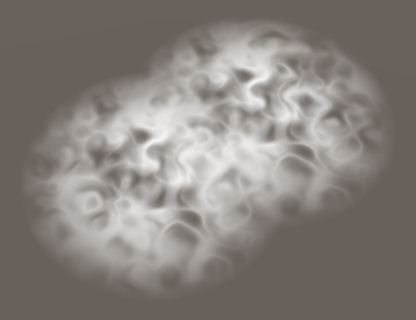 							No more disappearing geometry. 						

unitypackage

## Fading vs. Transparency

The semitransparent rendering mode that we created fades out the  geometry based on its alpha value. Note that the entire contribution of  the geometry's color is faded. Both its diffuse reflections and its  specular reflections are faded. That's why it's know as *Fade* mode.

 						
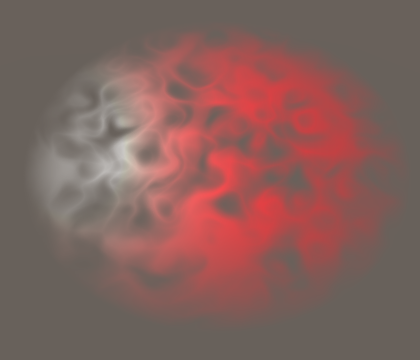 						Faded red with white highlight. 					

This mode is appropriate for many effects, but it does not  correctly represent solid semitransparent surfaces. For example, glass  is practically fully transparent, but it also has clear highlights and  reflections. Reflected light is added to whatever light passes through.  To support this, Unity's standard shaders also have a *Transparent* rendering mode. So let's add that mode as well.

```
	enum RenderingMode {
		Opaque, Cutout, Fade, Transparent
	}
```

The settings for *Transparent* mode are the same as for *Fade*,  except that we have to be able to add reflections regardless of the  alpha value. Thus, its source blend mode has to be one instead of  depending on alpha.

```
		public static RenderingSettings[] modes = {
			new RenderingSettings() {
				queue = RenderQueue.Geometry,
				renderType = "",
				srcBlend = BlendMode.One,
				dstBlend = BlendMode.Zero,
				zWrite = true
			},
			new RenderingSettings() {
				queue = RenderQueue.AlphaTest,
				renderType = "TransparentCutout",
				srcBlend = BlendMode.One,
				dstBlend = BlendMode.Zero,
				zWrite = true
			},
			new RenderingSettings() {
				queue = RenderQueue.Transparent,
				renderType = "Transparent",
				srcBlend = BlendMode.SrcAlpha,
				dstBlend = BlendMode.OneMinusSrcAlpha,
				zWrite = false
			},
			new RenderingSettings() {
				queue = RenderQueue.Transparent,
				renderType = "Transparent",
				srcBlend = BlendMode.One,
				dstBlend = BlendMode.OneMinusSrcAlpha,
				zWrite = false
			}
		};
```

We'll have to use yet another keyword, in this case *_RENDERING_TRANSPARENT*. Adjust `DoRenderingMode` so it can detect and set this keyword.

```
	void DoRenderingMode () {
		…
		else if (IsKeywordEnabled("_RENDERING_TRANSPARENT")) {
			mode = RenderingMode.Transparent;
		}

		EditorGUI.BeginChangeCheck();
		mode = (RenderingMode)EditorGUILayout.EnumPopup(
			MakeLabel("Rendering Mode"), mode
		);
		if (EditorGUI.EndChangeCheck()) {
			RecordAction("Rendering Mode");
			SetKeyword("_RENDERING_CUTOUT", mode == RenderingMode.Cutout);
			SetKeyword("_RENDERING_FADE", mode == RenderingMode.Fade);
			SetKeyword(
				"_RENDERING_TRANSPARENT", mode == RenderingMode.Transparent
			);

			…
		}
	}
```

Add the keyword to our two shader feature directives as well.

```
#pragma shader_feature _ _RENDERING_CUTOUT _RENDERING_FADE _RENDERING_TRANSPARENT
```

Now we have to output the alpha value both for *Fade* and *Transparent* mode.

```
	#if defined(_RENDERING_FADE) || defined(_RENDERING_TRANSPARENT)
		color.a = alpha;
	#endif
	return color;
```

Switching our material to *Transparent*  mode will once again make the entire quad visible. Because we're no  longer modulating the new color based on alpha, the quad will appear  brighter than when using *Opaque* mode. How much  of the color behind the fragment gets added is still controlled by  alpha. So when alpha is one, it looks just like an opaque surface.

 						
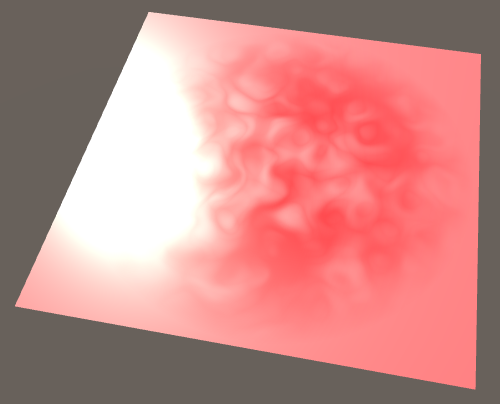 						Adding instead of fading. 					

### Premultiplied Alpha

To make transparency work again, we have to manually factor in  the alpha value. And we should only adjust the diffuse reflections, not  the specular reflections. We can do this by multiplying the the  material's final albedo color by the alpha value.

```
float4 MyFragmentProgram (Interpolators i) : SV_TARGET {
	…

	float3 specularTint;
	float oneMinusReflectivity;
	float3 albedo = DiffuseAndSpecularFromMetallic(
		GetAlbedo(i), GetMetallic(i), specularTint, oneMinusReflectivity
	);
	#if defined(_RENDERING_TRANSPARENT)
		albedo *= alpha;
	#endif

	…
}
```

 							
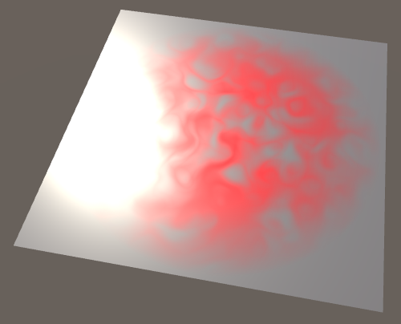 							Fading albedo. 						

Because we're multiplying by alpha before the GPU does its  blending, this technique is commonly known as premultiplied alpha  blending. Many image-processing apps internally store colors this way.  Textures can also contain premultiplied alpha colors. Then they either  don't need an alpha channel, of they can store a different alpha value  than the one that's associated with the RGB channels. That would make it  possible to both brighten and darken using the same data, for example a  combination of fire and smoke. However, a downside of storing colors  that way in textures is a loss of precision.

### Adjusting Alpha

If something is both transparent and reflective, we'll see both  what's behind it, and the reflections. This is true on both sides of  the object. But the same light cannot both get reflected and also pass  through the object. This is once again a matter of energy conservation.  So the more reflective something is, the less light is able to travel  through it, regardless of its inherent transparency.

To represent this, we have to adjust the alpha value before the  GPU performs blending, but after we've changed the albedo. If a surface  has no reflections, its alpha is unchanged. But when it reflects all  light, its alpha effectively becomes one. As we determine the  reflectivity in the fragment program, we can use that to adjust the  alpha value. Given the original alpha a

 and reflectivity 

r

, the modified alpha becomes 

1−(1−a)(1−r)

.

Keeping in mind that we're using one-minus-reflectivity in our shader, (1−r)

 can be represented with 

R

. Then we can simplify the formula a bit. 

1−(1−a)R=1−(R−aR)=1−R+aR

. Use this expression as the new alpha value, after adjusting the albedo color.

```
	#if defined(_RENDERING_TRANSPARENT)
		albedo *= alpha;
		alpha = 1 - oneMinusReflectivity + alpha * oneMinusReflectivity;
	#endif
```

The result should be slightly darker than before, to simulate light bouncing off the backside of our object.

 							
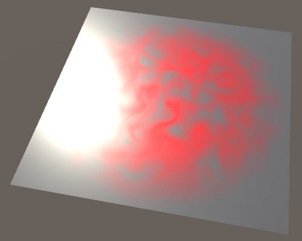 							Adjusted alpha. 						

Keep in mind that this is a gross simplification of  transparency, because we're not taking the actual volume of an object  into account, only the visible surface.

 							What about one-way mirrors? 							 						

The next tutorial is [Semitransparent Shadows](https://catlikecoding.com/unity/tutorials/rendering/part-12/).

unitypackage

PDF
