# 可编程渲染管线1 自定义通道

该教程基于 Unity 2018.3.0f2.

# 1、创建通道

想要渲染任何东西，Unity都需要确定绘制什么形状，何时绘制，在哪绘制，以及使用何种设置。取决于涉及的效果的数量，这可能会非常复杂。将光照、阴影、透明度、屏幕效果、体积效果（volumetric  effects）等等效果以正确的顺序处理并传输到最终的画面，这个过程就称之为渲染管道（Render Pipeline）

Unity2017支持两个预定义的渲染渲染管道、正向渲染和延迟渲染，另外也保存了Unity5版本遗留的旧版延迟渲染。然而这些管线都是是固定的，你可以启用、关闭或者重写管线中的某些部分，但你不可能大幅偏离它原本的设计方向。

Unity2018添加了对可编辑渲染管线的支持，让从头搭建渲染管线成为可能，虽然在许多个别的步骤（如剔除  culling）仍然需要依赖Unity。Unity2018还介绍了用这种方法创建的两个渲染管线，轻量级渲染管线(lightweight  pipeline)和高清渲染管线(highdefinition pipeline).目前这两个渲染管线仍处于预览状态,可编辑渲染管线的API也被标记为测试技术。但这已经足够让我们用于创建自己的渲染管线了。

## 1.1 项目设置

打开Unity2018，创建一个新项目，我使用的是Unity  2018.2.9f1，但是Unity2018.2以及更高的版本应该都可以使用。选择一个标准的3D项目，关闭Unity Analytics.  因为我们要写自己的渲染管线，所以Template不要选择带管线的选项，选择3D就好。

打开项目后，移除*Window / Package Manager* 下除了Package Manager UI的其余组件，因为我们用不上它们。(我用的Unity2018.3.2.f1好像不给我删- -||)

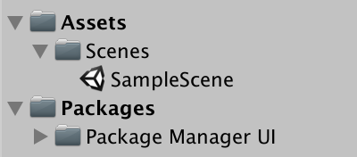

我们需要在线性颜色空间下工作，但是Unity2018默认使用伽马空间。所以我们通过*Edit / Project Settings / Player*找到player setings，在Other Settingssection里将色彩空间转换为线性。

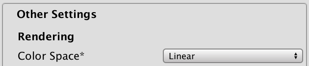

我们需要一些简单的材质用于测试我们的通道。我创建了四个材质，第一个材质设为默认标准着色器的不透明(Opaque)类型,并使用红色的反照率(albedo)。第二个使用和上一个同样的材质，但是渲染模式改为透明(Transparent)，并将反照率设为一个alpha值较低的蓝色。第三个材质使用*Unlit/Color*  shader，颜色设为黄色。最后一个使用*Unlit/Transparent* shader ,不做任何改动，这样会显示为纯白色。

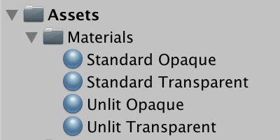

用一些物体填充场景，要让四个材质都有被使用

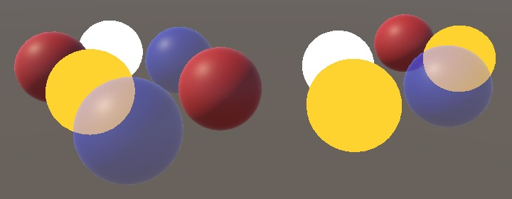

## 1.2 Pipeline Asset

目前，Unity使用默认的正向渲染管线。要使用自定义的渲染管线，我们需要在 graphics settings里进行设置，通过*Edit / Project Settings / Graphics 找到下面的选择框。*

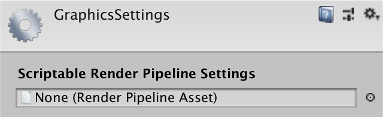

想要设置自己的渲染管线，我们必须让*Scriptable Render Pipeline Settings* 这个字段指向一个pipeline asset。该asset继承自属于`ScriptableObject` 类型的`RenderPipelineAsset。`

为我们的自定义管线创建一个新脚本。我们把我们的通道简单的命名为*My Pipeline*  ，所以这个asset的类型名就设为 `**MyPipelineAsset**`，该类继承 RenderPipelineAsset(定义在UnityEngine.Experimental.Rendering 命名空间) 。

```
using UnityEngine;using UnityEngine.Experimental.Rendering; public class MyPipelineAsset : RenderPipelineAsset {}
```

> 他会一直在这个命名空间中吗
>
> 等时机成熟他会被移出Experimental命名空间，不是移到UnityEngine.Rendering就是其他命名空间。到时候，只需要更新using语句即可，除非他的api也变了

pipeline  asset的主要作用是给unity一个途径去获取负责渲染的管道对象实例，这个asset本身只是一个句柄和存储Pipeline相关设置的地方，我们现在还没有任何设置，所以我们现在要做的只是给Unity一个途径去得到pipeline  对象实例。这通过重写 `InternalCreatePipeline`完成。但是目前我们还没有定义自己的pipeline对象类型，所以我们先暂时返回null。

 `InternalCreatePipeline`方法的返回值是`IRenderPipeline` 。I前缀表示它是一个接口

```
public class MyPipelineAsset : RenderPipelineAsset { 	protected override IRenderPipeline InternalCreatePipeline () {		return null;	}}
```

> 什么是接口： ...略

现在我们以这个类型作为asset添加到我们的项目中去。想要作为asset，需要为MyPipelineAsset添加特性`CreateAssetMenu`。

```
[CreateAssetMenu]public class MyPipelineAsset : RenderPipelineAsset {}
```

 这会在Asset/Create 面板放置一个条目。处于整洁，我们把它放在Rendering 子面板中。通过设置特性的nemuName属性为Rendering/Create/My Pipeline即可。这个属性可以在特性后面的圆括号内直接设置。

```
[CreateAssetMenu(menuName = "Rendering/My Pipeline")]public class MyPipelineAsset : RenderPipelineAsset {}
```

用新增的面板项目添加对应的asset到我们的项目中，并把它命名为MyPipeline。

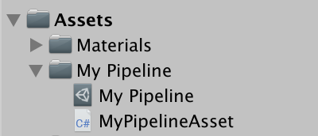

然后把它指派给*Scriptable Render Pipeline Settings*.。  

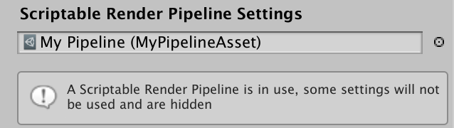

我们现在替换了默认的pipeline，一些事情发生了变化，首先，在graphics  setting许多选项消失了，Unity也用提示框给出了提示。第二，由于我们绕过了默认的pipeline，又没有提供一个有效的pipeline，因此没有任何东西被渲染，无论是游戏窗口、场景窗口还是材质预览也都不再可用，除了场景窗口还显示着天空盒。如果你打开  frame debugger（*Window / Analysis / Frame Debugger*）然后启用，你会看到游戏窗口确实没有任何东西被渲染。

## 1.3 pipeline instance

要创建一个有效的pipeline，我们需要提供一个实现了`IRenderPipeline`接口的对象实例负责渲染流程。所以像这样创建一个类，将他命名为MyPipeline。

```
using UnityEngine;using UnityEngine.Experimental.Rendering; public class MyPipeline : IRenderPipeline {}
```

虽然我们可以完全由自己实现`IRenderPipeline` 接口，但是用抽象类`RenderPipeline`代替会更方便，这个类已经提供了 `IRenderPipeline接口`的一些基础的实现，我们只需在此基础之上实现剩余的即可。

```
public class MyPipeline : RenderPipeline {}
```

现在我们在MyPipelineAsset类中的InternalCreatePipeline方法中返回一个MyPipeline的实例，这意味着我们在技术上已经返回了一个有效的pipeline，虽然实际上它仍然不会渲染任何东西 。

```
protected override IRenderPipeline InternalCreatePipeline () {		return new MyPipeline();	}
```

[unitypackage](https://catlikecoding.com/unity/tutorials/scriptable-render-pipeline/custom-pipeline/creating-a-pipeline/creating-a-pipeline.unitypackage) 

# 2、渲染

pipeline对象负责渲染每一帧的画面。现在unity所有需要渲染的地方都是通过调用该pipeline的Render方法实现的（它把上下文和激活的摄像机做为参数）。不只是游戏窗口，还有编辑器的场景窗口以及材质预览界面。我们要自己来进行合理的配置，找出我们需要渲染什么，并且以一个正确的顺序完成这些任务。

## 2.1 上下文（Context）

`RenderPipeline`包含`IRenderPipeline`接口中定义的Render方法的实现。第一个参数是一个`ScriptableRenderContext`结构体，作为渲染上下文，充当本机代码的外表(?facade) ，第二个参数是一个数组，保存了所有需要渲染的摄像机。

`RenderPipeline.Render`不会绘制任何东西，但是他会检查一个pipeline对象是否可以有效的用于渲染，如果不能就会跳出异常，所以我们在自己的类里重写这个方法时仍然要调用该方法的基类实现，用以保留检查的功能。

```
public class MyPipeline : RenderPipeline { 	public override void Render (		ScriptableRenderContext renderContext, Camera[] cameras	) {		base.Render(renderContext, cameras);	}}
```

通过渲染上下文，我们向Unity引擎发出指令渲染物体并控制渲染状态。最简单的一个例子就是绘制天空盒，我们通过调用DrawSkyBox方法来实现。

```
base.Render(renderContext, cameras);renderContext.DrawSkybox();
```

DrawSkyBox要求传入一个摄像机参数，我们简单的用cameras的第一个元素。 

```
renderContext.DrawSkybox(cameras[0]);
```

但我们还没有看到天空盒出现在游戏窗口中，因为现在我们只是将命令发送给上下文的缓冲区，实际效果需要我们通过Submit方法提交执行后才会出现。

```
renderContext.DrawSkybox(cameras[0]); renderContext.Submit();
```

天空盒终于显示在游戏窗口了，在frame debugger里你也可以发现它的存在了。 

##  2.2 摄像机(Camera)

我们拥有一个摄像机数组，因为场景中可能存在多个需要被渲染的内容，比如多人分屏、小地图、后视镜等都需要设置多个摄像头。每个摄像头都需要独立处理。

我们的pipeline暂不考虑对多重相机的支持。我们简单的创建一个Render的重载方法用于作用单个相机，让它渲染天空盒并提交。用它完成每台相机的提交工作。

```
void Render (ScriptableRenderContext context, Camera camera) {    context.DrawSkybox(camera);     context.Submit();}
```

 为相机数组中的每个元素调用该方法。我使用foreach循环来完成，Unity的pipeline也使用这种方法遍历相机的。

```
public override void Render (		ScriptableRenderContext renderContext, Camera[] cameras	) {		base.Render(renderContext, cameras); 		//renderContext.DrawSkybox(cameras[0]); 		//renderContext.Submit(); 		foreach (var camera in cameras) {			Render(renderContext, camera);		}	}
```

> foreach如何工作 ...略 

要注意的是，现在相机的方向并不会影响天空盒的渲染，我们将相机组件传递给DrawSkybox,但这只是用相机上的clear flags来决定天空盒是否应该被渲染。 

要想正确的渲染天空盒（以及整个场景）我们必须设置视图投影矩阵。这个变换矩阵结合了相机的位置和方向（视图矩阵）以及相机的透视或正交投影（投影矩阵）。你可以在frame  debugger上看到这个矩阵，这是一些物体绘制时会用到的着色器属性——unity_MatrixVP。

目前，unity_MatrixVP永远是不变的。通过 `SetupCameraProperties`这个方法,我把每个相机各自的属性应用到上下文中。他会设置视图投影矩阵以及其他一些属性。

```
void Render (ScriptableRenderContext context, Camera camera) {		context.SetupCameraProperties(camera); 		context.DrawSkybox(camera); 		context.Submit();	}
```

现在，天空盒被正确渲染，在游戏窗口和场景窗口中的显示都考虑到了摄像机属性。

## 2.3 命令缓冲区（Command Buffers）

上下文将实际的渲染操作延迟至我们上交(submit)后，在此之前，我们可以进行配置，并添加命令用于之后的执行。一些任务（如绘制天空盒）可以通过特定的方法执行，但是某些命令就得通过一个单独的command buffer来间接执行。

初始化一个 `CommandBuffer` 对象来创建一个命令行缓冲。该类型定义在`UnityEngine.Rendering`命名空间，因为command buffers在可编辑渲染管线出现之前就存在了，所以并没有被包括在实验性命名空间内。我们在绘制天空盒前创建这样一个buffer。

```
using UnityEngine;using UnityEngine.Rendering;using UnityEngine.Experimental.Rendering; public class MyPipeline : RenderPipeline { 	… 	void Render (ScriptableRenderContext context, Camera camera) {		context.SetupCameraProperties(camera); 		var buffer = new CommandBuffer(); 		context.DrawSkybox(camera); 		context.Submit();	}}
```

通过`ExecuteCommandBuffer`方法告知上下文去执行这个buffer。要记得，这个命令不会立刻执行，这只是将这个命令拷贝到上下文里的缓冲区，等待submit再执行

```
		var buffer = new CommandBuffer();		context.ExecuteCommandBuffer(buffer);
```

 命令行缓冲区会在Unity引擎的本机上申请空间去存储他的命令。所以如果不需要这些资源，最好立刻释放它们。通过调用它的Release方法来实现，这里我们直接写在 `ExecuteCommandBuffer`方法后面。

```
		var buffer = new CommandBuffer();		context.ExecuteCommandBuffer(buffer);		buffer.Release();
```

执行一个空的 comand buffer不要紧。我们先添加一条指令用来清理我们的渲染目标，确保渲染时不会受到先前绘制的内容的影响。这得通过command buffer来实现，而不是直接使用上下文。

通过调用方法来将一条命令添加到缓冲区。它一共需要三个参数，两个bool一个color，第一个参数决定是是否清除深度信息，第二个决定是否清除颜色，第三个决定用什么颜色覆盖清除。在这里，我们清除深度信息，不清理颜色并使用`Color.clear`作为清除的颜色。

```
var buffer = new CommandBuffer();buffer.ClearRenderTarget(true, false, Color.clear);context.ExecuteCommandBuffer(buffer);buffer.Release();
```

 在frame dubugger可以发现这个command buffer已经得到执行，清理了渲染目标，图中显示z以及stencil被清理了，Z表示深度缓冲，stencil表示的模板缓冲则是一直会被清理的。

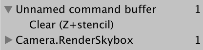

被如何清理应当取决取每台相机的clear flags以及background color，所以我们用硬编码来决定如何清理渲染目标。

```
		CameraClearFlags clearFlags = camera.clearFlags;		buffer.ClearRenderTarget(			(clearFlags & CameraClearFlags.Depth) != 0,			(clearFlags & CameraClearFlags.Color) != 0,			camera.backgroundColor		);
```

> clear flag 是怎样工作的：`CameraClearFlags` 是由一系列位标识组成的枚举，每一位的值表示某一特性启用或关闭、
>
> 通过将clear flag与希望知道的位标识，用位与操作符&结合，来提取出对应位的flag，最终结果如果不是0（1&1=1），则设置标志（true=1）

因为我们没有给command buffer设置名字，所以debugger里显示的是默认的名字“*Unnamed command buffer*”。让我们用相机的名字代替，通过对象初始化器语法，把它传给buffer的name属性。

```
		var buffer = new CommandBuffer {			name = camera.name		};
```

 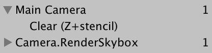

> 对象初始化器的语法...略

## 2.4剔除（Culling）

我们现在可以渲染天空盒，但是我们放进游戏场景中的物体还不能被渲染。我们只需要渲染摄像机可以看到的东西即可，并不是每一个物体都需要被渲染。所以在场景里所有的渲染器（renderer）中，我们剔除那些在相机视锥体外面的渲染器。

> 渲染器是什么： 一类附着在游戏物体上的组件，让物体可以被渲染成一些东西。 比如说 `MeshRenderer`组件

 想知道哪些内容可以被剔除，我们需要追踪多个相机的设置和矩阵，我们可以通过使用结构体`ScriptableCullingParameters`存储这些剔除信息。将填充结构体的工作交由静态方法 `CullResults.GetCullingParameters`，而不是我们自己完成。该方法将camera作为输入参数，并输出剔除参数。但是该结构体不是通过方法的返回值得到，而是把它当做第二个参数并用out修饰符修饰，让他成为一个输出参数。

```
	void Render (ScriptableRenderContext context, Camera camera) {		ScriptableCullingParameters cullingParameters;		CullResults.GetCullingParameters(camera, out cullingParameters); 		…	}
```

> 为什么要用out修饰符 ...略 

除了输出参数， `GetCullingParameters`返回一个bool值表示是否可以创建一个有效的剔除参数。并不是所有的相机设置都可以有效，不能用于剔除会导致错误的结果，所以如果失败了我们不渲染任何东西，直接退出Render方法。

```
		if (!CullResults.GetCullingParameters(camera, out cullingParameters)) {			return;		}
```

现在我们有了剔除参数，可以用它来剔除物体。通过调用静态方法 `CullResults.Cull`，传入剔除参数和上下文，返回一个 `CullResults` 结构体，里面包含了可以可见物体的信息。

我们需要给剔除参数添加一个ref修饰符，把它当做一个引用参数。

```
		if (!CullResults.GetCullingParameters(camera, out cullingParameters)) {			return;		} 		CullResults cull = CullResults.Cull(ref cullingParameters, context);
```

> 为什么要用ref修饰符 ...略 

> 为什么 `ScriptableCullingParameters是一个结构体 ...略` 

## 2.5 绘制（Drawing） 

现在我们知道哪些物体对于相机可见，接下来就是绘制这些物体的形状。我们调用context的DrawRenderers方法来实现，传入`cull.visibleRenderers`来告诉他绘制哪些渲染器（Renderer），除此之外，我们还需要提供绘制设置和过滤设置（分别用结构体`DrawRendererSettings`和`FilterRenderersSettings表示`），我们把它初始化为默认值。将绘制设置作为引用传入。

```
		buffer.Release(); 		var drawSettings = new DrawRendererSettings(); 		var filterSettings = new FilterRenderersSettings(); 		context.DrawRenderers(			cull.visibleRenderers, ref drawSettings, filterSettings		); 		context.DrawSkybox(camera);
```

> 为什么叫 `FilterRenderersSettings` 而不叫 `FilterRendererSettings 不知道，大概是错别字。`

 我们还是没有看到任何物体，因为默认的过滤设置是不包含任何东西的，我们通过给 `FilterRenderersSettings` 构造函数传入一个true参数让他包括每一个物体。

```
		var filterSettings = new FilterRenderersSettings(true);
```

另外，我们也要在绘制设置的构造方法里传入camera和 shader pass, camera用于设置排序和剔除层（layer），pass则是来控制哪些shaderpass可以用于渲染。

shader pass通过字符串定义，并包装在结构体重。现在让我们的pipeline只支持无光材质（unlit material），所以我们用unity默认的unlit pass，他被定义为 *SRPDefaultUnlit*。

```
		var drawSettings = new DrawRendererSettings(			camera, new ShaderPassName("SRPDefaultUnlit")		);
```

 

不透明（opaque）物体的形状已经出现了，半透明物体却没有显示出来。但是在frame debugger里我们可以看到，这些没显示的物体也是绘制过的。 

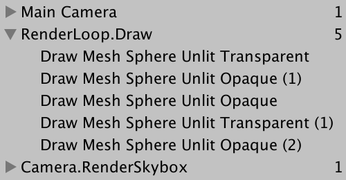

它们确实被绘制了，但是因为半透明物体的shaderpass不会写入深度缓冲，所以它们被之后的天空盒渲染给覆盖了。所以解决的方案就是把半透明物体的渲染时机放在天空盒后面。

首先，在天空盒之前我们要对渲染的物体做出限制，只能渲染不透明物体 。我们通过把过滤设置的`renderQueueRange`设置为 `RenderQueueRange.opaque`来实现我们想要的限制，它包含了0到2500（包括）的渲染队列。

```
		var filterSettings = new FilterRenderersSettings(true) {			renderQueueRange = RenderQueueRange.opaque		};
```

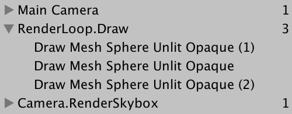（只有不透明物体被渲染）

接下来，我们在渲染天空盒后面，把队列范围该为`RenderQueueRange.transparen`(2501,5000] ,并再次渲染

```
var filterSettings = new FilterRenderersSettings(true) {			renderQueueRange = RenderQueueRange.opaque		}; 		context.DrawRenderers(			cull.visibleRenderers, ref drawSettings, filterSettings		); 		context.DrawSkybox(camera); 		filterSettings.renderQueueRange = RenderQueueRange.transparent;		context.DrawRenderers(			cull.visibleRenderers, ref drawSettings, filterSettings		);
```


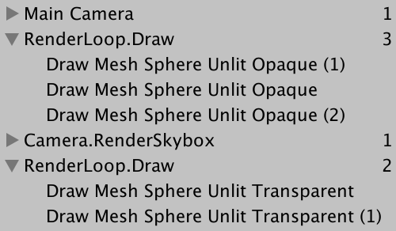不透明、天空盒、然后才是半透明

我们通过在天空盒之前渲染不透明物体来避免重复渲染。这些图形总是出现在天空盒前面，先渲染它们可以避免多余的工作。因为不透明物体的shader pass会写入深度缓冲，而深度缓冲可以用于跳过哪些在之后绘制的却比现在物体距离更远的东西。

除了遮盖天空盒，不透明的渲染器也会相互遮挡。理想状态下，每个片元只需要把最靠近摄像头的部分写入帧缓存。所以为了尽可能的减少重复渲染，我们应该先绘制最靠近的东西。因此在绘制之前，我们要整理渲染器的顺序，通过使用sorting flags 来控制。

绘制设置包含了一个sorting结构，它是`DrawRendererSortSettings`类型，该类型包含了所有的整理标识。在渲染不透明物体之前，我们把它设为 `SortFlags.CommonOpaque`。这告诉Unity根据距离从前到后（以及一些其他比较标准）来给渲染器排序。

```
		var drawSettings = new DrawRendererSettings(			camera, new ShaderPassName("SRPDefaultUnlit")		);		drawSettings.sorting.flags = SortFlags.CommonOpaque;
```

然而，半透明渲染器的工作方式却不是这样。它需要结合先前渲染的物体的颜色来决定自己应该怎么渲染，这样才能让他看起来是透明的，这要求我们重置渲染顺序，应该从后到前渲染，我们可以用 `SortFlags.CommonTransparent`来实现。

```
		context.DrawSkybox(camera); 		drawSettings.sorting.flags = SortFlags.CommonTransparent;		filterSettings.renderQueueRange = RenderQueueRange.transparent;		context.DrawRenderers(			cull.visibleRenderers, ref drawSettings, filterSettings		);
```

现在我们的pipeline已经可以正确的渲染无光的不透明和半透明物体了。 

[unitypackage](https://catlikecoding.com/unity/tutorials/scriptable-render-pipeline/custom-pipeline/rendering/rendering.unitypackage) 

# 3 打磨（Polishing）

一个实用的pipeline，能够正确渲染是其一。还有需要考虑的点，那就是它运行够快，不会分配不必要的临时对象和Unity编辑器可以很好的契合。

## 3.1 内存分配（Memory Allocations）

让我们测试一下pipeline就内存管理而言是否表现良好，亦或在每一帧都会分配内存，导致频繁的内存垃圾回收。以*Window / Analysis / Profiler* 的顺序打开profiler，在*Hierarchy模式（下方，默认是timeline）*中检查CPU Usage 的数据。虽然您可以在编辑器中以播放模式执行此操作，但通过确保创建开发构建并将其自动附加到分析器来分析构建也是一个好主意（it  is also a good idea to profile a build, by making sure you create a  development build and having it attach to the profiler automatically,），尽管在这种情况下无法进行深度分析。

以GC Alloc作为排序项，你将看到每一帧的确有内存被分配。一些不受我们控制，但是另一些被分配的内存字节则是来自我们pipeline的Render方法。

事实证明，剔除操作分配的内存最多。这是因为虽然`CullResults`是一个结构，但是其中包含了三个列表（list对象），每次我们new一个cullresult，我们都会为新列表分配内存。因此，即使CullResults是一个结构体也无济于事。

好在`CullResults.`Cull有一个重载方法，他接受结构体作为引用参数传递数据，而不是返回一个新创建的。这样就可以重复利用列表。我们要做的就是把cull作为类的一个字段，并将他作为 `CullResults.Cull的一个`附加参数，而不是分配给他。

```
	CullResults cull; 	… 	void Render (ScriptableRenderContext context, Camera camera) {		… 		//CullResults cull = CullResults.Cull(ref cullingParameters, context);		CullResults.Cull(ref cullingParameters, context, ref cull);				…	}
```

内存持续分配的另一个来源是我们在每帧使用相机的name属性。每次我们取得该值，它从本机代码中获取名称数据，这就需要创建一个新的字符串对象。所以我们将命令缓冲区始终命名为Render Camera。

```
		var buffer = new CommandBuffer() {			name = "Render Camera"		};
```

还有就是，命令缓冲区自身也是一个对象。好在我们可以创建一个命令缓冲区一次就可以重复使用它。用cameraBuffer字段替换局部变量。感谢对象初始化语法，我们可以创建一个命名好的命令缓冲区作为字段的默认值。还要改的一点就是我们应该用清理缓冲区代替释放我们可以使用Clear方法来完成。

```
	CommandBuffer cameraBuffer = new CommandBuffer {		name = "Render Camera"	}; 	… 	void Render (ScriptableRenderContext context, Camera camera) {		… 		//var buffer = new CommandBuffer() {		//	name = "Render Camera"		//};		cameraBuffer.ClearRenderTarget(true, false, Color.clear);		context.ExecuteCommandBuffer(cameraBuffer);		//buffer.Release();		cameraBuffer.Clear(); 		…	}
```

在这些更改后，我们的pipeline不会再每帧都创建临时对象了。

## 3.2帧调试器采样（Frame Debugger Sampling）

我们可以做的另一件事就是优化在帧调试器的显示。Unity提供的pipeline在帧调试器的的显示是一系列嵌套的层级事件。但是我们自己的pipeline相关渲染事件却都显示在根级别。我们也可以使用开始和结束分析器样本这两个命令行缓冲创建我们的层级系统。

在 `ClearRenderTarget之前调用BeginSample，在之后调用EndSample。`每次采样都要有开始和结束，而且名字必须相同，除此之外，最好使用和命令行缓冲区一样的名字来定义这个采样。命令行缓冲区的名字在很多地方都会用到。

```
		cameraBuffer.BeginSample("Render Camera");		cameraBuffer.ClearRenderTarget(true, false, Color.clear);		cameraBuffer.EndSample("Render Camera");		context.ExecuteCommandBuffer(cameraBuffer);		cameraBuffer.Clear();
```

 

可以看到，包含了清除操作的RenderCamera 层（cameraBuffer.ClearRenderTarget(true, false, Color.clear);）嵌套在了由commandbuffer创建的RenderCamera（cameraBuffer.BeginSample("Render Camera");...End...）中。

我们可以更进一步，将所有和摄像机有关的操作囊括其中。这要求我们将终止采样指令延迟到我们提交上下文之前。（但这样的话我们的EndSample命令就添加就在就在执行完命令行缓冲区后了）所以我们必须在之后插入一个额外的ExecuteCommandBuffer，用于执行结束采样的指令。我们使用同一个命令行缓冲区对象，完成后再次清理。

```
		cameraBuffer.BeginSample("Render Camera");		cameraBuffer.ClearRenderTarget(true, false, Color.clear);		//cameraBuffer.EndSample("Render Camera");		context.ExecuteCommandBuffer(cameraBuffer);		cameraBuffer.Clear(); 		… 		cameraBuffer.EndSample("Render Camera");		context.ExecuteCommandBuffer(cameraBuffer);		cameraBuffer.Clear(); 		context.Submit();
```

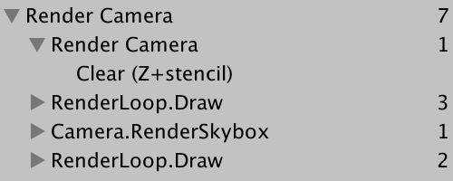

看起来不错，所有的操作都在根级别下方，但是清除指令却被嵌套在一个多余的Render Camera层里。我不知道为什么会这样，但可以把开始采样指令放在清除指令后面来避免。

```
		//cameraBuffer.BeginSample("Render Camera");		cameraBuffer.ClearRenderTarget(true, false, Color.clear);		cameraBuffer.BeginSample("Render Camera");		context.ExecuteCommandBuffer(cameraBuffer);		cameraBuffer.Clear();
```

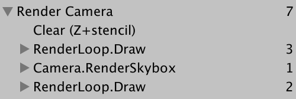

## 3.3 渲染默认通道（Rendering the Default Pipeline）

因为我们的通道现在只支持 unlit  着色器，所以使用其他着色器的物体不会被渲染，从而导致它们不可见。虽然这是正确的，但它掩盖了某些游戏物体使用了错误的着色器这一事实。如果我们可以通过Unity的error着色器来看到它们那就太好了,可以让他们显示为错误的洋红色外形。为此我们写一个专门的方法  DrawDefaultPipeline来处理，他需要传入上下文和相机。我们将在绘制完透明物体的最后调用它。

```
	void Render (ScriptableRenderContext context, Camera camera) {		… 		drawSettings.sorting.flags = SortFlags.CommonTransparent;		filterSettings.renderQueueRange = RenderQueueRange.transparent;		context.DrawRenderers(			cull.visibleRenderers, ref drawSettings, filterSettings		); 		DrawDefaultPipeline(context, camera); 		cameraBuffer.EndSample("Render Camera");		context.ExecuteCommandBuffer(cameraBuffer);		cameraBuffer.Clear(); 		context.Submit();	} 	void DrawDefaultPipeline(ScriptableRenderContext context, Camera camera) {}
```

Unity默认的表面着色器有一个forwardbase pass作为正向渲染的第一个pass，  我们可以用它来识别那些其使用的材质在默认渲染管道才能工作的物体。我们可以用一个新的绘制设置来筛选出用到这个pass的物体，再配合一个默认的过滤设置来进行渲染。我们不需要在意排序或者分离半透明和不透明物体，因为他们都是无效的物体。

```
	void DrawDefaultPipeline(ScriptableRenderContext context, Camera camera) {		var drawSettings = new DrawRendererSettings(			camera, new ShaderPassName("ForwardBase")		);				var filterSettings = new FilterRenderersSettings(true);				context.DrawRenderers(			cull.visibleRenderers, ref drawSettings, filterSettings		);	}
```

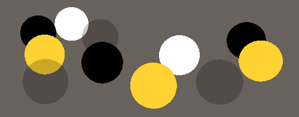

使用默认着色器的物体现在显示出来了，也可以在frame debugger里看到它们了。

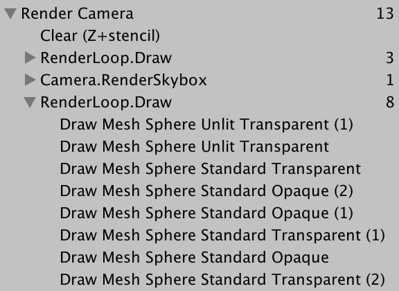

 因为我们的pipeline还不支持正向渲染的pass，所以它们没有被正确的渲染。由于必要的数据还没设置，所以依赖光照的一切事物都被当成黑色。相反，我们应该使用error着色器来渲染它们。想要做到，我们就要有一个error着色器。为此我们添加一个字段。接着在调用 `DrawDefaultPipeline`之前，如果error之前还没创建，就创建一个。另外设置材质的 hide flags为`HideFlags.HideAndDontSave` ,这样它就不会显示在项目窗口，也不会和其他的资源保存在一起了。

```
	Material errorMaterial; 	… 	void DrawDefaultPipeline(ScriptableRenderContext context, Camera camera) {		if (errorMaterial == null) {			Shader errorShader = Shader.Find("Hidden/InternalErrorShader");			errorMaterial = new Material(errorShader) {				hideFlags = HideFlags.HideAndDontSave			};		}				…	}
```

绘制设置有一个选项可以用于在渲染时用指定材质代替原有材质。通过调用`SetShaderPassName`来实现。它的第一个参数是我们想要覆盖的参数，第二个参数为我们指定材质的着色器中用于渲染的pass的序号。error着色器只有一个pass，所以设置序号为0。

```
		var drawSettings = new DrawRendererSettings(			camera, new ShaderPassName("ForwardBase")		);		drawSettings.SetOverrideMaterial(errorMaterial, 0);
```

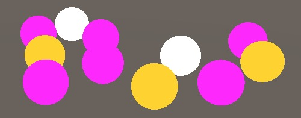

 使用不受支持材质的物体现在被明确的显示为错误的颜色。但是这只对使用unity默认管道的材质有效，也就是使用包含了ForwardBase pass的着色器。对于其他的内置着色器，我们可以用不同的pass来识别，主要是*PrepassBase*, *Always*, *Vertex*, *VertexLMRGBM*, 和 *VertexLM*这些。

幸运的是，我们可以调用 `SetShaderPassName`来给绘制设置添加多个用于筛选的pass。它的第二个参数是pass名。第一个参数是一个控制绘制pass顺序的索引，我们不关心这个，所以什么顺序都可以。通过构造函数添加的pass，它的序号被设为0，所以额外添加的这些pass，让他们的序号递增即可。

```
		var drawSettings = new DrawRendererSettings(			camera, new ShaderPassName("ForwardBase")		);		drawSettings.SetShaderPassName(1, new ShaderPassName("PrepassBase"));		drawSettings.SetShaderPassName(2, new ShaderPassName("Always"));		drawSettings.SetShaderPassName(3, new ShaderPassName("Vertex"));		drawSettings.SetShaderPassName(4, new ShaderPassName("VertexLMRGBM"));		drawSettings.SetShaderPassName(5, new ShaderPassName("VertexLM"));		drawSettings.SetOverrideMaterial(errorMaterial, 0);
```

我们现在已经覆盖了所有Unity提供的着色器了，这应该足以在创建场景时帮忙指出使用不正确的材质的物体。但我们只需要在开发是时考虑这些，在发布时就不需要了。所以我们应该让 `DrawDefaultPipeline`只在编辑器里被调用，通过给该方法添加`Conditional`特性是一种实现方式。

## 3.4 执行附加条件代码（Conditional Code Execution）

`Conditional`特性定义在`System.Diagnostics`命名空间，我们可以引用这个命名空间，但不幸的是其中包含的 `Debug`类型和`UnityEngine.Debug`相冲突。好在我们只需要用到这个特性，可以通过使用别名来代替使用整个命名空间来避免冲突，把特定类型赋值给一个有效的类型名称。在这种情况下，我们`System.Diagnostics.ConditionalAttribute`.把定义为 `Conditional`。

```
using UnityEngine;using UnityEngine.Rendering;using UnityEngine.Experimental.Rendering;using Conditional = System.Diagnostics.ConditionalAttribute;
```

为我们的方法添加该特性。它需要一个指定为标识符的字符串作为参数。如果这个标识符在编译中是定义了的，那么该方法的调用就正常包含在内。但如果没有被定义，那么就忽略此方法的调用（包括其所有参数）就好像`DrawDefaultPipeline(context, camera);这串代码`在编译中不存在一样。

要仅在编译Unity编辑器时包含调用，我们仰仗UNITY_EDITOR标识符。

```
	[Conditional("UNITY_EDITOR")]	void DrawDefaultPipeline(ScriptableRenderContext context, Camera camera) {		…	}
```

让我们更近一步，在开发版本（[development builds](https://forum.unity.com/threads/what-is-development-build.56377/)）也可以正常调用，只在发布版本时将他排除。要想实现这个，我们要再加一个用 *DEVELOPMENT_BUILD* 的conditional 。

```
	[Conditional("DEVELOPMENT_BUILD"), Conditional("UNITY_EDITOR")]	void DrawDefaultPipeline(ScriptableRenderContext context, Camera camera) {		…	}
```

## 3.5场景窗口的UI（UI in Scene Window） 

还有一件事我们没考虑到，那就是Unity游戏内的UI。在场景中添加一个UI元素用于测试。比如，用*GameObject / UI / Button*创建一个按钮。他会创建一个带画布（canvas）的按钮，以及一个事件系统。

事实证明，我们不需要做任何事就可以让UI在游戏窗口渲染。Unity会帮我们处理。frame debugger表明UI独立的进行渲染，并叠加在屏幕上。

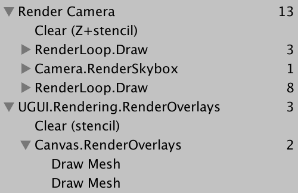UI在屏幕空间

 至少，当画布设置为在屏幕空间中渲染时就是这种情况。当设置为在世界空间中渲染时，UI将与其他透明对象一起渲染。

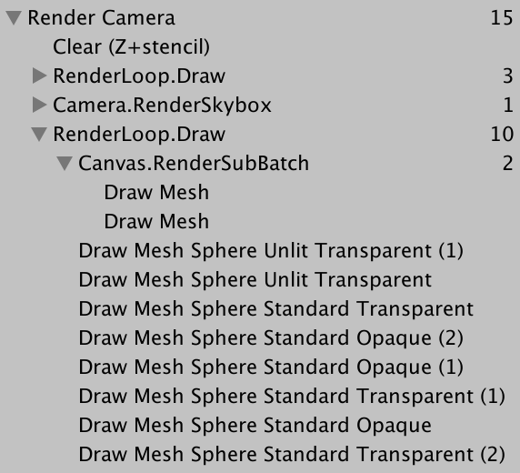UI在世界空间

虽然UI在游戏窗口可以正常工作，但是在场景窗口它并没有显示出来。在场景窗口，UI总是在世界空间存在，且我们必须手动将它注入场景。要添加UI，我们可以调用静态方法`ScriptableRenderContext.EmitWorldGeometryForSceneView`，它需要当前相机作为参数，该方法必须在剔除前调用。

```
		if (!CullResults.GetCullingParameters(camera, out cullingParameters)) {			return;		} 		ScriptableRenderContext.EmitWorldGeometryForSceneView(camera); 		CullResults.Cull(ref cullingParameters, context, ref cull);
```

但这会导致在游戏窗口，UI被添加了两次，为了防止这种情况，我们必须只在渲染场景窗口时调用这个方法。也就是当相机的`cameraType参数`为`CameraType.SceneView`. 时。

```
		if (camera.cameraType == CameraType.SceneView) {			ScriptableRenderContext.EmitWorldGeometryForSceneView(camera);		}
```

 这可以正常工作，但仅限编辑器 中，附加条件编译确保`在`针对发布时`EmitWorldGeometryForSceneView`不会编译进去（编译时没有该方法的具体实现 ）。这就意味着在我们尝试发布时会得到一个编译错误。想让他再次工作，我们必须使调用EmitWorldGeometryForSceneView的代码也是有条件的。我们可以把代码放着#if和#endif声明中实现。#if声明需要一个标识符，就像`Conditional`特性一样，通过使用UNITY_EDITOR，仅在为编辑器编译时才会包含该代码。

```
	void Render (ScriptableRenderContext context, Camera camera) {		ScriptableCullingParameters cullingParameters;		if (!CullResults.GetCullingParameters(camera, out cullingParameters)) {			return;		} #if UNITY_EDITOR		if (camera.cameraType == CameraType.SceneView) {			ScriptableRenderContext.EmitWorldGeometryForSceneView(camera);		}#endif 		CullResults.Cull(ref cullingParameters, context, ref cull); 		…	}
```