# 可编程渲染管线2 自定义着色器

原文：https://catlikecoding.com/unity/tutorials/scriptable-render-pipeline/custom-shaders/

- 写一个HLSL shader
- 定义常量缓冲区（constant buffers）
- 使用渲染管线核心库文件（Render Pipeline Core Library）.
- 支持动态批处理和GPU实例.

这是Unity可编程渲染管线教程的第二章。文章涉及使用HLSL创建shader和通过将多个物体批处理（batching）成一个draw call来更高效的渲染它们。

该教程基于Unity 2018.3.0f2.

# 1 自定义Unlit Shader

虽然我们之前用默认的unlit shader来测试我们的pipeline。但能够使用我们自定义的shader，才算充分利用我们的非常规（nontrivial 非平凡的）自定义pipeline。

## 1.1 创建一个shader

shader资源可以通过*Assets / Create / Shader* 面板其中任意一个选项创建，Unlit shader是最合适的选择，但我们要重新开始，所以删掉新建shader文件中的所有默认代码，并把它命名为Unlit。

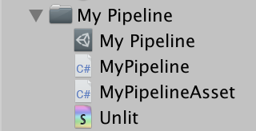

shader文件的基本语法在[Rendering 2, Shader Fundamentals](https://catlikecoding.com/unity/tutorials/rendering/part-2/)有解释。如果你不熟悉编写shader，请仔细阅读，以便了解基础知识。一个有效的shader至少得定义Properties语句块和SubShader语句块，后者至少要包含一个Pass语句块。如此Unity会将它转变为一个默认的白色unlit  shader。跟随在Shader关键词后面的字符串自则会用于材质shader选项的下拉式菜单。

```
Shader "My Pipeline/Unlit" {		Properties {}		SubShader {				Pass {}	}}
```

调整前文的Unlit Opaque材质，令它使用我们新建的shader，目前仍未填写完整，因此将转变为白色。 

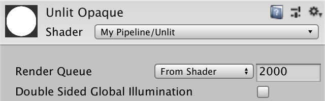

## 1.2 HLSL

写自己的shader，则需在Pass语句块中放置程序代码。Unity支持GLSL和HLSL。GLSL用在默认shader中(见[Rendering 2, Shader Fundamentals](https://catlikecoding.com/unity/tutorials/rendering/part-2/))，但Unity新增的渲染管线使用HLSL，所以我们自己的pipeline也同样使用HLSL。这就意味着我们要把我们的代码写在`HLSLPROGRAM和ENDHLSL声明之间。`

```
		Pass {			HLSLPROGRAM						ENDHLSL		}
```

> ###  GLSL和HLSL程序有有何不同？
>
> 实际上，Unity对两者使用几乎相同的语法，并负责为每个发布平台转换成合适的shader代码。最大的不同就是GLSL程序包含了一些默认的代码，而HLSL项目没有任何隐式内容，我们需要的任何内容都需要显示导入。不过没关系，因为较老的GLSL包含文件反而受到一些老旧废弃代码的拖累。而我们可以用更新的HLSL包含文件代替。

无论如何，一个unity shader至少要一个顶点函数和一个片元函数，两者通过pragma编译指令定义，我们指定`UnlitPassVertex`作为顶点函数， `UnlitPassFragment`为片元函数。我们不在当前的shader文件中为这些函数填写代码。相反，我们将这些HLSL代码写个另一个独立的包含文件中。我们将其命名为*Unlit*，并修改拓展名为hlsl。放在*Unlit* shader的同级文件夹中，然后在HLSL程序中的pragma指令后面导入该文件。

```
			HLSLPROGRAM						#pragma vertex UnlitPassVertex			#pragma fragment UnlitPassFragment						#include "Unlit.hlsl"						ENDHLSL
```

不巧的是Unity没有一个方便的面板选项去创建一个HLSL包含文件。你得自己创建它，比如赋值Unity.shader文件，然后把它后缀名修改为hlsl，并移除其中的shader代码。

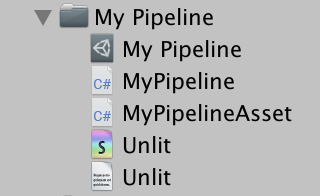

在包含文件中，以一个导入保护开始，如果文件被导入多次，可以借此避免代码重复。虽然这应该永远不会发生，但给每个包含文件执行该操作是个好习惯。

```
#ifndef MYRP_UNLIT_INCLUDED#define MYRP_UNLIT_INCLUDED #endif // MYRP_UNLIT_INCLUDED
```

无论如何，在顶点程序里我们至少得知道顶点位置，并输出齐次裁减空间的位置。所以我们为顶点程序定义一个输入结构和一个输出结构，两者都有一个float4类型的位置信息。

```
#ifndef MYRP_UNLIT_INCLUDED#define MYRP_UNLIT_INCLUDED struct VertexInput {	float4 pos : POSITION;}; struct VertexOutput {	float4 clipPos : SV_POSITION;}; #endif // MYRP_UNLIT_INCLUDED
```

 然后，我们定义顶点方法。目前，我们直接使用对象空间顶点位置作为裁减空间位置。这是错误的，只不过是为了快速得到一个可以编译的shader。我们稍后会添加正确的空间转换操作。

```
struct VertexOutput {	float4 clipPos : SV_POSITION;}; VertexOutput UnlitPassVertex (VertexInput input) {	VertexOutput output;	output.clipPos = input.pos;	return output;} #endif // MYRP_UNLIT_INCLUDED
```

我们目前仍保持使用默认的白色，所以我们的片元方法简单的将1作为float4类型的返回值。该方法接受顶点输出参数插值后的结果作为一个输入值，所以为此添加一个参数，尽管我们现在不会用到它。

```
VertexOutput UnlitPassVertex (VertexInput input) {	VertexOutput output;	output.clipPos = input.pos;	return output;} float4 UnlitPassFragment (VertexOutput input) : SV_TARGET {	return 1;} #endif // MYRP_UNLIT_INCLUDED
```

> ### 我们应该使用half还是float类型?
>
> 绝大多数的现代GPU都支持这两个精度类型，half会更有效率。所以你想为移动平台做优化，尽可能多的使用half类型会很有效。原则上float只用于位置和纹理坐标,其他的只要最终结果可以接受，用half类型足矣。
>
> 当目标不是移动平台。精度不是问题，因为GPU总是使用float类型，即使你写half。在教程中，我会一直使用float类型。
>
> 另外还有fixed类型。但这只在一些古老的硬件上支持，它们不会是你移动应用的目标平台。所以它总是等同于half类型。

## 1.3 转换矩阵

现在我们有了一个能编译的shader，虽然它现在还不能产生有意义的结果。下一步就是将顶点位置转换到正确的坐标空间。如果我们有一个模型-视角-投影矩阵，那我们就可以用它直接将物体从对象空间转换到裁减空间了，但是unity没有没有为我们提供这样一个矩阵。只有模型空间矩阵可用，我们可以用它从对象空间转换到世界空间。unity假设我们的shader有一个`**float4x4** unity_ObjectToWorld` 变量去储存这个矩阵。因为我们使用HLSL，所以我们得自己定义这个值了。接着用它在顶点函数中将位置转换到世界空间并将作为输出项。

```
float4x4 unity_ObjectToWorld; struct VertexInput {	float4 pos : POSITION;}; struct VertexOutput {	float4 clipPos : SV_POSITION;}; VertexOutput UnlitPassVertex (VertexInput input) {	VertexOutput output;	float4 worldPos = mul(unity_ObjectToWorld, input.pos);	output.clipPos = worldPos;	return output;}
```

接下来，我们需要从世界空间转到裁减空间。通过视角-投影矩阵完成，unity将通过  `**float4x4** unity_MatrixVP变量`来存储。让我们添加它来完成转换。

```
float4x4 unity_MatrixVP;float4x4 unity_ObjectToWorld; … VertexOutput UnlitPassVertex (VertexInput input) {	VertexOutput output;	float4 worldPos = mul(unity_ObjectToWorld, input.pos);	output.clipPos = mul(unity_MatrixVP, worldPos);	return output;}
```

> ### 我修改了代码，但是没有作用？
>
> 当编辑包含文件时，Unity并不会总是响应修改，导致没有即时更新shader。如果发生了这个情况，尝试再保存一遍，如果必要，也可以做一个你在之后可以撤销的小改动。

 我们的shader现在可以正常工作了。所有使用unlit材质的物体也再次以全白的颜色可见了。但我们的转换没有尽可能的高效。因为它正在用4D位置矢量执行全矩阵乘法,第四个矢量分量永远为1，我们可以把它显式写出来让编译器去优化计算。

```
	float4 worldPos = mul(unity_ObjectToWorld, float4(input.pos.xyz, 1.0));
```

> ### 这个优化有意义吗?
>
> 这个优化Unity自己也做了，而且很积极的升级了所有用到这个操作的shader。它的不同之处就在于mad和add指令。是否有明显的不同则取决于平台。但无论什么情况，这只会更快不会变慢。
>
> 下面是d3d11的没有优化的空间转换代码
>
> ```
>    0: mul r0.xyzw, v0.yyyy, cb1[1].xyzw   1: mad r0.xyzw, cb1[0].xyzw, v0.xxxx, r0.xyzw   2: mad r0.xyzw, cb1[2].xyzw, v0.zzzz, r0.xyzw   3: mad r0.xyzw, cb1[3].xyzw, v0.wwww, r0.xyzw   4: mul r1.xyzw, r0.yyyy, cb0[1].xyzw   5: mad r1.xyzw, cb0[0].xyzw, r0.xxxx, r1.xyzw   6: mad r1.xyzw, cb0[2].xyzw, r0.zzzz, r1.xyzw   7: mad o0.xyzw, cb0[3].xyzw, r0.wwww, r1.xyzw
> ```
>
> 下面则是优化后的转换
>
> ```
>    0: mul r0.xyzw, v0.yyyy, cb1[1].xyzw   1: mad r0.xyzw, cb1[0].xyzw, v0.xxxx, r0.xyzw   2: mad r0.xyzw, cb1[2].xyzw, v0.zzzz, r0.xyzw   3: add r0.xyzw, r0.xyzw, cb1[3].xyzw   4: mul r1.xyzw, r0.yyyy, cb0[1].xyzw   5: mad r1.xyzw, cb0[0].xyzw, r0.xxxx, r1.xyzw   6: mad r1.xyzw, cb0[2].xyzw, r0.zzzz, r1.xyzw   7: mad o0.xyzw, cb0[3].xyzw, r0.wwww, r1.xyzw
> ```

##  1.4 常量缓冲区（Constant Buffers）

Unity不为我们提供模型-视角-投影矩阵，因为M和VP矩阵的相乘是可以避免的。除此之外，对于被同一相机中渲染的物体，VP矩阵在每帧可以被重复使用。Unity的shader重复利用这一事实，将这些矩阵放在不同的常量缓存区中。虽然我们将它定义为变量，但它的数据在绘制单个图形的时间内保持不变,甚至往往保持的更久。VP矩阵可以放在逐帧缓存区，而M矩阵则保存在逐绘制（per-draw）缓存区。

虽然没有强制要求将这些shader变量放在常量缓存区，但是这么做可以更有效地更改同一缓冲区中的所有数据。至少在对应的图形api支持的时候是这样的。不过OpenGL不支持。

为了更有效率，我们充分利用常量缓存区。Unity将VP矩阵放在`UnityPerFrame`缓存区，把M矩阵放在`UnityPerDraw`缓存区。有很多数据都可以放在这些缓存区中，但是我们目前还不需要，暂时不包括他们。一个常量缓存区像结构体一样定义，除了使用**cbuffer**关键词，变量可以像之前一样正常访问。

```
cbuffer UnityPerFrame {	float4x4 unity_MatrixVP;}; cbuffer UnityPerDraw {	float4x4 unity_ObjectToWorld;}
```

## 1.5 Core Library

因为常量缓存区并不对所以平台有增益，所以Unity的shader依赖宏来确保只在需要使使用它们。用宏`**CBUFFER_START**`带一个名字参数来代替cbuffer，接着以宏`**CBUFFER_END**` 来作为缓冲区的结尾。让我们也使用这种方法来创建常量缓存区。

```
CBUFFER_START(UnityPerFrame)	float4x4 unity_MatrixVP;CBUFFER_END CBUFFER_START(UnityPerDraw)	float4x4 unity_ObjectToWorld;CBUFFER_END
```

这样会出现编译错误，因为这两个宏都还没有被定义。与其自己找出适合使用常量缓存区的时机并定义宏，我们利用Unity为渲染管线提供的核心库。可以通过Package  manager窗口来把它添加到我们的项目中。切换All Package列表，启用在Advanced下的Show Preview  package条目。然后选择Render-pipelines.core并安装。我用的是4.6的预览版本。在2018.3中可以工作的最高版本。

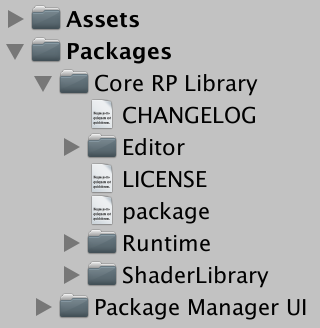

我们现在可以导入公共库相关功能了，通过*Packages/com.unity.render-pipelines.core/ShaderLibrary/Common.hlsl*.来访问。其中定义了多个有用的方法和宏，包括常量缓冲区的宏，所以我们在用之前导入它。

```
#include "Packages/com.unity.render-pipelines.core/ShaderLibrary/Common.hlsl" CBUFFER_START(UnityPerFrame)float4x4 unity_MatrixVP;CBUFFER_END
```

> ### 这些宏到底是怎样的？
>
> 你可以打开在core library包里的*Common.hlsl*文件来查看。它包含了API子文件夹中的各平台API具体包含文件，这些宏就定义在其中。

## 1.6 编译目标等级（Compilation Target Level）

我们的shader再次正常工作，至少对绝大多数平台而言。在导入这个库之后，我们的shader在编译成OpenGL ES  2时失败了，这是因为Unity对OpenGL ES 2默认使用的编译器，无法和core library一同工作。我们可以为我们的shader添加`#pragma prefer_hlslcc gles`来修正这个问题，对于轻量级渲染管线，Unity也是这么做的。但与其这样，我们干脆直接不支持OpenGL ES 2，因为它仅在目标为旧移动设备时才有用。通过指令`#pragma target`将目标shader级别设为3.5来代替默认的级别2.5。

```
			#pragma target 3.5						#pragma vertex UnlitPassVertex			#pragma fragment UnlitPassFragment
```

## 1.7 文件结构

注意，在core librar中，所有的HLSL包含文件都是放在当前文件夹的*ShaderLibrary文件夹中。*我们也这么做，把*Unlit.hlsl*放进一个在 *My Pipeline*里的新文件夹*ShaderLibrary*中。把shader也同样反正一个独立的*Shader*文件夹中。

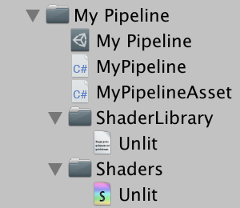

为了保持我们的着色器完整，同时仍然依赖于相对包含路径，我们必须将我们的include语句从Unlit.hlsl更改为../ShaderLibrary/Unlit.hlsl。

```
    #include "../ShaderLibrary/Unlit.hlsl"
```

# 2 动态批处理

现在我们有了一个最简单的自定义shader，可以用于进一步研究我们的pipeline如何渲染物体。有个大问题就是怎样才能让他高效的渲染。通过在场景中放满一大堆使用我们unlit材质的球体进行测试。你可以放成百上千个，当然几十个已经足够用于传递信息了。可以有不同的位置信息，但是要保证他们缩放的统一，也就是说缩放的xyz方向应该总是相同的。


在frame debugger里观察场景如何被渲染时，你会发现每一个球体都要求有自己的绘制调用（draw  call）。这样效率就很低，因为CPU和GPU需要进行通信，这会让每个draw call都产生开销。要是多个球体可以用单个draw  call同时绘制就好了。这当然是可能的，不过目前并没有发生。在你选择其中一个draw call后，frame debugger给出了相应的解释。

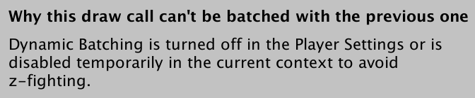

## 2.1 启用批处理

frame debugger告诉我们动态批处理用不了，可能是因为它被关闭了，也可能是受到了深度整理的干扰。如果你检查player setting，我会发现事实上 *Dynamic Batching*选项是关闭的。当然，此时你开启了也不会有效果。因为这个playersetting只应用到了默认的Unity pipeline，我们自己的pipeline并没有受它影响。

要为我们的pipeline开启动态批处理，我们就得在 `**MyPipeline**.Render`里明确指明允许使用动态批处理。绘制设置包含了一个flags字段，我们可以把它设为`DrawRendererFlags.EnableDynamicBatching`.

```
		var drawSettings = new DrawRendererSettings(			camera, new ShaderPassName("SRPDefaultUnlit")		);		drawSettings.flags = DrawRendererFlags.EnableDynamicBatching;		drawSettings.sorting.flags = SortFlags.CommonOpaque;
```

啊在这之后我们人没有得到动态批处理，但是结果已经有变化了。动态批处理意味着Unity要在绘制之前将多个物体合并成单个网格。这需要一定的CPU时间，为了控制时间长度，动态批处理只限于小型网格。

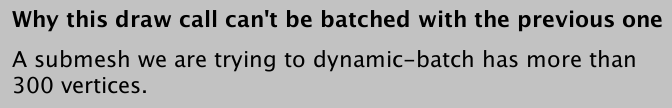

球形网格太大太复杂了，但是方块的网格很简单，可以进行动态批处理。所以将所有的物体调整为立方体网格。你可以全选，然后一次性修改它们的mesh filter。

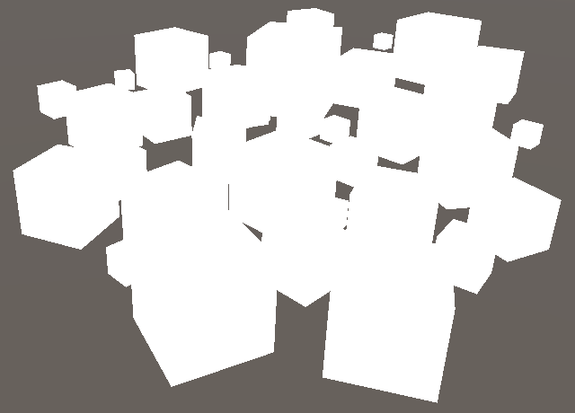


> PS：我用的2018.3.2，开启动态批处理后frame debugger里不会显示 RenderLoop.Draw，但是在Stats里看，的确是合并了

## 2.2 颜色

动态批处理现在对于使用同一材质绘制的小型网格有效了。但是当涉及多个不同材质时，事情变得复杂起来。为了进行演示，我们让我们的unlitshader可以修改颜色。在`**Properties**` 语句块中添加一个颜色属性，命名为_Color,标签名为Color，默认为白色。

```
	Properties {		_Color ("Color", Color) = (1, 1, 1, 1)	}
```

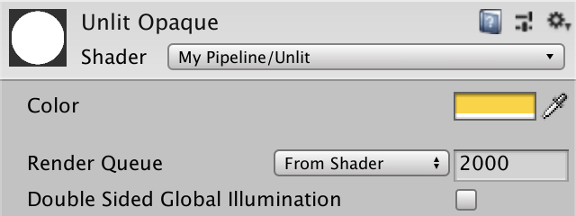

现在我们可以调整我们材质的颜色，只是暂时还不会影响到最终渲染的结果。在我们的包含文件中添加 float4   _Color变量。并用该值代替UnlitPassFragment的返回值。这个颜色由每个材质定义，因此我们把它放到常量缓存区，只有切换材质是，这个变量值才需要改变。和Unity做的一样，我们把这个缓存区命名为UnityPerMaterial。

```
CBUFFER_START(UnityPerDraw)	float4x4 unity_ObjectToWorld;CBUFFER_ENDCBUFFER_START(UnityPerMaterial)	float4 _Color;CBUFFER_END struct VertexInput {	float4 pos : POSITION;}; … float4 UnlitPassFragment (VertexOutput input) : SV_TARGET {	return _Color;}
```

复制我们的材质，给予两者不同的材质，我们可以因此区分它们。选择一些物体使用新材质，你最终会看到这样的混合

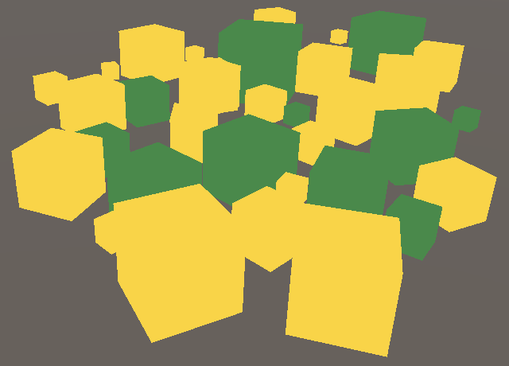

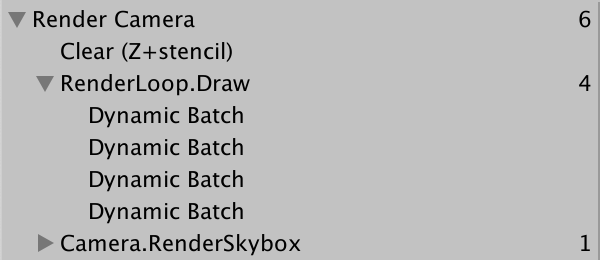两个材质，四个动态批处理

动态批处理还是有的，但是最终被分成了多个批处理。每个材质至少会有一个批处理，因为各自需要不同的逐材质数据。但是常常会分成更多的批处理项，因为Unity偏向于按空间对物体进行分组以减少重复绘制。


## 2.3 可选的批处理

动态批处理可能会很有效，也可能最终没什么用，甚至会变得更慢。如果你的场景里没有包含大量使用同一材质的小型网格，关闭动态批处理可能反而更有效率，因为这样Unity就不同在每一帧检查是否要使用批处理了。所以我们为我们的pipeline添加一个是否开启动态批处理的选项。我们不能依赖player  settings里的设置，相反，我们应该在MyPipelinAsset里添加一个配置选项开关，这样我们就可以在编辑器里用我们的pipeline  asset来进行配置。

```
	[SerializeField]	bool dynamicBatching;
```

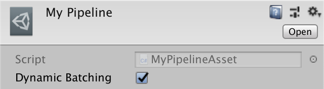

当生成MyPipeline实例时，我们的告知是否使用动态批处理。我们通过构造函数以参数的形式传递这个信息。

```
	protected override IRenderPipeline InternalCreatePipeline () {		return new MyPipeline(dynamicBatching);	}
```

MyPipeline的默认构造函数无法满足这个情况，所以我们自己写一个公有构造方法，要求一个布尔类型参数来控制动态批处理。我们创建一个drawFlags字段，在构造函数里初始化。 

```
	DrawRendererFlags drawFlags; 	public MyPipeline (bool dynamicBatching) {		if (dynamicBatching) {			drawFlags = DrawRendererFlags.EnableDynamicBatching;		}	}
```

在Render方法中将它赋值给drawSettings.flags。

```
		drawSettings.flags = drawFlags;
```

请注意，每当我们开启或关闭在编辑器对应MyPipeline资源里的*Dynamic Batching*按钮，Unity会立即改变批处理的行为。每次我们调整这个资源，一个新的pipeline就会被创建出来。

## 3 GPU实例（GPU Instancing）

动态批处理不是降低每帧drawcall的唯一方法。我们还可以使用GPU实例。在实例化的情况下，CPU通信给GPU，让它绘制某个特定的网格和材质组合多次，而只需要单次的drawcall。这样就可以将使用相同网格和材质的物体归类为一组，重复利用单个网格，而不用多次构建新网格。这也摆脱了对网格大小的限制

### 3.1实例化选项

GPU实例默认是启用的，但是我们先前用自定义的draw flags覆盖了。让我们也给GPU实例创建一个选项。这样就可以很轻松的区分开启和没开启时的结果。为MyPipelineAsset添加另一个开关，再把它传进构造函数里。

```
	[SerializeField]	bool instancing;		protected override IRenderPipeline InternalCreatePipeline () {		return new MyPipeline(dynamicBatching, instancing);	}
```

在MyPipeline构造函数里，在设置完动态批处理后再设置实例化的标识。  用`DrawRendererFlags.EnableInstancing` 开启实例化，我们用位或（OR）操作添加到原来的drawFlags中。

```
	public MyPipeline (bool dynamicBatching, bool instancing) {		if (dynamicBatching) {			drawFlags = DrawRendererFlags.EnableDynamicBatching;		}		if (instancing) {			drawFlags |= DrawRendererFlags.EnableInstancing;		}	}
```

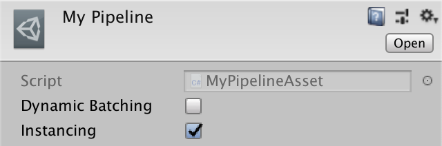

 

### 3.2 材质支持 

开启GPU实例化，并不意味着在我们pipeline里的物体就可以自动实例化。只有它们用的材质支持GPU实例化才可以。因为实例化不是必要的，这是一个可选项，所以需要两个shader变体，一个支持，一个不支持。我们可以通过给我们的shader添加指令`#pragma multi_compile_instancing`来得到想要的变体。在这个例子里，会产生两个shader变体，一个定义了`INSTANCING_ON`关键字，另一个没有。

```
			#pragma target 3.5						#pragma multi_compile_instancing						#pragma vertex UnlitPassVertex			#pragma fragment UnlitPassFragment
```

这会在我们的材质面板里出现一个新的配置选项： *Enable GPU Instancing*.

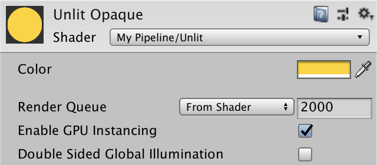

### 3.3 着色器支持

当实例化启用时，GPU会被告知用相同的常量数据绘制同个网格多次。不幸的是M矩阵也包括在这些常量数据中，这就意味着我们用完全一样的数据多次渲染相同的网格。为了避开这个问题，我们将所有物体的M矩阵放在常量缓存区的一个数组中。每个要渲染的实例物体都有自己的序号，通过序号可以从数组中得到匹配的M矩阵。

我们没开启实例化时要用`unity_ObjectToWorld，开启时则要用矩阵数组`。为了让`UnlitPassVertex`可以同时处理这两种情况。我们将这个矩阵定义成一个宏，名字必须是`**UNITY_MATRIX_M**`。用这个名字是因为在核心库中的一个包含文件中，也定义了这样一个宏来支持实例化操作。它会在我们需要的时候用矩阵数组来重定义`**UNITY_MATRIX_M**。`

```
CBUFFER_START(UnityPerDraw)	float4x4 unity_ObjectToWorld;CBUFFER_END #define UNITY_MATRIX_M unity_ObjectToWorld … VertexOutput UnlitPassVertex (VertexInput input) {	VertexOutput output;	float4 worldPos = mul(UNITY_MATRIX_M, float4(input.pos.xyz, 1.0));	output.clipPos = mul(unity_MatrixVP, worldPos);	return output;}
```

这个包含文件就是*UnityInstancing.hlsl*,。因为它可能需要重定义宏`**UNITY_MATRIX_M**` 。所以导入该文件需要在我们定义自己完这个宏之后。

```
#define UNITY_MATRIX_M unity_ObjectToWorld #include "Packages/com.unity.render-pipelines.core/ShaderLibrary/UnityInstancing.hlsl"
```

 当开启实例化后，当前渲染物体的序号会被添加到GPU的顶点数据中。`**UNITY_MATRIX_M**` 需要这个序号,所以将它添加在`**VertexInput**`结构体中。为此，我们可以使用宏`**UNITY_VERTEX_INPUT_INSTANCE_ID**`。

```
struct VertexInput {	float4 pos : POSITION;	UNITY_VERTEX_INPUT_INSTANCE_ID};
```

现在，我们能够在`UnlitPassVertex`里使用`**UNITY_MATRIX_M**` 前获取该序号了，通过宏 `**UNITY_SETUP_INSTANCE_ID，**`它成为了顶点输入数据之一。

```
VertexOutput UnlitPassVertex (VertexInput input) {	VertexOutput output;	UNITY_SETUP_INSTANCE_ID(input);	float4 worldPos = mul(UNITY_MATRIX_M, float4(input.pos.xyz, 1.0));	output.clipPos = mul(unity_MatrixVP, worldPos);	return output;}
```

我们的立方体现在可以被GPU实例化了，和动态批处理一样，由于使用了不同的材质，最终分为了多个批次。确保所有使用的材质都开启了GPU实例。

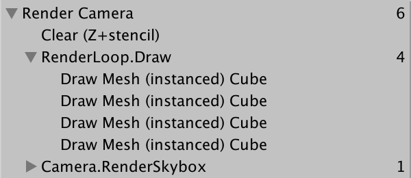

除了模型到世界空间矩阵，默认的世界到模型空间矩阵也同样放在实例缓存区（instancing buffer）。它们是矩阵M的转置矩阵，当进行非统一缩放时，计算法向量会需要它们。但我们都是统一缩放，就不需要这些额外的矩阵了。所以为我们的shader添加指令 `#pragma instancing_options assumeuniformscaling`来通知unty我们用的是统一缩放。

```
			#pragma multi_compile_instancing			#pragma instancing_options assumeuniformscaling
```

如果你想要支持非统一缩放的物体，你就需要使用一个没有开启该选项的shader。 

### 3.4 多种颜色

如果我们想在场景中添加更多的颜色，就得用更多的材质，这就意味着更多的批次。但是既然矩阵可以保存在数组里，颜色为什么不可以。这样我们就可以将不同颜色的物体结合成一个批次。只需要一点小小的工作，这个想法就能实现。

要想每个物体有各自色彩的第一步就是让他们能够地理的设置颜色，我们不可以在材质里修改颜色，因为这是所有物体共享的资源。我们的为此专门创建一个脚本，就把它命名为`**InstancedColor**`，给他一个单独的字段配置颜色。这不是特别针对我们的pipeline的，所以这个脚本要放在*My Pipeline*文件夹外。

```
using UnityEngine; public class InstancedColor : MonoBehaviour { 	[SerializeField]	Color color = Color.white;}
```

 想要覆盖材质的原有颜色，我们需要为我们的renderer脚本提供一个材质属性块，通过new一个`MaterialPropertyBlock` 对象实例来完成，再调用它的 `SetColor`方法，将颜色传递给_Color属性，接着调用`MeshRenderer`脚本的`SetPropertyBlock`方法将它传递进去。我们假设在play模式下颜色保持不变，所以放在类的Awake方法里。

```
	void Awake () {		var propertyBlock = new MaterialPropertyBlock();		propertyBlock.SetColor("_Color", color);		GetComponent<MeshRenderer>().SetPropertyBlock(propertyBlock);	}
```

为场景里的每个物体添加该脚本。你就会发现在进去play模式后它们的颜色改变了。

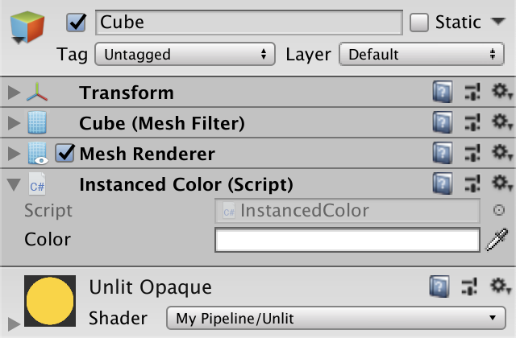

想在edit模式下也可以看到颜色立即改变，就要把设置颜色的相关代码移到OnValidate方法中，Awake方法可以简单的调用OnValidate方法，这样我们就不用再复制一遍了。

```
	void Awake () {		OnValidate();	} 	void OnValidate () {		var propertyBlock = new MaterialPropertyBlock();		propertyBlock.SetColor("_Color", color);		GetComponent<MeshRenderer>().SetPropertyBlock(propertyBlock);	}
```

> ### 什么时候`OnValidate`会被调用？
>
> 是一个特别的Unity事件方法。他会在edit模式下当脚本加载或修改时被调用。所以每次场景加载或者我们编辑该脚本是时，修改的颜色会立刻显示处理。

给所有物体添加该脚本，全选然后一次性添加，但是不要重复添加。另外他们要使用相同的材质，替代材质可以移除了，因为我们要给每个物体配置颜色。


要注意得是，现在每当我们设置覆盖颜色时都会创建一个新的 `MaterialPropertyBlock`实例。这不是很必要，因为每个网格渲染器内部都会追踪覆盖属性，并从属性块中拷贝它们。这就说明我们可以重复利用它，所以我们只在需要单个静态属性块，并且只在需要使创建。

```
	static MaterialPropertyBlock propertyBlock; 	… 	void OnValidate () {		if (propertyBlock == null) {			propertyBlock = new MaterialPropertyBlock();		}		propertyBlock.SetColor("_Color", color);		GetComponent<MeshRenderer>().SetPropertyBlock(propertyBlock);	}
```

此外，我们可以通过Shader.PropertyToID方法获取其属性ID，从而略微加快color属性的搜寻匹配。 每个shader属性名都有一个全局整数标识符。这些标识符可能会改变，但是在单个时间段里总是保持不变的,也就是在游玩和编译时。所以我们只要获取一次，就可以作为静态字段的默认值使用。

```
	static int colorID = Shader.PropertyToID("_Color"); 	…		void OnValidate () {		if (propertyBlock == null) {			propertyBlock = new MaterialPropertyBlock();		}		propertyBlock.SetColor(colorID, color);		GetComponent<MeshRenderer>().SetPropertyBlock(propertyBlock);	}
```

###  3.5 逐实例颜色（Per-Instance Colors）

为每个物体修改颜色会打断GPU实例化，虽然我们使用同一材质，但关键在于用于渲染的数据不同。由于我们修改了每个物体的颜色，从而迫使它们被分别渲染。


让我们的实例化可以再次工作的方法就是将颜色数据放在数组了。我们要对_Color属性做和M矩阵同样的事情。但是这里我们必须全有我们自己完成，因为core library不可能为每个属性都重定义宏。我们的手动的创建一个常量缓存区用于实例化。使用 `**UNITY_INSTANCING_BUFFER_START**`以及对应的结尾宏，为了保持风格的一致，我们命名为`PerInstance`。在这个缓存区里，我们用`**UNITY_DEFINE_INSTANCED_PROP**(**float4**, _Color)`定义颜色。实例化未开启是，它等同于 `**float4** _Color`，不然就是一个保存实例化数据的数组。

```
//CBUFFER_START(UnityPerMaterial)	//float4 _Color;//CBUFFER_END UNITY_INSTANCING_BUFFER_START(PerInstance)	UNITY_DEFINE_INSTANCED_PROP(float4, _Color)UNITY_INSTANCING_BUFFER_END(PerInstance)
```

要处理现在可以定义颜色的两种可能方式，我们必须通过UNITY_ACCESS_INSTANCED_PROP宏来访问他，通过我们的缓存区名字和属性名来得到想要的数据。

```
float4 UnlitPassFragment (VertexOutput input) : SV_TARGET {	return UNITY_ACCESS_INSTANCED_PROP(PerInstance, _Color);}
```

现在我们必须要在`UnlitPassFragment`里也可以获取实例序号。所以在`**VertexOutput**`里同样添加 `**UNITY_VERTEX_INPUT_INSTANCE_ID，**`然后在`UnlitPassFragment`里像之前我们在`UnlitPassVertex`里那样使用 `**UNITY_SETUP_INSTANCE_ID**` 。我们用宏`**UNITY_TRANSFER_INSTANCE_ID**`将数据从顶点输入结构拷贝大顶点输出结构中。

```
struct VertexInput {	float4 pos : POSITION;	UNITY_VERTEX_INPUT_INSTANCE_ID}; struct VertexOutput {	float4 clipPos : SV_POSITION;	UNITY_VERTEX_INPUT_INSTANCE_ID}; VertexOutput UnlitPassVertex (VertexInput input) {	VertexOutput output;	UNITY_SETUP_INSTANCE_ID(input);	UNITY_TRANSFER_INSTANCE_ID(input, output);	float4 worldPos = mul(UNITY_MATRIX_M, float4(input.pos.xyz, 1.0));	output.clipPos = mul(unity_MatrixVP, worldPos);	return output;} float4 UnlitPassFragment (VertexOutput input) : SV_TARGET {	UNITY_SETUP_INSTANCE_ID(input);	return UNITY_ACCESS_INSTANCED_PROP(PerInstance, _Color);}
```

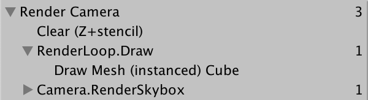

现在所有物体都可以用一个drawcall完成了，即使它们有着不同的颜色。然而对于可以放在常量缓冲区的数据大小有着限制。最大实例批次大小取决于每个实例的数据变化量。除此之外，缓冲区最大值也因平台而异。我们仍也然只能使用相同的网格和材质。例如，立方体和球体将分批次混合。


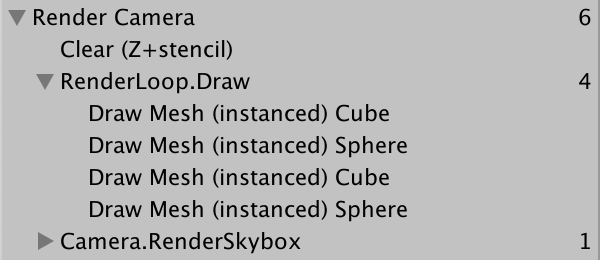

现在我们有了一个能够尽可能高效渲染大量物体的最简shader。在之后，我们将基于此创造更多高级的shader。

下一个教程是[光照](https://catlikecoding.com/unity/tutorials/scriptable-render-pipeline/lights/)