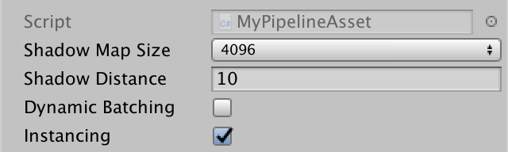
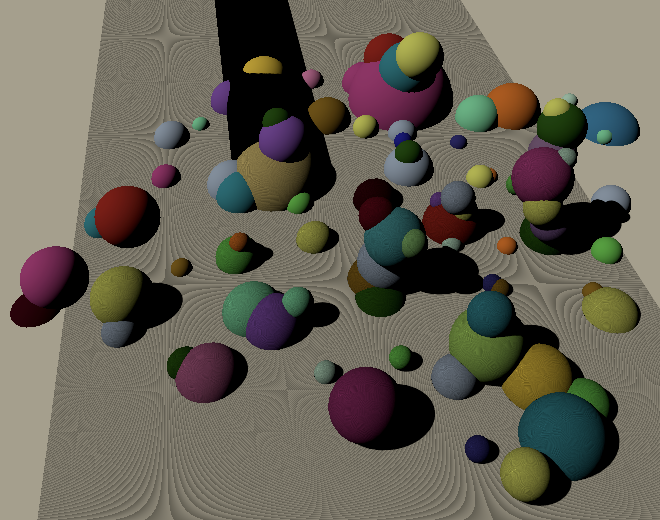

# 可编程渲染管线5 平行光阴影

原文：https://catlikecoding.com/unity/tutorials/scriptable-render-pipeline/directional-shadows/

- 支持直射光的多重阴影
- 控制阴影距离
- 定义一个单独的主光源
- 渲染和采样级联阴影贴图（cascaded shadow map）
- 使用球形剔除

这是Unity可编程渲染管线系列教程的五章，本章中我们将完成平行光的阴影。

该教程基于Unity 2018.3.0f2。

# 1 直射光的阴影

直射光和聚光源在概念上没有什么不同。除了直射光来自无限远的地方，两者基本相同。所以只需要一点小小的调整，就可以让聚光源阴影的方法适用于直射光。我们将进一步改进我们的渲染管线，让它能混合直射光和聚光源的阴影。

## 1.1 配置阴影

目前ConfigureLights只处理了聚光源的阴影数据。而处理直射光源阴影的部分代码和聚光源的是相同的。为了重复利用这些代码，我们把它们写成单独的方法。该方法会根据传来的光源序列和阴影光源，处理并返回阴影数据。

```
	Vector4 ConfigureShadows (int lightIndex, Light shadowLight) {		Vector4 shadow = Vector4.zero;		Bounds shadowBounds;		if (			shadowLight.shadows != LightShadows.None &&			cull.GetShadowCasterBounds(lightIndex, out shadowBounds)		) {			shadowTileCount += 1;			shadow.x = shadowLight.shadowStrength;			shadow.y =				shadowLight.shadows == LightShadows.Soft ? 1f : 0f;		}		return shadow;	}
```

使用`ConfigureLights`代替聚光源条件下的重复代码。

```
				if (light.lightType == LightType.Spot) {					… 					//Light shadowLight = light.light;					//Bounds shadowBounds;					//if (					//	shadowLight.shadows != LightShadows.None &&					//	cull.GetShadowCasterBounds(i, out shadowBounds)					//) {					//	…					//}					shadow = ConfigureShadows(i, light.light);				}
```

同样将它用于直射光

```
			if (light.lightType == LightType.Directional) {				Vector4 v = light.localToWorld.GetColumn(2);				v.x = -v.x;				v.y = -v.y;				v.z = -v.z;				visibleLightDirectionsOrPositions[i] = v;				shadow = ConfigureShadows(i, light.light);			}
```

直射光阴影贴图的渲染方式有所不同，因此需要在处理时强调它是直射光。我们用阴影数据的z分量来作为判断的标识。

```
				shadow = ConfigureShadows(i, light.light);				shadow.z = 1f;
```

## 1.2 渲染阴影

我们直射光的阴影贴图也支持图块，但由于`RenderShadows` 中计算的是聚光源的矩阵因此暂不可用。`ComputeSpotShadowMatricesAndCullingPrimitives` 只能获得聚光源的矩阵，直射光的矩阵则需要另外的方法获取。

首先将 `ComputeSpotShadowMatricesAndCullingPrimitives`方法移出判断有效光源的if括号。用一个单独的bool变量来判断有效光源，方便我们处理直射光的情况。

```
			//if (!cull.ComputeSpotShadowMatricesAndCullingPrimitives(			//	i, out viewMatrix, out projectionMatrix, out splitData			//)) {			//	shadowData[i].x = 0f;			//	continue;			//}			bool validShadows;			validShadows = cull.ComputeSpotShadowMatricesAndCullingPrimitives(				i, out viewMatrix, out projectionMatrix, out splitData			);			if (!validShadows) {				shadowData[i].x = 0f;				continue;			}
```

接着，如果阴影数据表明我们处理的是直射光，就应该调用`ComputeDirectionalShadowMatricesAndCullingPrimitives` 。这个方法有着更多的参数，因为它支持阴影级联（这里我们先不用）。第一个参数要求提供一个光源序列，接着是级联的序列以及级联的数量。我们现在用不到级联，所以序列设为0，数量设为1。之后是定义了级联分级的三维向量，我们使用（1,0,0）。然后是整型的图块尺寸和阴影近平面值。最后才是矩阵和和分级数据的输出参数。

```
			bool validShadows;			if (shadowData[i].z > 0f) {				validShadows =					cull.ComputeDirectionalShadowMatricesAndCullingPrimitives(						i, 0, 1, Vector3.right, (int)tileSize,						cull.visibleLights[i].light.shadowNearPlane,						out viewMatrix, out projectionMatrix, out splitData					);			}			else {				validShadows =					cull.ComputeSpotShadowMatricesAndCullingPrimitives(						i, out viewMatrix, out projectionMatrix, out splitData					);			}			if (!validShadows) {				shadowData[i].x = 0f;				continue;			}
```

这样我们才能为直射光获取正确的矩阵。除此之外，分级数据中其实包含了一个有效的剔除球体。该球体包裹了所有需要被渲染进直射光阴影贴图的物体。这对于直射光来说非常重要，因为直射光不像聚光源，他会影响所有物体。我们需要有一个剔除球体来限制渲染进阴影贴图的图形数量。将它从分级数据中赋值给阴影设置即可。

```
			var shadowSettings = new DrawShadowsSettings(cull, i);			shadowSettings.splitData.cullingSphere = splitData.cullingSphere;			context.DrawShadows(ref shadowSettings);
```

聚光源不需要剔除球体，但是额外赋值也不会产生不良影响。所以这里没必要区分不同的光源情况。

## 1.3 光源距离

我们照理应该可以得到直射光的阴影贴图了，但是事实上贴图是空的，只可能会有几个零星的小点。因为阴影贴图需要覆盖摄像机能看到的最大范围。而摄像机的远平面默认设为1000。无论远处是否还有物体，阴影贴图都得覆盖这么大的范围，所以贴图变得又广又细。想看到贴图的内容就要大幅降低相机远平面距离。

但阴影的渲染范围并不只取决于相机远平面，这只是默认的情况。阴影距离也能控制阴影的渲染范围。阴影距离通常远小于相机的远平面。两者综合考虑既可以限制阴影渲染的范围，又可以处理比阴影距离更小范围的情况。

在MyPipeline中为阴影距离添加一个字段，并在构造方法中设置。我们从相机中提取阴影距离并赋值给剔除参数。因为渲染相机可见范围外的阴影没有意义，所以使用阴影距离和相机远平面中的最小值更合理。

```
	float shadowDistance; 	public MyPipeline (		bool dynamicBatching, bool instancing,		int shadowMapSize, float shadowDistance	) {		…		this.shadowDistance = shadowDistance;	} 	… 	void Render (ScriptableRenderContext context, Camera camera) {		ScriptableCullingParameters cullingParameters;		if (!CullResults.GetCullingParameters(camera, out cullingParameters)) {			return;		}		cullingParameters.shadowDistance =			Mathf.Min(shadowDistance, camera.farClipPlane); 		…	}
```

在MyPipelineAsset中为阴影距离添加一个配置选项，并设置一个合理的默认值，比如100。

```
	[SerializeField]	float shadowDistance = 100f; 	…		protected override IRenderPipeline InternalCreatePipeline () {		return new MyPipeline(			dynamicBatching, instancing, (int)shadowMapSize, shadowDistance		);	}
```



## 1.4 探究阴影

当阴影距离降低到合理的值，直射光的阴影终于出现了。让我们使用一个更小的值，比如10.为了清晰的看见贴图覆盖的范围。我们将光源的阴影偏移设为0并使用一个更大的平面作为地面。使用单个直射光。

直射光阴影，偏移为0

因为偏移设为了0，我们可以大致看到阴影贴图覆盖的区域，多亏了地板的自阴影。不像聚光源的阴影，直射光的阴影贴图随相机移动而改变。另外，阴影贴图的边缘影响了超出阴影范围的场景物体。这是因为我们采样坐标会超出贴图边缘（结果会采样边缘的值，因为我们纹理设置的是clamp）。导致贴图的边缘被拉伸至无穷远。当我们的阴影光源多于一个时，拉伸消失了，因为我们为每个图块使用裁减清理了边缘。

2个阴影贴图图块，一个直射光，一个聚光源

然而，在直射光图块范围外有另外多个可以采样的图块时，最终会采样到了错误的图块。图块越多越糟糕。

两个直射光和一个聚光源产生的阴影大杂烩

## 1.5 限制阴影图块

直射光一样很麻烦，因为每个物体都会对直射光的阴影贴图采样，即使他们不再覆盖范围中。解决方案就是限制图块的采样坐标。我们在缩放到正确的图块前将阴影空间位置限制在0-1之间。之前没有做限制我们可以在MyPipeline里完成整个转换矩阵的计算，现在我们就得把这一步移到shader里了。

坐标转换需要图块的缩放值，我们得把它传给shader。所以我们添加一个阴影数据的全局向量，之后我们可以在其中存储别的信息。将其命名为*_GlobalShadowData* 并持有它的标识符。

```
	static int globalShadowDataId = Shader.PropertyToID("_GlobalShadowData");
```

缩放值放在向量的第一个分量中，并在`RenderShadows`设置为全局向量。

```
		shadowBuffer.BeginSample("Render Shadows");		shadowBuffer.SetGlobalVector(			globalShadowDataId, new Vector4(tileScale, 0f)		);		context.ExecuteCommandBuffer(shadowBuffer);		shadowBuffer.Clear();
```

shader还需要知道图块的偏移值，我们将他们存储在阴影数据向量的Z、W分量中。（此时z已经判断过直射光了）

```
			float tileOffsetX = tileIndex % split;			float tileOffsetY = tileIndex / split;			tileViewport.x = tileOffsetX * tileSize;			tileViewport.y = tileOffsetY * tileSize;			shadowData[i].z = tileOffsetX * tileScale;			shadowData[i].w = tileOffsetY * tileScale;
```

之后移除对图块矩阵的乘法计算。

```
			worldToShadowMatrices[i] =				scaleOffset * (projectionMatrix * viewMatrix); 			//if (split > 1) {			//	var tileMatrix = Matrix4x4.identity;			//	tileMatrix.m00 = tileMatrix.m11 = tileScale;			//	tileMatrix.m03 = tileOffsetX * tileScale;			//	tileMatrix.m13 = tileOffsetY * tileScale;			//	worldToShadowMatrices[i] = tileMatrix * worldToShadowMatrices[i];			//}			tileIndex += 1;
```

shader这边在阴影缓存区添加一个全局阴影向量

```
CBUFFER_START(_ShadowBuffer)	float4x4 _WorldToShadowMatrices[MAX_VISIBLE_LIGHTS];	float4 _ShadowData[MAX_VISIBLE_LIGHTS];	float4 _ShadowMapSize;	float4 _GlobalShadowData;CBUFFER_END
```

于`ShadowAttenuation`中，在透视除法后对阴影位置的xy坐标做出限制。接着应用图块的变换。

```
	float4 shadowPos = mul(_WorldToShadowMatrices[index], float4(worldPos, 1.0));	shadowPos.xyz /= shadowPos.w;	shadowPos.xy = saturate(shadowPos.xy);	shadowPos.xy = shadowPos.xy * _GlobalShadowData.x + _ShadowData[index].zw;
```

 

> ### 直射光阴影需要透视除法吗？
>
> 不需要，因为直射光阴影贴图用的是正交投影。阴影位置的w向量恒为1，但是我们要混合直射光和聚光源，所以我们统一执行透视除法。

## 1.6 总是使用裁剪

我们解决了在多个图块时的阴影杂乱（ shadow soup）问题，但是当场景中仅有一个直射光阴时阴影贴图的边缘仍会被拉伸。我们在`RenderShadows`中一直使用裁剪来解决这个问题。

```
		for (int i = 0; i < cull.visibleLights.Count; i++) {			…			//if (split > 1) {				shadowBuffer.SetViewport(tileViewport);				shadowBuffer.EnableScissorRect(new Rect(					tileViewport.x + 4f, tileViewport.y + 4f,					tileSize - 8f, tileSize - 8f				));			//}			…		} 		//if (split > 1) {			shadowBuffer.DisableScissorRect();		//}
```


## 1.7 基于距离剪裁阴影

阴影距离是基于视距的（空间一点和相机的距离），但是并不是说超出范围阴影就会立刻消失。因为阴影贴图渲染的是一个立方体的空间区域。即使阴影距离代表的区域只是这个空间的一部分，相机仍然会把整个空间中的物体渲染进阴影贴图。直射光的阴影贴图会随着相机移动，构造最适合阴影距离的空间区域，所以它们会匹配的很好。但是聚光源就不一样了，它的阴影空间区域和光源锁定，即使阴影距离只占空间的很小一部分，最终渲染的还是整个区域。结果就是聚光灯阴影贴图包含的所有阴影同时出现和消失。

> ### 有时候剪裁过的聚光灯阴影很奇怪
>
> 这是2018.3的bug，在阴影距离边缘裁减聚光灯阴影后会产生不合理的阴影。当使用的阴影距离非常小时，情况会很严重。它表现为相机移动过程中阴影闪烁或剪裁不正确。

我们可以使用配置的阴影距离来剪切阴影使阴影消失的边界线更统一。要想这么做，就得把阴影距离传给shader。我们将它放在全局阴影数据向量的第二个分量中。在我们实际裁剪时，我们用的是它的平方来进行比较，所以我们就直接存储阴影距离的平方。

```
		shadowBuffer.SetGlobalVector(			globalShadowDataId, new Vector4(				tileScale, shadowDistance * shadowDistance			)		);
```

在shader中，我们还需知道相机的位置。Unity在配置相机的时候就会自动提供这个信息。所以我们要做的只是在`UnityPerCamera` 缓存区中添加一个`_WorldSpaceCameraPos` 变量。

```
CBUFFER_START(UnityPerCamera)	float3 _WorldSpaceCameraPos;CBUFFER_END
```

创建一个DistanceToCameraSqr函数，该函数输入世界位置，输出与相机的平方距离。

```
float DistanceToCameraSqr (float3 worldPos) {	float3 cameraToFragment = worldPos - _WorldSpaceCameraPos;	return dot(cameraToFragment, cameraToFragment);}
```

在`ShadowAttenuation`中调用这个方法，检查是否超出了阴影距离，如果是就跳过阴影采样。应在现有的条件检查中添加一个额外的判断，而不是再另外创建一个分支。

```
	if (		_ShadowData[index].x <= 0 ||		DistanceToCameraSqr(worldPos) > _GlobalShadowData.y	) {		return 1.0;	}
```

现在所有的阴影都在相同的距离消失，而不会突然的出现和消失了。（阴影贴图是个正方形，如果不按深度距离裁减，旋转相机时，部分物体的深度信息在某个旋转角度会算进阴影贴图，而在别的角度可能会不会在阴影贴图中，在视觉上就表现为单独一个物体的阴影突然消失和突然出现）

 

阴影距离15，无偏移和有偏移的情况

> ### 我们可以平滑的过渡阴影吗？
>
> 你可以添加一个渐变距离并使用一些过渡函数来实现，如线性插值，smoothstep等。

# 2 级联阴影贴图

阴影贴图的缺点就是作为纹理，其纹素密度必然是有限的。如果纹素看起来太大，你可以提高纹理分辨率来解决，但仍没有摆脱这个限制。聚光源只覆盖了一小块区域，所以它的效果可以接受。但对于直射光而言，它的照射范围是无限大的。在视野远处的阴影效果也许足够了，但是近处的阴影却会显得非常块状。我们称之为透视锯齿（perspective  aliasing）


我们需要为近处的阴影提供更高的分辨率，但是远处的就不必了。最好我们可以基于距离使用不同的分辨率。要解决这个问题就要为同个直射光渲染多张阴影贴图。我们在近处使用高分辨率阴影，在远处使用低分辨率。这些阴影贴图称之为阴影级联（shadow cascade）

## 2.1 级联数量

Unity通常为阴影级联数量提供三个选项：0、2、4。我们也一样，在MyPipelineAsset添加一个ShadowCascades枚举用于配置选项，默认为4。

```
	public enum ShadowCascades {		Zero = 0,		Two = 2,		Four = 4	}		…		[SerializeField]	ShadowCascades shadowCascades = ShadowCascades.Four;
```

将阴影选项移到批处理和实例化选项下面，以便后续添加。

## 2.2 级联分布（Cascade Split）

Untiy还允许指定级联在阴影距离中的分布范围。通过将整个阴影距离划分成二或四个部分来实现。如果是2个级联，就用一个值来决定在哪里划分两者。如果是四个级联，就用存储在向量中的三个值，将阴影距离划分成四个部分。我们使用Unity的实现方式，并使用与轻量级渲染管线相同的默认值。

```
	[SerializeField]	float twoCascadesSplit = 0.25f; 	[SerializeField]	Vector3 fourCascadesSplit = new Vector3(0.067f, 0.2f, 0.467f);
```

但是Unity不会直接将这些值暴露在检视面板，而是显示一个特殊的GUI控件来允许你调整级联的区域。我们也使用同样的GUI，首先使用`HideInInspector` 特性把分离字段隐藏。

```
	[SerializeField, HideInInspector]	float twoCascadesSplit = 0.25f; 	[SerializeField, HideInInspector]	Vector3 fourCascadesSplit = new Vector3(0.067f, 0.2f, 0.467f);
```

我们需要创建一个自定义编辑器来显示联级划分的GUI。我们先创建一个最基础的。将它的脚本资源放在Editor文件夹中。追踪三个相关属性，并绘制默认的检视器。我们还需要使用命名空间，因为它包含了级联分布GUI控件的代码。

```
using UnityEditor;using UnityEditor.Experimental.Rendering;using UnityEngine; [CustomEditor(typeof(MyPipelineAsset))]public class MyPipelineAssetEditor : Editor { 	SerializedProperty shadowCascades;	SerializedProperty twoCascadesSplit;	SerializedProperty fourCascadesSplit; 	void OnEnable () {		shadowCascades = serializedObject.FindProperty("shadowCascades");		twoCascadesSplit = serializedObject.FindProperty("twoCascadesSplit");		fourCascadesSplit = serializedObject.FindProperty("fourCascadesSplit");	} 	public override void OnInspectorGUI () {		DrawDefaultInspector();	}}
```

> ### 自定义编辑器怎么用？
>
> 简单的讲，就是在Editor文件夹中创建一个脚本，使用UnityEditor命名空间，并继承`Editor`。你需要使用`CustomEditor`特性指明哪个类型会用到这个编辑器类。接着重写`OnInspectorGUI` 方法来绘制检视面板。可以通过调用`DrawDefaultInspector`来绘制默认的检视面板。
>
> 每个编辑器都有一个`serializedObject` 属性来表示需要被编辑的内容。可以调用`FindProperty` 从中提取字段，他会返回一个`SerializedProperty` 类型的引用。通常在`OnEnable` 中完成这些工作。

我们可以使用来绘制我们想要的级联分布控件，它的设计有点奇怪，它是一个泛型方法，只能使用flaot或vector类型，对二段级联使用flaot，四段级联使用vector。相关序列化属性应作为引用类型传入。

在绘制默认检视器之后使用switch语句来决定我们绘制哪种级联的GUI。我们可以通过`shadowCascades` 属性的`enumValueIndex` 字段来进行判断。他会返回我们所选择的的枚举选项的序列，但并不是字面的0,2,4而是0,1,2。第一个情况我们不需要做任何事，后两个就需要选择合适的方法了。在这之后，我们调用序列化对象的`ApplyModifiedProperties` 方法来确保用户的修改可以应用到我们的资源中。

```
	public override void OnInspectorGUI () {		DrawDefaultInspector(); 		switch (shadowCascades.enumValueIndex) {			case 0: return;			case 1:				CoreEditorUtils.DrawCascadeSplitGUI<float>(ref twoCascadesSplit);				break;			case 2:				CoreEditorUtils.DrawCascadeSplitGUI<Vector3>(					ref fourCascadesSplit				);				break;		}		serializedObject.ApplyModifiedProperties();	}
```


> ### 为什么当我编辑级联分布时，场景窗口的天空盒消失了
>
> 这是视觉上的小故障，当你在编辑器中做些事来刷新场景窗口后，就会被修复了。

MyPipeline只需要知道要使用多少级联以及他们的分布值是多少。我们可以使用单个三维向量同时处理二段和四段级联的分布数据。按要求添加字段和构造参数。

```
	int shadowCascades;	Vector3 shadowCascadeSplit; 	public MyPipeline (		bool dynamicBatching, bool instancing,		int shadowMapSize, float shadowDistance,		int shadowCascades, Vector3 shadowCascadeSplit	) {		…		this.shadowCascades = shadowCascades;		this.shadowCascadeSplit = shadowCascadeSplit;	}
```

当MyPipelineAsset调用渲染管线的构造方法是，总是要求传入一个分布值向量，即使实际是二段级联。这这种情况下，我们将唯一的分布值作为向量的第一个分量，另外两个设为0。

```
	protected override IRenderPipeline InternalCreatePipeline () {		Vector3 shadowCascadeSplit = shadowCascades == ShadowCascades.Four ?			fourCascadesSplit : new Vector3(twoCascadesSplit, 0f);		return new MyPipeline(			dynamicBatching, instancing, (int)shadowMapSize, shadowDistance,			(int)shadowCascades, shadowCascadeSplit		);	}
```

## 2.3 只为直射光提供级联

我们没必要为所有直射光支持级联。为一个光源绘制多张阴影贴图，并最终决定采样哪一张的开销可不低。所以我们只打算为一个直射光提供级联阴影贴图。他应该是场景中最亮的有阴影的直射光。我们把它叫做主光源。而其他的直射光只能得到单个阴影贴图。

主直射光总是可见光列表中的第一个元素。我们可以在`ConfigureLights`中判断第一个光源是否符合标准，如果是直射光、阴影强度为正数，开启了阴影级联，那就说明存在主光源。我们用一个bool字段来记录这个情况。

```
	bool mainLightExists;		…		void ConfigureLights () {		mainLightExists = false;		shadowTileCount = 0;		for (int i = 0; i < cull.visibleLights.Count; i++) {			… 			if (light.lightType == LightType.Directional) {				…				shadow = ConfigureShadows(i, light.light);				shadow.z = 1f;				if (i == 0 && shadow.x > 0f && shadowCascades > 0) {					mainLightExists = true;				}			}			…		} 		…	}
```

我们不打算将级联阴影贴图和其他的阴影贴图放在同一张纹理中，如果有多个产生阴影的光源，贴图分辨率对于级联阴影贴图来说太小了。所以当我们拥有主光源时，让图块计数减1。

```
				if (i == 0 && shadow.x > 0f && shadowCascades > 0) {					mainLightExists = true;					shadowTileCount -= 1;				}
```

同样，如果存在主光源，那么就在RenderShadows将其从常规阴影贴图渲染中排除。

```
		for (int i = mainLightExists ? 1 : 0; i < cull.visibleLights.Count; i++) {			…		}
```

我们将级联阴影以图块的形式渲染到一张单独的阴影贴图中，我们将其命名为*_CascadedShadowMap*。添加相关的标识符和字段。并在最后和其他阴影贴图一样释放纹理资源。

```
	static int cascadedShadowMapId = Shader.PropertyToID("_CascadedShadowMap");	…		RenderTexture shadowMap, cascadedShadowMap;		…		void Render (ScriptableRenderContext context, Camera camera) {		… 		if (shadowMap) {			RenderTexture.ReleaseTemporary(shadowMap);			shadowMap = null;		}		if (cascadedShadowMap) {			RenderTexture.ReleaseTemporary(cascadedShadowMap);			cascadedShadowMap = null;		}	}
```

## 2.4 重用代码

虽然渲染级联阴影贴图的方式和之前渲染阴影的方式类似，但是其中的差异还是有必要用一个单独的方法才能完成。然而这两个方法里许多代码都是重复的，我们把这部分代码分离成别的方法。

首先是关于阴影渲染目标的设置，两者在这部分的代码是相同的。我们只需要用两个字段记录两者渲染目标对应的渲染纹理即可。所以将这部分代码移至一个方法，让该方法返回所求纹理的引用。在这里我们就让两者使用相同的贴图尺寸，不再添加额外的阴影配置选项了，如果你想让级联阴影和普通阴影贴图的尺寸各自独立，那就为这个方法添加额外的尺寸参数吧。

```
	RenderTexture SetShadowRenderTarget () {		RenderTexture texture = RenderTexture.GetTemporary(			shadowMapSize, shadowMapSize, 16, RenderTextureFormat.Shadowmap		);		texture.filterMode = FilterMode.Bilinear;		texture.wrapMode = TextureWrapMode.Clamp; 		CoreUtils.SetRenderTarget(			shadowBuffer, texture,			RenderBufferLoadAction.DontCare, RenderBufferStoreAction.Store,			ClearFlag.Depth		);		return texture;	}
```

然后是配置阴影图块的部分。计算偏移，设置视口以及剪裁也都可以放在一块。图块的偏移值可以用二维向量返回值得到。

```
	Vector2 ConfigureShadowTile (int tileIndex, int split, float tileSize) {		Vector2 tileOffset;		tileOffset.x = tileIndex % split;		tileOffset.y = tileIndex / split;		var tileViewport = new Rect(			tileOffset.x * tileSize, tileOffset.y * tileSize, tileSize, tileSize		);		shadowBuffer.SetViewport(tileViewport);		shadowBuffer.EnableScissorRect(new Rect(			tileViewport.x + 4f, tileViewport.y + 4f,			tileSize - 8f, tileSize - 8f		));		return tileOffset;	}
```

再然后，计算世界-阴影矩阵这部分也可以放在一个单独的方法里，我们将视角和投影矩阵作为引用参数传入，避免拷贝变量副本。同样，将世界-阴影矩阵作为输出参数。

```
	void CalculateWorldToShadowMatrix (		ref Matrix4x4 viewMatrix, ref Matrix4x4 projectionMatrix,		out Matrix4x4 worldToShadowMatrix	) {		if (SystemInfo.usesReversedZBuffer) {			projectionMatrix.m20 = -projectionMatrix.m20;			projectionMatrix.m21 = -projectionMatrix.m21;			projectionMatrix.m22 = -projectionMatrix.m22;			projectionMatrix.m23 = -projectionMatrix.m23;		}		var scaleOffset = Matrix4x4.identity;		scaleOffset.m00 = scaleOffset.m11 = scaleOffset.m22 = 0.5f;		scaleOffset.m03 = scaleOffset.m13 = scaleOffset.m23 = 0.5f;		worldToShadowMatrix =			scaleOffset * (projectionMatrix * viewMatrix);	}
```

最后调整`RenderShadows` ，利用好我们的新方法

```
	void RenderShadows (ScriptableRenderContext context) {		…		//Rect tileViewport = new Rect(0f, 0f, tileSize, tileSize); 		//shadowMap = RenderTexture.GetTemporary(		//	shadowMapSize, shadowMapSize, 16, RenderTextureFormat.Shadowmap		//);		//shadowMap.filterMode = FilterMode.Bilinear;		//shadowMap.wrapMode = TextureWrapMode.Clamp; 		//CoreUtils.SetRenderTarget(		//	…		//);		shadowMap = SetShadowRenderTarget();		shadowBuffer.BeginSample("Render Shadows");		…		for (int i = mainLightExists ? 1 : 0; i < cull.visibleLights.Count; i++) {			… 			Vector2 tileOffset = ConfigureShadowTile(tileIndex, split, tileSize);			//float tileOffsetX = tileIndex % split;			//float tileOffsetY = tileIndex / split;			//tileViewport.x = tileOffsetX * tileSize;			//tileViewport.y = tileOffsetY * tileSize;			shadowData[i].z = tileOffset.x * tileScale;			shadowData[i].w = tileOffset.y * tileScale;			//shadowBuffer.SetViewport(tileViewport);			//shadowBuffer.EnableScissorRect(new Rect(			…			//));			shadowBuffer.SetViewProjectionMatrices(viewMatrix, projectionMatrix);			…			context.DrawShadows(ref shadowSettings); 			//if (SystemInfo.usesReversedZBuffer) {			//	…			//}			//…			//worldToShadowMatrices[i] =			//	scaleOffset * (projectionMatrix * viewMatrix);			CalculateWorldToShadowMatrix(				ref viewMatrix, ref projectionMatrix, out worldToShadowMatrices[i]			); 			…		}
```

## 2.5 渲染级联阴影

级联阴影需要有自己的数组来存储世界-阴影矩阵。添加对应的标识符和字段。我们最多只有四段级联，所以数组长度设为4。

```
	static int worldToShadowCascadeMatricesId =		Shader.PropertyToID("_WorldToShadowCascadeMatrices");	…	Matrix4x4[] worldToShadowCascadeMatrices = new Matrix4x4[4];
```

.创建一个`RenderCascadedShadows`方法，开头复制`RenderShadows`的代码。接下来就简单了，因为我们不需要考虑聚光源并且只会用到第一个光源。我们不需要处理每个光源的阴影数据，而且阴影肯定是需要级联的。级联不是四段就是两段，也就是说阴影贴图总是分为四个图块。

在调用ComputeDirectionalShadowMatricesAndCullingPrimitives时，我们光源序列为0，并使用for循环的迭代值作为级联序列。在这里我们就需要提供实际的级联数量和分布向量了。

最后，我们再把图块的坐标转换附加到世界-阴影矩阵中，在图块范围内正确渲染是shader采样到级联阴影的重要前提。

```
	void RenderCascadedShadows (ScriptableRenderContext context) {		float tileSize = shadowMapSize / 2;		cascadedShadowMap = SetShadowRenderTarget();		shadowBuffer.BeginSample("Render Shadows");		context.ExecuteCommandBuffer(shadowBuffer);		shadowBuffer.Clear();		Light shadowLight = cull.visibleLights[0].light;		shadowBuffer.SetGlobalFloat(			shadowBiasId, shadowLight.shadowBias		);		var shadowSettings = new DrawShadowsSettings(cull, 0);		var tileMatrix = Matrix4x4.identity;		tileMatrix.m00 = tileMatrix.m11 = 0.5f; 		for (int i = 0; i < shadowCascades; i++) {			Matrix4x4 viewMatrix, projectionMatrix;			ShadowSplitData splitData;			cull.ComputeDirectionalShadowMatricesAndCullingPrimitives(				0, i, shadowCascades, shadowCascadeSplit, (int)tileSize,				shadowLight.shadowNearPlane,				out viewMatrix, out projectionMatrix, out splitData			); 			Vector2 tileOffset = ConfigureShadowTile(i, 2, tileSize);			shadowBuffer.SetViewProjectionMatrices(viewMatrix, projectionMatrix);			context.ExecuteCommandBuffer(shadowBuffer);			shadowBuffer.Clear();						shadowSettings.splitData.cullingSphere = splitData.cullingSphere;			context.DrawShadows(ref shadowSettings);			CalculateWorldToShadowMatrix(				ref viewMatrix, ref projectionMatrix				out worldToShadowCascadeMatrices[i]			);			tileMatrix.m03 = tileOffset.x * 0.5f;			tileMatrix.m13 = tileOffset.y * 0.5f;			worldToShadowCascadeMatrices[i] =				tileMatrix * worldToShadowCascadeMatrices[i];		} 		shadowBuffer.DisableScissorRect();		shadowBuffer.SetGlobalTexture(cascadedShadowMapId, cascadedShadowMap);		shadowBuffer.SetGlobalMatrixArray(			worldToShadowCascadeMatricesId, worldToShadowCascadeMatrices		);		shadowBuffer.EndSample("Render Shadows");		context.ExecuteCommandBuffer(shadowBuffer);		shadowBuffer.Clear();	}
```

如果有主光源，就在`ConfigureLights`后面调用该方法。

```
		if (cull.visibleLights.Count > 0) {			ConfigureLights();			if (mainLightExists) {				RenderCascadedShadows(context);			}			if (shadowTileCount > 0) {				RenderShadows(context);			}			else {				cameraBuffer.DisableShaderKeyword(shadowsHardKeyword);				cameraBuffer.DisableShaderKeyword(shadowsSoftKeyword);			}		}
```

我们最终可能会用到一张、两张或者不需要渲染纹理。如果只有主光源，只需要渲染级联阴影贴图。如果有另外带阴影的光源还需要渲染常规的阴影贴图。或者我们有阴影但没有主光源，那我们就只需要常规阴影贴图。frame  debugger中将两节Render Shadows合并为一节。


如果你在frame debugger中检查级联阴影贴图，你会看到它由四个图块组成。它们内容是否可见取决于阴影距离和级联分布。要让第一段的级联贴图出现有意义的内容需要很大的阴影距离。


## 2.6 采样级联阴影贴图

想在我们的shader里使用级联阴影贴图，我们好需要做一些事。首先，我们得知道使用软阴影还是硬阴影的方式采样贴图，这一点我们可以通过shader关键字来控制。我们使用两个关键字来区分级联的软硬阴影，省去了在shader中创建分支的需要。

```
	const string cascadedShadowsHardKeyword = "_CASCADED_SHADOWS_HARD";	const string cascadedShadowsSoftKeyword = "_CASCADED_SHADOWS_SOFT";
```

接下来我们需要知道阴影贴图的尺寸和阴影强度，虽然我们可以直接用*_ShadowMapSize*但是为了让shader能分开处理两者的大小，我们使用单独的*_CascadedShadowMapSize* 来表示。

```
	static int cascadedShadowMapSizeId =		Shader.PropertyToID("_CascadedShadowMapSize");	static int cascadedShadowStrengthId =		Shader.PropertyToID("_CascadedShadowStrength");
```

在RenderCascadedShadows方法末尾设置这些值和关键字。

```
		shadowBuffer.SetGlobalMatrixArray(			worldToShadowCascadeMatricesId, worldToShadowCascadeMatrices		);		float invShadowMapSize = 1f / shadowMapSize;		shadowBuffer.SetGlobalVector(			cascadedShadowMapSizeId, new Vector4(				invShadowMapSize, invShadowMapSize, shadowMapSize, shadowMapSize			)		);		shadowBuffer.SetGlobalFloat(			cascadedShadoStrengthId, shadowLight.shadowStrength		);		bool hard = shadowLight.shadows == LightShadows.Hard;		CoreUtils.SetKeyword(shadowBuffer, cascadedShadowsHardKeyword, hard);		CoreUtils.SetKeyword(shadowBuffer, cascadedShadowsSoftKeyword, !hard);		shadowBuffer.EndSample("Render Shadows");
```

在`RenderCascadedShadow` 没有被调用的情况下应该关闭级联阴影的关键字

```
		if (cull.visibleLights.Count > 0) {			ConfigureLights();			if (mainLightExists) {				RenderCascadedShadows(context);			}			else {				cameraBuffer.DisableShaderKeyword(cascadedShadowsHardKeyword);				cameraBuffer.DisableShaderKeyword(cascadedShadowsSoftKeyword);			}			if (shadowTileCount > 0) {				RenderShadows(context);			}			else {				cameraBuffer.DisableShaderKeyword(shadowsHardKeyword);				cameraBuffer.DisableShaderKeyword(shadowsSoftKeyword);			}		}		else {			cameraBuffer.SetGlobalVector(				lightIndicesOffsetAndCountID, Vector4.zero			);			cameraBuffer.DisableShaderKeyword(cascadedShadowsHardKeyword);			cameraBuffer.DisableShaderKeyword(cascadedShadowsSoftKeyword);			cameraBuffer.DisableShaderKeyword(shadowsHardKeyword);			cameraBuffer.DisableShaderKeyword(shadowsSoftKeyword);		}
```

在*Lit* shader中为级联阴影关键字添加多重编译指令。共有三个选项：级联的无/软/硬阴影。

```
			#pragma multi_compile _ _CASCADED_SHADOWS_HARD _CASCADED_SHADOWS_SOFT			#pragma multi_compile _ _SHADOWS_HARD			#pragma multi_compile _ _SHADOWS_SOFT
```

然后按要求在阴影缓存区添加相应变量，并定义好级联阴影贴图的纹理和采样器。

```
CBUFFER_START(_ShadowBuffer)	float4x4 _WorldToShadowMatrices[MAX_VISIBLE_LIGHTS];	float4x4 _WorldToShadowCascadeMatrices[4];	float4 _ShadowData[MAX_VISIBLE_LIGHTS];	float4 _ShadowMapSize;	float4 _CascadedShadowMapSize;	float4 _GlobalShadowData;	float _CascadedShadowStrength;CBUFFER_END TEXTURE2D_SHADOW(_ShadowMap);SAMPLER_CMP(sampler_ShadowMap); TEXTURE2D_SHADOW(_CascadedShadowMap);SAMPLER_CMP(sampler_CascadedShadowMap);
```

添加一个表明是否采样级联阴影的bool参数来使`HardShadowAttenuation`既可以用于常规的阴影采样也可以用于级联阴影，参数默认为false。用这个bool值来决定具体使用哪张纹理和采样器。我们使用的bool参数是硬编码的，也就是说在实际编译时并不会产生条件分支。

```
float HardShadowAttenuation (float4 shadowPos, bool cascade = false) {	if (cascade) {		return SAMPLE_TEXTURE2D_SHADOW(			_CascadedShadowMap, sampler_CascadedShadowMap, shadowPos.xyz		);	}	else {		return SAMPLE_TEXTURE2D_SHADOW(			_ShadowMap, sampler_ShadowMap, shadowPos.xyz		);	}}
```

`SoftShadowAttenuation` 也一样，不过在这里只需要选择正确的纹理就好了，其余的工作完全可以交给`HardShadowAttenuation` ，没必要再写一遍。

```
float SoftShadowAttenuation (float4 shadowPos, bool cascade = false) {	real tentWeights[9];	real2 tentUVs[9];	float4 size = cascade ? _CascadedShadowMapSize : _ShadowMapSize;	SampleShadow_ComputeSamples_Tent_5x5(		size, shadowPos.xy, tentWeights, tentUVs	);	float attenuation = 0;	for (int i = 0; i < 9; i++) {		//attenuation += tentWeights[i] * SAMPLE_TEXTURE2D_SHADOW(		//	_ShadowMap, sampler_ShadowMap, float3(tentUVs[i].xy, shadowPos.z)		//);		attenuation += tentWeights[i] * HardShadowAttenuation(			float4(tentUVs[i].xy, shadowPos.z, 0), cascade		);	}	return attenuation;}
```

创建一个`CascadedShadowAttenuation` 方法，他就像`ShadowAttenuation`的简化版。如果没有级联，衰减直接为1，反之才会计算阴影位置获取软硬阴影的衰减值并应用应用强度。我们暂时不对阴影进行基于距离的剪裁。

选择正确的级联阴影贴图是下一节的内容，这一节我们统一使用第三张级联阴影贴图，也就是使用`_WorldToShadowCascadeMatrices` 中序列为2的转换矩阵。如果你用的是四段级联，使用第三张贴图可以让我们看到大部分区域的阴影。如果用第四张的话区域是大了，但是近处的阴影分辨率太低，影响观察。

```
float CascadedShadowAttenuation (float3 worldPos) {	#if !defined(_CASCADED_SHADOWS_HARD) && !defined(_CASCADED_SHADOWS_SOFT)		return 1.0;	#endif		float cascadeIndex = 2;	float4 shadowPos = mul(		_WorldToShadowCascadeMatrices[cascadeIndex], float4(worldPos, 1.0)	);	float attenuation;	#if defined(_CASCADED_SHADOWS_HARD)		attenuation = HardShadowAttenuation(shadowPos, true);	#else		attenuation = SoftShadowAttenuation(shadowPos, true);	#endif		return lerp(1, attenuation, _CascadedShadowStrength);}
```

接着添加一个`MainLight` 方法来专门处理主光源。他和`DiffuseLight`有些类似，区别在于他只会计算序列为0的第一个光源，并且使用`CascadedShadowAttenuation` 来获取阴影。

```
float3 MainLight (float3 normal, float3 worldPos) {	float shadowAttenuation = CascadedShadowAttenuation(worldPos);	float3 lightColor = _VisibleLightColors[0].rgb;	float3 lightDirection = _VisibleLightDirectionsOrPositions[0].xyz;	float diffuse = saturate(dot(normal, lightDirection));	diffuse *= shadowAttenuation;	return diffuse * lightColor;}
```

如果有级联阴影，就把主光源也加入`LitPassFragment` 的漫反射总和中。

```
	float3 diffuseLight = input.vertexLighting;	#if defined(_CASCADED_SHADOWS_HARD) || defined(_CASCADED_SHADOWS_SOFT)		diffuseLight += MainLight(input.normal, input.worldPos);	#endif		for (int i = 0; i < min(unity_LightIndicesOffsetAndCount.y, 4); i++) {		…	}
```

双倍的主光源

主光源的级联阴影现在终于能够看到了，但是同一个光源在光照循环中被添加了两次，这是错误的。我们不能简单地跳过循环中的第一个光源，因为对每个物体而言，无法确保主光源就是最重要的那个光源。对此我们要么在shader的循环中添加分支，要么渲染前就干脆将主光源移出可见光列表。我们选择后者，修改中`ConfigureLight` 的光源数量。这样的副作用就是当我们有主光源时，像素光数量上限变成了5个。

```
		if (mainLightExists || cull.visibleLights.Count > maxVisibleLights) {			int[] lightIndices = cull.GetLightIndexMap();			if (mainLightExists) {				lightIndices[0] = -1;			}			for (int i = maxVisibleLights; i < cull.visibleLights.Count; i++) {				lightIndices[i] = -1;			}			cull.SetLightIndexMap(lightIndices);		}
```

计算一次主光源

从可见光列表中移除主光源意味着如果我们使用了级联阴影，我们每一帧都会修改可见光列表，从而导致临时内存的分配。现在莫得办法，除非以后会出另外一个不会分配新数组的`GetLightIndexMap` 方法。

## 2.7 选择正确的级联贴图

现在主光源的级联阴影贴图终于能用了，但用的都是同一级别的级联贴图。第三张级联贴图对于远处的阴影效果挺好，但是对于近处就很垃圾了。而第二张级联贴图就恰恰相反，近处表现的很好，但是远处。。远处就莫得了。

二阶级联

Unity使用级联分段值划分每个级联贴图负责的阴影空间区域。它使用一个剔除球体来定义每个级联贴图的范围。剔除球的半径依次增加，球的位置也同样。想知道我们使用哪一等级的级联贴图，我们就得找出片元处于哪个剔除球内部。

我们要把剔除球的信息传给shader。使用数组是最方便的方法。在MyPipeline中添加对应的标识符和字段。用四维向量表示每个球。xyz分量描述球的位置。w分量定义球的半径。

```
	static int cascadeCullingSpheresId =		Shader.PropertyToID("_CascadeCullingSpheres"); 	…	Vector4[] cascadeCullingSpheres = new Vector4[4];
```

在`RenderCascadedShadows`里我们已经可以获取每个级联的剔除球了。我们只需要简单的把它拷贝到我们的数组然后再传给shader就ok了。因为在判断片元位于哪个剔除球时只会用到半径的平方，所以我们干脆直接传入半径的平方得了。

```
		for (int i = 0; i < shadowCascades; i++) {			…						cascadeCullingSpheres[i] =				shadowSettings.splitData.cullingSphere = splitData.cullingSphere;			cascadeCullingSpheres[i].w *= splitData.cullingSphere.w;			context.DrawShadows(ref shadowSettings);			…		}				shadowBuffer.DisableScissorRect();		shadowBuffer.SetGlobalTexture(cascadedShadowMapId, cascadedShadowMap);		shadowBuffer.SetGlobalVectorArray(			cascadeCullingSpheresId, cascadeCullingSpheres		);
```

shader这里，将剔除球数组添加到阴影缓冲区

```
	float4x4 _WorldToShadowCascadeMatrices[4];	float4 _CascadeCullingSpheres[4];
```

我们写一个小方法来判断某一点的位置是否在一个剔除球里。传入剔除球的序列，我们在做一些用于判断的计算后返回flaot值。

```
float InsideCascadeCullingSphere (int index, float3 worldPos) {	float4 s = _CascadeCullingSpheres[index];	return dot(worldPos - s.xyz, worldPos - s.xyz) < s.w;}
```

在CascadedShadowAttenuation里为四个剔除球各调用一次这个方法。返回1表示该点位于剔除球内，返回0就在球外面。返回值就是表示这些球是否有效的标志。在确定级联等级前将这四个值放在一个flaot4类型变量中。

```
	float4 cascadeFlags = float4(		InsideCascadeCullingSphere(0, worldPos),		InsideCascadeCullingSphere(1, worldPos),		InsideCascadeCullingSphere(2, worldPos),		InsideCascadeCullingSphere(3, worldPos)	);	float cascadeIndex = 2;
```

一点位于一个球的同时，还躺在更大的球里面。我们最终可能得到五种情况： (1,1,1,1), (0,1,1,1), (0,0,1,1), (0,0,0,1),(0,0,0,0)。我们将这四个值加起来除以四得到的值返回来观察级联层次。也就是点乘¼。

```
	return dot(cascadeFlags, 0.25);	float cascadeIndex = 2;
```


如果我们可以用第一张级联贴图，那我们就应该把后面三个标志值清零。第一位不用担心，但是如果第一位存在就应该清楚第二位，第二位存在清楚第三位，第三位存在清除第四位。我们可以将yzw分量减去xyz分量来完成前面描述的操作，并将结果限制在01范围之内。将结果和（0,1,2,3）进行点积运算就得到了最终的级联等级。转换如下：

(1,1,1,1) → (1,0,0,0) → 0

(0,1,1,1) → (0,1,0,0) → 1

(0,0,1,1) → (0,0,1,0) → 2

(0,0,0,1) → (0,0,0,1) → 3

(0,0,0,0) → (0,0,0,0) → 0

```
	//return dot(cascadeFlags, 0.25);	cascadeFlags.yzw = saturate(cascadeFlags.yzw - cascadeFlags.xyz);	float cascadeIndex = dot(cascadeFlags, float4(0, 1, 2, 3));
```

一个点至少在一个剔除球里面时，结果是对的，但他要是在在所有剔除球外面，结果为0，错误的采样了第一张级联阴影贴图。Unity在这里用了一个小技巧，它在世界-阴影矩阵中添加一个零矩阵作为第五个数组元素来表示不存在的那个联级贴图。零矩阵会将阴影位置转换到近平面，自然就不可能产生阴影了。我们也这样做，为MyPipeline的`worldToShadowCascadeMatrices` 数组添加第五个元素。

```
	Matrix4x4[] worldToShadowCascadeMatrices = new Matrix4x4[5];
```

然而，如果z缓冲区反转，那我们就得将阴影空间的z坐标该为1才能表示近平面，我们在构造函数把这个矩阵的m33字段改为1即可。

```
	public MyPipeline (		…	) {		GraphicsSettings.lightsUseLinearIntensity = true;		if (SystemInfo.usesReversedZBuffer) {			worldToShadowCascadeMatrices[4].m33 = 1f;		}			…	}
```

增加shader中相匹配的数组长度。和之前一样，如果长度已经编译为4就要重启Unity了。

```
	float4x4 _WorldToShadowCascadeMatrices[5];
```

接下来我们完成(0,0,0,0) → 4的转换，我们该为将值和（4,3,2,1）点乘，让4减去它来得到级联等级。（对于别的值，这串计算和之前点乘（0,1,2,3）结果一样）

```
	float cascadeIndex = 4 - dot(cascadeFlags, float4(4, 3, 2, 1));
```

正确的级联采样

> ### 我们可以混合级联贴图吗？
>
> 和Unity的渲染管线一样，我们直接选择一个级联贴图采样。结果解释在每个级联之间可能会有不连续的图像。也就是阴影的像素突然发生了变化。你可以定义一个过渡区域，并在其中对两个相邻的级联贴图插值。这要求我们寻找两个级联贴图的序列，一个混合因子，以及双倍的阴影采样需求。

因为剔除球不会与相机和阴影距离对齐，所以级联阴影不会和其他阴影一样在同一距离消失。有时近点有时远点，有可能突然出现突然消失。我们也一样可以在`CascadedShadowAttenuation` 中检查阴影距离来实现统一的效果。

PS：这里可能有个bug， _GlobalShadowData.y是在`ShadowAttenuation`在中设置的，而如果场景中只有一个主光源，也就是只会调用`CascadedShadowAttenuation`不会调用`ShadowAttenuation` 那么_GlobalShadowData.y将无法更新。

```
	#if !defined(_CASCADED_SHADOWS_HARD) && !defined(_CASCADED_SHADOWS_SOFT)		return 1.0;	#endif		if (DistanceToCameraSqr(worldPos) > _GlobalShadowData.y) {		return 1.0;	}
```

> ### Unity采样级联阴影贴图时，不是还会有一个渲染屏幕空间的pass吗？
>
> 没错，Unity使用一个单独的屏幕空间pass，将级联阴影渲染到另一张纹理中去。这其实和我们做的一样，只不过它会有一个整体的显示。以便在前向pass的每个片元中采样其中的阴影数据。屏幕空间pass会比较迂回地完成这些工作，而逐片元的计算方式则更为简单，这也是我为什么会选择这种方法作为教程教学。
>
> 使用单独的全屏pass的一个原因是可以更快的采样阴影。在有大量重复绘制的情况下，效果会更好，因为此时可能会有多个片元对同一个位置采样。通过增加一个仅深度的pass存入深度缓存，来消除不透明物体的重复绘制以减少计算量。屏幕空间阴影的方法总是需要一个仅深度的pass俩提取片元的深度值。
>
> 另一个原因则是因为Unity的旧版渲染管线可以用它展现高质量的软阴影滤波结果。但是在轻量级渲染管线里就用不到了，他对于所有的阴影采样都使用相同的代码。
>
> 哪个方法最好呢？你可以自己测试这三种情况：逐片元，仅深度的逐片元，以及仅深度的屏幕空间。