# Unity **图形处理器的实例化技术**

这是关于渲染基础的系列教程的第十九部分。在前面的部分里我们涉及了全局光照，体积探测器还有LOD组。这一次，我们将添加另外一种形式的支持，将绘制调用合并到批次中。

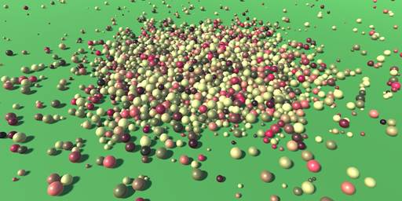

成千上万的球体，用几十个渲染批次绘制完成。

**对实例合并批次**

指示图形处理器进行绘制某些东西需要时间。要给图形处理器提供数据，包括网格和材质属性也需要时间。我们已经知道有两种方法可以减少绘制调用的数量，也就是静态批次合并和动态批次合并。

Unity可以将静态对象的网格合并成一个较大的静态网格，这能够减少绘制调用。只有使用相同材质的物体才能以这种方式组合起来。而需要付出的代价是存储更多的网格数据。启用动态批次合并的时候，Unity会在运行时对于正在视野中的动态对象执行相同的操作。这只适用于小网格，否则开销会变得太大。

还有另一种方法来组合绘制调用。它被称为图形处理器的实例化或几何体实例化。像动态批次合并一样，这是在运行时对可见对象进行的处理。这里的想法主要是图形处理器在一次遍历的时候会被告知多次来渲染相同的网格。所以它不能组合不同的网格或是材质，但这种方法不限于小网格。我们将尝试使用这种方法。

**许多个球体**

为了测试图形处理器的实例化，我们需要渲染相同的网格多次。让我们为这个目的创建一个简单的球体预制件，这个球体预制件使用的是我们的白色材质。

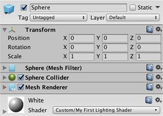

白色球体的预制件。

要实例化这个球体，请创建一个测试组件，该测试组件可以多次生成预制件，并将生成的预制件随机置于球形区域内。让这些实例化的球体成为instantiator的子物体，这样编辑器的层次结构窗口就不需要显示数千个实例而变得很混乱。

```
`using` `UnityEngine;` `public` `class` `GPUInstancingTest : MonoBehaviour {` `    ``public` `Transform prefab;` `    ``public` `int` `instances = 5000;` `    ``public` `float` `radius = 50f;` `    ``void` `Start () {``        ``for` `(``int` `i = 0; i < instances; i++) {``            ``Transform t = Instantiate(prefab);``            ``t.localPosition = Random.insideUnitSphere * radius;``            ``t.SetParent(transform);``        ``}``    ``}``}`
```

创建一个新的场景，并在该场景中放置一个测试对象，测试对象会带有这个组件。将球体的预制件分配给它。我将使用这个测试对象在半径50的球体内创建5000个球体实例。

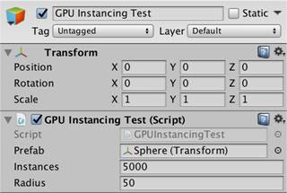

测试对象。

将测试对象放置在原点，将相机置于（0,0，-100）可确保球体的全部区域都位于视野中。 现在我们可以使用游戏窗口的统计面板来确定如何绘制所有的对象。 关闭主光源的阴影，这样只有球体再加上背景会被绘制。还要将相机设置为使用前向渲染路径。

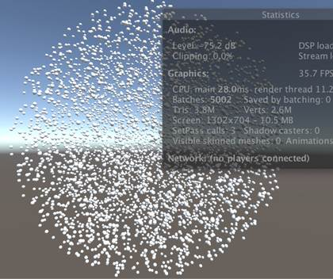

全是球所组成的球体。

在我的例子中，需要5002次绘制调用来渲染整个视图，这在统计面板中被称为批次合并。这是5000次球体的绘制调用再加上两个额外的背景和相机效果的绘制调用。

请注意，即使启用了动态批次合并，球体也不会进行批次合并。这是因为球体的网格太大。如果我们使用的是立方体，那么它们将被批次合并。

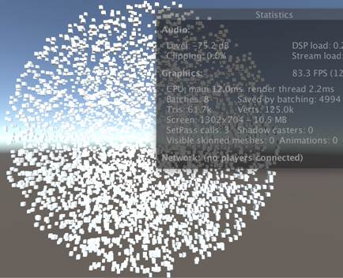

由立方体组成的球体。

在立方体的情况下，我只需要进行八个绘制批次，所以所有的立方体都通过六个绘制批次渲染完毕。这减少了4994个绘制调用，可以从统计面板中的” 批次合并节省的绘制调用“里面看到。在我的这种情况中，它也报告了一个更高的帧速率。现在是每秒83帧而不是每秒35 帧。 这是一个用渲染帧的时间，而不是实际帧速率所做的度量，但它仍然是性能差异的良好指示。立方体因为合并批次而可以更快地绘制，但是立方体需要的网格数据远少于球体。所以这不是一个公平的比较。

由于编辑器产生了很多的开销，构建的时候性能差异可能会更大。特别是场景窗口可以减缓很多事情，因为它是一个额外的视图，而且必须渲染。在播放模式下，我隐藏了它以提高性能。

**对实例化进行支持**

在默认情况下，不会进行图形处理器的实例化。着色器必须专门设计以便支持图形处理器的实例化。即使是这样，实体化也必须明确地在每个材质上开启。Unity的标准着色器针对这个事情有一个切换。另外让我们添加一个实例切换到MyLightingShaderGUI。像标准着色器的GUI一样，我们将为它创建一个高级选项部分。可以通过调用MaterialEditor.EnableInstancingField方法来添加这个切换。用一个新的DoAdvanced方法来做这个事情。

```
`void` `DoAdvanced () {``    ``GUILayout.Label(``"Advanced Options"``, EditorStyles.boldLabel);` `    ``editor.EnableInstancingField();``}`
```

在我们的GUI底部添加这个部分。

```
`public` `override` `void` `OnGUI (``    ``MaterialEditor editor, MaterialProperty[] properties``) {``    ``this``.target = editor.target ``as` `Material;``    ``this``.editor = editor;``    ``this``.properties = properties;``    ``DoRenderingMode();``    ``DoMain();``    ``DoSecondary();``    ``DoAdvanced();``}`
```

选择我们的白色材质。 高级选项标题现在在白色材质的检视器的底部可见。 但是，还没有一个关于实例化的切换。

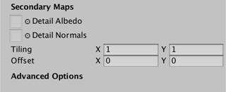

现在还没有支持实例化。

只有当着色器实际支持实例化的时候，才会显示这个切换。我们可以通过将#pragma multi_compile_instancing指令添加到至少一个着色器的一个渲染通道中来启用这个切换。这将使得着色器有变体，来支持几个关键字（在我们的情况下为INSTANCING_ON），但是其他关键字也是可能的。在*My FirstLighting*着色器的第一个基础渲染通道中做这个事情。

```
`#pragma multi_compile_fwdbase``#pragma multi_compile_fog``#pragma multi_compile_instancing`
```


支持并启用的实例化。

我们的材质现在有一个启用实例的切换。选中将改变球体的渲染方式。

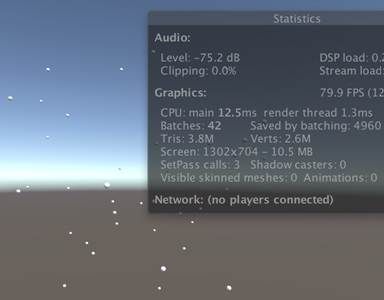

每个合并批次只有一个位置信息。

在我的情况下，渲染批次已经减少到42个，这意味着现在所有的5000个球体只有40个渲染批次 帧速率也高达80 fps。 但只有几个球体是可见的。

所有5000个球体仍在渲染，只是同一渲染批次中的所有球体都在同一位置。他们都使用渲染批次中第一个球体的转换矩阵。 这是因为一个渲染批次中所有球体的矩阵现在作为数组发送到图形处理器。 而且没有告诉着色器使用哪个数组索引，所以着色器总是使用第一个。

**实例ID**

与一个实例对应的数组索引称为其实例ID。图形处理器通过顶点数据将其传递给着色器的顶点程序。实例ID是一个无符号整数，名字是instanceID，在大多数平台上具有SV_InstanceID语义。 我们可以使用UNITY_VERTEX_INPUT_INSTANCE_ID宏将其包含在我们的VertexData结构中。 它在UnityInstancing中定义，由UnityCG导入。 它给出了实例ID的正确定义，或者在实例化未启用的时候没有任何内容。将其添加到*My Lighting*.中的VertexData结构中去。

```
`struct` `VertexData {``    ``UNITY_VERTEX_INPUT_INSTANCE_ID``    ``float4 vertex : POSITION;``    ``…``};`
```

当启用实例化的时候，我们现在可以访问我们的顶点程序中的实例ID。 使用实例ID，我们可以在转换顶点位置的时候使用正确的矩阵。 但是，UnityObjectToClipPos没有一个矩阵参数。 它总是使用unity_ObjectToWorld。要解决这个问题，UnityInstancing导入文件将使用一个使用矩阵数组的宏来覆盖unity_ObjectToWorld。 这可以被认为是一个肮脏的宏hack方法，但它可以无需更改现有的着色器代码，确保向后兼容。

为了使这种hack方法工作，实例的数组索引必须全局可用于所有着色器的代码。我们必须通过UNITY_SETUP_INSTANCE_ID宏来进行手动设置，而且这必须在顶点程序中完成，这样才可能在其他代码需要它之前设置好。

```
`InterpolatorsVertex MyVertexProgram (VertexData v) {``    ``InterpolatorsVertex i;``    ``UNITY_INITIALIZE_OUTPUT(Interpolators, i);``    ``UNITY_SETUP_INSTANCE_ID(v);``    ``i.pos = UnityObjectToClipPos(v.vertex);``    ``…``}`
```

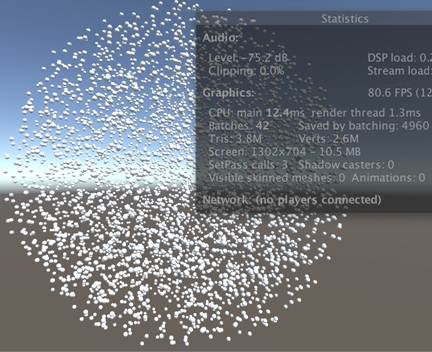

实例化后的球体。

着色器现在可以访问所有实例的转换矩阵，因此球体在其实际位置进行渲染

**矩阵阵列的替换是如何工作的？**

当实例化启用的时候，在最直观的情况下，可以归结为这一点。

```
`static` `uint` `unity_InstanceID;` `CBUFFER_START(UnityDrawCallInfo)``    ``// Where the current batch starts within the instanced arrays.``    ``int` `unity_BaseInstanceID;``CBUFFER_END` `#define UNITY_VERTEX_INPUT_INSTANCE_ID uint instanceID : SV_InstanceID;` `#define UNITY_SETUP_INSTANCE_ID(input) \``    ``unity_InstanceID = input.instanceID + unity_BaseInstanceID;``    ` `// Redefine some of the built-in variables /``// macros to make them work with instancing.``UNITY_INSTANCING_CBUFFER_START(PerDraw0)``    ``float4x4 unity_ObjectToWorldArray[UNITY_INSTANCED_ARRAY_SIZE];``    ``float4x4 unity_WorldToObjectArray[UNITY_INSTANCED_ARRAY_SIZE];``UNITY_INSTANCING_CBUFFER_END` `#define unity_ObjectToWorld     unity_ObjectToWorldArray[unity_InstanceID]``#define unity_WorldToObject     unity_WorldToObjectArray[unity_InstanceID]`
```

UnityInstancing中的实际代码要复杂得多。 它要处理平台差异，使用实例的其他方法还有立体渲染的特殊代码，这导致间接定义的多个步骤。它还必须重新定义UnityObjectToClipPos，因为UnityCG首先导入UnityShaderUtilities。

缓冲区宏将在后面进行解释。

**渲染批次的大小**

你可能会得到不同于我的渲染批次的数量。在我的情况下，共有40个渲染批次渲染了5000个球体，这意味着每个渲染批次有125个球体。

每个渲染批次需要自己的矩阵阵列。这个数据被发送到图形处理器并存储在一个存储器缓冲区中，在Direct3D中被称为常量缓冲区，在OpenGL中被称为统一缓冲区。这些缓冲区具有一个大小的上限，这限制了一个渲染批次中可以容纳多少个实例。假设桌面电脑的图形处理器中每个缓冲区的大小限制为64KB。

单个矩阵由16个浮点数组成，每个浮点数为四个字节。所以每个矩阵是64个字节。 每个实例都需要一个对象空间到世界空间的变换矩阵。然而，我们还需要一个世界空间到对象空间的矩阵来转换法向量。所以我们最终得到的是每个实例128个字节。 这导致一个渲染批次的大小达到最大，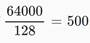，这就只需要10个渲染批次来绘制5000个球体。

 

 

**最大不是512么？**

内存的大小使用的是二进制，而不是十进制，因此1KB表示1024个字节，而不是1000个字节。因此，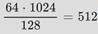。

UNITY_INSTANCED_ARRAY_SIZE默认定义为500，但你可以使用编译器指令来覆盖它。比如说像是#pragma instancing_options maxcount：512将最大值设置为512。但是，这将导致一个断言失败错误，所以实际的限制是511。其实这个值在500和512之间没有太大的区别。

虽然桌面电脑上缓冲区的最大大小是64KB，但在大多数手机上缓冲区的最大大小只有16KB。 在目标是OpenGL ES 3，OpenGL Core或是Metal的时候Unity会简单的将最大大小变成原来的四分之一来自动适应这一点。 因为我在编辑器中使用的是OpenGL Core，所以最终我得到的渲染批次大小为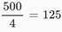。

你可以通过添加编译器指令#pragmainstancing_options force_same_maxcount_for_gl来禁用这个自动缩小。多个实例选项被组合在同一个指令中。但是，这可能导致在部署到移动设备的时候出现故障，所以要小心。

**关于assumeuniformscaling选项?**

你可以使用#pragma instancing_options来指明所有实例化后的对象具有统一的大小尺寸。这消除了使用世界空间到对象空间的矩阵来转换法线的需要。而当设置此选项的时候，UnityObjectToWorldNormal函数会改变其行为，它不会消除第二个矩阵数组。所以这个选项什么内容也没有，至少在Unity 2017.1.0中是如此。

**对阴影进行实例化**

到目前为止，我们的物体没有阴影。 将主光源的软阴影重新打开，并确保阴影距离足以包含所有的球体。当摄像机位于-100，而球体的半径为50的时候，阴影距离为150就足够了。

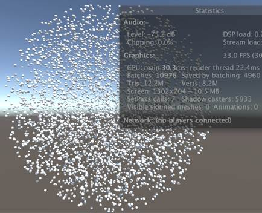

大量的阴影。

渲染5000个球体的阴影会对图形处理器的效率造成伤害。但是，当渲染球体阴影的时候，我们也可以使用图形处理器的实例化。 将所需的指令添加到阴影投射渲染通道。

```
`#pragma multi_compile_shadowcaster``#pragma multi_compile_instancing`
```

还要将UNITY_VERTEX_INPUT_INSTANCE_ID和UNITY_SETUP_INSTANCE_ID添加到My Shadows着色器里面。

```
`struct` `VertexData {``    ``UNITY_VERTEX_INPUT_INSTANCE_ID``    ``…``};` `…` `InterpolatorsVertex MyShadowVertexProgram (VertexData v) {``    ``InterpolatorsVertex i;``    ``UNITY_SETUP_INSTANCE_ID(v);``    ``…``}`
```

 

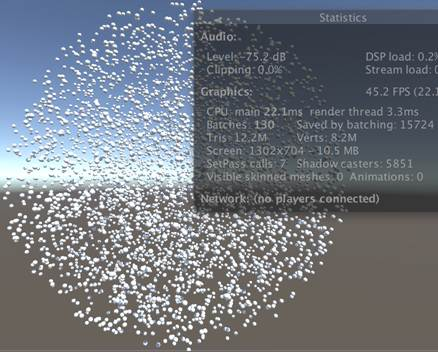

实例化后的阴影。

现在渲染所有这些阴影就变得很容易。

 

**多个光源**

我们只添加了对基础渲染通道和阴影投射渲染通道的实例化的支持。所以批次合并对其他的光源不起作用。要验证这一点，请禁用主光源，并添加一些影响多个球体的聚光光源或点光源。不要去打开他们的阴影，因为这样会降低帧速率。


多个光源需要一段时间才能渲染出来。

事实证明，不受额外光源影响的球体仍然会被合并批次，阴影也是如此。但是其他球体甚至没有在他们的基础渲染通道里面被合并批次。Unity对这些情况根本不支持合并批次。要在多个光源的情况下使用实例化，我们别无选择，只能切换到延迟渲染路径。为了能够让这套机制运作起来，请将所需的编译器指令添加到我们着色器的延迟渲染通道中。

```
`#pragma multi_compile_prepassfinal``#pragma multi_compile_instancing`
```

 

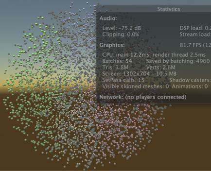

使用延迟渲染的多个光源。

在验证实例化可以用于延迟渲染后，让我们再切换回前向渲染模式。

项目工程文件下载地址：[unitypackage](http://catlikecoding.com/unity/tutorials/rendering/part-19/batching-instances/batching-instances.unitypackage)。

**混合材质的属性**

所有形式的合并批次的一个限制是它们只能用于那些具有相同材质的物体。 当我们想要在我们渲染的对象中表现多样性的时候，这个限制就会成为一个问题。

**随机化的颜色**

举个简单的例子来说，让我们来改变我们球体的颜色。在球体被创建后，为每个实例的材质随机分配颜色。这将隐式地创建一个共享材质的副本，所以我们最终在内存中有5000个材质实例。

```
`void` `Start () {``    ``for` `(``int` `i = 0; i < instances; i++) {``        ``Transform t = Instantiate(prefab);``        ``t.localPosition = Random.insideUnitSphere * radius;``        ``t.SetParent(transform);` `        ``t.GetComponent<meshrenderer>().material.color =``            ``new` `Color(Random.value, Random.value, Random.value);``    ``}``}`
```

 

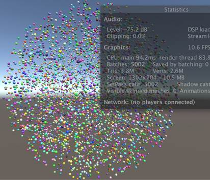

具有随机颜色的球体，没有批次合并和阴影。

即使我们已经为我们的材质启用了批次合并配置，但是批次合并仍然不再工作。把阴影关掉会看得更清楚。我们回到每个球体一个渲染调用的情况。而且由于每个球体现在都有自己的材质，所以必须为每个球体改变着色器的状态。 这将在统计面板中显示为SetPass调用。它曾经只需要对所有球体做一次就行，但现在是5000次。因此，我的帧速率已经下降到10fps。

**材质属性块**

不再是给每个球体创建一个新的材质实例，我们现在使用的是材质属性块。这些材质属性块是包含对着色器属性覆盖的小对象。不要直接指定材质的颜色，而是设置属性块的颜色，并将其传递给球体的渲染器。

```
`//          t.GetComponent<meshrenderer>().material.color =``//              new Color(Random.value, Random.value, Random.value);` `            ``MaterialPropertyBlock properties = ``new` `MaterialPropertyBlock();``            ``properties.SetColor(``                ``"_Color"``, ``new` `Color(Random.value, Random.value, Random.value)``            ``);``            ``t.GetComponent<meshrenderer>().SetPropertyBlock(properties);`
```

MeshRenderer.SetPropertyBlock方法复制块的数据，因此与我们本地创建的块没有依赖关系。这允许我们重用一个块来配置我们所有的实例。

```
`    ``void` `Start () {``        ``MaterialPropertyBlock properties = ``new` `MaterialPropertyBlock();``        ``for` `(``int` `i = 0; i < instances; i++) {``            ``Transform t = Instantiate(prefab);``            ``t.localPosition = Random.insideUnitSphere * radius;``            ``t.SetParent(transform);` `//          MaterialPropertyBlock properties = new MaterialPropertyBlock();``            ``properties.SetColor(``                ``"_Color"``, ``new` `Color(Random.value, Random.value, Random.value)``            ``);``            ``t.GetComponent<meshrenderer>().SetPropertyBlock(properties);``        ``}``    ``}`
```

在做了这个改变之后，我们又回到所有球体只需要一个SetPass调用的情况。 但是它们又变成白色了。这是因为图形处理器不知道属性覆盖。

**属性缓冲区**

当渲染实例化对象的时候，Unity通过将数组上传到图形处理器的内存来使得变换矩阵对于图形处理器可用。Unity对存储在材质属性块中的属性执行相同的操作。但是为了让这样的方式能够工作，我们必须在*My Lighting*中定义一个适当的缓冲区。

声明一个实例化缓冲区的工作原理就像创建一个诸如插值器之类的结构，但每个平台的确切语法是不同的。我们可以使用UNITY_INSTANCING_CBUFFER_START和UNITY_INSTANCING_CBUFFER_END宏来处理差异。当启用实例化的时候，它们什么都不做。

将我们的_Color变量的定义放在实例化缓冲区中。 UNITY_INSTANCING_CBUFFER_START宏需要一个名字参数。 实际名字并不重要。 宏将带有UnityInstancing_前缀，以防止名字冲突。

```
`UNITY_INSTANCING_CBUFFER_START(InstanceProperties)``    ``float4 _Color;``UNITY_INSTANCING_CBUFFER_END`
```

像变换矩阵一样，当启用实例化的时候，颜色数据将作为数组上传到图形处理器。 UNITY_DEFINE_INSTANCED_PROP宏会为我们处理正确的声明语法。

```
`UNITY_INSTANCING_CBUFFER_START(InstanceProperties)``//  float4 _Color;``    ``UNITY_DEFINE_INSTANCED_PROP(float4, _Color)``UNITY_INSTANCING_CBUFFER_END`
```

要访问片段程序中的数组，我们还需要知道实例ID。所以将它添加到内插器结构。

```
`struct` `InterpolatorsVertex {``    ``UNITY_VERTEX_INPUT_INSTANCE_ID``    ``…``};` `struct` `Interpolators {``    ``UNITY_VERTEX_INPUT_INSTANCE_ID``    ``…``};`
```

在顶点程序中，将ID从顶点数据复制到内插器。当启用实例化的时候，UNITY_TRANSFER_INSTANCE_ID宏定义了这个简单的操作，否则的话会不执行任何操作。

```
`InterpolatorsVertex MyVertexProgram (VertexData v) {``    ``InterpolatorsVertex i;``    ``UNITY_INITIALIZE_OUTPUT(Interpolators, i);``    ``UNITY_SETUP_INSTANCE_ID(v);``    ``UNITY_TRANSFER_INSTANCE_ID(v, i);``    ``…``}`
```

在片段程序的开头，使ID全局可用，就像在顶点程序中所做的一样。

```
`FragmentOutput MyFragmentProgram (Interpolators i) {``    ``UNITY_SETUP_INSTANCE_ID(i);``    ``…``}`
```

现在，在实例化不被使用的时候，我们可以通过_Color来访问颜色，当启用实例化的时候，我们可以通过_Color [unity_InstanceID] 来访问颜色。 为了这个目的，我们可以使用UNITY_ACCESS_INSTANCED_PROP宏。

```
`float3 GetAlbedo (Interpolators i) {``    ``float3 albedo =``        ``tex2D(_MainTex, i.uv.xy).rgb * UNITY_ACCESS_INSTANCED_PROP(_Color).rgb;``    ``…``}` `float` `GetAlpha (Interpolators i) {``    ``float` `alpha = UNITY_ACCESS_INSTANCED_PROP(_Color).a;``    ``…``}`
```

 

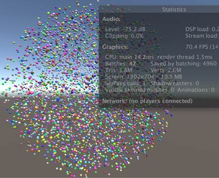

有颜色的球体批次合并以后的结果。

现在我们的随机颜色的球体再次被批次合并。我们可以将其他属性以相同的方式成为变量。这对于颜色，浮点数，矩阵和四分量浮点数向量都是可行的。 如果要改变纹理，那么可以使用单独的纹理数组，并将索引添加到实例化缓冲区中去。

多个属性可以组合在相同的缓冲区中，但要在大小限制以内。还要注意，缓冲区被分为32位的块，因此单个浮点数需要与向量相同的空间。你也可以使用多个缓冲区，但也有一个限制，它们不是免费的。当启用实例化的时候，缓冲的每个属性都将成为一个数组，因此只有对于每个实例需要更改的属性才能执行这个操作。

**阴影**

我们的阴影也依赖于颜色。调整*MyShadows* ，这样它可以对每个实例支持独特的颜色。

```
`//float4 _Color;``UNITY_INSTANCING_CBUFFER_START(InstanceProperties)``    ``UNITY_DEFINE_INSTANCED_PROP(float4, _Color)``UNITY_INSTANCING_CBUFFER_END` `…``struct` `InterpolatorsVertex {``    ``UNITY_VERTEX_INPUT_INSTANCE_ID``    ``…``};` `struct` `Interpolators {``    ``UNITY_VERTEX_INPUT_INSTANCE_ID``    ``…``};` `float` `GetAlpha (Interpolators i) {``    ``float` `alpha = UNITY_ACCESS_INSTANCED_PROP(_Color).a;``    ``…``}` `InterpolatorsVertex MyShadowVertexProgram (VertexData v) {``    ``InterpolatorsVertex i;``    ``UNITY_SETUP_INSTANCE_ID(v);``    ``UNITY_TRANSFER_INSTANCE_ID(v, i);``    ``…``}` `float4 MyShadowFragmentProgram (Interpolators i) : SV_TARGET {``    ``UNITY_SETUP_INSTANCE_ID(i);``    ``…``}`
```


**LOD****的实例化**

在这个系列教程的上一篇文章中，我们增加了对LOD组的支持。让我们来看看它们是否与图形处理器的实例化兼容。创建一个仅包含一个球体与我们白色材质的LOD组的新预制件。将其设置为淡入淡出并进行配置，使LOD 0在变换宽度0.25的情况下剔除3％以下的情况。这对于我们可见的小球体来说，给了一个很好的过渡范围。

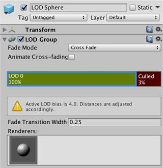 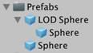

LOD球的预制件。

将这个预制件分配给我们的测试对象，而不再是普通的球体。由于这个对象本身没有网格渲染器，因此在此时进入播放模式时会出现错误。我们必须调整GPUInstancingTest.Start，以便它能够访问子对象的渲染器，如果根对象本身没有渲染器的话。 当我们这样做的时候，请确保它在简单的对象和具有任意级别的LOD组的情况下都能够工作。

```
`//          t.GetComponent<meshrenderer>().SetPropertyBlock(properties);` `            ``MeshRenderer r = t.GetComponent<meshrenderer>();``            ``if` `(r) {``                ``r.SetPropertyBlock(properties);``            ``}``            ``else` `{``                ``for` `(``int` `ci = 0; ci < t.childCount; ci++) {``                    ``r = t.GetChild(ci).GetComponent<meshrenderer>();``                    ``if` `(r) {``                        ``r.SetPropertyBlock(properties);``                    ``}``                ``}``            ``}`
```

 

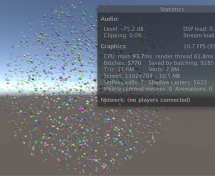

没有实例化LOD的淡入淡出，但是有阴影。

我们现在得到了具有淡入淡出的球体，不幸的是没有有效的批次合并。 Unity能够批次合并使用相同LOD渐变因子的球体，但如果它们可以像往常一样批次合并的话，那么效果会更好。我们可以通过用一个缓冲的数组替换unity_LODFade来实现这一点。我们可以指示Unity的着色器代码，通过为支持实例化的每个渲染通道添加lodfadeinstancing选项来做到这一点。

```
`#pragma multi_compile_instancing``#pragma instancing_options lodfade`
```

 

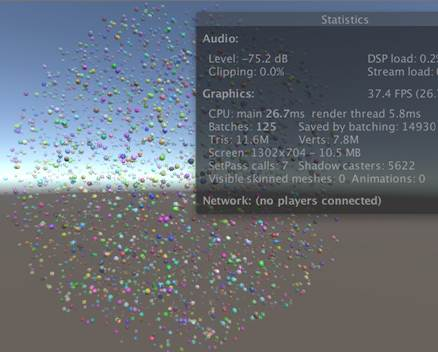

带有实例化LOD的淡入淡出。

现在我们的着色器同时支持最优实例化和LOD的淡入淡出。

这个系列的下一个教程将覆盖更多的渲染技术。它将于2017年9月发布。