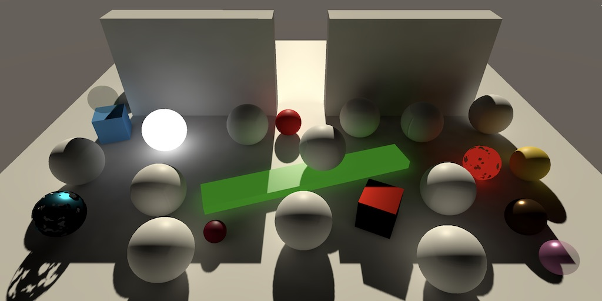
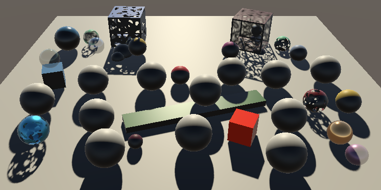
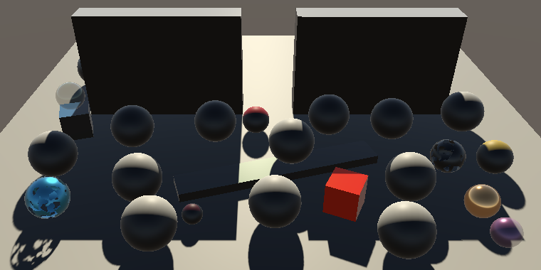
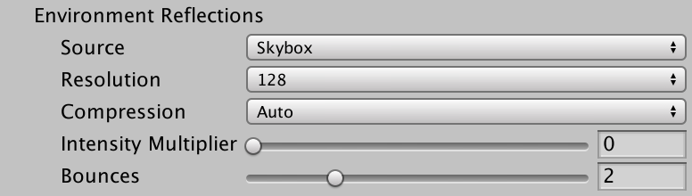
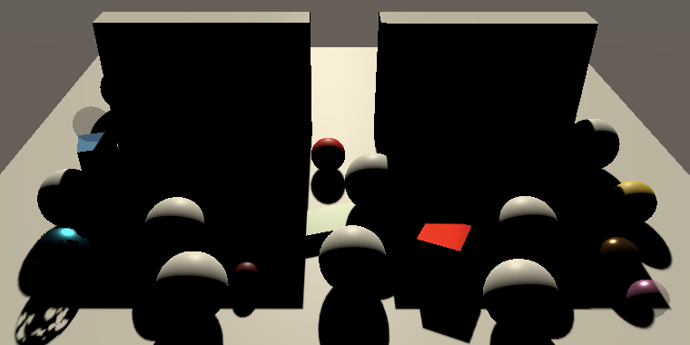
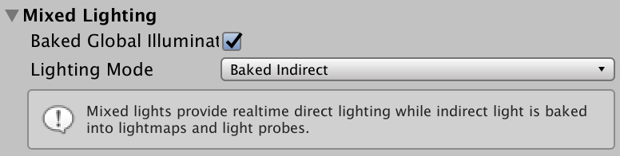
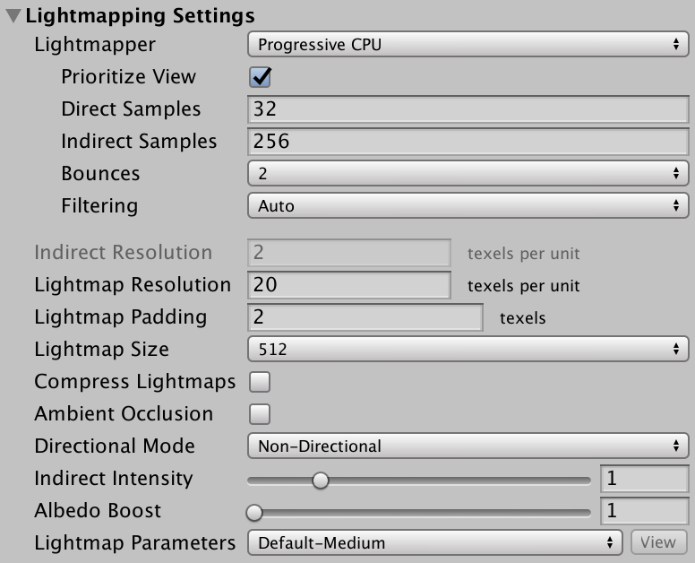
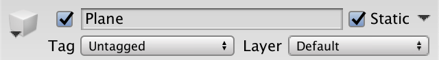
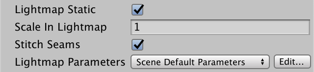
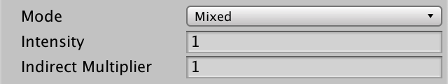

# 可编程渲染管线8 全局光照

原文：https://catlikecoding.com/unity/tutorials/scriptable-render-pipeline/global-illumination/

- 烘焙和采样光照贴图
- 显示直射光
- 创建自发光材质
- 通过探针和LPPV采样光线
- 支持预计算的实时全局光照

这是Unity可编程渲染管线系列教程的第八部分。我们不仅将支持静态的全局光照还会支持动态的全局光照。

本教程基于Unity 2018.3.0f2。



在物体的周围和角落仍能受到光线的影响。

> ### 修正
>
> 在先前的教程中，有两个bug亟待修复。首先，在只渲染级联阴影的情况下，必须设置阴影距离的平方。
>
> ```
> 	void RenderCascadedShadows (ScriptableRenderContext context) {		float tileSize = shadowMapSize / 2;		cascadedShadowMap = SetShadowRenderTarget();		shadowBuffer.BeginSample("Render Shadows");		shadowBuffer.SetGlobalVector(			globalShadowDataId, new Vector4(0f, shadowDistance * shadowDistance)		);		context.ExecuteCommandBuffer(shadowBuffer);		…	}
> ```
>
> 其次，环境探针的混合插值代码写错了（这个翻译的时候有提到）
>
> ```
> float3 SampleEnvironment (LitSurface s) {	…	if (blend < 0.99999) {		…		color = lerp(			DecodeHDREnvironment(sample, unity_SpecCube1_HDR), color, blend		);	}	return color;}
> ```

# 1 光照贴图

实时光照目前只会处理直接光源，只有直接暴露在光源下的物体才会被照亮。它没有考虑到间接光源的贡献,间接光是指光线在物体表面与表面之间传递,而最终进入摄像机的那部分光线。我们将其称之为全局光照。在Unity里我们可以通过烘焙光照贴图的方式来获取。 [Rendering 16, Static Lighting](https://catlikecoding.com/unity/tutorials/rendering/part-16/)教程讲解了在Unity里烘焙光照的基础知识，不过要注意它讲的是旧版渲染管线，而且只是Enlighten lightmapper。

## 1.1 布置场景

当场景中只有一个直射光时，我们可以很明显的感觉到间接光的丢失，因为所有的阴影区域都是纯黑的色块。

场景中只有实时光源的情况

如果有大块的阴影区域这种违和感会更加明显。



我们在直射光计算中添加了环境反射的贡献，所以即使在阴影区域内我们仍能够观察到物体的大致形体。哪怕在场景中我们并没有使用任何反射探针，我们还是可以得到来自天空盒的环境反射，正是他照亮了阴影下的物体。如果我们将*Intensity Multiplier*降为0，消除天空盒的环境反射，我们就可以发现，阴影区域变成了纯黑色块，根本无法观察到阴影下有什么物体。



## 1.2 烘焙光照

烘焙间接光的开关位于Scene Lighting Settings里Mix Lighting下的*Baked Global Illumination* 。我们把Lighting Mode选为 Baked Indirect。Unity就会为我们烘焙光照，当然我们看不到具体的烘焙细节。

烘焙间接光的模式

关于 *Lightmapping Settings*，我们需要在默认设置的基础上做出一点小调整。默认是使用progressive lightmapper的，这一点我们不做修改，但是因为我们的示例场景很小，所以我们把光照贴图（*Lightmap Resolution*）的分辨率从10提升为20。此外我还关闭了*Compress Lightmaps，*通过跳过光照贴图的压缩步骤，进一步提升光照贴图的质量。最后我们将 *Directional Mode*设为*Non-Directional*，因为只有场景中有物体使用法线贴图时默认选项才有意义，在这里我们很明显不需要。

光照贴图设置

烘焙的光照是静态的，所以无法在Play模式下进行修改。而且只有被标记为lightmap-static的游戏物体的间接光才能被烘焙进光照贴图中。

最快的设置方法就是将所有的物体设为完全静态。

静态的游戏物体

烘焙的时候，Unity可能会跳出关于UV重叠（overlapping UVs）的警告。这种情况的发生通常是因为某些物体在光照贴图中的UV展的太小了，导致光照信息的重复。你可以调整*Lightmap*的*Scale*因子来修改该物体在光照贴图中所占的大小。对于像Unity内置球体这样的物体，开启*Stitch Seams* 可以进一步的提高烘焙质量。



最后，为了烘焙间接光，我们将场景中直射光的模式设为Mixed。这意味着这个光源不仅将用于实时光照，Unity还会烘焙相对于它而产生的间接光。



烘焙完成后，可以在*Lighting*窗口的*Baked Lightmaps*标签下检查生成的光照贴图。你最后可能会得到多张光照贴图，这取决于光照贴图的尺寸以及需要被烘焙的静态几何体占了多大的空间。

两张光照贴图

## 1.3 采样光照贴图

为了采样光照贴图，我们需要告知Unity，允许我们的着色器访问光照贴图，并在顶点数据里提供光照贴图的uv坐标。和开启光照探针的方式一样，我们在`**MyPipeline**.Render`里启用`RendererConfiguration.PerObjectLightmaps`标签。

```
		drawSettings.rendererConfiguration |=			RendererConfiguration.PerObjectReflectionProbes |			RendererConfiguration.PerObjectLightmaps;
```

在渲染时，如果物体有光照贴图，Unity会提供必要的数据，并寻找带有*LIGHTMAP_ON* 关键字的着色器用于渲染。所以在我们的着色器中添加对应的多重编译指令。（注意这个关键字没有以'_'开头）

```
			#pragma multi_compile _ _SHADOWS_SOFT			#pragma multi_compile _ LIGHTMAP_ON
```

光照贴图可以通过`unity_Lightmap` 访问，此外还需要相应的采样器状态，将其添加到Lit.hlsl。

```
TEXTURE2D(unity_Lightmap);SAMPLER(samplerunity_Lightmap);
```

光照贴图通过第二层UV通道提供，将其添加到**VertexInput**中。

```
struct VertexInput {	float4 pos : POSITION;	float3 normal : NORMAL;	float2 uv : TEXCOORD0;	float2 lightmapUV : TEXCOORD1;	UNITY_VERTEX_INPUT_INSTANCE_ID};
```

**VertexOutpu**t也一样，但是我们只有在真正使用光照贴图时才需要光照贴图的UV。

```
struct VertexOutput {	float4 clipPos : SV_POSITION;	float3 normal : TEXCOORD0;	float3 worldPos : TEXCOORD1;	float3 vertexLighting : TEXCOORD2;	float2 uv : TEXCOORD3;	#if defined(LIGHTMAP_ON)		float2 lightmapUV : TEXCOORD4;	#endif	UNITY_VERTEX_INPUT_INSTANCE_ID};
```

光照贴图和其他贴图一样，有个缩放偏移值，但不同的是，这个值不是作用于整个贴图，相反，它是相对于每个物体光照UV而言，用以定位每个物体所展开的UV在光照贴图中的真正位置。这个值在UnityPerDraw缓存区中被定义为`unity_LightmapST`，因为这个命名格式与`**TRANSFORM_TEX**`的默认格式不符，所以用的时候我们得自己在LitPassVertex里完成转换。

```
CBUFFER_START(UnityPerDraw)	…	float4 unity_LightmapST;CBUFFER_END … VertexOutput LitPassVertex (VertexInput input) {	…	output.uv = TRANSFORM_TEX(input.uv, _MainTex);	#if defined(LIGHTMAP_ON)		output.lightmapUV =			input.lightmapUV * unity_LightmapST.xy + unity_LightmapST.zw;	#endif	return output;}
```

> ### 使用光照贴图的物体还能开启实例化技术吗？
>
> unity_LightmapST是在每次绘制时设置的，如果开启了实例化，那么这个值会在导入时被一个宏定义所覆盖，所以GPU实例化是可以和光照贴图一起工作的，但要注意仅限于采样同一张光照贴图的物体。
>
> 还需注意的是在Play模式下静态批处理可能会覆盖实例化。当一个物体被标记为静态且静态批处理被开启时，就会出现这个情况。

接着我们创建一个单独的方法`SampleLightmap` 来采样光照贴图。我们传入UV坐标，在方法内部，我们调用`SampleSingleLightmap` （该方法定义在Core *EntityLighting*文件中），我们得为这个方法传入光照贴图，采样器状态和UV坐标，前两个可用过宏`**TEXTURE2D_PARAM**` 获取。

```
float3 SampleLightmap (float2 uv) {	return SampleSingleLightmap(		TEXTURE2D_PARAM(unity_Lightmap, samplerunity_Lightmap), uv                ...	);}
```

> ### 不应该使用`**TEXTURE2D_ARGS**`吗？
>
> 用这个也许会有更好的效果，但是目前这个宏被放在别的位置，至少在Unity201.3版本中，这个宏仍处于试验性的版本中。也许Unity在未来的版本会做出替换。

`SampleSingleLightmap` 需要的参数不只这些，下一个参数就是UV坐标的缩放偏移转换，这一步我们已经在顶点函数内完成了，所以这里我们直接传入一个恒等变换的值。

```
	return SampleSingleLightmap(		TEXTURE2D_PARAM(unity_Lightmap, samplerunity_Lightmap), uv,		float4(1, 1, 0, 0)                ...	);
```

再之后需要传入一个bool值来表面是否需要将光照贴图的数据进行解码。这取决于我们想要发布的目标平台，如果Unity使用全HDR的光照贴图，那么就不需要解码，我们可以通过关键字*UNITY_LIGHTMAP_FULL_HDR* 来判断。

```
	return SampleSingleLightmap(		TEXTURE2D_PARAM(unity_Lightmap, samplerunity_Lightmap), uv,		float4(1, 1, 0, 0),		#if defined(UNITY_LIGHTMAP_FULL_HDR)			false		#else			true		#endif	);
```

最后我们还需要一个解码结构，来使光照解码至正确的范围。我们使用`**float4**(**LIGHTMAP_HDR_MULTIPLIER**, **LIGHTMAP_HDR_EXPONENT**, 0.0, 0.0)`来构建。

```
	return SampleSingleLightmap(		TEXTURE2D_PARAM(unity_Lightmap, samplerunity_Lightmap), uv,		float4(1, 1, 0, 0),		#if defined(UNITY_LIGHTMAP_FULL_HDR)			false,		#else			true,		#endif		float4(LIGHTMAP_HDR_MULTIPLIER, LIGHTMAP_HDR_EXPONENT, 0.0, 0.0)	);
```

我们采样光照贴图就是为了把它加到全局光照中去，为此我们再创建一个`GlobalIllumination` 方法来处理具体细节。他需要一个VertexOutput结构的参数，所以这个方法得写在结构体定义之后。在方法内部，如果我们有光照贴图，那么就采样并返回，不然就直接返回0。

```
struct VertexOutput {	…}; float3 GlobalIllumination (VertexOutput input) {	#if defined(LIGHTMAP_ON)		return SampleLightmap(input.lightmapUV);	#endif	return 0;}
```

在LitPassFragment的最后调用这个方法，为了方便观察，我们先用他覆盖先前的颜色。

```
float4 LitPassFragment (	VertexOutput input, FRONT_FACE_TYPE isFrontFace : FRONT_FACE_SEMANTIC) : SV_TARGET {	…		color += ReflectEnvironment(surface, SampleEnvironment(surface));	color = GlobalIllumination(input);		return float4(color, albedoAlpha.a);}
```

只显示全局光照的情况。

### 1.4 半透明表面

目前整体的视觉效果还是挺柔和的，但是在半透明表面的附近会出现断断续续的瑕疵，特别是fade类型的材质。这是因为progressive  lightmapper会依据每个材质的渲染队列来查找透明物体，并通过_Cutoff这一着色器属性来裁减材质。所以虽然可以烘焙透明物体的光照贴图，但是如果暴露在光线下的是物体的反面，那么光照计算就会出现问题。当双面物体的正反两面重叠时，这个问题也同样会出现，图中这个情况就是我们使用了我们自己生成的双面几何体。

透明物体带来的瑕疵

这个问题在于光照贴图烘焙时只会应用物体的正面，不会包含背面的光照数据。背面仍可以渲染是因为它采样的是正面的光照数据。当lightmapper  在烘焙采样中碰到物体背面时，光照贴图就会出现这个瑕疵，因为它产生了无效的光照信息。对于这种有瑕疵的物体，你为物体引用一个 *Lightmap Parameters*（创建asset的路径：Create/Lightmap Parameters,然后每个物体的MeshRenderer里会有个 Lightmap Parameters的选项） 来缓解这个问题。调低*Backface Tolerance*阈值，可以让lightmapper允许更多的丢失数据，并对结果进行平滑处理。


### 1.5 结合直接光和间接光

现在我们有了全局光照，由于间接光属于漫反射，所以要乘以物体表面的漫反射值。

```
	color += GlobalIllumination(input) * surface.diffuse;
```

直接光+全局光照

和我们想的一样，最后的结果要比没有全局光照的情况亮。当时场景现在比之前亮的太多了。因为天空盒也算进了全局光照中。我来更好的观察，我们只需要添加直射光的间接光就够了。所以我们把环境光的Intensity降为0。


黑色的环境光

### 1.6 只有烘焙光源

我们可能会把光源的模式设为Baked，这意味着这个光源将不会被作为实时光源参与计算了。与之相反，直接光和间接光都算进了光照贴图之中。在我们的例子，这使得我们的场景没有任何的实时光源。所以所有的高光和软阴影都被忽略了。


全烘焙光的情况

### 1.7 Meta Pass

lightmapper要想烘焙光照首先得知道场景中物体的表面属性。所以它会寻找一个特殊的meta  pass来渲染物体，从中提取信息。我们的着色器并没有提供这样一个pass，所以它使用的是Unity默认的meta  pass。然而，默认的可能无法完美的满足我们的需求。所以我们要创建自己的meta  pass。新增一个pass，将光照模式设为Meta。这个pass不要用剔除，我们在其中导入一会要写的Meta.hlsl文件。

```
		Pass {			Tags {				"LightMode" = "Meta"			}						Cull Off						HLSLPROGRAM						#pragma vertex MetaPassVertex			#pragma fragment MetaPassFragment						#include "../ShaderLibrary/Meta.hlsl"						ENDHLSL		}
```

我们一开始可以把Meta.hlsl看做一个Lit.hlsl的简化版。我们需要`unity_MatrixVP` 矩阵、`unity_LightmapST`、主贴图和非实例化的材质属性。这里我们不需要对象到世界空间的转换矩阵，直接从对象空间转换到裁减空间即可。我们让片元函数先直接返回0。

```
#ifndef MYRP_LIT_META_INCLUDED#define MYRP_LIT_META_INCLUDED #include "Packages/com.unity.render-pipelines.core/ShaderLibrary/Common.hlsl"#include "Lighting.hlsl" CBUFFER_START(UnityPerFrame)	float4x4 unity_MatrixVP;CBUFFER_ENDCBUFFER_START(UnityPerDraw)	float4 unity_LightmapST;CBUFFER_ENDCBUFFER_START(UnityPerMaterial)	float4 _MainTex_ST;	float4 _Color;	float _Metallic;	float _Smoothness;CBUFFER_END TEXTURE2D(_MainTex);SAMPLER(sampler_MainTex); struct VertexInput {	float4 pos : POSITION;	float2 uv : TEXCOORD0;	float2 lightmapUV : TEXCOORD1;}; struct VertexOutput {	float4 clipPos : SV_POSITION;	float2 uv : TEXCOORD0;}; VertexOutput MetaPassVertex (VertexInput input) {	VertexOutput output;	output.clipPos = mul(unity_MatrixVP, float4(input.pos.xyz, 1.0));	output.uv = TRANSFORM_TEX(input.uv, _MainTex);	return output;} float4 MetaPassFragment (VertexOutput input) : SV_TARGET {	float4 meta = 0;	return meta;} #endif // MYRP_LIT_META_INCLUDED
```

和采样光照贴图时一样，渲染光照贴图同样是用`unity_LightmapST` 来定位到贴图的正确区域。在这种情况下我们需要调整输入位置的XY坐标。这里用到了一个小技巧来确保OpenGL可以正常的渲染。因为Z坐标不调整可能会导致失败。

```
VertexOutput MetaPassVertex (VertexInput input) {	VertexOutput output;	input.pos.xy =		input.lightmapUV * unity_LightmapST.xy + unity_LightmapST.zw;	input.pos.z = input.pos.z > 0 ? FLT_MIN : 0.0;	output.clipPos = mul(unity_MatrixVP, float4(input.pos.xyz, 1.0));	output.uv = TRANSFORM_TEX(input.uv, _MainTex);	return output;}
```

我们现在需要初始化LitSurface，但我们只有颜色、金属度、平滑度这几个值，所以我们在Lighting.hlsl中添加一个`GetLitSurfaceMeta` 方法，将其他的值都设为0。

```
LitSurface GetLitSurfaceMeta (float3 color, float metallic, float smoothness) {	return GetLitSurface(0, 0, 0, color, metallic, smoothness);}
```

在meta pass的片元程序中获取表面数据。

```
float4 MetaPassFragment (VertexOutput input) : SV_TARGET {	float4 albedoAlpha = SAMPLE_TEXTURE2D(_MainTex, sampler_MainTex, input.uv);	albedoAlpha *= _Color;	LitSurface surface = GetLitSurfaceMeta(		albedoAlpha.rgb, _Metallic, _Smoothness	);	float4 meta = 0;	return meta;}
```

我们现在可以通过表面数据访问正确的反照率(albedo)了，我们要把它作为RGB通道的输出值，同时alpha通道的值应该设为1.然后，它的强度其实是可以调整的，我们可以通过`unity_OneOverOutputBoost`访问到这个指数值，同时`unity_MaxOutputValue` 规定了可以达到的最大亮度。使用`PositivePow`方法将其应用到最终的颜色，使用clamp限定值在0到最大值之间。

```
CBUFFER_START(UnityMetaPass)	float unity_OneOverOutputBoost;	float unity_MaxOutputValue;CBUFFER_END …	 float4 MetaPassFragment (VertexOutput input) : SV_TARGET {	…		float4 meta = 0;	meta = float4(surface.diffuse, 1);	meta.rgb = clamp(		PositivePow(meta.rgb, unity_OneOverOutputBoost), 0, unity_MaxOutputValue	);	return meta;}
```

我们现在输出了用于lightmapping的albedo数据，但是meta pass可能还要用于生成其他数据。到底需要哪些数据我们可以通过`unity_MetaFragmentControl`的bool标签判断。如果第一个分量被设置了，那我们就输出albedo，否则我们输出0。

```
CBUFFER_START(UnityMetaPass)	float unity_OneOverOutputBoost;	float unity_MaxOutputValue;	bool4 unity_MetaFragmentControl;CBUFFER_END … float4 MetaPassFragment (VertexOutput input) : SV_TARGET {	…		float4 meta = 0;	if (unity_MetaFragmentControl.x) {		meta = float4(surface.diffuse, 1);		meta.rgb = clamp(			PositivePow(meta.rgb, unity_OneOverOutputBoost),			0,unity_MaxOutputValue		);	}	return meta;}
```

到目前为止，我们最终的结果会和默认的meta pass 一样。然而，默认的meta  pass还会把镜面颜色和粗糙度相乘并除以二，然后把结果和albedo叠加在一起。这个操作背后的意图是有着高镜面高光却很粗糙的材质仍然会传递一些间接光。默认的着色器就这么做了，但是它默认平滑度是存在别的地方而不是我们的_Smoothness。所以我们得自己来完成这一步。

```
	meta = float4(surface.diffuse, 1);	meta.rgb += surface.specular * surface.roughness * 0.5;
```

观察两者区别的最好方法即使使用一个白色的纯金属材质球，讲他的平滑度设为0，然后观察只有间接光的结果。

 左右分别为没有和有增益的情况

------

## 2 自发光

除了反射或吸收后重新发射光线，物体自己也可能发射光线。现实中的光源就是这样产生的，但是在渲染时我们没有将其考虑进来。作为一个自发光的材质，我们只是简单的将自发光颜色添加到光照计算中去。

### 2.1 发射（自发光）颜色

在我们的着色器中添加一个*_EmissionColor* 属性，默认为黑色。作为自发光，他可能是任意亮度，所以我们添加一个HDR特性，把它标记为高动态范围（high-dynamic-range）的颜色。

```
		_Smoothness ("Smoothness", Range(0, 1)) = 0.5		[HDR] _EmissionColor ("Emission Color", Color) = (0, 0, 0, 0)
```

自发光颜色

回到C#，我们同样把自发光颜色归到`**InstancedMaterialProperties**` 脚本内。想开启HDR颜色我们需要应用特性`ColorUsage` ，并将第二个参数设为True，至于第一个参数，他表示是否显示alpha通道，我们这里用不到，所以设为false。

```
	static int emissionColorId = Shader.PropertyToID("_EmissionColor"); 	… 	[SerializeField, ColorUsage(false, true)]	Color emissionColor = Color.black; 	… 	void OnValidate () {		…		propertyBlock.SetColor(emissionColorId, emissionColor);		GetComponent<MeshRenderer>().SetPropertyBlock(propertyBlock);	}
```

逐物体的自发光颜色设置

将自发光颜色作为新的实例属性添加到Lit.hlsl中去。接着在LitPassFragment的末尾把自发光颜色添加到要输出的片元颜色中去。

```
UNITY_INSTANCING_BUFFER_START(PerInstance)	…	UNITY_DEFINE_INSTANCED_PROP(float4, _EmissionColor)UNITY_INSTANCING_BUFFER_END(PerInstance) … float4 LitPassFragment (	VertexOutput input, FRONT_FACE_TYPE isFrontFace : FRONT_FACE_SEMANTIC) : SV_TARGET {	… 	color += GlobalIllumination(input) * surface.diffuse;	color += UNITY_ACCESS_INSTANCED_PROP(PerInstance, _EmissionColor).rgb;	return float4(color, albedoAlpha.a);}
```

自发光的直接光部分，有白的、绿的和红的。

### 2.2 自发光产生的间接光

自发光颜色目前只会点亮自己的表面，但是不会影响到其他的物体表面，因为它不是真正的游戏光源。我们能做的就是在渲染光照贴图是把自发光考虑进来，把它当做一个烘焙光源。

lightmapper会使用meta pass收集所以来自物体表面的自发光。收集时`unity_MetaFragmentControl` 的第二个分量会作为标签被设置，这时候我们就应该输出自发光颜色，并把透明度设为1。

```
CBUFFER_START(UnityPerMaterial)	float4 _MainTex_ST;	float4 _Color, _EmissionColor;	float _Metallic;	float _Smoothness;CBUFFER_END … float4 MetaPassFragment (VertexOutput input) : SV_TARGET {	…	if (unity_MetaFragmentControl.x) {		…	}	if (unity_MetaFragmentControl.y) {		meta = float4(_EmissionColor.rgb, 1);	}	return meta;}
```

要想让自发光影响其他物体这还不够。因为这会产生额外的开销，所以默认情况下，lightmapper并不会自发地从物体中收集自发光。它需要由每个材质单独开启。为了实现开启功能，我们在我们的shaderGUI中添加一个全局光照属性，在`**LitShaderGUI**.OnGUI`中调用`LightmapEmissionPropertry` 方法即可。这样在shadow casting的下方就会新出现一个调节的选项。

```
	public override void OnGUI (		MaterialEditor materialEditor, MaterialProperty[] properties	) {		…		CastShadowsToggle(); 		editor.LightmapEmissionProperty(); 		…	}
```

烘焙自发光

将模式设为Baked的还不够，因为Unity还有额外的优化手段。如果一个材质的自发光颜色设为纯黑，那么他就会被忽略。我们可以通过将材质`globalIlluminationFlags`的设为 `MaterialGlobalIlluminationFlags.EmissiveIsBlack`来告知Unity进行忽略。但这个标签不会自动调整，所以我们还得手动完成代码。

我们简单地在 global illumination属性变化时直接忽略移除标签。这样只有那些材质被设置为烘焙全局光照的物体的自发光才会被烘焙进光照贴图。这样我们就可以只在需要时使用这样的自发光材质。

```
		EditorGUI.BeginChangeCheck();		editor.LightmapEmissionProperty();		if (EditorGUI.EndChangeCheck()) {			foreach (Material m in editor.targets) {				m.globalIlluminationFlags &=					~MaterialGlobalIlluminationFlags.EmissiveIsBlack;			}		}
```

烘焙自发光的间接光部分

------

## 3 光照探针

光照贴图只能和静态物体一起工作，它无法作用于动态物体，也不太适合大量的小型物体。然而，将支持和不支持光照贴图的物体混合在一起的效果会很糟糕，因为会产生很明显的视觉差异。为了演示这一点，我在场景中添加了几个动态切非自发光的球体。


如果你把光源设为纯烘焙光，差异会更加明显。动态物体会因为无法获取烘焙光而变为纯黑色。


当光照贴图无法使用时，我们可以用光照探针来替代。一个光照探针会采样空间中特定一点的光照信息，并把它编码为球谐光，具体关于球谐光的解释请看[Rendering 5, Multiple Lights](https://catlikecoding.com/unity/tutorials/rendering/part-5/)。

### 3.1 采样探针

和光照贴图一样，我们要让Unity把光照探针的信息先传给着色器，为此我们开启`RendererConfiguration.PerObjectLightProbe`标签。

```
		drawSettings.rendererConfiguration |=			RendererConfiguration.PerObjectReflectionProbes |			RendererConfiguration.PerObjectLightmaps |			RendererConfiguration.PerObjectLightProbe;
```

球谐光系数在着色器中是通过7个flaot4类型的向量来访问的，它们位于UnityPerDraw缓存区中。我们创建一个要求要求传入法线向量（代码中是直接传入了表面结构数据）的`SampleLightProbes` 方法。接着将球谐系数合并成数组，将数组和法线信息一起传给`SampleSH9` 函数以获取球谐光（该函数也定义在*EntityLighting*中），最后返回时不能是负数。

```
CBUFFER_START(UnityPerDraw)	…	float4 unity_SHAr, unity_SHAg, unity_SHAb;	float4 unity_SHBr, unity_SHBg, unity_SHBb;	float4 unity_SHC;CBUFFER_END … float3 SampleLightProbes (LitSurface s) {	float4 coefficients[7];	coefficients[0] = unity_SHAr;	coefficients[1] = unity_SHAg;	coefficients[2] = unity_SHAb;	coefficients[3] = unity_SHBr;	coefficients[4] = unity_SHBg;	coefficients[5] = unity_SHBb;	coefficients[6] = unity_SHC;	return max(0.0, SampleSH9(coefficients, s.normal));}
```

> ### 使用实例化技术的物体可以使用光照探针吗？
>
> 和光照贴图一样，*UnityInstancing* 会在适当的时机覆盖球谐系数来确保实例化可以正常生效。但是你需要确保`SampleLightProbes` 方法在导入*UnityInstancing*之后才被定义。

在`GlobalIllumination` 方法中添加表面数据的参数，并在无法使用光照贴图时返回`SampleLightProbes`的值而不是0。

```
float3 GlobalIllumination (VertexOutput input, LitSurface surface) {	#if defined(LIGHTMAP_ON)		return SampleLightmap(input.lightmapUV);	#else		return SampleLightProbes(surface);	#endif	//return 0;}
```

然后再LitPassFragment中添加需要的参数。

```
	color += GlobalIllumination(input, surface) * surface.diffuse;
```

### 3.2 放置光照探针

动态物体现在可以使用光照探针了获取光源信息了，但是目前里面只存储了环境光信息，而我们先前又把它设为了黑色。为了让烘焙光源可以通过光照探针访问，我们需要在场景中添加光照探针组，通过*GameObject / Light / Light Probe Group*创建。这会创建一组共八个探针，你可以编辑它们使其适应场景。具体的解释请看[Rendering 16, Static Lighting](https://catlikecoding.com/unity/tutorials/rendering/part-16/)。


添加了光照探针组后，动态物体就可以通过它来获得间接光了。Unity会依据每个动态物体的坐标原点来插值光照探针以获取探针值。这意味着当动态物体位于光照探针组内时就无法使用实例化。我们可以覆盖每个物体用于插值的位置坐标，让临近物体使用相同的探针数据，这样就还可以进行实例化。

### 3.3 Light Probe Proxy Volumes

因为光照探针的数据基于物体的原点位置，所以只有相对小一点的物体效果会比较好。为了演示这一点我在场景中添加了一个很长的动态立方体。我们希望它各部位接受的光照强度不尽相同，但实际上我们只得到了统一的光照。


对于这样的物体，唯一的解决方案就是使用更多的光照探针采样信息。我们可以通过light probe proxy volume（LPPV）来实现这一点，我们可以按*Component / Rendering / Light Probe Proxy Volume*将脚本添加到物体。对其具体的解释请看[Rendering 18, Realtime GI, Probe Volumes, LOD Groups](https://catlikecoding.com/unity/tutorials/rendering/part-18/)。


要使用LPPV，我们还得把物体的光照探针模式设为*Use Proxy Volume*。


我们还需告知Unity传递必要的数据给GPU，所以我们设置`RendererConfiguration.PerObjectLightProbeProxyVolume` 标签。

```
		drawSettings.rendererConfiguration |=			RendererConfiguration.PerObjectReflectionProbes |			RendererConfiguration.PerObjectLightmaps |			RendererConfiguration.PerObjectLightProbe |			RendererConfiguration.PerObjectLightProbeProxyVolume;
```

有关LPPV的相关配置存储在`UnityProbeVolume` 缓存区，它包含相关参数设置，一个转换矩阵，以及大小信息。具体的探针体数据vein存储在一个浮点的3D贴图中，我们通过`**TEXTURE3D_FLOAT**(unity_ProbeVolumeSH)`定义，与之相随的还有采样器状态。

```
CBUFFER_START(UnityProbeVolume)	float4 unity_ProbeVolumeParams;	float4x4 unity_ProbeVolumeWorldToObject;	float3 unity_ProbeVolumeSizeInv;	float3 unity_ProbeVolumeMin;CBUFFER_END TEXTURE3D_FLOAT(unity_ProbeVolumeSH);SAMPLER(samplerunity_ProbeVolumeSH);
```

在方法内，先检查`unity_ProbeVolumeParams` 的第一个分量是否被设置，如果是，我们就用LPPV采样代替常规采样。接着我们调用来自*EntityLighting*的`SampleProbeVolumeSH4`。传入纹理，表面位置、法线和转换矩阵，`unity_ProbeVolumeParams` 的第二、三个值，以及LPPV的大小。

```
float3 SampleLightProbes (LitSurface s) {	if (unity_ProbeVolumeParams.x) {		return SampleProbeVolumeSH4(			TEXTURE3D_PARAM(unity_ProbeVolumeSH, samplerunity_ProbeVolumeSH),			s.position, s.normal, unity_ProbeVolumeWorldToObject,			unity_ProbeVolumeParams.y, unity_ProbeVolumeParams.z,			unity_ProbeVolumeMin, unity_ProbeVolumeSizeInv		);	}	else {		…	}}
```

使用LPPV的大型动态物体

> ### 使用LPPV的物体还用实例化吗？
>
> 如果他们使用同一个LPPV就可以，我们可以设置 *Proxy Volume Override*，并使用来自另一个游戏物体的LPPV。

## 4 实时全局光照

烘焙光源的缺点在于我们无法再Play模式下做出任何调整。具体的解释请看 [Rendering 18, Realtime GI, Probe Volumes, LOD Groups](https://catlikecoding.com/unity/tutorials/rendering/part-18/)。但是Unity通过预先计算全局光照关系，允许我们在Play模式写仍能对光源的强度和方向进行调整。想使用这个功能，需要开启Lighting窗口中，*Realtime Lighting* 标签下的*Realtime Global Illumination* 选项。让我们开启它，并关闭烘焙全局光照，而且把光源的模式设为*Realtime*。

只开启实时全局光照

 

Unity会使用Enlighten 引擎预先计算好间接光传播所需要的所有数据，然后把这些信息存储起来，在之后利用他们完成烘焙。这样我们就可以在Play模式下更新全局光照了。一开始只有光照探针能够获取实时全局光照。静态物体需要使用动态的光照贴图才能获取。

光照探针采样到的实时全局光照

 

### 4.1 渲染实时全局光照

实时光照贴图的表面信息仍然是通过meta pass 来渲染。但是实时光照贴图的分辨率会更低一点，而且UV展开的方式也略有不同。因此我们需要另外的UV坐标和转换信息。两者分别通过顶点属性的第三个UV通道和`unity_DynamicLightmapST`获取。

```
CBUFFER_START(UnityPerDraw)	float4 unity_LightmapST, unity_DynamicLightmapST;CBUFFER_END … struct VertexInput {	float4 pos : POSITION;	float2 uv : TEXCOORD0;	float2 lightmapUV : TEXCOORD1;	float2 dynamicLightmapUV : TEXCOORD2;};
```

烘焙光照贴图和实时光照贴图使用的是相同的输出结构，两者唯一的不同就在于我们使用的UV坐标。我们可以通过unity_MetaVertexControl来判断，第一个标签被表示烘焙光照贴图，第二个则表示实时光照贴图。

```
CBUFFER_START(UnityMetaPass)	float unity_OneOverOutputBoost;	float unity_MaxOutputValue;	bool4 unity_MetaVertexControl, unity_MetaFragmentControl;CBUFFER_END … VertexOutput MetaPassVertex (VertexInput input) {	VertexOutput output;	if (unity_MetaVertexControl.x) {		input.pos.xy =			input.lightmapUV * unity_LightmapST.xy + unity_LightmapST.zw;	}	if (unity_MetaVertexControl.y) {		input.pos.xy =			input.dynamicLightmapUV * unity_DynamicLightmapST.xy +			unity_DynamicLightmapST.zw;	}	input.pos.z = input.pos.z > 0 ? FLT_MIN : 0.0;	…}
```

### 4.2 采样动态光照贴图

现在我们可以在Lit.hlsl里实现动态光照贴图的采样了，它的方式和烘焙光照贴图的采样差不多，只不过我们用到的是`unity_DynamicLightmap`纹理和对应的采样器状态。创建一个`SampleDynamicLightmap` 方法，把`SampleLightmap` 方法的代码复制过来，我们需要修改一下使用的纹理，并且不需要编码操作。

```
TEXTURE2D(unity_DynamicLightmap);SAMPLER(samplerunity_DynamicLightmap); … float3 SampleDynamicLightmap (float2 uv) {	return SampleSingleLightmap(		TEXTURE2D_PARAM(unity_DynamicLightmap, samplerunity_DynamicLightmap), uv,		float4(1, 1, 0, 0), false,		float4(LIGHTMAP_HDR_MULTIPLIER, LIGHTMAP_HDR_EXPONENT, 0.0, 0.0)	);}
```

动态光照贴图在计算时，Unity为其寻找设置了*DYNAMICLIGHTMAP_ON* 关键字的着色器变种，所以我们添加对应的多重编译指令

```
			#pragma multi_compile _ LIGHTMAP_ON			#pragma multi_compile _ DYNAMICLIGHTMAP_ON
```

和烘焙光照贴图一样，添加对应的UV坐标和转换信息。

```
CBUFFER_START(UnityPerDraw)	…	float4 unity_LightmapST, unity_DynamicLightmapST;	…CBUFFER_END … struct VertexInput {	…	float2 lightmapUV : TEXCOORD1;	float2 dynamicLightmapUV : TEXCOORD2;	UNITY_VERTEX_INPUT_INSTANCE_ID}; struct VertexOutput {	…	#if defined(LIGHTMAP_ON)		float2 lightmapUV : TEXCOORD4;	#endif	#if defined(DYNAMICLIGHTMAP_ON)		float2 dynamicLightmapUV : TEXCOORD5;	#endif	UNITY_VERTEX_INPUT_INSTANCE_ID}; … VertexOutput LitPassVertex (VertexInput input) {	…	#if defined(DYNAMICLIGHTMAP_ON)		output.dynamicLightmapUV =			input.dynamicLightmapUV * unity_DynamicLightmapST.xy +			unity_DynamicLightmapST.zw;	#endif	return output;}
```

在`GlobalIllumination`中，如果动态关照贴图可用就对其采样。但是要记住烘焙光照贴图和实时光照贴图可以同时使用，所以不要把这种特殊情况给忽略掉。

```
float3 GlobalIllumination (VertexOutput input, LitSurface surface) {	#if defined(LIGHTMAP_ON)		float3 gi = SampleLightmap(input.lightmapUV);		#if defined(DYNAMICLIGHTMAP_ON)			gi += SampleDynamicLightmap(input.dynamicLightmapUV);		#endif		return gi;	#elif defined(DYNAMICLIGHTMAP_ON)		return SampleDynamicLightmap(input.dynamicLightmapUV);	#else		return SampleLightProbes(surface);	#endif}
```

静态物体现在也可以接受实时全局光照了。

动态光照贴图的采样

### 4.3 自发光的实时间接光

静态自发光物体也可以将它的自发光添加到实时全局光照中。


自发光的实时间接光

这样的好处是我们可以在Play模式下调整自发光的颜色，同时影响其间接光，就像调整主光源的颜色和朝向一样。为了演示这一点，我们在`**InstancedMaterialProperties**`中添加一个自发光脉冲频率的配置选项。在Play模式下，如果这个值大于0，那么我们就使用一个余弦函数，使自发光的颜色在原始颜色和纯黑色之间来回摆动。

```
	[SerializeField]	float pulseEmissionFreqency; 	void Awake () {		OnValidate();		if (pulseEmissionFreqency <= 0f) {			enabled = false;		}	} 	void Update () {		Color originalEmissionColor = emissionColor;		emissionColor *= 0.5f +			0.5f * Mathf.Cos(2f * Mathf.PI * pulseEmissionFreqency * Time.time);		OnValidate();		emissionColor = originalEmissionColor;	}
```


我们调整了自发光颜色，但是他的间接光目前没有改变

只改变自发光颜色并不会自动时实时全局光照更新。我们需要通知Unity照明情况发生了变化，为此我们需要调用被修改物体`MeshRenderer` 脚本的`UpdateGIMaterials` 方法。

```
		OnValidate();		GetComponent<MeshRenderer>().UpdateGIMaterials();		emissionColor = originalEmissionColor;
```

但这会触发我们的物体渲染meta pass，我们只是改变了一个uniform的颜色值，这样做未免有点大动干戈了。在这种情况下，我们只需要重新设置一下这个uniform类型的颜色就足够了，我们可以调用 `DynamicGI.SetEmissive`，他需要传入renderer和颜色，这样计算开销会比前者低得多。

```
		//GetComponent<MeshRenderer>().UpdateGIMaterials();		DynamicGI.SetEmissive(GetComponent<MeshRenderer>(), emissionColor);		emissionColor = originalEmissionColor;
```

 

> 这里应该有一个一闪一闪的自放光白球.gif

### 4.4 透明度

Unity使用Enlighten 来生成实时光照贴图，默认情况下它对透明物体支持的不是很好。

透明物体太暗了

这种情况下，我们必须将这个物体在自定义光照贴图参数中的 *Is Transparent*开启，将它显示的标记为透明物体。


透明物体附加又太亮了

透明物体表面不会阻挡光线，但是它又会加入间接光的计算。结果就是在透明物体附近的全局光照会非常的强烈。我们将物体设为完全透明时这会非常的明显。

完全透明，但是全局光照没有对应的改变

为了缓解这一点，我们在meta pass里将不透明度相乘和albedo与自放光颜色相乘。

```
	float4 albedoAlpha = SAMPLE_TEXTURE2D(_MainTex, sampler_MainTex, input.uv);	albedoAlpha *= _Color;	albedoAlpha.rgb *= albedoAlpha.a;	…	if (unity_MetaFragmentControl.y) {		meta = float4(_EmissionColor.rgb * albedoAlpha.a, 1);	}
```

因为动态光照贴图的分辨率非常低，所以纹理对最终结果的影响不是很大，但是不透明度会产生很明显的影响。

受透明度影响的照明

要注意Unity并不会在每次都应用这些改变，即使是在重新计算预计算数据时。在编辑模式下，如果旧的光照结果被认为是有效的，他们很可能仍被缓存下来。所以最可靠的方法就是开启一下Play模式，这样所有的新变化都会更新出来。

## 5、点光源和聚光源

目前为止，我们都是用直射光在测试，让我们检查一下点光源和聚光源是否有全局光照。

只有实时光照的点光源和聚光源

### 5.1 实时全局光照

当我们打开实时全局光照，和我们希望的那样，所有的光源都可以烘焙出来，但是最终的结果不是很正确。这些光源在计算间接光时没有将阴影考虑进去，最终导致烘焙的实时全局光照会非常亮。

不考虑阴影的间接光

事实证明实时间接光无法支持这些光源类型的阴影，Unity也会在面板中提醒使用者。动态全局光照主要适用于模拟太阳光的直射光，以此和昼夜循环系统相结合。所以只能完整支持直射光。


你当然还是可以使用这些光源的，但是想要让这些光源对动态全局光照有贡献，你就得接受这些缺陷。不过你也可以将这些实时光源的*Indirect Multiplier*设为0，这样他们就不会对动态全局光照产生任何贡献了。

### 5.2 烘焙全局光照

Mixed和Baked模式的点光源和聚光源不会产生上述的这些问题，但是他还是可能会显示的太亮。


这是因为Unity使用的是默认渲染管线的旧版光照衰减公式，但我们是用的是基于物理的逆平方衰减值。直射光没有衰减，所以不会有这个问题。要修正这一点，我们要在`**MyPipeline**` 中告知Unity在烘焙光照贴图时使用我们所希望的衰减函数。我们要用到来自 `Unity.Collections`和`UnityEngine.Experimental.GlobalIllumination` 的相关类型。但是使用后者的命名空间会导致类型的`LightType`类型命名冲突，所以我们显示的表示为`UnityEngine.LightType`。

```
using Unity.Collections;using UnityEngine;using UnityEngine.Rendering;using UnityEngine.Experimental.Rendering;using UnityEngine.Experimental.GlobalIllumination;using LightType = UnityEngine.LightType;using Conditional = System.Diagnostics.ConditionalAttribute;
```

我们要覆盖lightmapper设置光照数据的方式。我们使用一个委托方法来完成，这个方法应该将输入的`Light` 数组转换为`LightDataGI` 数组输出。它的委托类型是 `Lightmapping.RequestLightsDelegate`，因为其他地方用不到，所以我们用lambda表达式定义这个方法。

```
	static Lightmapping.RequestLightsDelegate lightmappingLightsDelegate =		(Light[] inputLights, NativeArray<LightDataGI> outputLights) => {};
```

这个委托只会在编辑器中被调用，所以添加一个编译条件。

```
#if UNITY_EDITOR	static Lightmapping.RequestLightsDelegate lightmappingLightsDelegate =		(Light[] inputLights, NativeArray<LightDataGI> outputLights) => {};#endif
```

我们要循环遍历所有的光源，配置对应的 `LightDataGI` 结构，设置衰减模式为，并把它复制给输出数组。

```
	static Lightmapping.RequestLightsDelegate lightmappingLightsDelegate =		(Light[] inputLights, NativeArray<LightDataGI> outputLights) => {			LightDataGI lightData = new LightDataGI();			for (int i = 0; i < inputLights.Length; i++) {				Light light = inputLights[i];				lightData.falloff = FalloffType.InverseSquared;				outputLights[i] = lightData;			}		};
```

每一个光源类型都必须显式配置，即便除了衰减外我们希望是其余的默认设置。我们可以使用`LightmapperUtils.Extract`来在特定的光源结构中设置合适的值，然后通过 `Init`方法复制。如果我们最终得到一个未定义的光照类型，我们就调用`InitNoBake` 方法，并传入光源的实例ID。

```
				Light light = inputLights[i];				switch (light.type) {					case LightType.Directional:						var directionalLight = new DirectionalLight();						LightmapperUtils.Extract(light, ref directionalLight);						lightData.Init(ref directionalLight);						break;					case LightType.Point:						var pointLight = new PointLight();						LightmapperUtils.Extract(light, ref pointLight);						lightData.Init(ref pointLight);						break;					case LightType.Spot:						var spotLight = new SpotLight();						LightmapperUtils.Extract(light, ref spotLight);						lightData.Init(ref spotLight);						break;					case LightType.Area:						var rectangleLight = new RectangleLight();						LightmapperUtils.Extract(light, ref rectangleLight);						lightData.Init(ref rectangleLight);						break;					default:						lightData.InitNoBake(light.GetInstanceID());						break;				}				lightData.falloff = FalloffType.InverseSquared;				outputLights[i] = lightData;
```

在构造方法的最后，我们通过 `Lightmapping.SetDelegate`来用这个委托来覆盖默认操作。如果我们的渲染管线被释放了，我们还需要将其重置为默认行为来执行基本操作，为此我们调用`Lightmapping.ResetDelegate`。

```
	public MyPipeline (		…	) {		…#if UNITY_EDITOR		Lightmapping.SetDelegate(lightmappingLightsDelegate);#endif	} #if UNITY_EDITOR	public override void Dispose () {		base.Dispose();		Lightmapping.ResetDelegate();	}#endif
```

