# 可编程渲染管线10 多细节层次(LOD)

原文：https://catlikecoding.com/unity/tutorials/scriptable-render-pipeline/level-of-detail/

- 设计两种类型的LOD组
- LOD层次的淡入淡出
- 应用screen-space dithering
- 使用动态的 dither 图案
- 剔除无用的着色器变种

这是Unity可编程渲染管线教程的第十章。添加对LOD组淡入淡出的支持，并剔除多余的着色器变种。

本教程基于 Unity 2018.3.0f。

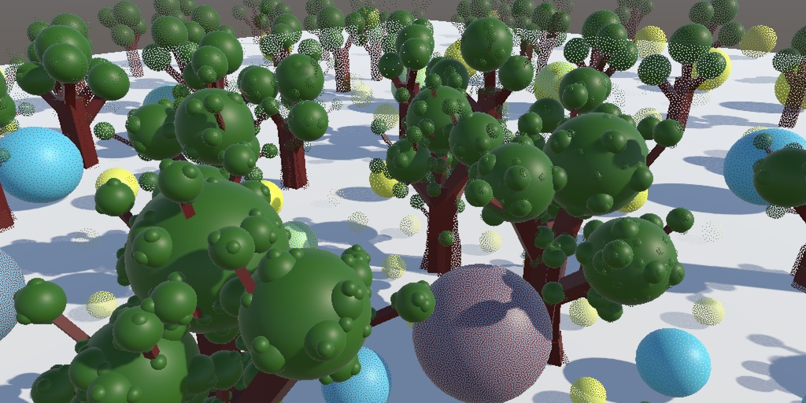

------

## 1 剔除细节

理想状态下，我们渲染的东西自然是越少越好。我们渲染的东西越少，GPU的压力也就越小，这样我们就可以用更高的帧率和更低的能耗去渲染场景。如果一些东西小到几乎看不见（比一个像素还小），那么我们在渲染时可以干脆跳过它们。除此之外，对于一些可见但是很难引起我们注意的地方，我们也可以统统跳过。所以我们希望能够灵活控制场景中物体的细节层次。

### 1.1 LOD组

创建一个LOD物体的典型方法就是使用一个带有多个子物体的根物体，每个物体表示不同的细节层次。细节最多（完全可见）的层次称为LOD0。我们创建一个预制体来演示，这个预制体把一个球体作为子物体。我们给预制体使用自己的材质，在添加脚本`**InstancedMaterialProperties**` 来设置一个鲜亮的颜色，比如红色。

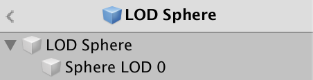
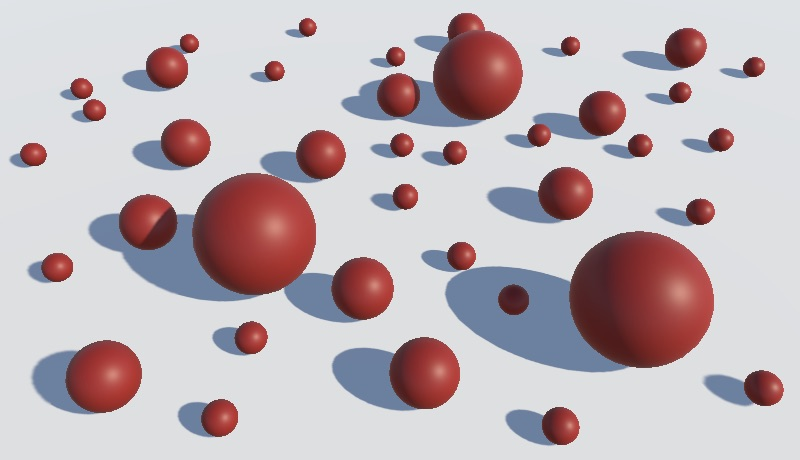一个摆满了大大小小各种LOD球的场景

通过在游戏物体的根节点上添加LOD  Group脚本来控制游戏物体细节层次的变化。默认是分为三层LOD。显示的百分比对应每个物体可能的尺寸，它表示的是物体占当前整个视口的多少比例，如果占比大于60%我们就是使用LOD0来渲染。不然就按实际情况挑选更低的LOD层次，如果低于10%,我们在渲染时将忽略这个物体。将子球体拖到LOD0的框中，这个球体就会在LOD0级别下被渲染。

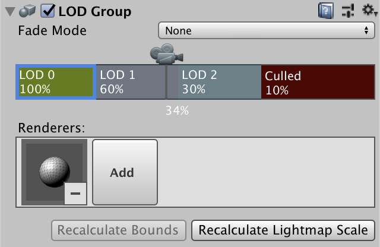

通过拖拽可以调整每一层的阈值，右键可以添加和删除层级。我们现在只用到了一个LOD层级，所以把另外两个删掉。这样除非球体的可见大小小于10%,否则球体会一直被渲染。至少在没有LOD  bias的情况下是这样的。LOD bias是一个全局属性，用于调整所有的LOD阈值。我们可以代码也可以通过project  setting的Quality面板来修改。所有物体的可视大小最后都会乘以这个系数，比如说设为1.5，但是实际上球体只有在低于6.7%（10/1.5）的情况下才会被剔除。LOD group的检视面板也会提醒我们物体会受到LOD bias的影响。

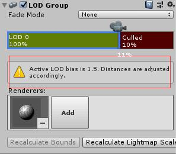

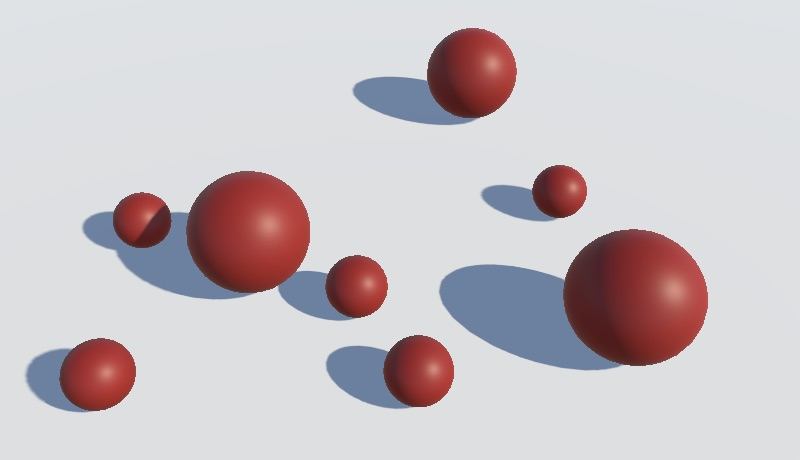

### 1.2 多个LOD层级

一个物体通常会有多个LOD层次，每一层都会使用比上一层更精简的网格。为了清楚的观察LOD层次之间切换，我们再使用两个不同颜色的球作为LOD1和LOD2。将球添加到LODGroup，两个层次的阈值分别设为15%和10%,把完全剔除的条件降低至5%。

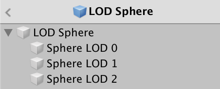
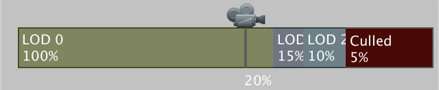
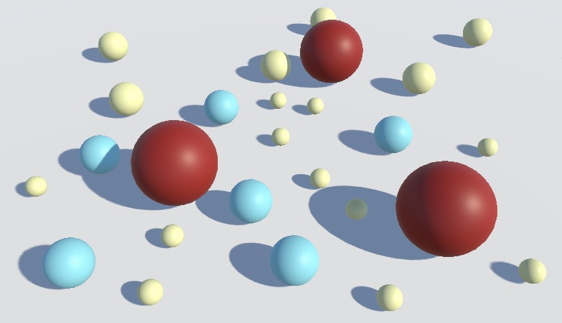三层LOD的球

通过移动摄像机或者调整LOD bias，你就会发现多层LOD带来的变化。

> ### LOD Group可以使用光照贴图吗？
>
> 可以，当你将一个LOD group标记为静态物体，它仍会在不同的层次之间切换，所以在渲染时他不会被绑定到静态批次中。但是在烘焙时，Unity会选择LOD0层次的网格加入光照贴图的计算。除此之外，其他层次的网格也可以正常的获取烘焙光源（用LOD0的光照贴图）。至少在使用progressive  lightmapper  来烘焙光照贴图的时候是这样的，如果你用的是Enlighten，那么对于其他的LOD层次可能会有点麻烦，要用到光照探针。同样，烘焙动态全局光照的也只有LOD0，所以如果动态GI对你重要，你需要确保其他的LOD层次不是静态的，这样他们至少还可以通过光照探针来获取GI。

### 1.3 补充细节的LOD

另一种创建LOD组的方式是在基本形的基础了不断的添加细节。举个例子，我们可以创建一个有方块和球组成的树。将树的主干部分添加到三个层次中，小一点的分支和叶子值则只添加到前两个层次中，而最小的叶子和树枝只有LOD0有。

 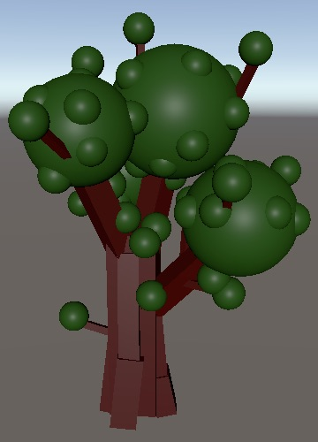 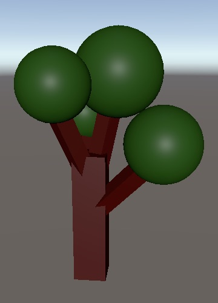LOD0、1、2

这样的物体同样是有由个子物体构成，然后再LODGroup的设置中，有些物体可能存在于多个LOD层次中（这样将父级拖进去，子级自然也就包括在内了）。

------

## 2 LOD混合

当一个物体在不同的LOD层次间变化是，渲染的内容会突然改变或者消失。这会造成视觉上的不连续。所以我们需要通过混合相邻LOD层次的内容，把过渡变的缓和，让人能够接受。

### 2.1 Cross-Fading

每个LOD组可以独立的设置混合模式，每个LOD层级之间也可以独立的调节相关属性。首先，将我们的LOD组设为Cross Fade模式。选择这个模式后会出现一个*Animate Cross-fading*选项，可以选择让渐变是基于时间还是百分比进行变化。如果开启，那么如果LOD发生改变，渲染就会基于时间进行渐变，这个渐变会持续很短的一个时间，但是即使物体的可视大小不再变化，他还是继续进行，直到渐变结束。具体的渐变时间我们可以通过`LODGroup.crossFadeAnimationDuration`来设置，默认是0.5秒。如果关闭这个选项，我们渐变就是基于可视百分比进行变化，我们可以通过*Fade Transition Width*滑动条来独立设置每个LOD层级的渐变范围。如果设为1，过渡将存在于当前LOD范围的整个过程，它的效果是最平缓的。但是最好不要这么做，因为在过渡阶段，这一层和上一层的LOD两者都会被渲染，性能消耗会更大。

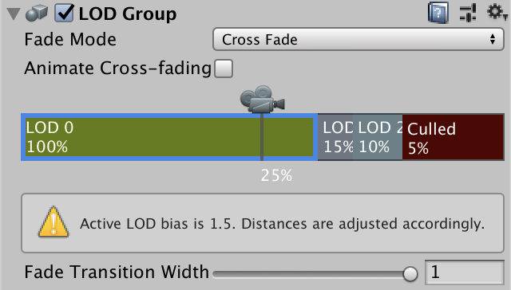

> ### *Speed Tree fade 这个模式什么？*
>
> 这个模式是针对SpeedTree类型（是一种资源，可以自行百度）的树的，他有自己的一套LOD系统，会在3D模型和2D平面之间切换。

如果使用cross-fading，Unity会从着色器变种中选择带有 *LOD_FADE_CROSSFADE*关键字的，为此在我的shader的常规pass里添加对应的多重编译指令。

```
			#pragma multi_compile _ LOD_FADE_CROSSFADE
```

为了检查是否真的有用，如果有这个关键字，我们让在Lit.hlsl中的片元函数直接返回0（如果发现消失了 试试返回(0,0,0,1)）。

```
float4 LitPassFragment (	VertexOutput input, FRONT_FACE_TYPE isFrontFace : FRONT_FACE_SEMANTIC) : SV_TARGET {	UNITY_SETUP_INSTANCE_ID(input);		#if defined(LOD_FADE_CROSSFADE)		return 0;	#endif		…}
```

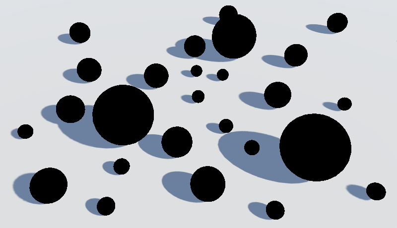

如果把所有LOD层次的渐变范围都设为1(使用的是基于百分比的渐变)，你会发现每个球都变成了黑色，除了那些显示大小比我们窗口还大的（>100%）。而如果你的LOD物体使用的是逐层添加细节的方式，那么相同的设置下，只有部分是黑的，因为渐变只会涉及两个LOD层，所以最底下的那层可以正常的渲染。


物体的渐变程度我们可以通过`unity_LODFade`的第一个分量获取，它属于`UnityPerDraw` 缓冲区的一部分。

```
CBUFFER_START(UnityPerDraw)	float4x4 unity_ObjectToWorld, unity_WorldToObject;	float4 unity_LODFade;	…CBUFFER_END
```

将它最为返回值返回我们就可以看到混合因子的变化，虽然由于overdraw，我们只能看到两个混合因子中的其中一个。（除非是从最低的LOD层次到剔除层次的过渡，那就不会产生overdraw，我们能看到的就是那个唯一的混合因子）

```
	#if defined(LOD_FADE_CROSSFADE)		return unity_LODFade.x;	#endif
```

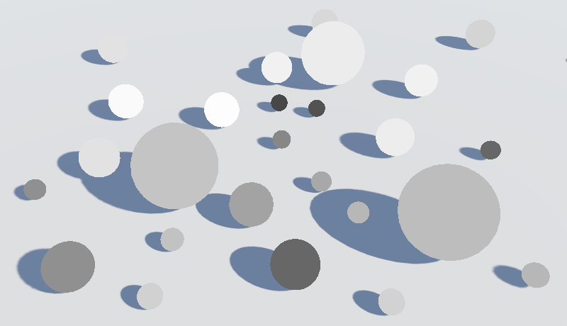

### 2.2 屏幕空间位置

对于透明物体，我们可以通过shader的混合模式来实现淡入淡出，但是对于不透明的物体，这种方法行不通。所以我们选择基于混合因子裁去整个物体一定比例的片元。这种方法既可以用于透明物体，也可以用于不透明物体。但是对于同一个物体的片元而言，它们的混合因子是相同的，如果我们再用统一的阈值去比较大小做裁剪，那么整个物体的所有片元要么一块被裁减，要么都不裁剪，最终效果就还是一起消失一起出现。所以我们要为物体的每个片元设置不同的裁剪阈值。

为每个片元设置不同的阈值，最简单的方式就是利用片元屏幕空间位置。我们可以从添加了VPOS语义的float4类型参数中获得这份信息。出于兼容性的考虑，我们让它作为片元函数的第一个参数。为了便于观察，在cross-fading模式下，我们直接返回这个位置信息。

```
float4 LitPassFragment (	float4 screenPos : VPOS,	VertexOutput input, FRONT_FACE_TYPE isFrontFace : FRONT_FACE_SEMANTIC) : SV_TARGET {	UNITY_SETUP_INSTANCE_ID(input);		#if defined(LOD_FADE_CROSSFADE)		return screenPos;	#endif		…}
```

但我们不能直接就这么写了，因为VPOS语义和SV_POSITION是冲突的。我们要避免一起使用它们。所以我们只能把clipPos从VertexOutput结构体中移除。

```
struct VertexOutput {	//float4 clipPos : SV_POSITION;	…};
```

然后，将它作为LitPassVertex的输出参数。因为这个值我们在`LitPassFragment其实是用不到的，这个值主要传给GPU用的。`

```
VertexOutput LitPassVertex (VertexInput input, out float4 clipPos : SV_POSITION) {	VertexOutput output;	UNITY_SETUP_INSTANCE_ID(input);	UNITY_TRANSFER_INSTANCE_ID(input, output);	float4 worldPos = mul(UNITY_MATRIX_M, float4(input.pos.xyz, 1.0));	clipPos = mul(unity_MatrixVP, worldPos);	…}
```

裁减空间位置和屏幕空间位置的不同点在于后者的xy坐标表示的是片元的序号，所以看起来会都是白色（都超过了1），为了得到相对合理的结果，我们需要对屏幕空间位置用一定值取模，然后再除以同一个值，这里我们就使用64好了。

```
	#if defined(LOD_FADE_CROSSFADE)		return float4((screenPos.xy % 64) / 64, 0, 0);	#endif
```

> PS: 可能是我自己的问题，我把SV_Position分开，在代码里使用VPOS语义后，整个画面都是错误的，包括没有使用LOD的物体，最后我的办法是直接使用clippos的xy坐标，效果是一样的。https://blog.csdn.net/h5502637/article/details/86743786


结果就是我们得到了红绿相间的一个个方格，每个方格为64x64像素。方块大小是基于屏幕的，所以无论球的大小怎么变，这个图案是固定的。我们就可以利用这个坐标进行屏幕空间的纹理采样。

### 2.3 裁剪

我们把LOD cross-fading的裁减单独写成一个方法。裁剪的方法和透明度裁剪类似，只不过这次的阈值改为渐变因子-偏移值。我们根据屏幕空间的y坐标，让偏移值每隔16像素在0-1之间重复，来看看效果。

```
void LODCrossFadeClip (float4 screenPos) {	float lodClipBias = (screenPos.y % 16) / 16;	clip(unity_LODFade.x - lodClipBias);} float4 LitPassFragment (	float4 screenPos : VPOS,	VertexOutput input, FRONT_FACE_TYPE isFrontFace : FRONT_FACE_SEMANTIC) : SV_TARGET {	UNITY_SETUP_INSTANCE_ID(input);		#if defined(LOD_FADE_CROSSFADE)		//return float4((screenPos.xy % 64) / 64, 0, 0);		LODCrossFadeClip(screenPos);	#endif		…}
```


最终球体被裁剪成水平的一条条线。部分球体还能同时看到两个LOD层次。但是球体的一部分消失了，这是因为在同一个片元位置当一个LOD层次裁减时，另一个应该不做裁减，但是现在它们各自独立的进行裁剪。所以我们让两者的偏移值相互对称，我们需要在混合因子低于0.5时翻转偏移值（因为两个混合因子是对称的，一个>0.5另一个就<0.5，我们让我们的偏移值也一样）。

```
	float lodClipBias = (screenPos.y % 16) / 16;	if (unity_LODFade.x < 0.5) {		lodClipBias = 1.0 - lodClipBias;	}	clip(unity_LODFade.x - lodClipBias);
```


翻转偏移值的缺点是一旦渐变过程超过中间点，会有很突然的视觉变化（比如一个球一开始是红蓝红蓝红，渐变到一半后会突然变成蓝红蓝红蓝）。这还会导致在空间上分离在视觉上重叠的两个物体，由于开始渐变的时间不一致（一个球<0.5,一个球>0.5，然后他们就互相补充了），从而出现了交叉的情况。如下图所示，两个物体明明在慢慢变透明，但是他们相交的部分却始终是不透明的。


我们无法避免这个问题，除非Unity可以为我们提供额外的数据来告诉我们当前处理的是哪个LOD层次。这样我们就可以一直翻转同一边，而不是超过一半后就换一边翻转。还有一种方法就是其中一个渐变因子一直为负，希望在Unity2019的未来版本可以做到这一点。

### 2.4 抖动（Dithering）

为偏移使用一个明显的图案显然不是什么好主意，所以我们改为使用一个平均的噪声[贴图](https://catlikecoding.com/unity/tutorials/scriptable-render-pipeline/level-of-detail/lod-blending/dither-pattern.png)来执行抖动。

64x64的蓝噪声

> ### 你是从哪里得到这张贴图的？
>
> 这张贴图来自于 Christoph Peters，从他的[博客](http://momentsingraphics.de/?p=127)中可获取更多的细节

这张贴图的四个通道保存的是相同的数据，所以导入时把它设为不压缩的单通道贴图，使用alpha通道。我们还需要把filtermode 设为 point，因为我们我们希望的到真实的像素值，而不是插值后的结果。 同样我们也不需要mipmap。

贴图的导入设置

 

在MyPipelineAsset中添加一个贴图字段，这样我们就可以自由的设置我们的抖动图案。

```
	[SerializeField]	Texture2D ditherTexture = null;
```


然后通过构造方法传入MyPipeline。

```
		return new MyPipeline(			dynamicBatching, instancing,			ditherTexture,			(int)shadowMapSize, shadowDistance, shadowFadeRange,			(int)shadowCascades, shadowCascadeSplit		);
```

在MyPipeline中保存好我们的贴图。

```
	Texture2D ditherTexture; 	public MyPipeline (		bool dynamicBatching, bool instancing,		Texture2D ditherTexture,		int shadowMapSize, float shadowDistance, float shadowFadeRange,		int shadowCascades, Vector3 shadowCascasdeSplit	) {		… 		this.ditherTexture = ditherTexture; 		this.shadowMapSize = shadowMapSize;		…	}
```

我们在要渲染前先配置好抖动图案。除了设置贴图，我们还需要设置一个全局的缩放数据。我们假设使用的是64x64的贴图，那么UV缩放应该是1/64。我们使用camerabuffer执行这些命令。

```
	static int ditherTextureId = Shader.PropertyToID("_DitherTexture");	static int ditherTextureSTId = Shader.PropertyToID("_DitherTexture_ST"); 	… 	public override void Render (		ScriptableRenderContext renderContext, Camera[] cameras	) {		base.Render(renderContext, cameras); 		ConfigureDitherPattern(renderContext); 		foreach (var camera in cameras) {			Render(renderContext, camera);		}	}		void ConfigureDitherPattern (ScriptableRenderContext context) {		cameraBuffer.SetGlobalTexture(ditherTextureId, ditherTexture);		cameraBuffer.SetGlobalVector(			ditherTextureSTId, new Vector4(1f / 64f, 1f / 64f, 0f, 0f)		);		context.ExecuteCommandBuffer(cameraBuffer);		cameraBuffer.Clear();	}
```

在shader这里，我们在UnityPerBuffer中添加缩放值。定义好贴图和采样器状态，用屏幕空间对贴图进行采样，将采样值作为偏移值用于渐变的裁减。

```
CBUFFER_START(UnityPerFrame)	float4x4 unity_MatrixVP;	float4 _DitherTexture_ST;CBUFFER_END … TEXTURE2D(_DitherTexture);SAMPLER(sampler_DitherTexture); … void LODCrossFadeClip (float4 screenPos) {	float2 ditherUV = TRANSFORM_TEX(screenPos.xy, _DitherTexture);	float lodClipBias =		SAMPLE_TEXTURE2D(_DitherTexture, sampler_DitherTexture, ditherUV).a;	if (unity_LODFade.x < 0.5) {		lodClipBias = 1.0 - lodClipBias;	}	clip(unity_LODFade.x - lodClipBias);}
```


因为抖动图案的采样依据的是屏幕分辨率，所以在高分辨率的显示器或截图中可能很难看仔细，你可以把Unity 的Game视图放大来进行观察。

放大四倍

> ### 为什幺要用贴图而不用`LODDitheringTransition`？
>
> 在 Core library中存在一个`LODDitheringTransition`方法。它基于一个三维的种子值和渐变因子进行裁剪。它会使用种子生成一个哈希值用于裁剪。虽然可以使用这种方法，但是我发现它执行起来不是很可靠，它可能会产生像素级的空洞，而且在某些情况下不是很稳定，比如说Metal的API下。HDRP渲染管线使用的种子是视野方向，它的精度问题可能还会恶化这种情况，但是就算把种子改成屏幕空间位置，也解决不了这些麻烦。所以这么看过来，反而还是屏幕空间的贴图效果比较稳定。

### 2.5 渐变阴影

这种技术同样可以用于阴影。LOD会在相机进行剔除是选择具体的层级，所以每个LOD物体的阴影都会和他当前的LOD层级相匹配。首先，我们同样为shadow caster pass添加LOD的多重编译指令。

```
			#pragma shader_feature _CLIPPING_OFF						#pragma multi_compile _ LOD_FADE_CROSSFADE
```

在 *ShadowCaster.hlsl*中添加相应的数据。

```
CBUFFER_START(UnityPerFrame)	float4x4 unity_MatrixVP;	float4 _DitherTexture_ST;CBUFFER_END CBUFFER_START(UnityPerDraw)	float4x4 unity_ObjectToWorld;	float4 unity_LODFade;CBUFFER_END … TEXTURE2D(_DitherTexture);SAMPLER(sampler_DitherTexture);
```

调整`ShadowCasterPassVertex` ，单独输出裁减空间位置。

```
struct VertexOutput {	//float4 clipPos : SV_POSITION;	float2 uv : TEXCOORD0;	UNITY_VERTEX_INPUT_INSTANCE_ID}; VertexOutput ShadowCasterPassVertex (	VertexInput input, out float4 clipPos : SV_POSITION) {	…	clipPos = mul(unity_MatrixVP, worldPos);		#if UNITY_REVERSED_Z		clipPos.z -= _ShadowBias;		clipPos.z =			min(clipPos.z, clipPos.w * UNITY_NEAR_CLIP_VALUE);	#else		clipPos.z += _ShadowBias;		clipPos.z =			max(clipPos.z, clipPos.w * UNITY_NEAR_CLIP_VALUE);	#endif		output.uv = TRANSFORM_TEX(input.uv, _MainTex);	return output;}
```

最后，复制`LODCrossFadeClip` ,在`ShadowCasterPassFragment`里选择合适的时机调用。

```
void LODCrossFadeClip (float4 screenPos) {	…} float4 ShadowCasterPassFragment (	float4 screenPos : VPOS, VertexOutput input) : SV_TARGET {	UNITY_SETUP_INSTANCE_ID(input);		#if defined(LOD_FADE_CROSSFADE)		LODCrossFadeClip(screenPos);	#endif		…}
```


阴影的抖动是和阴影相机对齐的，因此用于直射光阴影的抖动图案移动起来和普通相机的抖动不太一样。用于聚光灯阴影的图案只会在聚光灯移动和转向时发生变化。由于阴影滤波的缘故，这个图案会很模糊。

### 2.6 动态的抖动图案

在我们的场景中，因为高对比度和大范围的渐变过程，使我们的抖动图案非常的明显。总的来说在场景中使用更低的对比度和更小的渐变范围可以让我们的抖动更不易察觉。如果抖动太过于明显，在部分场景移动时，由于抖动图案是固定的，这会让我们在游玩时难以集中注意。所以我们可以尝试动态变化这个抖动图案来混淆这个情况，随时间对图案进行扰乱，来使他变成不易察觉的噪声。

让抖动图案动态变化最直接的方式就是每帧使用不同的图案。但是在帧数不稳定的情况下，这种方法会产生闪烁的感觉，特别是在关闭垂直同步的高帧率情况下。我们可以通过使用固定的变化速率来缓解这种问题。在MyPipelineAsset中添加一个滑杆选项，范围在0到120之间，默认是每秒30帧。为了便于观察，我们可以把它调的低一点。

```
	[SerializeField, Range(0f, 120f)]	float ditherAnimationSpeed = 30f;
```


在构造函数中传入这个速率。

```
		return new MyPipeline(			dynamicBatching, instancing,			ditherTexture, ditherAnimationSpeed,			(int)shadowMapSize, shadowDistance, shadowFadeRange,			(int)shadowCascades, shadowCascadeSplit		);
```

在MyPipeline我们不要直接保存它，保存的是它的倒数，也就是每一帧的时间，在构造函数中设置值，如果速率是0，那就每帧时间也改成0,。这样如果我们不想要这种效果或者想要看实际的结果，可以通过设为0来关闭动态抖动。在进行图像比较时会很有用。

```
	float ditherAnimationFrameDuration; 	public MyPipeline (		bool dynamicBatching, bool instancing,		Texture2D ditherTexture, float ditherAnimationSpeed,		int shadowMapSize, float shadowDistance, float shadowFadeRange,		int shadowCascades, Vector3 shadowCascasdeSplit	) {		… 		this.ditherTexture = ditherTexture;		if (ditherAnimationSpeed > 0f) {			ConfigureDitherAnimation(ditherAnimationSpeed);		} 		…	}		void ConfigureDitherAnimation (float ditherAnimationSpeed) {		ditherAnimationFrameDuration = 1f / ditherAnimationSpeed;	}
```

我们可以使用更多的贴图循环切换来创造动态的抖动图案。但是我们只打算用一张贴图进行多种缩放来代替。这样虽然不能产生高质量的动画，但是也足够满足我们的需求了。所以如果速率为正数，我们填充一个16元素的数组用于表示每帧不同的图案。

我们通过每帧水平翻转一次，每两帧垂直翻转一次来实现不同的图案。接着我们再每4帧水平偏移一半，每8帧垂直偏移一半。

```
	Vector4[] ditherSTs; 	… 	void ConfigureDitherAnimation (float ditherAnimationSpeed) {		ditherAnimationFrameDuration = 1f / ditherAnimationSpeed;		ditherSTs = new Vector4[16];		for (int i = 0; i < ditherSTs.Length; i++) {			ditherSTs[i] = new Vector4(				(i & 1) == 0 ? (1f / 64f) : (-1f / 64f),				(i & 2) == 0 ? (1f / 64f) : (-1f / 64f),				(i & 4) == 0 ? 0f : 0.5f,				(i & 8) == 0 ? 0f : 0.5f			);		}	}
```

虽然我们有16个不同的配置参数，但是这种调整是规则的有很多对称的地方。我们通过改为每帧随机偏移来打断这种规则性。为了确保同一帧内的结果相同，我们要先初始化随机状态，同一用0作为种子。在最后，我们把原来的随机状态设置回来，避免我们的渲染管线影响游戏其他地方的随机状态。

```
		Random.State state = Random.state;		Random.InitState(0);		for (int i = 0; i < ditherSTs.Length; i++) {			ditherSTs[i] = new Vector4(				(i & 1) == 0 ? (1f / 64f) : (-1f / 64f),				(i & 2) == 0 ? (1f / 64f) : (-1f / 64f),				Random.value, Random.value			);		}		Random.state = state;
```

我没必要让动态抖动和游戏时间同步，所以我们使用未缩放时间。另外，我们不关心动画的时间精确性，只想让不同的图案以大致固定的频率出现，所以即使这一帧的时间很长，我们也只是单纯的切换到下一个图案，没必要跳过部分图案来保持同步。因此我们只需要追踪距离上一次切换图案的时间，如果超过持续时间，就切换至下一个贴图序列。

```
	float lastDitherTime;	int ditherSTIndex = 0;		…		void ConfigureDitherPattern (ScriptableRenderContext context) {		…		if (ditherAnimationFrameDuration > 0f) {			float currentTime = Time.unscaledTime;			if (currentTime - lastDitherTime >= ditherAnimationFrameDuration) {				lastDitherTime = currentTime;				ditherSTIndex = ditherSTIndex < 15 ? ditherSTIndex + 1 : 0;				cameraBuffer.SetGlobalVector(					ditherTextureSTId, ditherSTs[ditherSTIndex]				);			}			context.ExecuteCommandBuffer(cameraBuffer);			cameraBuffer.Clear();		}	}
```

以上操作，我们只需要在间隔时间为正数的情况下执行。此外贴图我们只需要传一次即可，所以我们可以一开始把序列设为-1，并且基于此做判断。

```
	int ditherSTIndex = -1;		…		void ConfigureDitherPattern (ScriptableRenderContext context) {		if (ditherSTIndex < 0) {			ditherSTIndex = 0;			lastDitherTime = Time.unscaledTime;			cameraBuffer.SetGlobalTexture(ditherTextureId, ditherTexture);			cameraBuffer.SetGlobalVector(				ditherTextureSTId, new Vector4(1f / 64f, 1f / 64f, 0f, 0f)			);			context.ExecuteCommandBuffer(cameraBuffer);			cameraBuffer.Clear();		}		else if (ditherAnimationFrameDuration > 0f) {			…		}
```

此处应有一张动图.gif

通过使用动态抖动图案和开启LOD组的Cross-fading,我们可以让过渡变得更加平滑，特别是在低对比度的情况下。但是在编辑窗口中，图像只会在有变动时重新渲染一次。图案本来是不动的，一旦我们进行一下操作，图案就会时不时的变一下，这挺烦的，所以干脆让他只能在game模式动算了。我们可以用`Application.isPlaying`来做判断。

```
		if (ditherAnimationSpeed > 0f && Application.isPlaying) {			ConfigureDitherAnimation(ditherAnimationSpeed);		}
```

------

## 3 着色器变种的筛选

添加过多的特性使我们的着色器变得臃肿，导致最后生成大量的着色器变种。我们可以尝试使用shader-feature编译指令，但是这样的话，在发布时只会包含当前使用的材质中开启的关键字。而多重编译指令不会有这种限制。

Unity在发布时会基于场景设置自动帮我们剔除一些关键字，比如*LIGHTMAP_ON*,*DYNAMICLIGHTMAP_ON*,  *INSTANCING_ON*等。但即使这样，在发布时还是会剩下很多我们不会用到的关键字。所以Unity提供了一个方法，允许我们在发布时自己选择跳过部分着色器变种。

### 3.1 Preprocessing Shaders

发布时，Unity编辑器会寻找实现了`IPreprocessShaders`接口的类（定义在`UnityEditor.Build`中）。Unity会为这个类创造一个实例，接着将着色器变种传给它用于剔除。所以我们在Editor文件夹中定义这样一个类。

```
using UnityEditor.Build; public class MyPipelineShaderPreprocessor : IPreprocessShaders { }
```

这个接口要求我们实现两件事，首先是一个叫做callbackOrder的只读属性，它返回一个整型，表示该预处理的调用序号，以防存在多个实现该接口的类，而调用顺序不确定。我们返回0就可以了。

```
	public int callbackOrder {		get {			return 0;		}	}
```

然后是方法，它传入shader、  ShaderSnippetData、和一列表的shadercompilerData，其中包含了着色器变种的设置，我们先打印一下看看着色器的名字。

```
using System.Collections.Generic;using UnityEditor.Build;using UnityEditor.Rendering;using UnityEngine; public class MyPipelineShaderPreprocessor : IPreprocessShaders { 	… 	public void OnProcessShader (		Shader shader, ShaderSnippetData snippet, IList<ShaderCompilerData> data	) {		Debug.Log(shader.name);	}}
```

现在如果我们发布项目就看到一大串的着色器名字被打印出来。有些是我们自己的shader，有些则是默认的着色器，你可以在project  settings的Graphic面板里对这些进行管理。另外还有许多的重复，那是因为编译程序分离了shader变种，但是我们不需要担心他的实际顺序和分组。

### 3.2 只在自己的pipeline下处理

发布时，所有定义的预处理程序都会被调用。所以我们前面在项目中写的预处理总是会被调用，即使项目并没有使用我们的pipeline。为了防止干涉其他的pipeline，我们需要判断当前使用的pipeline是否是我们自己写的。我们可以通过`GraphicsSettings.renderPipelineAsset`来获取当前的pipeline，然后来判断它是不是`**MyPipelineAsset**`类型的。

```
…using UnityEngine.Rendering; public class MyPipelineShaderPreprocessor : IPreprocessShaders {		… 	public void OnProcessShader (		Shader shader, ShaderSnippetData snippet, IList…ShaderCompilerData> data	) {		if (!(GraphicsSettings.renderPipelineAsset is MyPipelineAsset)) {			return;		}		Debug.Log(shader.name);	}}
```

可以得到pipeline asset在之后会很有用，所以我们添加一个字段，在构造函数中获取并保存。

```
	MyPipelineAsset pipelineAsset; 	public MyPipelineShaderPreprocessor () {		pipelineAsset = GraphicsSettings.renderPipelineAsset as MyPipelineAsset;	} 	public void OnProcessShader (		Shader shader, ShaderSnippetData snippet, IList…ShaderCompilerData> data	) {		if (pipelineAsset == null) {			return;		}		Debug.Log(shader.name);	}
```

### 3.3 着色器变种的数量

在我们开始剔除变种之前，先要知道总共有多少个。shader compiler data列表中的每一个元素都代表着一个变种，所以计算所有调用的总和。

```
	int shaderVariantCount; 	… 	public void OnProcessShader (		Shader shader, ShaderSnippetData snippet, IList<ShaderCompilerData> data	) {		…		//Debug.Log(shader.name);		shaderVariantCount += data.Count;	}
```

为了在每次发布后打印一次结果，我们添加一个有`PostProcessBuild`特性（位于`UnityEditor.Callbacks`）的方法。他需要传入回调顺序，我们同样设为0.这个方法必须有一个`UnityEditor.BuildTarget`参数，以及一个表示发布路径的字符串。Unity会在发布完成后调用所有这样的方法。

```
using System.Collections.Generic;using UnityEditor;using UnityEditor.Build;using UnityEditor.Callbacks;… public class MyPipelineShaderPreprocessor : IPreprocessShaders { 	… 	[PostProcessBuild(0)]	void LogVariantCount (BuildTarget target, string path) {		if (pipelineAsset == null) {			return;		}		Debug.Log("Included " + shaderVariantCount + " shader variants.");	}}
```

这个方法需要是静态的，为了得到着色器变种的数量，我们需要添加一个该预处理类的静态实例，然后再调用它的计数方法。

```
	static MyPipelineShaderPreprocessor instance; 	… 	public MyPipelineShaderPreprocessor () {		instance = this;		pipelineAsset = GraphicsSettings.renderPipelineAsset as MyPipelineAsset;	} 	… 	[PostProcessBuild(0)]	static void LogVariantCount (BuildTarget target, string path) {		instance.LogVariantCount();		instance = null;	} 	void LogVariantCount () {		if (pipelineAsset == null) {			return;		}		Debug.Log("Included " + shaderVariantCount + " shader variants.");	}
```

我先我们就可以知道发布时会有多少个着色器变种了。数量取决于场景中包含了哪一些。在我的例子里，在成功发布之后我得到的是“*Included 3054 shader variants*”。

### 3.4 剔除级联阴影

级联阴影就是一个我们可以剔除着色器变种的地方。如果我们的pipeline asset把级联阴影设为Zero，那么我们在发布时就没必要包括级联阴影的着色器变种。

首先我们需要确认是否开启了级联阴影，所以我们在`**MyPipelineAsset**` 添加一个公有属性，如果级联阴影不是zero就返回true。

```
	public bool HasShadowCascades {		get {			return shadowCascades != ShadowCascades.Zero;		}	}
```

预处理方法通过这个属性来决定是否剔除级联阴影的shader变种。在构造方法中记录这个判断。

```
	bool stripCascadedShadows; 	public MyPipelineShaderPreprocessor () {		instance = this;		pipelineAsset = GraphicsSettings.renderPipelineAsset as MyPipelineAsset;		if (pipelineAsset == null) {			return;		}		stripCascadedShadows = !pipelineAsset.HasShadowCascades;	}
```

检查一个shader变种是否包含了某个关键字，我们需要用到`ShaderKeyword` 结构体，为两个级联阴影的关键字创建并存储在静态字段中。

```
	static ShaderKeyword cascadedShadowsHardKeyword =		new ShaderKeyword("_CASCADED_SHADOWS_HARD");	static ShaderKeyword cascadedShadowsSoftKeyword =		new ShaderKeyword("_CASCADED_SHADOWS_SOFT");
```

接着创建一个Strip方法，输入compiler data，返回是否要剔除该变种。只要关闭了级联阴影并且当前着色器变种包含两个关键字中的一个时才需要剔除。我们可以通过调用`IsEnabled` 来判断是否包含了某一关键字。

```
	bool Strip (ShaderCompilerData data) {		return			stripCascadedShadows && (				data.shaderKeywordSet.IsEnabled(cascadedShadowsHardKeyword) ||				data.shaderKeywordSet.IsEnabled(cascadedShadowsSoftKeyword)			);	}
```

在`OnProcessShader` 中遍历列表的所有数据，如果需要剔除就将该数据从列表中移除。我们在加好总数之后在执行该操作，方便我们记录未剔除前的数量。

```
	public void OnProcessShader (		Shader shader, ShaderSnippetData snippet, IList<ShaderCompilerData> data	) {		if (pipelineAsset == null) {			return;		}		shaderVariantCount += data.Count;		for (int i = 0; i < data.Count; i++) {			if (Strip(data[i])) {				data.RemoveAt(i--);			}		}	}
```

### 3.5 记录剔除后的变种数量

现在我们在发布时支持了级联阴影变种的剔除，但是目前我们还没有得到任何的反馈。除了感觉发布的时间和发布大小有所降低。为了让我们让我们能够直观的知道剔除后还有多少着色器变种剩余，我们需要记录一共剔除了多少着色器变种。为此添加一个字段，每剔除一次就自增一次。

```
	int shaderVariantCount, strippedCount; 	… 	public void OnProcessShader (		Shader shader, ShaderSnippetData snippet, IList<ShaderCompilerData> data	) {		…		for (int i = 0; i < data.Count; i++) {			if (Strip(data[i])) {				data.RemoveAt(i--);				strippedCount += 1;			}		}	}
```

打印时，我们分别打印剔除前后剔除后的变种数量，然后再显示个降低的百分比。

```
	void LogVariantCount () {		if (pipelineAsset == null) {			return;		}		int finalCount = shaderVariantCount - strippedCount;		int percentage =			Mathf.RoundToInt(100f * finalCount / shaderVariantCount);		Debug.Log(			"Included " + finalCount + " shader variants out of " +			shaderVariantCount + " (" + percentage + "%)."		);	}
```

在我的例子里，如果关闭级联阴影那么结果为 *"Included 1518 shader variants out of 3054 (50%)."，*减少了一半。但是要注意是否会剔除还是取决于你是否关闭了级联阴影。也就是说如果你在场景里并没有使用级联阴影，但你开启了级联阴影，那么变种还是不会被剔除。所以你要确保你的pipeline配置和场景的实际需求的相匹配。

### 3.6 剔除 Cross-Fading

还有一个在发布时可以剔除的地方就是LOD cross-fading.这个特性我们无法直接通过pipeline来控制。只有在LOD组需要的时候才会用到它。但是我们还是在`**MyPipelineAsset**` 中用一个只读属性里表示是否支持。

```
	public bool HasLODCrossFading {		get {			return supportLODCrossFading;		}	} 	… 	[SerializeField]	bool supportLODCrossFading = true;
```


剔除的方法和级联阴影类似，只不多这次判断的是*LOD_FADE_CROSSFADE* 关键字和别的属性。添加相应代码。

```
	static ShaderKeyword lodCrossFadeKeyword =		new ShaderKeyword("LOD_FADE_CROSSFADE"); 	… 	bool stripCascadedShadows, stripLODCrossFading; 	public MyPipelineShaderPreprocessor () {		…		stripCascadedShadows = !pipelineAsset.HasShadowCascades;		stripLODCrossFading = !pipelineAsset.HasLODCrossFading;	} 	… 	bool Strip (ShaderCompilerData data) {		return			stripCascadedShadows && (				data.shaderKeywordSet.IsEnabled(cascadedShadowsHardKeyword) ||				data.shaderKeywordSet.IsEnabled(cascadedShadowsSoftKeyword)			) ||			stripLODCrossFading &&			data.shaderKeywordSet.IsEnabled(lodCrossFadeKeyword);	}
```

在我的例子中，关闭LOD cross-fading后着色器变种降低至1878 (61%)，如果同时关掉级联阴影，最终减低至1110 (36%)。

要注意关闭了LOD cross-fading只会影响发布时shader变种的剔除，但是Cross-fading仍然可能在编辑器中使用，所以只能在你确定没有用到它时你才能把它关闭。

我们还可以根据不同关键字的组合或者不同的pass来进行剔除。但是按需要剔除单个关键字是最简单的，而且效果也足够给力了。

 

 