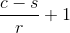
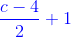
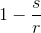

# 可编程渲染管线9 阴影烘焙

原文：https://catlikecoding.com/unity/tutorials/scriptable-render-pipeline/baked-shadows/

- 渐变的实时阴影
- 使用shadowmask和阴影探针
- 为每个物体使用至多四个烘焙阴影
- 常规的shadowmask和 distance shadowmask
- 支持subtractive模式.

这是Unity可编程渲染管线的第九章，我们会讲到实时光照下的阴影烘焙，以及在subtractive lighting模式下，烘焙光照和实时阴影的结合。

本教程基于Unity 2018.3.0f2。


烘焙阴影和实时阴影共存于场景中

## 1 阴影的过渡

实时光照的阴影渲染成本很大，烘焙光照的性能消耗低，但是它不包含镜面反射，也不能再运行时做出变动。所以Unity提供了第三种方案，也就是实时光照和烘焙阴影的结合。不过在某些特殊情况下我们仍会用到实时阴影，所以我们会尝试混合两种阴影类型。烘焙阴影不会受到阴影距离的影响，但是实时阴影会受制于阴影距离，为了让我们的实时阴影不会消失的那么突兀，我们要让实时阴影在靠近阴影距离时有一个淡出的效果


受限于阴影距离的实时阴影，边缘十分明显

### 1.1 淡出范围

淡出阴影最简单的方式就是让片元离相机的距离（深度）减去阴影距离，加1再进行saturate裁剪:saturate(c-s+1)。这样深度<(阴影距离-1)的片元阴影衰减值恒为0，深度>(阴影距离-1)的片元衰减值线性上升，一个单位距离后上升至1（阴影距离）。在这之后衰减值恒为1，实时阴影消失，仅剩烘焙阴影。

我们没必要把渐变区域一直限制在一个单位距离的范围内。我们希望能够使用任意距离的渐变范围，所以公式改为： 


的衰减折线

在`**MyPipelineAsset**`中为阴影渐变范围添加一个配置选项，我们将值限定在0.01-2之间（确保不会太大或为负），默认值设为1.把它作为一个构造参数在阴影距离后面传入。

```
	[SerializeField, Range(0.01f, 2f)]	float shadowFadeRange = 1f; 	… 	protected override IRenderPipeline InternalCreatePipeline () {		Vector3 shadowCascadeSplit = shadowCascades == ShadowCascades.Four ?			fourCascadesSplit : new Vector3(twoCascadesSplit, 0f);		return new MyPipeline(			dynamicBatching, instancing, (int)shadowMapSize,			shadowDistance, shadowFadeRange,			(int)shadowCascades, shadowCascadeSplit		);	}
```

`**MyPipeline**` 不需要计算真正的渐变距离，我们将原先的渐变函数分解为,我们只需要计算好和然后将这两个值传入shader，由shader自己计算深度值，在用这两个值进行一次乘法一次加法的运算得到最终结果。将放在global shadow data的y分量中，把放在z分量中。我们把这个global shadow data独立出来作为一个字段存储，并且在构造函数里就可以直接设置好它的y分量。

```
	Vector4 globalShadowData; 	public MyPipeline (		bool dynamicBatching, bool instancing,		int shadowMapSize, float shadowDistance, float shadowFadeRange,		int shadowCascades, Vector3 shadowCascasdeSplit	) {		…		this.shadowDistance = shadowDistance;		globalShadowData.y = 1f / shadowFadeRange;		…	}
```

设置为1的阴影距离

在Render方法中计算global shadow data的z分量并传入shader。

```
	void Render (ScriptableRenderContext context, Camera camera) {		…		cameraBuffer.SetGlobalVectorArray(			visibleLightSpotDirectionsId, visibleLightSpotDirections		);		globalShadowData.z =			1f - cullingParameters.shadowDistance * globalShadowData.y;		cameraBuffer.SetGlobalVector(globalShadowDataId, globalShadowData);		context.ExecuteCommandBuffer(cameraBuffer);		…	}
```

在`RenderCascadedShadows` 和`RenderShadows`中，除了设置x分量的部分，我们删掉所有设置global shadow data的代码。

```
	void RenderCascadedShadows (ScriptableRenderContext context) {		…		//shadowBuffer.SetGlobalVector(		//	globalShadowDataId, new Vector4(0f, shadowDistance * shadowDistance)		//);		…	} 	void RenderShadows (ScriptableRenderContext context) {		…		float tileScale = 1f / split;		globalShadowData.x = tileScale;		shadowMap = SetShadowRenderTarget();		shadowBuffer.BeginSample("Render Shadows");		//shadowBuffer.SetGlobalVector(		//	globalShadowDataId, new Vector4(		//		tileScale, shadowDistance * shadowDistance		//	)		//);		…	}
```

### 1.2 修正阴影裁剪

我们对 global shadow data的修改使得阴影无法在规定的阴影距离内被裁减（原先设置阴影数据的y分量现在用于设置）。所以我们要把在 *Lit.hlsl*的`DistanceToCameraSqr` 方法换成新的方法，这个新方法会基于global shadow data计算正确的阴影混合因子。

```
//float DistanceToCameraSqr (float3 worldPos) {//	float3 cameraToFragment = worldPos - _WorldSpaceCameraPos;//	return dot(cameraToFragment, cameraToFragment);//} float RealtimeToBakedShadowsInterpolator (float3 worldPos) {	float d = distance(worldPos, _WorldSpaceCameraPos);	return saturate(d * _GlobalShadowData.y + _GlobalShadowData.z);}
```

如果阴影混合因子为1就没有计算实时阴影的必要了，此时我们可以跳过采样阴影的环节。我们为此写一个辅助函数并应用到`ShadowAttenuation` 和`CascadedShadowAttenuation`中。

```
bool SkipRealtimeShadows (float3 worldPos) {	return RealtimeToBakedShadowsInterpolator(worldPos) >= 1.0;} … float ShadowAttenuation (int index, float3 worldPos) {	…	if (		_ShadowData[index].x <= 0 || SkipRealtimeShadows(worldPos)		//DistanceToCameraSqr(worldPos) > _GlobalShadowData.y	) {		return 1.0;	}	…} … float CascadedShadowAttenuation (float3 worldPos) {	…	//if (DistanceToCameraSqr(worldPos) > _GlobalShadowData.y) {	if (SkipRealtimeShadows(worldPos)) {		return 1.0;	}		…}
```

现在阴影又能基于阴影距离裁剪了。

### 1.3 过渡

只有在无法使用烘焙阴影的特殊情况下才会用到过渡实时阴影。我们为这种情况单独创建一个函数，目前我们还没有可用的烘焙阴影，所以暂时只传入实时阴影衰减值和世界坐标位置。我们将不存在的烘焙阴影衰减值设为1.，然后用阴影混合因子在这两者之间插值。

```
float RealtimeToBakedShadowsInterpolator (float3 worldPos) {	float d = distance(worldPos, _WorldSpaceCameraPos);	return saturate(d * _GlobalShadowData.y + _GlobalShadowData.z);} float MixRealtimeAndBakedShadowAttenuation (float realtime, float3 worldPos) {	float t = RealtimeToBakedShadowsInterpolator(worldPos);	float fadedRealtime = lerp(realtime, 1, t);	return fadedRealtime;}
```

因为阴影衰减值不是1就是0，也就是[l](http://developer.download.nvidia.com/cg/lerp.html)erp(0, 1, t)或[l](http://developer.download.nvidia.com/cg/lerp.html)erp(1, 1, t)所以可以用saturate代替插值，这样能提升一点性能。

```
	float fadedRealtime = saturate(realtime + t);
```

把`MainLight` 中的阴影采样移出来，和`GenericLight`一样统一在外部的 `LitPassFragment`中计算好阴影衰减值（包括两种阴影的混合）再作为参数传入。

```
float3 MainLight (LitSurface s, float shadowAttenuation) {	//float shadowAttenuation = CascadedShadowAttenuation(s.position);	…} … float4 LitPassFragment (	VertexOutput input, FRONT_FACE_TYPE isFrontFace : FRONT_FACE_SEMANTIC) : SV_TARGET {	…		float3 color = input.vertexLighting * surface.diffuse;	#if defined(_CASCADED_SHADOWS_HARD) || defined(_CASCADED_SHADOWS_SOFT)		float shadowAttenuation = MixRealtimeAndBakedShadowAttenuation(			CascadedShadowAttenuation(surface.position), surface.position		);		color += MainLight(surface, shadowAttenuation); 	#endif		for (int i = 0; i < min(unity_LightIndicesOffsetAndCount.y, 4); i++) {		int lightIndex = unity_4LightIndices0[i];		//float shadowAttenuation = ShadowAttenuation(lightIndex, input.worldPos);		float shadowAttenuation = MixRealtimeAndBakedShadowAttenuation(			ShadowAttenuation(lightIndex, surface.position), surface.position		);		color += GenericLight(lightIndex, surface, shadowAttenuation);	}		…}
```

实时阴影的过渡效果

## 2 Shadowmask

要想烘焙阴影，我们要把Unity的混合光照模式设为*Shadowmask*。为了更好的观察阴影，我们关闭实时全局光照。我们先完成对单个主要直射光的支持，将这个光源设为*Mixed* 模式。


shadowmask 细分为两种模式，标准的*Shadowmask* 和*Distance Shadowmask*。目前我们使用标准模式，这两个模式的切换选项可以在 project settings下的quality setting中的找到。


在右上角的下拉菜单中选择 *Baked Shadowmask*可以观察烘焙好的阴影贴图（是点OpenPreview后跳出的光照贴图预览窗口的右上角可以切换不同的贴图，我找了半天 - -）。当只有一个直射光时，贴图是红黑色的，红色部分表示没有阴影的区域，因为阴影衰减值存储在了贴图红色通道中。除了一样贴图之外，Unity还在常规的光照贴图中烘焙了对应的间接光照，这和*Baked Indirect*的混合光照模式是一样的。


现在静态阴影已经烘焙好了，静态物体不会再在实时阴影贴图中重复渲染。因为我们的shader还没有使用烘焙阴影，所有静态物体的阴影直接消失了。

没有静态阴影，只有实时阴影

### 2.1 追踪Shadowmask状态

在使用烘焙阴影前，我们要确定是否有这个贴图。是否有shadowmask取决于每个光源的设置。我们必须在 `**MyPipeline**.ConfigureLights`中进行检查，如果shadow mask存在，我们就开启*_SHADOWMASK* 的着色器关键字。

```
	const string shadowmaskKeyword = "_SHADOWMASK";		…		void ConfigureLights () {		mainLightExists = false;		bool shadowmaskExists = false;		shadowTileCount = 0;		for (int i = 0; i < cull.visibleLights.Count; i++) {			…		}				CoreUtils.SetKeyword(cameraBuffer, shadowmaskKeyword, shadowmaskExists); 		…	}
```

对于每一个可见光，我们可以从光源对象中提取烘焙输出数据来检查它的烘焙方式。如果烘焙类型是mixed，而且我们的混合烘焙模式是shadowmask，那么就存在一张shadowmask贴图。

```
		for (int i = 0; i < cull.visibleLights.Count; i++) {			if (i == maxVisibleLights) {				break;			}			VisibleLight light = cull.visibleLights[i];			visibleLightColors[i] = light.finalColor;			Vector4 attenuation = Vector4.zero;			attenuation.w = 1f;			Vector4 shadow = Vector4.zero;			LightBakingOutput baking = light.light.bakingOutput;			if (baking.lightmapBakeType == LightmapBakeType.Mixed) {				shadowmaskExists |=					baking.mixedLightingMode == MixedLightingMode.Shadowmask;			}						…		}
```

在着色器中添加对应的多重编译指令。 

```
			#pragma multi_compile _ DYNAMICLIGHTMAP_ON			#pragma multi_compile _ _SHADOWMASK
```

### 2.2 采样烘焙阴影

shadow mask可以通过`unity_ShadowMask` 访问到贴图和对应的采样器状态。把这些添加到*Lit.hlsl*。

```
TEXTURE2D(unity_ShadowMask);SAMPLER(samplerunity_ShadowMask);
```

shadowmask使用和光照贴图相同的纹理坐标。像`GlobalIllumination` 一样创建一个方法用于获取烘焙阴影，传入input和surface。我们现在虽然用不到位置信息，但之后就会用到。默认返回1，表示无烘焙阴影。#else里需要做什么取决于我们渲染的是静态物体还是动态物体（后面会提到，就是动态物体是通过光照探针获取烘焙阴影）。返回值应该是float4类型，因为shadowmask最多可以采样四个光源的阴影衰减值。

```
float3 GlobalIllumination (VertexOutput input, LitSurface surface) {	…} float4 BakedShadows (VertexOutput input, LitSurface surface) {	#if defined(LIGHTMAP_ON)	#else	#endif	return 1.0;}
```

如果渲染的片元属于静态物体而且有shadowmask，我们就采样并将其作为结果返回。

```
	#if defined(LIGHTMAP_ON)		#if defined(_SHADOWMASK)			return SAMPLE_TEXTURE2D(				unity_ShadowMask, samplerunity_ShadowMask, input.lightmapUV			);		#endif	#else
```

在`LitPassFragment` 中获取烘焙阴影，然后将值作为继实时阴影后的参数传入两个`MixRealtimeAndBakedShadowAttenuation`中。

```
float4 LitPassFragment (	VertexOutput input, FRONT_FACE_TYPE isFrontFace : FRONT_FACE_SEMANTIC) : SV_TARGET {	…			float4 bakedShadows = BakedShadows(input, surface);		float3 color = input.vertexLighting * surface.diffuse;	#if defined(_CASCADED_SHADOWS_HARD) || defined(_CASCADED_SHADOWS_SOFT)		float shadowAttenuation = MixRealtimeAndBakedShadowAttenuation(			CascadedShadowAttenuation(surface.position), bakedShadows,			surface.position		);		color += MainLight(surface, shadowAttenuation);	#endif		for (int i = 0; i < min(unity_LightIndicesOffsetAndCount.y, 4); i++) {		int lightIndex = unity_4LightIndices0[i];		float shadowAttenuation = MixRealtimeAndBakedShadowAttenuation(			ShadowAttenuation(lightIndex, surface.position), bakedShadows,			surface.position		);		color += GenericLight(lightIndex, surface, shadowAttenuation);	}		…}
```

在`MixRealtimeAndBakedShadowAttenuation`中添加对应的参数。因为我们现在只支持主光源，所以在烘焙阴影贴图中，只有第一个通道存储了阴影衰减信息。如果我们有shadowmask，就将烘焙阴影代替实时阴影返回。

```
float MixRealtimeAndBakedShadowAttenuation (	float realtime, float4 bakedShadows, float3 worldPos) {	float t = RealtimeToBakedShadowsInterpolator(worldPos);	float fadedRealtime = saturate(realtime + t);	float baked = bakedShadows.x;		#if defined(_SHADOWMASK)		return baked;	#endif	return fadedRealtime;}
```

回到Unity我们发现所有的阴影都消失了，因为我们还没有通知Unity将shadowmask数据传给GPU。为此我们在渲染配置中启用 `RendererConfiguration.PerObjectShadowMask`标签。

```
		drawSettings.rendererConfiguration |=			RendererConfiguration.PerObjectReflectionProbes |			RendererConfiguration.PerObjectLightmaps |			RendererConfiguration.PerObjectLightProbe |			RendererConfiguration.PerObjectLightProbeProxyVolume |			RendererConfiguration.PerObjectShadowMask;
```

只有烘焙阴影的情况

烘焙阴影现在能正常显示了，让我们我们取实时阴影和烘焙阴影两者中的最小值。

```
	#if defined(_SHADOWMASK)		return min(fadedRealtime, baked);	#endif
```

实时阴影和烘焙阴影的结合

注意虽然烘焙阴影无法再play模式下修改，但是光源本身是可以修改的。改变光源的朝向会产生非常明显的错误结果，因为只有实时阴影会随朝向改变。但是光源的颜色和强度的修改带来的违和感不会很明显。但是如果间接光源也被烘焙了，那么颜色和强度也最好不要做太大的改动。举个例子，红色光源和蓝色间接光带来的违和感会非常的明显，但是在光源强度上轻微的变化则不会。

### 2.3 阴影探针

动态物体没有光照贴图，同理它们也没有shadow mask。但是在光照探针中，Unity除了会烘焙光照，同样还会烘焙阴影衰减。所以光照探针还可以当做阴影探针来使用。我们可以通过启用`RendererConfiguration.PerObjectOcclusionProbe`标签来通知Unity传递相关的数据给GPU。

```
			RendererConfiguration.PerObjectShadowMask |			RendererConfiguration.PerObjectOcclusionProbe;
```

我们可以通过 `**float4** unity_ProbesOcclusion`来访问。它属于*UnityPerDraw* 缓冲区的一部分。

```
CBUFFER_START(UnityPerDraw)	float4x4 unity_ObjectToWorld, unity_WorldToObject;	float4 unity_LightIndicesOffsetAndCount;	float4 unity_4LightIndices0, unity_4LightIndices1;	float4 unity_ProbesOcclusion;	…CBUFFER_END
```

虽然这个数据通过光照探针插值得到，但它使得动态物体也可能够使用shadow mask。所以在合适的时机让`BakedShadows` 返回这个值。

```
float4 BakedShadows (VertexOutput input, LitSurface surface) {	#if defined(LIGHTMAP_ON)		…	#elif defined(_SHADOWMASK)		return unity_ProbesOcclusion;//没有光照贴图却开启了shadowmask，那就用阴影探针	#endif	return 1.0;}
```

通过光照探针获取烘焙阴影

GPU实例对`unity_ProbesOcclusion`同样有效，但是它通过*SHADOWS_SHADOWMASK* 是否定义来判断。这个定义不会自动设置，所以我们需要导入在*UnityInstancing.hlsl*前先定义好。只需要在必要的时候设置，所以我们在shadowmask启用而且是动态物体的条件下定义。

```
#if !defined(LIGHTMAP_ON)	#if defined(_SHADOWMASK)		#define SHADOWS_SHADOWMASK	#endif#endif#include "Packages/com.unity.render-pipelines.core/ShaderLibrary/UnityInstancing.hlsl"
```

### 2.4 LPPV 阴影

阴影探针同样使用LPPV。让我们显示启用`RendererConfiguration.PerObjectOcclusionProbeProxyVolume`标签。

```
			RendererConfiguration.PerObjectShadowMask |			RendererConfiguration.PerObjectOcclusionProbe |			RendererConfiguration.PerObjectOcclusionProbeProxyVolume;
```

`BakedShadows` 使用和`SampleLightProbes`同样的方法，除了调用的是`SampleProbeOcclusion` 而不是`SampleProbeVolumeSH4`，而`SampleProbeOcclusion`不需要传入法线。

```
	#elif defined(_SHADOWMASK)		if (unity_ProbeVolumeParams.x) {			return SampleProbeOcclusion(				TEXTURE3D_PARAM(unity_ProbeVolumeSH, samplerunity_ProbeVolumeSH),				surface.position, unity_ProbeVolumeWorldToObject,				unity_ProbeVolumeParams.y, unity_ProbeVolumeParams.z,				unity_ProbeVolumeMin, unity_ProbeVolumeSizeInv			);		}		return unity_ProbesOcclusion;	#endif
```

通过LPPV获取烘焙阴影

### 2.5 多光源支持

shadowmask贴图有四个通道，所以最多可以支持四个光源，但是要注意这是针对每个片元而言，事实上场景中可能会有任意个光源支持shadowmask，只要多个光源不重复占用同一个通道即可。所以不能超过四个光源的限制指的是贴图中的每个片元。如果有太多光源作用于同一个区域，那么Unity会强制退回至完全烘焙模式。

目前我们只支持了主光源，所以额外光源最终也会使用相同的烘焙阴影,即使它是实时的也一样。举个例子，在场景中添加两个mixed模式的聚光源外加一个realtime的点光源。确保聚光源可以投射阴影，我们的管线不支持点光源阴影的投射，但是点光源最终会使用来自主光源的烘焙阴影。

四个光源都受到主光源阴影的影响

观察shadowmask，我们可以发现两个聚光源被烘焙进了R和G通道。光源也有可能烘焙进A通道，但是在预览窗口我们无法观察alpha通道。

三个光源的烘焙阴影

每个光源在贴图中都有对应的通道。我们可以将烘焙阴影值和一个遮罩（float4 其中一个值为1，其余为0）进行点乘来提取正确通道中的值。所以我们需要把这些遮罩传给着色器，也就是说我们需要一个遮罩数组，所以在`**MyPipeline**`中添加对应的着色器标识符和向量数组。

```
	static int visibleLightOcclusionMasksId =		Shader.PropertyToID("_VisibleLightOcclusionMasks");	…	Vector4[] visibleLightOcclusionMasks = new Vector4[maxVisibleLights];
```

一共有四个可能的遮罩，我们可以预定义一个静态数组。但是也有可能没有任何光源使用shadowmask，我们将第一个分量设为-1来表示这种情况。把这种情况作为数组的第一个元素，所以数组最终的长度为5。

```
	static Vector4[] occlusionMasks = {		new Vector4(-1f, 0f, 0f, 0f),		new Vector4(1f, 0f, 0f, 0f),		new Vector4(0f, 1f, 0f, 0f),		new Vector4(0f, 0f, 1f, 0f),		new Vector4(0f, 0f, 0f, 1f)	};
```

在`ConfigureLights`中，通过bakingoutput来获取每个可见光的遮罩通道序列，如果没有光源使用shadowmask，返回值为-1，所以我们要将结果加1来作为预定义数组的序列号。

```
			LightBakingOutput baking = light.light.bakingOutput;			visibleLightOcclusionMasks[i] =				occlusionMasks[baking.occlusionMaskChannel + 1];
```

在Render中，将遮罩数组的设置和其他的可见光数据设置放在一起。

```
		cameraBuffer.SetGlobalVectorArray(			visibleLightSpotDirectionsId, visibleLightSpotDirections		);		cameraBuffer.SetGlobalVectorArray(			visibleLightOcclusionMasksId, visibleLightOcclusionMasks		);
```

在Lit.hlsl的Light缓冲区添加对应的数组。

```
CBUFFER_START(_LightBuffer)	…	float4 _VisibleLightOcclusionMasks[MAX_VISIBLE_LIGHTS];CBUFFER_END
```

在`MixRealtimeAndBakedShadowAttenuation`中将光源序列作为参数传入。我们由此获取对应的遮罩，进而得到正确的烘焙阴影衰减值，在此之前我们还需要先检查一下是否有可用的烘焙阴影。我们只有拥有有效的烘焙数据才需要混合烘焙和实时阴影。

```
float MixRealtimeAndBakedShadowAttenuation (	float realtime, float4 bakedShadows, int lightIndex, float3 worldPos) {	float t = RealtimeToBakedShadowsInterpolator(worldPos);	float fadedRealtime = saturate(realtime + t);	float4 occlusionMask = _VisibleLightOcclusionMasks[lightIndex];	float baked = dot(bakedShadows, occlusionMask);	bool hasBakedShadows = occlusionMask.x >= 0.0;	#if defined(_SHADOWMASK)		if (hasBakedShadows) {			return min(fadedRealtime, baked);		}	#endif	return fadedRealtime;}
```

`在LitPassFragment`中传入方法需要的光源序列。

```
	#if defined(_CASCADED_SHADOWS_HARD) || defined(_CASCADED_SHADOWS_SOFT)		float shadowAttenuation = MixRealtimeAndBakedShadowAttenuation(			CascadedShadowAttenuation(surface.position), bakedShadows,			0, surface.position		);		color += MainLight(surface, shadowAttenuation);	#endif		for (int i = 0; i < min(unity_LightIndicesOffsetAndCount.y, 4); i++) {		int lightIndex = unity_4LightIndices0[i];		float shadowAttenuation = MixRealtimeAndBakedShadowAttenuation(			ShadowAttenuation(lightIndex, surface.position), bakedShadows,			lightIndex, surface.position		);		color += GenericLight(lightIndex, surface, shadowAttenuation);	}
```

每个光源都和它的烘焙阴影像对应

### 2.6 Distance Shadowmask模式

在标准的shadowmask模式下，只有动态物体能够投射实时阴影，shadowmask采样和探针的插值数据代替了大部分的实时阴影计算。这种模式的渲染成本更低，但是有得必有失，它的阴影质量肯定是比不上实时阴影的。但是另一方面烘焙阴影没有阴影距离的限制，他可以渲染任意距离的阴影。*Distance Shadowmask*模式在利用烘焙阴影无距离限制的优势的同时，还解决了阴影的质量问题。在阴影距离内，所有物体（包括静态物体）都会使用实时阴影，而距离外的物体则统一使用烘焙阴影。但是这种模式比单纯的实时阴影还耗性能。（相当于实时阴影+烘焙阴影，双倍的快乐）


两种模式的烘焙数据是相同的，不同点在于渲染实时阴影的物体数量（一种是只有动态有实时阴影，另一种静态物体也有可能有实时阴影）以及着色器混合烘焙和实时阴影的方式。所以我们还需要再来一个着色器变种，这一次我们使用*_DISTANCE_SHADOWMASK*keyword关键字，因为这属于shadowmask的其中一种模式，所以放在和*_SHADOWMASK*同一个多重编译指令中。

```
			#pragma multi_compile _ _SHADOWMASK _DISTANCE_SHADOWMASK
```

然后我们把原来判断*SHADOWS_SHADOWMASK* 的地方改为*_SHADOWMASK* 或*_DISTANCE_SHADOWMASK* 。

```
#if !defined(LIGHTMAP_ON)	#if defined(_SHADOWMASK) || defined(_DISTANCE_SHADOWMASK)		#define SHADOWS_SHADOWMASK	#endif#endif
```

BakedShadows里一样修改。

```
float4 BakedShadows (VertexOutput input, LitSurface surface) {	#if defined(LIGHTMAP_ON)		#if defined(_SHADOWMASK) || defined(_DISTANCE_SHADOWMASK)			…		#endif	#elif defined(_SHADOWMASK) || defined(_DISTANCE_SHADOWMASK)		…	#endif	return 1.0;}
```

但在`MixRealtimeAndBakedShadowAttenuation` 中我们要为两种情况考虑不同的做法。在标准的shadowmask模式下，我们取过渡实时阴影和烘焙阴影之中的最小值。在distance shadowmask模式下，我们需要在实时阴影（非过渡）和烘焙阴影之间进行插值。

```
	#if defined(_SHADOWMASK)		if (hasBakedShadows) {			return min(fadedRealtime, baked);		}	#elif defined(_DISTANCE_SHADOWMASK)		if (hasBakedShadows) {			return lerp(realtime, baked, t);		}	#endif
```

最后在MyPipeline里，我们要根据`QualitySettings.shadowmaskMode`设置正确的关键字。

```
	const string distanceShadowmaskKeyword = "_DISTANCE_SHADOWMASK";		…		void ConfigureLights () {		… 		bool useDistanceShadowmask =			QualitySettings.shadowmaskMode == ShadowmaskMode.DistanceShadowmask;		CoreUtils.SetKeyword(			cameraBuffer, shadowmaskKeyword,			shadowmaskExists && !useDistanceShadowmask		);		CoreUtils.SetKeyword(			cameraBuffer, distanceShadowmaskKeyword,			shadowmaskExists && useDistanceShadowmask		); 		…	}
```

distance shadowmask模式

### 2.7 烘焙点光源阴影

虽然我们不支持点光源的实时阴影，但不意味着点光源不能拥有它的烘焙阴影。只要是mixed模式的点光源，就会有它的烘焙阴影。但是目前只能在标准的shadowmask模式下使用，因为distance  shadowmask模式会在实时阴影和烘焙阴影之间切换，结果就是阴影距离外有点光源的阴影，阴影距离内却没有。

distance shadowm下部分点光源阴影的丢失

有烘焙阴影总比完全没阴影要好。所以我们在distance shadowmask模式下的让点光源一直使用烘焙阴影。想实现这一点，我们的着色器就得能够辨别点光源，`visibleLightSpotDirections` 的第四个分量还没有用到，我们就把它设为1来表示点光源，这样就不用在单独加一个数组了。因为对于点光源而言，前三个分量没有用处，所以我们在ConfigureLights中直接赋值`Vector4.one`。

```
				if (light.lightType == LightType.Spot) {					…				}				else {					visibleLightSpotDirections[i] = Vector4.one;				}
```

在Lit.hlsl的中如果是点光源我们让`MixRealtimeAndBakedShadowAttenuation` 直接返回烘焙阴影的衰减值，当然这仅限于distance shadowm模式，其他模式不需要做这个判断。

```
	#elif defined(_DISTANCE_SHADOWMASK)		if (hasBakedShadows) {			bool bakedOnly = _VisibleLightSpotDirections[lightIndex].w > 0.0;			if (bakedOnly) {				return baked;			}			return lerp(realtime, baked, t);		}	#endif
```

点光源可以一直使用烘焙阴影了

我们没必要为主光源做这层判断，所以出于优化的考虑，我们添加一个可选的布尔参数来表示我们是否在处理主光源。

```
float MixRealtimeAndBakedShadowAttenuation (	float realtime, float4 bakedShadows, int lightIndex, float3 worldPos,	bool isMainLight = false) {	…			if (!isMainLight && bakedOnly) {				return baked;			}	…}
```

在`LitPassFragment`中为主光源设为true来进行优化。

```
	#if defined(_CASCADED_SHADOWS_HARD) || defined(_CASCADED_SHADOWS_SOFT)		float shadowAttenuation = MixRealtimeAndBakedShadowAttenuation(			CascadedShadowAttenuation(surface.position), bakedShadows,			0, surface.position, true		);		color += MainLight(surface, shadowAttenuation);	#endif
```

## 3 Subtractive Lighting

除了Baked Indirecthe和Shadowmask，混合光照还存在第三种模式：subtractive。这个模式只为主直射光支持混合光照。选择这个模式后会有一个实时阴影颜色的选项，这个颜色我们会在稍后用到。

Subtractive 混合光照模式

开启subtractive模式后，Unity会完全烘焙主光源（也就是间接光照和直接光源带阴影一起烘焙在光照贴图中），光照贴图用于静态物体，而动态物体仍会使用实时的光照和阴影。其他开启混合模式的光源同理，但是只有主光源的阴影可以混合，其他光源不行。起初我们把主光源的光照贴图和实时光照同时应用于静态物体，所以静态物体现在会变得非常亮。

主光源对静态物体加成了两次

 

### 3.1 修正主光源

我们需要再来一个着色器变种来对应这种模式。这次使用*_SUBTRACTIVE_LIGHTING*，让我们把它添加到混合模式的多重编译指令中。

```
			#pragma multi_compile _ _SHADOWMASK _DISTANCE_SHADOWMASK _SUBTRACTIVE_LIGHTING
```

追踪subtractive 模式并设置关键字。所以我们要在 `**MyPipeline**.ConfigureLights`中逐个检查。

```
	const string subtractiveLightingKeyword = "_SUBTRACTIVE_LIGHTING";		…		void ConfigureLights () {		mainLightExists = false;		bool shadowmaskExists = false;		bool subtractiveLighting = false;		shadowTileCount = 0;		for (int i = 0; i < cull.visibleLights.Count; i++) {			…			if (baking.lightmapBakeType == LightmapBakeType.Mixed) {				shadowmaskExists |=					baking.mixedLightingMode == MixedLightingMode.Shadowmask;				subtractiveLighting |=					baking.mixedLightingMode == MixedLightingMode.Subtractive;			} 			…		} 		…		CoreUtils.SetKeyword(			cameraBuffer, distanceShadowmaskKeyword,			shadowmaskExists && useDistanceShadowmask		);		CoreUtils.SetKeyword(			cameraBuffer, subtractiveLightingKeyword, subtractiveLighting		); 		…	}
```

在 *Lit.hlsl*，如果是subtractive 模式，我们必须让静态物体跳过主光源实时光照。

```
    #if defined(_CASCADED_SHADOWS_HARD) || defined(_CASCADED_SHADOWS_SOFT)        #if !(defined(LIGHTMAP_ON) && defined(_SUBTRACTIVE_LIGHTING))            float shadowAttenuation = MixRealtimeAndBakedShadowAttenuation(            CascadedShadowAttenuation(surface.position), bakedShadows,            0, surface.position, true);            color += MainLight(surface, shadowAttenuation);        #endif    #endif
```

对于静态物体，只会使用烘焙的主光源光照

### 3.2 烘焙光照的遮挡

note：这个模式是和baked indirect和shadowmask并列的，而不是shadowmask的子模式，所以它没有阴影贴图，大概思路就是根据实时阴影，减去间接光，使烘焙光照能够考虑到到实时物体，达到近似的效果。

subtractive 模式的思路是混合实时阴影和烘焙阴影，尽管我们使用的是完全烘焙的光照贴图。这就意味着我们需要调整烘焙光照。为此我们创建一个新的`SubtractiveLighting` 方法。在`GlobalIllumination` 中调用这个方法来修正结果。

```
float3 GlobalIllumination (VertexOutput input, LitSurface surface) {	#if defined(LIGHTMAP_ON)		float3 gi = SampleLightmap(input.lightmapUV);		#if defined(_SUBTRACTIVE_LIGHTING)			gi = SubtractiveLighting(surface, gi);		#endif		#if defined(DYNAMICLIGHTMAP_ON)			gi += SampleDynamicLightmap(input.dynamicLightmapUV);		#endif		return gi;	#elif defined(DYNAMICLIGHTMAP_ON)	…}
```

`SubtractiveLighting` 中我们需要推测哪些地方的烘焙光照可能会动态物体的阴影遮挡。鉴于烘焙光源只有漫反射，我们像计算实时光照一样，一开始先计算好主光源的的漫反射。这里如果我们直接把它当做结果返回，那么我们得到的就是没有阴影纯漫射的主光源。

```
float3 SubtractiveLighting (LitSurface s, float3 bakedLighting) {	float3 lightColor = _VisibleLightColors[0].rgb;	float3 lightDirection = _VisibleLightDirectionsOrPositions[0].xyz;	float3 diffuse = lightColor * saturate(dot(lightDirection, s.normal));	return diffuse;}
```

同样计算实时过渡阴影的衰减值。用它来表示动态物体的遮挡情况，这一部分正是烘焙光照无法兼顾到的地方。我们可以从中猜测，假设这些物体被烘焙，有多少烘焙光照被遮挡。而评估的方式就是通过（1-衰减值）来进一步调整漫反射光源。如果这个地方没有烘焙阴影，没有间接光照也没有别的烘焙光照，那么这个结果就是正确的。虽然这种方式有很多的限制，但这是我们能做到的最好的了。最后我们让烘焙光照减去我们猜测可能会被遮挡的部分光线以得到一个近似的结果。返回前用一下saturate，因为它有可能是负数。

```
float3 SubtractiveLighting (LitSurface s, float3 bakedLighting) {	float3 lightColor = _VisibleLightColors[0].rgb;	float3 lightDirection = _VisibleLightDirectionsOrPositions[0].xyz;	float3 diffuse = lightColor * saturate(dot(lightDirection, s.normal));	float shadowAttenuation = saturate(		CascadedShadowAttenuation(s.position) +		RealtimeToBakedShadowsInterpolator(s.position)	);	float3 shadowedLightingGuess = diffuse * (1.0 - shadowAttenuation);	float3 subtractedLighting = bakedLighting - shadowedLightingGuess;	return saturate(subtractedLighting);}
```

subtractive模式

> PS:如果实时物体还是无法投射阴影到静态物体，看看是不是阴影距离太小了

### 3.3 阴影颜色

最初的结果还是不错的，但这只是阴影黑色的阴影刚好适用于这种情况，一旦我们把环境光强度设为1，我们预估的结果就大错特错了。

预估的太暗了

我们无法提高我们猜测的准确度，但我们可以限制最多可以减去多少烘焙光照。这就是阴影颜色的作用，我们通过 `RenderSettings.subtractiveShadowColor`获取，在`ConfigureLights` 中如果检测到subtractive 模式，就将结果传给`_SubtractiveShadowColor` 。

```
	static int subtractiveShadowColorId =		Shader.PropertyToID("_SubtractiveShadowColor");			…			void ConfigureLights () {		…				shadowmaskExists |=					baking.mixedLightingMode == MixedLightingMode.Shadowmask;				//subtractiveLighting =					//baking.mixedLightingMode |= MixedLightingMode.Subtractive;				if (baking.mixedLightingMode == MixedLightingMode.Subtractive) {					subtractiveLighting = true;					cameraBuffer.SetGlobalColor(						subtractiveShadowColorId,						RenderSettings.subtractiveShadowColor.linear					);				}		…	}
```

在阴影缓冲区添加

```
CBUFFER_START(_ShadowBuffer)	…	float4 _SubtractiveShadowColor;CBUFFER_END
```

在SubtractiveLighting中，取被减光照和阴影颜色中的最大值，因为有可能得到的结果比原先的烘焙光线还亮，这是违反常理的，所以我们还需要在预估结果和原烘焙光照中取最小值。

```
	float3 subtractedLighting = bakedLighting - shadowedLightingGuess;	subtractedLighting = max(subtractedLighting, _SubtractiveShadowColor);	return min(bakedLighting, subtractedLighting);
```

阴影颜色

如果我们躺阴影颜色匹配统一的环境光颜色，我们就可以到了不错的结果，事实上默认的阴影颜色就很匹配Unity默认的环境光设置。

### 3.4 阴影强度

主光源阴影强度的降低应该同样要能影响subtracted光照，所以在乘上阴影颜色之后，我们再基于阴影强度在烘焙和subtracted光照之间进行插值。

```
	subtractedLighting = max(subtractedLighting, _SubtractiveShadowColor);	subtractedLighting =		lerp(bakedLighting, subtractedLighting, _CascadedShadowStrength);	return min(bakedLighting, subtractedLighting);
```

但是这会让实时阴影应用两次阴影强度，因为原先在`CascadedShadowAttenuation` 中我们已经应用过一次了，为了处理这种情况，我们让这个方法可以选择忽略阴影强度。

```
float CascadedShadowAttenuation (float3 worldPos, bool applyStrength = true) {	…		if (applyStrength) {		return lerp(1, attenuation, _CascadedShadowStrength);	}	else {		return attenuation;	}}
```

仅在`SubtractiveLighting` 中，我们不需要让`CascadedShadowAttenuation` 应用阴影强度。

```
	float shadowAttenuation = saturate(		CascadedShadowAttenuation(s.position, false) +		RealtimeToBakedShadowsInterpolator(s.position)	);
```

### 3.5 阴影探针

目前Subtractive 光照只对静态物体有效，动态物体还是只能接受实时阴影（但是现在动态物体能投射阴影到静态物体了）。所以我们要再一次依靠阴影探针啦。首先在使用subtractive 模式时为动态物体定义一个*SHADOWS_SHADOWMASK*关键字，确保GPU实例的正常使用。

```
#if !defined(LIGHTMAP_ON)	#if defined(_SHADOWMASK) || defined(_DISTANCE_SHADOWMASK) || \		defined(_SUBTRACTIVE_LIGHTING)				#define SHADOWS_SHADOWMASK	#endif#endif
```

`在BakedShadows` 中一样。

```
float4 BakedShadows (VertexOutput input, LitSurface surface) {	…	#elif defined(_SHADOWMASK) || defined(_DISTANCE_SHADOWMASK) || \		defined(_SUBTRACTIVE_LIGHTING)				if (unity_ProbeVolumeParams.x) {			…		}		return unity_ProbesOcclusion;	#endif	return 1.0;}
```

在MixRealtimeAndBakedShadowAttenuation中，如果我们是subtractive 模式而且作用于动态物体，那么我们需要像标准的shadowmask模式一样混合两种阴影，但仅限于主光源的阴影。所以我们只需要使用烘焙阴影的第一个通道。

```
float MixRealtimeAndBakedShadowAttenuation (	float realtime, float4 bakedShadows, int lightIndex, float3 worldPos,	bool isMainLight = false) {	…	#if defined(_SHADOWMASK)		…	#elif defined(_DISTANCE_SHADOWMASK)		…	#elif defined(_SUBTRACTIVE_LIGHTING)		#if !defined(LIGHTMAP_ON)			if (isMainLight) {				return min(fadedRealtime, bakedShadows.x);			}		#endif	#endif	return fadedRealtime;}
```

使用探针的阴影

在场景中存在主光源时，这可以正常工作，但是有可能我们在subtractive中用到了主光源，但在实际渲染时并没有主光源。如果在阴影范围内没有物体从而导致实时阴影消失，就没这种情况就会发生。在这种情况下我们直接返回烘焙阴影。因为我们没有将主光源和其他光源分别处理，所以我们还需要检查我们是否在处理主光源。

```
	#elif defined(_SUBTRACTIVE_LIGHTING)		#if !defined(LIGHTMAP_ON)			if (isMainLight) {				return min(fadedRealtime, bakedShadows.x);			}		#endif		#if !defined(_CASCADED_SHADOWS_HARD) && !defined(_CASCADED_SHADOWS_SOFT)			if (lightIndex == 0) {				return bakedShadows.x;			}		#endif	#endif
```