# 可编程渲染管线4 聚光灯阴影

原文：https://catlikecoding.com/unity/tutorials/scriptable-render-pipeline/spotlight-shadows/

- 读取并渲染纹理
- 从光的角度渲染
- 为阴影投射（shadow casters）添加一个着色器pass
- 采样阴影贴图
- 支持软阴影和硬阴影混合
- 在单个图集中组合多达16个阴影贴图。

这是Unity可编程渲染管线教程的第六章。我们让聚光灯能投射阴影，并最多同时支持16个光源的阴影。

该教程基于Unity2018.3.0.f2

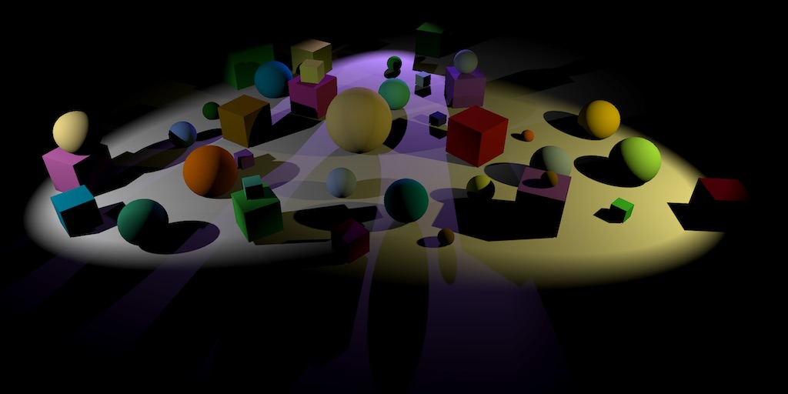

# 1 单个聚光灯的阴影

阴影非常重要，它不仅可以提升真实感，还可以让物体之间的空间层次关系更加明显。没有阴影，我们就很难分辨一个物体究竟是漂浮在表面上还是和表面相接触。

在[Rendering 7, Shadows](https://catlikecoding.com/unity/tutorials/rendering/part-7/) 中解释了Unity默认渲染管线是如何创造阴影的，虽然我们的管线使用单个前向渲染pass，无法使用这种方法，但是大致浏览下其中关于阴影贴图的要点还是有用的。在这一章，我们只完成聚光灯的阴影，毕竟它是最简单的。

我们先从支持单光源阴影开始。我们需要创建一个场景，其中包含一个聚光灯以及一些游戏物体。一个平面用于接受阴影。所有的物体都要使用我们的 *Lit Opaque*材质。

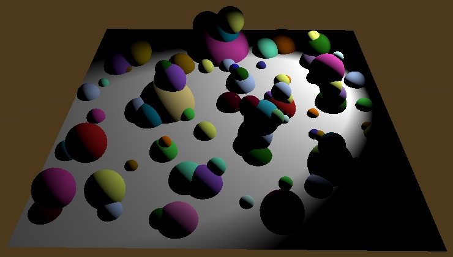

## 1.1 阴影贴图

处理阴影有很多种办法，这里我们用传统的阴影贴图的方法。这意味着我们的需要从光源方向渲染场景,但我们只需渲染深度信息。深度会告诉我们光线在碰撞到物体前走了多久，在这距离之后的物体则处于阴影之中。

我们得先创建一个阴影贴图，在这之后相机才能将内容渲染至贴图。为了之后能对阴影贴图采样，我们的将渲染结果存在一个独立的渲染纹理中，而不是帧缓存中。在MyPipeline中添加一个`RenderTexture` 字段，用来保存深度贴图纹理的引用。

```
	RenderTexture shadowMap;
```

创建一个额外的RenderShadows方法来渲染阴影，该方法以上下文为参数。首先要持有一个渲染纹理。我们通过调用 `RenderTexture.GetTemporary`来实现。如果有还未被清理的闲置纹理，该方法则会拿来重复利用，不然就创建一个新纹理。因为我们的阴贴图几乎在每一帧都会用到，所以我们可以一直重复使用同一纹理。

 `RenderTexture.GetTemporary`方法要求提供贴图的宽高，深度通道的存储位数以及纹理格式。我们使用固定的512x512大小，并使用16位的深度通道提高精度。我们创建的是深度纹理，格式自然是`RenderTextureFormat.Shadowmap`。

```
	void RenderShadows (ScriptableRenderContext context) {		shadowMap = RenderTexture.GetTemporary(			512, 512, 16, RenderTextureFormat.Shadowmap		);	}
```

过滤模式设为双线性，纹理环绕模式设为限制模式。

```
		shadowMap = RenderTexture.GetTemporary(			512, 512, 16, RenderTextureFormat.Shadowmap		);		shadowMap.filterMode = FilterMode.Bilinear;		shadowMap.wrapMode = TextureWrapMode.Clamp;
```

阴影贴图的渲染应当先于常规场景的渲染。因此在Render方法中，我们在配置常规相机操作前，剔除操作之后调用RenderShadows方法。

```
	void Render (ScriptableRenderContext context, Camera camera) {		…		CullResults.Cull(ref cullingParameters, context, ref cull); 		RenderShadows(context); 		context.SetupCameraProperties(camera); 		…	}
```

在我们传递上下文完成工作后，记得释放渲染纹理。如果字段中持有阴影贴图的引用，将它传给 `RenderTexture.ReleaseTemporary`就可以释放纹理，同时清空引用。

```
	void Render (ScriptableRenderContext context, Camera camera) {		…				context.Submit(); 		if (shadowMap) {			RenderTexture.ReleaseTemporary(shadowMap);			shadowMap = null;		}	}
```

## 1.2 阴影的命令行缓冲

我们使用单独的命令行缓冲完成阴影工作，这样在frame debugger中我们就可以看到阴影渲染和常规渲染被分成了两个部分。

```
	CommandBuffer cameraBuffer = new CommandBuffer {		name = "Render Camera"	}; 	CommandBuffer shadowBuffer = new CommandBuffer {		name = "Render Shadows"	};
```

就像之前在常规渲染中做的那样，阴影的渲染应当放在`BeginSample`和`EndSample`之间。

```
	void RenderShadows (ScriptableRenderContext context) {		shadowMap = RenderTexture.GetTemporary(			512, 512, 16, RenderTextureFormat.Shadowmap		);		shadowMap.filterMode = FilterMode.Bilinear;		shadowMap.wrapMode = TextureWrapMode.Clamp; 		shadowBuffer.BeginSample("Render Shadows");		context.ExecuteCommandBuffer(shadowBuffer);		shadowBuffer.Clear(); 		shadowBuffer.EndSample("Render Shadows");		context.ExecuteCommandBuffer(shadowBuffer);		shadowBuffer.Clear();	}
```

## 1.3 设置渲染目标

在我们渲染阴影前，我们应当告诉GPU将渲染结果写入我们的阴影贴图（而不是帧缓冲）。我们可以调用`CoreUtils.SetRenderTarget`来很便捷地实现这一点，传入我们的命令行缓冲以及阴影贴图即可。这个方法一开始会清理贴图，所以在`BeginSample`之前调用，来避免frame debugger里出现额外一层Render Shadows嵌套。

```
		CoreUtils.SetRenderTarget(shadowBuffer, shadowMap);		shadowBuffer.BeginSample("Render Shadows");		context.ExecuteCommandBuffer(shadowBuffer);		shadowBuffer.Clear();
```

我们只关心深度通道，自然也只有该通道需要被清理。为`SetRenderTarget`添加第三个参数 `ClearFlag.Depth`来指明这一点。

```
		CoreUtils.SetRenderTarget(			shadowBuffer, shadowMap,			ClearFlag.Depth		);
```

虽然不是必须的，但我们可以对纹理的加载和储存设置更加细微精确的需求。因为我们无论如何都会先清理纹理，所以我们不在意它来自哪里，可以用`RenderBufferLoadAction.DontCare`来指明这一点。这对于tile-based的GPU可能会有更高的执行效率。我们之后会对该纹理采样，因此需要将它保存在内存中，用`RenderBufferStoreAction.Store`指明这一点。将他们作为方法的第三、四参数。

```
		CoreUtils.SetRenderTarget(			shadowBuffer, shadowMap,			RenderBufferLoadAction.DontCare, RenderBufferStoreAction.Store,			ClearFlag.Depth		);
```

我们阴影贴图的清除操作现在能在frame debugger里看到了，位于常规渲染之前。

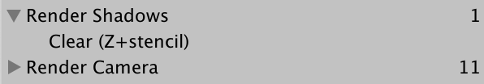

## 1.4 配置视角投影矩阵

我们的思路是从光源的视角渲染场景，相当于把聚光灯看做一个相机。因此，我们得有一个合适的视角投影矩阵。我们可以通过剔除结果中的 `ComputeSpotShadowMatricesAndCullingPrimitives`方法得到该矩阵。该方法的第一个参数是光源序列，我们只有一个光源，所以就是0。投影矩阵和视野矩阵则是在后两个输出参数中。最后一个参数`ShadowSplitData`我们用不到，但作为输出参数，我们必须提供。

```
		shadowBuffer.BeginSample("Render Shadows");		context.ExecuteCommandBuffer(shadowBuffer);		shadowBuffer.Clear(); 		Matrix4x4 viewMatrix, projectionMatrix;		ShadowSplitData splitData;		cull.ComputeSpotShadowMatricesAndCullingPrimitives(			0, out viewMatrix, out projectionMatrix, out splitData		);
```

当我们获得了该矩阵，调用阴影命令缓冲区的`SetViewProjectionMatrices` 方法，然后执行命令并清理该缓存区。

```
		cull.ComputeSpotShadowMatricesAndCullingPrimitives(			0, out viewMatrix, out projectionMatrix, out splitData		);		shadowBuffer.SetViewProjectionMatrices(viewMatrix, projectionMatrix);		context.ExecuteCommandBuffer(shadowBuffer);		shadowBuffer.Clear();
```

## 1.5 渲染投射阴影

 有了正确的矩阵。我们现在可以渲染所有阴影投射物体了。我们通过调用上下文的DrawShadows方法来实现。这个方法需要一个类型的引用参数。我们用要求剔除结果和光照序列的构造方法来创建实例。

```
		shadowBuffer.SetViewProjectionMatrices(viewMatrix, projectionMatrix);		context.ExecuteCommandBuffer(shadowBuffer);		shadowBuffer.Clear();				var shadowSettings = new DrawShadowsSettings(cull, 0);		context.DrawShadows(ref shadowSettings);
```

只有我们把聚光灯的Shadow Type类型设为hard或者soft才有用。如果我们设为none，Unity不会把它编译成一个有效的投射阴影光源。

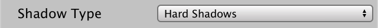

## 2 阴影投射pass

此时照理来讲，所有受光源影响的物体都应该渲染进阴影贴图中，但是frame debugger告诉我们这并没有发生。因为 `DrawShadows` 会使用着色器的*ShadowCaster* pass，但是目前我们的着色器还没有这个pass。

## 2.1 阴影包含文件

为了创建一个shadow-caster pass，我们复制Lit.hlsl文件并重命名为ShadowCaster.hlsl。我们只在意深度信息，所以移除所有和片元位置无关的代码。片元程序的简单的输出0。别忘了重命名相应的顶点片元方法以及导入保护定义。

```
#ifndef MYRP_SHADOWCASTER_INCLUDED#define MYRP_SHADOWCASTER_INCLUDED #include "Packages/com.unity.render-pipelines.core/ShaderLibrary/Common.hlsl" CBUFFER_START(UnityPerFrame)	float4x4 unity_MatrixVP;CBUFFER_ENDCBUFFER_START(UnityPerDraw)	float4x4 unity_ObjectToWorld;CBUFFER_END #define UNITY_MATRIX_M unity_ObjectToWorld #include "Packages/com.unity.render-pipelines.core/ShaderLibrary/UnityInstancing.hlsl" struct VertexInput {	float4 pos : POSITION;	UNITY_VERTEX_INPUT_INSTANCE_ID}; struct VertexOutput {	float4 clipPos : SV_POSITION;}; VertexOutput ShadowCasterPassVertex (VertexInput input) {	VertexOutput output;	UNITY_SETUP_INSTANCE_ID(input);	float4 worldPos = mul(UNITY_MATRIX_M, float4(input.pos.xyz, 1.0));	output.clipPos = mul(unity_MatrixVP, worldPos);	return output;} float4 ShadowCasterPassFragment (VertexOutput input) : SV_TARGET {	return 0;} #endif // MYRP_SHADOWCASTER_INCLUDED
```

一般来讲，这足够用于渲染阴影了。但是可能会出现shadow caster和近平面相交的情况（一个物体太靠前的那部分反而在深度中被忽略了），从而导致阴影中出现了一个洞。为了避免这种情况，我们在顶点函数中，限制顶点不超出近平面。我们可以通过取裁减空间位置z，w分量中较大者的来完成这一操作。

```
	output.clipPos = mul(unity_MatrixVP, worldPos);		output.clipPos.z = max(output.clipPos.z, output.clipPos.w);	return output;
```

然而，裁减空间的一些细节让情况变得复杂起来。我们往往很直观的将深度值为0的地方想象为近平面，随着距离增加，值不断上升。但实际上，除了OpenGL之外的 API，情况与我们想象的相反，在近平面上值为1。而对于OpenGL，近平面则是变成了-1。我们通过 `UNITY_REVERSED_Z` 和 `UNITY_NEAR_CLIP_VALUE`这两个宏覆盖所有情况。我们导入*Common.hlsl*来获取这两个宏。

```
	//output.clipPos.z = max(output.clipPos.z, output.clipPos.w);	#if UNITY_REVERSED_Z		output.clipPos.z =			min(output.clipPos.z, output.clipPos.w * UNITY_NEAR_CLIP_VALUE);	#else		output.clipPos.z =			max(output.clipPos.z, output.clipPos.w * UNITY_NEAR_CLIP_VALUE);	#endif
```

## 2.2 第二个Pass

 在我们的Lit着色器中添加*ShadowCaster* pass，我们复制一个pass语句块，并将第二个pass中Tags语句块的 *LightMode*设为*ShadowCaster*。接着导入 *ShadowCaster.hlsl*而非*Lit.hlsl* 。并使用合适的顶点片元函数。

```
		Pass {			HLSLPROGRAM						#pragma target 3.5						#pragma multi_compile_instancing			#pragma instancing_options assumeuniformscaling						#pragma vertex LitPassVertex			#pragma fragment LitPassFragment						#include "../ShaderLibrary/Lit.hlsl"						ENDHLSL		}				Pass {			Tags {				"LightMode" = "ShadowCaster"			}						HLSLPROGRAM						#pragma target 3.5						#pragma multi_compile_instancing			#pragma instancing_options assumeuniformscaling						#pragma vertex ShadowCasterPassVertex			#pragma fragment ShadowCasterPassFragment						#include "../ShaderLibrary/ShadowCaster.hlsl"						ENDHLSL		}
```

现在我们的物体能够渲染进阴影贴图里了。因为物体目前只受单个光源影响，所以GPU实例的效果非常好。


选择项，你就能够看到最终的阴影贴图了。因为是仅深度贴图，frame debugger只会为我们显示深度信息，白色为近处，黑色为远处。

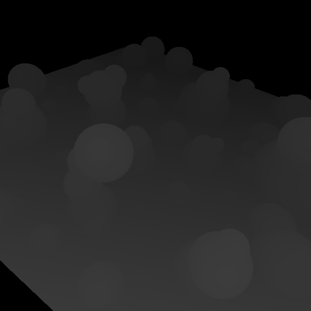

因为阴影贴图是在聚光灯充当相机的情况下渲染的，所以它的朝向和光源相匹配的。如果发现阴影贴图是颠倒的，可能是你对光源进行了旋转，导致本地空间的向上方向在世界空间反而是向下的。

# 3 采样阴影贴图

我们现在有了包含需要数据的阴影贴图，但还没有用到。所以下一步就是在我们正常渲染物体时采样阴影贴图。

## 3.1 从世界空间到阴影空间

储存在深度贴图的中的深度信息，是依据在渲染该贴图时所使用的裁减空间计算的。我们把它叫做阴影空间。这与我们正常渲染场景所用到的坐标空间不匹配。想知道一个片元如果存储在深度贴图中深度值该是多少,我们就是要将片元的位置转换到阴影空间。

首先我们得让我们的着色器可以访问阴影贴图。为此我们添加一个着色器材质变量 *_ShadowMap*。并在MyPipeline中持有指向它的标识符。

```
	static int shadowMapId = Shader.PropertyToID("_ShadowMap");
```

在`RenderShadows中`通过在阴影命令行缓冲执行之前调用它的`SetGlobalTexture`方法，来将阴影贴图和全局变量相绑定。

```
		shadowBuffer.SetGlobalTexture(shadowMapId, shadowMap);		shadowBuffer.EndSample("Render Shadows");
```

接着我们添加一个着色器矩阵变量用于从世界空间转换至阴影空间，命名为*_WorldToShadowMatrix*。同样持有它的标识符。

```
	static int worldToShadowMatrixId =		Shader.PropertyToID("_WorldToShadowMatrix");
```

这个矩阵通过将渲染阴影是用的的视角矩阵和投影矩阵相乘得到。用`SetGlobalMatrix`将它传给GPU。

```
		Matrix4x4 worldToShadowMatrix = projectionMatrix * viewMatrix;		shadowBuffer.SetGlobalMatrix(worldToShadowMatrixId, worldToShadowMatrix);		shadowBuffer.SetGlobalTexture(shadowMapId, shadowMap);
```

我们又会遇到裁减空间z轴是否反向这一问题，好在我们可以用`SystemInfo.usesReversedZBuffer`来检查，如果反向，那就在相乘之前修改投影矩阵的z列分量（列序列号为2）。直接修改原矩阵的m20至m23字段即可。

```
		if (SystemInfo.usesReversedZBuffer) {			projectionMatrix.m20 = -projectionMatrix.m20;			projectionMatrix.m21 = -projectionMatrix.m21;			projectionMatrix.m22 = -projectionMatrix.m22;			projectionMatrix.m23 = -projectionMatrix.m23;		}		Matrix4x4 worldToShadowMatrix = projectionMatrix * viewMatrix;
```

我们现在有了世界空间至阴影空间的转换矩阵。裁减空间范围是-1到1，但我们的纹理坐标和深度范围在0到1。要映射至该范围就得就得再额外乘一个能在所有维度缩放和偏移 0.5个单位的转换矩阵。我们可以用`Matrix4x4.TRS`方法来得到想要的缩放、旋转或偏移。

```
		var scaleOffset = Matrix4x4.TRS(			Vector3.one * 0.5f, Quaternion.identity, Vector3.one * 0.5f		);		Matrix4x4 worldToShadowMatrix =			scaleOffset * (projectionMatrix * viewMatrix);
```

但是因为这是一个简约矩阵（simple matrix），我们简单的在单位矩阵的基础了修改合适的分量即可。

```
		var scaleOffset = Matrix4x4.identity;		scaleOffset.m00 = scaleOffset.m11 = scaleOffset.m22 = 0.5f;		scaleOffset.m03 = scaleOffset.m13 = scaleOffset.m23 = 0.5f;
```

## 3.2 采样深度

在*Lit.hlsl*,中，新增一个缓存区并在其中定义`**float4x4** _WorldToShadowMatrix` 。

```
CBUFFER_START(_LightBuffer)	…CBUFFER_END CBUFFER_START(_ShadowBuffer)	float4x4 _WorldToShadowMatrix;CBUFFER_END
```

纹理资源不属于缓存区的一部分，我们得分开定义。我们可以用宏 `**TEXTURE2D_SHADOW**`来定义 `_ShadowMap`。

```
CBUFFER_START(_ShadowBuffer)	float4x4 _WorldToShadowMatrix;CBUFFER_END TEXTURE2D_SHADOW(_ShadowMap);
```

> ### `TEXTURE2D` 和 `**TEXTURE2D_SHADOW**`有什么不同
>
> 只对于OpenGL ES 2.0而言两者有所区别。因为它不支持阴影贴图的深度比较。但我们不需要支持OpenGL ES 2.0，所以我们完全可以用`TEXTURE2D`代替。我使用`**TEXTURE2D_SHADOW**`只是为了强调我们在处理阴影数据。
>
> 这个宏定义在Core library中每个目标平台各自的API包含文件中，我们可以通过导入 *Common.hlsl*获得。

 接下来，我们需定义采样器状态用于采样纹理。通常我们是用的是宏`SAMPLER` ，但是这里我们需要使用另外一个特殊的比较采样器，所以使用`**SAMPLER_CMP**`。为了得到正确的采样器状态，应使用*sampler*前缀再加上贴图名字作为参数。

```
TEXTURE2D_SHADOW(_ShadowMap);SAMPLER_CMP(sampler_ShadowMap);
```

> ### 什么是纹理采样器？
>
> 在旧的GLSL代码中，我们使用sampler2D来同时定义纹理和采样器状态。但其实这是两个分开的东西，都会占用资源。采样器状态可以从纹理中分离开来，就为混合使用两者提供了可能。典型的例子就是多张纹理重复利用同一个采样器状态。
>
> 在我们的例子里，我们通过MyPipeline设置采样器状态的纹理环绕模式为限制，过滤模式为双线性。
>
> 我们使用的比较采样器还会在双线性插值之前就为我们进行深度比较。这会比在插值之后才进行比较效果更好。

创建一个以世界位置作为参数的`ShadowAttenuation`方法。它会返回我们光源阴影的衰减因子。在方法里我们首先要做的就是将世界位置转为阴影空间位置。

```
TEXTURE2D_SHADOW(_ShadowMap);SAMPLER_CMP(sampler_ShadowMap); float ShadowAttenuation (float3 worldPos) {	float4 shadowPos = mul(_WorldToShadowMatrix, float4(worldPos, 1.0));}
```

就像之前转换到裁减空间一样，得到的位置是定义在齐次坐标系中的。我们需要的是常规坐标，所以我们让xyz分量除以w分量。

```
	float4 shadowPos = mul(_WorldToShadowMatrix, float4(worldPos, 1.0));	shadowPos.xyz /= shadowPos.w;
```

现在我们可以通过宏采样阴影贴图了。它需要一张贴图，一个采样器状态，以及对应的阴影空间位置作为参数。如果该点位置的z值比在阴影贴图中对应点的值要小就会返回1，这说明他比任何投射阴影的物体离光源都要近。反之，在阴影投射物后面就会返回0。因为采样器回在双线性插值之前进行比较，所以阴影边缘会混合阴影贴图的多个纹素（texels）。

```
	shadowPos.xyz /= shadowPos.w;	return SAMPLE_TEXTURE2D_SHADOW(_ShadowMap, sampler_ShadowMap, shadowPos.xyz);
```

## 3.3 阴影的衰减

想要让阴影影响到光源，就的在`DiffuseLight`中为阴影衰减添加一个参数。将它与其他的渐变因子一起作用于漫反射强度。

```
float3 DiffuseLight (	int index, float3 normal, float3 worldPos, float shadowAttenuation) {	…	diffuse *= shadowAttenuation * spotFade * rangeFade / distanceSqr;		return diffuse * lightColor;}
```

顶点光源不会有阴影，所以在`LitPassVertex`.中将阴影衰减设为1。

```
VertexOutput LitPassVertex (VertexInput input) {	…		output.vertexLighting = 0;	for (int i = 4; i < min(unity_LightIndicesOffsetAndCount.y, 8); i++) {		int lightIndex = unity_4LightIndices1[i - 4];		output.vertexLighting += 			DiffuseLight(lightIndex, output.normal, output.worldPos, 1);	} 	return output;}
```

在 `LitPassFragment`中，调用`ShadowAttenuation`方法并传入世界位置，将返回值传给`DiffuseLight`。

```
float4 LitPassFragment (VertexOutput input) : SV_TARGET {	…		float3 diffuseLight = input.vertexLighting;	for (int i = 0; i < min(unity_LightIndicesOffsetAndCount.y, 4); i++) {		int lightIndex = unity_4LightIndices0[i];		float shadowAttenuation = ShadowAttenuation(input.worldPos);		diffuseLight += DiffuseLight(			lightIndex, input.normal, input.worldPos, shadowAttenuation		);	}	float3 color = diffuseLight * albedo;	return float4(color, 1);}
```

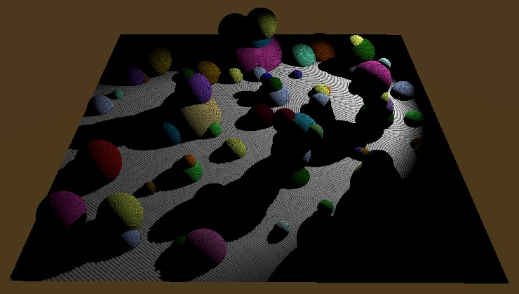

阴影出现了，但是有非常糟糕的瑕疵。

# 4 阴影设置

影响最终阴影质量表现的因素有很多。我们暂时支持一部分：阴影分辨率、深度偏移、强度、软阴影。我们可以在每个光源的检视面板对这些以及其他选项进行配置。

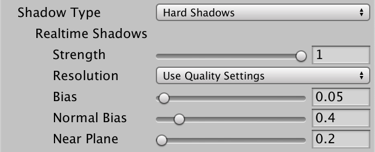

## 4.1 阴影贴图尺寸

虽然检视面板中有设置阴影分辨率的选项但这只会间接的影响深度贴图的大小，真正的大小取决于质量设置（quality  settings）里的选择，至少对于Unity默认的渲染管线是这样的。我们用的是自己的渲染管线，因此我们选择将阴影贴图大小的设置选项放到MyPipelineAsset中。

阴影贴图是正方贴图，我们允许设为256x256到4096x4096之间的任意二次方大小。为此我们在MyPipelineAsset中定义一个名为ShadowMapSize的枚举类型，其中包含了256、512、1024、2048这几个枚举。因为枚举标签不能为数字，所以我们加一个下划线前缀。Unity编辑器在显示时会抹去下划线。我们用这个枚举类型添加一个配置字段用于设置阴影贴图尺寸。

```
	public enum ShadowMapSize {		_256,		_512,		_1024,		_2048,		_4096	} 	[SerializeField]	ShadowMapSize shadowMapSize;
```

枚举代表的整数默认从0开始。但如果枚举选项正好与相同大小的整数相匹配会很方便，因此我们对枚举项进行显示赋值。

```
	public enum ShadowMapSize {		_256 = 256,		_512 = 512,		_1024 = 1024,		_2048 = 2048,		_4096 = 4096	}
```

这样默认值0将无法表示任何枚举项，所以我们需自己设置一个有效的默认值。

```
	ShadowMapSize shadowMapSize = ShadowMapSize._1024;
```

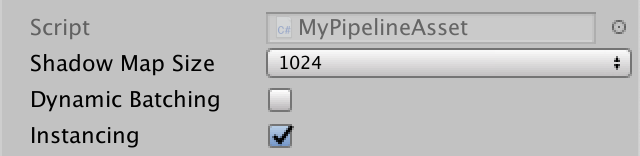

将我们的阴影贴图尺寸枚举项强转成整数并传入pipeline的构造方法。

```
	protected override IRenderPipeline InternalCreatePipeline () {		return new MyPipeline(			dynamicBatching, instancing, (int)shadowMapSize		);	}
```

在MyPipeline中添加一个字段记录大小，并在构造器中初始化。

```
	int shadowMapSize; 	public MyPipeline (		bool dynamicBatching, bool instancing, int shadowMapSize	) {		…		this.shadowMapSize = shadowMapSize;	}
```

在RenderShadows中申请渲染纹理时，我们就可以使用该变量设置阴影贴图尺寸了。

```
	void RenderShadows (ScriptableRenderContext context) {		shadowMap = RenderTexture.GetTemporary(			shadowMapSize, shadowMapSize, 16, RenderTextureFormat.Shadowmap		);		…	}
```

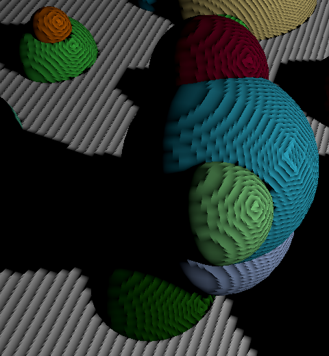 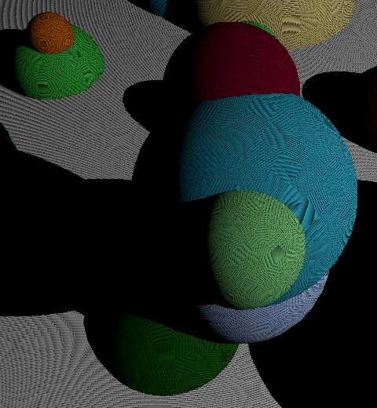 

## 4.2 阴影偏移

阴影瑕疵是因为阴影贴图纹素（的方尖尖）戳出了规定的表面引起的。更详细的解释请看[Rendering 7, Shadows](https://catlikecoding.com/unity/tutorials/rendering/part-7/)。我们用最简单的方式掩盖这些瑕疵。那就是在渲染深度贴图时在深度上添加一点偏移。这个深度偏移在每个光源中单独配置，所以必须把它传给GPU。我们添加一个*_ShadowBias*着色器属性，并记录下它的标识符。

```
	static int shadowBiasId = Shader.PropertyToID("_ShadowBias");
```

在RenderShadows中设置视角投影矩阵后，同样设置深度偏移。 `VisibleLight`中不能直接得到该信息，但有一个light字段持有 `Light`脚本的引用，我们可以从中获得深度偏移。

```
		shadowBuffer.SetViewProjectionMatrices(viewMatrix, projectionMatrix);		shadowBuffer.SetGlobalFloat(			shadowBiasId, cull.visibleLights[0].light.shadowBias		);		context.ExecuteCommandBuffer(shadowBuffer); 		shadowBuffer.Clear();
```

*ShadowCaster.hlsl* 文件，在阴影投射缓存区添加相应的变量。对裁减空间位置的z分量应用z分量。如果z轴是翻转的那就用减法，否则用加法。

```
CBUFFER_START(_ShadowCasterBuffer)	float _ShadowBias;CBUFFER_END … VertexOutput ShadowCasterPassVertex (VertexInput input) {	…	output.clipPos = mul(unity_MatrixVP, worldPos);		#if UNITY_REVERSED_Z		output.clipPos.z -= _ShadowBias;		output.clipPos.z =			min(output.clipPos.z, output.clipPos.w * UNITY_NEAR_CLIP_VALUE);	#else		output.clipPos.z += _ShadowBias;		output.clipPos.z =			max(output.clipPos.z, output.clipPos.w * UNITY_NEAR_CLIP_VALUE);	#endif	return output;}
```

阴影偏移应当尽可能小，避免阴影偏移的太远引起peter-panning效果，

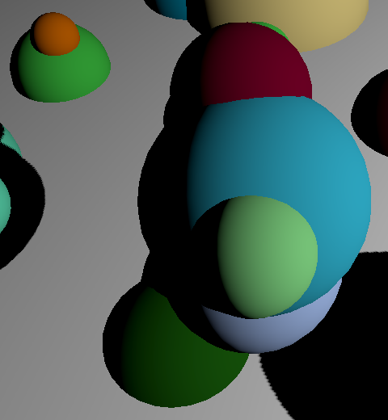 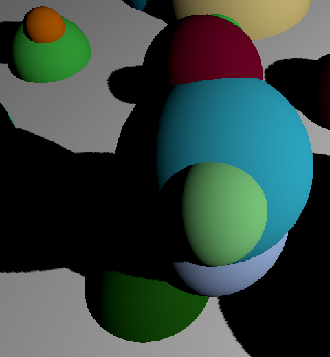

阴影偏移分别为0.05和0.01

## 4.3 阴影强度

我们只有单个光源并且没有任何环境光，所以我们的阴影是纯黑的。但是我们可以调和一下阴影衰减的轻度，让他只淡化部分光源贡献而不是完全排除。这会让我们的阴影看起来是半透明的。我们 *_ShadowStrength*属性表示阴影强度，并记录下它的标识符。

```
	static int shadowStrengthId = Shader.PropertyToID("_ShadowStrength");
```

采样阴影贴图是才会用到阴影强度，所以将它与世界-阴影空间矩阵和阴影贴图在一块设置。和深度偏移一样，我们在 `Light`脚本中获取该值。

```
		shadowBuffer.SetGlobalMatrix(worldToShadowMatrixId, worldToShadowMatrix);		shadowBuffer.SetGlobalTexture(shadowMapId, shadowMap);		shadowBuffer.SetGlobalFloat(			shadowStrengthId, cull.visibleLights[0].light.shadowStrength		);		shadowBuffer.EndSample("Render Shadows");
```

在阴影缓存区添加阴影强度。在`ShadowAttenuation`中用它在1和采样得到的衰减值之间插值。

```
CBUFFER_START(_ShadowBuffer)	float4x4 _WorldToShadowMatrix;	float _ShadowStrength;CBUFFER_END TEXTURE2D_SHADOW(_ShadowMap);SAMPLER_CMP(sampler_ShadowMap); float ShadowAttenuation (float3 worldPos) {	float4 shadowPos = mul(_WorldToShadowMatrix, float4(worldPos, 1.0));	shadowPos.xyz /= shadowPos.w;	float attenuation =		SAMPLE_TEXTURE2D_SHADOW(_ShadowMap, sampler_ShadowMap, shadowPos.xyz);	return lerp(1, attenuation, _ShadowStrength);}
```

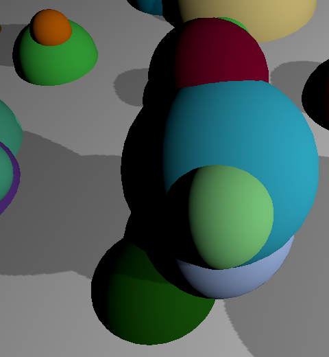

## 4.4 软阴影

最后一个设置就是支持软硬阴影的切换。我们现在使用的是硬阴影，阴影边缘的平滑过渡全靠在采样阴影贴图时使用的双线性插值。当开启平滑的软阴影时，阴影和非阴影的过渡是模糊的，阴影中有很大的半影区域。但不像在现实世界中，半影的产生取决于光源、投射物，接受阴影物体之间的空间关系，在这里半影范围是固定统一的。

软阴影需要采样阴影贴图多次。次数越靠后，采样点越偏离原位置，贡献度也越低。我们使用5x5 tent filter，需要九次纹理采样。为此我们要用到在*Shadow/ShadowSamplingTent.hlsl*i包含文件中的一个方法，将它导入*Lit.hlsl*。

```
#include "Packages/com.unity.render-pipelines.core/ShaderLibrary/Common.hlsl"#include "Packages/com.unity.render-pipelines.core/ShaderLibrary/Shadow/ShadowSamplingTent.hlsl"
```

> ### tent filter是怎样工作的？
>
> [Bloom](https://catlikecoding.com/unity/tutorials/advanced-rendering/bloom/)教程涵盖了利用双线性纹理采样的滤波器内核，而[Depth of Field](https://catlikecoding.com/unity/tutorials/advanced-rendering/depth-of-field/)教程则包含3×3 tent filter的示例。

tent filter需要知道阴影贴图的尺寸。该方法要求一个特定的向量，四个分量分别为宽的倒数、高的倒数、宽度、高度。我们将其添加到阴影缓存区。

```
CBUFFER_START(_ShadowBuffer)	float4x4 _WorldToShadowMatrix;	float _ShadowStrength;	float4 _ShadowMapSize;CBUFFER_END
```

在MyPipeline中保存相应的标识符。

```
	static int shadowMapSizeId = Shader.PropertyToID("_ShadowMapSize");
```

在 `RenderShadows`的末尾设置该变量。 

```
		float invShadowMapSize = 1f / shadowMapSize;		shadowBuffer.SetGlobalVector(			shadowMapSizeId, new Vector4(				invShadowMapSize, invShadowMapSize, shadowMapSize, shadowMapSize			)		);		shadowBuffer.EndSample("Render Shadows");
```

 当*_SHADOWS_SOFT* 关键字被定义时，在`ShadowAttenuation`方法中我们用tent filter替换常规的阴影贴图采样。

```
	float attenuation =		SAMPLE_TEXTURE2D_SHADOW(_ShadowMap, sampler_ShadowMap, shadowPos.xyz);		#if defined(_SHADOWS_SOFT)	#endif		return lerp(1, attenuation, _ShadowStrength);
```

不再是单次采样，我们创建一个5x5的tent filter来叠加九次采样。

SampleShadow_ComputeSamples_Tent_5x5方法会给我们分配每次采样的权重和UV坐标，我们需要传入阴影贴图尺寸和阴影空间位置。权重和uv通过输出参数获取，一个是flaot数组，另一个是float2数组，两者都有9个元素。

```
	#if defined(_SHADOWS_SOFT)		float tentWeights[9];		float2 tentUVs[9];		SampleShadow_ComputeSamples_Tent_5x5(			_ShadowMapSize, shadowPos.xy, tentWeights, tentUVs		);	#endif
```

然而，方法中的输出参数定义的类型为real而不是float。它不是一个实际的数字类型，而是一个宏，根据需要选择flaot或者half。我们通常可以忽略这个情况，但是为了避免在某些平台出现编译错误，最好还是为输出参数使用real类型。

```
		real tentWeights[9];		real2 tentUVs[9];
```

衰减清0后，我们在循环中，使用数组里的权重和uv坐标，对阴影贴图采样九次。这是一个固定次数的循环，所以shader编译器会会将循环展开。我们还需要阴影空间位置的z坐标，每次采样都用这三者构造一个flaot3变量。

```
	#if defined(_SHADOWS_SOFT)		real tentWeights[9];		real2 tentUVs[9];		SampleShadow_ComputeSamples_Tent_5x5(			_ShadowMapSize, shadowPos.xy, tentWeights, tentUVs		);		attenuation = 0;		for (int i = 0; i < 9; i++) {			attenuation += tentWeights[i] * SAMPLE_TEXTURE2D_SHADOW(				_ShadowMap, sampler_ShadowMap, float3(tentUVs[i].xy, shadowPos.z)			);		}	#endif
```

像使用软阴影，就得创建一个定义了*_SHADOWS_SOFT*关键字的着色器变种。在我们的Lit着色器的默认pass中添加一个多重编译指令。我们需要两个变种，一个有该关键字，一个没有，所以我们用下划线表示没有关键字，后面跟着*_SHADOWS_SOFT*关键字。

```
			#pragma multi_compile_instancing			#pragma instancing_options assumeuniformscaling						#pragma multi_compile _ _SHADOWS_SOFT
```

最后，我们在 `RenderShadows`的末尾基于光照的shadows属性切换关键字。如果设置为`LightShadows.Soft`就会在我们的阴影缓冲区调用 `EnableShaderKeyword`方法，否则调用`DisableShaderKeyword`方法，Unity根据关键字状态决定在渲染时使用哪一个变种。

```
	const string shadowsSoftKeyword = "_SHADOWS_SOFT";		…		void RenderShadows (ScriptableRenderContext context) {		…				if (cull.visibleLights[0].light.shadows == LightShadows.Soft) {			shadowBuffer.EnableShaderKeyword(shadowsSoftKeyword);		}		else {			shadowBuffer.DisableShaderKeyword(shadowsSoftKeyword);		}		shadowBuffer.EndSample("Render Shadows");		context.ExecuteCommandBuffer(shadowBuffer);		shadowBuffer.Clear();	}
```

用一个bool值切换关键字很普遍，我们可以用方法`CoreUtils.SetKeyword`代替。

```
		//if (cull.visibleLights[0].light.shadows == LightShadows.Soft) {		//	shadowBuffer.EnableShaderKeyword(shadowsSoftKeyword);		//}		//else {		//	shadowBuffer.DisableShaderKeyword(shadowsSoftKeyword);		//}		CoreUtils.SetKeyword(			shadowBuffer, shadowsSoftKeyword,			cull.visibleLights[0].light.shadows == LightShadows.Soft		);
```

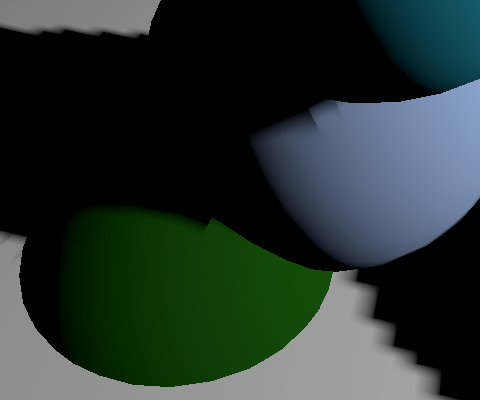 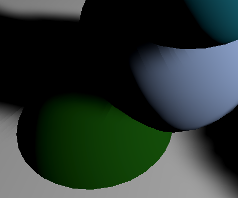 软阴影和硬阴影

# 5 支持多重光源阴影

迄今为止，我们只能支持单个聚光灯的阴影，但我们目标是支持最多16个光源。在这里我们先同时支持16个聚光灯的阴影。

## 5.1 每个光源的阴影数据

我们只能用单个pass完成所有的光源工作，所以如果我们想支持多光源阴影，我们就得确保每个光源阴影数据（如强度等）可同时访问。我们选择在`ConfigureLights`中收集阴影数据，就像设置其他的光源数据一样。所以我们将该方法移到`RenderShadows`前，并且只在有可见光源时调用 `RenderShadows。`

```
		CullResults.Cull(ref cullingParameters, context, ref cull);		if (cull.visibleLights.Count > 0) {			ConfigureLights();			RenderShadows(context);		}		else {			cameraBuffer.SetGlobalVector(				lightIndicesOffsetAndCountID, Vector4.zero			);		}		ConfigureLights(); 		context.SetupCameraProperties(camera); 		CameraClearFlags clearFlags = camera.clearFlags;		cameraBuffer.ClearRenderTarget(			(clearFlags & CameraClearFlags.Depth) != 0,			(clearFlags & CameraClearFlags.Color) != 0,			camera.backgroundColor		);				//if (cull.visibleLights.Count > 0) {		//	ConfigureLights();		//}		//else {		//	cameraBuffer.SetGlobalVector(		//		lightIndicesOffsetAndCountID, Vector4.zero		//	);		//}
```

我们用一个四维向量数组存储阴影信息,每个元素代表一个光源。在`ConfigureLights`遍历光源的循环中先将每个向量设置为0，就像之前设置衰减数据一样。

```
	Vector4[] shadowData = new Vector4[maxVisibleLights];		…		void ConfigureLights () {		for (int i = 0; i < cull.visibleLights.Count; i++) {			if (i == maxVisibleLights) {				break;			}			VisibleLight light = cull.visibleLights[i];			visibleLightColors[i] = light.finalColor;			Vector4 attenuation = Vector4.zero;			attenuation.w = 1f;			Vector4 shadow = Vector4.zero;			…			visibleLightAttenuations[i] = attenuation;			shadowData[i] = shadow;		}				…	}
```

在聚光灯的情况下获取`Light`脚本。如果shadows属性没有被设置为`LightShadows.None`,就将阴影强度存储在向量的x分量中。

```
				if (light.lightType == LightType.Spot) {					… 					Light shadowLight = light.light;					if (shadowLight.shadows != LightShadows.None) {						shadow.x = shadowLight.shadowStrength;					}				}
```

我们用向量的y分量区分硬阴影或软阴影。1表示软阴影，0表示硬阴影。

```
					if (shadowLight.shadows != LightShadows.None) {						shadow.x = shadowLight.shadowStrength;						shadow.y =							shadowLight.shadows == LightShadows.Soft ? 1f : 0f;					}
```

## 5.2 排除光源

一个光源可见并且开启了阴影并不能保证一定需要阴影贴图。如果在光源的视角中并没有任何阴影的投射物或接受物，自然不需要阴影贴图。我们可以调用剔除结果的 `GetShadowCasterBounds`传入一个光源序列来检查该光源是否需要阴影贴图。他会检查该光源的阴影体积是否在一个有效的范围内。如果没有，我们就跳过设置阴影数据。尽管不需要，但是我们还是得提供一个阴影范围作为输出参数。

```
					Light shadowLight = light.light;					Bounds shadowBounds;					if (						shadowLight.shadows != LightShadows.None &&						cull.GetShadowCasterBounds(i, out shadowBounds)					) {						shadow.x = shadowLight.shadowStrength;						shadow.y =							shadowLight.shadows == LightShadows.Soft ? 1f : 0f;					}
```

## 5.3 渲染所有的阴影贴图

将目光转到RenderShadows，我们把首次执行阴影缓冲区和设置阴影贴图纹理之间的代码用一个循环包括。用这个循环再次遍历所有可见光源，并在光源数量超过可支持最大光源数是打断循环。将其中所有原本固定的序列0，修改为迭代值变量。

```
		shadowBuffer.BeginSample("Render Shadows");		context.ExecuteCommandBuffer(shadowBuffer);		shadowBuffer.Clear(); 		for (int i = 0; i < cull.visibleLights.Count; i++) {			if (i == maxVisibleLights) {				break;			} 			Matrix4x4 viewMatrix, projectionMatrix;			ShadowSplitData splitData;			cull.ComputeSpotShadowMatricesAndCullingPrimitives(				i, out viewMatrix, out projectionMatrix, out splitData			);			shadowBuffer.SetViewProjectionMatrices(viewMatrix, projectionMatrix);			shadowBuffer.SetGlobalFloat(				shadowBiasId, cull.visibleLights[i].light.shadowBias			);			context.ExecuteCommandBuffer(shadowBuffer);			shadowBuffer.Clear(); 			var shadowSettings = new DrawShadowsSettings(cull, i);			context.DrawShadows(ref shadowSettings); 			…			shadowBuffer.SetGlobalMatrix(				worldToShadowMatrixId, worldToShadowMatrix			);		}				shadowBuffer.SetGlobalTexture(shadowMapId, shadowMap);
```

我们跳过不需要阴影贴图的光源，我们用阴影数据中的阴影强度来判断。小于等于0（有可能原本的强度就这样，也有可能是我们之前设0来跳过）就直接用`**continue**`跳到下个迭代。

```
			if (i == maxVisibleLights) {				break;			}			if (shadowData[i].x <= 0f) {				continue;			}
```

  `ComputeSpotShadowMatricesAndCullingPrimitives`方法返回是否可以生成有效的矩阵的布尔值。理论上应该和 `GetShadowCasterBounds`的结果一致，但以防万一还是考虑在失败时将强度设为0并跳过此次迭代。

```
			Matrix4x4 viewMatrix, projectionMatrix;			ShadowSplitData splitData;			if (!cull.ComputeSpotShadowMatricesAndCullingPrimitives(				i, out viewMatrix, out projectionMatrix, out splitData			)) {				shadowData[i].x = 0f;				continue;			}
```

当我们开启多个光源的阴影（只要它们的位置能够让他们产生可见的阴影），frame debugger会显示我们实际上渲染了多次阴影贴图。

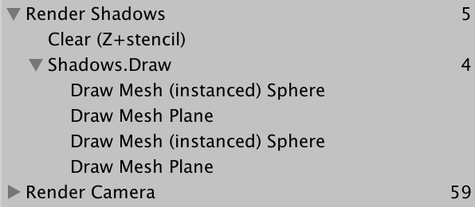

然而，阴影显示地一团糟，我们还需要做一些额外的工作。

## 5.4 使用正确的阴影数据

阴影强度不在是唯一的了，我们得将阴影数据的数组传给GPU。先别忘了在MyPipeline做对应的修改。

```
	//static int shadowStrengthId = Shader.PropertyToID("_ShadowStrength");	static int shadowDataId = Shader.PropertyToID("_ShadowData");		…		void RenderShadows (ScriptableRenderContext context) {		…		//shadowBuffer.SetGlobalFloat(		//	shadowStrengthId, cull.visibleLights[0].light.shadowStrength		//);		shadowBuffer.SetGlobalVectorArray(shadowDataId, shadowData);		…	}
```

 同样的，我们需要世界-阴影矩阵的数组，而不是单独一个。在RenderShadows的循环中填充数组，接着将数组传给GPU。

```
	//static int worldToShadowMatrixId =	//	Shader.PropertyToID("_WorldToShadowMatrix");	static int worldToShadowMatricesId =		Shader.PropertyToID("_WorldToShadowMatrices");			…		void RenderShadows (ScriptableRenderContext context) {		… 		for (int i = 0; i < cull.visibleLights.Count; i++) {			…			//Matrix4x4 worldToShadowMatrix =			//	scaleOffset * (projectionMatrix * viewMatrix);			//shadowBuffer.SetGlobalMatrix(			//	worldToShadowMatrixId, worldToShadowMatrix			//);			worldToShadowMatrices[i] =				scaleOffset * (projectionMatrix * viewMatrix);		}		shadowBuffer.SetGlobalTexture(shadowMapId, shadowMap);		shadowBuffer.SetGlobalMatrixArray(			worldToShadowMatricesId, worldToShadowMatrices		);		shadowBuffer.SetGlobalVectorArray(shadowDataId, shadowData);		…	}
```

在shader这里，修改阴影缓存区使之匹配。

```
CBUFFER_START(_ShadowBuffer)	//float4x4 _WorldToShadowMatrix;	//float _ShadowStrength;	float4x4 _WorldToShadowMatrices[MAX_VISIBLE_LIGHTS];	float4 _ShadowData[MAX_VISIBLE_LIGHTS];	float4 _ShadowMapSize;CBUFFER_END
```

 

`ShadowAttenuation` 方法需要新增一个参数接受光源序列以便取得正确的数组元素。我们检查阴影强度是否为正数。如果不是，直接将1作为衰减值返回。代替依赖*_SHADOWS_SOFT*关键字判断，我们基于阴影数据的y分量来进行条件分支。

```
float ShadowAttenuation (int index, float3 worldPos) {	if (_ShadowData[index].x <= 0) {		return 1.0;	}	float4 shadowPos = mul(_WorldToShadowMatrices[index], float4(worldPos, 1.0));	shadowPos.xyz /= shadowPos.w;	float attenuation;		if (_ShadowData[index].y == 0) {		attenuation =			SAMPLE_TEXTURE2D_SHADOW(_ShadowMap, sampler_ShadowMap, shadowPos.xyz);	}	//#if defined(_SHADOWS_SOFT)	else {		real tentWeights[9];		real2 tentUVs[9];		SampleShadow_ComputeSamples_Tent_5x5(			_ShadowMapSize, shadowPos.xy, tentWeights, tentUVs		);		attenuation = 0;		for (int i = 0; i < 9; i++) {			attenuation += tentWeights[i] * SAMPLE_TEXTURE2D_SHADOW(				_ShadowMap, sampler_ShadowMap, float3(tentUVs[i].xy, shadowPos.z)			);		}	}	//#endif		return lerp(1, attenuation, _ShadowData[index].x);}
```

最后在 `LitPassFragment`里调用`ShadowAttenuation` 时传入光源序列。

```
		float shadowAttenuation = ShadowAttenuation(lightIndex, input.worldPos);
```

## 5.5 阴影贴图图集

虽然我们有了正确的阴影信息和矩阵，但是在超过一个光源有阴影时，最终产生的仍然是错误的阴影。这是因为所有的阴影贴图都渲染进了同一张纹理之中，多类信息合并在一起，导致数值失去意义。Unity轻量级渲染管线通过阴影贴图图集解决这一问题。将渲染纹理分割为多个方形区域，每个光源个占据其一。我们也使用这种方法。

> ### 为什么不使用纹理数组？
>
> 这是可行的，但可惜使用阴影投射渲染纹理数组并不是一个普遍的做法。比如，在Metal上这是可行的，但是OpenGL core要求4.6的着色器等级，即使生效了，Unity也会打印一连串的断言错误。所以还是老老实实的用单个渲染纹理吧。

我们最多支持16个光源，所以就应该把单张阴影贴图分成4x4网格的平铺块(tiles)。每个平铺块的大小应该和阴影贴图除以4的大小一样。我们要将渲染时的视口约束在这个大小，所以在`RenderShadows`一开始创建一个`Rect`结构体，并填充合适的值。

```
	void RenderShadows (ScriptableRenderContext context) {		float tileSize = shadowMapSize / 4;		Rect tileViewport = new Rect(0f, 0f, tileSize, tileSize); 		…	}
```

在我们设置视口和投影矩阵前，用`SetViewport`通知GPU使用合适的视口大小。

```
			shadowBuffer.SetViewport(tileViewport);			shadowBuffer.SetViewProjectionMatrices(viewMatrix, projectionMatrix);
```


现在所有的阴影贴图都渲染在渲染纹理一角的单个平铺块中。下一步就是偏移每个光源的视口。我们可以依据每个平铺块的xy序号得到视口位置。Y轴偏移序号通过光源序列除以四（整数除法）得到。x轴偏移序号通过整数取余得到。最终视口的xy位置等于序号乘以平铺块大小。

```
			float tileOffsetX = i % 4;			float tileOffsetY = i / 4;			tileViewport.x = tileOffsetX * tileSize;			tileViewport.y = tileOffsetY * tileSize; 			shadowBuffer.SetViewport(tileViewport);
```


这样的图集有一个缺点，在一个平铺块边缘采样时，可能会在两个平铺块之间插值，从而导致错误的结果。当使用软阴影时效果会更加的糟糕，因为tent   filter可能会在离原始采样点偏移最多4个纹素的地方采样。相比混合附近的平铺块，能够淡出阴影肯定更好。所以我们在每个平铺块周围添加一圈空值边缘，让GPU写入数据时使用比平铺块略小一点的视口。这称之为裁减矩形。我们可以使用 `shadowBuffer.EnableScissorRect` 方法，传递一个比视口略小的矩形来实现。我们需要边缘宽度为四个纹素，所以这个矩形位置应该是视口位置加4，大小为视口大小减8。

```
			shadowBuffer.SetViewport(tileViewport);			shadowBuffer.EnableScissorRect(new Rect(				tileViewport.x + 4f, tileViewport.y + 4f,				tileSize - 8f, tileSize - 8f			));
```


我们在调用完`DisableScissorRect`之后关闭裁剪矩形，不然会影响到后面的常规渲染。

```
		shadowBuffer.DisableScissorRect();		shadowBuffer.SetGlobalTexture(shadowMapId, shadowMap);
```

最后要做的就是调整世界-阴影矩阵，让它能采样到正确的平铺块。我们可以乘以一个有适当xy偏移的转换矩阵。shader不需要关心我们是否使用了图集。

```
			var scaleOffset = Matrix4x4.identity;			scaleOffset.m00 = scaleOffset.m11 = scaleOffset.m22 = 0.5f;			scaleOffset.m03 = scaleOffset.m13 = scaleOffset.m23 = 0.5f;			worldToShadowMatrices[i] =				scaleOffset * (projectionMatrix * viewMatrix); 			var tileMatrix = Matrix4x4.identity;			tileMatrix.m00 = tileMatrix.m11 = 0.25f;			tileMatrix.m03 = tileOffsetX * 0.25f;			tileMatrix.m13 = tileOffsetY * 0.25f;			worldToShadowMatrices[i] = tileMatrix * worldToShadowMatrices[i];
```


要记住我们现在每个物体最多支持4个像素光，所以你让第5个聚光源照射到平面时，其中一个光源会退化为顶点光源，进而无法接受该光源的阴影。（16个阴影指的是整体场景的阴影来源，而不是单个物体能接受的）

# 6 动态平铺块

使用阴影贴图图集的优点是无论有多少阴影贴图，我们用的都是同一张渲染纹理，所以纹理占用的内存是固定的。缺点则是每个光源只占纹理的一部分，所以最终的阴影贴图分辨率会比我们想象的要低。并且最终可能有很大一部分的纹理面积没有利用。

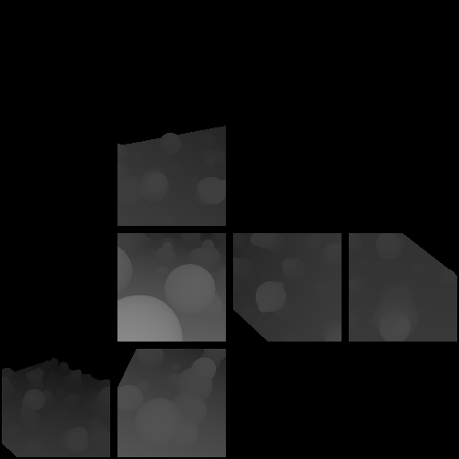

我们可以更好的利用纹理，而不是固定的将纹理分成16块。我们可以用一个变量表示平铺块的大小，可以根据有多少平铺块决定值设为多大。这种方式可以确保我们至少能用到一半的纹理。

## 6.1 计算阴影平铺块的数量

首先，我们需要明确我们需要多少个平铺块。我们可以在`ConfigureLights`中记录我们有多少带阴影的光源。并用一个字段记录总数以便在之后使用。

```
	int shadowTileCount; … 	void ConfigureLights () {		shadowTileCount = 0;		for (int i = 0; i < cull.visibleLights.Count; i++) {			…			else {				… 				if (light.lightType == LightType.Spot) {					…					if (						shadowLight.shadows != LightShadows.None &&						cull.GetShadowCasterBounds(i, out shadowBounds)					) {						shadowTileCount += 1;						shadow.x = shadowLight.shadowStrength;						shadow.y =							shadowLight.shadows == LightShadows.Soft ? 1f : 0f;					}				}			}			…		}		…	}
```

## 6.2 分割阴影贴图

接下来在RenderShadows里一开始就算好如何分割阴影贴图。我用一个整数变量来表示。如果我们只要一个平铺块，就不需要分割，所以split值设为1，否则如果是4个以下值为2,8个以下值为3，只有超过8个，值才为4。

```
	void RenderShadows (ScriptableRenderContext context) {		int split;		if (shadowTileCount <= 1) {			split = 1;		}		else if (shadowTileCount <= 4) {			split = 2;		}		else if (shadowTileCount <= 9) {			split = 3;		}		else {			split = 4;		}		…	}
```

平铺块的大小可以通过阴影贴图大小除以split值得到（整数除法）。这意味着在除以3的时候我们会舍弃部分纹素。平铺块的缩放值应该改为1/split（浮点数除法）。我们使用split值计算平铺块的缩放和偏移用于调整世界-阴影矩阵。

```
		float tileSize = shadowMapSize / split;		float tileScale = 1f / split;		… 		for (int i = 0; i < cull.visibleLights.Count; i++) {			… 			float tileOffsetX = i % split;			float tileOffsetY = i / split;			…						tileMatrix.m00 = tileMatrix.m11 = tileScale;			tileMatrix.m03 = tileOffsetX * tileScale;			tileMatrix.m13 = tileOffsetY * tileScale;			…		}
```

在合理的空间打包所有的阴影贴图，我们在设置好一个平铺块后，递增序列。因此我们使用独立的一个变量记录序列而不是直接使用光源序列。在没我们没有跳过的迭代的末尾自递增序列。

```
		int tileIndex = 0;		for (int i = 0; i < cull.visibleLights.Count; i++) {			… 			float tileOffsetX = tileIndex % split;			float tileOffsetY = tileIndex / split;			…			tileIndex += 1;		}
```

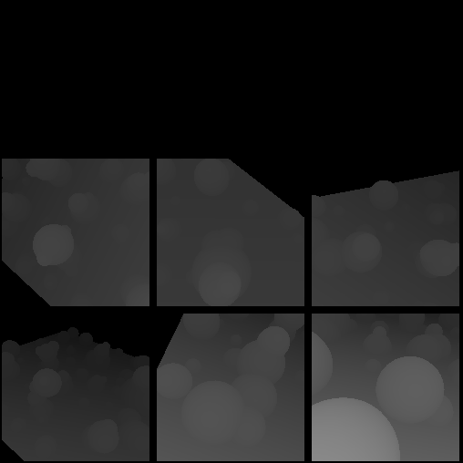

## 6.3 一个平铺块就是没有平铺

最后，如果我们最终只需要一个平铺块，那就没必要设置视口的裁减模式了。我们只需要在有多个平铺块时需要这么做。

```
		for (int i = 0; i < cull.visibleLights.Count; i++) {			… 			if (split > 1) {				shadowBuffer.SetViewport(tileViewport);				shadowBuffer.EnableScissorRect(new Rect(					tileViewport.x + 4f, tileViewport.y + 4f,					tileSize - 8f, tileSize - 8f				));			}			shadowBuffer.SetViewProjectionMatrices(viewMatrix, projectionMatrix);			… 			if (split > 1) {				var tileMatrix = Matrix4x4.identity;				tileMatrix.m00 = tileMatrix.m11 = tileScale;				tileMatrix.m03 = tileOffsetX * tileScale;				tileMatrix.m13 = tileOffsetY * tileScale;				worldToShadowMatrices[i] = tileMatrix * worldToShadowMatrices[i];			}			tileIndex += 1;		} 		if (split > 1) {			shadowBuffer.DisableScissorRect();		}
```

## 6.4 着色器关键字

目前，我们每个片元最多可以采样来自四个光源的阴影，它们可能是软硬光源的组合。最麻烦的情况就是4个软阴影，一共需采样36次。好在我们shader中的多个分支可以为我们很好的按要求采样阴影，因为来自同一物体的片元最终使用的是同一条分支。但是我们可以通过分离不同的阴影组合来切换复杂度更低的备选shader。

共有四种可能的组合，第一种是完全没有阴影，第二种只有硬阴影，第三种只有软阴影，最复杂的一种就是软硬阴影的组合。我们可以使用shader变种处理所有可能的情况，通过使用关键字*_SHADOWS_HARD* 和 *_SHADOWS_SOFT*。

在RenderShadows中，使用两个布尔变量记录是否使用了软硬阴影，我们依靠阴影信息的Y分量来判断。在循环之后使用这些布尔值切换关键字。

```
	const string shadowsHardKeyword = "_SHADOWS_HARD";	…		void RenderShadows (ScriptableRenderContext context) {		…				int tileIndex = 0;		bool hardShadows = false;		bool softShadows = false;		for (int i = 0; i < cull.visibleLights.Count; i++) {			…						if (shadowData[i].y <= 0f) {				hardShadows = true;			}			else {				softShadows = true;			}		} 		…		CoreUtils.SetKeyword(shadowBuffer, shadowsHardKeyword, hardShadows);		CoreUtils.SetKeyword(shadowBuffer, shadowsSoftKeyword, softShadows);		…	}
```

在shader添加另一个多重编译指令，这次是*_SHADOWS_HARD*。

```
			#pragma multi_compile _ _SHADOWS_HARD			#pragma multi_compile _ _SHADOWS_SOFT
```

在`ShadowAttenuation` 方法中，如果两个关键字都没定义就在一开始直接返回1。这样就可以截去方法的剩余部分，完美的取消阴影。

```
float ShadowAttenuation (int index, float3 worldPos) {	#if !defined(_SHADOWS_HARD) && !defined(_SHADOWS_SOFT)		return 1.0;	#endif	if (_ShadowData[index].x <= 0) {		return 1.0;	}	…}
```

为了让代码更整洁，我们将采样软阴影和硬阴影的代码各自分离成单独的方法。

```
float HardShadowAttenuation (float4 shadowPos) {	return SAMPLE_TEXTURE2D_SHADOW(_ShadowMap, sampler_ShadowMap, shadowPos.xyz);} float SoftShadowAttenuation (float4 shadowPos) {	real tentWeights[9];	real2 tentUVs[9];	SampleShadow_ComputeSamples_Tent_5x5(		_ShadowMapSize, shadowPos.xy, tentWeights, tentUVs	);	float attenuation = 0;	for (int i = 0; i < 9; i++) {		attenuation += tentWeights[i] * SAMPLE_TEXTURE2D_SHADOW(			_ShadowMap, sampler_ShadowMap, float3(tentUVs[i].xy, shadowPos.z)		);	}	return attenuation;} float ShadowAttenuation (int index, float3 worldPos) {	…	float attenuation;		if (_ShadowData[index].y == 0) {		attenuation = HardShadowAttenuation(shadowPos);	}	else {		attenuation = SoftShadowAttenuation(shadowPos);	}		return lerp(1, attenuation, _ShadowData[index].x);}
```

现在我们用关键字为其他三种情况填写代码。最开始的分支在两个关键字都定义时才有。

```
	#if defined(_SHADOWS_HARD)		#if defined(_SHADOWS_SOFT)			if (_ShadowData[index].y == 0) {				attenuation = HardShadowAttenuation(shadowPos);			}			else {				attenuation = SoftShadowAttenuation(shadowPos);			}		#else			attenuation = HardShadowAttenuation(shadowPos);		#endif	#else		attenuation = SoftShadowAttenuation(shadowPos);	#endif
```

最后，如果我们不需要阴影平铺块 ，在`**MyPipeline**.Render`里直接跳过`RenderShadows`方法。我们甚至都不需要清理阴影贴图了。如果我们跳过了，我们要确保两个阴影的关键字都关掉了。没有可见光时我们也要把两者关掉。

```
		if (cull.visibleLights.Count > 0) {			ConfigureLights();			if (shadowTileCount > 0) {				RenderShadows(context);			}			else {				cameraBuffer.DisableShaderKeyword(shadowsHardKeyword);				cameraBuffer.DisableShaderKeyword(shadowsSoftKeyword);			}		}		else {			cameraBuffer.SetGlobalVector(				lightIndicesOffsetAndCountID, Vector4.zero			);			cameraBuffer.DisableShaderKeyword(shadowsHardKeyword);			cameraBuffer.DisableShaderKeyword(shadowsSoftKeyword);		}
```

下个教程是[直射光阴影](https://catlikecoding.com/unity/tutorials/scriptable-render-pipeline/directional-shadows/)。