# 可编程渲染管线3 光照

原文：https://catlikecoding.com/unity/tutorials/scriptable-render-pipeline/lights/

- 执行漫反射着色
- 支持方向光、点光、聚光
- 支持每帧最多16个可见光源
- 为每个物体计算4个像素光源和4个顶点光源。

这是可编程渲染管线教程的第三章。这章我们将为物体提供漫反射光照支持。通过单个draw call，为每个物体添加最多八个着色光源。

该教程基于2018.2.11f1.

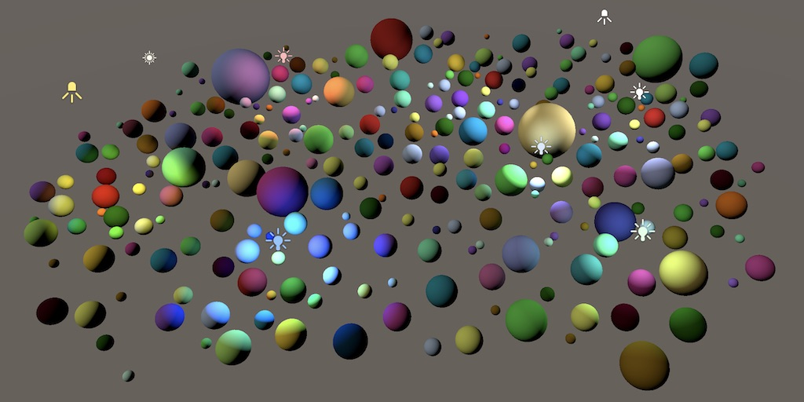

# 1 光照着色

为了支持光源，需要为我们的渲染管道添加光照着色器（lit  shader）。光照的复杂度可以从很简单（只包括光照漫反射）到很复杂（完整的基于物体着色）。他也可以是非真实的渲染风格，比如卡通着色。我们从一个最简单的lit  shader开始，它只会计算直射光的漫反射，并且没有阴影。

## 1.1 Lit Shader

复制一个Unlit.hlsl文件，并重命名为Lit.hlsl。在新文件代码中用单词lit替换原来的unlit，特别是相关的定义以及顶点片元函数名称。

```
#ifndef MYRP_LIT_INCLUDED#define MYRP_LIT_INCLUDED … VertexOutput LitPassVertex (VertexInput input) {	…} float4 LitPassFragment (VertexOutput input) : SV_TARGET {	…} #endif // MYRP_LIT_INCLUDED
```

同样复制Unlit.shader文件重命名为Lit.shader,并且用lit代替unlit。

```
Shader "My Pipeline/Lit" {		Properties {		_Color ("Color", Color) = (1, 1, 1, 1)	}		SubShader {				Pass {			HLSLPROGRAM						#pragma target 3.5						#pragma multi_compile_instancing			#pragma instancing_options assumeuniformscaling						#pragma vertex LitPassVertex			#pragma fragment LitPassFragment						#include "MyRP/ShaderLibrary/Lit.hlsl"						ENDHLSL		}	}}
```

> ### 我们不应该明确指明该pass为lit pass吗？
>
> 我们的渲染通道现在还很基础，暂时不用考虑分类专门的pass 

 现在可以用我们的新shader创建一个不透明的光照材质了，虽然实际上仍和先前的非光照着色器一样。

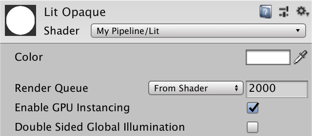

## 1.2 法向量

为了计算直射光的贡献度，我们需要知道表面法线。所以我们为顶点输入输出结构各自添加一条法线向量。关于光照计算的更多细节，请看[Rendering 4, The First Light](https://catlikecoding.com/unity/tutorials/rendering/part-4/)。

```
struct VertexInput {	float4 pos : POSITION;	float3 normal : NORMAL;	UNITY_VERTEX_INPUT_INSTANCE_ID}; struct VertexOutput {	float4 clipPos : SV_POSITION;	float3 normal : TEXCOORD0;	UNITY_VERTEX_INPUT_INSTANCE_ID};
```

在`LitPassVertex`内我们需要将法线从对象空间转到世界空间。如果我们假设物体只使用统一缩放，那使用模型矩阵的前3x3部分就可以了，接着在`LitPassFragment`里向量归一化。 如果想支持非统一缩放的物体，就得用世界到对象空间转换矩阵的转置矩阵代替了（也就是模型矩阵的逆转置矩阵）。

```
VertexOutput LitPassVertex (VertexInput input) {	…	output.normal = mul((float3x3)UNITY_MATRIX_M, input.normal);	return output;} float4 LitPassFragment (VertexOutput input) : SV_TARGET {	UNITY_SETUP_INSTANCE_ID(input);	input.normal = normalize(input.normal);	…}
```

为了检验我们是否得到了正确的法向量，将它当做最终的颜色输出。材质的颜色数据也不要删掉，之后我们会把他当做反照率使用的。

```
float4 LitPassFragment (VertexOutput input) : SV_TARGET {	UNITY_SETUP_INSTANCE_ID(input);	input.normal = normalize(input.normal);	float3 albedo = UNITY_ACCESS_INSTANCED_PROP(PerInstance, _Color).rgb;		float3 color = input.normal;	return float4(color, 1);}
```

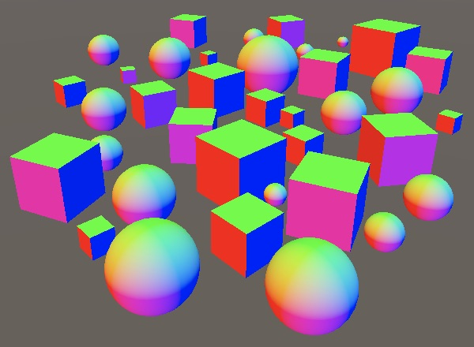

## 1.3 光照漫反射

光照对于漫反射的贡献度取决于光线照射表面的角度。可以通过计算表面法线和光源法线的点积，并将负值舍弃为0得到漫反射的强度。在方向光的情况下，光源方向是恒定的。所以我们直接写一个固定的向量来当做光源方向。给反照率乘以漫反射值来得到最终的颜色。

入射光从0°到90°角的漫反射衰减。

```
float4 LitPassFragment (VertexOutput input) : SV_TARGET {	UNITY_SETUP_INSTANCE_ID(input);	input.normal = normalize(input.normal);	float3 albedo = UNITY_ACCESS_INSTANCED_PROP(PerInstance, _Color).rgb;		float3 diffuseLight = saturate(dot(input.normal, float3(0, 1, 0)));	float3 color = diffuseLight * albedo;	return float4(color, 1);}
```

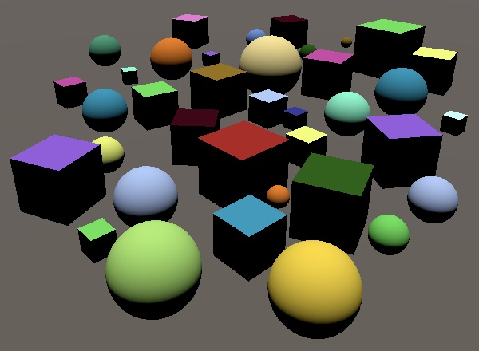

# 2 可见光

要想在场景中放置的光源能够生效，我们的管线得为GPU传送光照信息。因为场景中可能有多个光源，所以我们也得支持多光源渲染。该需求可以有多种实现方式。Unity默认的渲染管线是每个物体在渲染时，为每个光源单独计算一次pass，轻量级渲染管线则是对于每个物体，用一个pass渲染所有的光源。而高清渲染管线则是使用延迟渲染，先将所有物体的表面数据计算好放在一起，接着每个光照用一个pass来根据这些数据来渲染。

我们使用轻量级渲染管线的方法，对于每个物体，一次性渲染所有光源。我们要把所有当前可见光源的数据传递给GPU，但是若某一个光源没有影响任何渲染物体，则会被忽略。

## 2.1 光照缓冲区（Light Buffer）

将所有光照在同一个pass里渲染意外着我们需要同时得到所有光照数据。我们现在仅限使用方向光，所以需要知道的是每个光照的颜色和方向。为了支持任意数量的光照，我们将所有的数据存在一个数组里，我们可以放在一个独立的缓存区里，命名为_LightBuffer。在shader里定义数组和C#差不多，只不过在shader里，方括号应该放在变量名后面，而不是数组类型后面。

```
CBUFFER_START(UnityPerDraw)	float4x4 unity_ObjectToWorld;CBUFFER_END CBUFFER_START(_LightBuffer)	float4 _VisibleLightColors[];	float4 _VisibleLightDirections[];CBUFFER_END
```

然而，我们不能定义不定长数组。在定义数组是就必须声明好它的长度。让我们将数组长度设为4，这趟我们就能一次支持最大4个可见光了。将限制数量定义为宏可以方便观察。

```
#define MAX_VISIBLE_LIGHTS 4 CBUFFER_START(_LightBuffer)	float4 _VisibleLightColors[MAX_VISIBLE_LIGHTS];	float4 _VisibleLightDirections[MAX_VISIBLE_LIGHTS];CBUFFER_END
```

在光源缓冲区之后，添加一个DIffuseLight方法用于处理光源数据的计算。他需要传入光源序号和法向量，从数组中得到对应的光源数据，执行漫反射光照计算，返回他和光源颜色混合的结果。

```
CBUFFER_START(_LightBuffer)	float4 _VisibleLightColors[MAX_VISIBLE_LIGHTS];	float4 _VisibleLightDirections[MAX_VISIBLE_LIGHTS];CBUFFER_END float3 DiffuseLight (int index, float3 normal) {	float3 lightColor = _VisibleLightColors[index].rgb;	float3 lightDirection = _VisibleLightDirections[index].xyz;	float diffuse = saturate(dot(normal, lightDirection));	return diffuse * lightColor;}
```

在LitPassFragment里使用for循环来为每个光源调用该方法，将所有影响片元的光源漫反射累加在一起。

```
float4 LitPassFragment (VertexOutput input) : SV_TARGET {	…		float3 diffuseLight = 0;	for (int i = 0; i < MAX_VISIBLE_LIGHTS; i++) {		diffuseLight += DiffuseLight(i, input.normal);	}	float3 color = diffuseLight * albedo;	return float4(color, 1);}
```

注意虽然我们用了一个循环，但是shader编译器编译时很可能将其展开，只有我们的shader变得非常复杂事，编译器才可能真正将其作为循环编译。 

## 2.2填充缓存区

现在我们得到的是一个全黑的物体，因为我们还没有给GPU传递任何光源数据。我们在MyPipeline里添加相同大小的数组。用静态方法`**Shader**.PropertyToID` 来找到相关shader属性的标识符。这个shader标识符在每个阶段内是固定的，所有我们将其存在静态变量中。

```
	const int maxVisibleLights = 4;		static int visibleLightColorsId =		Shader.PropertyToID("_VisibleLightColors");	static int visibleLightDirectionsId =		Shader.PropertyToID("_VisibleLightDirections");		Vector4[] visibleLightColors = new Vector4[maxVisibleLights];	Vector4[] visibleLightDirections = new Vector4[maxVisibleLights];
```

> ### 为什么不使用`Color` 类型数组？
>
> 无法为GPU直接传递color类型数组。 `Vector4` 数组是最合适的替代项，它和shader里的数据类型匹配。我们可以直接将color类型传给这个数组，`Color` 和 `Vector4`之间存在隐式转换。

我们在命令行缓冲区中调用并执行 `SetGlobalVectorArray`方法来将数组拷贝到GPU中。我们已经有了`cameraBuffer`，所以直接在开启Render Camera采样之后用这个缓冲区调用方法。

```
		cameraBuffer.BeginSample("Render Camera");		cameraBuffer.SetGlobalVectorArray(			visibleLightColorsId, visibleLightColors		);		cameraBuffer.SetGlobalVectorArray(			visibleLightDirectionsId, visibleLightDirections		);		context.ExecuteCommandBuffer(cameraBuffer);		cameraBuffer.Clear();
```

## 2.3 配置光源

我们现在在每一帧都会给GPU传递光源数据，但是由于只是默认值，物体仍显示为黑色。需要在拷贝数据给GPU前配置好这只光源信息，让我们创建一个 `ConfigureLights`方法，在其中完成相关工作。

```
		cameraBuffer.ClearRenderTarget(			(clearFlags & CameraClearFlags.Depth) != 0,			(clearFlags & CameraClearFlags.Color) != 0,			camera.backgroundColor		); 		ConfigureLights(); 		cameraBuffer.BeginSample("Render Camera");
```

在剔除是，Unity同样会帮我们找出哪些光源对于相机可见。这个信息存储在剔除结果的`visibleLights`列表中。该列表元素是`VisibleLight`结构体，其中包含了所有我们需要的数据。在 `ConfigureLights`方法里我们获取并遍历该列表。

```
	void ConfigureLights () {		for (int i = 0; i < cull.visibleLights.Count; i++) {			VisibleLight light = cull.visibleLights[i];		}	}
```

`VisibleLight.finalColor`字段存储了转换到正确色彩空间的光照颜色（颜色乘以强度）我们可以用相同索引拷贝到`visibleLightColors`中。

```
			VisibleLight light = cull.visibleLights[i];			visibleLightColors[i] = light.finalColor;
```

然而，Unity默认认为光照强度的值是定义在伽马空间中的，即使我们使用线性空间。这是Unity默认渲染管线遗留下的情况。新的渲染管线会将他作为线性值。通过一个布尔类型`GraphicsSettings.lightsUseLinearIntensity`来把控。它是一个只能通过代码调节的项目设置。我们设置一次即可，因此放在MyPipeline的构造函数中。

```
	public MyPipeline (bool dynamicBatching, bool instancing) {		GraphicsSettings.lightsUseLinearIntensity = true;		…	}
```

改变该设置只有重应用图形设置后才会生效。只有进入和退出play模式才会应用，不会自动发生。

除此之外，方向光的方向取决于它的旋转角度。光线延本地z轴发射。我们通过`VisibleLight.localtoWorld`矩阵找到它在世界空间的方向向量。这个矩阵的第三列定义了本地z轴方向。我们可以通过调用`Matrix4x4.GetColumn`方法并传入索引2来得到该向量。

我们现在有了光线发射方向，但是shader中需要的是表面到光源的方向。所以我们需要在将该向量赋值给 `visibleLightDirections`前对其取反。向量的w值永远为0，所以我们只需要对xyz取反。

```
			VisibleLight light = cull.visibleLights[i];			visibleLightColors[i] = light.finalColor;			Vector4 v = light.localToWorld.GetColumn(2);			v.x = -v.x;			v.y = -v.y;			v.z = -v.z;			visibleLightDirections[i] = v;
```

我们的物体现在可以根据主方向光的颜色和方向着色了（假设你在场景里没有其他光源）。如果你的场景里没有光源，那就自己加一个方向光。

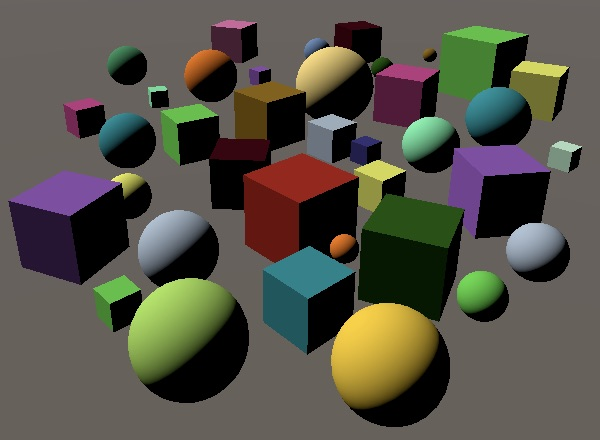一个光源

但是哪怕我们在场景里只有一个光源，我们的shader也会计算四个光源的光照贡献。就是说，你再加三个光源GPU也是同样的工作量。

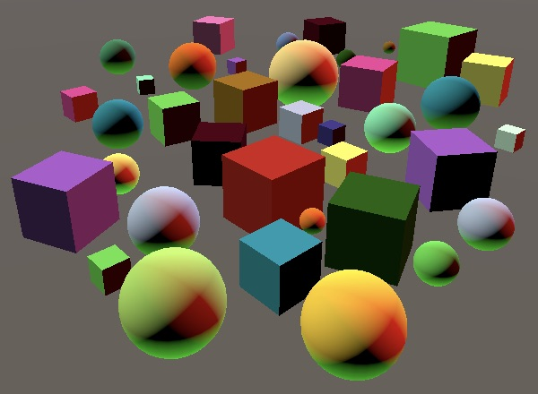四个光源

你可以在frame debugger里检视传给GPU的光源数据。选择其中一个使用我们shader的drawcall，展开向量数组观察他的内容。

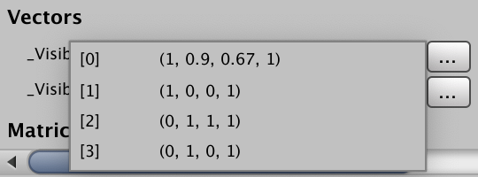

## 2.4 改变灯的数量

当我们只使用四个光源时，一切正常。只要保证统一时间只有四个可见光源，我们甚至可以在场景中放置更多的光源。但是一旦可见光源数量一旦超出四个，那么我们的pipeline就会报数组越界的异常。我们只最多支持4个光源，但Unity在剔除是不会替我们考虑这一点。所以 `visibleLights`有可能比我们数组的元素数量要多。所以我们在超出最大值时打断循环，当然这可能会忽视一些可见光源。

```
		for (int i = 0; i < cull.visibleLights.Count; i++) {			if (i == maxVisibleLights) {				break;			}			VisibleLight light = cull.visibleLights[i];			…		}
```

> ### 哪些光源会被忽略？
>
> 我们简单的跳过了列表末端的光源。光源按一定的权重进行排序（光源类型、强度、是否开启阴影等）。你可以认为这些光源从最重要的排到最不重要的。比如，最亮的开启阴影的方向光，将会是列表的第一个元素。

当减少可见光源后，另一件奇怪的事发生了。它们还是在照射物体，那是因为我们没有重置数据。我们可以在结束可见光源循环之后再来一个循环，用于清除不在使用的光源的颜色。

```
		int i = 0;		for (; i < cull.visibleLights.Count; i++) {			…		}		for (; i < maxVisibleLights; i++) {			visibleLightColors[i] = Color.clear;		}
```

# 3 点光源 

我们现在只支持方向光，但是场景中一般由单个方向光，以及额外的多个点光源组成。目前在场景中添加点光源，效果和方向光相同。让我们就来解决这个问题。

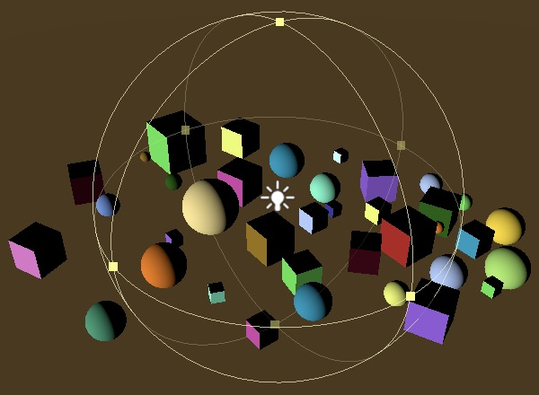

[Rendering 5, Multiple Lights](https://catlikecoding.com/unity/tutorials/rendering/part-5/) 讲解了点光和聚光，但是用的是Unity默认渲染管线的旧方法。在这里我们用的是轻量级渲染管线的方法。

## 3.1光源位置

不像方向光，点光源需要的是位置信息。相比为位置再单独分配一个数组，我们将方向和位置信息存储在同一数组中，每一个数组元素可能是方向也可能是位置。在MyPipeline中重命名相应的变量。

```
	static int visibleLightColorsId =		Shader.PropertyToID("_VisibleLightColors");	static int visibleLightDirectionsOrPositionsId =		Shader.PropertyToID("_VisibleLightDirectionsOrPositions"); 	Vector4[] visibleLightColors = new Vector4[maxVisibleLights];	Vector4[] visibleLightDirectionsOrPositions = new Vector4[maxVisibleLights];
```

在`ConfigureLights`方法中，可以用`VisibleLight.lightType`来检查每个光源的类型。如果是方向光，就存储方向，不然的话就存储光源的世界位置，我们可以通过本地-世界矩阵的第四列得到位置向量。

```
			if (light.lightType == LightType.Directional) {				Vector4 v = light.localToWorld.GetColumn(2);				v.x = -v.x;				v.y = -v.y;				v.z = -v.z;				visibleLightDirectionsOrPositions[i] = v;			}			else {				visibleLightDirectionsOrPositions[i] =					light.localToWorld.GetColumn(3);			}
```

shader中的数组也重新命名。在`DiffuseLight`方法，我们先假设在处理方向光。

```
CBUFFER_START(_LightBuffer)	float4 _VisibleLightColors[MAX_VISIBLE_LIGHTS];	float4 _VisibleLightDirectionsOrPositions[MAX_VISIBLE_LIGHTS];CBUFFER_END float3 DiffuseLight (int index, float3 normal) {	float3 lightColor = _VisibleLightColors[index].rgb;	float4 lightPositionOrDirection = _VisibleLightDirectionsOrPositions[index];	float3 lightDirection = lightPositionOrDirection.xyz;	float diffuse = saturate(dot(normal, lightDirection));	return diffuse * lightColor;}
```

但如果我们处理的是点光源，那就得自己计算光线方向了。我们先给方法添加额外一个参数，通过光源位置减去表面世界位置来得到世界空间的光线向量，接着将其归一化得到光线方向。

```
float3 DiffuseLight (int index, float3 normal, float3 worldPos) {	float3 lightColor = _VisibleLightColors[index].rgb;	float4 lightPositionOrDirection = _VisibleLightDirectionsOrPositions[index];	float3 lightVector =		lightPositionOrDirection.xyz - worldPos;	float3 lightDirection = normalize(lightVector);	float diffuse = saturate(dot(normal, lightDirection));	return diffuse * lightColor;}
```

这适用于点光源却不适合方向光。我们可用同一计算处理二者。那就是令世界位置乘以光源方向或位置向量的w分量。表示位置（点）时w分量为1，结果不变，如果它是方向(向量），w分量为0，正好消除了减法。接着，我们在两种情况中都将向量归一化，虽然如果是方向光，归一化是多余的，但不值得为此设置分支。

```
		lightPositionOrDirection.xyz - worldPos * lightPositionOrDirection.w;
```

想用该方法，就得在 `LitPassFragment`函数里获取片元的世界位置。我们已经在里知道了，所以只需要作为一个额外的输出项传过来即可。

```
struct VertexOutput {	float4 clipPos : SV_POSITION;	float3 normal : TEXCOORD0;	float3 worldPos : TEXCOORD1;	UNITY_VERTEX_INPUT_INSTANCE_ID}; VertexOutput LitPassVertex (VertexInput input) {	…	output.worldPos = worldPos.xyz;	return output;} float4 LitPassFragment (VertexOutput input) : SV_TARGET {	…		float3 diffuseLight = 0;	for (int i = 0; i < MAX_VISIBLE_LIGHTS; i++) {		diffuseLight += DiffuseLight(i, input.normal, input.worldPos);	}	float3 color = diffuseLight * albedo;	return float4(color, 1);}
```

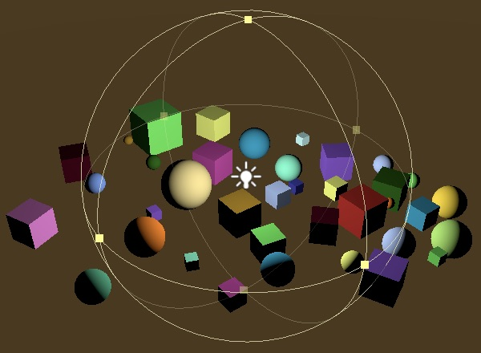

## 3.2距离衰减

除了方向光（它假设来自无穷远的地方），光照强度会随着距离衰减。关系式为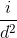,i为设置的光照强度，d为光源到表面的距离。这称之为反平方定律（inverse-square law）。所以我们给最终的漫反射贡献度除以光源向量的平方。为了避免除以0，我们对所使用的平方距离限制一个微小的最小值。

```
	float diffuse = saturate(dot(normal, lightDirection));		float distanceSqr = max(dot(lightVector, lightVector), 0.00001);	diffuse /= distanceSqr;		return diffuse * lightColor;
```

> ###  当里点光源很近时，光照强度不会增强吗？
>
> 确实，当d小于0时，光照强度反而会变大。当d接近最小值是，会产生非常大的强度值。
>
> Unity的默认渲染管线使用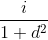来避免亮度的提升，但是这回事靠近光源的地方太暗，显得不真实。轻量级渲染管线一开始也使用这种衰减的，不过3.3.0版本后就开始使用正确的平方衰减了。
>
> 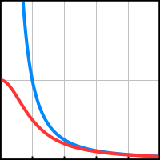
>
>  和 

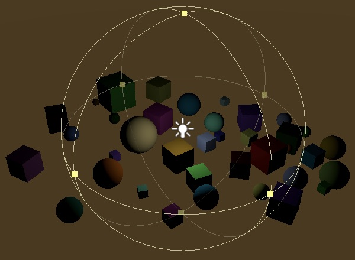

对于方向光，光向量和方向向量相同，距离平方恒为1，也就是说方向光恰好不会受到距离衰减。

## 3.3光照距离

点光源还有一个可配置的光照范围，用于限制光源可以影响的区域。区域外的物体不会受到光源的影响，即使理论上可以照亮。这不是很真实，但是它可以很好限制光源影响的物体数量。如果没有这个范围限制，那么点光源就和直射光一样会影响场景中的所有物体了。

在限制范围外光线不能不能突然消失，与之相反，应该根据距离的平方平滑的过渡光源强度。轻量级渲染光线和光照贴图使用，r是光照的范围。我们也使用相同的渐变曲线。

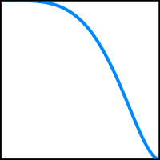

光照范围值场景数据的一部分，我们得把每个光源的范围传给GPU。用另外单独的数组存储这些衰减数据。理论上float类型数组已经足够，但考虑到后面要存别的数据，我们仍然使用vector类型数组。

```
	static int visibleLightColorsId =		Shader.PropertyToID("_VisibleLightColors");	static int visibleLightDirectionsOrPositionsId =		Shader.PropertyToID("_VisibleLightDirectionsOrPositions");	static int visibleLightAttenuationsId =		Shader.PropertyToID("_VisibleLightAttenuations"); 	Vector4[] visibleLightColors = new Vector4[maxVisibleLights];	Vector4[] visibleLightDirectionsOrPositions = new Vector4[maxVisibleLights];	Vector4[] visibleLightAttenuations = new Vector4[maxVisibleLights];
```

同样在Render方法里拷贝给GPU。

```
		cameraBuffer.SetGlobalVectorArray(			visibleLightDirectionsOrPositionsId, visibleLightDirectionsOrPositions		);		cameraBuffer.SetGlobalVectorArray(			visibleLightAttenuationsId, visibleLightAttenuations		);
```

在ConfigureLights里填充数据。直射光没有范围限制，我们用零向量表示，对于点光源我们将范围数据放在向量的x分量中。与其直接储存数据，我们存储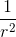,并限制最小值避免为0,来减少shader需要做的工作。

```
			Vector4 attenuation = Vector4.zero; 			if (light.lightType == LightType.Directional) {				…			}			else {				visibleLightDirectionsOrPositions[i] =					light.localToWorld.GetColumn(3);				attenuation.x = 1f /					Mathf.Max(light.range * light.range, 0.00001f);			}						visibleLightAttenuations[i] = attenuation;
```

在shader中添加新数组，计算由范围引起的渐变过渡，将渐变因子算入最后的漫反射贡献中去。

```
CBUFFER_START(_LightBuffer)	float4 _VisibleLightColors[MAX_VISIBLE_LIGHTS];	float4 _VisibleLightDirectionsOrPositions[MAX_VISIBLE_LIGHTS];	float4 _VisibleLightAttenuations[MAX_VISIBLE_LIGHTS];CBUFFER_ENDfloat3 DiffuseLight (int index, float3 normal, float3 worldPos) {	float3 lightColor = _VisibleLightColors[index].rgb;	float4 lightPositionOrDirection = _VisibleLightDirectionsOrPositions[index];	float4 lightAttenuation = _VisibleLightAttenuations[index];		float3 lightVector =		lightPositionOrDirection.xyz - worldPos * lightPositionOrDirection.w;	float3 lightDirection = normalize(lightVector);	float diffuse = saturate(dot(normal, lightDirection));		float rangeFade = dot(lightVector, lightVector) * lightAttenuation.x;	rangeFade = saturate(1.0 - rangeFade * rangeFade);	rangeFade *= rangeFade;		float distanceSqr = max(dot(lightVector, lightVector), 0.00001);	diffuse *= rangeFade / distanceSqr;		return diffuse * lightColor;}
```

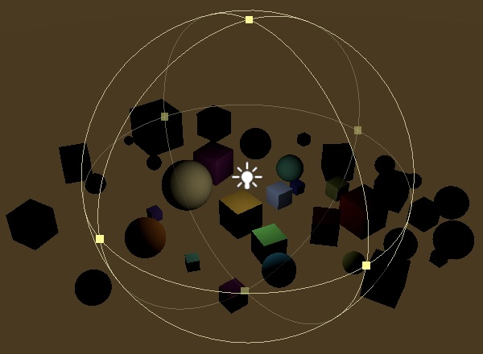

直射光仍然不受影响，因为 `lightAttenuation.**x**` 恒为0，`rangeFade`恒为1。

# 4 聚光源

轻量级渲染管线支持聚光灯，我们也引入该类光源。聚光和点光类似，但是光线被限制在锥形而不是向所有方向照射。

## 4.1 聚光方向

像方向光一样，聚光光线沿着本地z轴发射，只不过光线限制在一个锥形里。它也需要位置信息，所以对于聚光灯而言，位置和方向两者缺一不可。所以在MyPipeline中为聚光源添加额外的数组。

```
	static int visibleLightAttenuationsId =		Shader.PropertyToID("_VisibleLightAttenuations");	static int visibleLightSpotDirectionsId =		Shader.PropertyToID("_VisibleLightSpotDirections"); 	Vector4[] visibleLightColors = new Vector4[maxVisibleLights];	Vector4[] visibleLightDirectionsOrPositions = new Vector4[maxVisibleLights];	Vector4[] visibleLightAttenuations = new Vector4[maxVisibleLights];	Vector4[] visibleLightSpotDirections = new Vector4[maxVisibleLights];		…		void Render (ScriptableRenderContext context, Camera camera) {		…			cameraBuffer.SetGlobalVectorArray(			visibleLightAttenuationsId, visibleLightAttenuations		);		cameraBuffer.SetGlobalVectorArray(			visibleLightSpotDirectionsId, visibleLightSpotDirections		);		…	}
```

在`ConfigureLights`,中，排除完方向光后还得判断是否为聚光源。如果是，像方向光一样设置方向向量，只不过是赋值给`visibleLightSpotDirections` 。

```
			if (light.lightType == LightType.Directional) {				Vector4 v = light.localToWorld.GetColumn(2);				v.x = -v.x;				v.y = -v.y;				v.z = -v.z;				visibleLightDirectionsOrPositions[i] = v;			}			else {				visibleLightDirectionsOrPositions[i] =					light.localToWorld.GetColumn(3);				attenuation.x = 1f /					Mathf.Max(light.range * light.range, 0.00001f); 				if (light.lightType == LightType.Spot) {					Vector4 v = light.localToWorld.GetColumn(2);					v.x = -v.x;					v.y = -v.y;					v.z = -v.z;					visibleLightSpotDirections[i] = v;				}			}
```

同样给shader添加新数据

```
CBUFFER_START(_LightBuffer)	float4 _VisibleLightColors[MAX_VISIBLE_LIGHTS];	float4 _VisibleLightDirectionsOrPositions[MAX_VISIBLE_LIGHTS];	float4 _VisibleLightAttenuations[MAX_VISIBLE_LIGHTS];	float4 _VisibleLightSpotDirections[MAX_VISIBLE_LIGHTS];CBUFFER_END float3 DiffuseLight (int index, float3 normal, float3 worldPos) {	float3 lightColor = _VisibleLightColors[index].rgb;	float4 lightPositionOrDirection = _VisibleLightDirectionsOrPositions[index];	float4 lightAttenuation = _VisibleLightAttenuations[index];	float3 spotDirection = _VisibleLightSpotDirections[index].xyz;		…}
```

## 4.2 角度衰减

聚光源的锥体通过小于180度的正角定义。我们可以通过聚光灯的方向和光线方向的点乘结果来判断一个点是否在锥体里。如果结果小于对应聚光灯角度的半角cos值，就说明该点受到光源的影响。

在锥体的边缘，光照不能戛然而止。与之相反，我们也得有一个用于渐变的过渡范围。这个范围可以通过一个表示渐变开始的小角以及光照强度为0时的大角来定义。Unity的聚光源只允许我们设置偏外的大角。Unity默认管线使用光照cookie来控制衰减，而轻量渲染管线假定大小角存在固定的关系，并用一个函数来表达计算衰减。

确定衰减首先就得将聚光源的半角从角度制转为弧度制，以便计算cos值。这个配置角度可以通过`VisibleLight.spotAngle`得到。

```
				if (light.lightType == LightType.Spot) {					…										float outerRad = Mathf.Deg2Rad * 0.5f * light.spotAngle;					float outerCos = Mathf.Cos(outerRad);				}
```

轻量级渲染管线和光照贴图大小角的关系式为：（ri为偏内的小角，ro为偏外的大角）。我们需要的是小角的cos值，所以计算公式为。

```
					float outerRad = Mathf.Deg2Rad * 0.5f * light.spotAngle;					float outerCos = Mathf.Cos(outerRad);					float outerTan = Mathf.Tan(outerRad);					float innerCos =						Mathf.Cos(Mathf.Atan((46f / 64f) * outerTan));
```

基于角度的衰变被定义为的的乘方（为聚光方向和光线方向的点乘） 

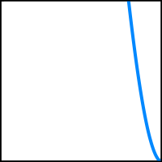0到45到90度的衰减

可以将表达式简化为;,.这样我们就可以在ConfigureLights方法里计算ab，将其存到衰减向量数据的后两个分量，减少shader的计算工作。

```
					float outerRad = Mathf.Deg2Rad * 0.5f * light.spotAngle;					float outerCos = Mathf.Cos(outerRad);					float outerTan = Mathf.Tan(outerRad);					float innerCos =						Mathf.Cos(Mathf.Atan(((64f - 18f) / 64f) * outerTan));					float angleRange = Mathf.Max(innerCos - outerCos, 0.001f);					attenuation.z = 1f / angleRange;					attenuation.w = -outerCos * attenuation.z;
```

在shader中，经过点乘、乘法、加法、saturation、乘方之后得到聚光渐变因子，再用这个因子调整漫反射强度。

```
	float rangeFade = dot(lightVector, lightVector) * lightAttenuation.x;	rangeFade = saturate(1.0 - rangeFade * rangeFade);	rangeFade *= rangeFade;		float spotFade = dot(spotDirection, lightDirection);	spotFade = saturate(spotFade * lightAttenuation.z + lightAttenuation.w);	spotFade *= spotFade;		float distanceSqr = max(dot(lightVector, lightVector), 0.00001);	diffuse *= spotFade * rangeFade / distanceSqr;
```

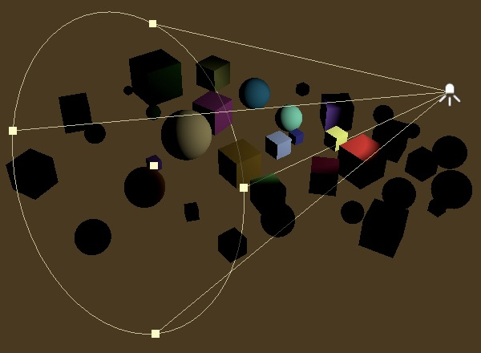

为了避免聚光衰减计算影响其他的光源，将衰减向量的默认w分量设为1（这样其他光源的聚光衰减恒为1）。

```
			Vector4 attenuation = Vector4.zero;			attenuation.w = 1f;
```

> ###  区域光怎么办？
>
> Unity轻量渲染光线和默认管线都不支持实时区域光，所以我们也一样。但区域光可以用在光照贴图中，我们之后会进行支持。

# 5 每个物体的光源

目前我们为每个物体支持最多四个光源。实际上，即使不需要，我们也总是为每个物体计算四次光照（即使后面几个光源数据是表示空的默认值）。比如，在9x9网格81个球体中，用四个点光源照亮四角。让每个光源刚好覆盖网格的四分之一，这样大多数网格只受到1个光源影响，部分是2个或完全没有。

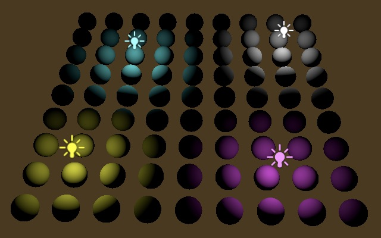

此时，81个球体用一个drawcall渲染（假设开启GPU实例），但是每个球体都会计算四次光照。如果我们可以让每个球体只计算次数和受产生影响的光源数量。这样还能提高支持的可见光数量。

## 5.1 光源索引

在剔除阶段，Unity会判断哪些光源可见，这其中就会涉及到整理每个物体都受到哪些光源的影响。我们可以要求Unity将这个信息以光照索引列表的形式传给GPU。

Unity支持两种光照索引的格式。第一种是为每个物体设置2个float4类型的变量去存储最多八个索引。第二个方法是将所有物体的光照索引存在单个缓冲区中(类似GPU实例的储存方式)。可惜第二种方法在2018.3里不够完善，我们只能使用第一种方法。虽然不是很理想，但目前也只能使用第一种方法了。

我们将绘制设置的的 `rendererConfiguration` 字段赋值`RendererConfiguration.PerObjectLightIndices8`来设置光源索引。

> PS：关于这个字段，我用的2018.3.2版本，当场景中光源为0时，会导致Unity崩溃，因此最好加一个判断
>
> ```
> if (cull.visibleLights.Count > 0){//=0时 设置Unity会奔溃的    drawSettings.rendererConfiguration = RendererConfiguration.PerObjectLightIndices8;}
> ```

```
		var drawSettings = new DrawRendererSettings(			camera, new ShaderPassName("SRPDefaultUnlit")		) {			flags = drawFlags,			rendererConfiguration = RendererConfiguration.PerObjectLightIndices8		};		//drawSettings.flags = drawFlags;		drawSettings.sorting.flags = SortFlags.CommonOpaque;
```

Unity现在会为每个物体设置额外的GPU数据，这会影响到GPU实例化功能。Unity会尝试将受同一光源影响的物体分为一组，不过距离仍是分组的首要因素。另外光源索引会按照对于每个物体的重要程度排序，这会进一步分离渲染批次。在例子中，最终产生了30个drawcall，虽然比1大很多，但是总比81个要好。

在shader中，可以通过`unity_4LightIndices0`和 `unity_4LightIndices1`得到索引，它属于缓存区。除此之外，还有一个float4类型的unity_LightIndicesOffsetAndCount。它的y分量表示物体受影响的光源数量。x分量是第二种方法要用到的偏移量，我们不用理它。

```
CBUFFER_START(UnityPerDraw)	float4x4 unity_ObjectToWorld;	float4 unity_LightIndicesOffsetAndCount;	float4 unity_4LightIndices0, unity_4LightIndices1;CBUFFER_END
```

现在我们实现只调用必要次数的`DiffuseLight`。我们需取回正确的光源序列。目前支持最多四个光源，所以我们在`unity_4LightIndices0中`就可以获取所有合适的数据。

```
	for (int i = 0; i < unity_LightIndicesOffsetAndCount.y; i++) {		int lightIndex = unity_4LightIndices0[i];		diffuseLight +=			DiffuseLight(lightIndex, input.normal, input.worldPos); 	}
```

虽然视觉上没有变化（假设不超过四个光源），但是GPU省去了不少工作，因为只需要计算必要的光源了。我们使用frame  debugger来检查最终每个drawcall有多少光源。因为我们使用变量而不是常量循环，所以shader变复杂了。最终效果会更好还是更糟无法确定，但是可以确定的是我们支持的可见光越多，新方法的效果越好。

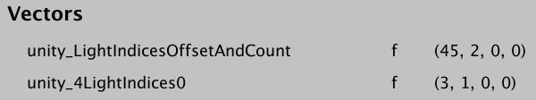一个物体受到了两个光源的影响，分别为和1.

注意我们不在永远循环最多可见光的情况了，自然也就没必要在结束时清理无用的光照数据。

```
	void ConfigureLights () {		//int i = 0;		for (int i = 0; i < cull.visibleLights.Count; i++) {			…		}		//for (; i < maxVisibleLights; i++) {		//	visibleLightColors[i] = Color.clear;		//}	}
```

## 5.2 更多的可见光 

新的光源计算方式让我可以支持更多的可见光而不必担心随之而来的GPU工作大量增加。我们和轻量级渲染管线一样，将限制数量提升到16。这要求我们在每一帧给GPU传递更多的数据，但是实际上大多数物体只受到小部分光源的影响。调整shader中MAX_VISIBLE_LIGHTS的值

```
#define MAX_VISIBLE_LIGHTS 16
```

以及MyPipeline中的maxVisibleLights。

```
	const int maxVisibleLights = 16;
```

重新编译后，Unity会警告我们超出了原有数组大小。我们不能立刻改变在shader里的一个定长数组。这是属于图形API的限制，不是我们自己能够修改的。在新长度可以使用前需重启应用，所以让我们重启Unity编辑器。

在准备给场景添加更多光源前，我们得明白`unity_4LightIndices0`只包含了前四个光源，但是我们把光源限制提升到了16个，物体可能会受多于四个光源的影响。为避免错误的结果，我们需确保循环不超过4。

```
	for (int i = 0; i < min(unity_LightIndicesOffsetAndCount.y, 4); i++) {		int lightIndex = unity_4LightIndices0[i];		diffuseLight +=			DiffuseLight(lightIndex, input.normal, input.worldPos);	}
```

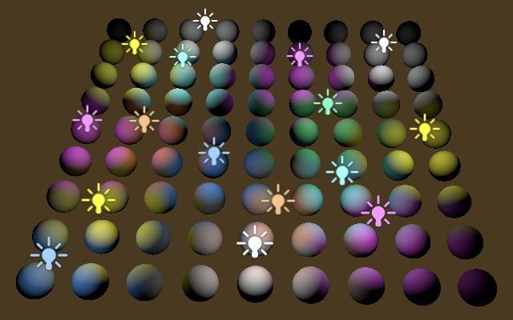

我们没必要限制每个物体最多四个光源。我们还有 `unity_4LightIndices1`存储着另外四个光源序列。我们在第一个循环后面再接一个循环，从序列4开始获取光源序列。这样每个物体的最多可接受光源升到了8个。我们应确保不超过8，因为物体可能受到超过8个光源的影响（但是超过的数据我们并没有传给GPU）。

```
	for (int i = 0; i < min(unity_LightIndicesOffsetAndCount.y, 4); i++) {		int lightIndex = unity_4LightIndices0[i];		diffuseLight +=			DiffuseLight(lightIndex, input.normal, input.worldPos);	}	for (int i = 4; i < min(unity_LightIndicesOffsetAndCount.y, 8); i++) {		int lightIndex = unity_4LightIndices1[i - 4];		diffuseLight +=			DiffuseLight(lightIndex, input.normal, input.worldPos);	}
```

 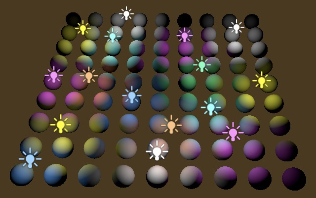

光源序列按照重要程度排序，通常来讲第二组的四个光源不会像第一组那样明显。当然，大多数物体也不会受到那么多光源的影响。我们可以暂时的禁用第一个循环来观察第二个循环的的四个光源有何不同。

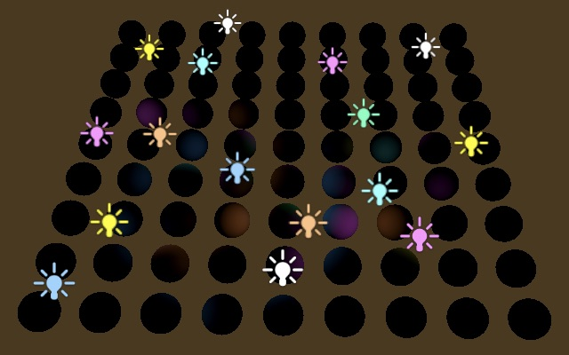

## 5.3 顶点光源

第二组四个光源在视觉表现上远没有第一组那么重要，我们可以把它们作为顶点光源计算来降低开销。顶点光源最终的光源贡献会通过各个顶点线性插值得到。虽然精度会降低，但是只要光线距离和三角面边缘长度比例合理，对于微小的漫反射光，效果还是可以接受的。

我们可以对顶点光源和像素光源数量进行精确的调整，但是在例子里我们就简单的将第二组光源放入 `LitPassVertex`函数，调整一下使用的变量即可。这样我们就支持各自最多四个顶点光源和像素光源顶点。光源数据得添加到VertexOutput结构中输出，用法和在`LitPassFragment`里一样，使用`diffuseLight`初始化。

```
struct VertexOutput {	float4 clipPos : SV_POSITION;	float3 normal : TEXCOORD0;	float3 worldPos : TEXCOORD1;	float3 vertexLighting : TEXCOORD2;	UNITY_VERTEX_INPUT_INSTANCE_ID}; VertexOutput LitPassVertex (VertexInput input) {	VertexOutput output;	UNITY_SETUP_INSTANCE_ID(input);	UNITY_TRANSFER_INSTANCE_ID(input, output);	float4 worldPos = mul(UNITY_MATRIX_M, float4(input.pos.xyz, 1.0));	output.clipPos = mul(unity_MatrixVP, worldPos);	output.normal = mul((float3x3)UNITY_MATRIX_M, input.normal);	output.worldPos = worldPos.xyz;		output.vertexLighting = 0;	for (int i = 4; i < min(unity_LightIndicesOffsetAndCount.y, 8); i++) {		int lightIndex = unity_4LightIndices1[i - 4];		output.vertexLighting +=			DiffuseLight(lightIndex, output.normal, output.worldPos);	} 	return output;} float4 LitPassFragment (VertexOutput input) : SV_TARGET {	UNITY_SETUP_INSTANCE_ID(input);	input.normal = normalize(input.normal);	float3 albedo = UNITY_ACCESS_INSTANCED_PROP(PerInstance, _Color).rgb;		float3 diffuseLight = input.vertexLighting;	for (int i = 0; i < min(unity_LightIndicesOffsetAndCount.y, 4); i++) {		…	}	//for (int i = 4; i < min(unity_LightIndicesOffsetAndCount.y, 8); i++) {	//	…	//}	float3 color = diffuseLight * albedo;	return float4(color, 1);}
```

## 5.4 多余的可见光

我们现在已经最多支持16个可见光(最重要的前16个，但每个物体最多接受其中任意8个)了，对于场景中的光照而言足够了，但实际上我们还是可以放置更多的光源。这种情况发生时，总体而言最不重要的光源会在渲染中消失。单这只是因为我们没有将多出来的数据传给shader。Unity并不知道这一点，也不会为我们从每个物体的光源序列列表中抹去这些光源。从而最终导致一些光源序列超出范围。为了避免这一点，我们得让Unity知道我们忽视了部分光源。

我们可以调用剔除结果的`GetLightIndexMap`方法得到可视光的序列列表。Unity允许我们进行微调，通过 `SetLightIndexMap`方法重新赋值。Unity整理每个物体的光源序列时会跳过所有被设为-1的光源。在 `ConfigureLights`的最后，我们为所有超出最大容量的光源执行这一操作。

```
	void ConfigureLights () {		for (int i = 0; i < cull.visibleLights.Count; i++) {			…		} 		int[] lightIndices = cull.GetLightIndexMap();		for (int i = maxVisibleLights; i < cull.visibleLights.Count; i++) {			lightIndices[i] = -1;		}		cull.SetLightIndexMap(lightIndices);	}
```

我们只需要在可见光超出规定数量时执行这一操作，没必要每次都执行。

```
		if (cull.visibleLights.Count > maxVisibleLights) {			int[] lightIndices = cull.GetLightIndexMap();			for (int i = maxVisibleLights; i < cull.visibleLights.Count; i++) {				lightIndices[i] = -1;			}			cull.SetLightIndexMap(lightIndices);		}
```

可惜每次调用GetLightIndexMap都会创建一个新数组，也就意味着在有过多可见光的每一帧，我们的pipeline都会为此分配内存。我们目前还不能做任何事情来避免，但未来Unity会为我们提供一个可以避免分配的`GetLightIndexMax`替代方法。

下个教程是[聚光源阴影](https://catlikecoding.com/unity/tutorials/scriptable-render-pipeline/spotlight-shadows/)