# 可编程渲染管线6 透明度

原文：https://catlikecoding.com/unity/tutorials/scriptable-render-pipeline/transparency/

- 执行透明度测试
- 渲染双面网格
- 支持不同的混合模式
- 生成双面网格
- 使用预设创建着色器GUI

这是可编程渲染管线的第六部分，添加对透明度裁切和半透明材质的支持。

该教程基于 Unity 2018.3.0f2

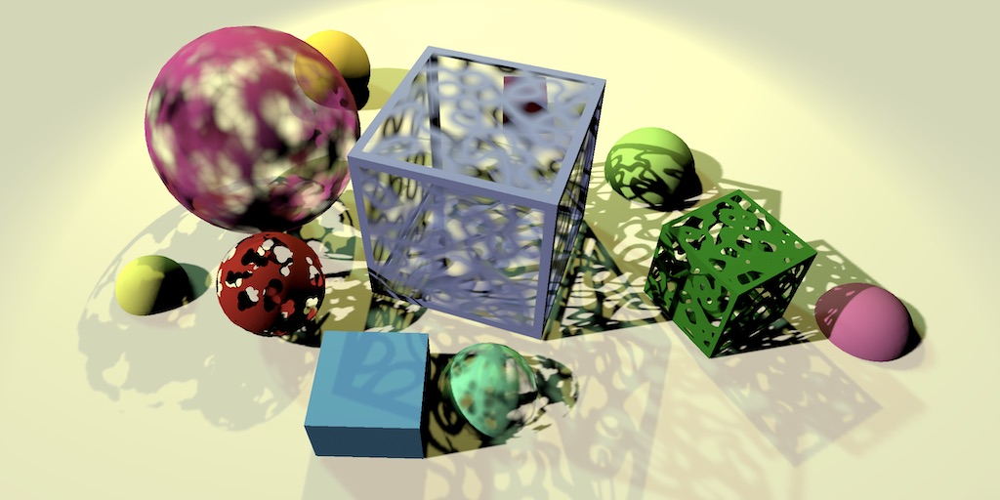

不透明、裁剪、渐显材质的混合，三者都投射且接收阴影

# 1、透明度测试（Alpha Clipping）

正如在 [Rendering 11, Transparency](https://catlikecoding.com/unity/tutorials/rendering/part-11/)讲到的那样，利用alpha贴图舍弃部分片元来给几何体剪个洞是完全可行的。我们将这个技术称之为透明度裁减、透明度测试或者剪切渲染。除了会舍弃部分片元，它的渲染方式和不透明几何体的完全相同。所以我们只需要略微调整我们的着色器，就可以实现开启透明度测试的物体渲染。

## 1.1 alpha贴图

只有当物体表面的透明度各不相同时，透明度测试才有意义。最直接的实现方式就是使用alpha贴图。这里一共准备了两张贴图，一张适用于四边形或立方体这类正方几何体，另一张则是为球体所准备。


导入纹理并指明它们的alpha通道表示透明度，RGB通道则统一设为白色来避免影响材质的显示。

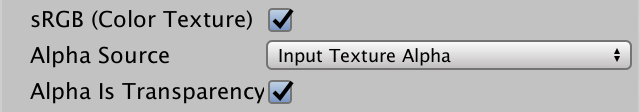

## 1.2 纹理

为Lit着色器添加一个主纹理属性。我们使用它作为反照率和透明度的来源。默认为纯白色。

```
	Properties {		_Color ("Color", Color) = (1, 1, 1, 1)		_MainTex("Albedo & Alpha", 2D) = "white" {}	}
```

使用合适的纹理创建两个材质，一个用于球体一个用于正方体，

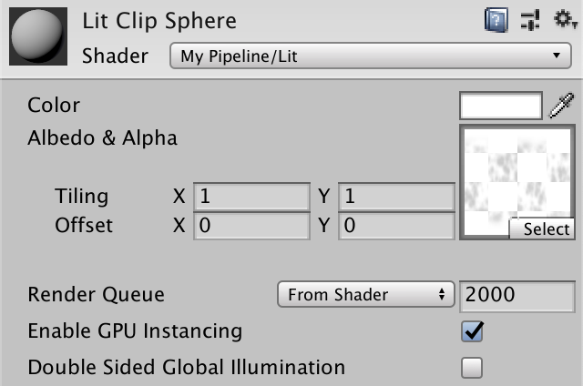

在Lit包含文件中为主贴图和它的采样器添加声明。就像之前的阴影贴图一样，只不过这里我们使用普通的`**TEXTURE2D**`和`**SAMPLER**`。

```
TEXTURE2D_SHADOW(_CascadedShadowMap);SAMPLER_CMP(sampler_CascadedShadowMap); TEXTURE2D(_MainTex);SAMPLER(sampler_MainTex);
```

采样需要用到uv纹理坐标，它是网格数据的一部分。我们在顶点的输入和输出结构中加上它。

```
struct VertexInput {	float4 pos : POSITION;	float3 normal : NORMAL;	float2 uv : TEXCOORD0;	UNITY_VERTEX_INPUT_INSTANCE_ID}; struct VertexOutput {	float4 clipPos : SV_POSITION;	float3 normal : TEXCOORD0;	float3 worldPos : TEXCOORD1;	float3 vertexLighting : TEXCOORD2;	float2 uv : TEXCOORD3;	UNITY_VERTEX_INPUT_INSTANCE_ID};
```

为了应用纹理的缩放和偏移，我们还得按要求在`UnityPerMaterial` 缓冲区中添加一个叫做`_MainTex_ST` 的着色器变量。这样我们才可以使用宏`**TRANSFORM_TEX**` 在`LitPassVertex`里转换uv坐标

```
CBUFFER_START(UnityPerMaterial)	float4 _MainTex_ST;CBUFFER_END … VertexOutput LitPassVertex (VertexInput input) {	…		output.uv = TRANSFORM_TEX(input.uv, _MainTex);	return output;}
```

现在我们可以在`LitPassFragment`里使用`**SAMPLE_TEXTURE2D**` 采样主贴图了，从中提取出反照率和alpha数据。将反照率和颜色数据相乘，并将alpha值作为透明度返回，虽然目前不会有什么区别，但之后就有用了

```
float4 LitPassFragment (VertexOutput input) : SV_TARGET {	UNITY_SETUP_INSTANCE_ID(input);	input.normal = normalize(input.normal);	//float3 albedo = UNITY_ACCESS_INSTANCED_PROP(PerInstance, _Color).rgb;	float4 albedoAlpha = SAMPLE_TEXTURE2D(_MainTex, sampler_MainTex, input.uv);	albedoAlpha *= UNITY_ACCESS_INSTANCED_PROP(PerInstance, _Color);		…	float3 color = diffuseLight * albedoAlpha.rgb;	return float4(color, albedoAlpha.a);}
```

## 1.3 舍弃片元

当片元的alpha值比预先设置的裁剪阈值低时则将其舍弃，这就是透明度测试的过程。因此我们需要一个裁剪值，该值可由我们调整并在01之间浮动。为此我们添加一个着色器属性，将默认值设为 ½。

```
	Properties {		_Color ("Color", Color) = (1, 1, 1, 1)		_MainTex("Albedo & Alpha", 2D) = "white" {}		_Cutoff ("Alpha Cutoff", Range(0, 1)) = 0.5	}
```

 将变量添加到`UnityPerMaterial`缓冲区。然后调用`clip`函数传入片元的alpha值减去阈值。所有的片元都会进行这一步判断，而最终低于阈值的会被舍弃，也就是说他们不会被渲染。

```
CBUFFER_START(UnityPerMaterial)	float4 _MainTex_ST;	float _Cutoff;CBUFFER_END…float4 LitPassFragment (VertexOutput input) : SV_TARGET {	…	albedoAlpha *= UNITY_ACCESS_INSTANCED_PROP(PerInstance, _Color);		clip(albedoAlpha.a - _Cutoff);		…}
```

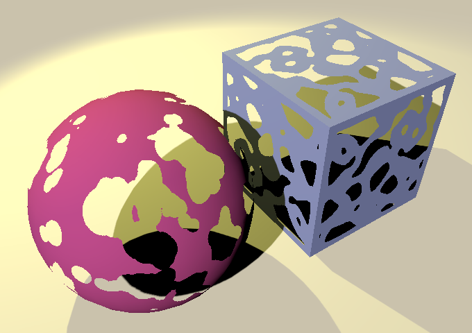

透明度测试的球体和立方体

使用透明度测试材质的物体现在以镂空的形式渲染出来 了。镂空的大小取决于cutoff值的大小。然而，效果只作用在了物体本身，他们投射的阴影仍然是完全实心的。那是因为我们还没做相应的调整。

## 1.4 裁剪阴影

裁剪阴影和在lit pass里的裁剪方式一样，我们只需要修改一下*ShadowCaster* 包含文件。因为最终的alpha值取决于主贴图和材质颜色两者。所以除了采样贴图，我们还得在`ShadowCasterPassFragment`中采样实例_Color值，我们使用和litpass一样通过传入实例ID来获取。

```
CBUFFER_START(UnityPerMaterial)	float4 _MainTex_ST;	float _Cutoff;CBUFFER_END CBUFFER_START(_ShadowCasterBuffer)	float _ShadowBias;CBUFFER_END TEXTURE2D(_MainTex);SAMPLER(sampler_MainTex); #define UNITY_MATRIX_M unity_ObjectToWorld #include "Packages/com.unity.render-pipelines.core/ShaderLibrary/UnityInstancing.hlsl" UNITY_INSTANCING_BUFFER_START(PerInstance)	UNITY_DEFINE_INSTANCED_PROP(float4, _Color)UNITY_INSTANCING_BUFFER_END(PerInstance) struct VertexInput {	float4 pos : POSITION;	float2 uv : TEXCOORD0;	UNITY_VERTEX_INPUT_INSTANCE_ID}; struct VertexOutput {	float4 clipPos : SV_POSITION;	float2 uv : TEXCOORD0;	UNITY_VERTEX_INPUT_INSTANCE_ID}; VertexOutput ShadowCasterPassVertex (VertexInput input) {	VertexOutput output;	UNITY_SETUP_INSTANCE_ID(input);	UNITY_TRANSFER_INSTANCE_ID(input, output);	…		output.uv = TRANSFORM_TEX(input.uv, _MainTex);	return output;} float4 ShadowCasterPassFragment (VertexOutput input) : SV_TARGET {	UNITY_SETUP_INSTANCE_ID(input);	float alpha = SAMPLE_TEXTURE2D(_MainTex, sampler_MainTex, input.uv).a;	alpha *= UNITY_ACCESS_INSTANCED_PROP(PerInstance, _Color).a;	clip(alpha - _Cutoff);	return 0;}
```

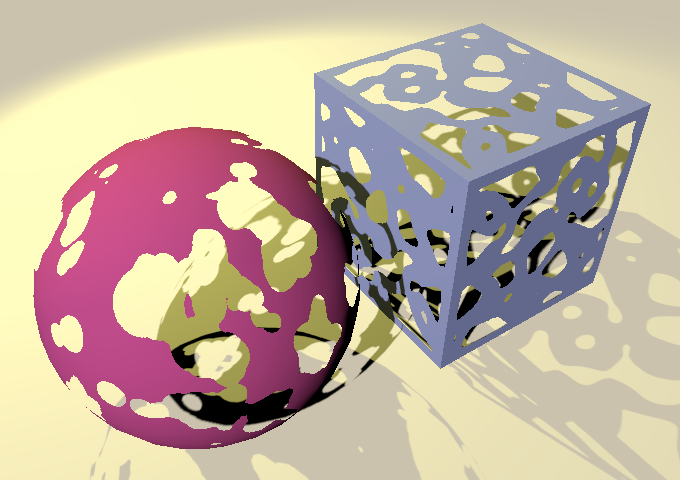

## 1.5 双面渲染

由于只有正面的几何图元被渲染，所以可以看到裁剪物体并没有显示内面。当绕着它们旋转视角时这会非常地明显。另外，阴影也和我们想的不太一样，因为只有相对于光源正面的部分才会投射阴影。所以只有让几何图元支持双面渲染，才能允许我们看到物体的内部，也可以让内表面能投射阴影。

到底渲染哪一面是由着色器的剔除模式控制的，要么两面都不剔除，要么剔除正面或反面。我们添加一个浮点类型的着色器属性作为枚举值，默认是2，也就是最常用的背面剔除

```
	Properties {		_Color ("Color", Color) = (1, 1, 1, 1)		_MainTex("Albedo & Alpha", 2D) = "white" {}		_Cutoff ("Alpha Cutoff", Range(0, 1)) = 0.5		_Cull ("Cull", Float) = 2	}
```

我们只需要为这个属性使用一个Enum特性就可以使用枚举下拉框来拓展该属性。希望的枚举类型可以作为参数传入，在这里我们使用来自`UnityEngine.Rendering`命名空间的`CullMode`。

```
		[Enum(UnityEngine.Rendering.CullMode)] _Cull ("Cull", Float) = 2
```

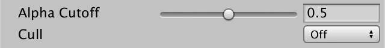

我们现在通过一个着色器属性来定义剔除模式，但他不会直接作用于我们的着色器程序。最终是由GPU来决定是传入片元程序还是直接舍弃。我们可以通过着色器pass中的Cull语句来控制。吐过我们使用的是一个固定的剔除模式，像Cull  Off这样就行了，但如果我们使用我们的着色器属性来决定，就得这样写`**Cull** [_Cull]`。为两个pass都这样做

```
		Pass {			Cull [_Cull]						HLSLPROGRAM						…						ENDHLSL		}				Pass {			Tags {				"LightMode" = "ShadowCaster"			}						Cull [_Cull]						HLSLPROGRAM						…						ENDHLSL		}
```

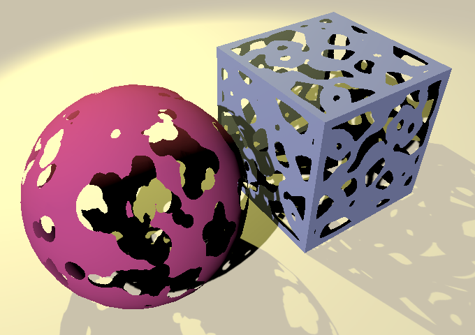

双面渲染

## 1.6反转背面法线

我们现在可以看到几何体的正反两面了，但是背面的显示的不太正常，如果把把材质设为正面剔除，就可以很明显看到背面的显示问题。

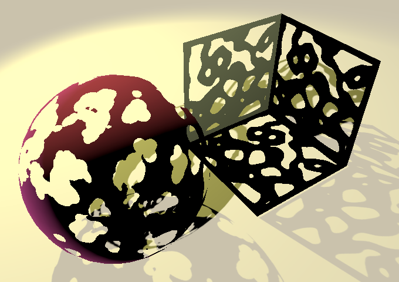

可以看到光照似乎反了过来，该亮的地方暗，该暗的地方却亮了。这是因为对于背面，我们使用的仍然是正面的法线。因此在渲染背面时，需对法向量取反。

GPU会告知片元程序正在着色的片元是正面还是反面。我们可以在LitPassFragment中添加额外的参数来访问该信息。这个参数的具体类型和语义取决于API，好在我们可以使用来自Core library的宏：`**FRONT_FACE_TYPE**` 和 `**FRONT_FACE_SEMANTIC**` 。同样，我们可以使用`**IS_FRONT_VFACE**` 来做出基于正反面的选择。使用它在必要的时候对法向量取反。

```
float4 LitPassFragment (	VertexOutput input, FRONT_FACE_TYPE isFrontFace : FRONT_FACE_SEMANTIC) : SV_TARGET {	UNITY_SETUP_INSTANCE_ID(input);	input.normal = normalize(input.normal);	input.normal = IS_FRONT_VFACE(isFrontFace, input.normal, -input.normal);		…}
```

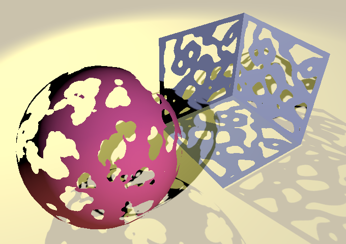 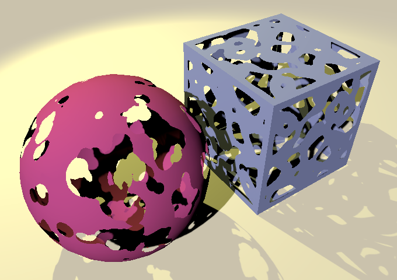

正确光照下的反面和双面物体

现在内表面也可以被正确的着色了，虽然因为自阴影的缘故最终会比外表面要暗一点。

> ### 为什么阴影有时候会忽略裁剪模式
>
> 渲染阴影时裁剪模式一直是存在的。然而，Unity倾向于将物体批处理在一起计算阴影投射，即使他们有着不同的材质，从而导致部分物体的裁剪模式因不同而被忽略。这就意味着当你混合投射阴影的物体时，最好确保他们有相同的裁剪模式，批处理最终选择哪个物体的裁剪模式是完全随机的。因为裁剪模式是针对每个shader设置的，而不是可以让每个实例都有不同的设置。
>
> 你可以在渲染阴影时关闭实例化和阴影来避免这个问题。不过其实没必要，裁剪模式不同的材质通常其他相关属性也有所不同，这就可以避免他们被批处理在一起。比如只要cutoff值略有不同就不会被错误的批处理在一起。

## 1.7 可选的裁剪

当透明度测试开启时，GPU就无法假设所有的三角面都会被渲染，从而导致部分的优化策略无法实现。所以最好的方法就是只在必要时开启透明度测试。因此我们来创建两个shader的变种，一个使用透明度测试，一个不用。我们可以用一个着色器关键字来完成这个工作，就像我们之前在渲染管线中控制是否使用阴影那样。只不过这次我们是使用一个材质属性来控制。

添加一个属性性来作为着色器透明度测试的开关。它应该是一个浮点数，默认值为0。给它一个toggle特性，这样他就会显示为一个复选框。除此之外，这个特性还会提供一个关键字，并随着属性值的变化开启和关闭。 这里我们使用_CLIPPING关键字。

```
		[Toggle(_CLIPPING)] _Clipping ("Alpha Clipping", Float) = 0		_Cutoff ("Alpha Cutoff", Range(0, 1)) = 0.5
```

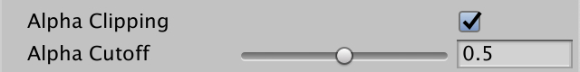

让我们添加另一个多重编译语句。因为这个开关我们只在编辑材质资源时设置，并不会在play状态中修改。所以我们没必要一直为两个选项生成两个着色器变种。所以我们改为使用`#pragma shader_feature`。这样我们就只会得到单个toggle关键字，只需列出该关键字即可。为两个pass都进行这项操作。

```
			#pragma instancing_options assumeuniformscaling						#pragma shader_feature _CLIPPING
```

> ### 使用 shader feature的好处有哪些？
>
> 使用多重编译指令，所有的着色器变种都会包含在一起，包括在编辑时编译的着色器和发布时置入的着色器。而shader feature会有选择的只包括实际需要的着色器变种，这是由Unity编辑器决定的。这对减少shader的编译时间和发布时的大小都很有意义。
>
> 唯一需要多重编译指令的情况就是某个关键字可能会在paly状态时改变。就比如我们的阴影关键字，以确保你在游玩时仍可以配置材质的阴影。

我们只在_CLIPPING关键字被定义时开启透明度测试。

```
	#if defined(_CLIPPING)		clip(albedoAlpha.a - _Cutoff);	#endif
```

同样在ShadowCaseter中添加这一步

```
	#if defined(_CLIPPING)		float alpha = SAMPLE_TEXTURE2D(_MainTex, sampler_MainTex, input.uv).a;		alpha *= UNITY_ACCESS_INSTANCED_PROP(PerInstance, _Color).a;		clip(alpha - _Cutoff);	#endif
```

其实我们还可以抹去uv坐标来做进一步的优化，但这个优化不是很重要所以我没有做。同样的，你也可以用shader feature来确保只在透明度测试关闭（应该是剔除关闭时吧，文中是clip）时检查三角图元的朝向,这是我们跳过的另一个优化。

## 1.8 透明度测试的渲染队列

除了可能存在废弃片元，透明度测试物体的渲染过程和不透明物体渲染完全相同，所以将它们混在一起不会有问题。但是透明度测试会让GPU的部分优化策略失效，所以最好先渲染所有的不透明物体，再渲染开启透明度测试的物体。这样可以避免渲染那些隐藏在不透明几何体后面的开启透明度测试的物体（无法通过深度测试），潜在的控制了透明度测试片元的数量，还可以降低批处理的批次数量。所有的这些好处只需要为透明度测试材质使用一个略微靠后的渲染队列即可实现。默认的检视器面板就有渲染队列的拓展选项，我们手动调整即可。透明度测试材质的默认队列一般为2450，对应下拉框的AlphaTest选项。

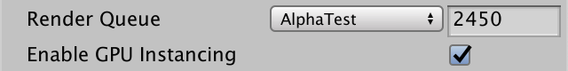

#  

# 2 半透明

如果一个片元没有被裁剪那它就是完全不透明的。所以透明度测试只能产生物体的镂空效果 ，并不能表示半透明表面。要想我们的着色器支持半透明效果，我们还需要做更多的工作。

## 2.1 混合模式

作为一个半透明的物体，透过它我们应该可以隐约看到后面的物体。想在我们的着色器中做到这一点，我们输出的片元颜色就得和早前渲染的缓冲区颜色相混合。改变着色器的混合模式可以满足我们的需求。

混合模式的控制方式和剔除模式类似，只不过它有两个权重选项用于混合新旧颜色。第一个是来源，也就是我们现在渲染的，第二个是目标，就是先前渲染的。就比如默认的混合模式是`**Blend** **One** **Zero**`，此时新颜色会完全取代旧颜色。

> ### 难道没有为alpha通道提供单独的选项吗？
>
> 有，但是很少用。如果没有显式指明alpha通道的混合模式，那么四个通道使用相同的模式混合

就像剔除模式一样，为来源和目标参数添加两个着色器属性，但这次使用的是`BlendMode`枚举类型。分别将它们的默认值设为0和1。

```
		[Enum(UnityEngine.Rendering.CullMode)] _Cull ("Cull", Float) = 2		[Enum(UnityEngine.Rendering.BlendMode)] _SrcBlend ("Src Blend", Float) = 1		[Enum(UnityEngine.Rendering.BlendMode)] _DstBlend ("Dst Blend", Float) = 0
```

我们只在litpass里添加混合声明，因为*ShadowCaster*  pass值渲染深度，它不关心混合模式如何。

```
		Pass {			Blend [_SrcBlend] [_DstBlend]			Cull [_Cull]						…		}
```

最简单的半透明实现方式是基于片元alpha值的颜色过渡。我们使用源颜色的alpha值作为来源的混合权重，1-源颜色alpha作为目标颜色的混合参数。创建一个新的材质，关闭剔除，做如下操作。

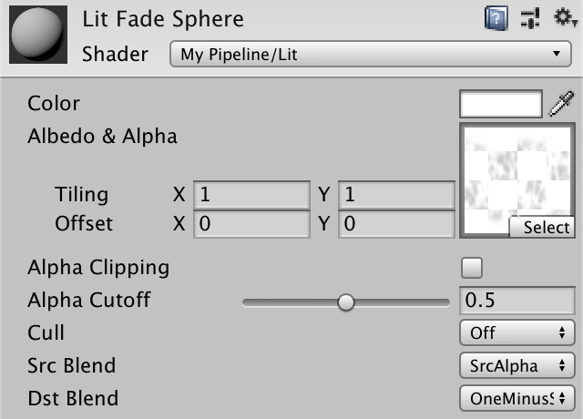
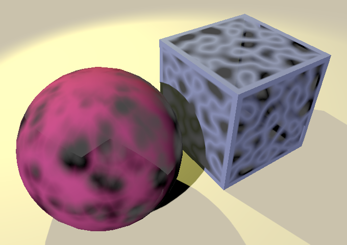

渐变的混合模式，但是结果显示不是很正确

另外还有许多的混合模式，大多很少被用到，但有一些可以用于其他类型的透明效果。比如，预乘混合（pre-multiplied  blending）使用1代替源颜色的alpha来作为来源参数。这样就就可以保留高光颜色（来表示类似玻璃的材质），但要求着色器也做出相应的改动，这里我们不再深入。

## 2.2 半透明物体的渲染队列

只有当前方的物体被渲染好后再渲染透明（fading）物体才能显示正常。我们的pipeline已经处理好了这一点，他会先渲染不透明（opaque）队列的物体，接着是天空盒（skybox），再然后才到半透明（transparent  ）队列。我们的渐变材质需要使用正确的队列，默认的*Transparent* 选项就很合适。

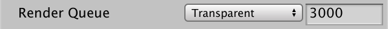


切换到transparent队列，仍然有显示不正确的地方

## 2.3 关闭深度写入

半透明和我们想象的有点出入，它产生了一点奇怪的结果。特别是当我们把物体当做不透明的来投射阴影会变得非常明显。之所以会发生是因为我们没有做剔除，导致物体的正反两面都会被渲染。究竟那一部分先被渲染则取决于网格的三角面片顺序。如果是正面的三角形先被渲染，也就不会和背面混合。因为此时背面无法通过深度测试（观察到的就是背面再一次消失了）。

同样的问题还发生在两个单独的透明物体上。Unity通常以从后向前的顺序整理透明物体，这是对的，但问题是它只会考虑位置，而不会考虑每个物体的形状。先渲染的物体的某一部分有可能是在后渲染物体的前面。比如，我们在场景中放置两个重叠的quad。一个比另一个略高一点。调整视角，让上面的那个先被渲染。

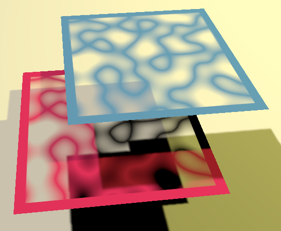

上方的quad先被渲染

我们无法避免这个问题，除非我们精确的控制每个半透明物体的摆放，或者为每个物体的材质使用不同的渲染队列。在物体发生交叉或者使用双面材质的网格拥有随机的三角面片顺序的情况下，都会产生这种糟糕的效果。我们能做的只能是为透明材质关闭深度写入。这样先渲染的就不会遮挡后渲染的透明物体。

添加另一个浮点类型的着色器属性来控制深度写入。我们可以使用toggle特性，但这会产生一个我们不需要的关键字，所以我们改用自定义的枚举类型，有开和关两个状态，写作`[**Enum**(Off, 0, On, 1)]`。

```
		[Enum(UnityEngine.Rendering.BlendMode)] _DstBlend ("Dst Blend", Float) = 0		[Enum(Off, 0, On, 1)] _ZWrite ("Z Write", Float) = 1
```

只在lit pass中添加ZWrite，不需要考虑阴影的情况

```
			Blend [_SrcBlend] [_DstBlend]			Cull [_Cull]			ZWrite [_ZWrite]
```

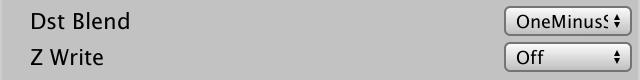


关闭深度写入的状况

现在即使顺序不合理，两个quad都可以被完整的渲染了。但是当上面的quad先于下面的渲染时还是产生了另外的错误。这是由quad的实体阴影导致的。当两个quad的绘制顺序反转时会更明显。这是透明物体渲染的局限性，你设计场景时必须时刻将它记在心中。（当然也可以干脆关闭透明物体阴影的接收和投射）

## 2.4 半透明的双面材质

如果深度写入被关闭，又关闭了剔除模式，那么物体的内表面就永远会被渲染，而正反两面的渲染顺序又取决于网格的三元面片顺序。如果使用Unity的默认球体和立方体，一定会产生错误的结果。


开启深度写入的双面材质

对于一个三角形顺序不确定的网格，想要确保背面先渲染就只能在复制一相同网格的物体，各自使用两个不同的材质，一个剔除正面，一个剔除背面，通过调整渲染队列来确保背面先被渲染。


使用不同的物体和材质分别表示背面和正面

如果只有一个物体，那么可以使用这种方法，但如果是多个物体，这个方法会产生非常明显的重叠。因为会先渲染完所有物体的背面，再渲染正面。


立方体的外表面遮挡了球体的内表面

 

### 2.5 制作一个合理的双面网格

渲染双面半透明物体的最好办法，就是使用一个为这种情况而创建的特定网格。这个网格必须包含各自分离里外两层三角面片，而且顺序一定要是里面的三角面片先被渲染。即使做到这样，也只能确保内凹的网格不会出现可见的重叠现象。

你可以在别的3d建模软件上创建一个双面网格。也可以在Unity里使用一个简单的工具生成任何原始网格的双面网格。为此我们创建一个`**DoubleSidedMeshMenuItem**` 静态类。将脚本资源放在Editor文件夹里。我们打算把它添加到Unity的面板，路径为*Assets/Create/Double-Sided Mesh*。在一个静态方法上使用`MenuItem` 特性并传入对应的路径即可实现这一点。

```
using UnityEditor;using UnityEngine; public static class DoubleSidedMeshMenuItem { 	[MenuItem("Assets/Create/Double-Sided Mesh")]	static void MakeDoubleSidedMeshAsset () {}}
```

大致思路是用户选择一个网格，并右键激活并选择这个面板选项,接着我们就创建一个双面的替代网格。因此首先我们就要得到所选网格的引用，我们可以通过 `Selection.activeObject`来访问。如果没有选择网格，那就告知用户应选择网格并返回。

```
	static void MakeDoubleSidedMeshAsset () {		var sourceMesh = Selection.activeObject as Mesh;		if (sourceMesh == null) {			Debug.Log("You must have a mesh asset selected.");			return;		}	}
```

> ### as 干嘛的？
>
> 如果转换有效，他会转换至指定类型，否则返回null。注意它只能用于引用类型。

我们先创建网格的里面部分，复制源网格并实例化，提取它的三角面，并通过`System.Array.Reverse`倒转顺序，最后将结果返回。这样会改变所有的三角面朝向（三角形顶点顺序逆时针变顺时针，法线就反了）

```
		if (sourceMesh == null) {			Debug.Log("You must have a mesh asset selected.");			return;		}				Mesh insideMesh = Object.Instantiate(sourceMesh);		int[] triangles = insideMesh.triangles;		System.Array.Reverse(triangles);		insideMesh.triangles = triangles;
```

接着提取法线，取反并重新分配回去

```
		insideMesh.triangles = triangles;				Vector3[] normals = insideMesh.normals;		for (int i = 0; i < normals.Length; i++) {			normals[i] = -normals[i];		}		insideMesh.normals = normals;
```

接着再创建一个新网格并调用`CombineMeshes` 。方法的第一个参数是`CombineInstance` 结构的数组，它需要一个相关网格的实例。我们需要结合两个网格，首先是内网格，接着是源网格。这样可以确保内网格的三角图元可以先被渲染。之后是三个bool类型的参数。第一个表示这些网格是否需要融合成单个网格，我们选择true。另外另个与矩阵和光照贴图数据有关，我们不需要所以设为false。

```
		insideMesh.normals = normals; 		var combinedMesh = new Mesh();		combinedMesh.CombineMeshes(			new CombineInstance[] {				new CombineInstance { mesh = insideMesh },				new CombineInstance { mesh = sourceMesh }			},			true, false, false		);
```

结合完后我们不在需要内面网格，所以把它删除。

```
		combinedMesh.CombineMeshes(			…		); 		Object.DestroyImmediate(insideMesh);
```

最后调用 `AssetDatabase.CreateAsset`来创建我们想要的双面网格的资源。第一个参数用我们的合并网格。第二个参数表示资源的路径，我们直接把他放在资源的根目录下，在源网格名字的基础上加一个*Double-Sided*来作为它的名字。路径名和文件名可以通过 `System.IO.Path.Combine`方法结合。这样我们就不用考虑不同操作系统的情况了。另外资源的拓展名应为asset。

```
		Object.DestroyImmediate(insideMesh); 		AssetDatabase.CreateAsset(			combinedMesh,			System.IO.Path.Combine(				"Assets", sourceMesh.name + " Double-Sided.asset"			)		);
```

现在我们可以选择任意网格来生成基于它的双面网格。我们选择一个游戏物体上的默认球体或立方体网格，双击得到mesh  renderer中网格的引用。最终得到的新网格资源可能和外部导入的网格不太一样，因为他们是自定义的资源。我们为透明物体使用这些网格，并将材质切换为背面剔除。（此时内面法线已经是反的了，所以背面剔除正好渲染两者）


 

## 2.6 深度测试的阴影

到目前为止我们都没怎么考虑阴影，所以我们的半透明物体投射的阴影就和不透明物体的影子一样。不过接收阴影还是可以的。

> ## 透明物体可以接受阴影吗？
>
> 能否接收到阴影取决于片元和光源之间是否有阴影投射物，我们从阴影贴图中获取这个信息。这和片元是不透明的还是半透明的没有关系。但话又说回来，Unity的级联阴影贴图不支持对透明物体的接收阴影。因为Unity会用一个单独的全屏pass来采样级联阴影，它依赖于深度缓存，所以透明物体无法从中获取。但我们自己的pipeline的阴影采样是逐片元的，所以我们不会受到这个限制。

阴影贴图不能用于只表现阴影的一部分。我们能做的就是使用开启透明度测试的阴影。现在，如果我们为一个物体开启透明度测试，可以看到它在影响阴影的同时也会影响物体自身的表面。


我们只需要为阴影开启透明度测试。所以我们把原先的透明度测试开关修改为三个选项：off，on，shadow。首先，我们关闭所有材质的透明度测试，确保_CLIPPING关键字被清除。接着用带三个选项的`**KeywordEnum**`来代替先前的toggle。

```
		//[Toggle(_CLIPPING)] _Clipping ("Alpha Clipping", Float) = 0		[KeywordEnum(Off, On, Shadows)] _Clipping ("Alpha Clipping", Float) = 0
```

现在你可以重新开启透明度裁剪了。之所以要先关再开是因为`**KeywordEnum**` 使用的是不同的关键字。关键字的格式是*属性名_选项名*，并且全大写。所以我们得把litpass中的着色器特性改为依靠*_CLIPPING_ON* 判断。

```
			//#pragma shader_feature _CLIPPING			#pragma shader_feature _CLIPPING_ON
```

同样调整程序中的关键字

```
	#if defined(_CLIPPING_ON)		clip(albedoAlpha.a - _Cutoff);	#endif
```

*ShadowCaster* pass只要当设为on或者shadows时进行透明度测试。换句话说，当选项为off时不能进行透明度测试，所以我们换个思路，让着色器特性根据*_CLIPPING_OFF*判断。

```
			//#pragma shader_feature _CLIPPING			#pragma shader_feature _CLIPPING_OFF
```

让后我们检查*_CLIPPING_OFF* 是不是没有定义

```
	//#if defined(_CLIPPING)	#if !defined(_CLIPPING_OFF)		float alpha = SAMPLE_TEXTURE2D(_MainTex, sampler_MainTex, input.uv).a;		alpha *= UNITY_ACCESS_INSTANCED_PROP(PerInstance, _Color).a;		clip(alpha - _Cutoff);	#endif
```

这样我们的透明材质就可以投射开启透明度测试的阴影了。可能不是很完美，但这是最简单的实现方案了，而且在大部分情况下也够用了。


如果你不想要的话你可以单独关闭每个物体的阴影，我们将在稍后支持按材质关闭阴影。

> ### 还有别的方法制造半透明的阴影吗？
>
> Unity的旧版渲染管线有一个选项能渲染半透明阴影，在[Rendering 12, Semitransparent Shadows](https://catlikecoding.com/unity/tutorials/rendering/part-12/)有所描述。它通过基于透明度和屏幕空间的抖动（dither）图案来创造类似半透明阴影的假象。在有限的一些情况下，他可以产生很好的效果，但是但多是情况下结果都很糟糕，所以不再使用。

## 2.7 接收阴影

让透明物体能接受阴影挺好的，但可能不是我们想要的。所以我们让它变成一个可调节的选项。为此添加一个着色器属性，并使用toggle与*_RECEIVE_SHADOWS* 关键字挂钩，默认是开启的。

```
		[Enum(Off, 0, On, 1)] _ZWrite ("Z Write", Float) = 1		[Toggle(_RECEIVE_SHADOWS)] _ReceiveShadows ("Receive Shadows", Float) = 1
```

在litpass中为它添加一个着色器特性。

```
			#pragma shader_feature _CLIPPING_ON			#pragma shader_feature _RECEIVE_SHADOWS
```

当*_RECEIVE_SHADOWS* 没有被定义，在`ShadowAttenuation` 和`CascadedShadowAttenuation` 直接返回1。

```
float ShadowAttenuation (int index, float3 worldPos) {	#if !defined(_RECEIVE_SHADOWS)		return 1.0;	#elif !defined(_SHADOWS_HARD) && !defined(_SHADOWS_SOFT)		return 1.0;	#endif	…} … float CascadedShadowAttenuation (float3 worldPos) {	#if !defined(_RECEIVE_SHADOWS) ||		return 1.0;	#elif !defined(_CASCADED_SHADOWS_HARD) && !defined(_CASCADED_SHADOWS_SOFT)		return 1.0;	#endif	…}
```

做完这些改变后，所以的阴影都消失了，这是因为着色器添加的新属性并不会立刻自动开启对应的关键字。所以选中所有的材质，切换选项以使属性和关键字同步。而对于一个新创建的材质而言则不然，在创建时所有和特性关联的关键字就会被立刻地正确设置。


# 3 着色器GUI

现在我们的着色器既可以用于创建不透明材质，也可以创建半透明材质，但是我们必须手动调节各种选项，比如混合模式等等。Unity的标准着色器的检视面板就隐藏了这些细节，取而代之的是一个下拉框来支持各种类型。我们可以为我们的材质使用自定义着色器GUI来做出类似的功能。

## 3.1 Lit Shader GUI

创建一个继承`ShaderGUI` 的`**LitShaderGUI**` 类，并把它放在Editor文件夹中。在其中我们需要使用`UnityEditor`命名空间，还有`UnityEngine.Rendering`命名空间，我们之后要用到里面的两个枚举类型，`BlendMode`和 `CullMode`。

```
using UnityEditor;using UnityEngine;using UnityEngine.Rendering; public class LitShaderGUI : ShaderGUI {}
```

`ShaderGUI`定义了一个OnGUI方法，他会在创建材质检视器时被调用。 还传入一个`MaterialEditor` 参数，它是一个追踪被编辑材质的底层对象。还有一个叫的 `MaterialProperty`数组参数，它包含了被选择材质的所有着色器属性引用。为了创建我们自己的GUI，需要重写这个方法，但我们又不想完全替换默认的GUI，只想在基础上添加一些新的。所以我们在方法中调用基类`ShaderGUI`的OnGUI实现。

```
	public override void OnGUI (		MaterialEditor materialEditor, MaterialProperty[] properties	) {		base.OnGUI(materialEditor, properties);	}
```

> ### 为什么会有一个单独的material editor类？
>
> Unity一开始只能通过继承`MaterialEditor`来创建材质的自定义检视器。`ShaderGUI` 方法是之后才添加的，它对于材质更加直观且更具针对性。然而，最终生成检视器仍然依赖最初的编辑类，只不过它现在会调用shaderGUI中合适的方法。这个编辑类通过一个参数传进来是因为需要由它来对选择的材质进行最直接地操作。

想使用自定义GUI，就得为我们的Lit着色器添加一条`**CustomEditor**` 语句，后面跟着表示我们类名的字符串

```
Shader "My Pipeline/Lit" {		…		CustomEditor "LitShaderGUI"}
```

要完成我们的自定义需要一个editor，属性和所选材质，所以用字段来追踪它们。因为我们支持多材质编辑，我们要使用数组来表示所选材质。通过editor中的targets来获得这些信息。因为editor是通用的，所以我们只能得到`Object` 类型的数组，而非`Material` 数组。

```
	MaterialEditor editor;	Object[] materials;	MaterialProperty[] properties;		public override void OnGUI (		MaterialEditor materialEditor, MaterialProperty[] properties	) {		base.OnGUI(materialEditor, properties); 		editor = materialEditor;		materials = materialEditor.targets;		this.properties = properties;	}
```

## 3.2 投射阴影

现在我们来实现先前提到的逐材质关闭阴影。我们通过禁用所有选择材质的ShadowCaster pass来实现这个需求。让我们循环遍历材质数组中的每个材质并为它们调用`SetShaderPassEnabled` ，传入pass名称和表示应该关闭的布尔值。我们把这些代码专门放到一个`SetPassEnabled` 方法里。

```
	void SetPassEnabled (string pass, bool enabled) {		foreach (Material m in materials) {			m.SetShaderPassEnabled(pass, enabled);		}	}
```

> ### Foreach如何工作
>
> ..略

除此之外我们还需要确定是否开启了阴影投射。我们可以通过`GetShaderPassEnabled` 来检查每个材质。为其再创建一个方法，检查选择的第一个材质。

```
	bool IsPassEnabled (string pass) {		return ((Material)materials[0]).GetShaderPassEnabled(pass);	}
```

但是如果我们选择了多个材质，我们最终应该得到一个混合的结果，但我们无法用单个bool值来表示。所以我们用可空bool类型来代替普通的bool类型。我们循环遍历所有的材质，如果发现结果不一致就返回null。

```
	bool? IsPassEnabled (string pass) {		bool enabled = ((Material)materials[0]).GetShaderPassEnabled(pass);		for (int i = 1; i < materials.Length; i++) {			if (enabled != ((Material)materials[i]).GetShaderPassEnabled(pass)) {				return null;			}		}		return enabled;	}
```

> ### 什么是可空类型？
>
> 略

现在我们来创建一个方法处理投射阴影的选项。首先检查是否启用了ShadowCaster  pass。如果我们得到了null值，就把设置为true来表示将输入控件显示为混合值。我们还需要重新设置启用状态，因为有的可能是开启的，有的可能是关闭的，所以我们统一设为false。另外在方法的最后我们应该关闭混合值的显示外观。

```
	void CastShadowsToggle () {		bool? enabled = IsPassEnabled("ShadowCaster");		if (!enabled.HasValue) {			EditorGUI.showMixedValue = true;			enabled = false;		}				EditorGUI.showMixedValue = false;	}
```

复选框通过调用 `EditorGUILayout.Toggle`来绘制，我们传入 标签*Cast Shadows*和切换值。最后在将返回结果重新赋值给启用状态。

```
		if (!enabled.HasValue) {			EditorGUI.showMixedValue = true;			enabled = false;		}		enabled = EditorGUILayout.Toggle("Cast Shadows", enabled.Value);		EditorGUI.showMixedValue = false;
```

现在我们只是改变了变量。接下来还需调用`SetPassEnabled`来调整我们的材质。但是只有当用户修改了状态我们才需要这么做。我们可以通过在toggle前后分别调用`EditorGUI.BeginChangeCheck`和 `EditorGUI.EndChangeCheck`。后者会返回一个bool值表示是否它们之间的控件状态发生了改变。如果是，我们就调用`SetPassEnabled`。

```
		EditorGUI.BeginChangeCheck();		enabled = EditorGUILayout.Toggle("Cast Shadows", enabled.Value);		if (EditorGUI.EndChangeCheck()) {			SetPassEnabled("ShadowCaster", enabled.Value);		}
```

我们直接修改了材质资源，并不会自动 为我们生成一个撤销操作。我们的自己完成这一步，所以在改变前通过调用`RegisterPropertyChangeUndo` 并传入一个标签参数来完成。

```
		if (EditorGUI.EndChangeCheck()) {			editor.RegisterPropertyChangeUndo("Cast Shadows");			SetPassEnabled("ShadowCaster", enabled.Value);		}
```

最后在OnGUI的末尾调用这个方法。这样在我们材质检视器的底部就会出现这个一个开关。

```
	public override void OnGUI (		MaterialEditor materialEditor, MaterialProperty[] properties	) {		… 		CastShadowsToggle();	}
```


## 3.3 设置着色器属性

在不透明、裁剪、半透明类型之间切换需要改变多个着色器属性。我们C#的属性来方便的实现我们的需求。cull，blend，z-write属性都很直观，为这些属性使用合适的类型，调用`FindProperty`with，传入名称和属性数组，并用`floatValue` 赋值。

```
	CullMode Cull {		set {			FindProperty("_Cull", properties).floatValue = (float)value;		}	} 	BlendMode SrcBlend {		set {			FindProperty("_SrcBlend", properties).floatValue = (float)value;		}	} 	BlendMode DstBlend {		set {			FindProperty("_DstBlend", properties).floatValue = (float)value;		}	} 	bool ZWrite {		set {			FindProperty("_ZWrite", properties).floatValue = value ? 1 : 0;		}	}
```

裁剪模式和阴影接收属性则需要更多的工作，因为他们还需要同步着色器的关键字。一个关键字可以通过调用材质`EnableKeyword` 的和`DisableKeyword`来开关。为此创建一个方法，以关键字名称和启用状态为参数。

```
	void SetKeywordEnabled (string keyword, bool enabled) {		if (enabled) {			foreach (Material m in materials) {				m.EnableKeyword(keyword);			}		}		else {			foreach (Material m in materials) {				m.DisableKeyword(keyword);			}		}	}
```

现在为我们的裁剪模式和阴影接收穿件对应的类属性，并为所有的相关关键字调用`SetKeywordEnabled` 。别忘了为我们的自定义裁剪模式准备一个枚举类型。

```
	enum ClipMode {		Off, On, Shadows	} 	ClipMode Clipping {		set {			FindProperty("_Clipping", properties).floatValue = (float)value;			SetKeywordEnabled("_CLIPPING_OFF", value == ClipMode.Off);			SetKeywordEnabled("_CLIPPING_ON", value == ClipMode.On);			SetKeywordEnabled("_CLIPPING_SHADOWS", value == ClipMode.Shadows);		}	} 	bool ReceiveShadows {		set {			FindProperty("_ReceiveShadows", properties).floatValue =				value ? 1 : 0;			SetKeywordEnabled("_RECEIVE_SHADOWS", value);		}	}
```

最后一件事就是调整我们的渲染队列。我们可以通过逐一调用材质的队列属性来完成。同样用一个`RenderQueue`类型的属性为所有的材质完成这一步。

```
	RenderQueue RenderQueue {		set {			foreach (Material m in materials) {				m.renderQueue = (int)value;			}		}	}
```

## 3.4 预置

Unity默认的着色器只允许你选择一些预先定义好的类型。隐藏了有关混合模式，剔除模式，渲染队列等细节。我们不这么做，我们选择添加一些按钮将这些作为预设组合，允许用户应用至材质。

第一个预设是opaque，对应默认的材质设置。为其添加一个方法，调用 `GUILayout.Button`，传入Opaque标签。如果按钮按下，该方法返回true，如果按钮没按下我们就退出方法，否则我们就继续执行方法，并注册撤销步骤。

```
	void OpaquePreset () {		if (!GUILayout.Button("Opaque")) {			return;		}		editor.RegisterPropertyChangeUndo("Opague Preset");	}
```

关于opaque的预设为：关闭透明度裁减、背面剔除、1-0混合模式、开启深度写入、接受阴影、投射阴影、并且使用geometry渲染队列。

```
		editor.RegisterPropertyChangeUndo("Opague Preset");		Clipping = ClipMode.Off;		Cull = CullMode.Back;		SrcBlend = BlendMode.One;		DstBlend = BlendMode.Zero;		ZWrite = true;		ReceiveShadows = true;		SetPassEnabled("ShadowCaster", true);		RenderQueue = RenderQueue.Geometry;
```

同样添加clip预设，它和opaque的不同之处在于开启了透明度测试且使用alpha-test渲染队列。

```
	void ClipPreset () {		if (!GUILayout.Button("Clip")) {			return;		}		editor.RegisterPropertyChangeUndo("Clip Preset");		Clipping = ClipMode.On;		Cull = CullMode.Back;		SrcBlend = BlendMode.One;		DstBlend = BlendMode.Zero;		ZWrite = true;		ReceiveShadows = true;		SetPassEnabled("ShadowCaster", true);		RenderQueue = RenderQueue.AlphaTest;	}
```

但是透明度测试可以选择双面渲染，所以再加一个关闭剔除的预设。

```
	void ClipDoubleSidedPreset () {		if (!GUILayout.Button("Clip Double-Sided")) {			return;		}		editor.RegisterPropertyChangeUndo("Clip Double-Sided Preset");		Clipping = ClipMode.On;		Cull = CullMode.Off;		SrcBlend = BlendMode.One;		DstBlend = BlendMode.Zero;		ZWrite = true;		ReceiveShadows = true;		SetPassEnabled("ShadowCaster", true);		RenderQueue = RenderQueue.AlphaTest;	}
```

接着是一般的半透明物体（fade）预设。相比opaque预设，它使用的混合模式为source-alpha 和 one-minus-source-alpha。并且关闭深度写入，既不会接收也不会投射阴影，使用的是transparent 渲染队列。

```
	void FadePreset () {		if (!GUILayout.Button("Fade")) {			return;		}		editor.RegisterPropertyChangeUndo("Fade Preset");		Clipping = ClipMode.Off;		Cull = CullMode.Back;		SrcBlend = BlendMode.SrcAlpha;		DstBlend = BlendMode.OneMinusSrcAlpha;		ZWrite = false;		ReceiveShadows = false;		SetPassEnabled("ShadowCaster", false);		RenderQueue = RenderQueue.Transparent;	}
```

我们可能会希望我们的半透明材质也能投射和接受阴影，所以再添加一个预设，它应该开启阴影接受和投射，且开启的是阴影裁减模式。

```
	void FadeWithShadowsPreset () {		if (!GUILayout.Button("Fade with Shadows")) {			return;		}		editor.RegisterPropertyChangeUndo("Fade with Shadows Preset");		Clipping = ClipMode.Shadows;		Cull = CullMode.Back;		SrcBlend = BlendMode.SrcAlpha;		DstBlend = BlendMode.OneMinusSrcAlpha;		ZWrite = false;		ReceiveShadows = true;		SetPassEnabled("ShadowCaster", true);		RenderQueue = RenderQueue.Transparent;	}
```

在OnGUI的末尾调用所有的预设方法。用`EditorGUILayout.Space`在之间产生区分间隔。预设按键很少会用到，所以我们最用以一个叫Preset的折叠箭头来隐藏它们。让我们使用，传入的bool值表示是否打开折叠内容，第二个参数则是它的名称，最后一个是是否按名称就可以切换状态（而不是只能点那个小三角），用一个字段追踪折叠状态，如过是打开状态就显示预设按钮。

```
	bool showPresets;		… 	public override void OnGUI (		MaterialEditor materialEditor, MaterialProperty[] properties	) {		… 		EditorGUILayout.Space();		showPresets = EditorGUILayout.Foldout(showPresets, "Presets", true);		if (showPresets) {			OpaquePreset();			ClipPreset();			ClipDoubleSidedPreset();			FadePreset();			FadeWithShadowsPreset();		}	}
```