# Unity Shader深度相关知识总结与效果实现

##  	鸣谢：puppet_master （VIA CSDN）贡献此文  	  	前言

 	前言废话依旧比较多，感觉我是个写游戏体验评测的，233。最近想起了《恶灵附身》这款游戏的几个效果：

 	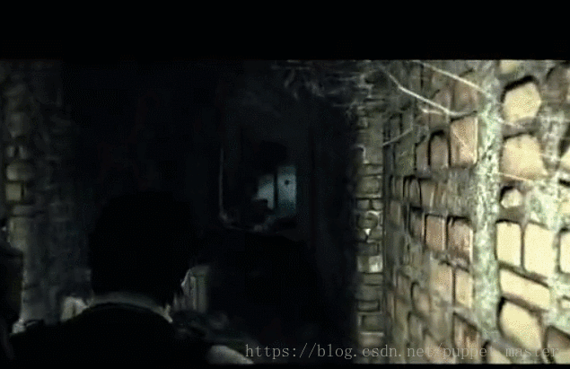

 	
 	
 	

 	 

 	《恶灵附身》整款游戏都是在一个“疯子”撸总的脑洞世界里面，游戏内容相当恐怖（吓得我当年一边尖叫一边玩，不光把我吓够呛，把我室友也吓坏了），有“贞子”，“保险箱怪”等等至今让我久久不能忘怀的Boss，不过整个游戏既有恐怖的地方，又有刺激的战斗，非常符合三上真司一贯的作风（我是三上生化危机系列的铁粉，哇咔咔），可惜《恶灵附身2》玩法有点转型，类似《丧尸围城》了，前半段很好，后半段不知是否是经费不足，感觉整体不如前半段好。不过还是很期待续作的。

 	既然整款游戏都是在脑洞世界里面，所以整个游戏的过程完全不按照常理出牌，可能前一秒还在平静的医院走廊，下一秒直接就直接切换到满是怪物的场景。整个游戏里面大量运用了各种好玩的效果，上面的屏幕扭曲，屏幕扫描波，高度雾效（个人感觉《恶灵附身》里面的应该是特效做的，不过本文的实现方式不太一样罢了）就都其中之一，今天主要是来整理一波深度图的各种知识点，然后做几个好玩的效果。

##  	简介

 	深度是个好东西哇，很多效果都需要深度，比如景深，屏幕空间扫描效果，软粒子，阴影，SSAO，近似次表面散射（更确切的说是透射），对于延迟渲染来说，还可以用深度反推世界空间位置降低带宽消耗，还可以用深度做运动模糊，屏幕空间高度雾，距离雾，部分Ray-Marching效果也都需要深度，可以说，深度是一些渲染高级效果必要的条件。另一方面，光栅化渲染本身可以得到正确的效果，就与深度（Z  Buffer）有着密不可分的关系。

 	深度对于实时渲染的意义十分重大，OpenGL，DX，Unity为我们封装好了很多深度相关的内容，如ZTest，ZWrite，CameraDepthMode，Linear01Depth等等。今天我来整理一下与学习过程中遇到的深度相关的一些问题，主要是渲染中深度的一些问题以及Unity中深度图生成，深度图的使用，深度的精度，Reverse-Z等等问题，然后再用深度图，实现一些好玩的效果。本人才疏学浅，如果有不正确的地方，还望各位高手批评指正。

##  	画家算法&ZBuffer算法

 	在渲染中为了保证渲染的正确，其实主要得益于两个最常用的算法，第一个是画家算法。所谓画家算法，就是按照画画的顺序，先画远处的内容，再画近处的内容叠加上去，近处的会覆盖掉远处的内容。即，在绘制之前，需要先按照远近排序。但是画家算法有一个很严重的问题，对于自身遮挡关系比较复杂的对象，没有办法保证绘制的正确；无法进行检测，overdraw比较严重；再者对对象排序的操作，不适合硬件实现。

 	而另一种保证深度正确的算法就是ZBuffer算法，申请一块和FrameBuffer大小一样的缓冲区，如果开启了深度测试，那么在最终写入FrameBuffer之前（Early-Z实现类似，只是时机效果不同），就需要进行测试，比如ZTest   LEqual的话，如果深度小于该值，那么通过深度测试，如果开启了深度写入，还需要顺便更新一下当前点的深度值，如果不通过，就不会写入FrameBuffer。ZBuffer保证像素级别的深度正确，并且实现简单，比起靠三角形排序这种不确定性的功能更加容易硬件化，所以目前的光栅化渲染中大部分都使用的是ZBuffer算法。ZBuffer算法也有坏处，第一就是需要一块和颜色缓冲区一样大小的Buffer，精度还要比较高，所以比较费内存，再者需要逐像素计算Z值，但是为了渲染的正确，也就是透视校正纹理映射，Z值的计算是不可避免的，所以总体来看，ZBuffer的优势还是比较明显的。关于ZBuffer的实现以及透视投影纹理映射，可以参照软渲染实现。

 	对于不透明物体来说，ZBuffer算法是非常好的，可以保证遮挡关系没有问题。但是透明物体的渲染，由于一般是不写深度的，所以经常会出现问题，对于透明物体，一般还是采用画家算法，即由远及近进行排序渲染。还有一种方案是关闭颜色写入，先渲染一遍Z深度，然后再渲染半透，就可以避免半透明对象内部也被显示出来的问题，可以参考之前的遮挡处理这篇文章中遮挡半透的做法。

##  	透视投影与光栅化过程

 	 

 	透视投影的主要知识点在于三角形相似以及小孔呈像，透视投影实现的就是一种“近大远小”的效果，其实投影后的大小（x，y坐标）也刚好就和1/Z呈线性关系。看下面一张图：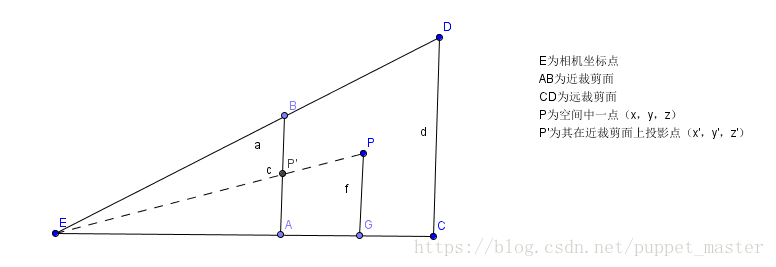

 	 

 	 

 	上图是一个视锥体的截面图（只看x，z方向），P为空间中一点（x，y，z），那么它在近裁剪面处的投影坐标假设为P’(x'，y'，z’)，理论上来说，呈像的面应该在眼睛后方才更符合真正的小孔呈像原理，但是那样会增加复杂度，没必要额外引入一个负号（此处有一个裁剪的注意要点，下文再说），只考虑三角形相似即可。即三角形EAP’相似于三角形EGP，我们可以得到两个等式：

 	x’/ x = z’/ z => x’= xz’/ z  

 	y’/ y = z’/ z => y’= yz’/ z

 	由于投影面就是近裁剪面，那么近裁剪面是我们可以定义的，我们设其为N，远裁剪面为F，那么实际上最终的投影坐标就是：

 	（Nx/z，Ny/z，N）。

 	投影后的Z坐标，实际上已经失去作用了，只用N表示就可以了，但是这个每个顶点都一样，每个顶点带一个的话简直是暴殄天物，浪费了一个珍贵的维度，所以这个Z会被存储一个用于后续深度测试，透视校正纹理映射的变换后的Z值。

 	但是还有一个问题，这里我们得到是只是顶点的Z值，也就是我们在vertex shader中计算的结果，只有顶点，但是实际上，我们在屏幕上会看到无数的像素，换句话说，这些顶点的信息都是离散的，但是最终显示在屏幕上的模型却是连续的，这个那么每个像素点的值是怎么得到的呢？其实就是插值。一个三角形光栅化到屏幕空间上时，我们仅有的就是在三角形三个顶点所包含的各种数据，其中顶点已经是被变换过的了（Unity中常用的MVP变换），在绘制三角形的过程中，根据屏幕空间位置对上述数据进行插值计算，来获得顶点之间对应屏幕上像素点上的颜色或其他数据信息。

 	这个Z值，还是比较有说道的。在透视投影变换之前，我们的Z实际上是相机空间的Z值，直接把这个Z存下来也无可厚非，但是后续计算会比较麻烦，毕竟没有一个统一的标准。既然我们有了远近裁剪面，有了Z值的上下限，我们就可以把这个Z值映射到[0,1]区间，即当在近裁剪面时，Z值为0，远裁剪面时，Z值为1（暂时不考虑reverse-z的情况）。

 	首先，能想到的最简单的映射方法就是depth = （Z（eye） - N）/ F - N。直接线性映射到（0,1）区间，但是这种方案是不正确的，看下面一张图：

 	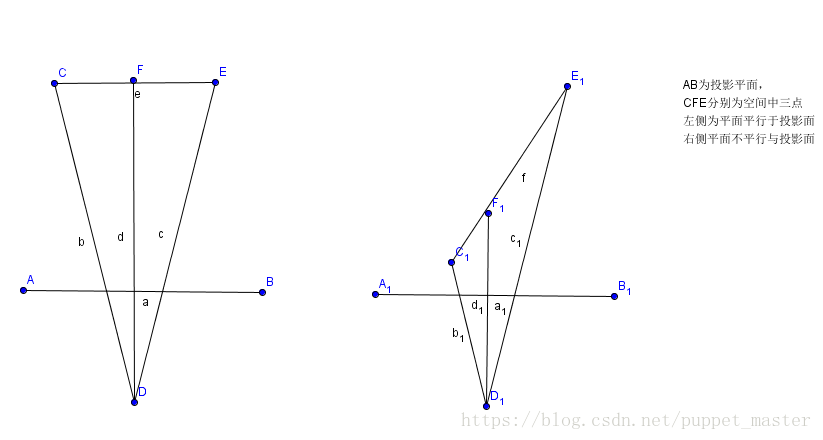

 	 

 	右侧的三角形，在AB近裁剪面投影的大小一致，而实际上C1F1和F1E1相差的距离甚远，换句话说，经过投影变换的透视除法后，我们在屏幕空间插值的数据（根据屏幕空间距离插值），并不能保证其对应点在投影前的空间是线性变换的。关于透视投影和光栅化，可以参照上一篇文章中软渲染透视投影和光栅化的内容。

 	透视投影变换之后，在屏幕空间进行插值的数据，与Z值不成正比，而是与1/Z成正比。所以，我们需要一个表达式，可以使Z = N时，depth = 0，Z = F时，depth = 1，并且需要有一个z作为分母，可以写成（az + b）/z，带入上述两个条件：

 	（N * a  + b） / N = 0   =>  b = -an

 	（F * a  +  b） / F = 0   =>   aF + b = F => aF - aN = F

 	进而得到： 

 	a = F / （F - N）

 	b = NF / （N - F）

 	最终depth（屏幕空间） = （aZ + b）/ Z （Z为视空间深度）。

 	通过透视投影，在屏幕空间X，Y值都除以了Z（视空间深度），当一个值的Z趋近于无穷远时，那么X，Y值就趋近于0了，也就是类似近大远小的效果了。而对于深度值的映射，从上面看也是除以了Z的，这个现象其实也比较好理解，比如一个人在离相机200米的地方前进了1米，我们基本看不出来距离的变化，但是如果在相机面前2米处前进了1米，那么这个距离变化是非常明显的，这也是近大远小的一种体现。

##  	Unity中生成深度图

 	先来考古一下，我找到了一个上古时代的Unity版本，4.3，在4.X的时代，Unity生成深度图使用的还是Hidden/Camera-DepthTexture这个函数，机制就是使用Replacement   Shader，在渲染时将shader统一换成Hidden/Camera-DepthTexture，不同类型的RenderType对应不同的SubShader，比如带有Alpha   Test就可以在fragment阶段discard掉不需要的部分，防止在深度图中有不该出现的内容。那时候，也许还有些设备不支持原生的DepthTexture   RT格式（SM2.0以上，DepthTexture支持）还有一个UNITY_MIGHT_NOT_HAVE_DEPTH_TEXTURE的宏，针对某些不支持深度格式的RT，使用普通的RGBA格式编码深度图进行输出，采样时再将RGBA解码变回深度信息，使用编码的好处主要在于可以充分利用颜色的四个通道（32位）获得更高的精度，否则就只有一个通道（8位），编码和解码的函数如下：

**[cpp]** view plain copy

 				 

 				 

print?

1.  			// Encoding/decoding [0..1) floats into 8 bit/channel RGBA. Note that 1.0 will not be encoded properly.  
2.  			inline float4 EncodeFloatRGBA( float v )  
3.  			{  
4.  			    float4 kEncodeMul = float4(1.0, 255.0, 65025.0, 160581375.0);  
5.  			    float kEncodeBit = 1.0/255.0;  
6.  			    float4 enc = kEncodeMul * v;  
7.  			    enc = frac (enc);  
8.  			    enc -= enc.yzww * kEncodeBit;  
9.  			    return enc;  
10.  			}  
11.  			inline float DecodeFloatRGBA( float4 enc )  
12.  			{  
13.  			    float4 kDecodeDot = float4(1.0, 1/255.0, 1/65025.0, 1/160581375.0);  
14.  			    return dot( enc, kDecodeDot );  
15.  			}  

 	深度图生成的函数如下，其实那时绝大多数情况都已经支持DepthFormat格式了，所以直接使用了空实现，颜色返回为0：

**[cpp]** view plain copy

 				 

 				 

print?

1.  			#if defined(UNITY_MIGHT_NOT_HAVE_DEPTH_TEXTURE)  
2.  			    #define UNITY_TRANSFER_DEPTH(oo) oo = o.pos.zw  
3.  			    #if SHADER_API_FLASH  
4.  			    #define UNITY_OUTPUT_DEPTH(i) return EncodeFloatRGBA(i.x/i.y)  
5.  			    #else  
6.  			    #define UNITY_OUTPUT_DEPTH(i) return i.x/i.y  
7.  			    #endif  
8.  			#else  
9.  			    #define UNITY_TRANSFER_DEPTH(oo)   
10.  			    #define UNITY_OUTPUT_DEPTH(i) return 0  
11.  			#endif  

 	在Unity5.X版本后，实际上深度的pass就变为了ShadowCaster这个pass，而不需要再进行Shader   Raplacement的操作了（但是DepthNormalMap仍然需要），所谓ShadowCaster这个pass，其实就是用于投影的Pass，Unity的所有自带shader都带这个pass，而且只要我们fallback了Unity内置的shader，也会增加ShadowCaster这个pass。我们应该也可以自己定义ShadowCaster这个pass，防止类似AlphaTest等造成深度图中内容与实际渲染内容不符的情况。

 	ShadowCaster这个pass实际上是有两个用处，第一个是屏幕空间的深度使用该pass进行渲染，另一方面就是ShadowMap中光方向的深度也是使用该pass进行渲染的，区别主要在与VP矩阵的不同，阴影的pass是相对于光空间的深度，而屏幕空间深度是相对于摄像机的。新版的Unity使用了ScreenSpaceShadowMap，屏幕空间的深度也是必要的（先生成DpehtTexture，再生成ShadowMap，然后生成ScreenSpaceShadowMap，再正常渲染物体采样ScreenSpaceShadowMap）。所以，如果我们开了屏幕空间阴影，再使用DepthTexture，就相当于免费赠送，不用白不用喽。

 	新版本的Unity，本人目前使用的是Unity2017.3版本，VS和PS阶段的宏直接全部改为了空实现：

**[cpp]** view plain copy

 				 

 				 

print?

1.  			// Legacy; used to do something on platforms that had to emulate depth textures manually. Now all platforms have native depth textures.  
2.  			#define UNITY_TRANSFER_DEPTH(oo)  
3.  			// Legacy; used to do something on platforms that had to emulate depth textures manually. Now all platforms have native depth textures.  
4.  			#define UNITY_OUTPUT_DEPTH(i) return 0  

 	而ShadowCaster的实现也是颇为简单，VS阶段不考虑ShadowBias的情况下其实就是MVP变换，而PS也直接是空实现：

**[cpp]** view plain copy

 				 

 				 

print?

1.  			#define SHADOW_CASTER_FRAGMENT(i) return 0;  

 	为何Unity会如此肆无忌惮，直接空实现我们就可以得到一张深度图呢？我们可以用framedebugger看到我们使用的深度图的格式实际上是DepthFormat：

 	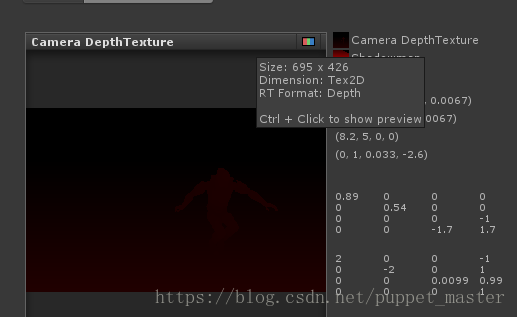

 	 

 	正如上文中Untiy新版本shader注释中所说的，“现在所有平台都支持原生的深度图了"，所以也就没有必要再RGBA格式编码深度然后在进行解码这种费劲的方法，直接申请DepthFormat格式的RT即可，也就是在采样时，只将DepthAttachment的内容作为BindTexture的id。ColorBuffer输出的颜色是什么都无所谓了，我们要的只是DepthBuffer的输出，而这个输出的结果就是正常我们渲染时的深度，也就是ZBuffer中的深度值，只是这个值系统自动帮我们处理了，类似固定管线Native方式。

 	至于Unity为何不直接用FrameBuffer中的Z，而是使用全场景渲染一遍的方式，个人猜测是为了更好的兼容性吧（如果有大佬知道，还望不吝赐教），再者本身一张RT同时读写在某些平台就是未定义的操作，可能出现问题（本人之前测试是移动平台上大部分都挂了，这也是为什么很多后处理，比如高斯模糊等在申请RT的时候要申请两块，在两块RT之间互相Blit的原因）。倒是之前了解过一个黑科技，直接bind一张RT的DepthAttachment到depth上，然后读这张RT就是深度了，然而没有大面积真机测试过，真是不太敢用  。

##  	深度图的使用

 	大概了解了一下Unity中深度图的由来，下面准备使用深度图啦。虽然前面说了这么多，然而实际上在Unity中使用深度图，却是一个简单到不能再简单的操作了，通过Camera的depthTextureMode即可设置DepthTexture。我们来用一个后处理效果把当前的深度图绘制到屏幕上：

**[csharp]** view plain copy

 				 

 				 

print?

1.  			/******************************************************************** 
2.  			 FileName: DepthTextureTest.cs 
3.  			 Description:显示深度贴图 
4.  			 Created: 2018/05/27 
5.  			 history: 27:5:2018 1:25 by puppet_master 
6.  			*********************************************************************/  
7.  			using System.Collections;  
8.  			using System.Collections.Generic;  
9.  			using UnityEngine;  
10.  			  
11.  			[ExecuteInEditMode]  
12.  			public class DepthTextureTest : MonoBehaviour  
13.  			{  
14.  			    private Material postEffectMat = null;  
15.  			    private Camera currentCamera = null;  
16.  			  
17.  			    void Awake()  
18.  			    {  
19.  			        currentCamera = GetComponent<Camera>();  
20.  			    }  
21.  			  
22.  			    void OnEnable()  
23.  			    {  
24.  			        if (postEffectMat == null)  
25.  			            postEffectMat = new Material(Shader.Find("DepthTexture/DepthTextureTest"));  
26.  			        currentCamera.depthTextureMode |= DepthTextureMode.Depth;  
27.  			    }  
28.  			  
29.  			    void OnDisable()  
30.  			    {  
31.  			        currentCamera.depthTextureMode &= ~DepthTextureMode.Depth;  
32.  			    }  
33.  			  
34.  			    void OnRenderImage(RenderTexture source, RenderTexture destination)  
35.  			    {  
36.  			        if (postEffectMat == null)  
37.  			        {  
38.  			            Graphics.Blit(source, destination);  
39.  			        }  
40.  			        else  
41.  			        {  
42.  			            Graphics.Blit(source, destination, postEffectMat);  
43.  			        }  
44.  			    }  
45.  			}  

 	Shader部分：

**[csharp]** view plain copy

 				 

 				 

print?

1.  			//puppet_master    
2.  			//2018.5.27    
3.  			//显示深度贴图  
4.  			Shader "DepthTexture/DepthTextureTest"   
5.  			{  
6.  			    CGINCLUDE  
7.  			    #include "UnityCG.cginc"  
8.  			    sampler2D _CameraDepthTexture;  
9.  			      
10.  			    fixed4 frag_depth(v2f_img i) : SV_Target  
11.  			    {  
12.  			        float depthTextureValue = SAMPLE_DEPTH_TEXTURE(_CameraDepthTexture, i.uv);  
13.  			        //float linear01EyeDepth = LinearEyeDepth(depthTextureValue) * _ProjectionParams.w;  
14.  			        float linear01EyeDepth = Linear01Depth(depthTextureValue);  
15.  			        return fixed4(linear01EyeDepth, linear01EyeDepth, linear01EyeDepth, 1.0);  
16.  			    }  
17.  			    ENDCG  
18.  			  
19.  			    SubShader  
20.  			    {  
21.  			        Pass  
22.  			        {  
23.  			            ZTest Off  
24.  			            Cull Off  
25.  			            ZWrite Off  
26.  			            Fog{ Mode Off }  
27.  			  
28.  			            CGPROGRAM  
29.  			            #pragma vertex vert_img  
30.  			            #pragma fragment frag_depth  
31.  			            ENDCG  
32.  			        }  
33.  			    }  
34.  			}  

 	依然是我最常用的测试场景，哇咔咔，场景原始效果如下：

 	

 	 

 	显示深度效果如下：

 	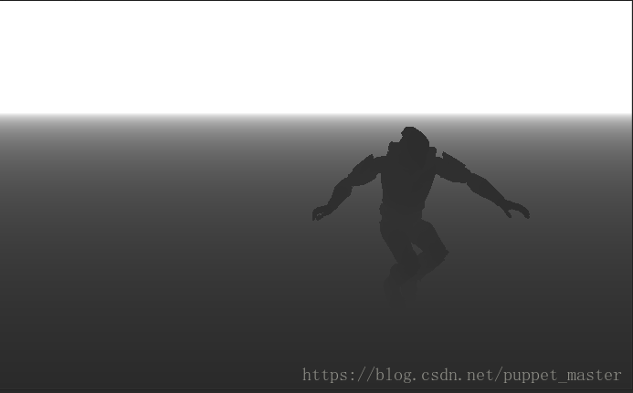

 	 

 	上面的Shader中我们使用了SAMPLE_DEPTH_TEXTURE这个宏进行了深度图的采样，其实这个宏就是采样了DepthTexuter的r通道作为深度（除在PSP2平台不一样），其余平台的定义都是下面的：

**[csharp]** view plain copy

 				 

 				 

print?

1.  			define SAMPLE_DEPTH_TEXTURE(sampler, uv) (tex2D(sampler, uv).r)  

##  	LinearEyeDepth&Linear01Depth

 	在上面的Shader中，我们使用了LinearEyeDepth和LinearDepth对深度进行了一个变换之后才输出到屏幕，那么实际上的Z值应该是啥样的呢，我放置了四个距离相等的模型，来看一下常规的Z值直接输出的情况（由于目前开启了Reverse-Z，所以用1-z作为输出），即：

**[csharp]** view plain copy

 				 

 				 

print?

1.  			float depthTextureValue = SAMPLE_DEPTH_TEXTURE(_CameraDepthTexture, i.uv);  
2.  			return 1 - depthTextureValue;  

 	效果：

 	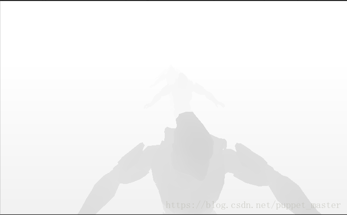

 	 

 	经过Linear01Depth变换后的效果：

 	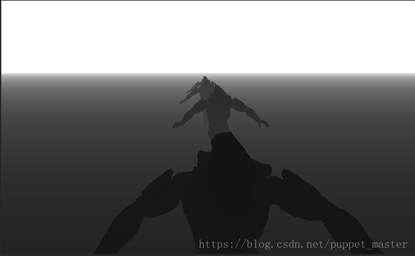

 	 

 	对比两张图我们应该也就比较清楚效果了，没有经过处理的深度，在视空间上不是线性变化的，近处深度变化较明显，而远处几乎全白了，而经过处理的深度，在视空间是线性变化的。

 	为什么会这样呢，还是得从透视投影和光栅化说起，在视空间，每个顶点的原始的Z值是视空间的深度，但是经过透视投影变换以及透视投影，转化到屏幕空间后，需要保证在屏幕空间的深度与1/z成正比才可以在屏幕空间逐像素地进行插值进而获得屏幕上任意一点像素的屏幕空间深度值，简单来说，这个转化的过程主要是为了从顶点数据获得屏幕空间任意一点的逐像素数据。而得到屏幕空间深度之后，我们要使用时，经过变换的这个屏幕空间的东西，又不是很直观，最直观的还是视空间的深度，所以我们要进行一步变换，把屏幕空间的深度再转换回原始的视空间深度。

 	上文中，我们推导过从视空间深度转化到屏幕空间深度的公式如下：

 	 

 	a = F / （F - N）

 	b = NF / （N - F）

 	depth（屏幕空间） = （aZ + b）/ Z （Z为视空间深度）。

 	那么，反推回Z（视空间） = b /（depth - a），进一步地，Z（视空间） = 1 / （depth / b - a / b），然后将上述a和b的值代入：

 	Z（视空间） = 1 / （（depth / （NF / （N - F）） - （F /（F - N）） / （NF / （N - F）））

 	化简： Z（视空间） = 1 / (（（N - F）/ NF） * depth + 1 / N）

 	Z（视空间） = 1 / （param1 * depth + param2），param1 = （N - F）/ NF，param2 = 1 / N。

 	下面让我们来看看Unity自带Shader中关于深度值LinearEyeDepth的处理：

**[csharp]** view plain copy

 				 

 				 

print?

1.  			// Z buffer to linear depth  
2.  			inline float LinearEyeDepth( float z )  
3.  			{  
4.  			    return 1.0 / (_ZBufferParams.z * z + _ZBufferParams.w);  
5.  			}  
6.  			  
7.  			// Values used to linearize the Z buffer (http://www.humus.name/temp/Linearize%20depth.txt)  
8.  			// x = 1-far/near  
9.  			// y = far/near  
10.  			// z = x/far  
11.  			// w = y/far  
12.  			float4 _ZBufferParams;  

 	_ZBufferParams.z = _ZBufferParams.x / far = （1 - far / near）/ far = （near - far） / near * far

 	_ZBufferParams.w = _ZBufferParams.y / far = （far / near） / far = 1 / near

 	我们推导的param1 = _ZBufferParams.z，param2 =  _ZBufferParams.w，实际上Unity中LinearEyeDepth就是将透视投影变换的公式反过来，用zbuffer图中的屏幕空间depth反推回当前像素点的相机空间深度值。

 	下面再来看一下Linear01Depth函数，所谓01，其实也比较好理解，我们上面得到的深度值实际上是真正的视空间Z值，但是这个值没有一个统一的比较标准，所以这个时候依然秉承着映射大法好的理念，把这个值转化到01区间即可。由于相机实际上可以看到的最远区间就是F（远裁剪面），所以这个Z值直接除以F即可得到映射到（0,1）区间的Z值了：

 	Z（视空间01） = Z（视空间） / F = 1 / (（（N - F）/ N） * depth + F / N）

 	Z（视空间01） = 1 / （param1 * depth + param2），param1 = （N - F）/ N = 1 - F/N，param2 = F / N。

 	再来看一下Unity中关于Linear01Depth的处理：

**[csharp]** view plain copy

 				 

 				 

print?

1.  			// Z buffer to linear 0..1 depth  
2.  			inline float Linear01Depth( float z )  
3.  			{  
4.  			    return 1.0 / (_ZBufferParams.x * z + _ZBufferParams.y);  
5.  			}  
6.  			  
7.  			// Values used to linearize the Z buffer (http://www.humus.name/temp/Linearize%20depth.txt)  
8.  			// x = 1-far/near  
9.  			// y = far/near  
10.  			// z = x/far  
11.  			// w = y/far  
12.  			float4 _ZBufferParams;  

 	可以看出我们推导的param1 = _ZBufferParams.x，param2 =   _ZBufferParams.y。也就是说，Unity中Linear01Depth的操作值将屏幕空间的深度值还原为视空间的深度值后再除以远裁剪面的大小，将视空间深度映射到（0,1）区间。

 	Unity应该是OpenGL风格（矩阵，NDC等），上面的推导上是基于DX风格的DNC进行的，不过，如果是深度图的话，不管怎么样都会映射到（0，1）区间的，相当于OpenGL风格的深度再进行一步映射，就与DX风格的一致了。个人感觉OpenGL风格的NDC在某些情况下并不是很方便（见下文Reverse-Z相关内容）。

 	了解了这两个Unity为我们提供的API具体是干什么的了之后，我们就可以放心大胆的使用了，因为实际上绝大多数情况下，我们都是需要相机空间的深度值或者映射到01区间的相机空间深度值。

##  	Z&1/Z

 	通过上面的深度图具体的使用，我们发现，实际上真正使用的深度，是从顶点的视空间Z，经过投影变成一个1/Z成正比的值（屏幕空间Depth），然后在使用时，再通过投影变换时的计算公式反推回对应视空间像素位置的Z。可见，这个操作还是非常折腾的。那为何要如此费劲地进行上面的操作，而不是直接存一个视空间的值作为真正的深度呢？

 	其实前辈们也想过这个问题，原来的显卡，甚至是不用我们当今的Z  Buffer（存储的是屏幕空间的Depth，也就是与1/Zview成正比的一个值）的，而是用了一个所谓的W  Buffer（存储的是视空间的Z）。W  Buffer的计算表面上看起来应该是很简单的，即在顶点计算时，直接将当前顶点的z值进行进行01映射，类似W = Zview /  Far，就可以了把视空间的值映射到一个（0,1）区间的深度值。然后我们在Pixel阶段要使用的时候，就需要通过光栅化阶段顶点数据插值得到当前屏幕空间这一点的Z值，但是这又回到了一个问题，Z值是视空间的，经过了透视投影变换之后变成了屏幕空间，我们插值的系数是屏幕空间位置，这个位置是与1/Z成正比的，换句话说，在屏幕空间插值时，必须要进行透视投影校正，类似透视投影校正纹理采样，针对的是uv坐标进行了插值，大致思路是计算时对顶点数据先除以Z，然后屏幕空间逐像素插值，之后再乘回该像素真正的Z值。可见，如果要使用这样的W  Buffer，虽然我们使用起来简单了，但是硬件实现上，还是比较麻烦的，毕竟需要多做一次乘除映射。

 	所以，实际上，现在的Z  Buffer使用的仍然是屏幕空间的Depth，也就是在透视投影变换时，使用透视投影矩阵直接相乘把顶点坐标xyz变换到齐次裁剪空间，然后统一透视除法除以w，就得到了一个在屏幕空间是线性的Depth值。这个值可以在屏幕上直接根据像素位置进行简单线性插值，无需再进行透视校正，这样的话，对于硬件实现上来说是最容易的。

 	 

 	其实在Unity中也是分为两种DepthTexture的，一种是DepthTexture，存储的是屏幕空间线性深度，也是最常见的深度的格式，上面已经推导过了。而另一种是DepthNormalTexture（不仅仅是它除了Depth还包含Normal），存的就是相机空间的深度值，这个就是最基本的线性映射，把这个值作为顶点数据走透视投影校正后传递给Fragment阶段，那么这个值其实直接就是在视空间是线性变换的了，不需要再进行类似普通DepthTexture的Linear操作。

 	DepthNormalTexture的生成用到的相关内容（只看Depth部分）：

**[csharp]** view plain copy

 				 

 				 

print?

1.  			v2f vert( appdata_base v )   
2.  			{  
3.  			    v2f o;  
4.  			    o.pos = UnityObjectToClipPos(v.vertex);  
5.  			    o.nz.xyz = COMPUTE_VIEW_NORMAL;  
6.  			    o.nz.w = COMPUTE_DEPTH_01;  
7.  			    return o;  
8.  			}  
9.  			  
10.  			fixed4 frag(v2f i) : SV_Target   
11.  			{  
12.  			    return EncodeDepthNormal (i.nz.w, i.nz.xyz);  
13.  			}  
14.  			 
15.  			#define COMPUTE_DEPTH_01 -(UnityObjectToViewPos( v.vertex ).z * _ProjectionParams.w)  
16.  			  
17.  			// x = 1 or -1 (-1 if projection is flipped)  
18.  			// y = near plane  
19.  			// z = far plane  
20.  			// w = 1/far plane  
21.  			uniform vec4 _ProjectionParams;  

 	新版本后处理包中对于深度的采样大概是这个样子的：

**[csharp]** view plain copy

 				 

 				 

print?

1.  			// Depth/normal sampling functions  
2.  			float SampleDepth(float2 uv)  
3.  			{  
4.  			#if defined(SOURCE_GBUFFER) || defined(SOURCE_DEPTH)  
5.  			    float d = LinearizeDepth(SAMPLE_DEPTH_TEXTURE(_CameraDepthTexture, uv));  
6.  			#else  
7.  			    float4 cdn = tex2D(_CameraDepthNormalsTexture, uv);  
8.  			    float d = DecodeFloatRG(cdn.zw);  
9.  			#endif  
10.  			    return d * _ProjectionParams.z + CheckBounds(uv, d);  
11.  			}  

 	可见，对于两种方式的深度，进行生成和采样的方式是不同的，DepthNormal类型的深度直接就可以乘以远裁剪面还原到视空间深度，而深度图的需要进行Linearize变换。可以根据需要定制自己的DepthTexture。主流一些的方式还是原生的DepthTextue方式，但是这种方式也有很一个很严重的问题，就是精度问题。

##  	ZBuffer的精度问题

 	既然说了1/Z的好处，那再来看看1/Z的坏处。ZBuffer的这种设计可能会导致远处深度精度不够，进而会出现ZFighting的现象，前辈们一直在用各种方式来与ZBuffer的精度做着斗争，我们也来看看这个问题。由于使用1/Z作为深度，深度的分布是不均匀的，以一个4Bit的深度缓存来看的话，Z值和Depth的关系如下图：

 	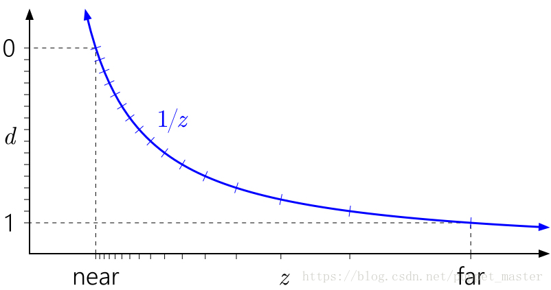

 	 

 	4Bit的深度的精度可以表示2^4也就是1/16的精度，但是由上图可以看出，在Z（相机空间）从near到far变化时，在near处精度很密集，而在Z超过1/2(far  -  near)这一段，几乎只有几个格子来表示这一段的精度了，也就是说，即使两个对象在远处离得很远，可能在深度Buffer里面二者也是归为深度相同的，那么在进行深度测试时，两个物体深度相同，两者的像素就都可能出现在前面，概率性地遮挡和不遮挡，就形成了ZFighting的现象。

 	要想缓解ZFighting，首先看一下深度表示的公式，以n位精度的深度来说，每一位的精度表示如下：

 	D（perBit） = （1<<n） * （aZ + b ） / Z = （1 <<n） * （a + b  / z）

 	让D（preBit）更小就是精度更高， 如果是线性深度，理论上我们的depth应该是  d = （Z - N）/ （F -  N）插值，由于一般而言F远远大于N，所以实际上影响因子主要在于F。但是与1/Z作为插值的话，大概可以这样理解d = （1/Z - 1/N）/  （1/F - 1/N），在这种情况下，实际上就是倒数影响了，那主要影响的因子实际上是N。

 	我们看一下近裁剪面对ZFighting的影响，看来Unity为了缓解ZFighting，近裁剪面最近只能设置为0.01（本人Unity版本2017.3），没办法看，所以这里用了之前的软渲染做测试了。

 	正常渲染的情况下（近裁剪面0.1）：

 	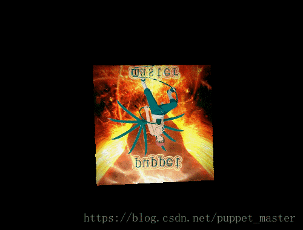

 	 

 	出现ZFighting的情况（近裁剪面0.00001f），在立方体的棱角位置出现了ZFighting：

 	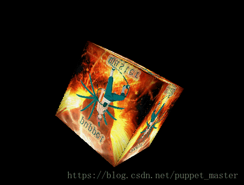

 	 

 	一个有效缓解ZFighting的方案就是尽可能远地放置近裁剪面（保证面前内容表现效果的情况下，太远会裁掉面前的东西）。将近裁剪面推远后的深度分布曲线如下， 可见，深度的分布曲线在远处被“提起来”，也就是远处获得了更大一些的精度分布：

 	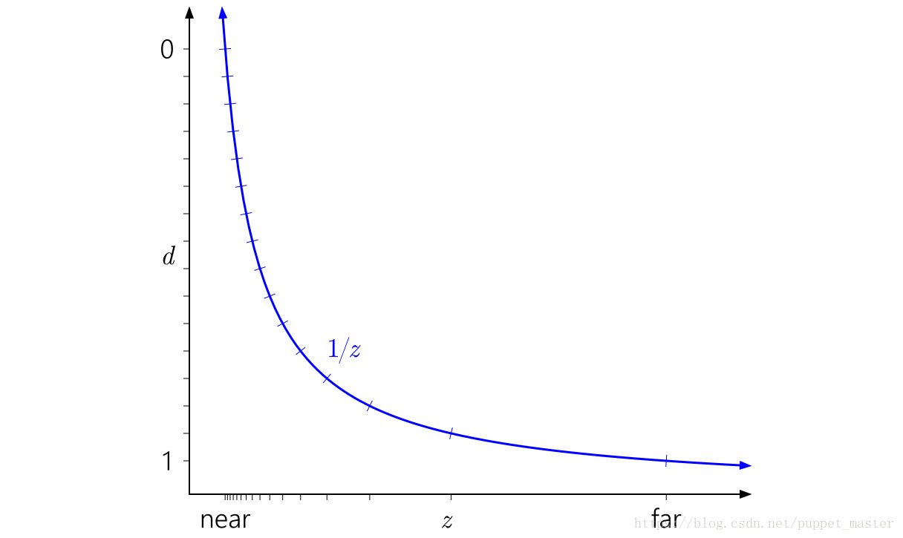

 	 

 	目前正常ZBuffer的方式，简单来说就是近处对象的深度精度极高，远处对象的深度精度极地，差了N个数量级。其实正常来说，这样的深度分布也是有好处的，因为我们在近处的精度高一些，远处精度低点，感觉也比较符合正常思维。如果只是为了保证近处渲染的效果，那么直接用正常的ZBuffer就是最好的选择了。但是，主要就在于超大视距，类似超大地图这种，既需要保证远处的精度，又希望保证近处的精度，远处精度衰减太厉害，所以ZFighting现象就出现了。

 	本人所了解过的缓解ZFighting的方案主要是下面几种（如果还有好玩的方案还望不吝赐教）：

 	1）提高深度Buffer的精度，精度高了，自然表现效果就好了。在渲染到RT上时，经常出现ZFighting的现象，16Bit满足不了效果的情况下选择24Bit深度。

 	2）尽可能远地放置相机的近裁剪面。

 	3）对于特别近的两个对象，适当考虑把二者之间的距离拉开一点，比如地面上的贴片，适当抬起来一点点（很无脑，但是最有效）。

 	4）对于实在有问题的情况，可以考虑Offset操作。本人曾经遇到在魅族MX4机型上渲染半透Prepass之后，半透的Pass和Prepass深度冲突，后来无奈给半透的Pass增加了一个Offset解决问题（比较特殊情况，只有这个机型很多效果都不对，简直给我带来了无尽的烦恼）。

 	5）动态切换远近裁剪面，即先设置很远的近裁剪面和远裁剪面，渲染远景物体，然后ClearDepthBuffer保留ColorBuffer，修改近裁剪面到很低的值，远裁剪面到刚才设置的近裁剪面值，再渲染近处物体。这个方案在分界处交叉的物体可能有问题，不过这个问题影响不大，主要是这样会导致Early-Z失效，先渲后面的再渲染前面的，成了画家算法，至少一遍overdarw。一般来说对于不透明物体的渲染顺序应该还是先渲染近处的，再渲染远处的物体（比如Unity）<个人感觉不太实用，目前Unity内不太好实现，这招是Ogre里面一个哥们分享的，但是方案比较好玩，可能是本渣渣没做过什么大世界，没有什么超大视距和近处细节同时兼顾的需求，所以没有被精度逼到这种程度吧，万一逼急了，谁管他overdraw呢？>。

 	6）不写硬件深度，直接写视空间深度，换句话说就是正常的线性深度，类似生成DepthNormalMap的方式。

 	7）Logarithmic Depth  Buffer，对数深度。与上一条类似，都是自己生成深度图。貌似GTA5中延迟渲染中生成深度的流程，就是自己算了一个对数深度，极大地提高了深度的精度，真是一切为了精度啊。比较复杂的玩法，没有玩过，Unity目前应该也不支持，需要pixel  shader里面对深度进行校正再写回，应该也会导致Early-Z失效，只能使用最终的ZCheck，不过延迟渲染会好很多。

 	8）最后还有一种能够有效缓解ZFighting的方法，就是Reverse-Z，这个Unity目前在一部分平台<OpenGL ES木有，已哭瞎>已经自带了。

##  	Reverse-Z

 	这一部分先贴出一篇Nvidia的关于Reverse-Z的文章（本文中深度精度分布图来自该文章），里面讲的很详细。

 	所谓Reverse-Z，直接翻译过来的意思是反转Z。顾名思义的话，ZBuffer（深度图）中存储的值是反过来的，也就是近裁剪面的深度值实际上是1，而远裁剪面的深度值是0。那么，我们的ZTest  LEqual就得当做ZTest GEqual来处理，采样的深度值都需要用1 -  depth喽，为何会做出如此反人道的设计呢？还是得从ZBuffer本身的存储1/Z的设定以及浮点数精度的问题着手。

 	上面我们看到了用定点精度表示深度的分布曲线，那么，如果改为浮点数，理论上浮点数可以表示的范围要远大于定点数，是否会对其有所缓解呢？额，关于具体原因，还是看这位大佬分析的浮点数精度相关的blog吧（当年上计算机组成原理的时候，貌似我还在沉迷COC，不过好在没挂科，233）。简单总结一下就是：浮点虽然表示的范围广，但是有精度损失，一个浮点数表示的其实是其周围的一个有理数区间，这个区间在0点处精度很高，而当浮点数本身很大时，根据科学计数法，小数部分乘以阶码表示最终的这个值，阶码越大，最终结果里面可以表示的真正小数的位数就变少，甚至没有了，所以浮点数的精度分布大概是酱紫的：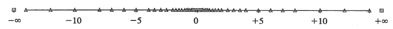

 	 

 	如果我们用浮点数表示精度的话，精度的曲线如下：

 	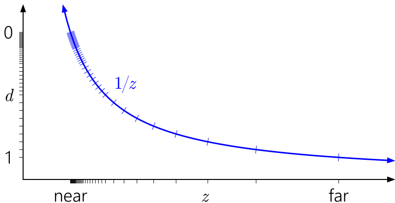

 	 

 	尴尬，浮点精度虽然高了，但是还是都集中在了近裁剪面，本身这个地方精度已经够高了，再高的话就是浪费了。于是乎前辈们就想到了一个非常巧妙的方法，既然浮点精度和ZBuffer精度都是在近裁剪面精度高，浮点精度我们没办法控制（IEEE标准就这样的），那就只能在ZBuffer的生成上做文章了。固定流水线的话，不好控制，但是目前基本都是可编程流水线，矩阵是自己传给shader的，那么只要把上面的投影矩阵改一下，让近裁剪面的深度置为1，远裁剪面的深度置为0，这样这个d  = a +  b/z的变换执行了一个相当于反向映射的操作，也就成了所谓的Reverse-Z。通过这个操作，把浮点数在0附近精度高抵消了深度远裁剪面精度低问题，使整体的深度Buffer精度有了较大的提高，使用了Reverse-Z的深度分布如下:

 	图：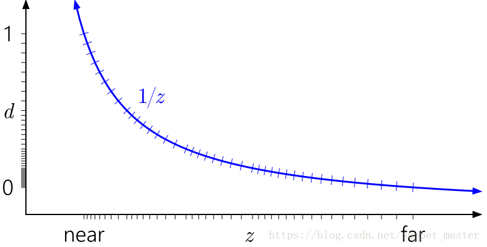

 	 

 	Reverse-Z的好处是提升了深度精度，坏处的话。。个人感觉应该就是不太好理解咯。主要的操作在于替换投影矩阵，深度映射提取时需要反向，ZTest全部反过来看，DepthClear需要修改。D3D的话，NDC是的Z是在01区间比较好实现，但是OpenGL的话，NDC的Z是在-1,1区间，这个值需要映射到01区间，需要有glClipControl强行设置远近裁剪面倒置。相当于多折腾一步映射，这个设定是在需要用Reverse-Z的情况还有写入深度图的时候都需要进行01映射，貌似在网上也看到不少人吐槽OpenGL强迫症地设计一个正方体的NDC。

 	Unity在5.5之后的版本里面，开始使用了Reverse-Z。不过，Unity封装得比较好，以至于一般情况下我们是不会发现问题的，Unity大法好啊。在上面推导了LinearEyeDepth和Linear01Depth两个函数的实现，但是还是建议使用Unity的API来进行这个变换，因为Unity不仅为我们封装了上面的变换，可以很方便地使用，还有一个更重要的问题，就是Unity帮我们处理了Reverse-Z的情况，我们自己如果不处理的话，得到的深度实际上是反向的，因为DepthBufferParam这个值在是否开启Reverse-Z的情况下，从引擎传过来的值是不一样的，完整版本的如下：

**[csharp]** view plain copy

 				 

 				 

print?

1.  			// Values used to linearize the Z buffer (http://www.humus.name/temp/Linearize%20depth.txt)  
2.  			// x = 1-far/near  
3.  			// y = far/near  
4.  			// z = x/far  
5.  			// w = y/far  
6.  			// or in case of a reversed depth buffer (UNITY_REVERSED_Z is 1)  
7.  			// x = -1+far/near  
8.  			// y = 1  
9.  			// z = x/far  
10.  			// w = 1/far  
11.  			float4 _ZBufferParams;  

 	通过修改x，y的值，LinearEyeDepth和Linear01Depth最终对于是否Reverse-Z都能得到正确的深度结果。

 	Unity关于Reverse-Z的其他部分主要在于MotionVector的生成，阴影的计算等地方有区别，如果自己用深度计算的时候，可能也需要考虑一下这个问题。最后再来看看哪些平台开了这个宏：

**[csharp]** view plain copy

 				 

 				 

print?

1.  			#if defined(SHADER_API_D3D11) || defined(SHADER_API_PSSL) || defined(SHADER_API_XBOXONE) || defined(SHADER_API_METAL) || defined(SHADER_API_VULKAN) || defined(SHADER_API_SWITCH)  
2.  			// D3D style platforms where clip space z is [0, 1].  
3.  			#define UNITY_REVERSED_Z 1  
4.  			#endi  

 	很遗憾，GLES没开（GL Core4.5原生支持，老版本GL的需要用扩展，ES压根没提），不过Mental和DX11开了。所以设备上出现某些深度表现和DX11表现不同相，可以往这个方向考虑一下（老版本插件升级到5.5之后有可能会出现这个问题）。

 	所以这个问题告诉我们一个道理：能用官方API，就用官方API，即使知道API的实现，也尽量别自己造轮子，造轮子神马的是学习的时候用的，除非没官方轮子，工程里如果不用官方API，纯属为后续升版本挖坑，逆着Unity干，一般没啥好结果（恩，说的就是我这个渣渣，之前没少干这种坏事，皮了一下很开心，升级时候改到死。不过，如果您是图形学或者Unity大佬的话，那还是想怎么玩就怎么玩）。

 	基于Reverse-Z，后续又有人发现了一些减少深度计算误差的方法，比如用无穷远的远裁剪面以及把投影矩阵单独拆开来与顶点相乘（个人感觉会略微损失一点性能吧），可以参考这篇论文。

##  	软粒子效果

 	上面看过了深度相关的基本知识，下面就到了基本的效果实践了。第一个，也是一个比较常见的深度的应用就是软粒子效果。何谓软，何谓硬，看一下下面的一张截图：

 	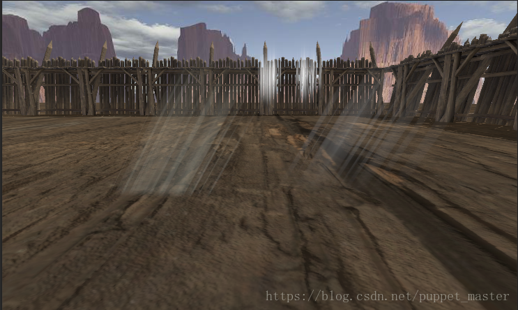

 	 

 	左侧为普通的粒子效果，而右侧为开启了软粒子的粒子效果。普通的粒子效果，和非透明的地面穿插时，是直接硬插进地面了，而右侧的软粒子效果，越靠近地面，粒子的alpha权重越低，到地面的时候就透明了，可见，软粒子相比于普通粒子能够更好地做到和非半透对象平滑过渡，不至于有明显的穿插。

 	下面看一下软粒子的实现，由于这个Unity是内置了这个效果，所以我就直接找到软粒子的shader源码添加点注释喽：

**[csharp]** view plain copy

 				 

 				 

print?

1.  			// Unity built-in shader source. Copyright (c) 2016 Unity Technologies. MIT license (see license.txt)  
2.  			  
3.  			Shader "Particles/Additive (Soft)" {  
4.  			Properties {  
5.  			    _MainTex ("Particle Texture", 2D) = "white" {}  
6.  			    _InvFade ("Soft Particles Factor", Range(0.01,3.0)) = 1.0  
7.  			}  
8.  			  
9.  			Category {  
10.  			    Tags { "Queue"="Transparent" "IgnoreProjector"="True" "RenderType"="Transparent" "PreviewType"="Plane" }  
11.  			    Blend One OneMinusSrcColor  
12.  			    ColorMask RGB  
13.  			    Cull Off Lighting Off ZWrite Off  
14.  			  
15.  			    SubShader {  
16.  			        Pass {  
17.  			  
18.  			            CGPROGRAM  
19.  			            #pragma vertex vert  
20.  			            #pragma fragment frag  
21.  			            #pragma target 2.0  
22.  			            #pragma multi_compile_particles  
23.  			            #pragma multi_compile_fog  
24.  			 
25.  			            #include "UnityCG.cginc"  
26.  			  
27.  			            sampler2D _MainTex;  
28.  			            fixed4 _TintColor;  
29.  			  
30.  			            struct appdata_t {  
31.  			                float4 vertex : POSITION;  
32.  			                fixed4 color : COLOR;  
33.  			                float2 texcoord : TEXCOORD0;  
34.  			                UNITY_VERTEX_INPUT_INSTANCE_ID  
35.  			            };  
36.  			  
37.  			            struct v2f {  
38.  			                float4 vertex : SV_POSITION;  
39.  			                fixed4 color : COLOR;  
40.  			                float2 texcoord : TEXCOORD0;  
41.  			                UNITY_FOG_COORDS(1)  
42.  			                #ifdef SOFTPARTICLES_ON  
43.  			                float4 projPos : TEXCOORD2;  
44.  			                #endif  
45.  			                UNITY_VERTEX_OUTPUT_STEREO  
46.  			            };  
47.  			  
48.  			            float4 _MainTex_ST;  
49.  			  
50.  			            v2f vert (appdata_t v)  
51.  			            {  
52.  			                v2f o;  
53.  			                UNITY_SETUP_INSTANCE_ID(v);  
54.  			                UNITY_INITIALIZE_VERTEX_OUTPUT_STEREO(o);  
55.  			                o.vertex = UnityObjectToClipPos(v.vertex);  
56.  			                #ifdef SOFTPARTICLES_ON  
57.  			                //计算顶点在屏幕空间的位置（没有进行透视除法）  
58.  			                o.projPos = ComputeScreenPos (o.vertex);  
59.  			                //计算顶点距离相机的距离  
60.  			                COMPUTE_EYEDEPTH(o.projPos.z);  
61.  			                #endif  
62.  			                o.color = v.color;  
63.  			                o.texcoord = TRANSFORM_TEX(v.texcoord,_MainTex);  
64.  			                UNITY_TRANSFER_FOG(o,o.vertex);  
65.  			                return o;  
66.  			            }  
67.  			  
68.  			            UNITY_DECLARE_DEPTH_TEXTURE(_CameraDepthTexture);  
69.  			            float _InvFade;  
70.  			  
71.  			            fixed4 frag (v2f i) : SV_Target  
72.  			            {  
73.  			                #ifdef SOFTPARTICLES_ON  
74.  			                //根据上面的屏幕空间位置，进行透视采样深度图（tex2dproj，即带有透视除法的采样，相当于tex2d（xy/w）），  
75.  			                //得到当前像素对应在屏幕深度图的深度，并转化到视空间，线性化（深度图中已有的不透明对象的深度）  
76.  			                float sceneZ = LinearEyeDepth (SAMPLE_DEPTH_TEXTURE_PROJ(_CameraDepthTexture, UNITY_PROJ_COORD(i.projPos)));  
77.  			                //本像素点在视空间真正的距离（粒子本身的深度）  
78.  			                float partZ = i.projPos.z;  
79.  			                //计算二者的深度差，该值越小，说明越近穿插  
80.  			                float fade = saturate (_InvFade * (sceneZ-partZ));  
81.  			                //上面的深度差调整粒子的alpha值  
82.  			                i.color.a *= fade;  
83.  			                #endif  
84.  			  
85.  			                half4 col = i.color * tex2D(_MainTex, i.texcoord);  
86.  			                col.rgb *= col.a;  
87.  			                UNITY_APPLY_FOG_COLOR(i.fogCoord, col, fixed4(0,0,0,0)); // fog towards black due to our blend mode  
88.  			                return col;  
89.  			            }  
90.  			            ENDCG  
91.  			        }  
92.  			    }  
93.  			}  
94.  			}  

 	基本思想就是，在渲染粒子效果时，先取当前屏幕空间深度图对应该像素点的深度值，然后计算该粒子对应该像素点位置的深度值（二者都转化到了视空间），然后用两个深度差作为一个系数调制粒子的alpha值，最终达到让粒子接近不透明物体的部分渐变淡出的效果。

 	上面的函数中有使用了一个这样的宏，通过该宏直接把顶点转化到视空间，取z值的负数就是真正的视空间距离了。

**[csharp]** view plain copy

 				 

 				 

print?

1.  			#define COMPUTE_EYEDEPTH(o) o = -UnityObjectToViewPos( v.vertex ).z  

 	软粒子效果，虽然使用了深度图，但是比较麻烦，需要各种坐标转换，因为要在对象空间使用屏幕空间的深度，所以不得不ComputeScreenPos，并tex2Dproj，非常折腾，这也足以见得软粒子有多费，不仅仅在于渲染深度图本身的消耗，自身计算也是非常费的，再加上粒子一般都是半透，不写深度，没办法在粒子之间通过early-z优化，导致overdraw非常高，逐像素计算爆炸。看着为了这个渐变导致的这个计算量，我感觉移动上，粒子穿插还是忍了吧，万一有美术同学问我，我就假装不知道-_-。

 	其实Unity的软粒子这套写法，可以用在不少其他效果中，比如水面，海边等根据深度渐变的效果（刷顶点色或许更省一些），我不只在一个水插件中看到上面的这套写法了，变量名都一样，今天才算是找到“始作俑者”，哈哈哈（额，这好像是个贬义词，我特意百度了一下，实在没找到啥别的词儿，我没有贬义的意思哈。。。看来我的语文是百度老师教的）。

##  	基于深度的扫描波效果

 	下面来搞个很简单，但是很好玩的效果，这个效果没有乱七八糟的ComputeScreenPos之类的，直接就是在屏幕空间进行的，恩，也就是我最爱的后处理啦，开心！

 	这个效果即blog开头《恶灵附身》截图的第一张图的类似效果。先观察一下，基本效果就是一个高亮的区域，按照深度由远及近地运动，直到略过摄像机。恩，我直接简单粗暴地在shader里判断了一下：

**[csharp]** view plain copy

 				 

 				 

print?

1.  			//puppet_master  
2.  			//https://blog.csdn.net/puppet_master  
3.  			//2018.5.27    
4.  			//基于深度的扫描效果  
5.  			Shader "DepthTexture/ScreenDepthScan"   
6.  			{  
7.  			    Properties  
8.  			    {  
9.  			        _MainTex("Base (RGB)", 2D) = "white" {}  
10.  			    }  
11.  			      
12.  			    CGINCLUDE  
13.  			    #include "UnityCG.cginc"  
14.  			    sampler2D _CameraDepthTexture;  
15.  			    sampler2D _MainTex;  
16.  			    fixed4 _ScanLineColor;  
17.  			    float _ScanValue;  
18.  			    float _ScanLineWidth;  
19.  			    float _ScanLightStrength;  
20.  			      
21.  			    float4 frag_depth(v2f_img i) : SV_Target  
22.  			    {  
23.  			        float depthTextureValue = SAMPLE_DEPTH_TEXTURE(_CameraDepthTexture, i.uv);  
24.  			        float linear01EyeDepth = Linear01Depth(depthTextureValue);  
25.  			        fixed4 screenTexture = tex2D(_MainTex, i.uv);  
26.  			          
27.  			        if (linear01EyeDepth > _ScanValue && linear01EyeDepth < _ScanValue + _ScanLineWidth)  
28.  			        {  
29.  			            return screenTexture * _ScanLightStrength * _ScanLineColor;  
30.  			        }  
31.  			        return screenTexture;  
32.  			    }  
33.  			    ENDCG  
34.  			  
35.  			    SubShader  
36.  			    {  
37.  			        Pass  
38.  			        {  
39.  			            ZTest Off  
40.  			            Cull Off  
41.  			            ZWrite Off  
42.  			            Fog{ Mode Off }  
43.  			  
44.  			            CGPROGRAM  
45.  			            #pragma vertex vert_img  
46.  			            #pragma fragment frag_depth  
47.  			            ENDCG  
48.  			        }  
49.  			    }  
50.  			}  

 	C#代码如下，一些边界条件的判断放在c#里面，要比shader全屏计算效率好得多：

**[csharp]** view plain copy

 				 

 				 

print?

1.  			/******************************************************************** 
2.  			 FileName: ScreenDepthScan.cs 
3.  			 Description:深度扫描线效果 
4.  			 Created: 2018/05/27 
5.  			 history: 27:5:2018 1:25 by puppet_master 
6.  			 https://blog.csdn.net/puppet_master 
7.  			*********************************************************************/  
8.  			using System.Collections;  
9.  			using System.Collections.Generic;  
10.  			using UnityEngine;  
11.  			  
12.  			[ExecuteInEditMode]  
13.  			public class ScreenDepthScan : MonoBehaviour  
14.  			{  
15.  			    private Material postEffectMat = null;  
16.  			    private Camera currentCamera = null;  
17.  			  
18.  			    [Range(0.0f, 1.0f)]  
19.  			    public float scanValue = 0.05f;  
20.  			    [Range(0.0f, 0.5f)]  
21.  			    public float scanLineWidth = 0.02f;  
22.  			    [Range(0.0f, 10.0f)]  
23.  			    public float scanLightStrength = 10.0f;  
24.  			    public Color scanLineColor = Color.white;  
25.  			  
26.  			    void Awake()  
27.  			    {  
28.  			        currentCamera = GetComponent<Camera>();  
29.  			    }  
30.  			  
31.  			    void OnEnable()  
32.  			    {  
33.  			        if (postEffectMat == null)  
34.  			            postEffectMat = new Material(Shader.Find("DepthTexture/ScreenDepthScan"));  
35.  			        currentCamera.depthTextureMode |= DepthTextureMode.Depth;  
36.  			    }  
37.  			  
38.  			    void OnDisable()  
39.  			    {  
40.  			        currentCamera.depthTextureMode &= ~DepthTextureMode.Depth;  
41.  			    }  
42.  			  
43.  			    void OnRenderImage(RenderTexture source, RenderTexture destination)  
44.  			    {  
45.  			        if (postEffectMat == null)  
46.  			        {  
47.  			            Graphics.Blit(source, destination);  
48.  			        }  
49.  			        else  
50.  			        {  
51.  			            //限制一下最大值，最小值  
52.  			            float lerpValue = Mathf.Min(0.95f, 1 - scanValue);  
53.  			            if (lerpValue < 0.0005f)  
54.  			                lerpValue = 1;  
55.  			              
56.  			            //此处可以一个vec4传进去优化  
57.  			            postEffectMat.SetFloat("_ScanValue", lerpValue);  
58.  			            postEffectMat.SetFloat("_ScanLineWidth", scanLineWidth);  
59.  			            postEffectMat.SetFloat("_ScanLightStrength", scanLightStrength);  
60.  			            postEffectMat.SetColor("_ScanLineColor", scanLineColor);  
61.  			            Graphics.Blit(source, destination, postEffectMat);  
62.  			        }  
63.  			          
64.  			    }  
65.  			}  

 	效果如下：

 	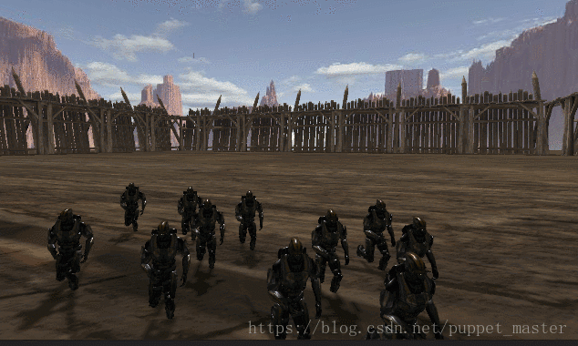

 	 

 	当然，如果为了好玩的话，可以再加点别的效果烘托一下分为，比如结合一下时空扭曲效果：

 	shader代码：

**[csharp]** view plain copy

 				 

 				 

print?

1.  			//puppet_master  
2.  			//https://blog.csdn.net/puppet_master    
3.  			//2018.6.10    
4.  			//基于深度的扫描效果，附带扭曲  
5.  			Shader "DepthTexture/ScreenDepthScanWithDistort"   
6.  			{  
7.  			    Properties  
8.  			    {  
9.  			        _MainTex("Base (RGB)", 2D) = "white" {}  
10.  			    }  
11.  			      
12.  			    CGINCLUDE  
13.  			    #include "UnityCG.cginc"  
14.  			    sampler2D _CameraDepthTexture;  
15.  			    sampler2D _MainTex;  
16.  			    fixed4 _ScanLineColor;  
17.  			    float _ScanValue;  
18.  			    float _ScanLineWidth;  
19.  			    float _ScanLightStrength;  
20.  			    float _DistortFactor;  
21.  			    float _DistortValue;  
22.  			      
23.  			    float4 frag_depth(v2f_img i) : SV_Target  
24.  			    {  
25.  			          
26.  			        float depthTextureValue = SAMPLE_DEPTH_TEXTURE(_CameraDepthTexture, i.uv);  
27.  			        float linear01EyeDepth = Linear01Depth(depthTextureValue);  
28.  			          
29.  			        float2 dir = i.uv - float2(0.5, 0.5);    
30.  			        float2 offset = _DistortFactor * normalize(dir) * (1 - length(dir));    
31.  			        float2 uv = i.uv - offset * _DistortValue * linear01EyeDepth;    
32.  			        fixed4 screenTexture = tex2D(_MainTex, uv);    
33.  			        if (linear01EyeDepth > _ScanValue && linear01EyeDepth < _ScanValue + _ScanLineWidth)  
34.  			        {  
35.  			            return screenTexture * _ScanLightStrength * _ScanLineColor;  
36.  			        }  
37.  			        return screenTexture;  
38.  			    }  
39.  			    ENDCG  
40.  			  
41.  			    SubShader  
42.  			    {  
43.  			        Pass  
44.  			        {  
45.  			            ZTest Off  
46.  			            Cull Off  
47.  			            ZWrite Off  
48.  			            Fog{ Mode Off }  
49.  			  
50.  			            CGPROGRAM  
51.  			            #pragma vertex vert_img  
52.  			            #pragma fragment frag_depth  
53.  			            ENDCG  
54.  			        }  
55.  			    }  
56.  			}  

 	C#代码：

**[csharp]** view plain copy

 				 

 				 

print?

1.  			/******************************************************************** 
2.  			 FileName: ScreenDepthScan.cs 
3.  			 Description:深度扫描线效果，附带扭曲 
4.  			 Created: 2018/06/10 
5.  			 history: 10:6:2018 10:25 by puppet_master 
6.  			 https://blog.csdn.net/puppet_master 
7.  			*********************************************************************/  
8.  			using System.Collections;  
9.  			using System.Collections.Generic;  
10.  			using UnityEngine;  
11.  			  
12.  			[ExecuteInEditMode]  
13.  			public class ScreenDepthScanWithDistort : MonoBehaviour  
14.  			{  
15.  			    private Material postEffectMat = null;  
16.  			    private Camera currentCamera = null;  
17.  			  
18.  			    [Range(0.0f, 1.0f)]  
19.  			    public float scanValue = 0.05f;  
20.  			    [Range(0.0f, 0.5f)]  
21.  			    public float scanLineWidth = 0.02f;  
22.  			    [Range(0.0f, 10.0f)]  
23.  			    public float scanLightStrength = 10.0f;  
24.  			    [Range(0.0f, 0.04f)]  
25.  			    public float distortFactor = 0.02f;  
26.  			    public Color scanLineColor = Color.white;  
27.  			  
28.  			    void Awake()  
29.  			    {  
30.  			        currentCamera = GetComponent<Camera>();  
31.  			    }  
32.  			  
33.  			    void OnEnable()  
34.  			    {  
35.  			        if (postEffectMat == null)  
36.  			            postEffectMat = new Material(Shader.Find("DepthTexture/ScreenDepthScanWithDistort"));  
37.  			        currentCamera.depthTextureMode |= DepthTextureMode.Depth;  
38.  			    }  
39.  			  
40.  			    void OnDisable()  
41.  			    {  
42.  			        currentCamera.depthTextureMode &= ~DepthTextureMode.Depth;  
43.  			    }  
44.  			  
45.  			    void OnRenderImage(RenderTexture source, RenderTexture destination)  
46.  			    {  
47.  			        if (postEffectMat == null)  
48.  			        {  
49.  			            Graphics.Blit(source, destination);  
50.  			        }  
51.  			        else  
52.  			        {  
53.  			            //限制一下最大值，最小值  
54.  			            float lerpValue = Mathf.Min(0.95f, 1 - scanValue);  
55.  			            if (lerpValue < 0.0005f)  
56.  			                lerpValue = 1;  
57.  			  
58.  			            //此处可以一个vec4传进去优化  
59.  			            postEffectMat.SetFloat("_ScanValue", lerpValue);  
60.  			            postEffectMat.SetFloat("_ScanLineWidth", scanLineWidth);  
61.  			            postEffectMat.SetFloat("_ScanLightStrength", scanLightStrength);  
62.  			            postEffectMat.SetFloat("_DistortFactor", distortFactor);  
63.  			            postEffectMat.SetFloat("_DistortValue", 1 - scanValue);  
64.  			            postEffectMat.SetColor("_ScanLineColor", scanLineColor);  
65.  			            Graphics.Blit(source, destination, postEffectMat);  
66.  			        }  
67.  			  
68.  			    }  
69.  			}  

 	效果：

 	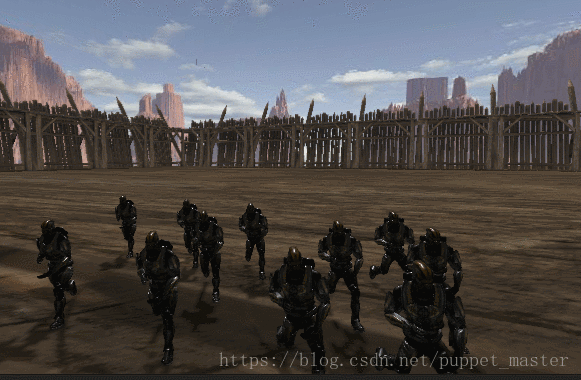

 	 

 	个人感觉扭曲和深度重建某些情况下是冲突的，如果仔细观察其实可能会发现图片有重影，但是，鉴于扫描速度很快，这点穿帮其实应该还是可以接受的。这不由得让我想起了做剧情的时候，给剧情做了不少效果，但是策划妹纸特别爱用震屏，景深，径向模糊这几个效果，我十分不解，后来我才知道其中缘由：“我们有好多地方都有穿帮，震一下，或者模糊一下，玩家就不注意了”，正所谓天下武功唯快不破，哇咔咔。

##  	根据深度重建世界坐标

 	下面打算再用深度做几个更好玩的效果。但是这几个效果略微有些复杂，主要就在于不仅仅需要的是深度信息，还需要得到世界坐标的信息，也就是说我需要根据深度图反推当前世界坐标位置。

###  	证明世界坐标重建正确的方法

 	首先，得先找到一种证明反推回世界空间位置正确的方法。这里，我在相机前摆放几个物体，尽量使之在世界坐标下的位置小于1，方便判定颜色如下图：

 	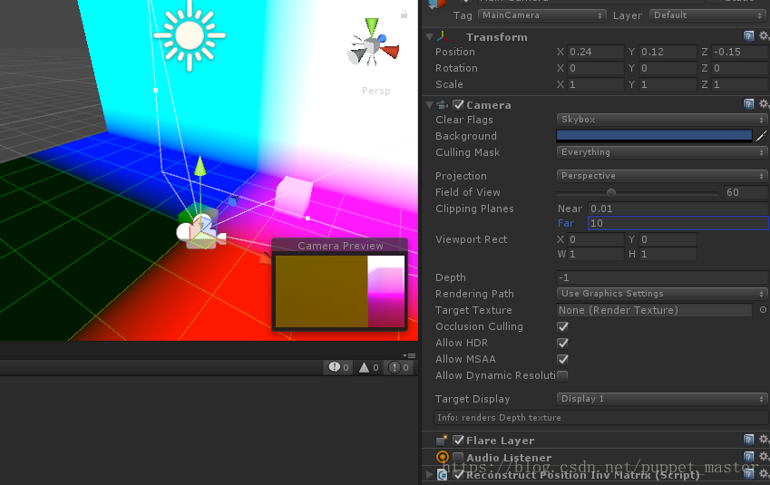

 	 

 	然后将几个物体的shader换成如下的一个打印世界空间位置的shader：

**[csharp]** view plain copy

 				 

 				 

print?

1.  			//puppet_master  
2.  			//https://blog.csdn.net/puppet_master    
3.  			//2018.6.10    
4.  			//打印对象在世界空间位置  
5.  			Shader "DepthTexture/WorldPosPrint"  
6.  			{  
7.  			    SubShader  
8.  			    {  
9.  			        Tags { "RenderType"="Opaque" }  
10.  			        LOD 100  
11.  			  
12.  			        Pass  
13.  			        {  
14.  			            CGPROGRAM  
15.  			            #pragma vertex vert  
16.  			            #pragma fragment frag  
17.  			             
18.  			            #include "UnityCG.cginc"  
19.  			  
20.  			            struct appdata  
21.  			            {  
22.  			                float4 vertex : POSITION;  
23.  			                float2 uv : TEXCOORD0;  
24.  			            };  
25.  			  
26.  			            struct v2f  
27.  			            {  
28.  			                float3 worldPos : TEXCOORD0;  
29.  			                float4 vertex : SV_POSITION;  
30.  			            };  
31.  			              
32.  			            v2f vert (appdata v)  
33.  			            {  
34.  			                v2f o;  
35.  			                o.vertex = UnityObjectToClipPos(v.vertex);  
36.  			                o.worldPos = mul(unity_ObjectToWorld, v.vertex);  
37.  			                return o;  
38.  			            }  
39.  			              
40.  			            fixed4 frag (v2f i) : SV_Target  
41.  			            {  
42.  			                return fixed4(i.worldPos, 1.0);  
43.  			            }  
44.  			            ENDCG  
45.  			        }  
46.  			    }  
47.  			    //fallback使之有shadow caster的pass  
48.  			    FallBack "Legacy Shaders/Diffuse"  
49.  			}  

 	然后挂上上面的重建世界坐标位置的脚本，在开启和关闭脚本前后，屏幕输出完全无变化，说明通过后处理重建世界坐标位置与直接用shader输出世界坐标位置效果一致：
 	 

 	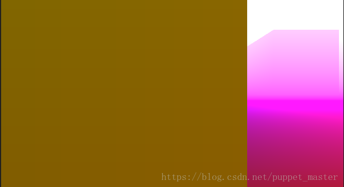

 	 

###  	逆矩阵方式重建

 	深度重建有几种方式，先来看一个最简单粗暴，但是看起来最容易理解的方法：

 	我们得到的屏幕空间深度图的坐标，xyz都是在（0,1）区间的，需要经过一步变换，变换到NDC空间，OpenGL风格的话就都是（-1,1）区间，所以需要首先对xy以及xy对应的深度z进行*2 - 1映射。然后再将结果进行VP的逆变换，就得到了世界坐标。

 	shader代码如下：

**[csharp]** view plain copy

 				 

 				 

print?

1.  			//puppet_master  
2.  			//https://blog.csdn.net/puppet_master    
3.  			//2018.6.10    
4.  			//通过逆矩阵的方式从深度图构建世界坐标  
5.  			Shader "DepthTexture/ReconstructPositionInvMatrix"   
6.  			{  
7.  			    CGINCLUDE  
8.  			    #include "UnityCG.cginc"  
9.  			    sampler2D _CameraDepthTexture;  
10.  			    float4x4 _InverseVPMatrix;  
11.  			      
12.  			    fixed4 frag_depth(v2f_img i) : SV_Target  
13.  			    {  
14.  			        float depthTextureValue = SAMPLE_DEPTH_TEXTURE(_CameraDepthTexture, i.uv);  
15.  			        //自己操作深度的时候，需要注意Reverse_Z的情况  
16.  			        #if defined(UNITY_REVERSED_Z)  
17.  			        depthTextureValue = 1 - depthTextureValue;  
18.  			        #endif  
19.  			        float4 ndc = float4(i.uv.x * 2 - 1, i.uv.y * 2 - 1, depthTextureValue * 2 - 1, 1);  
20.  			          
21.  			        float4 worldPos = mul(_InverseVPMatrix, ndc);  
22.  			        worldPos /= worldPos.w;  
23.  			        return worldPos;  
24.  			    }  
25.  			    ENDCG  
26.  			  
27.  			    SubShader  
28.  			    {  
29.  			        Pass  
30.  			        {  
31.  			            ZTest Off  
32.  			            Cull Off  
33.  			            ZWrite Off  
34.  			            Fog{ Mode Off }  
35.  			  
36.  			            CGPROGRAM  
37.  			            #pragma vertex vert_img  
38.  			            #pragma fragment frag_depth  
39.  			            ENDCG  
40.  			        }  
41.  			    }  
42.  			}  

 	C#部分：

**[csharp]** view plain copy

 				 

 				 

print?

1.  			/******************************************************************** 
2.  			 FileName: ReconstructPositionInvMatrix.cs 
3.  			 Description:从深度图构建世界坐标，逆矩阵方式 
4.  			 Created: 2018/06/10 
5.  			 history: 10:6:2018 13:09 by puppet_master 
6.  			 https://blog.csdn.net/puppet_master 
7.  			*********************************************************************/  
8.  			using System.Collections;  
9.  			using System.Collections.Generic;  
10.  			using UnityEngine;  
11.  			  
12.  			[ExecuteInEditMode]  
13.  			public class ReconstructPositionInvMatrix : MonoBehaviour {  
14.  			  
15.  			    private Material postEffectMat = null;  
16.  			    private Camera currentCamera = null;  
17.  			  
18.  			    void Awake()  
19.  			    {  
20.  			        currentCamera = GetComponent<Camera>();  
21.  			    }  
22.  			  
23.  			    void OnEnable()  
24.  			    {  
25.  			        if (postEffectMat == null)  
26.  			            postEffectMat = new Material(Shader.Find("DepthTexture/ReconstructPositionInvMatrix"));  
27.  			        currentCamera.depthTextureMode |= DepthTextureMode.Depth;  
28.  			    }  
29.  			  
30.  			    void OnDisable()  
31.  			    {  
32.  			        currentCamera.depthTextureMode &= ~DepthTextureMode.Depth;  
33.  			    }  
34.  			  
35.  			    void OnRenderImage(RenderTexture source, RenderTexture destination)  
36.  			    {  
37.  			        if (postEffectMat == null)  
38.  			        {  
39.  			            Graphics.Blit(source, destination);  
40.  			        }  
41.  			        else  
42.  			        {  
43.  			            var vpMatrix = currentCamera.projectionMatrix * currentCamera.worldToCameraMatrix;  
44.  			            postEffectMat.SetMatrix("_InverseVPMatrix", vpMatrix.inverse);  
45.  			            Graphics.Blit(source, destination, postEffectMat);  
46.  			        }  
47.  			    }  
48.  			}  

 	效果如下，重建ok：
 	 

 	

 	 

 	看起来比较简单，但是其中有一个/w的操作，如果按照正常思维来算，应该是先乘以w，然后进行逆变换，最后再把world中的w抛弃，即是最终的世界坐标，不过实际上投影变换是一个损失维度的变换，我们并不知道应该乘以哪个w，所以实际上上面的计算，并非按照理想的情况进行的计算，而是根据计算推导而来（更加详细推导请参考这篇文章，不过我感觉这个推导有点绕）。

 	已知条件（M为VP矩阵，M^-1即为其逆矩阵，Clip为裁剪空间，ndc为标准设备空间，world为世界空间）：

 	ndc = Clip.xyzw / Clip.w = Clip / Clip.w

 	world = M^-1 * Clip

 	二者结合得：

 	world = M ^-1 * ndc * Clip.w

 	我们已知M和ndc，然而还是不知道Clip.w，但是有一个特殊情况，是world的w坐标，经过变换后应该是1，即

 	1 = world.w = （M^-1 * ndc）.w * Clip.w

 	进而得到Clip.w = 1 / （M^ -1 * ndc）.w

 	带入上面等式得到：

 	world = （M ^ -1 * ndc） / （M ^ -1 * ndc）.w

 	所以，世界坐标就等于ndc进行VP逆变换之后再除以自身的w。

 	不过这种方式重建世界坐标，性能比较差，一般来说，我们都是逐顶点地进行矩阵运算，毕竟定点数一般还是比较少的，但是全屏幕逐像素进行矩阵运算，这个计算量就不是一般的大了，性能肯定是吃不消的。

###  	屏幕射线插值方式重建

 	这种方式的重建，可以参考Secrets of CryENGINE 3 Graphics Technology这个CryTech 2011年的PPT。借用一张图：

 	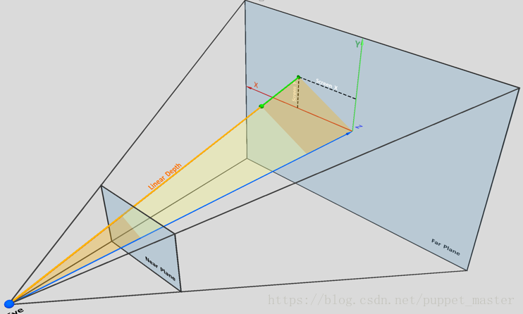

 	 

 	然后偶再画个平面的图：

 	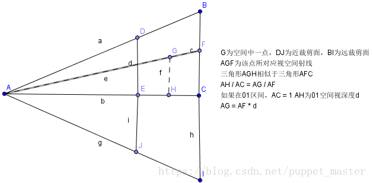

 	 

 	上图中，A为相机位置，G为空间中我们要重建的一点，那么该点的世界坐标为A（worldPos）  + 向量AG，我们要做的就是求得向量AG即可。根据三角形相似的原理，三角形AGH相似于三角形AFC，则得到AH / AC = AG /  AF。由于三角形相似就是比例关系，所以我们可以把AH /  AC看做01区间的比值，那么AC就相当于远裁剪面距离，即为1，AH就是我们深度图采样后变换到01区间的深度值，即Linear01Depth的结果d。那么，AG  = AF *  d。所以下一步就是求AF，即求出相机到屏幕空间每个像素点对应的射线方向。看到上面的立体图，其实我们可以根据相机的各种参数，求得视锥体对应四个边界射线的值，这个操作在vertex阶段进行，由于我们的后处理实际上就是渲染了一个Quad，上下左右四个顶点，把这个射线传递给pixel阶段时，就会自动进行插值计算，也就是说在顶点阶段的方向值到pixel阶段就变成了逐像素的射线方向。

 	那么我们要求的其实就相当于AB这条向量的值，以上下平面为例，三维向量只比二维多一个维度，我们已知远裁剪面距离F，相机的三个方向（相机transform.forward，.right，.up），AB  = AC + CB，|BC| = tan(0.5fov) * |AC|，|AC| = Far，AC = transorm.forward *  Far，CB = transform.up * tan(0.5fov) * Far。

 	我直接使用了远裁剪面对应的位置计算了三个方向向量，进而组合得到最终四个角的向量。用远裁剪面的计算代码比较简单（恩，我懒），不过《ShaderLab入门精要》中使用的是近裁剪面+比例计算，不确定是否有什么考虑（比如精度，没有测出来，如果有大佬知道，还望不吝赐教）。

 	shader代码如下：

**[csharp]** view plain copy

 				 

 				 

print?

1.  			//puppet_master  
2.  			//https://blog.csdn.net/puppet_master    
3.  			//2018.6.16    
4.  			//通过深度图重建世界坐标，视口射线插值方式  
5.  			Shader "DepthTexture/ReconstructPositionViewPortRay"   
6.  			{  
7.  			    CGINCLUDE  
8.  			    #include "UnityCG.cginc"  
9.  			    sampler2D _CameraDepthTexture;  
10.  			    float4x4 _ViewPortRay;  
11.  			      
12.  			    struct v2f  
13.  			    {  
14.  			        float4 pos : SV_POSITION;  
15.  			        float2 uv : TEXCOORD0;  
16.  			        float4 rayDir : TEXCOORD1;  
17.  			    };  
18.  			      
19.  			    v2f vertex_depth(appdata_base v)  
20.  			    {  
21.  			        v2f o;  
22.  			        o.pos = UnityObjectToClipPos(v.vertex);  
23.  			        o.uv = v.texcoord.xy;  
24.  			          
25.  			        //用texcoord区分四个角，就四个点，if无所谓吧  
26.  			        int index = 0;  
27.  			        if (v.texcoord.x < 0.5 && v.texcoord.y > 0.5)  
28.  			            index = 0;  
29.  			        else if (v.texcoord.x > 0.5 && v.texcoord.y > 0.5)  
30.  			            index = 1;  
31.  			        else if (v.texcoord.x < 0.5 && v.texcoord.y < 0.5)  
32.  			            index = 2;  
33.  			        else  
34.  			            index = 3;  
35.  			          
36.  			        o.rayDir = _ViewPortRay[index];  
37.  			        return o;  
38.  			          
39.  			    }  
40.  			      
41.  			    fixed4 frag_depth(v2f i) : SV_Target  
42.  			    {  
43.  			          
44.  			        float depthTextureValue = SAMPLE_DEPTH_TEXTURE(_CameraDepthTexture, i.uv);  
45.  			        float linear01Depth = Linear01Depth(depthTextureValue);  
46.  			        //worldpos = campos + 射线方向 * depth  
47.  			        float3 worldPos = _WorldSpaceCameraPos + linear01Depth * i.rayDir.xyz;  
48.  			        return fixed4(worldPos, 1.0);  
49.  			    }  
50.  			    ENDCG  
51.  			  
52.  			    SubShader  
53.  			    {  
54.  			        Pass  
55.  			        {  
56.  			            ZTest Off  
57.  			            Cull Off  
58.  			            ZWrite Off  
59.  			            Fog{ Mode Off }  
60.  			  
61.  			            CGPROGRAM  
62.  			            #pragma vertex vertex_depth  
63.  			            #pragma fragment frag_depth  
64.  			            ENDCG  
65.  			        }  
66.  			    }  
67.  			}  

 	C#代码如下：

**[csharp]** view plain copy

 				 

 				 

print?

1.  			/******************************************************************** 
2.  			 FileName: ReconstructPositionViewPortRay.cs 
3.  			 Description:通过深度图重建世界坐标，视口射线插值方式 
4.  			 Created: 2018/06/16 
5.  			 history: 16:6:2018 16:17 by puppet_master 
6.  			 https://blog.csdn.net/puppet_master 
7.  			*********************************************************************/  
8.  			using System.Collections;  
9.  			using System.Collections.Generic;  
10.  			using UnityEngine;  
11.  			  
12.  			[ExecuteInEditMode]  
13.  			public class ReconstructPositionViewPortRay : MonoBehaviour {  
14.  			  
15.  			    private Material postEffectMat = null;  
16.  			    private Camera currentCamera = null;  
17.  			  
18.  			    void Awake()  
19.  			    {  
20.  			        currentCamera = GetComponent<Camera>();  
21.  			    }  
22.  			  
23.  			    void OnEnable()  
24.  			    {  
25.  			        if (postEffectMat == null)  
26.  			            postEffectMat = new Material(Shader.Find("DepthTexture/ReconstructPositionViewPortRay"));  
27.  			        currentCamera.depthTextureMode |= DepthTextureMode.Depth;  
28.  			    }  
29.  			  
30.  			    void OnDisable()  
31.  			    {  
32.  			        currentCamera.depthTextureMode &= ~DepthTextureMode.Depth;  
33.  			    }  
34.  			  
35.  			    void OnRenderImage(RenderTexture source, RenderTexture destination)  
36.  			    {  
37.  			        if (postEffectMat == null)  
38.  			        {  
39.  			            Graphics.Blit(source, destination);  
40.  			        }  
41.  			        else  
42.  			        {  
43.  			            var aspect = currentCamera.aspect;  
44.  			            var far = currentCamera.farClipPlane;  
45.  			            var right = transform.right;  
46.  			            var up = transform.up;  
47.  			            var forward = transform.forward;  
48.  			            var halfFovTan = Mathf.Tan(currentCamera.fieldOfView * 0.5f * Mathf.Deg2Rad);  
49.  			  
50.  			            //计算相机在远裁剪面处的xyz三方向向量  
51.  			            var rightVec = right * far * halfFovTan * aspect;  
52.  			            var upVec = up * far * halfFovTan;  
53.  			            var forwardVec = forward * far;  
54.  			  
55.  			            //构建四个角的方向向量  
56.  			            var topLeft = (forwardVec - rightVec + upVec);  
57.  			            var topRight = (forwardVec + rightVec + upVec);  
58.  			            var bottomLeft = (forwardVec - rightVec - upVec);  
59.  			            var bottomRight = (forwardVec + rightVec - upVec);  
60.  			  
61.  			            var viewPortRay = Matrix4x4.identity;  
62.  			            viewPortRay.SetRow(0, topLeft);  
63.  			            viewPortRay.SetRow(1, topRight);  
64.  			            viewPortRay.SetRow(2, bottomLeft);  
65.  			            viewPortRay.SetRow(3, bottomRight);  
66.  			  
67.  			            postEffectMat.SetMatrix("_ViewPortRay", viewPortRay);  
68.  			            Graphics.Blit(source, destination, postEffectMat);  
69.  			        }  
70.  			    }  
71.  			}  

 	开关后处理前后效果仍然不变：

 	

 	 

 	这里我用了默认非线性的深度图进行的深度计算，需要先进行Linear01Depth计算，如果用了线性深度，比如DepthNormalTexture，那么就进行一步简单的线性映射即可。整体的射线计算，我用了Linear01Depth  * 外围计算好的距离。也可以用LinearEyeDepth *  外围计算好的方向。总之，方案还是蛮多的，变种也很多，还有自己重写Graphic.Blit自己设置Quad的值把index设置在顶点的z值中。

##  	屏幕空间高度或距离雾效果

 	在后处理阶段拿到世界空间位置，我们就可以做一些更加好玩的效果啦。屏幕空间高度或者距离雾就是其中之一。正常Unity中的雾效，实际上是在shader计算结束之后和雾效颜色根据世界空间距离计算的指数或者线性雾，对于一般的表现已经很好啦。而这个效果主要是可以模拟一些“体积雾”的感觉，让雾效更加明显，变成一个可以看得到的雾效，而不是仅仅附着在物体表面。

 	上面我们重建世界坐标后，我们就使用世界空间的高度作为雾效强度的判断条件，在最终计算颜色时，根据雾效高度差将屏幕原始颜色与雾效进行插值计算，即可得到屏幕空间高度雾效的效果。我直接使用了线性插值，也可以使用exp之类的。

 	shader代码如下：

**[csharp]** view plain copy

 				 

 				 

print?

1.  			//puppet_master  
2.  			//https://blog.csdn.net/puppet_master    
3.  			//2018.6.16    
4.  			//屏幕空间高度雾效  
5.  			Shader "DepthTexture/ScreenSpaceHeightFog"   
6.  			{  
7.  			    Properties  
8.  			    {  
9.  			        _MainTex("Base (RGB)", 2D) = "white" {}  
10.  			    }  
11.  			      
12.  			    CGINCLUDE  
13.  			    #include "UnityCG.cginc"  
14.  			    sampler2D _MainTex;  
15.  			    sampler2D _CameraDepthTexture;  
16.  			    float4x4 _ViewPortRay;  
17.  			    float _FogHeight;  
18.  			    float _WorldFogHeight;  
19.  			    fixed4 _FogColor;  
20.  			      
21.  			    struct v2f  
22.  			    {  
23.  			        float4 pos : SV_POSITION;  
24.  			        float2 uv : TEXCOORD0;  
25.  			        float4 rayDir : TEXCOORD1;  
26.  			    };  
27.  			      
28.  			    v2f vertex_depth(appdata_base v)  
29.  			    {  
30.  			        v2f o;  
31.  			        o.pos = UnityObjectToClipPos(v.vertex);  
32.  			        o.uv = v.texcoord.xy;  
33.  			          
34.  			        //用texcoord区分四个角  
35.  			        int index = 0;  
36.  			        if (v.texcoord.x < 0.5 && v.texcoord.y > 0.5)  
37.  			            index = 0;  
38.  			        else if (v.texcoord.x > 0.5 && v.texcoord.y > 0.5)  
39.  			            index = 1;  
40.  			        else if (v.texcoord.x < 0.5 && v.texcoord.y < 0.5)  
41.  			            index = 2;  
42.  			        else  
43.  			            index = 3;  
44.  			          
45.  			        o.rayDir = _ViewPortRay[index];  
46.  			        return o;  
47.  			          
48.  			    }  
49.  			      
50.  			    fixed4 frag_depth(v2f i) : SV_Target  
51.  			    {  
52.  			        fixed4 screenTex = tex2D(_MainTex, i.uv);  
53.  			        float depthTextureValue = SAMPLE_DEPTH_TEXTURE(_CameraDepthTexture, i.uv);  
54.  			        float linear01Depth = Linear01Depth(depthTextureValue);  
55.  			          
56.  			        float3 worldPos = _WorldSpaceCameraPos + linear01Depth * i.rayDir.xyz;  
57.  			          
58.  			        float fogInensity = saturate((_WorldFogHeight - worldPos.y) / _FogHeight);  
59.  			        return lerp(screenTex, _FogColor, fogInensity);  
60.  			    }  
61.  			    ENDCG  
62.  			  
63.  			    SubShader  
64.  			    {  
65.  			        Pass  
66.  			        {  
67.  			            ZTest Off  
68.  			            Cull Off  
69.  			            ZWrite Off  
70.  			            Fog{ Mode Off }  
71.  			  
72.  			            CGPROGRAM  
73.  			            #pragma vertex vertex_depth  
74.  			            #pragma fragment frag_depth  
75.  			            ENDCG  
76.  			        }  
77.  			    }  
78.  			}  

 	C#代码如下：

**[csharp]** view plain copy

 				 

 				 

print?

1.  			/******************************************************************** 
2.  			 FileName: ScreenSpaceHeightFog.cs 
3.  			 Description:屏幕空间高度雾效 
4.  			 Created: 2018/06/16 
5.  			 history: 16:6:2018 21:23 by puppet_master 
6.  			 https://blog.csdn.net/puppet_master 
7.  			*********************************************************************/  
8.  			using System.Collections;  
9.  			using System.Collections.Generic;  
10.  			using UnityEngine;  
11.  			  
12.  			[ExecuteInEditMode]  
13.  			public class ScreenSpaceHeightFog : MonoBehaviour {  
14.  			  
15.  			    [Range(0.0f, 10.0f)]  
16.  			    public float fogHeight = 0.1f;  
17.  			    public Color fogColor = Color.white;  
18.  			    public float horizontalPlane = 0.0f;  
19.  			  
20.  			    private Material postEffectMat = null;  
21.  			    private Camera currentCamera = null;  
22.  			  
23.  			    void Awake()  
24.  			    {  
25.  			        currentCamera = GetComponent<Camera>();  
26.  			    }  
27.  			  
28.  			    void OnEnable()  
29.  			    {  
30.  			        if (postEffectMat == null)  
31.  			            postEffectMat = new Material(Shader.Find("DepthTexture/ScreenSpaceHeightFog"));  
32.  			        currentCamera.depthTextureMode |= DepthTextureMode.Depth;  
33.  			    }  
34.  			  
35.  			    void OnDisable()  
36.  			    {  
37.  			        currentCamera.depthTextureMode &= ~DepthTextureMode.Depth;  
38.  			    }  
39.  			  
40.  			    void OnRenderImage(RenderTexture source, RenderTexture destination)  
41.  			    {  
42.  			        if (postEffectMat == null)  
43.  			        {  
44.  			            Graphics.Blit(source, destination);  
45.  			        }  
46.  			        else  
47.  			        {  
48.  			            var aspect = currentCamera.aspect;  
49.  			            var far = currentCamera.farClipPlane;  
50.  			            var right = transform.right;  
51.  			            var up = transform.up;  
52.  			            var forward = transform.forward;  
53.  			            var halfFovTan = Mathf.Tan(currentCamera.fieldOfView * 0.5f * Mathf.Deg2Rad);  
54.  			  
55.  			            //计算相机在远裁剪面处的xyz三方向向量  
56.  			            var rightVec = right * far * halfFovTan * aspect;  
57.  			            var upVec = up * far * halfFovTan;  
58.  			            var forwardVec = forward * far;  
59.  			  
60.  			            //构建四个角的方向向量  
61.  			            var topLeft = (forwardVec - rightVec + upVec);  
62.  			            var topRight = (forwardVec + rightVec + upVec);  
63.  			            var bottomLeft = (forwardVec - rightVec - upVec);  
64.  			            var bottomRight = (forwardVec + rightVec - upVec);  
65.  			  
66.  			            var viewPortRay = Matrix4x4.identity;  
67.  			            viewPortRay.SetRow(0, topLeft);  
68.  			            viewPortRay.SetRow(1, topRight);  
69.  			            viewPortRay.SetRow(2, bottomLeft);  
70.  			            viewPortRay.SetRow(3, bottomRight);  
71.  			  
72.  			            postEffectMat.SetMatrix("_ViewPortRay", viewPortRay);  
73.  			            postEffectMat.SetFloat("_WorldFogHeight", horizontalPlane + fogHeight);  
74.  			            postEffectMat.SetFloat("_FogHeight", fogHeight);  
75.  			            postEffectMat.SetColor("_FogColor", fogColor);  
76.  			            Graphics.Blit(source, destination, postEffectMat);  
77.  			        }  
78.  			    }  
79.  			}  

 	效果如下：

 	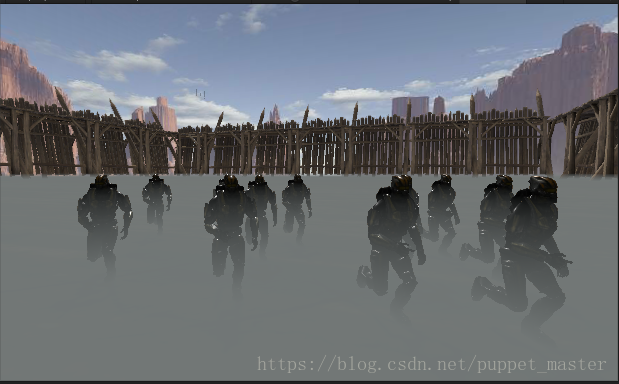

 	 

 	雾效的判断条件也可以修改为高度+距离：

**[csharp]** view plain copy

 				 

 				 

print?

1.  			float fogInensity = (_WorldFogHeight - worldPos.y) / _FogHeight;  
2.  			fogInensity = max(linear01Depth * _FogHeight, fogInensity);  
3.  			return lerp(screenTex, _FogColor, saturate(fogInensity));  

 	效果如下：

 	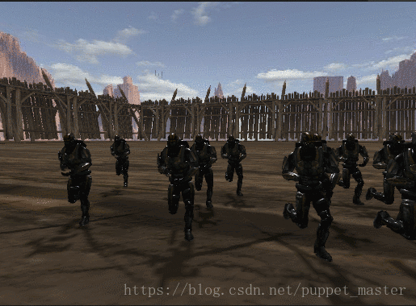

 	 

##  	运动模糊效果

 	运动模糊效果还是有很多种其他的方式去做的，比如渲染速度图，不过本篇只考虑了深度重建世界空间位置的做法进行模糊处理。参考《GPU  Gems 3-Motion Blur as a Post-Processing  Effect》这篇文章。渲染速度图的方式，需要额外的渲染批次，没有MRT的话批次比较难搞。用深度图进行运动模糊的话，无需额外的批次（不考虑深度本身的批次，毕竟开了深度是一个好多效果都可以用，性价比更高），不过也有一个问题，就是这种方式的运动模糊只能模糊相机本身的运动。

 	上面我们已经过通过逆矩阵进行重建世界空间位置，那么视线运动模糊就好实现啦。相比于存储一张上一帧的贴图，这里我们直接存储一下上一阵的（相机*投影矩阵）的逆矩阵，然后重建世界坐标，用其中差作为uv采样的偏移值进行采样，然后按权重进行模糊计算，模拟一个运动物体拖尾的效果。

 	shader代码如下：

**[csharp]** view plain copy

 				 

 				 

print?

1.  			//puppet_master  
2.  			//https://blog.csdn.net/puppet_master    
3.  			//2018.6.17    
4.  			//通过深度图重建世界坐标方式运动模糊效果  
5.  			Shader "DepthTexture/MotionBlurByDepth"   
6.  			{  
7.  			    Properties  
8.  			    {  
9.  			        _MainTex("Base (RGB)", 2D) = "white" {}  
10.  			    }  
11.  			      
12.  			    CGINCLUDE  
13.  			    #include "UnityCG.cginc"  
14.  			    sampler2D _MainTex;  
15.  			    sampler2D _CameraDepthTexture;  
16.  			    float4x4 _CurrentInverseVPMatrix;  
17.  			    float4x4 _PreviousInverseVPMatrix;  
18.  			    float4   _BlurWeight;  
19.  			    float    _BlurStrength;  
20.  			      
21.  			    fixed4 frag_depth(v2f_img i) : SV_Target  
22.  			    {  
23.  			        float depthTextureValue = SAMPLE_DEPTH_TEXTURE(_CameraDepthTexture, i.uv);  
24.  			        //自己操作深度的时候，需要注意Reverse_Z的情况  
25.  			        #if defined(UNITY_REVERSED_Z)  
26.  			        depthTextureValue = 1 - depthTextureValue;  
27.  			        #endif  
28.  			        float4 ndc = float4(i.uv.x * 2 - 1, i.uv.y * 2 - 1, depthTextureValue * 2 - 1, 1);  
29.  			  
30.  			        float4 currentWorldPos = mul(_CurrentInverseVPMatrix, ndc);  
31.  			        currentWorldPos /= currentWorldPos.w;  
32.  			          
33.  			        float4 previousWorldPos = mul(_PreviousInverseVPMatrix, ndc);  
34.  			        previousWorldPos /= previousWorldPos.w;  
35.  			          
36.  			        float2 velocity = (currentWorldPos - previousWorldPos).xy * _BlurStrength;  
37.  			          
38.  			        fixed4 screenTex = tex2D(_MainTex, i.uv);  
39.  			        screenTex += tex2D(_MainTex, i.uv + velocity * 1.0) * _BlurWeight.x;  
40.  			        screenTex += tex2D(_MainTex, i.uv + velocity * 2.0) * _BlurWeight.y;  
41.  			        screenTex += tex2D(_MainTex, i.uv + velocity * 3.0) * _BlurWeight.z;  
42.  			          
43.  			        screenTex /= (1.0 + _BlurWeight.x + _BlurWeight.y + _BlurWeight.z);  
44.  			          
45.  			        return screenTex;  
46.  			    }  
47.  			    ENDCG  
48.  			  
49.  			    SubShader  
50.  			    {  
51.  			        Pass  
52.  			        {  
53.  			            ZTest Off  
54.  			            Cull Off  
55.  			            ZWrite Off  
56.  			            Fog{ Mode Off }  
57.  			  
58.  			            CGPROGRAM  
59.  			            #pragma vertex vert_img  
60.  			            #pragma fragment frag_depth  
61.  			            ENDCG  
62.  			        }  
63.  			    }  
64.  			}  

 	C#代码如下：

**[csharp]** view plain copy

 				 

 				 

print?

1.  			/******************************************************************** 
2.  			 FileName: MotionBlurByDepth.cs 
3.  			 Description:通过深度图重建世界坐标方式运动模糊效果 
4.  			 Created: 2018/06/17 
5.  			 history: 17:6:2018 1:47 by puppet_master 
6.  			 https://blog.csdn.net/puppet_master 
7.  			*********************************************************************/  
8.  			using System.Collections;  
9.  			using System.Collections.Generic;  
10.  			using UnityEngine;  
11.  			  
12.  			[ExecuteInEditMode]  
13.  			public class MotionBlurByDepth : MonoBehaviour {  
14.  			  
15.  			    private Material postEffectMat = null;  
16.  			    private Camera currentCamera = null;  
17.  			    private Matrix4x4 previouscurrentVPMatrix;  
18.  			    [Range(0.0f, 0.02f)]  
19.  			    public float blurStrength = 0.5f;  
20.  			    public Vector3 blurWeight = new Vector3(0.6f, 0.3f, 0.1f);  
21.  			  
22.  			    void Awake()  
23.  			    {  
24.  			        currentCamera = GetComponent<Camera>();  
25.  			    }  
26.  			  
27.  			    void OnEnable()  
28.  			    {  
29.  			        if (postEffectMat == null)  
30.  			            postEffectMat = new Material(Shader.Find("DepthTexture/MotionBlurByDepth"));  
31.  			        currentCamera.depthTextureMode |= DepthTextureMode.Depth;  
32.  			    }  
33.  			  
34.  			    void OnDisable()  
35.  			    {  
36.  			        currentCamera.depthTextureMode &= ~DepthTextureMode.Depth;  
37.  			    }  
38.  			  
39.  			    void OnRenderImage(RenderTexture source, RenderTexture destination)  
40.  			    {  
41.  			        if (postEffectMat == null)  
42.  			        {  
43.  			            Graphics.Blit(source, destination);  
44.  			        }  
45.  			        else  
46.  			        {  
47.  			            postEffectMat.SetMatrix("_PreviousInverseVPMatrix", previouscurrentVPMatrix);  
48.  			            var currentVPMatrix = (currentCamera.projectionMatrix * currentCamera.worldToCameraMatrix).inverse;  
49.  			            postEffectMat.SetMatrix("_CurrentInverseVPMatrix", currentVPMatrix);  
50.  			            postEffectMat.SetFloat("_BlurStrength", blurStrength);  
51.  			            postEffectMat.SetVector("_BlurWeight", blurWeight);  
52.  			            Graphics.Blit(source, destination, postEffectMat);  
53.  			        }  
54.  			    }  
55.  			}  

 	效果如下：

 	

 	 

 	据我观察，实际上有些游戏里面的运动模糊并不是全屏幕的，而是只模糊边缘，相机中间不模糊，可以加个根据距离屏幕中心距离计算权重与原图lerp的操作，不过如果不是很纠结效果的话，用径向模糊来代替运动模糊也是个不错的选择。

 	真正的对高速运动物体进行运动模糊，肯定要比这种Trick的方式要复杂一点，也更真实一些，不过这个不在本文讨论范围了。

##  	扩散扫描效果

 	接下来来实现一个更好玩一点的效果。类似开头《恶灵附身》截图中第二个的效果，在空间一点实现扩散扫描的效果，其实与屏幕空间扫描线的效果实现思路是一样的，只不过实现了世界空间重建后，我们的判断条件就可以更加复杂，用世界空间位置进行计算可以实现一些复杂一些的形状的扫描线。比如判断与一点的距离实现的环形扩散扫描：

 	Shader代码如下：

**[csharp]** view plain copy

 				 

 				 

print?

1.  			//puppet_master  
2.  			//https://blog.csdn.net/puppet_master    
3.  			//2018.6.18    
4.  			//扩散波动效果  
5.  			Shader "DepthTexture/SpreadWaveByDepth"   
6.  			{  
7.  			    Properties  
8.  			    {  
9.  			        _MainTex("Base (RGB)", 2D) = "white" {}  
10.  			    }  
11.  			      
12.  			    CGINCLUDE  
13.  			    #include "UnityCG.cginc"  
14.  			    sampler2D _MainTex;  
15.  			    sampler2D _CameraDepthTexture;  
16.  			    float4x4 _ViewPortRay;  
17.  			    fixed4 _ScanColor;  
18.  			    float _ScanValue;  
19.  			    float4 _ScanCenterPos;  
20.  			    float _ScanCircleWidth;  
21.  			      
22.  			    struct v2f  
23.  			    {  
24.  			        float4 pos : SV_POSITION;  
25.  			        float2 uv : TEXCOORD0;  
26.  			        float4 rayDir : TEXCOORD1;  
27.  			    };  
28.  			      
29.  			    v2f vertex_depth(appdata_base v)  
30.  			    {  
31.  			        v2f o;  
32.  			        o.pos = UnityObjectToClipPos(v.vertex);  
33.  			        o.uv = v.texcoord.xy;  
34.  			          
35.  			        //用texcoord区分四个角  
36.  			        int index = 0;  
37.  			        if (v.texcoord.x < 0.5 && v.texcoord.y > 0.5)  
38.  			            index = 0;  
39.  			        else if (v.texcoord.x > 0.5 && v.texcoord.y > 0.5)  
40.  			            index = 1;  
41.  			        else if (v.texcoord.x < 0.5 && v.texcoord.y < 0.5)  
42.  			            index = 2;  
43.  			        else  
44.  			            index = 3;  
45.  			          
46.  			        o.rayDir = _ViewPortRay[index];  
47.  			        return o;  
48.  			          
49.  			    }  
50.  			      
51.  			    fixed4 frag_depth(v2f i) : SV_Target  
52.  			    {  
53.  			        fixed4 screenTex = tex2D(_MainTex, i.uv);  
54.  			        float depthTextureValue = SAMPLE_DEPTH_TEXTURE(_CameraDepthTexture, i.uv);  
55.  			        float linear01Depth = Linear01Depth(depthTextureValue);  
56.  			          
57.  			        float3 worldPos = _WorldSpaceCameraPos + linear01Depth * i.rayDir.xyz;  
58.  			          
59.  			        float dist = distance(worldPos, _ScanCenterPos.xyz);  
60.  			          
61.  			        if (dist > _ScanValue && dist < _ScanCircleWidth + _ScanValue)  
62.  			            return screenTex * _ScanColor;  
63.  			        return screenTex;  
64.  			    }  
65.  			    ENDCG  
66.  			  
67.  			    SubShader  
68.  			    {  
69.  			        Pass  
70.  			        {  
71.  			            ZTest Off  
72.  			            Cull Off  
73.  			            ZWrite Off  
74.  			            Fog{ Mode Off }  
75.  			  
76.  			            CGPROGRAM  
77.  			            #pragma vertex vertex_depth  
78.  			            #pragma fragment frag_depth  
79.  			            ENDCG  
80.  			        }  
81.  			    }  
82.  			}  

 	C#代码如下：

**[csharp]** view plain copy

 				 

 				 

/******************************************************************** 

1.  			 FileName: SpreadWaveByDepth.cs 

2.  			 Description:扩散波动效果 

3.  			 Created: 2018/06/18 

4.  			 history: 18:6:2018 15:56 by puppet_master 

5.  			 https://blog.csdn.net/puppet_master 

6.  			*********************************************************************/  

7.  			using System.Collections;  

8.  			using System.Collections.Generic;  

9.  			using UnityEngine;  

10.  			  

11.  			[ExecuteInEditMode]  

12.  			public class SpreadWaveByDepth : MonoBehaviour  

13.  			{  

14.  			    public Color scanColor = Color.white;  

15.  			    public float scanValue = 0.0f;  

16.  			    public float scanCircleWidth = 1.0f;  

17.  			    public Vector3 scanCenterPos = Vector3.zero;  

18.  			  

19.  			  

20.  			    private Material postEffectMat = null;  

21.  			    private Camera currentCamera = null;  

22.  			  

23.  			    void Awake()  

24.  			    {  

25.  			        currentCamera = GetComponent<Camera>();  

26.  			    }  

27.  			  

28.  			    void OnEnable()  

29.  			    {  

30.  			        if (postEffectMat == null)  

31.  			            postEffectMat = new Material(Shader.Find("DepthTexture/SpreadWaveByDepth"));  

32.  			        currentCamera.depthTextureMode |= DepthTextureMode.Depth;  

33.  			    }  

34.  			  

35.  			    void OnDisable()  

36.  			    {  

37.  			        currentCamera.depthTextureMode &= ~DepthTextureMode.Depth;  

38.  			    }  

39.  			  

40.  			    void OnRenderImage(RenderTexture source, RenderTexture destination)  

41.  			    {  

42.  			        if (postEffectMat == null)  

43.  			        {  

44.  			            Graphics.Blit(source, destination);  

45.  			        }  

46.  			        else  

47.  			        {  

48.  			            var aspect = currentCamera.aspect;  

49.  			            var far = currentCamera.farClipPlane;  

50.  			            var right = transform.right;  

51.  			            var up = transform.up;  

52.  			            var forward = transform.forward;  

53.  			            var halfFovTan = Mathf.Tan(currentCamera.fieldOfView * 0.5f * Mathf.Deg2Rad);  

54.  			  

55.  			            //计算相机在远裁剪面处的xyz三方向向量  

56.  			            var rightVec = right * far * halfFovTan * aspect;  

57.  			            var upVec = up * far * halfFovTan;  

58.  			            var forwardVec = forward * far;  

59.  			  

60.  			            //构建四个角的方向向量  

61.  			            var topLeft = (forwardVec - rightVec + upVec);  

62.  			            var topRight = (forwardVec + rightVec + upVec);  

63.  			            var bottomLeft = (forwardVec - rightVec - upVec);  

64.  			            var bottomRight = (forwardVec + rightVec - upVec);  

65.  			  

66.  			            var viewPortRay = Matrix4x4.identity;  

67.  			            viewPortRay.SetRow(0, topLeft);  

68.  			            viewPortRay.SetRow(1, topRight);  

69.  			            viewPortRay.SetRow(2, bottomLeft);  

70.  			            viewPortRay.SetRow(3, bottomRight);  

71.  			  

72.  			            postEffectMat.SetMatrix("_ViewPortRay", viewPortRay);  

73.  			            postEffectMat.SetColor("_ScanColor", scanColor);  

74.  			            postEffectMat.SetVector("_ScanCenterPos", scanCenterPos);  

75.  			            postEffectMat.SetFloat("_ScanValue", scanValue);  

76.  			            postEffectMat.SetFloat("_ScanCircleWidth", scanCircleWidth);  

77.  			            Graphics.Blit(source, destination, postEffectMat);  

78.  			        }  

79.  			    }  

    }  

 	效果（开了Bloom后处理，有了Bloom，再挫的画面也能加不少分，哈哈哈）：

 	

 	 

##  	总结

 	本篇主要是总结了一下实时渲染当中关于深度（图）相关的一些内容，主要是透视投影，ZBuffer算法，1/Z问题，深度图的基本使用，Linear01Depth，LinearEyeDepth，ZBuffer精度，Reverse-Z，根据深度重建世界坐标等内容。另外，实现了软粒子，屏幕空间扫描波，扩散波，屏幕空间高度雾，运动模糊等常见的使用深度图的效果。效果的实现其实都比较基本，但是扩展性比较强，用深度可以做很多很多好玩的东西。文中的一些特殊效果实现已经给出了参考链接，另外还参考了乐乐大佬的《shader   lab入门精要》关于运动模糊以及高度雾效的部分。不过我还是低估了深度的内容，精简过后还是这么多，可见，深度对于渲染的重要性。更加复杂的渲染效果，如SSAO，阴影，基于深度和法线的描边效果之类的，还是等之后在写啦。

 	注：文中的shader目前都没有考虑#if  UNITY_UV_STARTS_AT_TOP的情况，在5.5版本以前（我只有4.3，5.3，5.5，2017，2018这几个版本，具体哪个版本开始不需要考虑这个问题，不太确定），PC平台，开启AA的情况下会出现RT采样翻转的情况。以前的一些blog是都加了这个宏判断的，不过目前测试的新版本2017.3貌似木有了这个问题（也可能触发条件变了），所以我就愉快地偷了个懒喽。