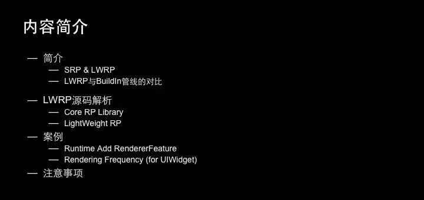
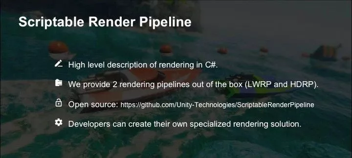
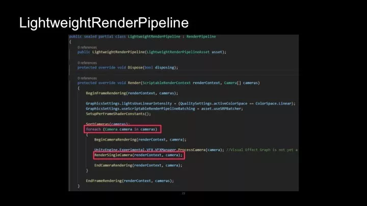
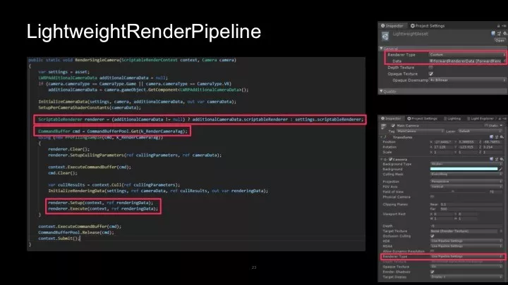

## Unity轻量级渲染管线LWRP源码及案例解析（上）

原创： 张黎明 [Unity官方平台](javascript:void(0);) *今天*

收录：白袍扶心  

GIT:     https://github.com/daozhangXDZ/DaoZhang_ProgramNote/Unity

**原创： 张黎明 [Unity官方平台]**

今天本文将分享Unity大中华区技术总监张黎明在Unite 2019上的技术演讲－Unity轻量级渲染管线LWRP源码及案例解析。

受篇幅限制，本次演讲将分享二篇内容。本文将介绍可编程渲染管线SRP和轻量级渲染管线LWRP、LWRP与Built-in内置渲染管线区别、LWRP源码解析Core RP和Lightweight RP。

演讲内容

大家好，我的演讲题目是《Unity轻量级渲染管线LWRP源码及案例解析》。

大家可能发现技术分享通常去讲使用为主，讲源码的非常少，为什么我会选择讲源码？

这是出于有二个原因：

- 第一个原因是轻量级渲染管线LWRP实在是太新了，根本就找不到太多文档。我本来想找文档给大家讲解一下，结果发现没有。我自己学习也只能通过查看源码的方式，我们内部也没有文档。

  

- 第二个原因是我们发现一些客户已经开始使用了，而且他们每个游戏都有一些特殊的需求，有的游戏可能需要对Unity轻量级渲染管线LWRP进行一些定制。这样就必须要查看源码，从而在游戏中达到更好的效果。

下面是我本次分享的主要内容，首先会简单介绍什么是Unity的可编程渲染管线SRP以及轻量级渲染管线LWRP。

可编程渲染管线SRP

首先，简单介绍一下Unity的可编程渲染管线SRP。

过去，我们有一套内置渲染管线的Render Pipeline，渲染管线全部写在引擎的源码里，使用C#代码编写。大家基本上不能改动，除非是买了Unity的源码客户，当然大部分开发者是不会去改源码，所以过去的管线对开发者来说，很难进行定制。

对于我们来说也有负担，因为我们要在一个渲染管线里面支持所有的二十多个平台，包括非常高端的PC平台，主机平台，也包括非常低端的平台，很老的手机也要支持。

于是，这套代码会变得越来越臃肿，很难做到使效率和效果做到最佳，所以我们现在有一套新的基于脚本的渲染管线。

它主要把渲染管线拆分成二层：

- 一层是比较底层的渲染API那层，像OpenGL，D3D等相关的都封装起来。
- 另一层是渲染管线比较上层的描述，上层代码使用C#来编写。在C#这层不需要关注底层在不同平台上渲染API的差别，也不需要关注具体如何做一个Draw Call。

我们在C#这边会一批对象一批对象的画，这样性能也会更好一些。

Unity官方基于Scriptable Render Pipeline可编程渲染管线提供了二套模板：**一个是轻量级渲染管线LWRP，一个是高清晰渲染管线HDRP。**

高清渲染管线HDRP是全部基于Compute Shader，基于最新的硬件来开发的，可以达到顶尖的渲染效果。例如[Unity的官方演示项目《异教徒》](http://mp.weixin.qq.com/s?__biz=MzU5MjQ1NTEwOA==&mid=2247497589&idx=1&sn=020086961b9f64e84a159524f46820b7&chksm=fe1dc3dec96a4ac860aa58f6dc0ebebe27cea46262f37b9d9fd00af26de751a5777e6b4863c0&scene=21#wechat_redirect)，它的效果非常惊艳。

轻量级渲染管线LWRP

另外一个渲染管线是轻量级渲染管线LWRP，主要是为了移动平台设计，也就是最流行的手机游戏平台，它可以达到更高的效率，然后可定制性也更好。

这二个模板都是开源的，大家都可以在Github下载，也可以自己进行修改。

高清晰渲染管线HDRP只支持最高端的平台，即目前比较好的PC和主机平台，但轻量级渲染管线LWRP支持所有的平台。

我们的目标是轻量级渲染管线LWRP在性能方面比过去内置的管线更好。在Unity 2019.1中，**轻量级渲染管线LWRP已经成为正式版本，可用于正式的项目制作。**

LWRP与内置渲染管线对比

我们和很多客户有过沟通，发现其实大家对轻量级渲染管线LWRP不是很理解。很多人一听到轻量级管线LWRP就觉得有点LOW，觉得现在大家制作移动游戏都开始做AAA级，画面都要PBR，都要超大世界，各种特效，后处理都加上。

很多人可能还没有去了解轻量级渲染管线LWRP，就觉得是不是赶不上目前的主流画面。所以，我先给大家对比一下轻量级渲染管线LWRP和老的渲染管线有什么差别。

如上图所示，最重要一点就是第一行，**老的渲染管线使用Multi-Pass的Forward Rendering，**就是多Pass的正向渲染。最大的问题是如果要在场景里要加很多动态光的话，每一个动态光都有可能会增加一个Pass，这个动态光所影响的物体要多画一遍。

这就导致如果游戏里想要有多个动态光的话，可能这个场景会被画很多遍，性能会很差。它带来的问题是所有的游戏几乎都不会用多个动态光，因为实在太费性能了。

在过去制作移动的游戏的过程中，大家的标准做法都是烘焙Lightmap。如果可以用多个动态光，我们其实可以做出更酷的效果。

例如，制作一个有魔法的游戏，游戏中每个人都释放一个魔法球出来，我们完全可以给它加一个动态的灯光，跟着它一起飞出去，这样的效果非常酷。但是因为过去每增加一个动态光都会导致渲染Pass增多，所以大家就不敢使用。

现在轻量级渲染管线LWRP就解决了这个问题。我们实现了一个单PASS的正向渲染。我们可以支持多盏动态光，但是全部动态灯光都会放在一个Pass里渲染，这样**带来的问题是我们要限制灯光的数量**，因为每次Draw Call去画的时候，传给GPU的参数是有限的。

如果灯光数量特别多，参数太多，那就会无法在一次Draw Call里完成很多个灯光。所以我们有一些限制，**在轻量级渲染管线LWRP里，目前是支持1盏平行光，每个对象可能只能接受4个动态光**。每个摄像机也有一些限制，这是为了我们可以把所有的计算放在一个Pass里面。

Unity2019.2，Unity 2019.3可能会把这个限制再提高一些。相信大部分的游戏也不太会在一个场景里加太多动态光，如果可以做到8盏动态光，可能对于大部分游戏来说也足够了，这样在一个Pass里的渲染性能会更好。

另外，轻量级渲染管线LWRP还有新加入的功能，包括Scriptable Render Pass，还有SRP的Batcher合批。合批会比过去好一些，轻量级渲染管线LWRP仍会支持静态合批和动态合批。我们还会提供可通过脚本定制的Render Pass以及Custom Renderers。

很多客户给我们反馈，现在使用轻量级渲染管线LWRP，最欠缺的是二个功能：

- 首先是目前还未支持的Shadow Mask，这在老的内置渲染管线里已经有了。我们计划在Unity 2019.3提供Shadow Mask的功能。
- 其次是延迟渲染Deferred Rendering，它在老的管线有，新渲染管线没有，它也会在Unity 2019.3提供。

关于PBR，你可以认为它完全不比内置渲染管线差，它也是使用了移动平台上的最好光照模型。如果再往上提升的话，就是HD渲染管线的PBR光照算法，这样的话就太费性能了，可能不适合大家做移动游戏了。

在PBR这方面，它基本和内置渲染管线是保持一致的。如果大家还是不满意的话，可以修改轻量级渲染管线的Shader，修改光照模型就可以了。

如上图所示，这是我们自己进行了一些测试结果，基本上在各个方面的性能都是比内置渲染管线要好。

上图显示的是新增功能Custom Render Pass，主要是为了提供可扩展性。我们还是希望大家不改源码就可以进行扩展，所以提供了这种方式。如果这样还不够的话，大家再去考虑改源码。

我们推荐大家，可以不改源码实现，就尽量不改源码，因为改了源码后，升级会很麻烦，自己要升级修改过的代码到新的版本，要避免冲突，增加大家的工作量。

如上图所示，在Unity开发路线图里，除了现在提供的Forward Renderer，Unity 2019.2会提供一个2D的Renderer，它主要提供2D的光照和2D的阴影效果。Unity 2019.3会增加Deferred Renderer，一个延迟渲染的Renderer。

LWRP源码解析－Core PR

如果要使用轻量级渲染管线LWRP，你需要在Package Manager里导入二个Package：Core RP和Lightweight RP。

Core RP是高清晰渲染管线HDRP和轻量级渲染管线LWRP共同依赖的包，因为有一些代码需要共用，所以我们把这部分代码拆到Core RP中。

如下图所示，我们看一看Core RP文件夹的结构。

Editor文件夹中是编辑器脚本，做一些Inspector里显示参数的代码。Runtime文件夹中是主要代码，有一些共用的Shader Library，共用的Shader代码放在这里，其它还有一些测试代码。

在Runtime > Common文件夹中有一个CommandBufferPool，轻量级渲染管线LWRP和高清晰渲染管线HDRP都要用到它。

如果你要用一个CommandBuffer的话，不要自己New一个，而是在Pool里拿一个，因为它会缓存下来，等下一帧需要用的时候，可以在库里拿出来直接用，而不是每次New一个，Delete一个，这样性能会比较差。

Volume文件夹是实际上类似于Post-Processing Stack后处理栈里面的PostProcessVolume，这是一个通用的Volume，可以调一些渲染管线的参数，它可以在进入一个体积后调一些参数。

Core RP其实很简单，我主要希望让大家知道，没有必要花太多的时间看这些东西，因为它里面没有太多的内容。

LWRP源码解析－Lightweight PR

我们的重点是另一个Package，即Lightweight RP里面有哪些东西。

本次重点会讲下图中这些类，这是源码中的一些类，我要介绍这些类的用途是什么？

我们先做一点轻松的事情，我制作了一个很简单的Demo，简单说一下轻量级渲染管线LWRP怎么使用？

第一步要在Package Manager里面导入package，导入之后需要Create一个Light Weight Render Pipeline Asset。创建后我们有Graphics Settings。

我们要把Asset拖到Scriptable Render Pipeline Settings这个位置，然后引擎会把当前渲染管线改成刚刚创建的Asset这种类型的渲染管线，老的内置渲染管线就开始不执行了。创建的轻量级渲染管线LWRP在Asset上有一些参数设置。

首先有Renderer，然后有二个选项Depth Texture和Opaque Texture。Render Pipeline Asset上会保存轻量级渲染管线LWRP的一些参数。

这里有一个刚刚提到的Opaque Texture选项，它对应的代码就是LightweightRenderPipelineAsset类。

我们写了这个类之后，就可以在Editor里右键新建一个这种类型的Asset，它继承自RenderPipelineAsset这个类。

LightweightRenderPipelineAsset类中声明了一些变量，这些变量就是在Inspector看到的Render Pipeline Asset上的参数，它们都是在这个类里面定义。也就是说，这个类是用于序列化Lightweight Pipeline上所有的参数。

如果大家以后自定义轻量级渲染管线LWRP，希望增加自己的参数，找到LightweightRenderPipelineAsset这个类，并添加参数就可以了。

RenderPipelineAsset继承自ScriptableObject，大家应该知道，ScriptableObject这个类是专门用于序列化数据的，所以它在这里序列化轻量级渲染管线LWRP的数据。

然后看一看Opaque Texture选项，这是轻量级渲染管线LWRP提供的一个功能。

在内置渲染管线Pipeline中，如果想做一个折射的效果，例如水的效果，过去的做法是用GrabPass，在Shader里写一个GrabPass，它会抓取当前的屏幕画面，然后对画面做扭曲和水的扰动等效果。

GrabPass的问题是它的性能不太好，而且在不同手机硬件上，不同渲染API上的实现方式不一样，有的硬件上性能特别差，导致帧率降得特别厉害。

现在我们在轻量级渲染管线LWRP中，可以直接在不透明物体画完后，勾上Opaque Texture选项后，它就会把当前画面抓取到RenderTexture里。如果要做折射效果或是水的效果，或者是玻璃的折射的话，直接用该选项即可。

再看一下这个Demo，勾选Opaque Texture后，它用起来非常简单。在Shader中，我们需要去定义一个CameraOpaqueTexture的变量，定义了后就可以直接在后面的Fragment Pixel Shader去采样。

我们直接可以采样贴图的Sampler，可以做一些扰动效果，非常方便。我们不必像过去那样使用GrabPass，导致一些性能问题。

最主要的渲染管线的执行是在LightweightRenderPipeline类中，它继承自RenderPipeline基类。这个基类其实是一个Interface，里面其实没有做什么实现，所有实现都在这个轻量级渲染管线脚本里。

如上图所示，这个主的渲染函数也很简单，就是For循环所有相机，然后调用RenderSingleCamera，渲染每个相机的函数，逻辑比较简单。

如上图所示，在RenderSingleCamera中有几行比较重要的代码。上面这行会进行判断，现在在SRP里可以有一个额外的数据。在Lightweight Render Pipeline和HD Render Pipeline上的参数都不一样，HD的参数会多很多。它会把这些不一样的参数拆出来并进行判断。

这里有一个if判断，用来判断相机上的参数有没有设置Renderer。如果有，就优先用相机上的Renderer。如果没有设置，就用Render Pipeline Asset上设置的Renderer。

在LightweightRenderPipelineAsset上可以选择Renderer，上面有Custom和Forward Renderer二个选项，它本质上也是Forward Renderer。

在相机上也可以选择Renderer Type，可以选择使用刚刚Asset中的设置，也可以选择在每个相机用不同的Renderer。代码里会优先使用相机上的设置，如果相机没有设置，它会使用Asset设置的Renderer。

最下面的代码会调用Renderer.Setup进行配置和渲染执行。

小结

在本篇中，张黎明介绍可编程渲染管线SRP，LWRP与内置渲染管线区别，LWRP源码解析Core RP和Lightweight RP。在下一篇中，他将分享**如何定制轻量级渲染管线LWRP。**

更多Unite大会精彩演讲内容分享，尽在Unity Connect平台(Connect.unity.com)。

 

下载Unity Connect APP，[请点击此处。](http://mp.weixin.qq.com/s?__biz=MzU5MjQ1NTEwOA==&mid=2247498325&idx=2&sn=e19842609e38c5bc33769b7cee959ab2&chksm=fe1dcefec96a47e8e36cd5be63d6537c60e9693ee200d623976ab17f3e2ec1490df00263c34e&scene=21#wechat_redirect) 观看部分Unity官方视频，请关注B站帐户：Unity官方