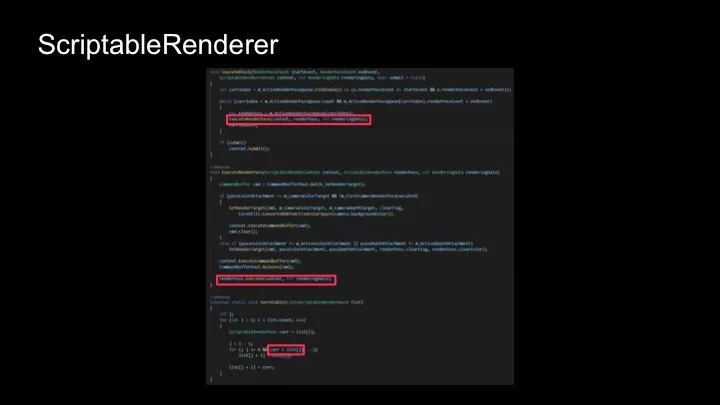
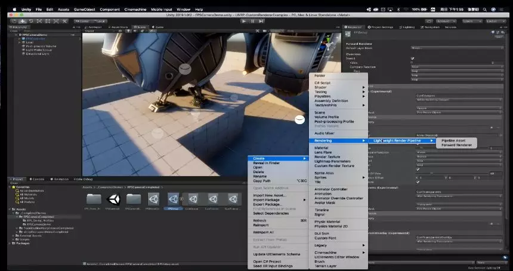
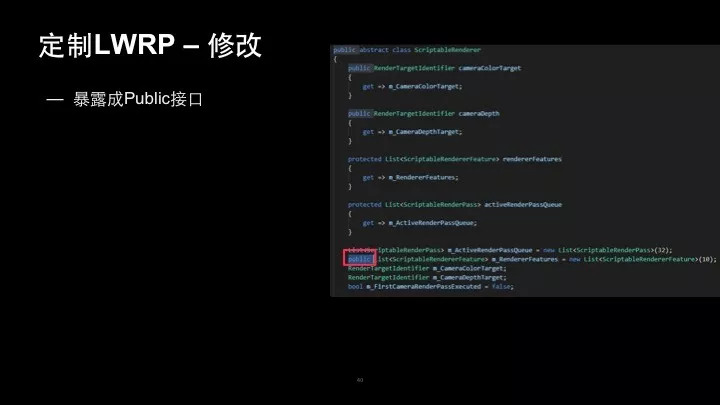
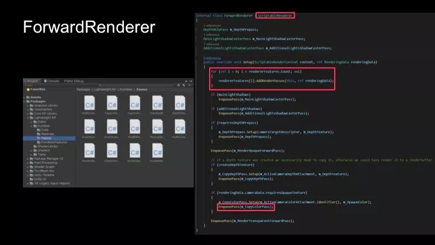
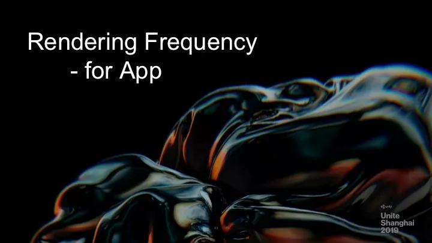
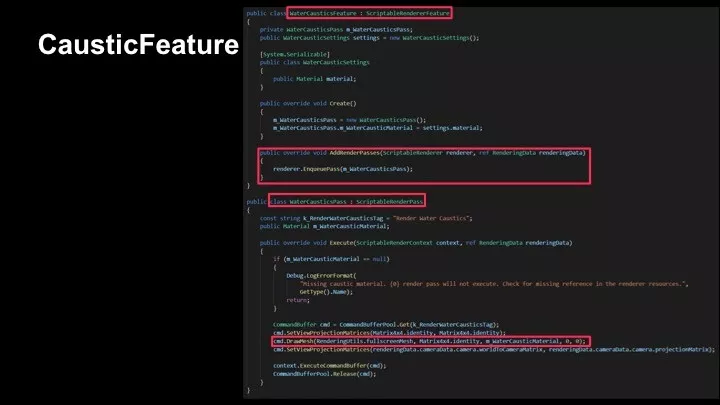
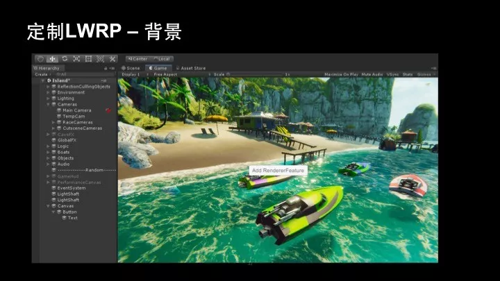

## Unity轻量级渲染管线LWRP源码及案例解析（下）                       

原创： 张黎明 [Unity官方平台](javascript:void(0);) *今天*

收录：白袍扶心  

GIT:     https://github.com/daozhangXDZ/DaoZhang_ProgramNote/Unity

今天在 [Unity轻量级渲染管线LWRP源码及案例解析（上）](http://mp.weixin.qq.com/s?__biz=MzU5MjQ1NTEwOA==&mid=2247499922&idx=1&sn=08ca6b1482bc8c4e3bb7fbdbee91b7cd&chksm=fe1df439c96a7d2f003d9eb160c814bdcc471dbdefa96471fc6277479f5ca7da135cb1a99aa5&scene=21#wechat_redirect)中，Unity大中华区技术总监张黎明介绍可编程渲染管线SRP和轻量级渲染管线LWRP、LWRP与内置渲染管线区别、LWRP源码解析Core RP和Lightweight RP。

本文将分享如何定制轻量级渲染管线LWRP。

演讲内容

演示项目：Custom Renderer

我们再看一个Unity 2019.1发布时新推出的Demo。

Custom Renderer下载地址：

https://github.com/Unity-Technologies/LWRP-CustomRendererExamples

这个Demo是要实现什么效果呢？

过去我们制作射击类游戏，经常要做的一件事情是这把枪用不同的FOV单独渲染。如果枪不进行特殊处理，使用和场景相同的FOV去画的话，画出来会很窄，占屏幕面积很小，很不美观。所以过去制作FPS的游戏经常要单独画枪，它的FOV可能会小一点，这样它占的屏幕空间会更大。

过去没有可编程渲染管线SRP，过去在内置渲染管线Pipeline里，我们要用二个相机，一个相机画枪，一个相机画场景，这样可以设置不同的FOV即视角。但是这样的问题是过去Unity的Camera其实很费性能，即使加入一个什么Camera都不做，仍有很大的消耗。

因为它会计算相机的剔除，Flatten裁剪之类的计算，所以相机越多性能会越差。我们建议大家尽量不使用多个Camera，能用一个Camera解决就用一个Camera。现在有了可编程渲染管线SRP，我们就可以用一个Camera来解决。

如上图所示，这里面创建了一个Renderer，这个Renderer也是在刚刚创建Lightweight  Render Pipeline里创建的Forward Renderer，这里所谓的Custom Renderer就是创建一个Forward  Renderer，但是我们可以对它做一些定制。

创建这个Asset，这个Demo的Asset已经创建好了。我们看一下这个Demo，它的Renderer里有三个Renderer Feature，它们的用途是什么呢？

默认的场景渲染是放置在最上面，是不可调整的，除了First Person Object的Layer没画，其它的场景对象都是在这里上面渲染的。

下面有三个Feature是用于渲染枪的。第一个Render Feature画枪上不透明的部分，后面二个Render Feature画半透明的部分。因为枪上有一些液体，液体是半透明的，其它地方是不透明的。

相机上设置了比较大的FOV，然后在第一个Render Feature这里是设置相机的FOV是40，然后主场景相机的FOV是80。常见的FPS游戏使用的FOV是80。所以在Render Feature里某些对象可以有自己的FOV。

我们还可以给它设置不同的材质参数，模板缓冲区，Stencil Buffer等。这里我们用到了Stencil Buffer，还有Position偏移等参数，这些是让我们管理场景中不同物体渲染的参数，在过去的话，有些参数只能在相机上设置。

简单介绍一下模板缓冲区。在做这种效果的时候，我们目标是先画枪，因为枪总是在场景的前面。过去画半透明物体时，我们先画离相机最近的，再画远的，这样深度裁剪时，前面物体会挡住后面的物体，不会重复填充像素，这样性能会更好一些。

怎么做到这种功能呢？首先这个Render Feature是设置了Event，它的渲染顺序是Before Rendering Opaques，这样在不透明物体之前先画枪，然后把Stencil Buffer写成1。

等画完枪再去画场景的时候，它会检查Stencil Buffer是0才会去填充。因为枪填充过的像素Stencil已经是1了，在画场景的时候就不会重复填充枪的像素，省掉一些像素填充。这就是对Stencil Buffer的利用方法。

下面介绍一下Renderer和Render Feature。我们会看一些源码，讲解怎样去理解Renderer？

如上图所示，有一个抽象类ScriptableRenderer，里面定义了Render Pass的数组，还有Render Feature的数组。

在执行的时候按照几个Block执行Renderer Feature，也就是说Renderer里面存储了很多的Render Pass。其实Render Feature也就是多个Render Pass的集合。

可编程渲染管线里面有很多Render Pass，我们可以添加自己的Render Pass，也可以删除一些Pass，可编程渲染管线就是按顺序执行不同的Render Pass。

下面有个类叫EnqueuePass，如果要自己写Render Feature的话，要把自己的Render Pass加入到这个队列里面，加入上面的List数组里面。

如上图所示，我们看到它执行时会执行一个个Block，Block里有一个while循环，去执行每个Pass。

下面是执行Pass的函数。最下面这个SortStable函数不太醒目，但它很有用的，它用来排序所有Render Pass的执行顺序。

SortStable函数控制加入Pass后，Pass是在什么时间点画的，Pass的执行顺序是什么样的。它会For循环所有的Pass，然后做排序，排序时会对每个Pass做比较。

每个Pass重载Operator的类，重载Operator类会根据Event的值，决定在不透明之前画还是半透明之前画，还是在天空盒之前画，它会根据Event在SortStable函数中进行排序。

如上图所示，我们看看Forward Renderer这个类，它继承自ScriptableRenderer，主要是用来添加Forward Rendering里的各种Pass。

其实刚刚ScriptableRenderer是空的，里面没有Pass，它最终渲染的Pass是使用这里的Forward Renderer，它派生了刚才的类后负责往里面加入Pass，加了正向渲染的Pass，先画不透明再画半透明，再画后处理之类。

演示项目：BoatAttack

我们再看一个Unity 2019.1之前发布的官方Demo－BoatAttack。BoatAttack中水的效果就用到了Render Feature，它实现了焦散的效果，代码非常简单。

BoatAttack下载地址：

https://github.com/Verasl/BoatAttack

代码中有二个类Render Feature和WaterCausticPass。Render Feature继承自ScriptableRenderFeature。写了Render Feature之后，引擎就会在下拉菜单里增加这个Render  Feature的选项，这个Render Feature负责把下面这个Render Pass加到Renderer里面。Render Feature可以在渲染管线的某个时间点增加一个Pass或者多个Pass。

下面是Render Pass，焦散的Render Pass其实比较简单，就是画了一个全屏的Quad，去根据深度算出世界的坐标，计算阳光投影过去，相当于把焦散的图投到水底的地方，使用全屏的Quad来实现的。

如上图所示，红框标出了关键的几个地方，AddRenderPasses会往Renderer里加入Pass，下面的Pass是某个效果的实现。

我们再看一下ScriptableRenderPass这个类。

WaterCausticsPass这个类继承自ScriptableRenderPass，这个类重要的是要有RenderPassEvent，它里面有Pass执行的时间点，用来控制每个pass的执行顺序。在ScriptableRenderPass里，可以在构造函数里面去指定了Event在什么时间点执行，默认的话Event是在不透明物体之后画，即AfterRenderingOpaque。

在很多RenderPass的Pass代码里，我们都无法直接看到Event，它其实是在基类ScriptableRenderPass里设置了默认Opaque，所以如果你没有看到它设置在什么时间点执行的话，它默认在不透明物体之后画。

最下面的红框部分Operator用来比较二个RenderPass应该先画谁，根据Event的数值，转换成Int来比较。

LWRP定制

如何基于Unity轻量级渲染管线LWRP进行一些简单定制？应该怎么做？

不久前一位客户提出一个疑问：目前只能在Asset里添加Render Feature，一般是创建Renderer Asset，在Inspector里添加Render Feature，Asset里有二个Render Feature，那么如何在运行时再添加一个Render Feature？

经过调查，我发现目前设计的确没有考虑到这种情况。如果不改代码的话，目前无法实现这个需求。于是我尝试通过修改一点代码，实现在运行时可以增加一个Render Feature。

我调查的过程是：首先要找一个场景进行测试，于是我找到了BoatAttack项目用于做测试。刚好它的Renderer里有二个Render  Feature，所以我首先把它默认Asset里的Render Feature删掉，试试是否可以在运行时增加Feature。

我的目标是：在运行时，添加了UI的Button，点Button时会添加该Render Feature到Renderer上。

我查看了源码，发现在Forward Renderer类的Setup里有这个操作，是把所有Render Pass加到Renderer里面。

但是我发现它加到了Forward   Renderer的基类里的一个数组里，这个数组不是一个Public的变量，从外面不能直接访问，m_RenderFeatures这个变量不能公开访问，而且也没有修改这个数组的API，导致不能增加，删除Render  Feature。

那么我如何修改该数组呢？为了节省时间，我暴力的把它改成了Public，然后就可以在脚本里访问这个变量，给它增加Render Feature了。这是为了给大家说明我们可以定制LWRP，但这种做法其实不太好。

将它暴露成Public之后呢，我就另写了一个脚本，加到相机上面。在相机上面进行判断，如果相机上设置了Renderer，我就获取相机上的Renderer，如果相机上没有设置Renderer，我就从Asset上获取Renderer。

获取Renderer后，向Renderer里添加Render  Feature。刚好Render Feature也是一个Asset，我在上面声明了Renderer  Feature的变量，可以直接把Renderer Feature Asset拖过来，在运行时把这个Asset添加到这个Renderer上面。

下面是定制的效果视频。

我会在这点这个按钮，可能效果不太明显。在我点按钮之前，水下没有焦散效果，点了按钮后，就可以看到Caustic焦散效果。

定制案例 ：Rendering Frequency for APP

还有一个非常小的定制案例，过去Unity一般用来做游戏，做VR、AR，几乎没有人用Unity做手机上普通的App。但Unity中国的团队开发了一套工具叫UIWidgets，可以用它来做App。

过去最主要的问题是UI不方便。App开发者用我们的UGUI时，由于它是用来做游戏的，他们会觉得要重新学习，而且用起来也没有做App的那些工具方便，因此我们就制作了UIWidgets。UIWidgets的问题是：如果里面有3D场景的话，每帧都要渲染。

作为App来说，功耗上和消耗电量会比较大一些，因为普通App和游戏不同，不会不停地刷新画面。所以我们有这个需求：能不能不要每帧都渲染。

刚好我们有脚本的ScriptableRenderPipeline，我们可以在不需要渲染的时候关闭渲染，因为App不是每帧都需要操作，可能我们在看一段话时，至少会几分钟都没有操作，也没必要重新渲染。

代码实践很简单，首先在LightweightRenderPipeline的主要Render函数里进行判断，判断它过了多少毫秒，如果超过特定毫秒，会继续执行，如果没到特定毫秒，就先Return。

当然，此时引擎的主线即逻辑帧还会执行。你可以设置它的Frame rate为30帧或60帧，但渲染会直接跳过，不做渲染操作，从而节省一些GPU的功耗。

这是一个很简单的定制案例。大家考虑如果用Unity开发手机App的时候，因为游戏引擎会每秒几十帧渲染整个场景，导致手机功耗很高。那有没有可能没有输入操作的时候停止渲染呢？

因为现在有了可编程渲染管线SRP，会非常简单。实现的方式就是在Lightweight RenderPipeline的主函数里判断要不要渲染，如果没有输入操作，就跳过渲染的执行。

注意事项

下面介绍我使用轻量级渲染管线LWRP遇到的几个坑。

如果希望要定制轻量级渲染管线，你要修改它的源码，应该怎么做呢？

我们推荐的方法是先到Github上把SRP可编程渲染管线源码的工程Clone下来。

下载SRP可编程渲染管线源码：

https://github.com/Unity-Technologies/ScriptableRenderPipeline.git

然后，在Packages文件夹下找到manifest.json文件，它可以配置是使用在Package Manager里下载安装的Package还是自己修改的Package。

在这里可以指定路径，指向我们Clone下来的地址，然后现在开始，游戏里就使用我们Clone下来的目录下的轻量级渲染管线代码，直接在代码里修改就好了，改完后可以提交到自己托管源代码的服务器上。

还有一个关于Shader的小坑。大家都知道，写Shader时会在最上面定义Shader属性，过去在Shader Property上，我们会随便写一个变量，half+变量，这样写上去就行了。

到了轻量级渲染管线LWRP中，你必须把它加入到Constant Buffer里面，否则变量无效。定义后，即使在外面材质部分调参数也会没有作用。所以一定要记住这点。

Shader有一个需要特别注意的地方，在添加Shader Properties的时候，一定要把变量添加到Constant Buffer里面，否则添加的属性无效。

另外，如果在工程里需要引用轻量级渲染管线里的某个Shader，它的引用路径要像上图最下面这部分，大家写的时候要按这样的格式去写URL。

另外如果想在Assets路径下的Shader内Include Package里面的Shader，按照这个路径去Include。

下面是一些现有的LWRP相关的示例工程。

**轻量级渲染管线LWRP** 

- https://github.com/Unity-Technologies/LWRP-CustomRendererExamples
- https://github.com/Verasl/BoatAttack

**Outdated Sample**

- https://github.com/johnsietsma/ExtendingLWRP
- https://github.com/UnityTechnologies/LWRPScriptableRenderPass_ExampleLibrary
- https://github.com/phi-lira/SIGGRAPH2018-StudioWorkshop
- https://github.com/stramit/SRPBlog/tree/master/SRP-Demo
- https://github.com/pbbastian/SRPFromScratch
- https://github.com/UnityTechnologies/AngryBots2

需要注意：由于Unity 2019.1推出之后有很大的更新，导致大部分老的Sample工程在2019.1上打开会报错，只有前面二个工程不会报错。

不过大家还是可以用它们来了解LWRP开发的整个历程，了解LWRP是如何一步步发展过来的。

这是我今天分享的全部内容，谢谢大家 ！