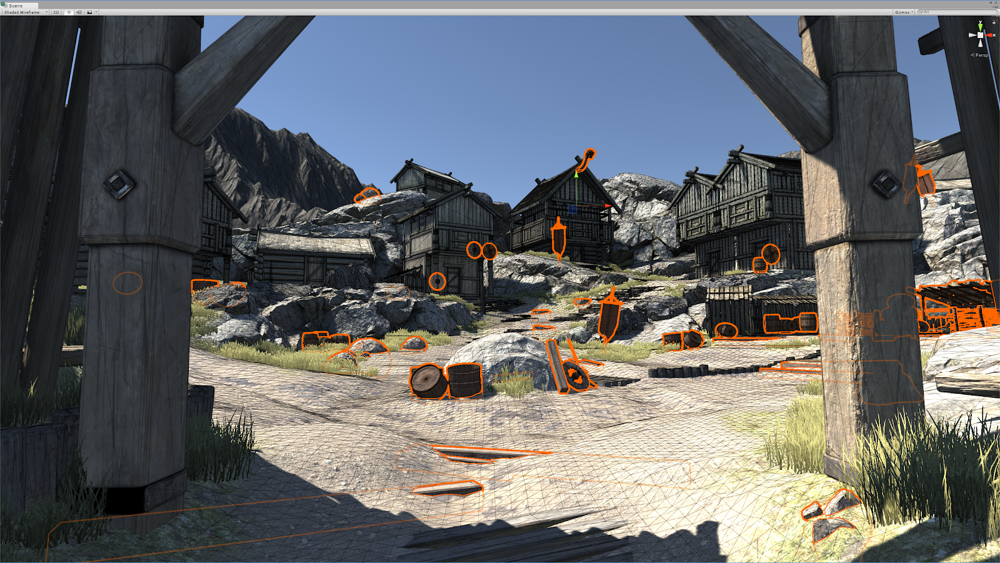
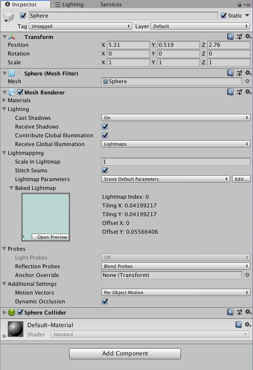

# 光照探针的静态光照

作者Tobias Alexander Franke和David Llewelyn，2019年8月28日

> 在2019.2版本中，我们移除了光照贴图静态标识，用“Contribute to GI”（帮助全局光照)设置取而代之。同时，全局光照的光源现在可以在光照贴图和光照探针之间选择。这个看上去很小的改动会给场景光照性能与质量上的烘焙造成巨大影响。我们来一探究竟吧。

## 光照贴图和光照探针

全局光照通过一系列复杂的计算来模拟光从光源射出后在表面间的弹射。精确的模拟一般需要在运行时加上大量繁重的计算。为了达到最佳输出效果，这个问题常见的解决方案是预先将这些计算在编辑模式中完成。

要实现此种方法，首先得确保场景中的部分对象和光源位置、形状、角度和任何画面属性都相对固定。有了这些前提条件，此类光照便能以光照贴图技术来完成了。

为了标记这些对象，Unity使用了光照贴图静态标识。该功能在当时看来确实恰当，说明了只有静态对象会使用光照贴图。但静态贴图只是给场景添加全局光照的许多方法中的一种，且有一定的缺陷，我们稍后会继续讨论。

当使用光照贴图来实现全局光照时，非静态（动态）对象无法对全局光照起作用，因为它们违背了静态这个前提。如为移动对象添加全局光照，光照只会在起始位置上生效。这是传统光照贴图的主要局限。

动态对象仍然能通过光照探针接收到来自其他静态对象生成的全局光照。光照探针是空间中的一个个位置点，它能采样各个方向射来的光并进行储存。此种光照数据被编成叫做“球谐函数”的特殊值。在运行时，动态对象在世界中移动时便能从光照探针周围接收到光照数据。这项功能使动态对象能正确接收到局部光照，与四周光照环境相和谐。

技术上来说，静态对象完全能用光照探针取代光照贴图，所以它还有什么用呢？

## 纹素成本

需要光照的对象必须先[展开](https://unity3d.com/learn/tutorials/topics/graphics/unwrapping-and-chart-reduction)，并在光照贴图中预留部分空间。根据分辨率，每个投射进光照贴图的对象会保留不同大小的纹素。

比如，在每空间单元一纹素的光照贴图分辨率中，一单元方块（1x1x1）每一面会留存一个纹素，总共会有6纹素。在每个纹素上，贴图将计算照射到纹素位置的光照数据。计算过程是先投射出几条射线，让其在场景中弹射，直到发现一处光源。纹素越多，结果的计算量越大。当场景中有许多小型对象时，计算量便会急剧增加。实际上，此类对象的展开、绘制及光照贴图的添加正是烘焙失败或耗时较长的罪魁祸首。

光照贴图分辨率为1时一单元方块正好占据了一纹素。

较小的物体，如石子和小残骸，或细小的物体如电线和旗杆很容易造成“纹素浪费”。这些纹素并不会对整体外观有太大影响，但仍旧占据了部分运算时间和贴图空间。

细小物体常出现仅有一两个像素包裹住物体的情况，对整体外表影响较小。同样，小型对象（根据其在屏幕上的大小而定）经常产生许多对最终效果影响不大的纹素。结果就是许多我们难以察觉的纹素耗费了大量计算时间，增加了所需光照贴图的量。

可轻易用光照探针照亮的小型对象举例。

针对生成光照贴图时间的优化方法之一是将这些小型对象设置为非静态，将其移出光照贴图计算，以此来减少需要计算的贴图纹素数量。但是，在部分情况下这些对象对场景光照会有极大影响，比如一个非常明亮的带色对象，或者有发光材质的对象。当这些对象不属于静态光照贴图时，它们将不会为场景中加上全局光照效果，也就不会施加期望的光照影响了。

于是，在处理这类对象时，我们便面临两个抉择：为其添加光照贴图，使其能为场景添加效果，即使花上更长的烘焙时间及更多的贴图空间，或者舍弃它们，放弃其带来的整体和全局光照效果。如何解决这个两难境地呢？

## 使用光照探针

在2019.2版中，我们添加了一个功能，使得对象能在接收光照探针的全局光照的同时，给为场景施加光照效果。你可以在Mesh Renderer监视器中新加的下拉菜单中激活该功能。

新的Contribute和Receive Global Illumination选项。

在这，你能为Mesh Renderer选择从Lightmap（光照贴图，此前静态对象的唯一选择）或从Light Probes（光照探针，此前动态对象的唯一选择）Receive Global Illumination（接收全局光照）。

当Contribute Global Illumination激活时，该物体会被包括在光照贴图的全局光照计算中。虽然仍需要假定对象静止不动，但现在你可以根据具体的光照清晰度要求，指定使用光照探针或光照贴图。当对象Contribute Global Illumination的同时从光照探针Receive Global Illumination，它仍会对周遭施加影响。一杆路灯可以投下经由光照贴图计算的阴影，同时放射性的灯光材质仍会照亮周围场景。

## 使用本功能

有了这项新功能后，在Unity中优化这些麻烦的细小对象就简单直接了：只需将Mesh Renderer中Receive Global Illumination一栏选为Light Probes。设置完后，指定的对象便不会在光照贴图中占用空间了，而相应的纹素也不会再产生不必要的计算。

光照探针另一个较为关键的优点是它不需要UV来工作，能省去许多展开时间。如果你有一个不怎么移动、旋转或改变的动态对象，与光照探针相性较好，可以用Contribute Global Illumination来进行设置，该对象便能在不增加烘焙时间的前提下影响周围的对象。这样能极大地增加生产力，更有效地利用内存资源。

<iframe src="https://connect.unity.com/player/5d68f9d7edbc2a001e6d0095" allow="accelerometer; autoplay; encrypted-media; gyroscope; picture-in-picture" allowfullscreen="" width="100%" height="100%" frameborder="0"></iframe>

## 结论

有了这次更新，动态（非静态）对象就能用光照探针来照射了。你可以决定全局光照计算中的对象从光照探针或光照贴图中接收非直射光照，降低光照贴图中的纹素使用。总之，这次改动将大幅减少光照贴图的计算时间、降低内存使用、提升运行时的性能。