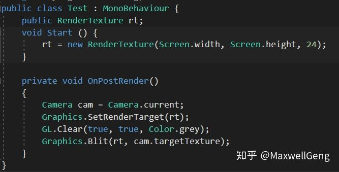
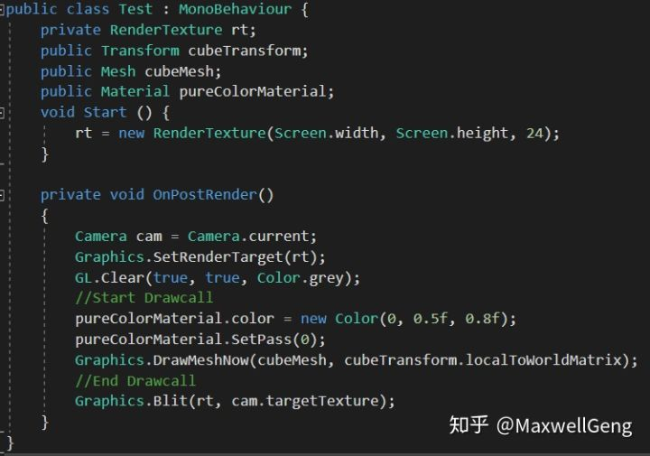
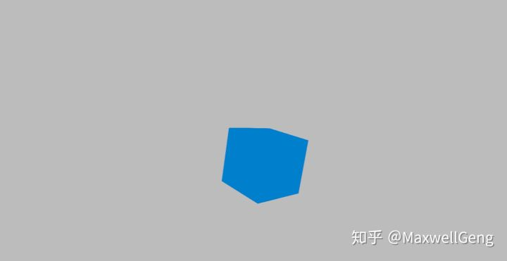
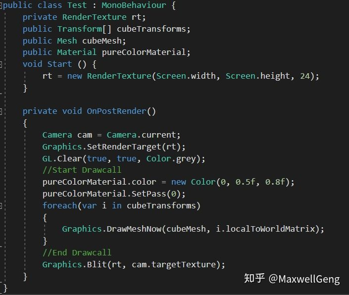
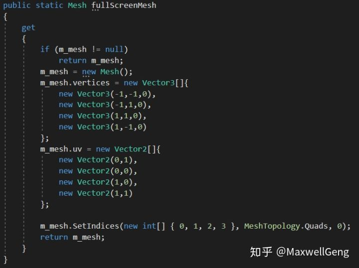
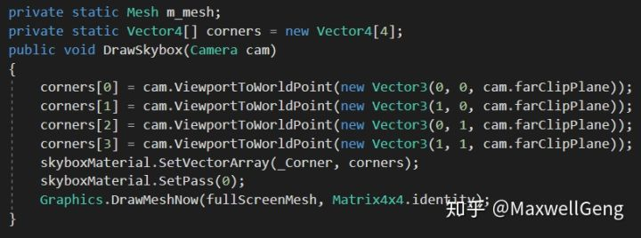
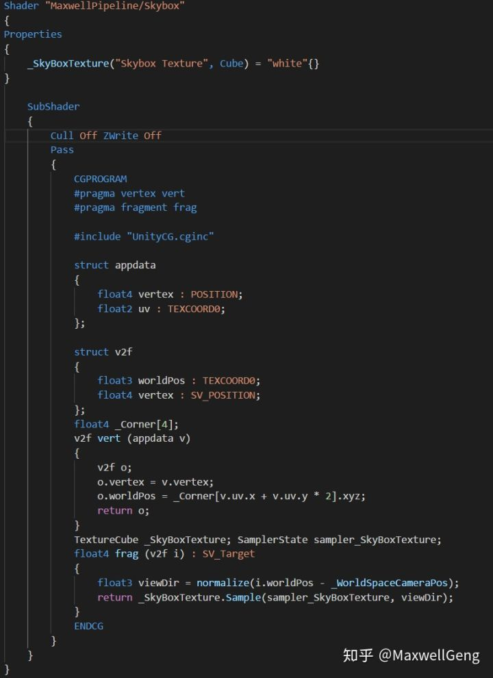
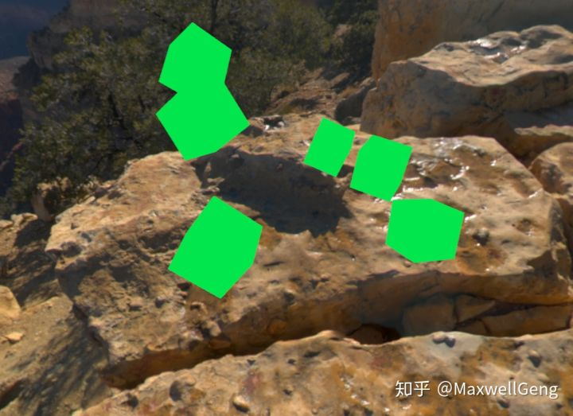
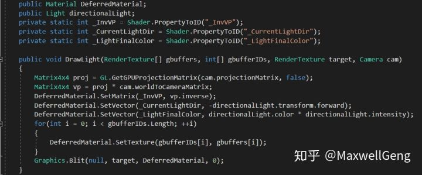
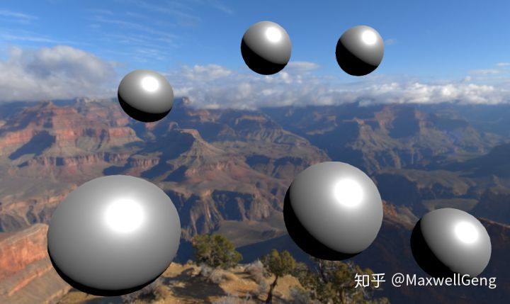

# 在Unity里写一个纯手动的渲染管线（一）

随着Unity3D  2018的面世，Scriptable Rendering  Pipeline，也就是可编程渲染管线这项新技术变得家喻户晓。官方在推出这项技术的时候，着重强调了他的各种优点，而笔者总结了一下官方的解释，认为SRP有以下三个优点：简单，简单和简单。

这第一个简单，笔者认为，SRP的诞生大大降低了萌新学习渲染管线的难度曲线斜率。如果使用OpenGL或DirectX，学习C/C++和底层API调用还是小事，可若要编写完整的渲染管线，一些对老鸟来说都很有挑战性的工作就赤裸裸的摆在了萌新们的面前，比如各种剔除，LOD，排序的实现并将其并行化，以利用尽可能多的CPU核心，同时还要注意一些十分繁琐的事情，比如数据结构的时间复杂度，对CPU缓存的友好程度等等。因此，从零开发一款游戏引擎的渲染管线是极难的，这也是为什么当前市场对于引擎工程师的要求是非常苛刻的。而SRP的出现对萌新们来说是一个福音，将繁琐的过程进行高级封装，在学习的过程中可以由浅入深，由零化整，不至于在某个或某些细节上卡太久。我们完全可以在了解了整个绘制过程之后，再考虑学习图形API以了解每个Unity中的调用分别是如何实现的。

第二个简单，笔者认为，SRP的诞生同时也降低了老司机们的工作难度。在当前市场人才稀缺的情况下，老司机们常需要作为“巨神阿特拉斯”扛起开发的整片天，一般来讲工作压力大且开发节奏飞快。本人虽不算老司机，但也有幸在国内某大厂的技术美术岗上“体验”过一把一人当两人用的工作节奏。本来在快乐的写些小工具，做些测试，这时，对面的美术和策划一拍即合，强行达成共识，并且用邪魅的眼神朝引擎组或TA组几个可怜蛋们看了一眼，并且提出了一个一定要魔改渲染管线才可以实现的图形效果需求。如果是Unreal  Engine的项目，可能这几周就得花时间在改源码编译引擎上了，而如果是Unity的项目，怕是要用Graphics, GL,  CommandBuffer这些触碰底层的API强行给当前的管线加料，有时候甚至要把一些官方的实现绕开，而渲染管线这种底层功能又会涉及到一些与项目组其他同事的合作问题……唔。。不说能否实现，数星期之后老司机们的肝是否还健在这都是个问题。而SRP的出现则确实的解决了这个痛点，通过一些如Culling，DrawPass这样的封装，让管线编程像搭积木一样，三言两语就实现完毕，把繁杂的，重复性高的活留给引擎，把关键的，决定性的和影响项目效果的把握在自己手里，这是SRP的另一个设计目的。

第三个简单，笔者认为，SRP的诞生降低了大规模次时代团队开发的难度。和一些年轻的团队靠几个老司机撑起整支队伍的的技术主力不同，许多国内外的成熟团队，在开发大作时常需要几十人甚至上百人的引擎组进行引擎的定制，研发。在这种时候，项目的解耦，分工就显得尤为重要。然而，项目自己的框架由于时间和成本，一般设计比较仓促，通用性较差，很有可能造成重复造轮子的现象。SRP在设计时考虑到了这一点，并试图通过这类封装，提高框架通用性，降低沟通成本，进而缩小开发成本，提高开发容错率。

既然SRP这么好，我们为什么要写一个“纯手动”的渲染管线呢？原因是，由于SRP的封装实在太过高层，反而对于接触渲染不久或接触Unity不久的朋友容易产生误会，因此我们这里就不详细解释SRP的使用方法，我们会从一些Unity先前提供的一些API，来了解应该如何用最基础的方法写一个简单的几何学物体。等到对Unity的渲染API和整体的渲染管线过程有些了解以后，学习SRP时就能充分感受到其设计的善意。

首先，Unity中最基础的绘制方法是Camera，Camera的每一次Render就是一整条管线，然而我们要抛开Camera，直接往画面上怼，因此我们需要强行让Camera不渲染任何物体：

这时屏幕会是黑色的，因为并没有任何物体被渲染也没有发生任何操作。

然后我们在摄像机上添加一个脚本，并且写入如下代码：

那么这一段代码是非常简单的，手动创建了一个RT，并且在摄像机绘制完，回调OnPostRender方法时，将手动创建的RT执行Clear操作，使其变成一个灰色的贴图，然后将这个RT绘制到camera的targetTexture上，如果targetTexture为null则会直接绘制到屏幕上。

接下来我们将试图绘制一个纯色的方块在屏幕上，这同样非常简单：

cubeTransform和cubeMesh是随便在摄像机镜头前摆了一个Cube，Material则是一个使用Unlit/Color的简单纯色Shader：

可以看到，一个简单粗暴的drawcall就已经被创造出来了，一个drawcall原则上分为Set  Pass和Draw两部分，Set Pass可以简单的理解成，将需要用到的Shader  Pass以及Material中的变量传送到显卡，而Draw指令则是告诉显卡，是时候开始绘制了。一般在进行性能优化时所说的降低优化，其实主要目的是为了降低SetPass的数量，因为SetPass需要进行大量的拷贝，校验工作，这个过程对于CPU的资源消耗是非常严重的，SetPass大概占整个Drawcall的80%以上的时间，这也是为何我们平时尽可能使用少的材质，让Unity来统计一帧中使用同一材质的物体，只进行一次SetPass就可以绘制多个物体，从而提高渲染效率。比如我们这里可以尝试使用同一个材质绘制多个方块：

绘制出来的结果如下：

这样就会绘制6个方块，算上背景即7个batch，而Set Pass则只有2个，有兴趣的朋友可以测试一下，通过这样的合批方法，降低SetPass数量，可以大大降低性能消耗，这也是我们平时进行渲染优化时的重要理论依据。

灰色的屏实在丑陋的无法直视，天空盒子自然是必须的，我们准备添加一个天空盒子背景，天空盒子在实现上相当于一个一直停留在最远处，即投影坐标为1的位置的巨大“盒子”，然鹅我们需要做的也就是获得每个像素的方向，然后通过读取Cubemap就可以实现所谓的盒子效果。

这里我们将手动生成一个铺满全屏的Mesh，这里是有些难以理解的，但是学过计算机图形学基础的朋友，应该会容易明白NDC坐标在OpenGL的定义（Unity使用的是OpenGL标准），大致讲解一下，即-1是左和下，1是右和上，   0是远裁面，1是近裁面，那么我们做的这个摊开在远裁面的Mesh大致看起来就应该是这样，注意，因为我们使用的是DX平台，所以UV的y轴是倒过来的：

 接下来就是要把4个远裁面角传入到Shader中：

最后在Shader里使用这张已经铺开的Mesh，并且读取CubeMap：

到这里，绘制顺序大致如下，绘制了几个不透明的纯色方块，然后在远裁面绘制一个Skybox，效果如下：

可是，可是，我们没有最重要的光照啊！如果只想要简单计算一个Directional  Light，那么确实可以直接当做一个全局变量传入到Shader中，不过我们认为，应该实现一个健全一些的光照，顺便多了解一点Render  Target的知识，所以实现一个简易的Deferred Shading想必是极好的。

Deferred  Shading在计算光照上非常的方便，我们只需要在Shader中输出4个贴图，技术上一般称之为GBuffer，而这4张贴图将会作为贴图变量传入到一个后处理脚本中，计算每个像素点的光照，由于光照统一运算，不需要进行Per  Object Light，大大降低了开发难度（我们暂时不Care性能问题~），当然咯，前提是得先有一个Deferred Pass  Shader，我们可以直接从Unity提供的Builtin Standard Shader里的Deferred Pass，官网可以直接下载到。

Deferred  Shading的第一步在于MRT，即Multi Render  Target。而Unity的SetRenderTarget早就支持了这个，首先我们要明白，每一个RenderTexture都有ColorBuffer和DepthBuffer，显然前者就是一般我们在游戏中使用的色彩，而后者则是一个16位的投影深度+8位的Stencil，这个在RenderTexture的文档中可以查到，GBuffer中应该储存当前像素的Albedo,  Specular,  AO，normal，Depth等。然后再在后处理脚本中，绘制一个全屏的Mesh，从而对每一个像素点进行光照运算，如果是点光源则应该绘制一个剔除掉前面只显示背面球，然后在球所在的范围内的像素中，计算所有的像素点。

首先，我们需要制定GBuffer，这里为了更好的时候默认的Deferred Pass而不重复造轮子，我们果断模仿一下Unity的GBuffer分布：

在这段初始化代码里，我们制定了总共三块RT，第一块是CameraTarget，也就是光照计算完以后最终的输出结果，他也将会是最后绘制天空盒的RenderTarget。第二块则是4个贴图，也就是GBuffer，我们会在Shader中输出这几个值，第三个则是depthTexture，他将起到担任depthbuffer和输出最终深度的作用，因为需要每个像素的世界坐标，显然深度图是必不可少的。

底下的DrawMesh操作并无变化，但是SetRenderTarget上确实有显著的变化，我们需要把这些RenderTexture作为Target命令显卡输出，那么接下来的代码就变成了这个样子：

这段代码非常容易理解，把各个RenderTexture归位，而Shader里的MRT输出则应该是这样的：

SV_Target就对应我们刚才传入的4个RenderBuffer，其他方面与普通Shader Pass并无区别，接下来，我们就需要将GBuffer传入到负责光照的后处理材质中，然后输出到CameraTarget了：

通过深度图反推世界坐标就需要viewProjection   matrix的逆矩阵，所以我们使用API分别获取Projection和View，然后计算逆矩阵并且传入材质，随后将GBuffer，光照信息分别传入材质中，最后直接将结果blit到camera  target即可（由于我们暂不考虑性能，因此没有使用stencil或Tiled做Light  Culling，这些有机会日后再加）。在Deferred  lighting这个shader中，我们将使用传入的数据计算像素点的光照，只需要对官方的builtin  shader进行一些小改动就可以了，我这里用的光照运算的Shader大概是这样的：

Shader中没什么技术含量，套了一下Unity提供的BRDF公式就可以了，这些都在Editor/Data/CGIncludes这个文件夹中，只需要拿出来用就行了。注意，这里边有个UnityIndirect是暂时没有使用的，我们不需要在意他会不会导致性能问题，Shader在编译时，所有类似的，直接赋值的常量，一般是会直接被忽略掉的。

那么最终输出的结果如何呢（为了让光照明显一些，我把cube换成了sphere）：

可以看到，结果非常完美，天空盒和基于物理的光照交相辉映。在本章节中，我们实现了从零开始，创建RenderTarget，绘制模型，光照和天空盒，而一个健全的渲染管线则还需要更多的操作，如阴影，间接光，剔除，排序甚至多线程并发等，我们会挑一些重要的，更快理解渲染管线的基本操作，在日后接触SRP时，就可以充分享受SRP带来的快乐，方便的管线编程体验。