# 在Unity里写一个纯手动的渲染管线（二）

上一章中，我们已经成功用最基础的API手撸出了整个管线的基本顺序，然而，这套管线很显然并不健全，我们今天尝试在其中加入一些性能和效果上的提升。注意，本章内容将会非常硬核，虽然我们尽量避免在图形学文章中加入大量程序框架的东西，但是显然这是没法避免的了。

补充：之前写文章忘了放开源，现在补一下开源地址：

[https://github.com/MaxwellGengYF/Unity-Custom-Rendering-Pipline](https://link.zhihu.com/?target=https%3A//github.com/MaxwellGengYF/Unity-Custom-Rendering-Pipline)[github.com](https://link.zhihu.com/?target=https%3A//github.com/MaxwellGengYF/Unity-Custom-Rendering-Pipline)

在搭建管线之前，我们首先应该思考的是程序的框架问题，OOP？亦或是面向数据的架构如ECS？一条渲染管线，是有并行而很可能没大有什么异步需求的，在这种情况下，我们可以使用单例模式来搭建管线，让每个单例负责管线的一部分，各个单例先后顺序鲜明。

整个渲染的流程大致可以分为剔除->将剔除结果输入待排序的列表中->排序操作->按照排序结果依次drawcall，当然这其中还需要合批，只不过合批的事我们准备放在之后的优化章节中讲解。

Unity的Job  System因其完成度低饱受诟病，然而笔者惊奇的发现，Job System用来作为静态单例的多线程工具，是非常好用的，那么我们就可以用Job  System来实现这些多线程的操作，按照官方的解释，Job  System中已经有了处理上下文，并行缓存等专门针对并发型运算的优化，而我们自己写的多线程调用器在很大概率上性能则不如官方的高。

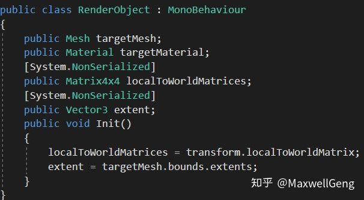

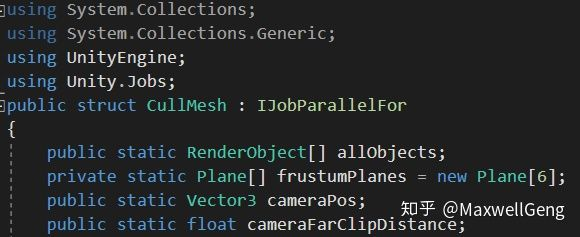

我们首先创建一个负责剔除的类，这里提供的几个变量都是剔除必需的数据，其中renderObject是每个绘制物体的component，这里为了编辑更快就暂时写一个MonoBehaviour的类挂上去。6个Plane则是摄像机前后左右上下的视锥面，我们将使用bounding  box进行视锥剔除，camera  pos和cameraFarClipDistance则是为了计算物体与当前摄像机的距离，进而为之后的排序做数据上的准备。

首先呢，我们需要写一个静态的方法，这个方法的功能就是计算视锥体剔除，这个是图形学基础，不再过多赘述，值得一提的是，SRP里直接使用了一个抽象的CullingResult代替了这一系列繁杂的操作。代码大致如下：

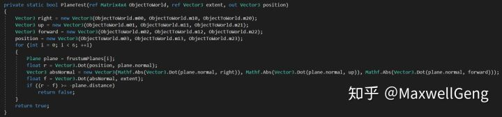

这个方法简单粗暴的遍历了所有的面，然后和每个面进行碰撞比对，当确保Bounding Box在所有的面之前的时候，就可以确定这个方块是应该被绘制的，计算结束后应该将需要被绘制的物体，储存到排序的队列中：

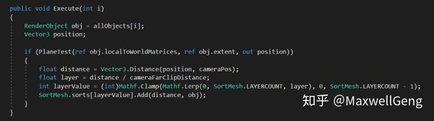

这里的Execute是Job   System提供的interface的方法，这里我们首先传入数据并进行剔除计算，当剔除的结果为true时，计算物体到摄像机的距离，然后使距离/远裁面，获得物体当前所处的距离层，然后按照这个层的值将其放到排序队列中。之所以要引入“距离层”这个概念，单纯是为了之后的并行化排序做准备，比如远裁面是1000米，我们就可以分成20个层，即每50米是一个层，而Unity将启动20个jobs来完成这20个数组的排序，这是一种非常暴力的用内存换取性能的方法，不过在内存已经十分富足的PC或主机端，这样的内存消耗还是可以接受的。

当然，实现一个排序方法还是非常必要的，为了尽可能的简单，我们这里用一个简单粗暴的二叉树前序遍历来进行排序，时间复杂度是O(nLogn)，考虑到已经做了并行操作，这个操作应该不会造成明显的性能影响，排序的模板方法如下：

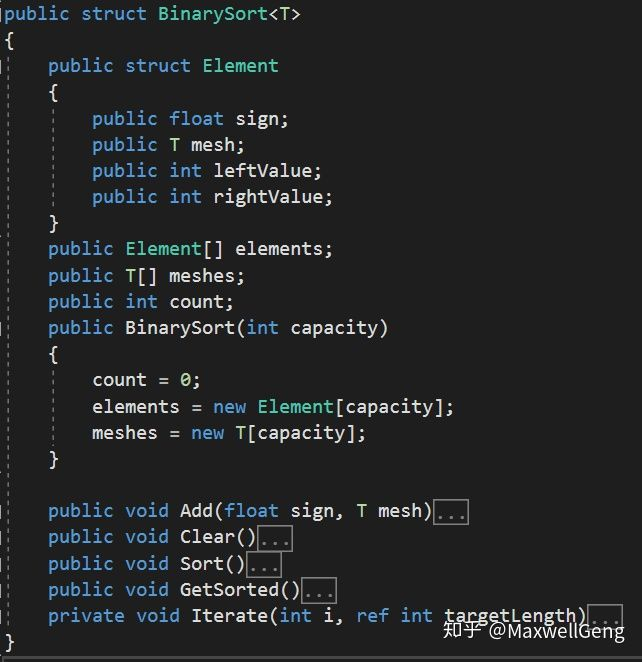

具体的方法实现属于基础的数据结构内容，有兴趣的朋友可以在开源中查看，这里不再赘述，值得一提的是，因为Add操作是多线程的，因此十分需要线程安全，我们就需要在Add中添加线程安全的保护：

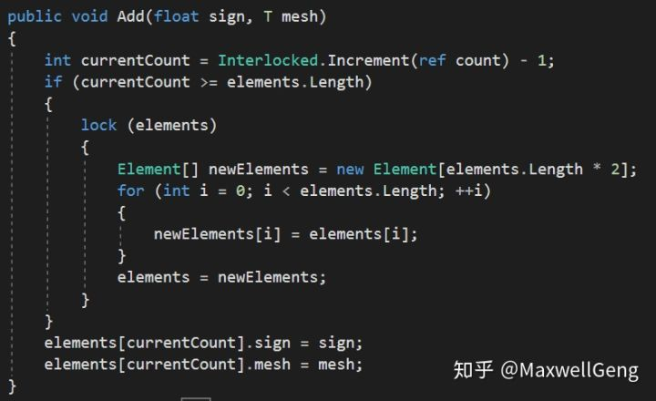 将offset和resize操作统统保护起来，防止出现Bug

有了这个排序脚本，我们就可以进行排序操作了，首先，指定一个分层常量LAYERCOUNT，也就是说之后所有的物体都应该根据距离被准确而均匀的分配到这些层中，随后，通过调用Sort函数，完成排序操作，并调用GetSorted函数，完成二叉树的后序遍历，这样在主线程中就不需要再去执行对缓存不友好的二叉树遍历了：

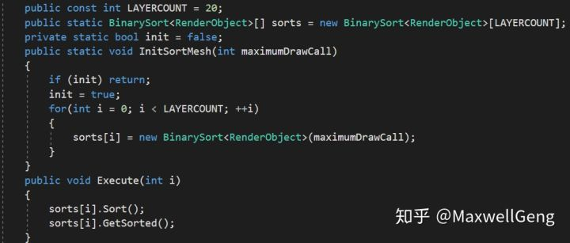

这一系列该有的操作都有了，我们就可以开始编写主控脚本了，与上次没有太大的不同，只不过这次我们在控制脚本中加入了单例的初始化和每帧的数据更新：

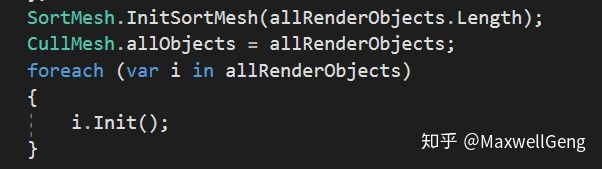

游戏开始时的初始化

计算每帧的投影矩阵，并按照投影矩阵运算视锥裁面，以及清空上一帧遗留的二叉树排序的痕迹，随后将新的任务“提上日程”，使用Job System的调用开始在分线程中完成剔除和排序：

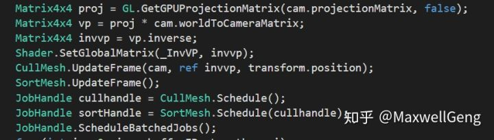

最后，快乐的完成绘制，注意，因为管线完成度低，我们并没有实现不同材质的SetPassCall和合批操作，这个会在之后的章节中慢慢讲解：

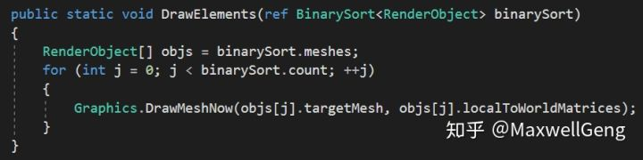

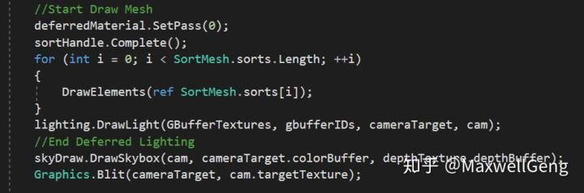

到这里时，我们可以认为所有的工作已经完成，接下来我们来测试一下看看结果如何，（初始的drawcall有Clear，Deferred Lighting和Skybox这三个）：

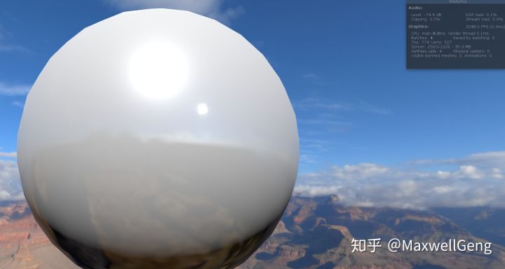当屏幕中只有1个球时，dc只多了1个

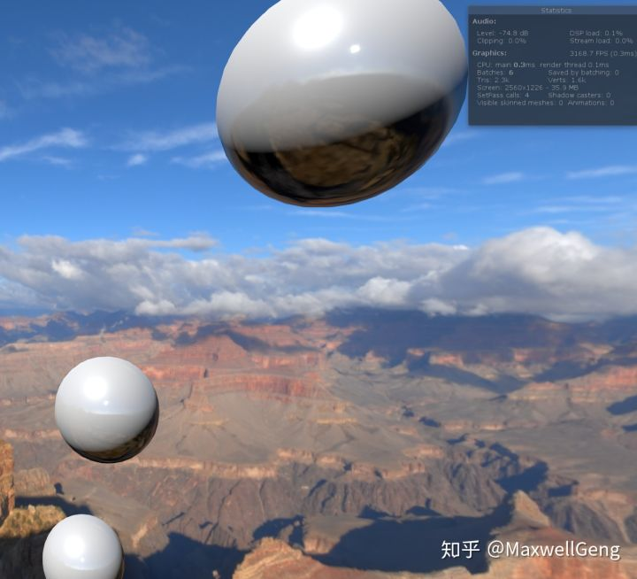结果看起来没什么问题

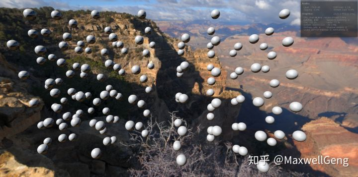

在这一步结束以后，这个程序就可以真正的称之为渲染管线了，因为只使用了底层基础的API，所以开发起来还是相当麻烦的，但是通过这样的流程，希望读者可以更充分的了解，管线是应该如何工作，以及日后进行自己的管线定制时，如何绕开“坑”，实现更高效的渲染管线。下一章中，我们将会完成一些扩展的操作，如阴影，后处理等，喜欢的朋友别忘了点一波关注~