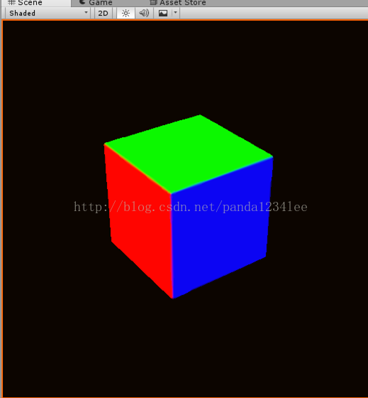
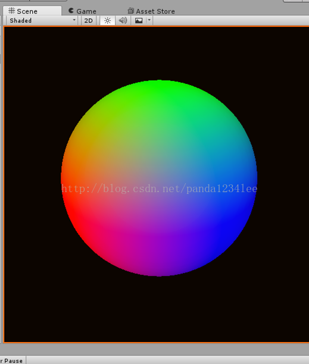
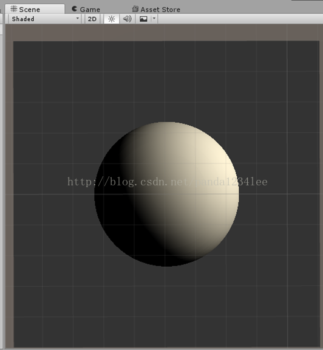
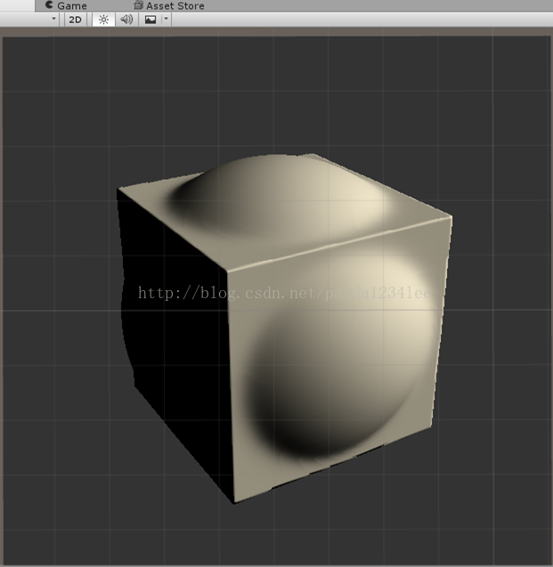
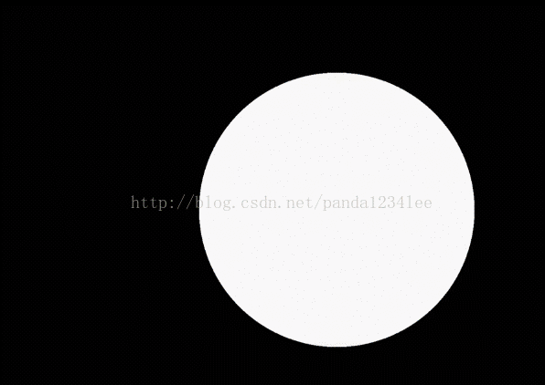

# 用代码来画画 —— Ray-Marching（光线步进）【Unity Shader】


https://blog.csdn.net/panda1234lee/article/details/56709806

参考自：

http://blog.csdn.net/baidu_26153715/article/details/46510703

http://imgtec.eetrend.com/blog/8845

http://ogldev.atspace.co.uk/www/tutorial13/tutorial13.html


效果如图：







完整代码及详细注释如下【修正了源代码的一些错误】：


```cpp
Shader "Custom/RayMarching"


{


	Properties


	{


		//_MainTex ("Texture", 2D) = "white" {}


		//_Cube("cubemap", cube) = ""{}


	}


 


	// 代码参考自 http://blog.csdn.net/baidu_26153715/article/details/46510703


	SubShader


	{


		// No culling or depth


		Cull Off ZWrite Off ZTest Always


 


		Pass


		{


			CGPROGRAM


			#pragma vertex vert


			#pragma fragment frag


			


			#include "UnityCG.cginc"


			// 球体 [Signed Distance Function]


			float sdfSphere(float3 p, float s)


			{


				return length(p) - s;


			}


			// 立方体


			float sdfBox(float3 p, float3 b)


			{


				return length(max(abs(p) - b, 0.));


			}


 


			// p 从相机空间换算到世界坐标系(即世界坐标系下光线步进的方向)


			float3 CameraSpace2WorldSpace(in float3 camPos, in float3 p)


			{


				float3 target = float3(0, 0, 0);


				float3 AxisY = float3(0, 1, 0);


				float3 z = normalize(target - camPos); // look


				float3 x = normalize(cross(z, AxisY)); // right


				float3 y = normalize(cross(z, x)); // up


                                // 注意：(right, up, look) * world = camera，Cg 矩阵是按行存储


				float3 theWorldSpaceP = float3(


					// dot(p, x), dot(p, y), dot(p, z)


					//p.x*x + p.y*y + p.z*z


					//mul(float3x3(x, y, z), p)


					mul(p, float3x3(x, y, z)) // 交换相乘位置相当于转置


					);


				return  theWorldSpaceP;


			}


			


			// 步进的光线终点和球体表面的距离


			float map(in float3 pos)


			{


				//float d = sdfSphere(pos, 1);


				float d = sdfBox(pos, float3(.5, .5, .5));


				return d;


			}


 


			float3 normal(in float3 pos)


			{


				float2 offset = float2(.01, 0);


				float3 nDir = normalize(


					float3(


						// 通过计算 xyz 三个方向的差值（梯度），归一化后得到法线方向


						map(pos + offset.xyy) - map(pos - offset.xyy),


						map(pos + offset.yxy) - map(pos - offset.yxy),


						map(pos + offset.yyx) - map(pos - offset.yyx)


						)


				);


				return nDir;


			}


 


			float marching(in float3 origin, in float3 dir)


			{


				float t = 1;	// 步进的光线总长度


				int i;


				for (i = 0; i<64; ++i)


				{


					// 随着光线的步进，检查是否到达球体的表面


					float3 graphic = origin + t*dir;


					float d = map(graphic);


					// 当距离小于一个最小阈值，或者长度超过一个最大阈值，则中断循环


					if (d < .02 || t>20)


						break;


					// 步进


					t += d;


				}


				return t;


			}


 


			float3 render(in float3 pos, in float3 p)


			{


				// 距离辅助的 ray-marching


				float d = marching(pos, p);


				// 计算法线方向(世界坐标系)


				float3 nDir = normal(pos + p*d);


 


				float3 c = 0;


				if (d<30)


				{


					// 光源方向（世界坐标系）


					float3 lDir = normalize(half3(0, 1, 0));


					// diffuse


					float diff = max(0, dot(lDir, nDir));


 


					// 将法线方向作为颜色返回


					c = nDir;


				}


				return c;


			}


 


			struct appdata


			{


				float4 vertex : POSITION;


				float2 uv : TEXCOORD0;


			};


 


			struct v2f


			{


				float2 uv : TEXCOORD0;


				float4 vertex : SV_POSITION;


			};


 


			v2f vert (appdata v)


			{


				v2f o;


				o.vertex = mul(UNITY_MATRIX_MVP, v.vertex);


				o.uv = v.uv;


				return o;


			}


			


			//sampler2D _MainTex;


 


			fixed4 frag (v2f i) : SV_Target


			{


				float time = _Time.y;


				float2 uv = i.uv * 2 - 1;


                                // 相机坐标系


				float3 p = normalize(float3(uv, 2));


 


				// 相机的世界坐标（随时间变化）


				float3 camPos = float3(3 + sin(time), 3, 3 + cos(time));


				


				// 将 p 点换从相机坐标系换算到世界坐标系


				float3 theNewP = CameraSpace2WorldSpace(camPos, p);


 


				// 渲染模型的法线


				fixed3 col = render(camPos, theNewP);


 


				return fixed4(col, 1);


			}


			ENDCG


		}


	}


	FallBack "Diffuse"


}
```


加上光照计算的效果：





取 并集（Union） 的效果：





实际应用：用 SDF 和 Raymarch 让代码 “画画”

