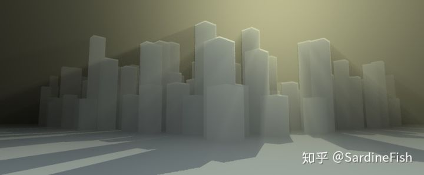
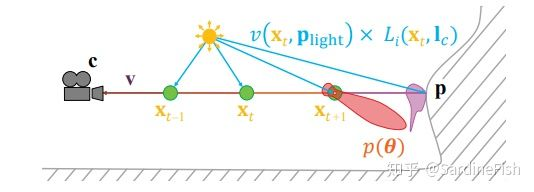
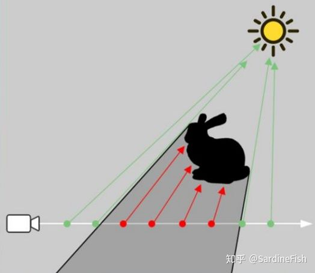
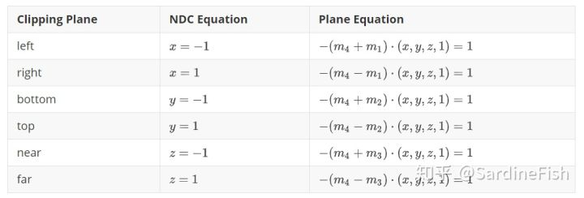
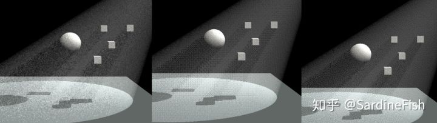
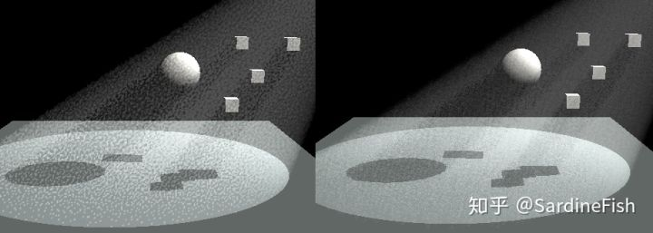
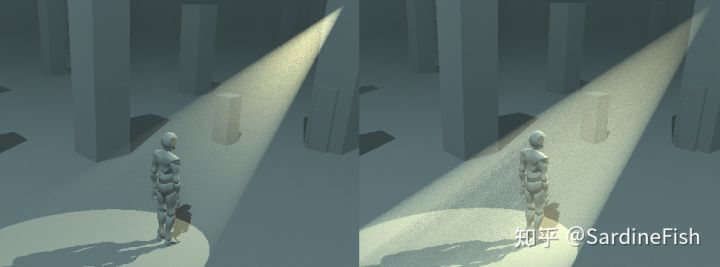
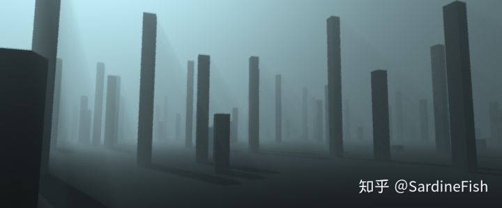

# 在 Unity 中实现体积光渲染

[TOC]


当光线穿过胶体，由于胶体微粒对光线的散射作用，产生丁达尔现象。在实时渲染中这样的效果常称为**体积光 (Volumetric Light)**，有时也称作上帝光 (god light)。

本文将简单介绍体积光散射效果的相关原理，及在 Unity SRP 下的简单实现。

本文大部分内容参考自 Real-time Rendering 4th Chapter 14 [0] 和 GDC 2016 上 Inside 开发者的 presentation [1].

本文需要的前置知识包括

- 数学
- 图形学
- Unity SRP

先放个效果图




代码在 GitHub, tag: volume-light

[https://github.com/SardineFish/SRP-Demos/tree/volume-light](https://link.zhihu.com/?target=https%3A//github.com/SardineFish/SRP-Demos/tree/volume-light)[github.com](https://link.zhihu.com/?target=https%3A//github.com/SardineFish/SRP-Demos/tree/volume-light)

## Light Scattering(光散射)

光在介质中传播，会受以下四种因素而发生改变：

- **Absorption**，光线被物质吸收并由光能转化为其他能量
- **Out-scattering**，光线被介质中的微粒向外散射
- **Emission**，介质由于黑体辐射等因素产生自发光
- **In-scattering**，从其他地方散射到当前光路上的光线


其中，介质对光线的吸收和散射会影响光线在介质中的**透射率 (transmittance)**。

我们可以用下式来描述一个点光源发出的光线在介质中的散射效果： 

![[公式]](VolumetricLightRendering.assets/equation-1586867846729.svg) 

其中 ![[公式]](VolumetricLightRendering.assets/equation-1586867846674.svg) 表示在介质中某一位置 x 到摄像机位置 c 的光线透射率函数， ![[公式]](VolumetricLightRendering.assets/equation-1586867846757.svg) 表示介质中 x 点向视线方向 v 的散射光，关于该式的详细推导见参考文献 [2]。



### Transmittance(透射率)

光线在介质中两点 ![[公式]](VolumetricLightRendering.assets/equation-1586867846757.svg) 间的透射率可以用下式描述 

![[公式]](VolumetricLightRendering.assets/equation-1586867846760.svg) 

其中

![[公式]](VolumetricLightRendering.assets/equation-1586867846770.svg) 

该式又被称为 **Beer-Lambert Law**，式中 ![[公式]](VolumetricLightRendering.assets/equation-1586867846762.svg) 表示介质中 x 处对光线的衰减率，包括介质对光线的吸收和向外散射，即 ![[公式]](VolumetricLightRendering.assets/equation-1586867846762.svg) 。τ 被称为 optical depth，表示最终对光线的衰减量，没有单位。在该式下，越高的衰减率或者更长的距离，都会使得 optical  depth 增大，并得到更低的光线透射率。σt 可以具有 RGB 分量，例如下图是 σt = (0.5, 1.0, 2.0)  的介质中的光线透射率与透射距离的关系，以及表现出来的散射颜色。


### Scattering

在介质中的 x 处，从点光源发出的光线散射到 v 方向上的光，可以通过下式表述

![[公式]](VolumetricLightRendering.assets/equation-1586867846770.svg) 

> where $n$ is the number of lights, p(v, l) is the phase function, v(x, p) is the visibility function, ![[公式]](VolumetricLightRendering.assets/equation-1586867846770.svg) is the direction vector to the ith light, and ![[公式]](VolumetricLightRendering.assets/equation-1586867846785.svg) is the position of the ith light. In addition, ![[公式]](VolumetricLightRendering.assets/equation-1586867846789.svg) is the radiance from the ith light as a function of the distance to its position. 

### Visibility Function

式中的 visibility function v(x, p) 表示从光源位置 p 到介质中位置 x 的光的通过率，可以表述为以下函数 

![[公式]](VolumetricLightRendering.assets/equation-1586867846830.svg) 

也就是说，我们需要考虑从光源发出的光线受物体的遮挡，以及在射入到介质中 x 点所受到的衰减作用。

### Phase Function

phase function 用于描述在宏观上光线在介质中经过散射到各方向上的概率分布，通常表示为入射与出射光线夹角 θ 的函数 p(θ). 因为能量守恒，phase function 在单位球上的积分必须等于1.


基于物理的 phase function 根据介质中微粒与入射光线波长的相对大小 ![[公式]](VolumetricLightRendering.assets/equation-1586867846797.svg) ，可以分为几种不同的散射模型

- ![[公式]](VolumetricLightRendering.assets/equation-1586867846801.svg) 时适用 Rayleigh scattering （例如空气）
- ![[公式]](VolumetricLightRendering.assets/equation-1586867846839.svg) 时适用 Mie scattering
- ![[公式]](VolumetricLightRendering.assets/equation-1586867846809.svg) 时适用 geometric scattering

其中 ![[公式]](VolumetricLightRendering.assets/equation-1586867846835.svg) ，r 为微粒半径，λ 为光的波长

**Rayleigh Scattering**

![[公式]](VolumetricLightRendering.assets/equation-1586867846808.svg) 

**Mie Scattering (Henyey-Greenstein phase function)** [3] 

![[公式]](VolumetricLightRendering.assets/equation-1586867846838.svg) 

式中参数 g 影响散射光在顺光或逆光方向上的相对强度，取值范围 [-1, 1]。Blasi 提出了该式的快速近似实现（又常称为 Schlick phase function）[4]： 

![[公式]](VolumetricLightRendering.assets/equation-1586867846829.svg) 

**Geometric Scattering**

当介质中微粒显著大于光的波长时，光线将会发生折射与反射，要从宏观上模拟这样的散射现象，通常需要非常复杂的散射模型，例如体积云的渲染。

左图是 Rayleigh scattering 的极坐标分布图，具体表现为顺光和逆光方向上的散射光强度较大。右图是 HG phase function 在不同的 g 参数下的极坐标分布图，在 g 接近 1 时表现为逆光方向上散射光强度较大

## Real-time Volumetric Rendering

### Volumetric Data

体积渲染中材质的一个重要属性是 transmittance 函数中的衰减率 σt，我们可以假定整个材质中 σt  是均等的，例如在匀质胶体中。而对于一些大气中的云雾、烟雾，其内部各处的 σt 是不均等的，我们可以利用一个 3D Texture  储存和表示一个非均匀介质中各处的 σt，也可以基于解析函数实时计算，例如 3D Perlin Noise。

### Ray-marching

在实时渲染中，通常采用 ray-marching  的方式实现介质中散射光的渲染。即对屏幕上每个像素，计算从摄像机发出的视线光线，在介质中以一个特定的步长迭代步进，并在每次步进的位置向光源再做一次 ray-marching 计算入射光强度，再根据 phase function 和 transmittance function  计算从当前位置到摄像机的散射光强度。



实时 ray-marching 渲染的代价是巨大的，我们可以进行一定的简化，例如略去从光源入射到介质这个过程上的transmittance  积分，估计入射光经过的距离和介质的平均衰减率（对于均匀介质，且光源在介质内的，则不需要估计）。同时可根据目标效果的需要，决定是否将阴影应用在体积渲染中。若 ray-marching 依然存在较大的代价，可以考虑通过估计介质厚度和平均衰减率，在表面渲染上进行散射光的近似渲染。

### Simple Implementation

我们可以将体积渲染通过以下伪代码表示

```c
float3 scattering(float3 ray, float near, float far)
{
    float3 transmittance = 1;
    float3 totalLight = 0;
	for(float distance = near; distance < far; distance += StepSize)
    {
        float3 pos = CameraPosition + distance * ray;
        float3 extinction = ExtinctionAt(pos);
        transmittance *= exp(-StepSize * extinction);
        float3 inScatterFactor = extinction - Absorbtion;
        totalLight += transmittance * lightAt(pos) * inScatterFactor * Phase(lightDir, viewDir) * StepSize;
	}
}
float3 lightAt(float3 pos)
{
    float3 lightDir = DirectionTowardLight;
    float3 transmittance = 1;
    for(float len = 0; len < DistanceToLight; len += StepSize)
    {
        float x = pos + lightDir * len;
        transmittance *= exp(-StepSize * ExtinctionAt(x));
    }
    float shadow = ShadowAt(pos);
    return LightColor * transmittance * shadow;
}
```

其中的 `ExtinctionAt(x)` 表示介质中 `x` 处的衰减率，可以表示为一个恒定的量（均匀介质），或是采样 3D Texture，或是用解析式计算。`Phase(l,v)` 可以根据需要，选择不同的 Phase Function 模型。`ShadowAt(x)` 可以通过采样 shadow map 实现。式中采用累乘的方式步进计算 `transmittance`，避免多次积分计算，原理如下： 

![[公式]](VolumetricLightRendering.assets/equation-1586867846856.svg) 

因此在 ray-marching 步进过程中，将当前步长的 transmittance 与前一次位置到摄像机的 transmittance 总量相乘即可得到当前位置到摄像机的 transmittance。

简单的实现后就可以得到下图的效果。


## Implement Details

### Volumetric Bound

我们可以在屏幕空间下进行体积渲染，这对于大范围的体积光渲染是可行的，例如整个场景的阳光体积光。但对于场景中的一些小型光源，例如手电筒，在全屏幕范围内渲染带来严重的性能浪费。同时 ray-marching  的迭代次数也会在很大程度上影响性能，步长过长也会导致渲染效果下降。对此我们可以将体积渲染限定在一定的区域内，例如一个矩形包围盒，或是聚光灯光源的锥体内。


我们可以将 volumetric bound 作为 mesh 进行表面渲染，并从 frontface 的位置开始沿视线方向进行  ray-marching，在此我们需要知道该 mesh 的 frontface depth 和 backface  depth，以便在这两个距离之间进行  ray-marching。这里可以利用解析的方法计算射线与矩形包围盒或是锥体面的交点，也可以通过事先额外渲染 depth 的方式。

如图是一个 spotlight 的 bound box，这里直接使用了绘制 shadow map 时所使用的光源视锥体作为 bound box

### Frustum Plane Extraction

若通过解析方法计算射线与探照灯的投影锥体表面交点，需要首先得到该锥形体的平面方程。Gribb 等人提出了通过投影矩阵快速得到投影平锥体6个平面方程的方法[5]，这里简单介绍一下其思路。

设从世界空间到摄像机观察空间的矩阵为 V，投影矩阵 P，我们令 M=PV 为摄像机的 ViewProjection 矩阵。对于空间中任意一点 p = (x, y, z,  1)，通过与 ViewProjection 矩阵相乘得到其在裁剪空间下的坐标，并经过齐次除法后得到 NDC 坐标。

如果我们令 ViewProjection 矩阵中4的4行分别为  ![[公式]](VolumetricLightRendering.assets/equation-1586867846870.svg) ，即 

![[公式]](VolumetricLightRendering.assets/equation-1586867846839.svg) 

 那么 p 在裁剪空间下的坐标为 

![[公式]](https://www.zhihu.com/equation?tex=+%5Cbegin%7Baligned%7D+p_%7Bclip%7D+%26%3D+%28x%27%2C+y%27%2C+z%27%2C+w%27%29+%5C%5C++++++%26%3D+M+%5Ccdot+p+%5C%5C+++++++%26%3D+%28m_1+%5Ccdot+p%2C+m_2+%5Ccdot+p%2C+m_3+%5Ccdot+p%2C+m_4+%5Ccdot+p%29++%5Cend%7Baligned%7D+%5Ctag%7B10%7D+) 

p 在 NDC 空间下的坐标可以通过下式计算 

![[公式]](https://www.zhihu.com/equation?tex=+%5Cbegin%7Baligned%7D+++++p_%7BNDC%7D+%26%3D+%5Cfrac%7Bp_%7Bclip%7D%7D%7Bw%27%7D++++++%3D+%28%5Cfrac%7Bm_1+%5Ccdot+p%7D%7Bm4+%5Ccdot+p%7D%2C+++++++++%5Cfrac%7Bm_2+%5Ccdot+p%7D%7Bm4+%5Ccdot+p%7D%2C+++++++++%5Cfrac%7Bm_3+%5Ccdot+p%7D%7Bm4+%5Ccdot+p%7D%2C+++++++++1%29+%5Cend%7Baligned%7D+%5Ctag%7B11%7D+) 

不妨以左裁剪平面为例，其平面方程在 NDC 空间下为 ![[公式]](VolumetricLightRendering.assets/equation-1586867846848.svg) ，即 

![[公式]](VolumetricLightRendering.assets/equation-1586867846858.svg) 

 即是一个平面的标准方程 Ax + By + Cz + D = 0 的向量形式 ![[公式]](VolumetricLightRendering.assets/equation-1586867846871.svg) ，而平面的法向量即是 ![[公式]](VolumetricLightRendering.assets/equation-1586867846894.svg) ，也可以直接从该式得到，但该式并没有考虑法向量的正负方向。 综上所述，视锥体的六个裁剪平面方程可以总结为（平面法线朝向视锥体外侧）：



### Sampling

在一条光线上使用越多的采样次数，显然可以得到越精确的渲染效果，但随之而来的代价是巨大的。特别是如果使用 texture 作为介质的密度，每一次 step 都会带来一次 texture fetch 的开销。但过低的采样次数会带来严重的失真效果。

左图每像素128次采样，右图每像素8次采样

对于低采样次数带来层次式的失真现象，可以通过对每像素的 ray-marching 光线增加一点随机的偏移来弱化这一问题，又称为抖动采样 (Jittered Sampling)。

```c
float stepSize = (far - near) / STEPS;
float offset = sampleOffset(texcoord) * stepSize;
float3 color = scattering(ray, near + offset, far + offset);
```

偏移量应该限制在 ray-marching 步长范围内，这一 offset 可以基于随机函数生成白噪声，使得不同屏幕像素使用不同的 offset 达到 jitter 的效果。


但随机的白噪声抖动给画面带来严重的噪点感也同样会降低观感体验，即便对其进行模糊处理，依然难以去除其中的低频噪声。对此我们可以使用高频的 Bayer Matrix pattern 替代白噪声，作为每像素的 offset，但由于其结构规则，大面积使用会带来强烈的重复感。Inside 的开发者在 GDC 2016 上的 talk 中提出将 Blue Noise 用于抖动采样，能够带来更好的渲染效果。

### Blue Noise

与 White Noise 在所有频率上随机分布不同，Blue Noise 是一种高频的随机噪声。但 Blue Noise 无法实时生成（基于  void-and-vluster 算法[6]）。开发者 Chistoph Petter 的博客中对 Blue Noise  做了更深入的介绍，在其中也能找到他生成的各种格式和尺寸的 Blue Noise Texture （CC0 授权）[http://momentsingraphics.de/BlueNoise.html](https://link.zhihu.com/?target=http%3A//momentsingraphics.de/BlueNoise.html)

此外也有通过去除 White Noise 中的低频成分得到高频的 Blue Noise 的近似实现，此方法也能用于生成各种颜色的噪声（[https://blog.demofox.org/2017/10/25/transmuting-white-noise-to-blue-red-green-purple/](https://link.zhihu.com/?target=https%3A//blog.demofox.org/2017/10/25/transmuting-white-noise-to-blue-red-green-purple/)

上图从左到右分别为 white noise, Bayer Matrix, Blue Noise。从上到下分别为局部细节，完整图像，2像素半径的高斯模糊效果，建议放大查看原图

上图从左到右分别采用 White Noise, Bayer Matrix, Blue Noise。每像素只有 4 次采样。

### Filtering

我们可以通过 blur filter 削弱抖动采样得到的噪点，同时可以使得体积光的边缘更为平滑。这里使用 Gaussian Kernel 或是 Box  Filter 都是可以的。Inside 的开发者提出使用基于噪声的 Noisy Blur，以使用更少的 sample，配合 TAA  抗锯齿得到更平滑的效果。而 Killzone Shadow Fall 的开发者在 GDC2014 上的分享中提出使用 Bilateral  blur 对抖动采样的体积光进行滤波（类似 Photoshop 中的表面模糊）[9]。


>  If you want a different filter, e.g. gaussian, you can adjust the sizes of the areas to achieve this, rather than assigning weights.
>  (to help your google along, the proper term for this would be importance sampling)
>  

上图为 Inside 中使用的 filter 算法，其中的 `sqrt(dist)` 是为了确保采样点在圆上具有相同的概率密度（也就是在不同半径的圆环区域内有相等的面积）。

上图是每像素4次采样，基于 Blue Noise 抖动采样，将体积光渲染到 1/2 屏幕尺寸，并超采样叠加到屏幕图像上。左图未经过 filter，右图采用 8px 半径的 noisy blur

### Temporal Anti-Aliazing

随机的抖动采样配合 TAA 在时间上的累积效果，能够更进一步弱化画面中的噪点，得到更精细平滑的渲染效果。

TAA 的具体实现细节和优化方案可以参考 Epic 在 SIGGRAPH2014 上的 *High-Quality Temporal Supersampling* [10] 和 Nvidia 在 GDC2016 上的 *An Excursion in Temporal Supersampling* [11]，以及 PLAYDEAD 在 GDC2016 上的 *Temporal Reprojection Anti-Aliasing in INSIDE* [12].

可能我会额外写一篇关于 TAA 的吧（FLAG（x

右图用上了最简单的 TAA ( finalColor = 0.9 * history + 0.1 * current )

### Shadow

在 ray-marching 渲染散射光时，根据当前采样点的世界坐标，采样光源空间 shadow map  得到当前位置的阴影遮挡信息，从而实现带有体积感的阴影。Unity 默认用于表面渲染的 shadow map 是屏幕空间 shadow  map，而这里我们需要光源空间 shadow map 以便在不同屏幕 z 值的位置采样到不同的阴影深度。这里我自己实现了一个 Shadow  Pass，关于 Shadow Map 的原理及实现，可以参考我的这两篇博客 

[实时阴影渲染实现](https://link.zhihu.com/?target=https%3A//www.sardinefish.com/blog/%3Fpid%3D426)[www.sardinefish.com](https://link.zhihu.com/?target=https%3A//www.sardinefish.com/blog/%3Fpid%3D426)[实时阴影渲染原理与实现 —— PSM & TSM](https://link.zhihu.com/?target=https%3A//www.sardinefish.com/blog/%3Fpid%3D428)[www.sardinefish.com](https://link.zhihu.com/?target=https%3A//www.sardinefish.com/blog/%3Fpid%3D428)

### **Parameters**

关于参数，根据式 (1), (2), (4)，影响最终体积光/雾效的最主要的参数包括介质的衰减系数 ![[公式]](VolumetricLightRendering.assets/equation-1586867846905.svg) 和光的强度 ![[公式]](VolumetricLightRendering.assets/equation-1586867846935.svg) 。其中衰减系数  ![[公式]](https://www.zhihu.com/equation?tex=%5Csigma_t) 包括散射系数和吸收系数， ![[公式]](VolumetricLightRendering.assets/equation-1586867846939.svg) ， ![[公式]](VolumetricLightRendering.assets/equation-1586867846942.svg)  用于计算光线透射率 transmittance， ![[公式]](VolumetricLightRendering.assets/equation-1586867846942.svg)  用于计算散射光的贡献率，在实际实现中，可以令 ![[公式]](VolumetricLightRendering.assets/equation-1586867846947.svg) ，而吸收系数的部分，通过调节散射光强度可以达到相同的效果，以此简化参数。

左图是 σt = σs = 0.05, c_light = 1 时不同距离上的散射光积分结果，不考虑入射光的衰减，右图 σt = 0.225 

![[公式]](https://www.zhihu.com/equation?tex=%5Csigma_t)  可以具有 RGB 分量，表示对不同颜色的光线的不同衰减率，线性的调节  ![[公式]](VolumetricLightRendering.assets/equation-1586867846964.svg) 难以精确控制效果，对此可以用一个可视距离 d 来表示达到  ![[公式]](https://www.zhihu.com/equation?tex=T_r+%3C+%5Cepsilon) 所需要的最小距离，ε 可以取0.1或是更小 ，由均匀介质的透射率 ![[公式]](VolumetricLightRendering.assets/equation-1586867846976.svg)  可得

![[公式]](VolumetricLightRendering.assets/equation-1586867846977.svg) 

用于渲染体积光的光照强度，应当在 Unity Light Component 中的光照强度额外乘上一个可调节的系数，以便将表面光照与体积光的光照强度分离。

在 ray-marching 计算介质中某点的入射光时，入射光受介质的衰减影响同样可以用参数调节，这里我引入了一个参数 `incomingLoss` 表示入射光受介质透射率的影响程度，此参数会影响 point light 和 spot light 的散射光在距离上的分布。

```c
light *= lerp(1, exp(-extinction * lightDistance), incomingLoss);
```

左图 incomingLoss = 1, 右图 incommingLoss = 0

而对于 directional light，我们无法直接根据光源的位置计算光源到采样点的距离，因此需要一个额外参数用于计算 directional light 的入射光透射率，但这样的效果与直接调节光照强度无异。

## Results

最终除了聚光灯以外，实现了全局 directional light 的体积光和雾效，最终效果还算能看吧，调参数真的很快乐.jpg

### Performance

下图的体积光采用全分辨率渲染，每像素8 step，在我的垃圾 1050 Ti 上每帧约 2.3ms，加上0.5 ms 2048px的 TSM shadow map，再加上0.4ms  不用脑子写的 TAA（只是混合历史帧，甚至都没有 reprojection）

如果场景中只有一个 spot light 用于渲染体积光，4 step 加上 TAA 效果足够，每帧仅 0.8ms 用于渲染体积光





代码放在了 GitHub，tag: volume-light

[https://github.com/SardineFish/SRP-Demos/tree/volume-light](https://link.zhihu.com/?target=https%3A//github.com/SardineFish/SRP-Demos/tree/volume-light)[github.com](https://link.zhihu.com/?target=https%3A//github.com/SardineFish/SRP-Demos/tree/volume-light)

## Reference

[0] Akenine-Moller, Tomas, Eric Haines, and Naty Hoffman. *Real-time rendering*. AK Peters/CRC Press, 2018.

[1] Mikkel Gjal, Mikkel Svendsen. "The Rendering of Inside High Friendly, Low Complexity." *Presentation at GDC* 16 (2016).

[2] Fong, Julian, Magnus Wrenninge, Christopher Kulla, and Ralf Habel, SIGGRAPH Production Volume Rendering course, Aug. 2017.

[3] Horvath, Helmuth, “Gustav Mie and the Scattering and Absorption of  Light by Particles: Historic Developments and Basics,” Journal of  Quantitative Spectroscopy and Radiative Transfer, vol. 110, no. 11, pp.  787–799, 2009.

[4]  Blasi, Philippe, Bertrand Le Saec, and  Christophe Schlick, “A Rendering Algorithm for Discrete Volume Density  Objects,” Computer Graphics Forum, vol. 12, no. 3, pp. 201–210, 1993.

[5]  Gribb, Gil, and Klaus Hartmann, “Fast Extraction of Viewing Frustum  Planes from the World-View-Projection Matrix,” gamedevs.org, June 2001.

[6] Ulichney, Robert. "The void-and-cluster method for dither array generation." *SPIE MILESTONE SERIES MS* 154 (1999): 183-194.

[7] Christoph Peters. "Free blue noise textures" [http://momentsingraphics.de/BlueNoise.html](https://link.zhihu.com/?target=http%3A//momentsingraphics.de/BlueNoise.html)

[8] "Transmuting White Noise To Blue, Red, Green, Purple" [https://blog.demofox.org/2017/10/25/transmuting-white-noise-to-blue-red-green-purple/](https://link.zhihu.com/?target=https%3A//blog.demofox.org/2017/10/25/transmuting-white-noise-to-blue-red-green-purple/)

[9] Valient, Michal. "Taking Killzone Shadow Fall image quality into the next generation." *Presentation at GDC* 14 (2014).

[10] Karis, Brian. "High-quality temporal supersampling." *Advances in Real-Time Rendering in Games, SIGGRAPH Courses* 1.10.1145 (2014): 2614028-2615455.

[11] Salvi, Marco. "An excursion in temporal super sampling." *GDC2016 From the Lab Bench: Real-Time Rendering Advances from NVIDIA Research* (2016).

[12] Pedersen, Lasse Jon Fuglsang. "Temporal reprojection anti-aliasing in inside." *GDC Vault* (2016).