# SRP Batcher: Speed up your rendering!

In 2018, we’ve introduced a highly customizable rendering technology we call [Scriptable Render Pipeline (SRP)](https://blogs.unity3d.com/2018/01/31/srp-overview/).  A part of this is a new low-level engine rendering loop called SRP  Batcher that can speed up your CPU during rendering by 1.2x to 4x,  depending on the Scene. Let’s see how to use this feature at its best!

<iframe width="862" height="495" src="https://www.youtube.com/embed/pUM7ifjGKkM" frameborder="0" allow="accelerometer; autoplay; encrypted-media; gyroscope; picture-in-picture" allowfullscreen></iframe>
 This video shows the worst case scenario for Unity: each object is  dynamic and uses a different material (color, texture). This scene shows  many similar meshes but it would run the same with one different mesh  per object (so GPU instancing can’t be used). The speedup is about 4x on  PlayStation 4 (this video is PC, Dx11).

*NOTE: when we talk about x4 speedup, we’re talking about the CPU  rendering code (the “RenderLoop.Draw” and “ShadowLoop.Draw” profiler  markers). We’re not talking about global framerate (FPS)).*

## Unity and Materials

The Unity editor has a really flexible rendering engine. You can  modify any Material property at any time during a frame. Plus, Unity  historically was made for non-constant buffers, supporting Graphics APIs  such as DirectX9. However, such nice features have some drawbacks. For  example, there is a lot of work to do when a DrawCall is using a new  Material. So basically, the more Materials you have in a Scene, the more  CPU will be required to setup GPU data. 

[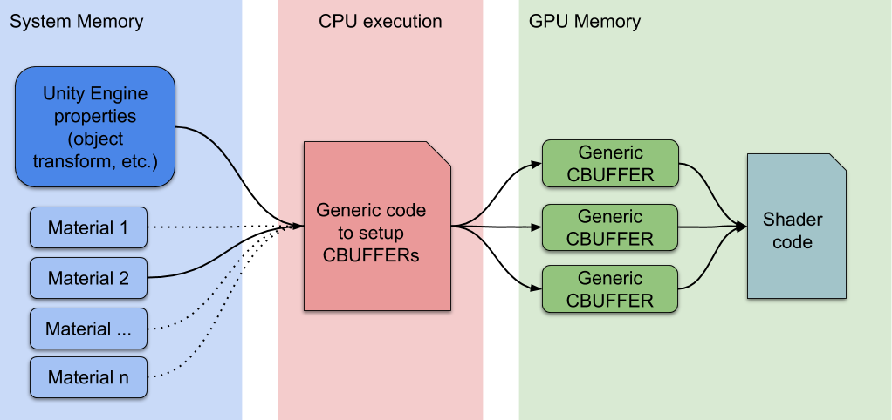](https://blogs.unity3d.com/wp-content/uploads/2019/02/SRP-Batcher-OFF.png)

Standard Unity rendering workflow

During the inner render loop, when a new Material is detected, the  CPU collects all properties and sets up different constant buffers in  the GPU memory. The number of GPU buffers depends on how the Shader  declares its CBUFFERs.

## How SRP Batcher works

When we made the SRP technology, we had to rewrite some low-level  engine parts. We saw a great opportunity to natively integrate some new  paradigms, such as GPU data persistence. We aimed to speed up the  general case where a Scene uses a lot of different Materials, but very  few Shader variants.

Now, low-level render loops can make material data persistent in the  GPU memory. If the Material content does not change, there is no need to  set up and upload the buffer to the GPU. Plus, we use a dedicated code  path to quickly update Built-in engine properties in a large GPU buffer.  Now the new flow chart looks like:

SRP Batcher rendering workflow.

Here, the CPU is only handling the built-in engine properties,  labeled object matrix transform. All Materials have persistent CBUFFERs  located in the GPU memory, which are ready to use. To sum up, the  speedup comes from two different things:

- Each material content is now persistent in GPU memory
- A dedicated code is managing a large “per object” GPU CBUFFER

## How to enable SRP Batcher

Your project must be using either the Lightweight Render Pipeline  (LWRP), the High Definition Render Pipeline (HDRP), or your own custom  SRP.  To activate the SRP Batcher in HDRP or LWRP, just use the checkbox  in the SRP Asset Inspector.

[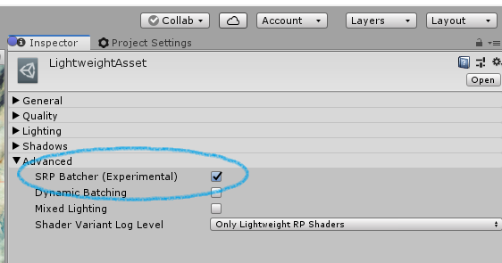](https://blogs.unity3d.com/wp-content/uploads/2019/02/image11-1.png)
 If you want to enable/disable SRP Batcher at runtime, to benchmark  performance benefits, you can also toggle this global variable using C#  code:

GraphicsSettings.useScriptableRenderPipelineBatching = true;

| 1    | GraphicsSettings.useScriptableRenderPipelineBatching = true; |
| ---- | ------------------------------------------------------------ |
|      |                                                              |

## SRP Batcher compatibility

For an object to be rendered through the SRP Batcher code path, there are two requirements:

1. The object must be in a mesh. It cannot be a particle or a skinned mesh.
2. You must use a Shader that is compatible with the SRP Batcher. All Lit and Unlit Shaders in HDRP and LWRP fit this requirement.

For a Shader to be compatible with SRP:

- All built-in engine properties must be declared in a single CBUFFER  named “UnityPerDraw”. For example, unity_ObjectToWorld, or unity_SHAr.
- All Material properties must be declared in a single CBUFFER named “UnityPerMaterial”.

You can see the compatibility status of a Shader in the Inspector  panel. This compatibility section is only displayed if your Project is  SRP based.

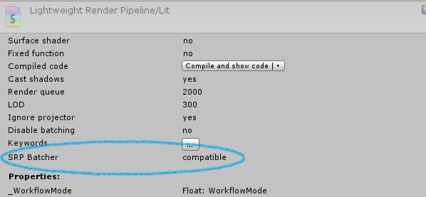

In any given Scene, some objects are  SRP Batcher compatible, some are not. But the Scene is still rendered  properly. Compatible objects will use SRP Batcher code path, and others  still use the standard SRP code path. 
 [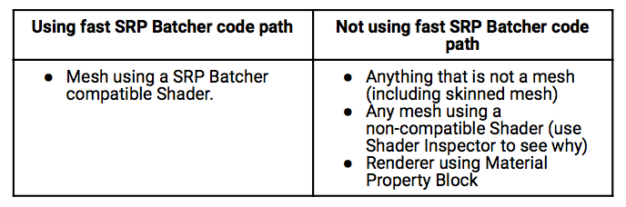](https://blogs.unity3d.com/wp-content/uploads/2019/02/Screen-Shot-2019-02-27-at-3.47.54-PM.png)

## The Art of profiling

### SRPBatcherProfiler.cs

If you want to measure the speed increase with SRP Batcher in your  specific Scene, you could use the SRPBatcherProfiler.cs C# script. Just  add the script in your Scene. When this script is running, you can  toggle the overlay display using F8 key. You can also turn SRP Batcher  ON and OFF during play using F9 key. If you enable the overlay in PLAY  mode (F8) you should see a lot of useful information:

[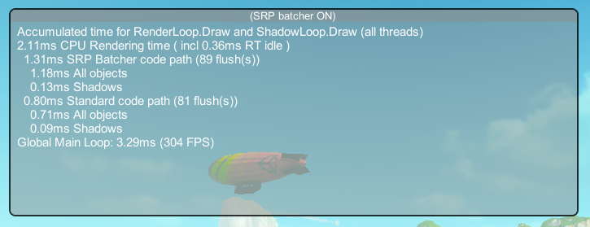](https://blogs.unity3d.com/wp-content/uploads/2019/02/image4-4.png)

Here, all time is measured in milliseconds (ms). Those time measurements show the CPU spent in Unity SRP rendering loops.

*NOTE: timing means* cumulated *time of all “RenderLoop.Draw” and “Shadows*.Draw*”  markers called during a frame, whatever the thread owner. When you see  “1.31ms SRP Batcher code path”, maybe 0.31ms is spent on* main *thread, and 1ms is* spread *over all of the* graphic *jobs.*

### Overlay information

In this table, you can see a description of each setting in the Overlay visible in PLAY mode, from top to bottom:

**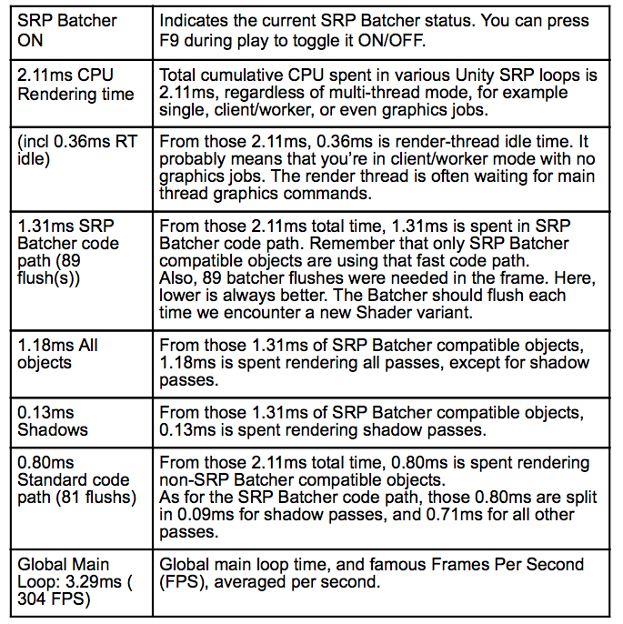**

*NOTE: We hesitate to add FPS at the bottom of the overlay because  you should be very careful about FPS metrics when optimizing. First,  FPS is not linear, so seeing FPS increase by 20% didn’t tell you  immediately how much you optimized your scene. Second, FPS is global  over the frame. FPS (or global frame timing) depends on many other  things than rendering, like C# gameplay, Physics, Culling, etc.*

You can get SRPBatcherProfiler.cs from a [SRP Batcher project template on GitHub](https://github.com/Unity-Technologies/SRPBatcherBenchmark.git).

## Various scenes benchmark

Here are some Unity scenes shots with SRP Batcher OFF and ON to see the speed up in various situations.

[Book of the Dead](https://unity3d.com/book-of-the-dead),  HDRP, PlayStation 4. x1.47 speed up. Please note that FPS doesn’t  change, because this scene is GPU bound. You get 12ms left to do other  things on the CPU side. Speed up is almost the same on PC.

[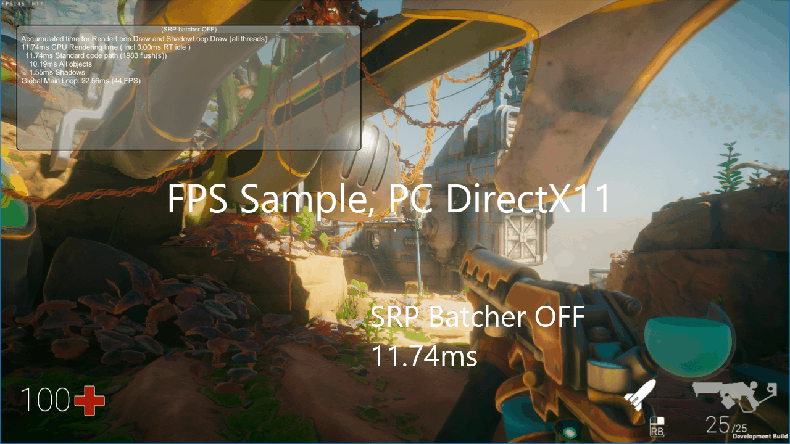](https://blogs.unity3d.com/wp-content/uploads/2019/02/image2.gif)

[FPS Sample](https://unity.com/fps-sample),  HDRP, PC DirectX 11. X1.23 speed up. Please note there is still 1.67ms  going to the standard code path because of SRP Batcher incompatibility.  In this case, skinned meshes and a few particles rendered using Material  Property Blocks.

[Boat Attack](https://github.com/Verasl/BoatAttack), LWRP, PlayStation 4. Speed up x2.13.

## Supported Platforms

SRP Batcher is working on almost all platforms. Here is a table  showing platform and minimal Unity version required. Unity 2019.2 is  currently in [open alpha](https://unity3d.com/unity/alpha/2019.2.0a4).

[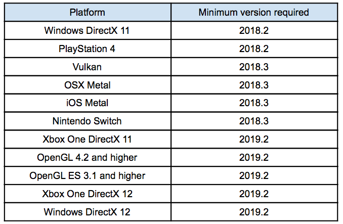](https://blogs.unity3d.com/wp-content/uploads/2019/02/Screen-Shot-2019-02-27-at-3.48.40-PM.png)

## Some words about VR

SRP Batcher fast code path is  supported in VR, only with “SinglePassInstanced” mode. Enabling VR won’t  add any CPU time ( thanks to SinglePassInstanced mode )

## Common questions

**How do I know I’m using SRP Batcher the best way possible?**

Use SRPBatcherProfiler.cs, and first  check that SRP Batcher is ON. Then, look at “Standard code path” timing.  This should be close to 0, and all timing should be spent in “SRP  Batcher code path”. Sometimes, it’s normal that some time is spent in  the standard code path if your scene is using a few skinned meshes or  particles. Check out our [SRP Batcher Benchmark project on GitHub](https://github.com/Unity-Technologies/SRPBatcherBenchmark.git).

**SRPBatcherProfiler shows similar timing regardless of SRP Batcher is ON or OFF. Why?**

First, you should check that almost  all rendering time goes through the new code path (see above). If it  does, and the numbers are still similar, then look at the “flush”  number. This “flush” number should decrease a lot when the SRP Batcher  is ON. As a rule of thumb, divided by 10 is really nice, by 2 is almost  good. If the flush count does not decrease a lot, it means you still  have a lot of Shader variants. Try to reduce the number of Shader  variants. If you did a lot of different Shaders, try to make a “uber”  one with more parameters. Having tons of different material parameters  is then free.

**Global FPS didn’t change when I enabled the SRP Batcher. Why?**

Check the two questions above. If  SRPBatcherProfiler shows that “CPU Rendering time” is twice as fast, and  the FPS did not change, then the CPU rendering part is not your  bottleneck. It does not mean you’re not CPU bound – instead, maybe  you’re using too much C# gameplay or too many physics elements. Anyway,  if “CPU Rendering time” is twice as fast, it’s still positive. You  probably noticed on the top video that even with 3.5x speedup, the  scene is still at 60FPS. That’s because we have VSYNC turned ON. SRP  Batcher really saved 6.8ms on the CPU side. Those milliseconds could be  used for another task. It can also just save some battery life on  mobile.

## How to check SRP Batcher efficiency

It’s important to understand what is a  “batch” in SRP Batcher context. Traditionally, people tend to reduce  the number of DrawCall to optimize the CPU rendering cost. The real  reason for that is the engine has to set up a lot of things before  issuing the draw. And the real CPU cost comes from that setup, not from  the GPU DrawCall itself (that is just some bytes to push in the GPU  command buffer). SRP Batcher doesn’t reduce the number of DrawCalls. It  just reduces the GPU setup cost between DrawCalls.

You can see that on the following workflow:

[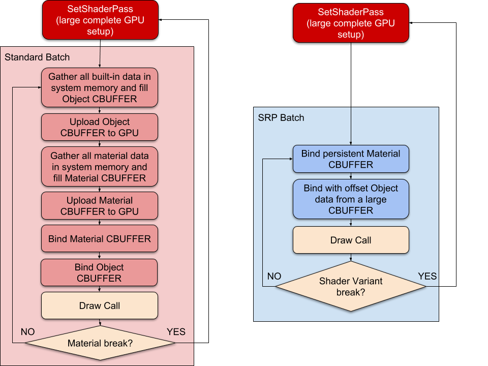](https://blogs.unity3d.com/wp-content/uploads/2019/02/image3-5.png)

On the left is the standard SRP rendering loop. On the right is the  SRP Batcher loop. In SRP Batcher context, a “batch” is just a sequence  of “Bind”, “Draw”, “Bind”, Draw”… GPU commands.

In standard SRP, the slow SetShaderPass is called for each new  material. In SRP Batcher context, the SetShaderPass is called for each  new shader variant.

To get maximum performance, you need to keep those batches as large  as possible. So you need to avoid any shader variant change, but you can  use any number of different Materials if they’re using the same shader.

You can use Unity Frame Debugger to look at the SRP Batcher “batches”  length. Each batch is an event in frame debugger called “SRP Batch”, as  you can see here:

[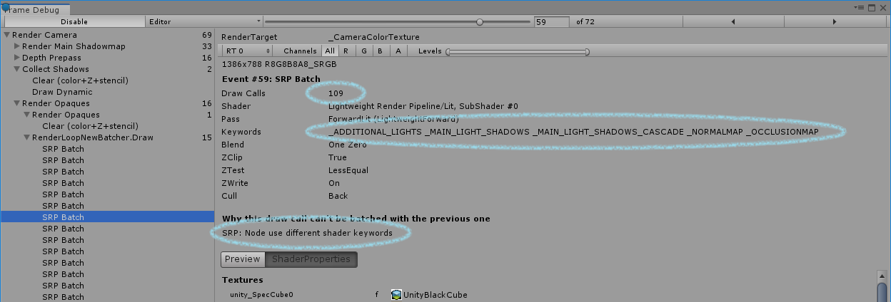](https://blogs.unity3d.com/wp-content/uploads/2019/02/image10-1.png)

See the SRP Batch event on the left.  See also the size of the batch, which is the number of Draw Calls (109  here). That’s a pretty efficient batch. You also see the reason why the  previous batch had been broken (“Node use different shader keywords”).  It means the shader keywords used for that batch are different than the  keywords in the previous batch. It means that the shader variant has  changed, and we have to break the batch.

In some scenes, some batch size could be really low, like this one:

[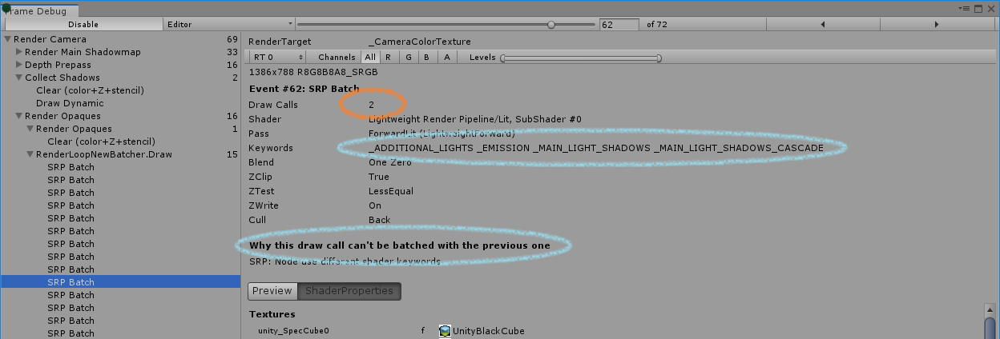](https://blogs.unity3d.com/wp-content/uploads/2019/02/image12-1.png)

Batch size is only 2. It probably  means you have too many different shader variants. If you’re creating  your own SRP, try to write generic “uber” shader with minimum keywords.  You don’t have to worry about how many material parameters you put in  the “property” section.

*NOTE: SRP Batcher information in Frame Debugger requires Unity 2018.3 or higher.*

## Write your own SRP with compatible shader

*Note: This section is made for  advanced users writing their own Scriptable Render Loop and shader  library. LWRP or HDRP users can skip this section, as all shaders we  provide are already SRP Batcher compatible.*

If you’re writing your own render loop, your shaders have to follow some rules in order to go through the SRP Batcher code path.

### “Per Material” variables

First, all “per material” data should  be declared in a single CBUFFER named “UnityPerMaterial”. What is “per  material” data? Typically all variables you declared in the “shader  property” section. That is all variables that your artist can tweak  using the material GUI inspector. For instance, let’s look at a simple  shader like:

Properties  {  _Color1 ("Color 1", Color) = (1,1,1,1)  _Color2 ("Color 2", Color) = (1,1,1,1)  }  float4 _Color1;  float4 _Color2;

| 12345678910111213 | Properties { _Color1 ("Color 1", Color) = (1,1,1,1) _Color2 ("Color 2", Color) = (1,1,1,1) } float4 _Color1; float4 _Color2; |
| ----------------- | ------------------------------------------------------------ |
|                   |                                                              |

If you compile this shader, the shader inspector panel will show you:

[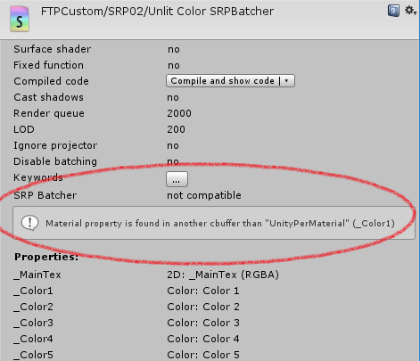](https://blogs.unity3d.com/wp-content/uploads/2019/02/image1-5.png)

To fix that, just declare all your “per material” data like that:

CBUFFER_START(UnityPerMaterial)  float4 _Color1;  float4 _Color2;  CBUFFER_END

| 1234567 | CBUFFER_START(UnityPerMaterial) float4 _Color1; float4 _Color2; CBUFFER_END |
| ------- | ------------------------------------------------------------ |
|         |                                                              |

### “Per Object” variables

SRP Batcher also needs a very special  CBUFFER named “UnityPerDraw”. This CBUFFER should contain all Unity  built-in engine variables. 

The variable declaration order inside  of “UnityPerDraw” CBUFFER is also important. All variables should  respect some layout we call “Block Feature”. For instance, the “Space  Position block feature” should contain all those variables, in that  order:

float4x4 unity_ObjectToWorld;  float4x4 unity_WorldToObject;  float4 unity_LODFade;  float4 unity_WorldTransformParams;

| 1234567 | float4x4 unity_ObjectToWorld; float4x4 unity_WorldToObject; float4 unity_LODFade; float4 unity_WorldTransformParams; |
| ------- | ------------------------------------------------------------ |
|         |                                                              |

You don’t have to declare some of these block features if you don’t  need them. All built-in engine variables in “UnityPerDraw” should be  float4 or float4x4. On mobile, people may want to use real4 ( 16 bits  encoded floating point value) to save some GPU bandwidth. Not all  UnityPerDraw variables could use “real4”. Please refer to the “Could be  real4” column.

Here is a table describing all possible block features you could use in the “UnityPerDraw” CBUFFER:

*NOTE: If one of the variables of  one feature block is declared as real4 ( half ), then all other  potential variables of that feature block should also be declared as  real4.*

*HINT 1: always check the  compatibility status of a new shader in the inspector. We check several  potential errors ( UnityPerDraw layout declaration, etc ) and display  why it’s not compatible.*

*HINT 2: When writing your own SRP  shader you can refer to LWRP or HDRP package to look at their  UnityPerDraw CBUFFER declaration for inspiration.*

## Future

We still continue to improve SRP  Batcher by increasing batch size in some rendering passes (especially  Shadow and Depth passes). 

We’re also working on adding automatic GPU instancing usage with SRP Batcher. We started with new [DOTS](https://blogs.unity3d.com/2019/02/26/on-dots-c-c/) renderer used in our [MegaCity demo](https://www.youtube.com/watch?v=j4rWfPyf-hk). The speedup in the Unity editor is quite impressive, going from 10 to 50 FPS.

Video Player

<video class="wp-video-shortcode" id="video-79646-1_html5" loop="1" autoplay="1" preload="metadata" style="width: 639.667px; height: 359.813px;" src="https://blogs.unity3d.com/wp-content/uploads/2019/02/SRP_Batcher_Megacity_Editor_FPS_720p.mp4?_=1" width="1280" height="720"></video>

00:00

00:17

MegaCity  in-editor with SRP Batcher & DOTS renderer. The difference in  performance is so huge that even global frame rate speeds up by a factor  of five. 

*NOTE: To be precise, this massive  speedup when enabling the SRP Batcher is editor only, due to editor  currently not using Graphics Jobs. Speedup in Standalone player mode is  something like x2.*

Video Player

<video class="wp-video-shortcode" id="video-79646-2_html5" loop="1" autoplay="1" preload="metadata" style="width: 639.667px; height: 359.813px;" src="https://blogs.unity3d.com/wp-content/uploads/2019/02/SRP_Batcher_Megacity_Editor_Smooth_720p.mp4?_=2" width="1280" height="720"></video>

00:00

00:20

MegaCity in Editor. If you could play the video at 60hz you would feel the speed up when enabling SRP Batcher.
 

*NOTE: SRP Batcher with DOTS renderer is still experimental and in active development.*