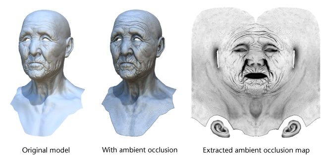
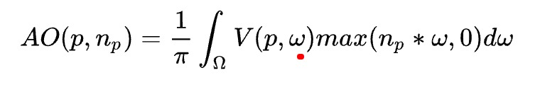
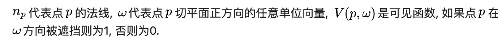
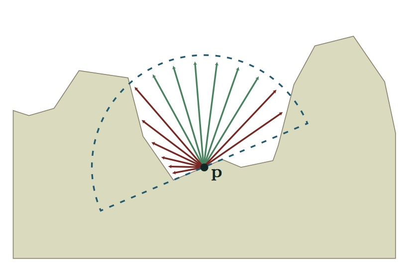
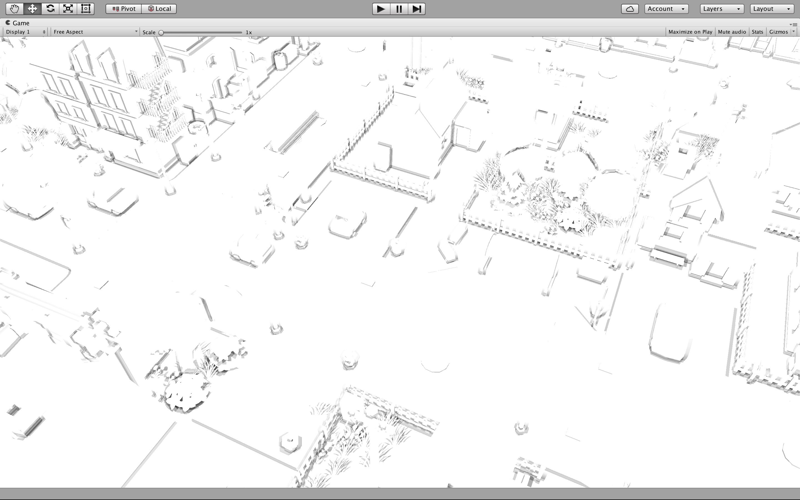
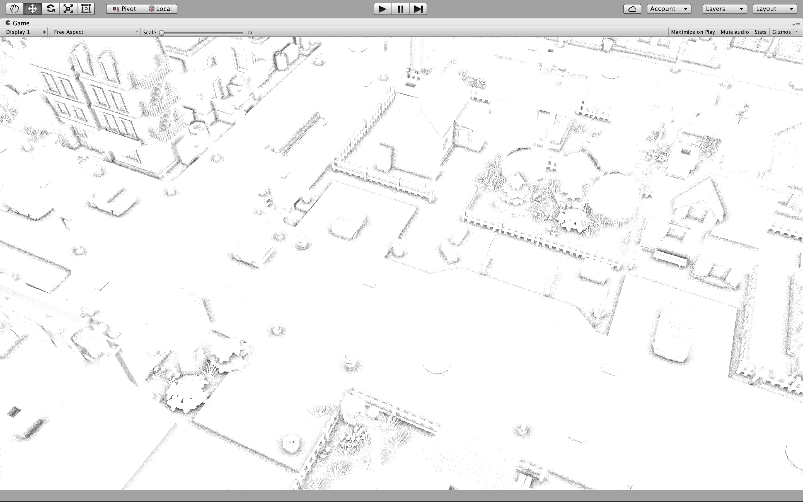
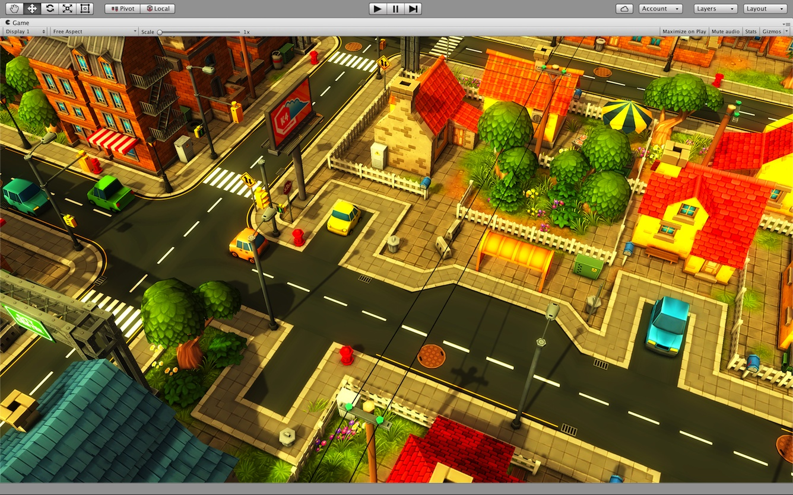
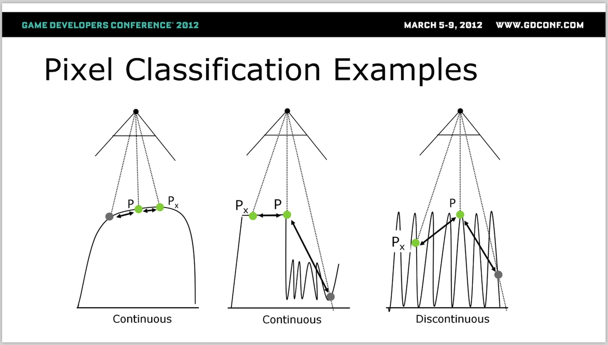
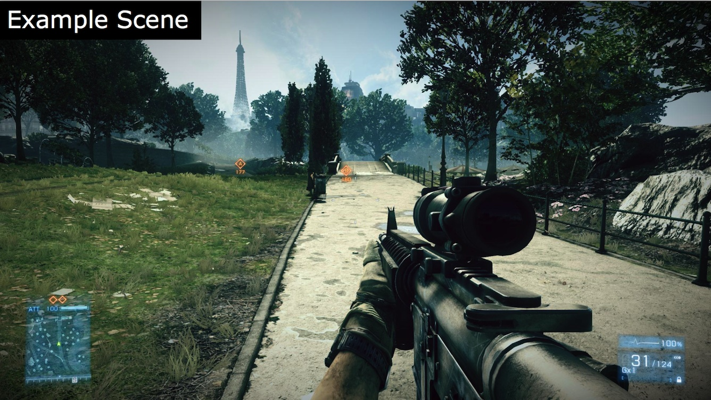
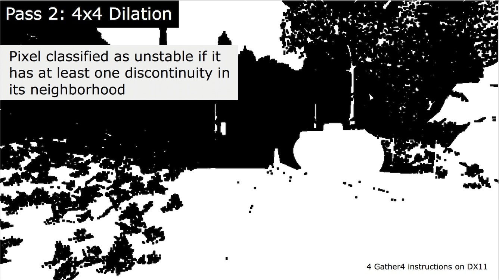

已剪辑自: https://zhuanlan.zhihu.com/p/25038820

## 写在前面

专栏断更了这么久, 实在惭愧. 这段时间又是期末考试又是回家过节, 实在是没时间整理干货来分享. 之前说好的不及时更新就赔钱, @Cathy Chen童鞋已经拿到10大洋的红包了.

不过从今天开始我就有大把的时间来继续研究图形学啦, 因此会保证更新速度的 ~

延续了我对Depth Buffer的一贯兴趣, 本文将介绍**SSAO**的基本原理及包括**Temporal Coherence SSAO, Selective Temporal Filtering SSAO**在内的优化算法.


## 何为"SSAO"

Screen Space Ambient Occlusion (以下简称SSAO), 屏幕空间环境光遮蔽. 在具体介绍SSAO之前, 本文先介绍更加广义的Ambient Occlusion (AO).

简单来说, Ambient Occlusion(以下简称"AO")是一种基于全局照明中的环境光(Ambient Light)参数和环境几何信息来计算场景中任何一点的**光照强度系数**的算法. AO描述了表面上的任何一点所接受到的环境光被周围几何体所遮蔽的百分比, 因此使得渲染的结果更加富有层次感, 对比度更高.




图片来自Wiki. 因为老人的皱纹处对外界暴露的部分较少, 使用AO后被遮蔽的部分较多, 渲染后显得更加暗一些, 增加了皱纹的层次感和质感.

AO的计算公式如下:





由此可见, 计算AO系数是一个颇为昂贵的操作. 一般离线渲染器都会采用Ray-Tracing(光线追踪)或是简化的Ray-Marching(所谓光线行进)算法, 模拟若干条射线以计算遮蔽百分比. 很明显这种方式不可能应用到实时图形渲染中. 尽管目前有一些实时计算AO的新技术, 但是其性能距离普及还有很长的路要走.




上图为基于Ray-Tracing的AO计算模型. 红色的射线表示V = 1, 绿色的射线表示V = 0.


那么我们能否**Trade Off**, 用差一点的渲染结果来获得更高的运行效率呢? 答案是肯定的, 而且方法还远不止一种. 本文将重点放在SSAO上.

顾名思义, "Screen Space"意味着SSAO并不是场景的预处理, 而是屏幕后期处理. 其原理是在片元着色器中对于屏幕上的每个像素模拟若干个位置随机的采样点, 用被遮蔽的采样点数量百分比来**近似**表示光照强度系数.


## SSAO的实现

SSAO的实现可分为三个步骤: 计算AO, 模糊/滤波, 与Color Buffer混合.

**1. 计算AO**

计算AO的核心问题在于**如何取采样点**并判断**这些采样点是否被遮蔽**. 我们首先解决第一个问题. 在此我们使用一种指向法线方向的半球形采样块(Sample Kernel), 并在采样块中生成采样点. **距离原点越远的点, AO贡献越小**. 采样块如下图所示:


那么我们转入第二个问题: 如何判断下图中的采样点遮蔽情况呢?


(涂黑的点处在几何体表面内部, 因此判定为被遮蔽)


一种方法是将采样点全部投影到View Plane上, 相当于获取采样点的UV坐标, 并同时获取Depth Buffer中该UV坐标处的深度值. 随后比较采样点的深度和场景中该点的深度. 如果采样点的深度更大, 说明其被场景遮蔽. 最终将所有采样点的AO贡献求和, 即是该点的AO值. 计算公式如下:


其中, 函数V前面已经介绍过. 函数D是一个[0, 1]之间的单调递减函数, 距离原点越近的采样点对AO的贡献越大. 一般使用指数函数.


上图为原图




上图为求得的AO值. 颜色越深代表AO越大.


以下是循环采样部分代码(ii为循环变量):

```
half3 randomDirection = RandomSample[ ii ];
float2 uv_offset = randomDirection.xy * scale;

float randomDepth = depth - ( randomDirection.z * _Radius );

float sampleDepth;
float3 sampleNormal;

DecodeDepthNormal ( tex2D ( _CameraDepthNormalsTexture, i.uv + uv_offset ), sampleDepth, sampleNormal );

sampleDepth *= _ProjectionParams.z;

float diff =  saturate( randomDepth - sampleDepth );
if ( diff > _ZDiff )
	occlusionAmount += pow (1 - diff, _Attenuation);
```

到此我们发现了一个问题: 上面求得的AO结果非常不理想. 图中有非常明显的条带状阴影, 给人的感觉像是在图上轻轻地抹了一层均匀的***油漆\***. 产生这种现象的原因很简单 - **为了满足实时渲染的性能要求, 我们必须限制采样点的数目.**

但是, 对于这种现象我们有一个Trick ---- 可以引入**噪声**, 将每个采样点以原点法线方向为旋转轴旋转随机的角度. 这样的新采样点会变得极其不规则, 更加离散化. **将低频的条纹转化成高频的噪声.**

```
half3 randomVector = tex2D ( _RandomTexture, i.uv_random ).xyz * 2.0 - 1.0;
half3 randomDirection = reflect ( RandomSample[ ii ], randomVector );
```




上图为引入随机噪声后的采样结果. 我们发现"油漆"变成了"***沙子\***".


**2. 模糊/滤波**

*"油漆"好还是"沙子"好?*

*都不好!*

"油漆"显得平淡无奇, "沙子"让人眼花缭乱. 中国人讲究中庸之道, 也就是说 ---- **我们需要一个"中频"的AO!**

在此介绍两种方法. 第一种方法是直接模糊. 比较常用的是高斯模糊. 关于高斯模糊的资料有很多, 本文不再赘述.

第二种方法在采样原理上和高斯模糊别无二致, 只是采样系数由静态变为动态: 原点与采样点的UV坐标距离, 法线和深度关系共同决定采样系数, 距离越远采样系数越小, 法线和深度的差距越大则采样系数也越大. 这样的模糊使得结果更加趋近于中频, 进一步减弱了闪烁(Flickering)的效果.


\3. 与Color Buffer混合.

一般加入Gamma Correction使得阴影更有层次感, 即最终结果为:

```
tex2D ( _MainTex, i.uv ) * pow ( ( 1 - occlusion ), 2.2 );
```



上图为SSAO处理后的最终结果.


## SSAO的问题与优化策略

SSAO技术的基本原理已经介绍完了, 下面我们来谈谈SSAO可能遇到的问题, 以及相应的解决方案:

**1. 采样块的问题**

上文的SSAO实现方案其实是假定了使用Deferred Rendering, 深度和法线都可以非常容易得获取到, 因此我们的半球形采样块可以沿着顶点的法线方向摆放. 但是如果获取法线比较困难, 我们可以将半球形退化成球形, 这也正是2007年*Crysis*中SSAO的实现方案.


如上图所示, 采样块的摆放与法线无关, 采样点遍布整个球形中. 这种方法的效果自然不如半球形采样块.


**2. 重复计算的问题**

SSAO最为耗时的操作是模拟多个采样点并计算其AO贡献值, 因此我们应该想办法避免重复计算, 尽量使用以前的结果. 这里可以使用**Reverse Reprojection**(反向二次投影), 保存上一帧的AO计算信息, 使得当前帧中相对上一帧没有变化的点可以利用旧的AO信息, 避免重复计算. 这种方式称为SSAO with Temporal Coherence(**时间相干性**), 简称为**TSSAO**. 具体的实现方式将在下文中进行阐述.


**3. 滤波与精确计算之间的矛盾**

这也是一个Trade Off ---- 反正运算结果都是要套用滤波来过滤掉噪点, 那么最开始计算的时候就可以想办法在保证质量不受太大影响的前提下, 尽量提升效率. 举一个例子:

假设有两个面饼师傅, 第一个师傅的工作是揉出来5个直径为1.2cm的面球, 第二个师傅的工作是把这5个面球放在一起拍成一个面饼.

我们不讨论这种工作方式是否合理, 只是在此情况下第一个师傅确实不用对1.2cm吹毛求疵, 只要差不多就行了.

明白了这个道理, 就会发现可以在计算AO的时候使用**降采样**, 这样能成平方倍地降低SSAO的时间复杂度. 关于降采样网上有很多资料, 我的专栏[第一篇文章](https://zhuanlan.zhihu.com/p/23950559?refer=MeowShader)也对此有过介绍.


## TSSAO

**1. Reverse Reprojection**

交替使用两张Render Texture, 一张代表当前帧, 另一张代表上一帧. 对于当前帧上任何一个Pixel都可以根据其UV坐标重建其世界坐标, 然后根据上一帧的View-Projection矩阵的逆矩阵来转化成上一帧的相应UV坐标. 如果两帧上对应的Pixel的Depth与世界坐标差距不大, 那么当前帧就可以利用上一帧对应Pixel的信息, 免去重复计算.

对于静态场景我们有如下公式:

![[公式]](https://www.zhihu.com/equation?tex=t_%7Bold_%7Bx%5E%7B%27%7D%2C+y%5E%7B%27%7D%2C+z%5E%7B%27%7D+%7D+%7D+%3D+P_%7Bold%7DV_%7Bold%7DV_%7Bnew%7D%5E%7B-1%7D+P_%7Bnew%7D%5E%7B-1%7D+t_%7Bnew_%7Bx%2C+y%2C+z+%7D+%7D)

t表示NDC坐标, P表示Projection矩阵, V表示View矩阵.

```
inline float4 UV2WorldPos(float2 uv, float4x4 iv)
{
	float depth = SAMPLE_DEPTH_TEXTURE(_CameraDepthTexture, uv);	
	float2 invClipSize = float2(_CurP._11, _CurP._22);
	float2 spos = (uv * 2 - 1) / invClipSize;
	float depthEye = LinearEyeDepth(depth);	
    float3 vpos = float3(spos, -1) * depthEye;
	return mul(iv, float4(vpos, 1.0));
}

inline float2 WorldPos2UV(float4 worldPos, float4x4 vp)
{
	float4 vpos = mul(vp, worldPos);
	float2 projOffset = float2(_CurP._13, _CurP._23);
	float2 screenPos = vpos.xy / vpos.w + projOffset;
	return 0.5 * screenPos + 0.5;
}

inline float2 GetMotionVector(float2 uv)
{
	float4 worldPos = UV2WorldPos(uv, _CurIV);
	float2 curUv = WorldPos2UV(worldPos, _CurVP);
	float2 preUv = WorldPos2UV(worldPos, _PrevVP);
	return  curUv - preUv;
}
```


但是对于动态场景上述公式不再成立. 因为SSAO要做到Scene Independent, 同时还必须记录前后两帧的关联, 因此在此我们可以用一个Render Texture单独记录每个像素在前一帧与当前帧的世界坐标的差. 具体的原因详见下文.


**2. 新的AO计算公式**

在TSSAO中我们使用两个Render Texture分别作为上一帧和当前帧的AO Buffer. 首先计算当前帧的AO贡献值:

![[公式]](SSAO_Info.assets/equation-20200520012043225)

![[公式]](SSAO_Info.assets/equation-20200520012043309)表示的是之前已经计算过的采样点数量, k表示每一帧应该计算的采样点数量.

随后, 利用当前帧和上一帧的AO贡献值共同计算当前帧的AO值:

![[公式]](SSAO_Info.assets/equation-20200520012043291)

最后, 更新![[公式]](https://www.zhihu.com/equation?tex=n_%7Bt%7D%28p%29)的值:

![[公式]](SSAO_Info.assets/equation-20200520012043312)

在此说明一下为什么要设置n的上限. 这里主要有两个原因, 第一是如果之前的计算结果不老化, 当前帧的AO贡献值会越来越小, 算法的反应会越来越慢. 第二是反向二次投影本身是有误差的, 随着投影次数的增加误差会变得非常大, 因此必须限制被使用的结果数量, 适当舍弃掉过老的数据.


**3. 检测不合法像素**

很容易想到的一个判定条件是深度检测: 如果新旧两个像素的深度差距过大, 那么说明场景 已经改变, 当前像素的AO值已经不正确, 必须全部舍弃. 相对深度关系检测条件如下:

![[公式]](SSAO_Info.assets/equation-20200520012043334)

但是, SSAO考虑的不仅仅是当前点, 还有它周边的**环境**. 举一个例子: 在一个静态的地面上放置着一个动态的立方体. 这个立方体随着时间不规则运动. 地面与立方体地面棱边的外交界处的AO值自然明显高出地面上其他点的值, 但是立方体的移动会使得地面上相应区域的AO值不再有效 ---- 虽然地面没有在动, 地面上的点能够通过深度关系检测.


这里我们用到了另一个Trick ---- 我们在计算当前帧AO的循环中可以同时做出以下判定:

![[公式]](SSAO_Info.assets/equation-20200520012043334-9908843.)

只要有一个采样点不满足上述条件, 则说明其对应原点的周边环境已经发生改变, 其AO值自然也应该重新计算. 对于![[公式]](SSAO_Info.assets/equation-20200520012043375)的计算方法也很简单: 根据![[公式]](SSAO_Info.assets/equation-20200520012043395)和在第一步中记录的世界坐标的差就可以直接得出了.

只要像素被判定为不合法, 则其![[公式]](https://www.zhihu.com/equation?tex=n_%7Bt%7D%28p%29)会被重置为0, 即之前的所有AO运算结果全部舍弃.

```
int ww = w;

if ( abs ( 1 - texelDepth / preDepth ) >= EPS )
	ww = 0;

float scale = _Parameters.x / depth;

for ( int ii = 0; ii < _SampleCount; ii++ )
{
	float3 randomDirection = RAND_SAMPLES [ w + ii ];
	randomDirection *= -sign ( dot ( texelNormal, randomDirection ) );
	randomDirection += texelNormal * 0.3;

	float2 uv_offset = randomDirection.xy * scale;

	float randomDepth = texelDepth - randomDirection.z * _Parameters.x;

	float sampleDepth;
	float3 sampleNormal;

	GetDepthNormal ( i.uv + uv_offset, sampleDepth, sampleNormal );

	sampleDepth *= _ProjectionParams.z;

	float diff = randomDepth - sampleDepth;

	if ( diff > _Parameters.y )
		occlusion += saturate ( cos ( dot ( randomDirection, texelNormal ) ) ) * pow ( 1 - diff, _Parameters.z );

	if ( abs ( randomDirection - abs ( randomDirection + GetMotionVector ( i.uv + uv_offset ) - GetMotionVector ( i.uv ) - texelPosition ) ) >= EPS )
}
```


**4. 滤波**

可以在SSAO的滤波基础上加上收敛度的条件. 收敛度定义为:

![[公式]](SSAO_Info.assets/equation-20200520012043418)

收敛度越大, 说明当前像素越为"安全", 随着时间的改变越小, 因此采样系数也越大.


## Selective Temporal Filtering (STF)

这项技术应用在了BattleField3中. 首先它是基于TSSAO的, 不同的是其AO计算方式: 在当前帧的AO贡献值和历史数据中间做插值.

这样做带来的一个小问题就是"老化" ---- 旧的数据不能及时清理出去, 这就导致场景移动比较快的时候, AO Buffer会存在鬼影的问题.

但是一个更为严重的问题是"闪烁" ---- BattleField3的场景中有大量花草树木, 树叶的晃动使得大量像素被频繁检测为失效, 重新计算AO, 这与未失效的部分构成了鲜明的对比.

DICE的解决方案非常Trick: 他们发现存在鬼影的像素和存在闪烁的像素是互斥的. 因此他们想办法甄别这两种像素, 并对于可能产生鬼影的像素关掉Temporal Filtering. 因此这项技术被称为Selective Temporal Filtering.

具体的方法是检测连续性: 对于任何一个Pixel, 连续在x或y方向选择两个像素, 判断这三个像素的深度是否连续. 如果连续则可能产生鬼影, 否则可能产生闪烁.




最后将所有闪烁的像素按照4x4放大, 圈定进行Temporal Filter的区域:






## 后记

SSAO原理并不复杂, 只是在实际应用场景中会有各种各样的Trick以应对个性化的需要. 文中主要讲解了SSAO的基本原理与TSSAO的优化原理, 并举了BattleField3的STF为例.


## 引用


Nehab, Sander, Lawrence, Tatarchuk, Isidoro. Accelerating Real-Time Shading with Reverse Reprojection Caching. In ACM SIGGRAPH/Eurographics Symposium on Graphics Hardware 2007.


Mattausch, Oliver, Daniel Scherzer, and Michael Wimmer. "High‐Quality Screen‐Space Ambient Occlusion using Temporal Coherence." *Computer Graphics Forum*. Vol. 29. No. 8. Blackwell Publishing Ltd, 2010.


BAVOIL L., SAINZ M.: Multi-layer dual-resolution screen-space ambient occlusion. In SIGGRAPH ’09: SIGGRAPH 2009: Talks (New York, NY, USA, 2009), ACM, pp. 1–1. 3, 7


Screen space ambient occlusion. (2016, December 29). In *Wikipedia, The Free Encyclopedia*. Retrieved 19:24, January 28, 2017, from [Screen space ambient occlusion](https://link.zhihu.com/?target=https%3A//en.wikipedia.org/w/index.php%3Ftitle%3DScreen_space_ambient_occlusion%26oldid%3D757188316)

Bavoil, L., & Sainz, M. (2008). Screen space ambient occlusion. *NVIDIA developer information: [http://developers](https://link.zhihu.com/?target=http%3A//developers). nvidia. com*, *6*.