## [*Unity*_GroundTruth-Oclusion](https://zhuanlan.zhihu.com/p/53097274)

自从学习了Unity以来一些后期特效的缺失是很让人伤心的事情，之前Unity的反射做的一直不好所以自己造了一个SSR去玩，现在呢又感觉PPS的AO效果不是很好随即又开始了新的轮子制造。。那么本期文章的重点就是如题的**GroundTruth-Oclusion(AmbientOcclusion和ReflectionOcclusion)**。

首先呢先介绍一些什么是AmbientOcclusion。在早些年影视动画里很多非现实场景拍摄的内容为了达到逼真的视觉效果往往都会通过光线追踪去计算，比如光的反射 折射 散射等等，这些效果归类统称为全局光照，但是全局光照计算量实在是太大所以后来就延伸出一种近似的方法。这种方法呢假设整个场景都被一个单一颜色的光照明(即AmbientLight)然后在每个位置上去计算光线遮挡情况，遮挡的越多呢这一些地方就会越黑最后就形成了一种非常柔和的阴影细节效果。方法即在每个位置的半球空间内随机取方向去做RayTrace，因为只考虑了遮挡性计算所以速度比全局光照快了非常非常多，再以此为基础去混合IBL便可以高效的近似全局光照的效果(没记错妇联1里面纽约大战基本上都是IBL配AO)。

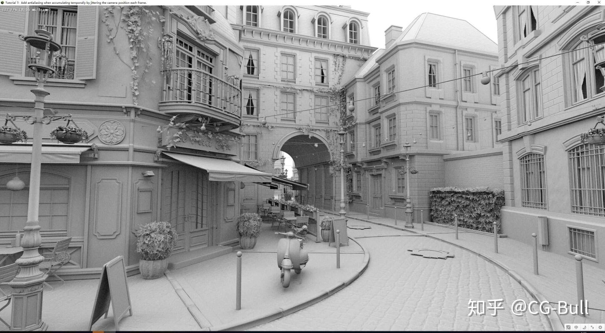NVSampler里DXR渲染的AO效果

既然离线渲染都在全局光照上进行了近似trick，那实时渲染肯定也会很快跟进。但是即便AO的计算大大简化了全局光照计算量但是它本身还是属于光线追踪去做Trace，所以实时渲染里面为了更高效的计算AO于是乎衍生出了屏幕空间的AO计算(SSAO)。SSAO的方法与光线追踪的AO最大的不同在于光线追踪是每个位置去追踪光线，而SSAO则是在每个像素上生产多个随机采样点然后在每个采样点上进行见性计算，并把每个随机点的可见性信息加起来即可以得到遮蔽效果。该方法第一次出现是Crytek在2007年发售的游戏孤岛危机里，当时一出便炒热了实时全局光照。这种方法由于采样点是以采样像素为有限制半径的整个球的空间采样所以很多平面上也会产生出遮蔽效果。

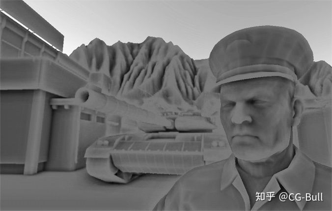可以看到很多平面也产生了错误的遮蔽效果

此后为了解决这种错误的遮蔽又衍生出了很多魔改版本，大部分都把原来的整个球的积分换成了法线为方向的半球的积分，才使得SSAO系列呈现出接近RTAO的效果。比如Scalable Ambient Obscurance，Volumetric obscurance，Line Sweep Ambient Obscurance，Far Field Ambient Obscurance。其中比较著名的一种衍生方法则是来自Nvidia的HBAO。

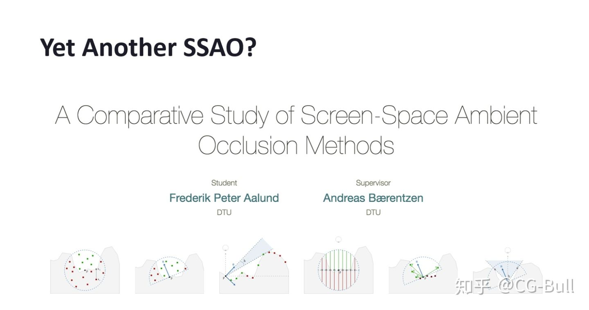第一个整个球积分便是上面说的CrytekSSAO的基本原理图解。

HBAO的计算原理呢则是在半球上以Slice为基础在Depth上进行遮挡计算(可以想象成侧面的半圆)。然后再以此为基础进行一个旋转操作来达到近似半球上的AO遮挡。

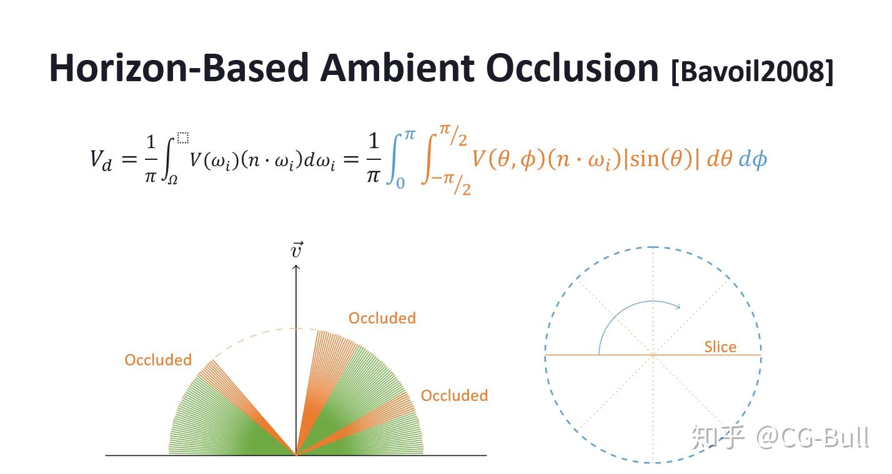

但是这个方法也有一些奇怪的效果比如半分辨率下会闪烁(寒霜为了规避这个问题采样了TemporalSuperSampling去进行抗闪烁)。而**GroundTruth-Oclusion**这个遮蔽模型呢是动视在使命召唤12里面做的一个分享，原理上基于Nvidia的HBAO但是增加了更多的物理精确计算。比如在AO的Visibility项计算上新增了一个Cos Weight使得AO的遮蔽更加真实(GTAO和HBAO唯一的大区别)，又比如用ALU去拟合类似Crytek在罗马之子上用过的AO MultiBounce效果，而且为了解决IBL遮挡问题在AO积分的同时去算一个BentNormal然后用这个BentNormal作为VisibilityCone去和SpecularCone求交得到ReflectionOcclusion。

对比HBAO基本上GTAO就是增加了一个Cosine Weight的操作，如下图的公式。

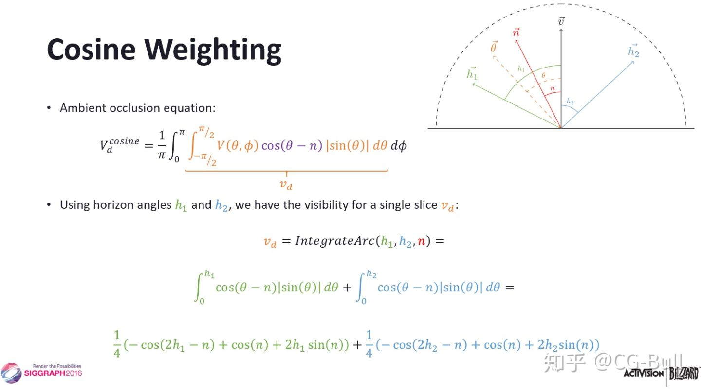

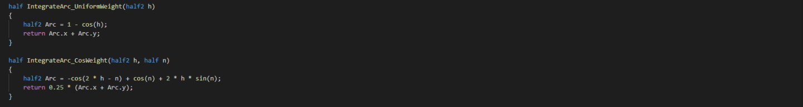

PPT里面直接给好了计算公式写成代码即是这个样子，一个以h(我这里节省计算直接把h1和h2整合成half2的h了)和n作为输入的计算函数。n是Slice上投影的法线。h1和h2则是Slice上采样原点往采样点方向向量在半球Slice上的夹角，因为光会被这个夹角挡住所以很容易利用这两个夹角和n去运算既可以计算出改点的遮挡值。然后这个积分过程只是一个Slice为了逼近半球结果需要再转一圈。

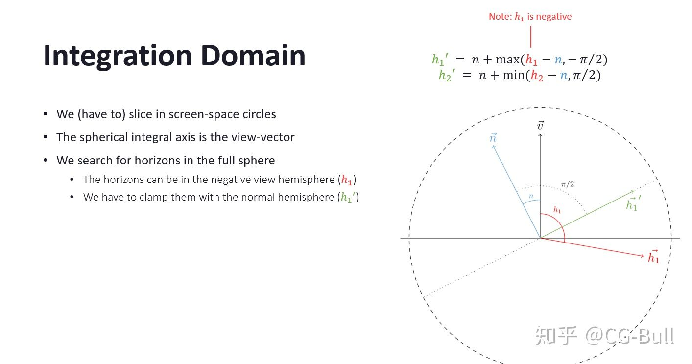h1和h2可能会在负值，需要矫正回半球空间。

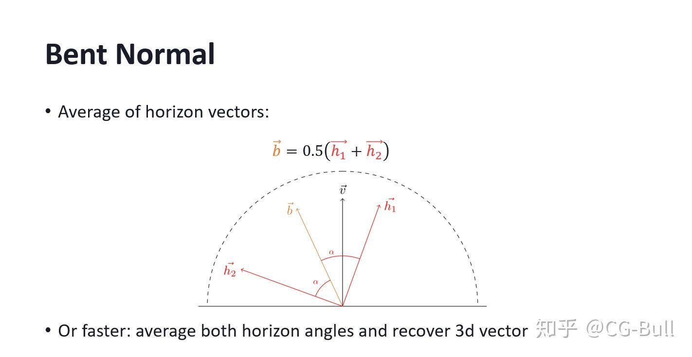利用h1和h2和viewDir构建一个坐标系去推算出BentAngle以重建BentNormal

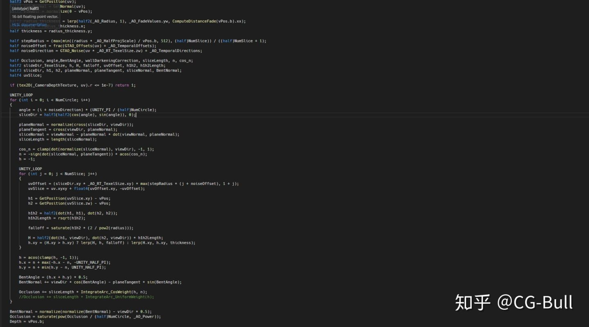

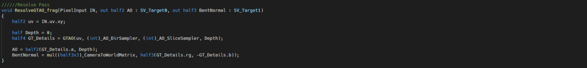这里会吧计算的BentNormal送到一个RT里面去，供其他模块使用。

考虑到SSAO的采样数量的性能限制这里直接将Circle和Slice层面的积分加上了jitter。最后吧AO和BentNormal输出。

4 Circle Sampler，8 Slice Sampler的结果。

可以看到效果还是挺接近RayTrace的，因为在前面事先做好了jitter去模拟高频采样所以可以看到画面上有很多的Noise。那么下面就得去进行去噪。鉴于之前SSR去噪是空间混合Temporal的方法所以这里AO也基本是这个思路。不同于SSR的基于BRDF强度空间过滤，AO则使用基于深度的萝莉模糊(滑稽)也就是Corss Bilateral过滤。这里双边的方法主要来自寒霜2在2011年分享的战地3HBAO的Adaption Bilateral Blur方法。

[https://www.slideshare.net/DICEStudio/stable-ssao-in-battlefield-3-with-selective-temporal-filtering?ref=https://www.ea.com/frostbite/news/stable-ssao-in-battlefield-3-with-selective-temporal-filteringwww.slideshare.net](https://link.zhihu.com/?target=https%3A//www.slideshare.net/DICEStudio/stable-ssao-in-battlefield-3-with-selective-temporal-filtering%3Fref%3Dhttps%3A//www.ea.com/frostbite/news/stable-ssao-in-battlefield-3-with-selective-temporal-filtering)

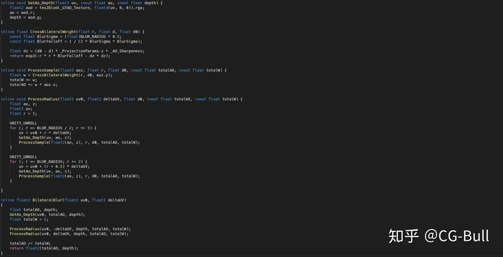

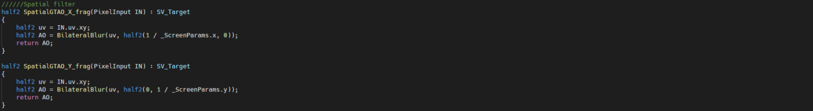

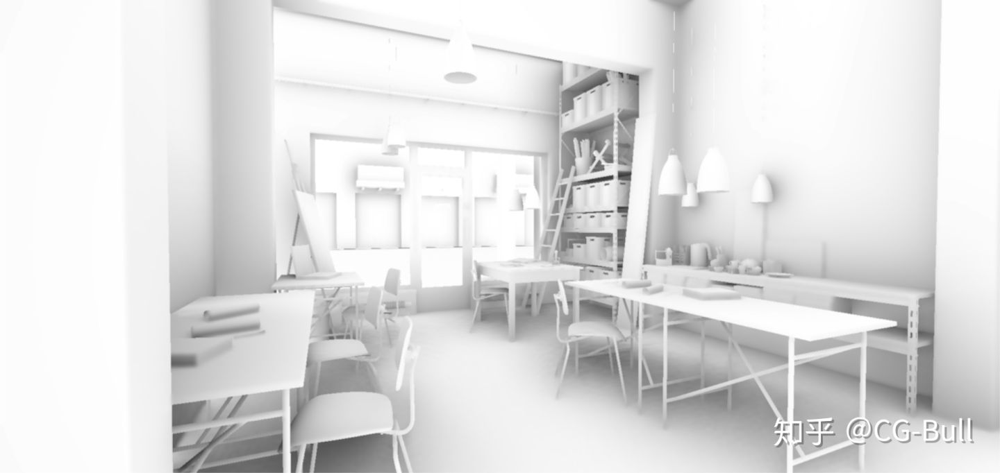

这里范围使用和战地3里Blur的范围一样的8个像素。可以看到经过Spatial过滤后噪点消失了一大半以上(模糊真奥义。。)，但是还有一些瑕疵闪烁的噪点，自古过滤Spatial配Temporal。为了消除这最后的鬼畜最后再加一个Temporal过滤也是不错的。这里直接使用之前SSR里面实现过的Variance Temporal方法。

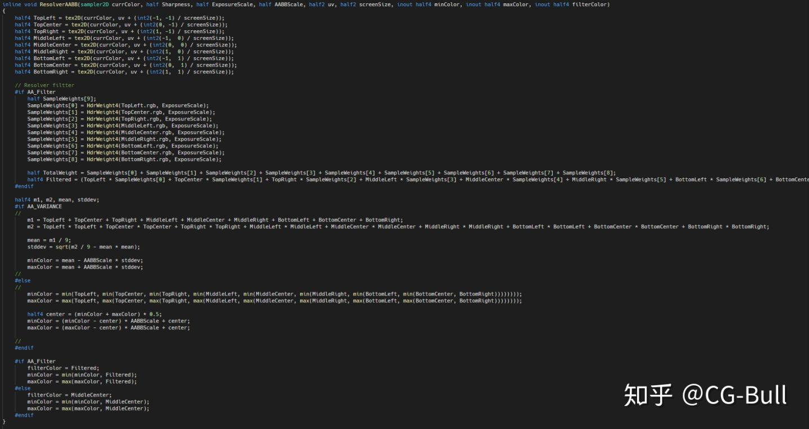

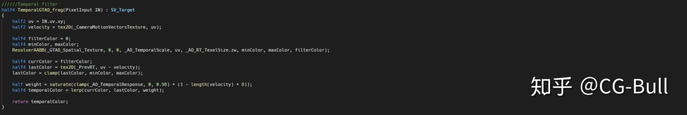为了避免MotionVector的像素点在下一帧被遮挡住，这里进行一个运算去选择深度最小的，距离摄像机最近的像素点作为采样点。

PPT里为了近似一下更全面的全局光照效果还做了一个MultiBounce的操作。我们可以直接和上面的计算混合起来得到结果。

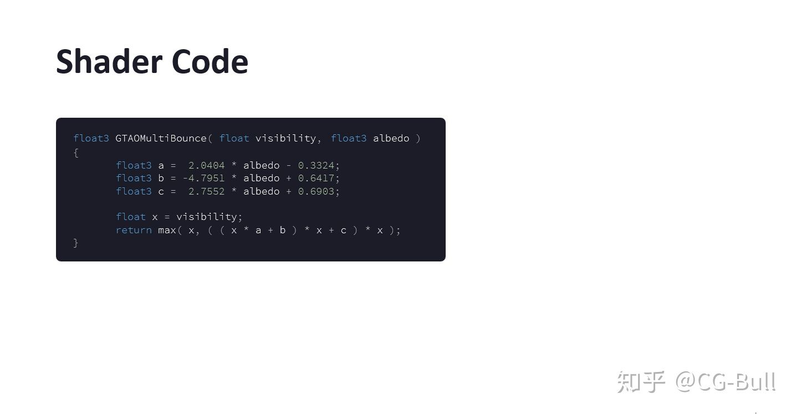

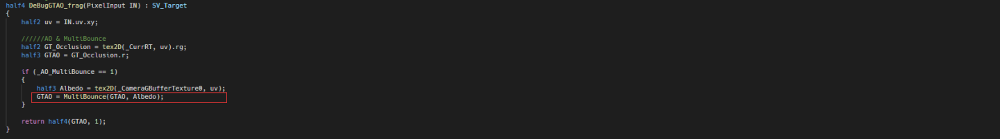

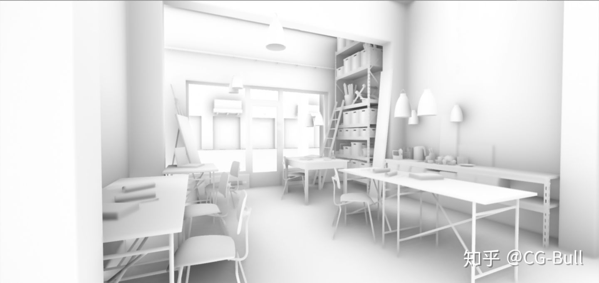无MultiBounce

有MultiBounce

至此AmbientOcclusion系列就完成了。还记得之前算的那个BentNormal吗。因为实时渲染的反射部分大部分都采用的Cubemap去做的视差矫正，虽然有些时候视觉上还行但是场景略微复杂一些就会出现漏光，大部分AO扩展都直接吧AO去乘以了反射颜色去压低那种漏光，但是我们自己玩肯定要与时俱进一些。这里使用的方法是ConeCone求交算ReflectionOcclusion。原PPT里面有三种方法(ConeCone，ConeLobe，4DLUT)仔细对比三个方法其实差距不是很大，为了便捷就直接使用了ConeCone的方法。既拿BentNromal当OcclusionCone然后拿ReflectionCone去求交，两个Cone的交点面积越大RO越强，AO越弱。

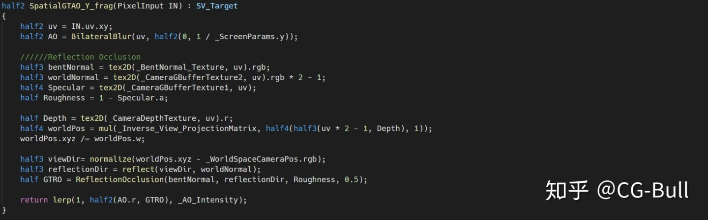这里为了给RO去噪就直接放在双边的YBlur里一起输出给后面的TemporalPass进行去噪操作。

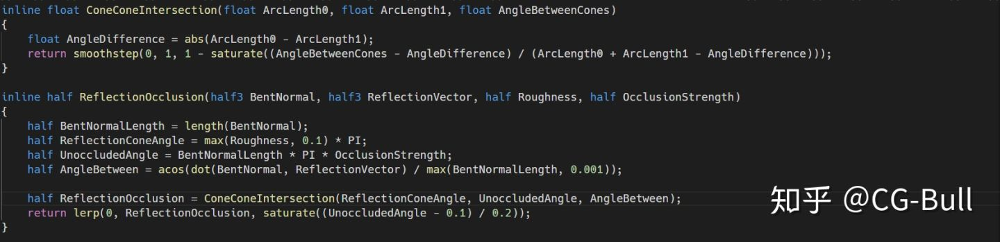

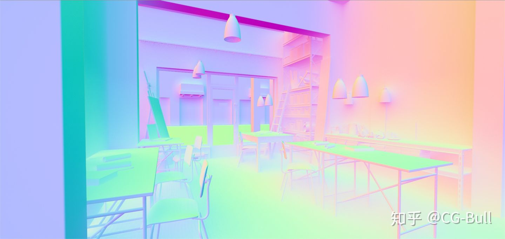

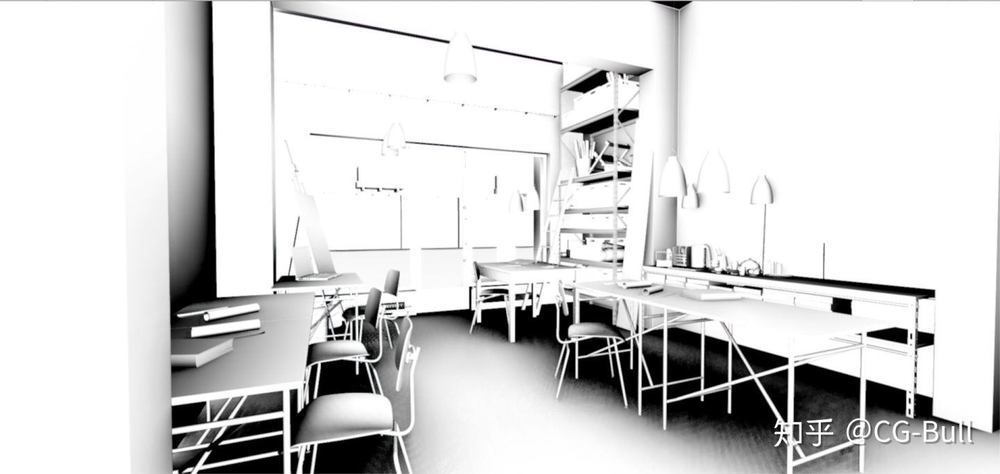

最后去吧AO和RO的结果混合到场景即可。

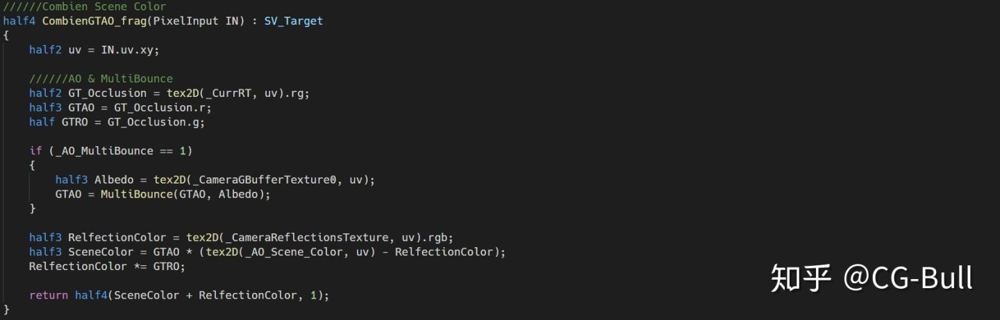

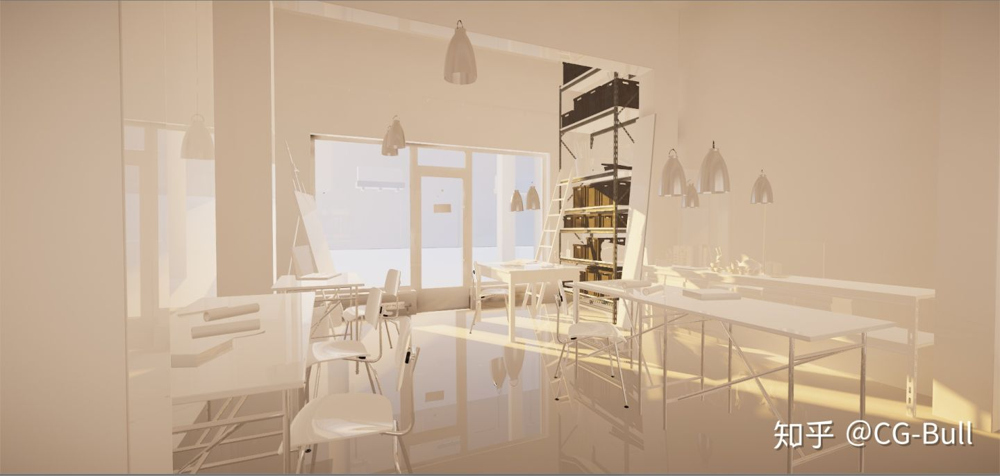AO RO Off

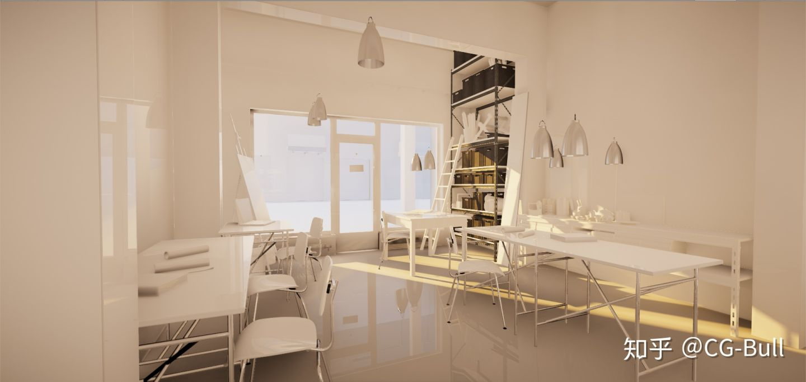AO RO On

最后效果感觉还可以。。起码比PPS和商城里面那些缺胳臂少腿的好(滑稽)。再分享一些图片。

ClassRoo

Off

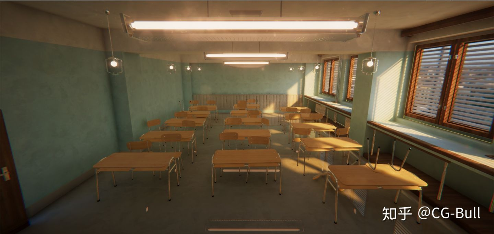On

Off

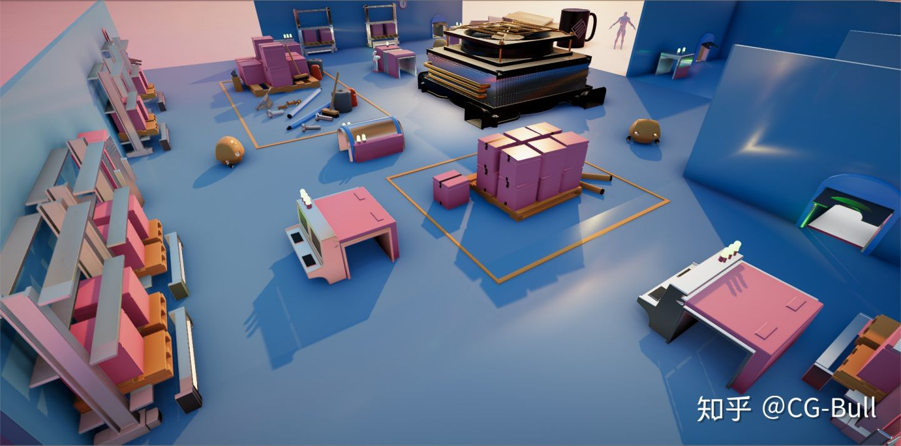On

最后奉上源代码(滑稽)。

[haolange/Unity_ScreenSpaceTechStackgithub.com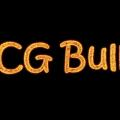](https://link.zhihu.com/?target=https%3A//github.com/haolange/Unity_ScreenSpaceTechStack)