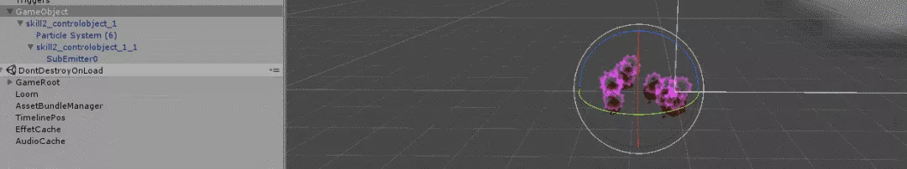
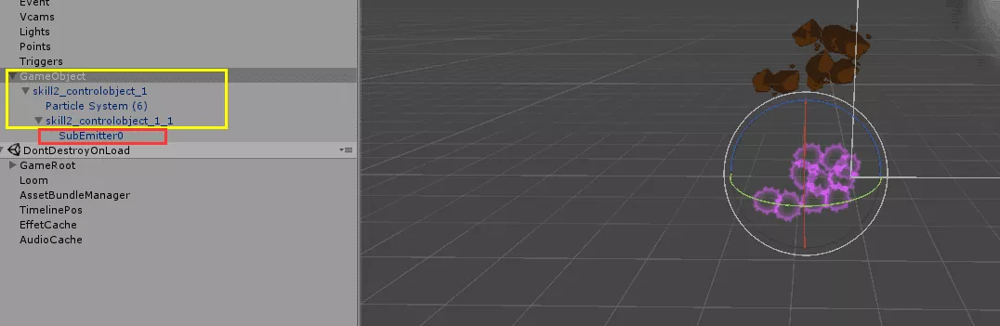
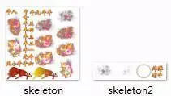
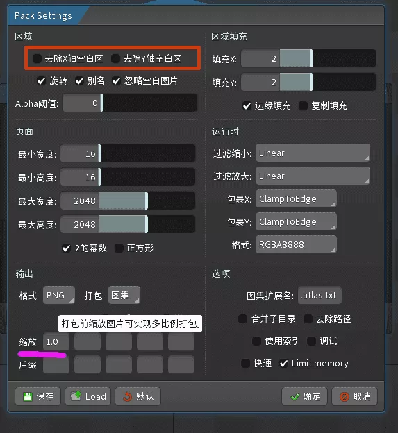
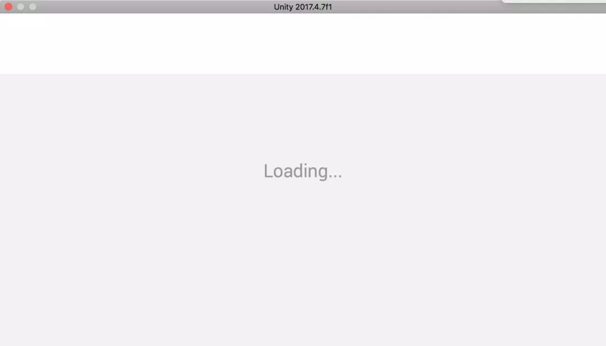
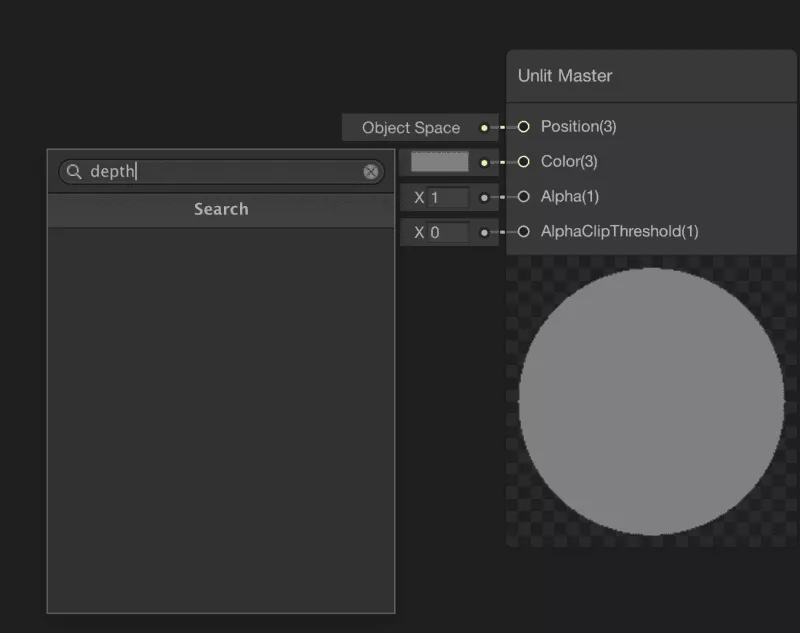
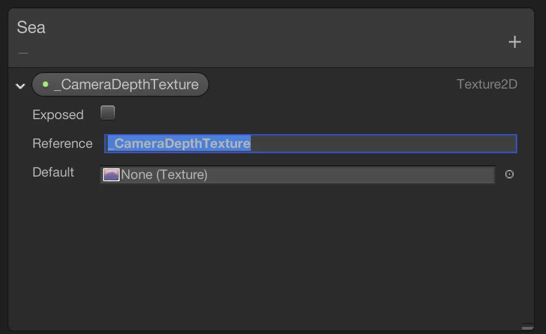
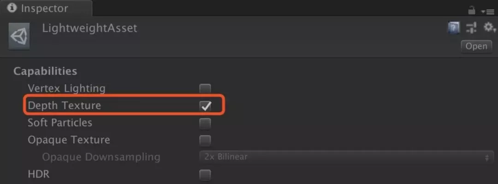
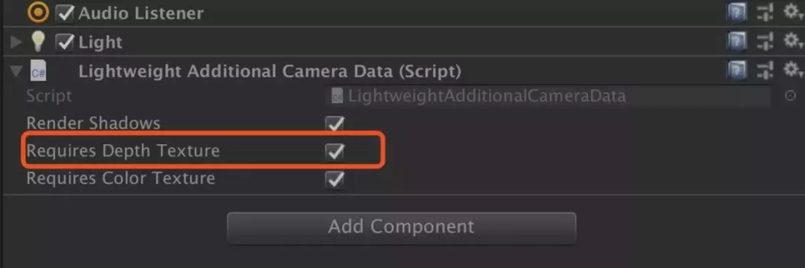
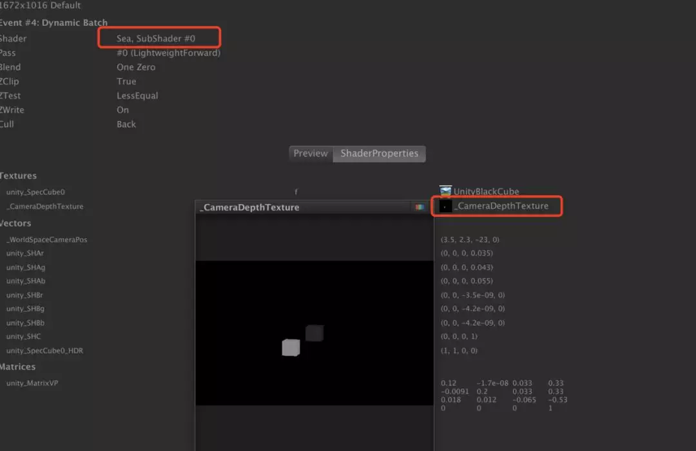

## 如何在Shader Graph中获取深度图

Unity技术支持工程师陈嘉栋每周都会总结出，过去一周在Unity官方社区交流群中比较有代表性的问题。今天我们将分享第4期的社区Unity Q&A，其中着重介绍如何在Shader Graph着色器视图中获取深度图。

Unity Q&A 系列回顾：

- [第1期：巧妙设置Texture Type，将ShadowMask内存占用变成之前的1/4](http://mp.weixin.qq.com/s?__biz=MzU5MjQ1NTEwOA==&mid=2247494397&idx=1&sn=82fb1621979804a8961e23d1503abbcf&chksm=fe1dde56c96a57407727dd820ab065fd0021380721829628995d004bca91a28ed39e15e846aa&scene=21#wechat_redirect)
- [第2期：还原堆栈信息，分析地形系统使用ASTC纹理导致的Crash](http://mp.weixin.qq.com/s?__biz=MzU5MjQ1NTEwOA==&mid=2247494555&idx=1&sn=610a88c52fdef135fed51924e9110cc6&chksm=fe1ddf30c96a56269f386a36accd553800933334f845f63c9afdcc26bb442d94a279609296b5&scene=21#wechat_redirect)
- [第3期 ：聊聊Unity 2018的LWRP和混合光照](http://mp.weixin.qq.com/s?__biz=MzU5MjQ1NTEwOA==&mid=2247494807&idx=1&sn=a9f960cfad59c67ad1df7b5f2f0ea7f6&chksm=fe1dd83cc96a512a4f8c485b22acfea2c63a42809c032d52bb56f640149eb850d377a5c73e28&scene=21#wechat_redirect)

StreamingAssets

问题01：在Unity 2018.2版本里，Unity会将放在StreamingAssets文件夹下的js文件当作Unity的UnityScript进行编译，但是我的资源中有html页面需要用到这个js文件，如何解决？

回答：我们分别在Unity 2018.2和Unity 2018.1上进行了测试。在Unity2018.2中，的确会将StreamingAssets文件夹下的js文件当作UnityScript进行编译，这应该是Unity 2018.2中出现的一个Bug。我们已经提交这个Bug，在后续版本中会进行修复，请注意后续的更新说明。

另外，Unity 2018.2属于Unity Tech技术前瞻版本，请阅读：《[Unity全新的版本发布计划](http://mp.weixin.qq.com/s?__biz=MzU5MjQ1NTEwOA==&mid=2247492287&idx=1&sn=0a1450461c7188ea066040f4af892454&chksm=fe1dd614c96a5f026ca8e790549a713f094d71e82edb1f7d4e9d6d927ebed19f2134f321eeaf&scene=21#wechat_redirect)》，选择最适用你项目的版本。

性能

问题02：使用Profiler.BeginSample去标识代码块或者方法，以便在Profiler性能分析工具中查看对应代码块的资源消耗。在Unity 2017.4.5版本将标识写在脚本的Start方法无法成功标识，但是相同的代码在Unity 5.4版本却可以标识出来，在Unity 2017.4.5的Update方法也可以标识代码块。这是版本问题吗？在Unity 2017.4.5的版本在某些初始化时应该怎样处理呢？

回答：Unity 2017.3之后的版本修改了Profiler数据的发送方式，从Frame base变成了Stream base，在第一帧Engine向Editor发送的Profiler数据丢掉了很多Sampler，所以导致没有显示出来。

但是Beginsample并不是不会在Start方法中生效，游戏启动之后开启脚本还是可以看到的。启动时Sampler不全的问题应该在Unity 2018中进行了修改。

所以，没有显示BeginSample去标识代码块的原因是在Unity 2017.3至Unity 2017.4版本中有的Sampler被丢弃了，并不是针对某个特定的方法。

Playable

问题03：在使用Playable的API时，下图中左侧是正常的情况，右侧是调用：

mixerPlayable.SetInputWeight(0, 1.5f)；

当将Input0的权重设置为1.5之后，模型被不正确的拉伸，并且动作表现错误，如何解决？

回答：Playerable Mixer的混合的机制是：Weight1 * Animation1 + Weight2 * Animation2 + Weight3 * Animation3。因此在权重总和>1的时候会出现问题，建议对传入的权重进行归一化。

粒子

问题04： 我有这样一个粒子结构，刚刚创建是正常的。

现在把它Disable掉后调转180度。再激活，黄色部分的发射器是正常的，红色是子粒子，发射错误。

回答：这是一个Bug，即在Play Mode的情况下，Disable掉父对象并修改其Transform数据后，Subemitter并没有正确继承其父对象的Transform数据。此问题将在后续版本中进行修复。

Spine

问题05：当Spine导出图片是2张时，Unity编辑器中播放的动画是乱的，有什么解决办法吗？ 

回答: 如下图所示，你可以在导出设置里的"缩放"选项的Scale缩小一下，例如修改成为0.8，导成一张。当不够放到一张，可以去掉空白区进行再缩小，图集会小很多。

编辑器

问题06：我遇见了启动界面白屏的问题，Unity 5.6.0和 Unity 2018最新版本都出现这样的问题，如何解决？

回答：这种并非卡在loading页面的白屏，很多时候是DX的驱动不兼容造成的，可以尝试切换运行的显卡，也可以尝试一下在命令行强制使用GL启动。相关命令行参数可以参考文档：

https://docs.unity3d.com/Manual/CommandLineArguments.html

问题07：启动Unity时，无限卡Loading，如何解决？

回答：当遇见卡Loading的时候，可以看看eEditor.log中的相关输出。例如：下面这样的log：

No sufficient permissions while processing request “https://core.cloud.unity3d.com/api/login“, HTTP error code 401

卡loading很多时候是由于网络原因造成的，你可以尝试断网，进入离线模式。如果使用VPN也可以先关闭使用，部分Vpn的配置也会导致该问题出现。最后可以查看一下防火墙的设置。

还有一种特殊情况，例如：出现如下的Log：

COMMAND LINE ARGUMENTS:

D:\u2017.1\Editor\Unity.exe [CEF] undefined in file:///C%3A%2FUsers%2Falex%2FAppData%2FRoaming%2FUnity%2FPackages%2Fnode_modules%2Funity-editor-home%2Fdist/assets/unity-editor-home.js at line 39 Error loading https://api.unity.com/v1/oauth2/authorize?client_id=launcher&display=launcher&locale=en_US&response_type=code&redirect_uri=launcher://unity/C%3A%2FUsers%2Falex%2FAppData%2FRoaming%2FUnity%2FPackages%2Fnode_modules%2Funity-editor-home%2Fdist/index.html#/login

此时，请移除”C:\Users\XXXXXX\AppData\LocalLow\Unity”文件夹，因为该文件夹会缓存一些登陆信息，移除之后再尝试启动Unity编辑器。

Scripting

问题08：开发移动端ARCore进行测试特别不方便，每次都进行打包出来。是否有更好的测试方法？

回答：Unity中提供一个叫做EditorConnection的类，可以用来满足类似的需求。请参考文档：

https://docs.unity3d.com/ScriptReference/Networking.PlayerConnection.EditorConnection.html

Shader Graph

问题09：如何在Unity 2018.2的Shader Graph着色器视图中获取深度图，例如：_CameraDepthTexture？

回答： 默认情况下，ShaderGraph没有提供接口直接获取_CameraDepthTexture的，但可以使用workaround的方式可以来获取_CameraDepthTexture。

即创建一个新的Property，该property的name和reference都叫_CameraDepthTexture，与此同时不勾选Exposed。

同时，打开LightWeightRenderPipeline Asset中的深度图选项。

场景中的Camera要添加一个LightweightAdditionalCameraData组件，并且也打开深度图的选项。

此后，我们就可以正常的获取深度图_CameraDepthTexture了。

小结

以上就是过去一周Unity官方社区交流群中比较有代表性的问题，其中有你关注的问题吗？

如果你也希望与Unity的技术工程师交流，欢迎加入Unity官方社区交流群：629212643 或访问Unity官方中文论坛(Unitychina.cn)！