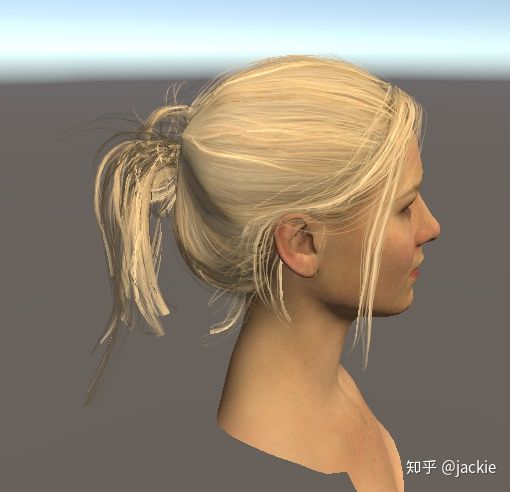
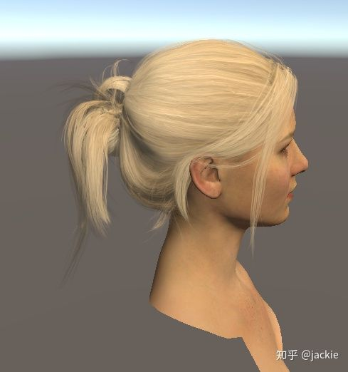

# unity 半透明渲染技巧(2)：预计算顺序法

**案例：**上一个方案中不适合中间需要大量透明的效果否则边缘很生硬看如下对比图。



固定深度方案 遇到非边缘区域大面积半透明 效果不好



本方案 预计算顺序法 效果更好

**原理：**既然引擎只排序到逐对象级别，那么对象内渲染顺序是怎么决定的呢？通过测试发现是 建模时候的顶点id顺序决定的，那么我们是否可以 预计算一些角度的排序数组，根据实时角度 进行切换呢？在很多情况下是可行的 比如 左右转动的角色头发，甚至是游戏内的头发 也能通过6-8-6 22个方向很精确的表达（赤道上8个方向，上下45度处 各6个方向）。以下是只预计算4个方向的效果。

<iframe frameborder="0" allowfullscreen="" src="https://www.zhihu.com/video/1229156924605349888?autoplay=false&amp;useMSE=" style="display: block; width: 688px; height: 387px;"></iframe>

默认半透明深度 各种角度错误

<iframe frameborder="0" allowfullscreen="" src="https://www.zhihu.com/video/1229159335953178624?autoplay=false&amp;useMSE=" style="display: block; width: 688px; height: 387px;"></iframe>

仅仅预计算4个方向的切换效果

**代码实现：**

```csharp
using System;
using System.Collections;
using System.Collections.Generic;
using System.Diagnostics;
using UnityEngine;

public class AlphaBakedOrder : MonoBehaviour
{
    class IndiceData : IComparable<IndiceData>
    {
        public int a;
        public int b;
        public int c;
        public float score;

        public int CompareTo(IndiceData other)
        {
            return (int)((other.score - score) * 10000);
        }
    }
    public int[][] indicesDir;
    private int lastIndex;
    private int[] originIndices;

    bool isReverse;
    Mesh mesh;
    Vector3 centerPt;
    void Awake()
    {
        centerPt = transform.GetChild(0).localPosition;
        mesh = GetComponent<MeshFilter>().mesh;
        var indices = originIndices = mesh.GetIndices(0);
        var vertices = mesh.vertices;
        for (int i = 0; i < vertices.Length; i++)
        {

            vertices[i] = transform.localToWorldMatrix.MultiplyPoint(vertices[i]);

        }

        indicesDir = new int[4][];

        calculateDirIndices(out indicesDir[0], out indicesDir[2], indices, vertices, 0);
        calculateDirIndices(out indicesDir[1], out indicesDir[3], indices, vertices, 2);

    }

    private void calculateDirIndices(out int[] v1, out int[] v2, int[] indices, Vector3[] vertices, int dirCheck)
    {

        List<IndiceData> orderList = new List<IndiceData>();
        for (int i = 0; i < indices.Length; i += 3)
        {
            IndiceData data = new IndiceData();
            data.a = indices[i];
            data.b = indices[i + 1];
            data.c = indices[i + 2];
            data.score = (vertices[data.a][dirCheck] + vertices[data.b][dirCheck] + vertices[data.c][dirCheck]);

            orderList.Add(data);
        }
        orderList.Sort();
        v1 = new int[indices.Length];
        for (int i = 0; i < indices.Length; i += 3)
        {
            v1[i] = orderList[i / 3].a;
            v1[i + 1] = orderList[i / 3].b;
            v1[i + 2] = orderList[i / 3].c;
        }
        orderList.Reverse();
        v2 = new int[indices.Length];
        for (int i = 0; i < indices.Length; i += 3)
        {
            v2[i] = orderList[i / 3].a;
            v2[i + 1] = orderList[i / 3].b;
            v2[i + 2] = orderList[i / 3].c;
        }

    }
    private void OnDisable()
    {
        mesh.SetIndices(originIndices, MeshTopology.Triangles, 0);
        lastIndex = -1;
    }

    void Update()
    {
        if (Camera.main == null) return;
        var checkPos = Vector3.Normalize(Camera.main.transform.position - transform.localToWorldMatrix.MultiplyPoint3x4(centerPt));
        var dotX = Vector3.Dot(transform.right, checkPos);
        var dotY = Vector3.Dot(transform.up, checkPos);
        //  print(dotX + "," + dotY);

        var index = 0;
        if (Mathf.Abs(dotY) < Mathf.Abs(dotX))
        {
            index = dotX > 0 ? 2 : 0;

        }
        else
        {
            index = dotY > 0 ? 1 : 3;

        }

        if (lastIndex != index)
        {
            mesh.SetIndices(indicesDir[index], MeshTopology.Triangles, 0);
            lastIndex = index;
            print(index);
        }


    }
}
```