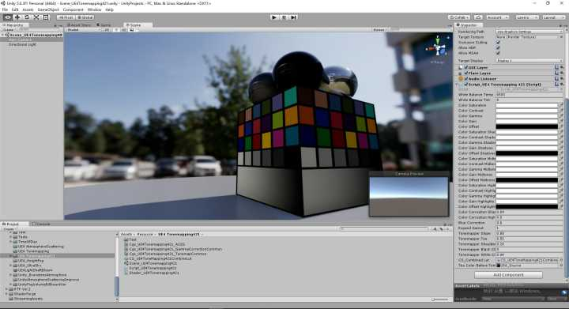
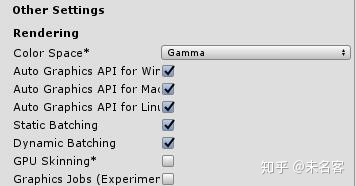
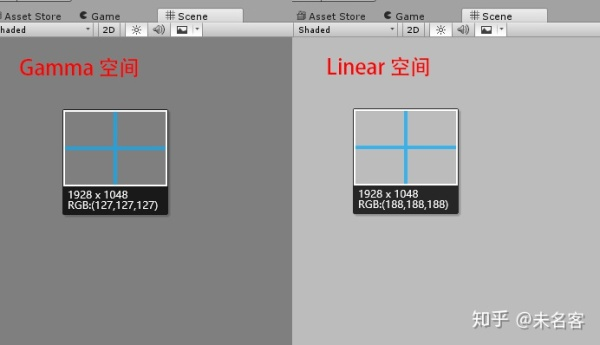

## [【UE4ToUnity】ColorGrade&Tonemap](https://zhuanlan.zhihu.com/p/75200070)

https://www.zhihu.com/people/wsqjny)

一枚成长中的程序员，对3d图形引擎倍感兴趣

这个系列，我想做个总结，聊一聊如何在Untiy 中实现UE4 的效果。这篇文章从最简单的后期谈起，如何用Unity实现UE4 中的ColorGrade，Tonemap，争取做到像素级别的一致。其实知乎上对与ColorGrade，Tonemap 的介绍非常多，我这里只是简单的点一下，不会重复去解释理论上的东西，以实现功能为主。今天的主题：生成一张和UE4 一模一样的3D Lut 颜色查找表，包含了Tonemap,ColorGrade。 并验证它的实际效果。
第一部分：理解并控制屏幕上的像素颜色无论是Unity，还是UE4，Gamma空间，Linear空间是绕不开的。这里大家可以参考一下这篇文章，里面介绍了如何在Unity 中实现自己的后期效果。我这里不多说。1.1 UnityUnity 中可以在Edit-ProjectSetting-Player-Rendering-ColorSpace 中选择两种空间。

首先我们看一下，如果是默认的Gamma空间，向屏幕输出一个中灰纯色，会是什么结果。直接在屏幕上输出0.5；`float4 frag (v2f i) : SV_Target {     return 0.5; } `屏幕输出的是127， 127是256的一半，没问题。

切换到Linear 空间，显示的是188，这就有点说法了。![[公式]](http://www.zhihu.com/equation?tex=0.5%5E%7B%5Cfrac%7B1%7D%7B2.2%7D%7D+%3D+0.72976+)![[公式]](http://www.zhihu.com/equation?tex=255+%2A+0.72976+%5Capprox+186)这里有篇文章，对Gamma 即相关内容做了很详细的介绍，有兴趣的小伙伴可以点进去点进去看一眼。[https://blog.csdn.net/candycat1992/article/details/46228771/​](http://link.zhihu.com/?target=https%3A//blog.csdn.net/candycat1992/article/details/46228771/)

blog.csdn.net其实简单来说，我们可以得到如下结论：Gamma空间下，我们输出什么，得到的结果就是什么。Linear 空间下，当我们输出的是0.5时，Unity 会先做一步pow 0.4545，然后提交到屏幕上。其实在进入PBR
 时代以后，shader 中的颜色 有了更现实的物理意义，不在是简单的0-1，开始有了HDR，我们的流程变成了在Linear 
空间下工作，这样我们的加减乘除各种运算得到的结果，才是符合我们预期的结果。在完成所有运算，向屏幕提交结果之前，做一步Gamma 矫正，即pow 
（1/2.2），最终的结果就是我们想要的。在Unity 中，可以通过IsGammaSpace() 判断当前项目所在空间，做如下操作以后，就能保证，我们想在屏幕上要什么颜色，就能得到什么颜色。float4 frag (v2f i) : SV_Target
{
    float4 fianlColor = 0.5;

​    if(!IsGammaSpace())
​    {
​        finalColor = pow(finalColor, 2.2);
​    }
​    return finalColor;

}
其实有了这两个结论，对我们来说已经足够完成下面的任务了。1.2 UE4 UE4 同理，这里我先补充几个关于UE4 的常识小知识：shader 的路径：F:\UE4_Source\4_21\UnrealEngine-release\Engine\Shaders\PrivateReloadShader 快捷键：Ctl + Shift + .r.PostProcessing.ForceAsyncDispatch 可以强制 后期使用Compute Shader。PostProcessTonemap.usf 是UE4 后期的总Shader，类似Unity 中的Uber，其中MainPS() 是PC平台 PixelShader入口，MainCS() 是ComputeShader 入口。在Pixel 流程下，直接输出，0.5，Ctl+Shift+. 可以看到，屏幕上的颜色是0.5。 这个确实是我们想要的。// pixel shader entry point
void MainPS(
	in noperspective float2 UV : TEXCOORD0,
	in noperspective float3 InExposureScaleVignette : TEXCOORD1,
	in noperspective float4 GrainUV : TEXCOORD2,
	in noperspective float2 ScreenPos : TEXCOORD3,
	in noperspective float2 FullViewUV : TEXCOORD4,
	float4 SvPosition : SV_POSITION,		// after all interpolators
	out float4 OutColor : SV_Target0
	)
{
    //OutColor = TonemapCommonPS(UV, InExposureScaleVignette, GrainUV, ScreenPos, FullViewUV, SvPosition);
	OutColor = 0.5;
}
1.3 Tonemap 相关在TonemapCommonPS 中看到下面这句话，InverseGamma.x 就类似上文中提到的Unity 1/2.2， 只不过，UE4 中可以修改Gamma 值。#if USE_GAMMA_ONLY
    .....
    OutColor.rgb = pow(SceneColor.rgb, InverseGamma.x);
    .....
#else 
#endif
   .....
return OutColor;
当我们关闭Tonemap 的时候，USE_GAMMA_ONLY 宏会被打开，直接做一个简单的gamma 矫正。通过比较pow（0.4545） 和Tonemap 的结果，我们会发现，普通的Gamma矫正会曝光，其实是因为，pow 0.4545 之后，仍然会有超过1 的颜色。经过Tonemap 之后，颜色被映射到0-1的范围。没过曝的地方，颜色过度很自然。上文Tonemap 使用的函数https://blog.csdn.net/qq_16756235/article/details/78890027​在颜色物理化以后，它的范围并不是0-1，可以非常大。但是我们常规的显示器，只能显示0--1范围的颜色（这里不考虑HDR
 显示器, ue4 是支持HDR 显示器的），如何把无限的结果映射到0-1上，并不丢失细节，颜色更有质感，这应该说是Tonemap 
曲线最重要的任务。1.4 ColorGrade 校色校色这里也简单提一下吧，早期，我们是在LDR 下进行调色的，而且方法一般是，截取游戏场景，导入PS，校色以后，PS 会生成一张Lut 颜色查找表。然后通过一个后期全屏操作，查找颜色，完成校色。但是这种方法有个缺点是，中间需要经过PS，而且只能在LDR
 校色，不方便，而且校色效果不好。现在游戏的主流做法是，直接在引擎中，在HDR 下校色，会根据参数实时生成一张3D Lut 
颜色查找表，这个查找表，包括了Tonemap，Color Grade ，这样，最后在使用的时候，只需要查一表，就可以完成所有的步骤。这样也就提到了今天这篇文章要做的内容，如何生成一张和UE4 一模一样的3D Lut 查找表。ue4 3d Lut 32*32*32第二部分：Unity 中生成UE4 3D Lut如果可以生成完全一样的3D Lut 颜色查找表，那么在Tonemap 这一步，我们就能保证，Unity 输出和UE4 一样的结果。其实这个实现非常简单。完全照搬UE4 的Shader 即可。总共涉及到如下文件：ACES.ushGammaCorrectionCommon.ushTonemapCommon.ushPostProcessCombineLUTs.usfPostProcessTonemap.usf其中，前三个，直接照搬，不需要做任何处理，PostProcessCombineLUTs.usf 中包含了生成Lut 的入口函数，Tonemap.usf 是个合成函数，合成了所有的后期效果，其中，会在后期的某个阶段使用3d lut 查找颜色，校色。2.1 CombineLut 这个是Unity 这边CombineLut cs 的完整shader#pragma kernel cs_main

#define USE_COLOR_MATRIX	1
#define USE_SHADOW_TINT		1
#define USE_CONTRAST		1

#define BLENDCOUNT			0
#define USE_VOLUME_LUT      1

#define BRANCH [branch]
#define FEATURE_LEVEL       1
#define FEATURE_LEVEL_ES3_1 0

///////////////////////////////////////////////////////////////////////////////////////////////////////////////
// From Common.ush
#ifndef PI
#define PI 3.1415926
#endif

float Square(float x)
{
	return x * x;
}

float2 Square(float2 x)
{
	return x * x;
}

float3 Square(float3 x)
{
	return x * x;
}

float4 Square(float4 x)
{
	return x * x;
}

///////////////////////////////////////////////////////////////////////////////////////////////////////////////
// From PostProcessCommon.ush
float4 MappingPolynomial;			 // RGB = a, b, c where y = a * x*x + b * x + c

// @param InLDRColor needs to be LDR (0..1) and in linear space
half3 ColorCorrection(half3 InLDRColor)
{
	// final color correction to adjust for hardware differences, to make quick adjustements before a demo or simply a user setting
	return MappingPolynomial.x * (InLDRColor * InLDRColor) + MappingPolynomial.y * InLDRColor + MappingPolynomial.z;
}

///////////////////////////////////////////////////////////////////////////////////////////////////////////////
// From PostProcessCombineLUTs.usf
#include "Cgs_UE4Tonemapping421_TonemapCommon.cginc"

///////////////////////////////////////////////////////////////////////////////////////////////////////////////
中间完全一样
///////////////////////////////////////////////////////////////////////////////////////////////////////////////

RWTexture3D<float4> RWOutComputeTex;
[numthreads(8, 8, 8)]
void cs_main(uint3 DispatchThreadId : SV_DispatchThreadID)
{
    float4 CombineLUTsComputeParams = float4(0, 0, 1.0f / 32.0f, 1.0f / 32.0f);

​	float2 UV = ((float2)DispatchThreadId.xy + 0.5f) * CombineLUTsComputeParams.zw;
​	uint LayerIndex = DispatchThreadId.z;
​	
​	float4 OutColor = CombineLUTsCommon(UV, LayerIndex);

​	uint3 PixelPos = DispatchThreadId;
​	RWOutComputeTex[PixelPos] = OutColor;
}
几个小改动添加Common.ush， PostProcessCommon 的几个公用函数中间部分完全一样。最后cs脚本这边：private void ComputeLutTexture()
{
​    //Create 3D Render Texture 1
​    int tex1Res = 32;
​    _combinedLutTexture = new RenderTexture(tex1Res, tex1Res, 24);
​    _combinedLutTexture.format = RenderTextureFormat.ARGB2101010;
​    _combinedLutTexture.enableRandomWrite = true;
​    _combinedLutTexture.dimension = UnityEngine.Rendering.TextureDimension.Tex3D;
​    _combinedLutTexture.volumeDepth = tex1Res;
​    _combinedLutTexture.Create();

​    int noise1Gen = CS_CombinedLut.FindKernel("cs_main");		

​    SetColorForCS ("ColorSaturation", ColorSaturation);
​    SetColorForCS ("ColorContrast", ColorContrast);
​    SetColorForCS ("ColorGamma", ColorGamma);
​    SetColorForCS ("ColorGain", ColorGain);
​    SetColorForCS ("ColorOffset", ColorOffset);

​    SetColorForCS ("ColorSaturationShadows", ColorSaturationShadows);
​    SetColorForCS ("ColorContrastShadows", ColorContrastShadows);
​    SetColorForCS ("ColorGammaShadows", ColorGammaShadows);
​    SetColorForCS ("ColorGainShadows", ColorGainShadows);
​    SetColorForCS ("ColorOffsetShadows", ColorOffsetShadows);

​    SetColorForCS ("ColorSaturationMidtones", ColorSaturationMidtones);
​    SetColorForCS ("ColorContrastMidtones", ColorContrastMidtones);
​    SetColorForCS ("ColorGammaMidtones", ColorGammaMidtones);
​    SetColorForCS ("ColorGainMidtones", ColorGainMidtones);
​    SetColorForCS ("ColorOffsetMidtones", ColorOffsetMidtones);

​    SetColorForCS ("ColorSaturationHighlights", ColorSaturationHighlights);
​    SetColorForCS ("ColorContrastHighlights", ColorContrastHighlights);
​    SetColorForCS ("ColorGammaHighlights", ColorGammaHighlights);
​    SetColorForCS ("ColorGainHighlights", ColorGainHighlights);
​    SetColorForCS ("ColorOffsetHighlights", ColorOffsetHighlights);

​    CS_CombinedLut.SetFloat ("ColorCorrectionShadowsMax", ColorCorrectionShadowsMax);
​    CS_CombinedLut.SetFloat ("ColorCorrectionHighlightsMin", ColorCorrectionHighlightsMin);
​    CS_CombinedLut.SetFloat("BlueCorrection", BlueCorrection);
​    CS_CombinedLut.SetFloat("ExpandGamut", ExpandGamut);

​    Vector3 ColorTransform = new Vector3(0.0f, 0.5f, 1);
​    {
​        // x is the input value, y the output value
​        // RGB = a, b, c where y = a * x*x + b * x + c

​        float c = ColorTransform.x;
​        float b = 4 * ColorTransform.y - 3 * ColorTransform.x - ColorTransform.z;
​        float a = ColorTransform.z - ColorTransform.x - b;

​        float[] v4MappingPolynomial = new float[4];
​        v4MappingPolynomial[0] = a;
​        v4MappingPolynomial[1] = b;
​        v4MappingPolynomial[2] = c;
​        v4MappingPolynomial[3] = 1;

​        CS_CombinedLut.SetFloats("MappingPolynomial", v4MappingPolynomial);
​        //_mat.SetVector("MappingPolynomial", new Vector4(a, b, c, 1)); 
​    }

​    //_mat.SetVector ("ColorScale", new Vector3(1.0f,1.0f,1.0f));
​    //_mat.SetColor ("OverlayColor", new Color(0, 0, 0, 0));

​    float[] v3ColorScale = new float[3];
​    v3ColorScale[0] = 1.0f;
​    v3ColorScale[1] = 1.0f;
​    v3ColorScale[2] = 1.0f;
​    CS_CombinedLut.SetFloats("ColorScale", v3ColorScale);

​    SetColorForCS("OverlayColor", new Color(0, 0, 0, 0));

​    CS_CombinedLut.SetFloats("FilmSlope", TonemapperSlope);
​    CS_CombinedLut.SetFloats("FilmToe", TonemapperToe);
​    CS_CombinedLut.SetFloats("FilmShoulder", TonemapperShoulder);
​    CS_CombinedLut.SetFloats("FilmBlackClip", TonemapperBlackClip);
​    CS_CombinedLut.SetFloats("FilmWhiteClip", TonemapperWhiteClip);

​    CS_CombinedLut.SetFloats("WhiteTemp", WhiteBalanceTemp);
​    CS_CombinedLut.SetFloats("WhiteTint", WhiteBalanceTint);

​    ///
​    /*
​    static TConsoleVariableData<int32>* CVarOutputDevice = IConsoleManager::Get().FindTConsoleVariableDataInt(TEXT("r.HDR.Display.OutputDevice"));
​    static TConsoleVariableData<float>* CVarOutputGamma = IConsoleManager::Get().FindTConsoleVariableDataFloat(TEXT("r.TonemapperGamma"));
​    static TConsoleVariableData<int32>* CVarOutputGamut = IConsoleManager::Get().FindTConsoleVariableDataInt(TEXT("r.HDR.Display.ColorGamut"));

​    int32 OutputDeviceValue = CVarOutputDevice->GetValueOnRenderThread();
​    float Gamma = CVarOutputGamma->GetValueOnRenderThread();
​    */
​    float DisplayGamma = 2.2f;
​    float Gamma = 0.0f;
​    {
​        float[] v3InverseGamma = new float[3];
​        v3InverseGamma[0] = 1.0f / DisplayGamma;
​        v3InverseGamma[1] = 2.2f / DisplayGamma;
​        v3InverseGamma[2] = 1.0f / Mathf.Max(Gamma, 1.0f);

​        CS_CombinedLut.SetFloats("InverseGamma", v3InverseGamma);
​    }

​    int OutputDeviceValue = 0;
​    int OutputGamutValue = 0;
​    CS_CombinedLut.SetInt("OutputDevice", OutputDeviceValue);
​    CS_CombinedLut.SetInt("OutputGamut", OutputGamutValue);

​    float[] ColorShadowTint2 = new float[4];
​    ColorShadowTint2[0] = 0.0f;
​    ColorShadowTint2[1] = 0.0f;
​    ColorShadowTint2[2] = 0.0f;
​    ColorShadowTint2[3] = 1.0f;
​    CS_CombinedLut.SetFloats("ColorShadow_Tint2", ColorShadowTint2);

​    //////////////////////////////////////////////////////////////////////////////////////
​    CS_CombinedLut.SetTexture(noise1Gen, "RWOutComputeTex", _combinedLutTexture);
​    CS_CombinedLut.Dispatch(noise1Gen, tex1Res / 8, tex1Res / 8, tex1Res / 8);		
}
通过RenderDoc 截取到 UE4 和Unity 的Lut 贴图，并作如下对比：只有几个字节的差别，其实对于我来说，到了这一步足够了，毕竟Unity 是黑盒的，没必要去深究 在传参数的时候，会不会有浮点数处理上的差异。2.2 使用3dLut ，完成Tonemap，ColorGrade使用过程也非常简单Shader "MyShader/PP/UE4Tonemap421"
{
​	Properties
​	{
​		_MainTex ("Texture", 2D) = "white" {}
​		_CombinedLutTex("Texture", 3D) = "" {}
​	}
​	SubShader
​	{
​		// No culling or depth
​		Cull Off ZWrite Off ZTest Always

​		Pass
​		{
​			CGPROGRAM
​			#pragma vertex vert
​			#pragma fragment frag
​			
​			#include "UnityCG.cginc"

​			struct appdata
​			{
​				float4 vertex : POSITION;
​				float2 uv : TEXCOORD0;
​			};

​			struct v2f
​			{
​				float2 uv : TEXCOORD0;
​				float4 vertex : SV_POSITION;
​			};

​			v2f vert (appdata v)
​			{
​				v2f o;
​				o.vertex = UnityObjectToClipPos(v.vertex);
​				o.uv = v.uv;
​				return o;
​			}
​			
​			sampler2D _MainTex;
​			sampler2D _ColorBeforeTonemapTex;
​			sampler3D _CombinedLutTex;

​			//
​			// Generic log lin transforms
​			//
​			float3 LogToLin1( float3 LogColor )
​			{
​				const float LinearRange = 14;
​				const float LinearGrey = 0.18;
​				const float ExposureGrey = 444;

​				float3 LinearColor = exp2( ( LogColor - ExposureGrey / 1023.0 ) * LinearRange ) * LinearGrey;
​				return LinearColor;
​			}

​			float3 LinToLog1( float3 LinearColor )
​			{
​				const float LinearRange = 14;
​				const float LinearGrey = 0.18;
​				const float ExposureGrey = 444;

​				float3 LogColor = log2(LinearColor) / LinearRange - log2(LinearGrey) / LinearRange + ExposureGrey / 1023.0;
​				LogColor = saturate( LogColor );

​				return LogColor;
​			}

​			static const float LUTSize = 32;
​			half3 ColorLookupTable( half3 LinearColor )
​			{
​				float3 LUTEncodedColor;

​				LUTEncodedColor = LinToLog1( LinearColor + LogToLin1( 0 ) );
​				
​				float3 UVW = LUTEncodedColor * ((LUTSize - 1) / LUTSize) + (0.5f / LUTSize);

​				half3 OutDeviceColor = tex3D(_CombinedLutTex, UVW);
​				return OutDeviceColor * 1.05;
​			}

​			float4 frag (v2f i) : SV_Target
​			{
​				float4 col = tex2D(_ColorBeforeTonemapTex, i.uv);

​				float4 finalColor = 1;
​				finalColor.rgb = ColorLookupTable(col.rgb);

​				if(!IsGammaSpace())
​				{
​					finalColor = pow(finalColor, 2.2);
​				}
​				return finalColor;
​			}
​			ENDCG
​		}
​	}
}
删减一下UE4 的Tonemap.usf， 只保留 tonemap，colorgrade 部分，可以看出，Unity 得到了和UE4 一模一样的结果。一开始写的有点罗嗦了，后面就不想在多说了，因为抄别人的代码，确实很简单也实在没什么可说的....至于这个3D lut 是如何处理HDR 空间下颜色的转换解码，需要涉及到很多颜色空间转换，实话说，我也还没有去仔细研究。有个好玩的意思是，这个颜色查找便是如何做映射的。其实很简单，我们在做这张LUT图的时候，需要考虑到理论上无限范围内所有的颜色，这么大范围的值可以通过log 函数，映射到0--1。这里的0--1 即可作为3D Lut 的索引，去查找颜色。就是标题的图啦。