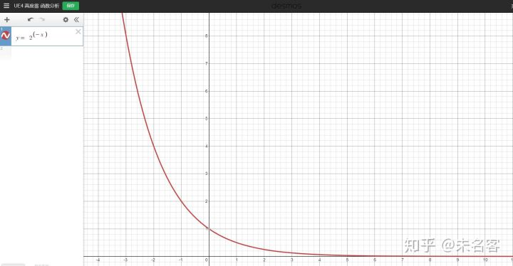
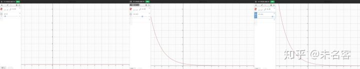
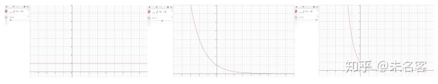
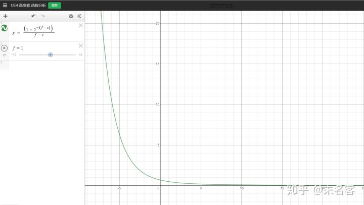
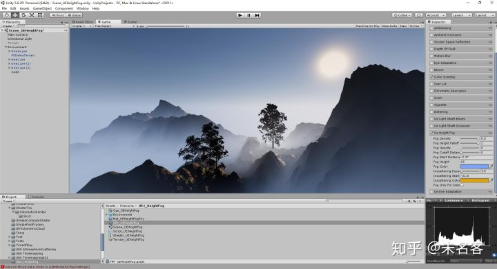
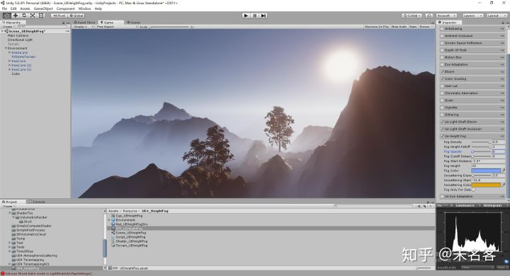

# 【UE4ToUnity】高度雾ExponentialHeightFog

在最开始，UE4 本身只有两种雾效，大气散射雾，指数高度雾，后来某个版本加入了体积雾。今天我们主要来看看这三个雾里面最简单的高度雾。

UE4  的高度雾，全程指数级高度雾，英文Exponential Height  Fog，从名字就可以看出来，它最大的特点就是“高度感”，“指数感”。它不具备实际物理特性，更不是PBR，但是它的优势是，性能飞快😳....和普通的雾效一样，实际上这里的高度雾也只是一个全屏后期，最核心的还是在PS  上，涉及到的shader：

- HeightFogCommon.ush
- HeightFogPixelShader.usf
- HeightFogVertexShader.usf

执行阶段：

它实现的核心围绕着两个函数展开：

- 密度函数
- 积分拟合函数

密度函数，描述了空间中一个点的雾效浓度。

积分拟合函数，其实是一个经验函数，代替了RayMarch，描述了光线从物体表面到人眼的过程，简而言之，就是从物体到人眼，雾浓度发生了怎么样的变化.....

## 一、密度函数

首先我们抛开UE4，和Unity 跟着我的角度，来推导一下密度函数。

既然叫做指数高度雾，那么必要的两个因素就是 指数和高度，所以这就是最简单的函数：

![[公式]](UEToUnity_ExponentialHeightFog.assets/equation.svg) 

FogDensity 是雾效密度

x 是摄像机与雾的相对高度，即x = CameraPos.y -FogHeight， 当摄像机比我们设定的雾效高度高的话，x 为正，否则，为负数。

下面是函数曲线：

这就是用高度，及指数 所描述的最简的雾效。

最简单的雾效，可以理解成是距离上线性的，从函数图像中就可以看出，这里的雾并非如此，

1. 雾密度呈指数变化。
2. 摄像机与雾的相对高度越大，这个密度值越小，且最小为0；相对高度越小，雾密度越大，最高为正无穷。
3. 当摄像机的高度比雾高度小是，雾的密度始终大于1，且变化剧烈；反之，雾密度始终小于1， 且随着高度的增加，逐渐衰减为0

有了上面的描述，是不是感觉更符合实际情况，反正美术同学是这么认为的( ╯□╰ )，UE4 也是这样做的。

看一下对应的效果：

<iframe allowfullscreen="" src="https://www.zhihu.com/video/1141430095960055808?autoplay=false&amp;useMSE=" frameborder="0"></iframe>

为了方便美术调节，我们在这条函数的基础上，加参数：

### 1.1 GlobalDensity

第一个参数：GlobalDensity ，高度雾全局密度，我们希望通过这个参数来控制整体的密度，人工干预修正曲线囧....。

![[公式]](UEToUnity_ExponentialHeightFog.assets/equation.svg) 

这个很好理解，就不多解释了。看曲线，和视频吧~

<iframe allowfullscreen="" src="https://www.zhihu.com/video/1141429995321806848?autoplay=false&amp;useMSE=" frameborder="0"></iframe>

### 1.2 HeightFalloff

函数变成了这样： 

![[公式]](UEToUnity_ExponentialHeightFog.assets/equation.svg)

 直接上曲线

三条曲线，分别表示了衰减值为0，1，2 三种情况。

<iframe allowfullscreen="" src="https://www.zhihu.com/video/1141429868301463552?autoplay=false&amp;useMSE=" frameborder="0"></iframe>

高度衰减曲线

其实衰减参数的引入，是为了缩小高度变化的程度，当衰减值为0是，变化程度缩小最大化，所有高度只有同一个密度值，打那个衰减值为2时，加强了高度对密度的影响程度。简单点来说，就是密度是否对高度值敏感，看个视频感受一下：

<iframe allowfullscreen="" src="https://www.zhihu.com/video/1141429815499481088?autoplay=false&amp;useMSE=" frameborder="0"></iframe>

高度衰减

能不能感受到雾气向上蔓延囧....

到了这一步，我们第一个函数就完成了，它描述了摄像机不同高度下，雾效密度函数。

### 二、积分拟合函数

第一个函数描述的是雾效浓度随着摄像机高度的指数变化，接下来，我们就可以用这个密度函数，去应用到实际场景中了。

实际上，如果想做成基于物理的雾效的话，接下来就应该是RayMarch了囧，不过这里我们不会这么做，UE4   也没这么做，因为首先第一个函数是个经验值，并没有实际物理特性，第二，这个高度雾是一种简单的雾效，它的消耗非常小，如果RayMarch....那么就....

言归正传，看看这条黑科技拟合曲线是个什么样子：

![[公式]](UEToUnity_ExponentialHeightFog.assets/equation.svg) 

FogFactor = (1 - exp2(-falloff)) / falloff

falloff = (HeightFallOff * EffectZ)

EffectZ 就是世界空间下，人眼与物体的相对高度。

我们可以简单把这条函数想象成 雾效影响程度受到 物体高度的影响。越高的物体，到达人眼雾效消失的越严重，越低的物体，到达人眼以后，雾效会加强。

其实这个函数也兼备了“高度”“指数”。

## 三、函数整合

好了，到了这一步，两个函数都说明完了，在回头看一眼这两个函数

- 函数1：FogDensity = GlobalDensity  * exp(-HeightFallOff * z)
- 函数2：FogFactor = (1 - exp2(-falloff)) / falloff

那么最终的到达人眼的雾效浓度的函数表达式：

Fog = FogDensity * FogFactor;  

接下来，为了美术使用遍历，我们添加更多参数，细化这个函数。

### 3.1 起始距离

到目前位置，整个雾效的都至于高度有关，和距离没有关系，为了更符合实际情况，我们加入距离的影响因素：StartDistance

Fog = FogDensity * FogFactor * max（RayLength - fStartDistance， 0）;

<iframe allowfullscreen="" src="https://www.zhihu.com/video/1141429645500162048?autoplay=false&amp;useMSE=" frameborder="0"></iframe>

起始距离因素

### 3.2 Inscatter 

我们希望雾效更有光感，所以加入类似太阳的散射。

其实不考虑实际物理意义，仅仅想要做一个太阳周围一个光晕，很简单，只需要 对物体到人眼Vector 点成 光方向 即可，为了控制范围，加入pow

![[公式]](UEToUnity_ExponentialHeightFog.assets/equation.svg) 

很常规，不多说，当然，我们还可以给他单独加上一个距离的影响因子：

![[公式]](UEToUnity_ExponentialHeightFog.assets/equation.svg) 

同样，距离的影响不应该是线性的，应该符合transmission function，那么最终函数： ![[公式]](UEToUnity_ExponentialHeightFog.assets/equation.svg)

<iframe allowfullscreen="" src="https://www.zhihu.com/video/1141428776767508480?autoplay=false&amp;useMSE=" frameborder="0"></iframe>

Inscatter

3.3 MaxOpacity 最大不透明度

设想这样一种情况，如果游戏里面有个山谷，在默认高度的雾的效果下，谷底最深处完全变成了雾效，可能这并不是美术想要的效果，因为都看不到人了囧....所以又加入了一个最大不透明度的概念。简而言之，从上到下本来是0---1，现在修正成0---max---max（max<1）,  但是这样暴力去做，破坏了雾效本身指数连贯，导致在雾效浓度地方丢失了层次感。

<iframe allowfullscreen="" src="https://www.zhihu.com/video/1141429593226604544?autoplay=false&amp;useMSE=" frameborder="0"></iframe>

最大不透明度

ok，到了这一步，就完成了全部的高度雾了，稍加调节，标题图get

好吧，一不小心又说了这么多，UE4 高度雾效果还是不错的，不过是不是缺了些啥？ 哈哈，如果多一些GodRay ，也就是LightShaft 就更漂亮了，就作为下一篇的主题吧~

加了LightShaft 的高度雾