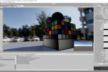
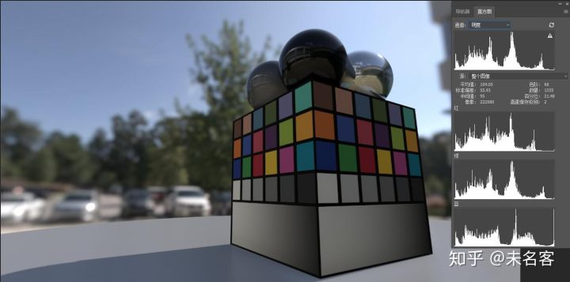
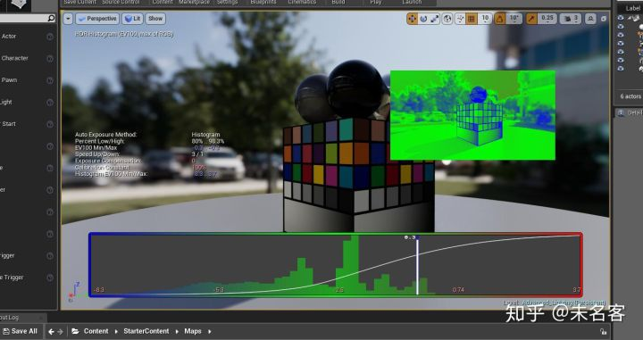
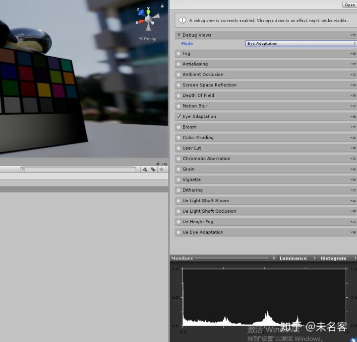
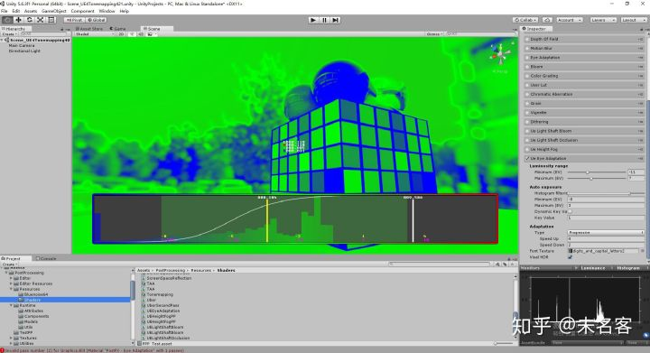

# UE4ToUnity】自动曝光Histogram


上一篇文章总结了UE4 中Tonemap，ColorGrade的实现，其实Unity PostProcess 中有着极为类似的实现，都是ACES....有兴趣的小伙伴可以看一下Unity 的实现，顺便可以和UE4 对比一下差异~

[未名客：【UE4ToUnity】ColorGrade&Tonemap](https://zhuanlan.zhihu.com/p/75200070)




(https://zhuanlan.zhihu.com/p/75200070)

## 一、背景概述

与Tonemap 最有关联的后处理便是自动曝光了，简单来说，Tonemap 的存在，即使我们对SceneColor 乘一个较大的值，再用Tonemap 矫正，都会得到一个比较平滑的结果。这个“值”就是简单的理解为曝光值。

如果当前屏幕亮度整体很暗，我们希望提高画面亮度，就可以给一个比较大的曝光值，假设屏幕整体很亮，希望降低亮度，可以给一个比较小的曝光值。自动曝光就是，根据场景SceneColor的亮度，自动计算一个曝光值，达到上述的需求。

那么问题来了，如何自动计算曝光值？

其实从上文的描述中就可以总结出来，自动曝光的曝光值与“SceneColor的整体亮度”有关，我们一般用平均亮度描述，或者说是中灰值。平均亮度的计算方法有很多，以前最常见的方法是，对SceneColor  做DownSample，一路DownSample  下来，最后得到一个1x1的颜色，这个颜色就是场景的中灰值。这种方法简单粗暴，但是并不准确，已经慢慢被遗弃，现在主流的做法，是计算场景亮度的柱状图Histogram，并根据柱状图求平均亮度，以求达到一个更为准确的结果。

## 二、计算亮度直方图

整体思路上UE4  和Unity的做法非常类似，但是也有不同，Unity的实现简洁明了，UE4 参杂了一些的“黑科技”，但是导致整体代码晦涩难懂。我先从Unity  这边总结整套算法的具体流程，然后会简单指出一些UE4 的做法，最后给出UE4 VisualHDR 的实现，也就是标题图，来结束这篇文章。

最核心都是要计算一个类似PS 中的明度直方图，只不过，为了性能考虑，不能有这么多的采样点。





首先，HDR 空间下的颜色范围是无限的，我们需要缩小这个范围，毕竟场景屏幕上的颜色大部分都是一个比较”合理的“可控的值。然后对这个颜色值求亮度，量化这个亮度，使它由连续变离散，确定有限采样次数，比如64次，这样我们就表示出了柱状图x轴的意义。

完成了上面的步骤，就可以遍历场景屏幕上的每一个像素，计算柱状图的Y轴，也就是说，对于x轴上的亮度，屏幕上有多少个相关的像素。

流程很简单，现在简单来看一下两个引擎的具体实现。

### 2.1 Unity 实现

因为比较懒，没有升级Unity，以及PostProcessSteck， 就一PPS Ver1 为例，来简单介绍一下吧。Shader的实现在下面这个文件里：

Assets\PostProcessing\Resources\Shaders\EyeHistogram.compute 

Script的实现在：

Assets\PostProcessing\Runtime\Components\EyeAdaptationComponent.cs 

```cpp
// Put the following line to 0 or comment it to disable vignette weighting
#define USE_VIGNETTE_WEIGHTING 1

#include "Common.cginc"
#include "EyeAdaptation.cginc"

RWStructuredBuffer<uint> _Histogram;
Texture2D<float4> _Source;

CBUFFER_START(Params)
    float4 _ScaleOffsetRes; // x: scale, y: offset, z: width, w: height
CBUFFER_END

groupshared uint gs_histogram[HISTOGRAM_BINS];

#pragma kernel KEyeHistogram
[numthreads(HISTOGRAM_THREAD_X,HISTOGRAM_THREAD_Y,1)]
void KEyeHistogram(uint2 dispatchThreadId : SV_DispatchThreadID, uint2 groupThreadId : SV_GroupThreadID)
{
    // Pretty straightforward implementation of histogram gathering using atomic ops.
    // I tried a few methods (no atomic ops / heavy LDS leveraging) but this one turned out to be
    // the fastest on desktop (Nvidia - Kepler/Maxwell) and PS4. Still need to try it on GCN/desktop
    // but considering it runs very fast on PS4 we can expect it to run well (?).

    const uint localThreadId = groupThreadId.y * HISTOGRAM_THREAD_X + groupThreadId.x;

    // Clears the shared memory
    if (localThreadId < HISTOGRAM_BINS)
        gs_histogram[localThreadId] = 0u;

    GroupMemoryBarrierWithGroupSync();

    // Gather local group histogram
    if (dispatchThreadId.x < (uint)_ScaleOffsetRes.z && dispatchThreadId.y < (uint)_ScaleOffsetRes.w)
    {
#if USE_VIGNETTE_WEIGHTING
        // Vignette weighting to put more focus on what's in the center of the screen
        float2 uv01 = float2(dispatchThreadId) / float2(_ScaleOffsetRes.z, _ScaleOffsetRes.w);
        float2 d = abs(uv01 - (0.5).xx);
        float vfactor = Pow2(saturate(1.0 - dot(d, d)));
        uint weight = (uint)(64.0 * vfactor);
#else
        uint weight = 1u;
#endif

        float3 color = _Source[dispatchThreadId].xyz;
        float luminance = Max3(color); // Looks more natural than using a Rec.709 luminance for some reason
        float logLuminance = GetHistogramBinFromLuminance(luminance, _ScaleOffsetRes.xy);
        uint idx = (uint)(logLuminance * (HISTOGRAM_BINS - 1u));
        InterlockedAdd(gs_histogram[idx], weight);
    }

    GroupMemoryBarrierWithGroupSync();

    // Merge everything
    if (localThreadId < HISTOGRAM_BINS)
        InterlockedAdd(_Histogram[localThreadId], gs_histogram[localThreadId]);
}

float GetHistogramBinFromLuminance(float value, float2 scaleOffset)
{
    return saturate(log2(value) * scaleOffset.x + scaleOffset.y);
}

float GetLuminanceFromHistogramBin(float bin, float2 scaleOffset)
{
    return exp2((bin - scaleOffset.y) / scaleOffset.x);
}
```

Script部分：

```csharp
Vector4 GetHistogramScaleOffsetRes()
{
    var settings = model.settings;
    float diff = settings.logMax - settings.logMin;
    float scale = 1f / diff;
    float offset = -settings.logMin * scale;
    return new Vector4(scale, offset, Mathf.Floor(context.width / 2f), Mathf.Floor(context.height / 2f));
}

public Texture Prepare(RenderTexture source, Material uberMaterial)
{
    ...
    // Downscale the framebuffer, we don't need an absolute precision for auto exposure and it
    // helps making it more stable
    var scaleOffsetRes = GetHistogramScaleOffsetRes();

    var rt = context.renderTextureFactory.Get((int)scaleOffsetRes.z, (int)scaleOffsetRes.w, 0, source.format);
    Graphics.Blit(source, rt);

    ...
    
    m_HistogramBuffer.SetData(s_EmptyHistogramBuffer);

    // Gets a log histogram
    int kernel = m_EyeCompute.FindKernel("KEyeHistogram");
    m_EyeCompute.SetBuffer(kernel, "_Histogram", m_HistogramBuffer);

    m_EyeCompute.SetTexture(kernel, "_Source", rt);
    m_EyeCompute.SetVector("_ScaleOffsetRes", scaleOffsetRes);
    m_EyeCompute.Dispatch(kernel, Mathf.CeilToInt(rt.width / (float)k_HistogramThreadX), Mathf.CeilToInt(rt.height / (float)k_HistogramThreadY), 1);

    ...
}
```

y = log2(x)

就是一个非常常规的ComputeShader，挑几个关键点，简单说一下：

1. 为了优化，并没有在全分辨下计算，而是在半分率下进行的：把SceneColor Blit 到一张1/2分辨率的rt 下。
2. 一个线程对应一个像素
3. 使用y = log2(x) ，把较大范围的线性HDR 颜色，映射到一个小范围。
4. 使用 LogMin，和LogMax 确定有效颜色，也就是柱状图的最小最大值，参数可调。
5. 对LogMin-LogMax中间的值做64次采样，就是柱状图中x轴的取值范围。

- gs_histogram[HISTOGRAM_BINS] 表示组内共享像素的 零度Count。
- RWStructuredBuffer<uint> _Histogram; 表示合并各个组最终输出的结果

Shader 总共三个阶段

1. 首先对gs_histogram 初始化
2. 转换颜色，计算组内结果，可以做类似Vignet 的加权平均，也可以每个像素权重值一样。
3. 合并各组结果

### 2.2 UE4 实现

相较于Unity，UE4 实现的非常绕，我感觉，它这么做的主要为了性能，和准确性，但是导致代码有点晦涩难懂，实话说，我也只知道个大概，简单说说我理解的地方。

涉及到的Shader文件：

- PostProcessHistogramCommon.ush
- PostProcessHistogramReduce.usf
- PostProcessHistogram.usf

核心内容在PostProcessHistogram.usf shader 里面。

```text
#include "Common.ush"
#include "PostProcessCommon.ush"
#include "PostProcessHistogramCommon.ush"

// xy:GatherExtent, zw : unused
float4 HistogramParameters;

// Output histogram texture (UAV)
RWTexture2D<float4> HistogramRWTexture;


//
uint2 ThreadGroupCount;
//
uint2 LeftTopOffset;

// THREADGROUP_SIZEX*THREADGROUP_SIZEY histograms of the size HISTOGRAM_SIZE
groupshared float SharedHistogram[HISTOGRAM_SIZE][THREADGROUP_SIZEX][THREADGROUP_SIZEY];

[numthreads(THREADGROUP_SIZEX, THREADGROUP_SIZEY, 1)]	// dimx,dimy,dimz
void MainCS(
	uint3 GroupId : SV_GroupID,
	uint3 DispatchThreadId : SV_DispatchThreadID,	// DispatchThreadId = GroupId * int2(dimx,dimy) + GroupThreadId
    uint3 GroupThreadId : SV_GroupThreadID,	// 0..THREADGROUP_SIZEX 0..THREADGROUP_SIZEY
	uint GroupIndex: SV_GroupIndex) // SV_GroupIndex = SV_GroupThreadID.z*dimx*dimy + SV_GroupThreadID.y*dimx + SV_GroupThreadID.x
{
	// todo: can be cleared more efficiently
	// clear all THREADGROUP_SIZEX*THREADGROUP_SIZEY histograms
	UNROLL for(uint i = 0; i < HISTOGRAM_SIZE; ++i)
	{
		SharedHistogram[i][GroupThreadId.x][GroupThreadId.y] = 0.0f;
	}
	 
	GroupMemoryBarrierWithGroupSync();

	uint2 TileSize = uint2(LOOP_SIZEX, LOOP_SIZEY);
	uint2 LeftTop = DispatchThreadId.xy * TileSize + LeftTopOffset;

	uint2 GatherExtentInt = (uint2)HistogramParameters.xy + (uint2)LeftTopOffset.xy;

	// accumulate all pixels into THREADGROUP_SIZEX*THREADGROUP_SIZEY histograms
	{
		LOOP for(uint y = 0; y < LOOP_SIZEY; ++y)
		{
			LOOP for(uint x = 0; x < LOOP_SIZEX; ++x)
			{
				uint2 Tile = uint2(x, y);
				uint2 TexelPos = LeftTop + Tile;

				if(TexelPos.x < GatherExtentInt.x && TexelPos.y < GatherExtentInt.y)
				{
					float4 SceneColor = PostprocessInput0.Load(int3(TexelPos, 0));
	#if USE_PREEXPOSURE
					SceneColor.xyz *= View.OneOverPreExposure;
	#endif
					float LuminanceVal = max(SceneColor.r, max(SceneColor.g, SceneColor.b));
					float LogLuminance = ComputeHistogramPositionFromLuminance(LuminanceVal);
			
					float fBucket = saturate(LogLuminance) * (HISTOGRAM_SIZE - 1) * 0.9999f;

					uint Bucket0 = (uint)(fBucket);
					uint Bucket1 = Bucket0 + 1;

					float Weight1 = frac(fBucket);
					float Weight0 = 1.0f - Weight1;
			
					// accumulate the weight to the nearby history buckets
					if (Bucket0 != 0)
					{
						SharedHistogram[Bucket0][GroupThreadId.x][GroupThreadId.y] += Weight0;
					}
					SharedHistogram[Bucket1][GroupThreadId.x][GroupThreadId.y] += Weight1;
				}
			}
		}
	}

	GroupMemoryBarrierWithGroupSync();

	// accumulate all histograms into one
	if(GroupIndex < HISTOGRAM_SIZE / 4) 
	{
		float4 Sum = 0;

		LOOP for(uint y = 0; y < THREADGROUP_SIZEY; ++y)
		{
			LOOP for(uint x = 0; x < THREADGROUP_SIZEX; ++x)
			{
				Sum += float4(
					SharedHistogram[GroupIndex * 4 + 0][x][y],
					SharedHistogram[GroupIndex * 4 + 1][x][y],
					SharedHistogram[GroupIndex * 4 + 2][x][y],
					SharedHistogram[GroupIndex * 4 + 3][x][y]);
			}
		}

		float2 MaxExtent = float2(THREADGROUP_SIZEX * LOOP_SIZEX, THREADGROUP_SIZEY * LOOP_SIZEY);
		float Area = MaxExtent.x * MaxExtent.y;
	
		// doesn't take borders into account but the error should be minor
		float NormalizeFactor = 1.0f / Area;

		// output texture with one histogram per line, x and y unwrapped into all the lines
		HistogramRWTexture[uint2(GroupIndex, GroupId.x + GroupId.y * ThreadGroupCount.x)] = Sum * NormalizeFactor;
	}
}
```

相关代码：

- PostProcessHistogramReduce.h
- PostProcessHistogramReduce.cpp
- PostProcessHistogram.h
- PostProcessHistogram.cpp

UE4 和Unity 一样，都是在半分辨率上计算的。

Shader 流程和Unity 类似，大体思路是一样的，只是在具体细节上，UE4 有许多自己的想法，比较难懂的地方：

UE4  的每个线程并不对应一个像素，而是8*8个像素， 它的一个线程，类似一个8*8的“2D线程组”，在shader  中就是，每一个线程，都有一个嵌套的for 循环。相较于，Unity groupshared uint  gs_histogram[HISTOGRAM_BINS]，这样也导致组内共享的这个像素Count 统计，由Unity的一维，变成了3维。

而且比较麻烦的是，看起来，它对8*8的像素，做了很多边界上的判定，来保证尽可能的准确？

但是它是有优点，在与分配的线程组少了很多。

除此之外，实在是想不清出为啥要这么做.....代码看起来，非常吃力，再没有了解到它这么真正的原因前，打算还是这部分还是先弃坑吧...

而且....在这一步的后面，还做了一步HistgramReduce 操作....

言归正传， 差不多，到了这一步，直方图的步骤就全部完成了，其实结果就是一个一维数组。接下来就是怎么使用它。

## 三、使用亮度直方图

有了亮度直方图，剩下的就是一些简单的内容了，简单过一下即可。

以Unity为例：它的用法在EyeAdaptation.shader 中。

```text
// Done in the vertex shader
float FindMaxHistogramValue()
{
    uint maxValue = 0u;

    for (uint i = 0; i < HISTOGRAM_BINS; i++)
    {
        uint h = _Histogram[i];
        maxValue = max(maxValue, h);
    }

    return float(maxValue);
}

void FilterLuminance(uint i, float maxHistogramValue, inout float4 filter)
{
    float binValue = GetBinValue(i, maxHistogramValue);

    // Filter dark areas
    float offset = min(filter.z, binValue);
    binValue -= offset;
    filter.zw -= offset.xx;

    // Filter highlights
    binValue = min(filter.w, binValue);
    filter.w -= binValue;

    // Luminance at the bin
    float luminance = GetLuminanceFromHistogramBin(float(i) / float(HISTOGRAM_BINS), _ScaleOffsetRes.xy);

    filter.xy += float2(luminance * binValue, binValue);
}

float GetAverageLuminance(float maxHistogramValue)
{
    // Sum of all bins
    uint i;
    float totalSum = 0.0;

    UNITY_LOOP
    for (i = 0; i < HISTOGRAM_BINS; i++)
        totalSum += GetBinValue(i, maxHistogramValue);

    // Skip darker and lighter parts of the histogram to stabilize the auto exposure
    // x: filtered sum
    // y: accumulator
    // zw: fractions
    float4 filter = float4(0.0, 0.0, totalSum * _Params.xy);

    UNITY_LOOP
    for (i = 0; i < HISTOGRAM_BINS; i++)
        FilterLuminance(i, maxHistogramValue, filter);

    // Clamp to user brightness range
    return clamp(filter.x / max(filter.y, EPSILON), _Params.z, _Params.w);
}
float4 FragAdaptProgressive(VaryingsDefault i) : SV_Target
{
    float maxValue = 1.0 / FindMaxHistogramValue();
    float avgLuminance = GetAverageLuminance(maxValue);
    float exposure = GetExposureMultiplier(avgLuminance);
    float prevExposure = tex2D(_MainTex, (0.5).xx);
    exposure = InterpolateExposure(exposure, prevExposure);
    return exposure.xxxx;
}

float4 FragAdaptFixed(VaryingsDefault i) : SV_Target
{
    float maxValue = 1.0 / FindMaxHistogramValue();
    float avgLuminance = GetAverageLuminance(maxValue);
    float exposure = GetExposureMultiplier(avgLuminance);
    return exposure.xxxx;
}
```

- 1、计算最大亮度，然后求平均亮度
- 2、对平均亮度做修正，以求结果更稳，这里引入了 ：lowPercent、 highPercent、minBrightness、maxBrightness四个辅助量
- 3、有了平均亮度，就可以算曝光值了=1 / avgLuminance，但是到了这一步，为了场景调节方便，还会引入一个类似曝光补偿的值keyValue
- 4、更新曝光值，有两种方式：1、FixedExposure，2、ProgressiveExposure，就是中间平滑过度了一下。

UE4 的话，是在PostProcessTonemap.usf 中使用的：

VS 中采样贴图，PS 中使用，直接乘到Color上。

```text
)
{
.....
LinearColor *= ExposureScale;
.....
}
```

## 四 监控屏幕颜色VisualHDR

其实到了这一步，整个自动曝光就完成了。不过UE4  更进一步，实现了一套VisualHDR。因为在HDR  空间下，我们根本没法用肉眼根据屏幕的颜色，来判断场景实际的颜色，因为经过了Tonemap，也许你看到屏幕上一块比较白的地方，它实际的值可能成百上千。当然你可以说，不做Tonemap，不做伽马校正，直接输出HDR颜色....那么你将看到一片一片的白色.....

其实Unity 有个类似的界面，显示自动曝光亮度直方图，但是比起UE4的来说，确实逊色多了，不多想，抄过来吧。相关代码如下：

UE4 : PostProcessVisualizeHDR.usf




这是UE4 的




这是Unity的，比起来太简陋了




改造一下，标题图Get~


后话：

1、写完以后，突然觉得这篇文章有点水，明明是FromUE2Unity，中间大段的内容全是Unty的囧....其实思路到了就成，实在没有功夫研究UE4 Hisgram 这部分的具体实现，花费的时间成本太高...最近加班累成狗啊😄

2、写这篇文章时，我用的是UE4   4.21版本，其实这个功能去年？还是前年我已经做完了....然后惊奇的发现，这个调试界面居然变了....算了就这样吧，其实写这个系列的目的，是想把以前做过的东西，简单总结一下，把东西总结完以后，就可以全心全意，研究下一代引擎啦。

3、最后打个广告，其实我以前是在CSDN 那边的 ( ╯□╰ )，不过印象中已经很久很久没有更新过了....

[https://blog.csdn.net/u011707076](https://link.zhihu.com/?target=https%3A//blog.csdn.net/u011707076)[blog.csdn.net](https://link.zhihu.com/?target=https%3A//blog.csdn.net/u011707076)

好了，又一个23：05分，下篇文章再见吧~