# 【UE4ToUnity】LightShaft


今天水一篇比较简单的文章：UE4 的LightShaft。

UE4   中的LightShaft，其实有个比较常见的叫法，GodRay，本质就是一个径向模糊，在体积光出来之前，使用非常广泛，因为是个纯屏幕空间的做法，它的消耗小，但是需要太阳在屏幕上，出了屏幕就没有这种效果了，现在随着硬件越来越强悍，大家对画面要求越来越高，这种做法慢慢开始被真正的体积光替换啦。

网上有关GodRay 实现的文章有很多，今天我们就来看看UE4 的实现方式。

UE4  里面有两种LightShaft，简单来说，一种是扯白线的LightShaftBloom，一种是扯黑线的Light Shaft  Occlusion，他们都只支持平行光，不支持点光源，聚光灯，虽然UE4的代码已经实现了后面两种光源的算法.....就不追究它的原因了，我们今天也只实现平行光。

UE4 涉及到的文件：

- LightShaftRendering.cpp
- LightShaftShader.usf

今天内容很简单，大致做个浏览，看两张中间结果的图片，就溜啦溜啦~

两种LS 都是在一个Shader 中就实现了，简单吧，我把涉及到的三个PS 先放出来，下面就对两种使用的PASS 做个简单介绍。

```text
void DownsampleLightShaftsPixelMain(
 float2 InUV : TEXCOORD0,
 float3 ScreenVector : TEXCOORD1,
 out float4 OutColor : SV_Target0
 )
{

 OutColor = 1;

#if OCCLUSION_TERM

 float SceneDepth = CalcSceneDepth(InUV);

 float2 NormalizedCoordinates = (InUV - UVMinMax.xy) / UVMinMax.zw;
 // Setup a mask that is 1 at the edges of the screen and 0 at the center
 float EdgeMask = 1.0f - NormalizedCoordinates.x * (1.0f - NormalizedCoordinates.x) * NormalizedCoordinates.y * (1.0f - NormalizedCoordinates.y) * 8.0f;
 EdgeMask = EdgeMask * EdgeMask * EdgeMask * EdgeMask;

  float InvOcclusionDepthRange = LightShaftParameters.x;
  // Filter the occlusion mask instead of the depths
  float OcclusionMask = saturate(SceneDepth * InvOcclusionDepthRange);
  // Apply the edge mask to the occlusion factor
  OutColor.x = max(OcclusionMask, EdgeMask);

#else
 float3 SceneColor = CalcSceneColor(InUV);
 float SceneDepth = CalcSceneDepth(InUV);

 float2 NormalizedCoordinates = (InUV - UVMinMax.xy) / UVMinMax.zw;
 // Setup a mask that is 1 at the edges of the screen and 0 at the center
 float EdgeMask = 1.0f - NormalizedCoordinates.x * (1.0f - NormalizedCoordinates.x) * NormalizedCoordinates.y * (1.0f - NormalizedCoordinates.y) * 8.0f;
 EdgeMask = EdgeMask * EdgeMask * EdgeMask * EdgeMask;

 // Only bloom colors over BloomThreshold
 float Luminance = max(dot(SceneColor, half3(.3f, .59f, .11f)), 6.10352e-5);
 float AdjustedLuminance = max(Luminance - BloomTintAndThreshold.a, 0.0f);
 float3 BloomColor = LightShaftParameters.y * SceneColor / Luminance * AdjustedLuminance * 2.0f;

 float InvOcclusionDepthRange = LightShaftParameters.x;

 // Only allow bloom from pixels whose depth are in the far half of OcclusionDepthRange
 float BloomDistanceMask = saturate((SceneDepth - .5f / InvOcclusionDepthRange) * InvOcclusionDepthRange);
 // Setup a mask that is 0 at TextureSpaceBlurOrigin and increases to 1 over distance
 float BlurOriginDistanceMask = 1.0f - saturate(length(TextureSpaceBlurOrigin.xy - InUV * AspectRatioAndInvAspectRatio.zw) * 2.0f);
 // Calculate bloom color with masks applied
 OutColor.rgb = BloomColor * BloomTintAndThreshold.rgb * BloomDistanceMask * (1.0f - EdgeMask) * BlurOriginDistanceMask * BlurOriginDistanceMask;
#endif
}

void BlurLightShaftsMain(
 float2 InUV : TEXCOORD0,
 out float4 OutColor : SV_Target0
 )
{
 float3 BlurredValues = 0;
 // Scale the UVs so that the blur will be the same pixel distance in x and y
 float2 AspectCorrectedUV = InUV * AspectRatioAndInvAspectRatio.zw;
 // Increase the blur distance exponentially in each pass
 float PassScale = pow(.4f * NUM_SAMPLES, RadialBlurParameters.z);
 float2 AspectCorrectedBlurVector = (TextureSpaceBlurOrigin.xy - AspectCorrectedUV)
  // Prevent reading past the light position
  * min(RadialBlurParameters.y * PassScale, 1);

 float2 BlurVector = AspectCorrectedBlurVector * AspectRatioAndInvAspectRatio.xy;

 UNROLL
 for (int SampleIndex = 0; SampleIndex < NUM_SAMPLES; SampleIndex++)
 {
  float2 SampleUVs = (AspectCorrectedUV + AspectCorrectedBlurVector * SampleIndex / (float)NUM_SAMPLES) * AspectRatioAndInvAspectRatio.xy;
  // Needed because sometimes the source texture is larger than the part we are reading from
  float2 ClampedUVs = clamp(SampleUVs, UVMinMax.xy, UVMinMax.zw);
  float3 SampleValue = Texture2DSample(SourceTexture, SourceTextureSampler, ClampedUVs).xyz;
  BlurredValues += SampleValue;
 }
	
 OutColor.rgb = BlurredValues / (float)NUM_SAMPLES;
 OutColor.a = 1;
}

void FinishOcclusionMain(
 float2 InUV : TEXCOORD0,
 out float4 OutColor : SV_Target0
 )
{
 float LightShaftOcclusion = Texture2DSample(SourceTexture, SourceTextureSampler, InUV).x;
	
 // LightShaftParameters.w is OcclusionMaskDarkness, use that to control what an occlusion value of 0 maps to
 float FinalOcclusion = lerp(LightShaftParameters.w, 1, LightShaftOcclusion * LightShaftOcclusion);
 // Setup a mask based on where the blur origin is
 float BlurOriginDistanceMask = saturate(length(TextureSpaceBlurOrigin.xy - InUV * AspectRatioAndInvAspectRatio.zw) * .2f);
 // Fade out occlusion over distance away from the blur origin
 FinalOcclusion = lerp(FinalOcclusion, 1, BlurOriginDistanceMask);
 // Fade to no darkening based on distance from the light for point lights
 FinalOcclusion = lerp(FinalOcclusion, 1, DistanceFade * DistanceFade * DistanceFade);
	
 OutColor = float4(FinalOcclusion, 1, 1, 1);
}
```

## 一 . LightShftBloom

```text
void FDeferredShadingSceneRenderer::RenderLightShaftBloom(FRHICommandListImmediate& RHICmdList)
{
	if (DoesViewFamilyAllowLightShafts(ViewFamily))
	{
		TRefCountPtr<IPooledRenderTarget> LightShafts0;
		TRefCountPtr<IPooledRenderTarget> LightShafts1;

		for (TSparseArray<FLightSceneInfoCompact>::TConstIterator LightIt(Scene->Lights); LightIt; ++LightIt)
		{
			const FLightSceneInfo* const LightSceneInfo = LightIt->LightSceneInfo;

			if (LightSceneInfo->bEnableLightShaftBloom)
			{
				bool bWillRenderLightShafts = false;

				for (int ViewIndex = 0; ViewIndex < Views.Num(); ViewIndex++)
				{
					FViewInfo& View = Views[ViewIndex];

					if (ShouldRenderLightShaftsForLight(View, LightSceneInfo))
					{
						bWillRenderLightShafts = true;
					}
				}

				if (bWillRenderLightShafts)
				{
					// Allocate light shaft render targets on demand, using the pool
					AllocateOrReuseLightShaftRenderTarget(RHICmdList, LightShafts0, TEXT("LightShafts0"));
					AllocateOrReuseLightShaftRenderTarget(RHICmdList, LightShafts1, TEXT("LightShafts1"));

					for (int ViewIndex = 0; ViewIndex < Views.Num(); ViewIndex++)
					{
						FViewInfo& View = Views[ViewIndex];

						SCOPED_DRAW_EVENTF(RHICmdList, RenderLightShaftBloom, TEXT("RenderLightShaftBloom %dx%d"), View.ViewRect.Width(), View.ViewRect.Height());

						if (ShouldRenderLightShaftsForLight(View, LightSceneInfo))
						{
							INC_DWORD_STAT(STAT_LightShaftsLights);

							// Generate the bloom source from scene color, masked by depth and downsampled
							DownsamplePass<false>(RHICmdList, View, LightSceneInfo, LightShafts0, LightShafts1);

							FSceneViewState* ViewState = (FSceneViewState*)View.State;
							FTemporalAAHistory* HistoryState = nullptr;

							if (ViewState)
							{
								// Find the previous frame's bloom source for this light
								HistoryState = &ViewState->LightShaftBloomHistoryRTs.FindOrAdd(LightSceneInfo->Proxy->GetLightComponent());
							}

							TRefCountPtr<IPooledRenderTarget> HistoryOutput;

							// Apply temporal AA to the occlusion mask
							// Result will be in HistoryOutput
							ApplyTemporalAA(RHICmdList, View, TEXT("LSBloomHistory"), HistoryState, LightShafts0, HistoryOutput);

							// Apply radial blur passes
							// Send HistoryOutput in as the first pass input only, so it will not be overwritten by any subsequent passes, since it is needed for next frame
							ApplyRadialBlurPasses(RHICmdList, View, LightSceneInfo, HistoryOutput, LightShafts0, LightShafts1);
						
							// Add light shaft bloom to scene color in full res
							ApplyLightShaftBloom(RHICmdList, View, *this, LightSceneInfo, LightShafts0);
						}
					}
				}
			}
		}
	}
}
```

RenderLightShaftBloom() 函数是LightShaftBloom的入口函数，其实这个函数写的很清楚了，LightShaftBloom 简单来说总共有4个步骤：

1. DownSample
2. TemporalAA
3. RadialBlur
4. ApplyLightShaftBloom

比较重点的是DownSample和RadialBlur，先说这两个。

### 1.1Down Sample Pass

  对应的是shader 重点DownsampleLightShaftsPixelMain函数，是对SceneColor  原图将分辨率，并且按照规则过滤掉一些图片里的像素。过滤规则里面写的很清楚，比如类似Vignnet  越接近图片中心越亮，越边缘越暗，还有给一个阈值，过滤掉比给定阈值亮度低的颜色，还有一个距离参数。

<iframe allowfullscreen="" src="https://www.zhihu.com/video/1142198430557515776?autoplay=false&amp;useMSE=" frameborder="0"></iframe>

DownSample 出来的结果


### 1.2 RadialBlur

其实得到第一步DownSample的结果，我们可以直接做径向模糊了，也就是RdialBlur。

这个对应的是Shader  中  BlurLightShaftsMain（）函数。就是常规的模糊算法，里面比较有意思，需要注意到的地方是，确定中心，其实对应到我们使用的情况来说，就是要求太阳对应屏幕的屏幕坐标。至于模糊的力度，UE4  默认，一遍模糊采样12次，一共模糊三遍，每一遍模糊长度递增。

原图+三遍模糊的结果:

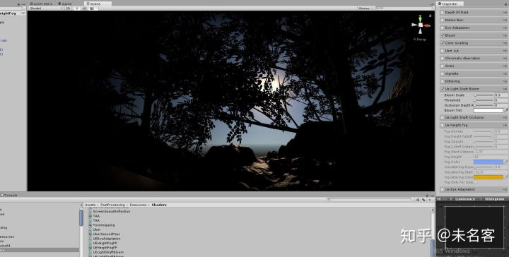

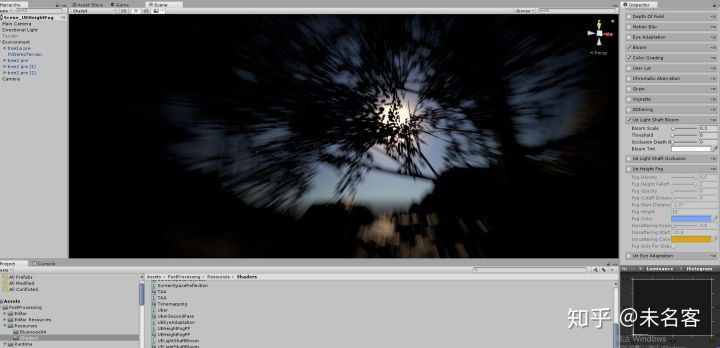

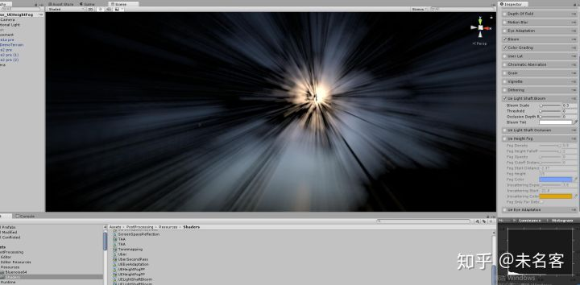

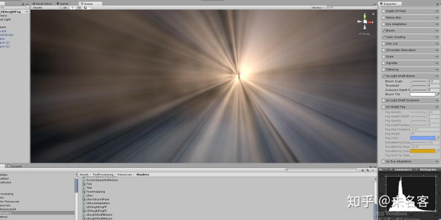

ok，这两个步骤解释清楚，TAA 是单独的一个后期，这里不多做介绍，至于最后一个pass，ApplyLightShaftBloom，就是全分辨率下，采样最后一次模糊的图，是的就这么简单~

### 1.3 LightShaftBloom 的使用

使用方式，UE4 里面是直接加到了SceneColor 上，直接相加，过一个边Tonemp，在给个颜色囧....

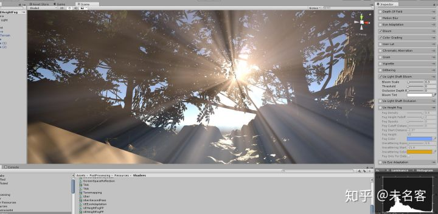

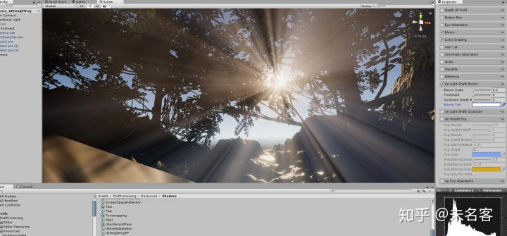

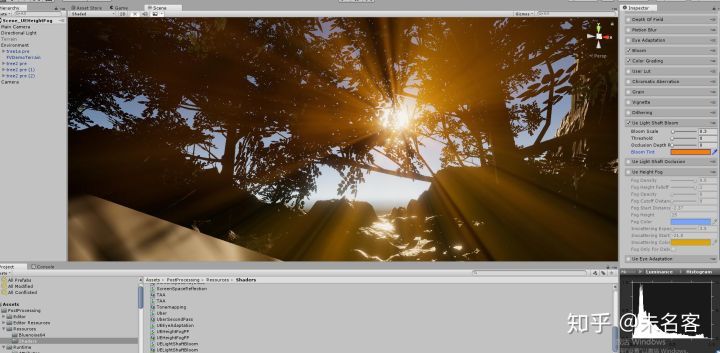

在PS 中很好做类似的效果，就是一个径向模糊的滤镜：

原图：+ 径向模糊的效果：

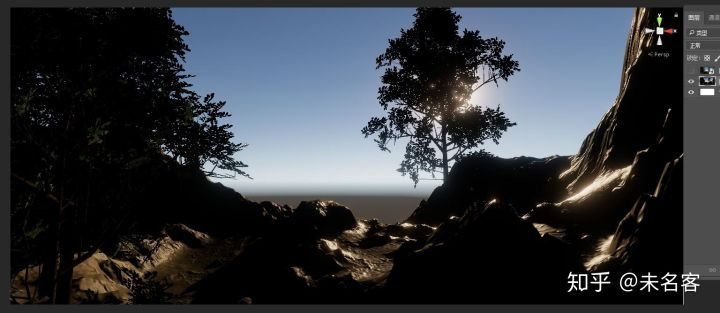

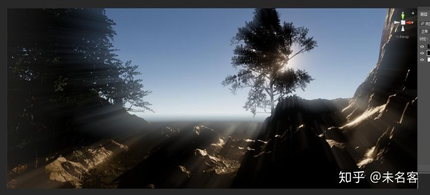

## 二、LightShaftOcclusion

cpp 文件：

```text
/** Renders light shafts. */
void FDeferredShadingSceneRenderer::RenderLightShaftOcclusion(FRHICommandListImmediate& RHICmdList, FLightShaftsOutput& Output)
{

    xxxxxxxxxxxxxxxxx

    SCOPED_DRAW_EVENTF(RHICmdList, RenderLightShaftOcclusion, TEXT("RenderLightShaftOcclusion %dx%d (multiple passes)"), View.ViewRect.Width(), View.ViewRect.Height());

    if (ShouldRenderLightShaftsForLight(View, LightSceneInfo))
    {
        INC_DWORD_STAT(STAT_LightShaftsLights);

        // Create a downsampled occlusion mask from scene depth, result will be in LightShafts0
        DownsamplePass<true>(RHICmdList, View, LightSceneInfo, LightShafts0, LightShafts1);

        FSceneViewState* ViewState = (FSceneViewState*)View.State;
        // Find the previous frame's occlusion mask
        TRefCountPtr<IPooledRenderTarget> HistoryOutput;

        // Apply temporal AA to the occlusion mask
        // Result will be in HistoryOutput
        ApplyTemporalAA(RHICmdList, View, TEXT("LSOcclusionHistory"), ViewState ? &ViewState->LightShaftOcclusionHistory : nullptr, LightShafts0, HistoryOutput);

        // Apply radial blur passes
        // Send HistoryOutput in as the first pass input only, so it will not be overwritten by any subsequent passes, since it is needed for next frame
        ApplyRadialBlurPasses(RHICmdList, View, LightSceneInfo, HistoryOutput, LightShafts0, LightShafts1);

        // Apply post-blur masking
        FinishOcclusionTerm(RHICmdList, View, LightSceneInfo, LightShafts0, LightShafts1);

        //@todo - different views could have different result render targets
        Output.LightShaftOcclusion = LightShafts1;
    }

}
```

四个阶段：

1. DownSample
2. TAA
3. RadialBlur
4. FinishOcclusion

Occlusion 与Bloom 非常像，其实更简单，因为它没有颜色，想法就是，Occlusion这边出一张黑白图，最后乘到一个比较亮的图上，比如雾效图上。

这里就不具体展开了。看一眼结果吧~

原图：

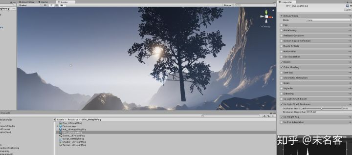

DownSample+三遍模糊后：

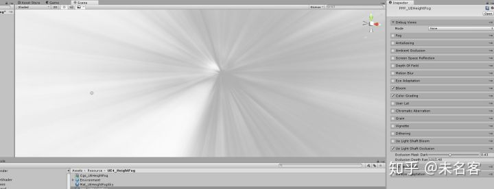

想乘，最终结果：

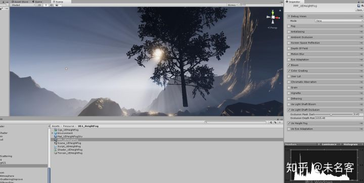

哦啦~ 随便调一调，标题图Get~


今天这篇文章有点太水了...因为实在也没啥可以说的，就这样咯~ 下篇文章再见


发布于 2019-08-06