# Unity3D Shader:装液体的瓶子

我们将按照步骤来实现这一效果

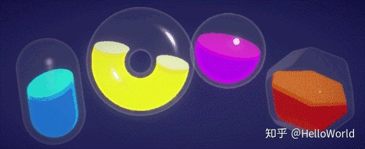效果图


首先我们先不去实现原来效果中的晃动效果，先实现做一个静止的瓶子

先简单分析一下这个效果，我们需要用到两个pass，一个pass用于绘制液体的效果，另一个pass用来绘制瓶子的效果


首先setup一下我们的场景，新建一个胶囊体，新建一个shader，命名为LiquidBottle，打上一束平行光, 然后我们在shader中增加两个变量 _MainColor 以及_FillAmount

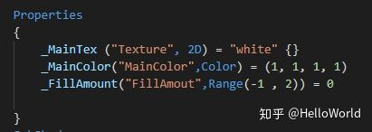

_MainColor 将作为我们液体的主色调,_FillAmount将决定了装多少液体.


接下来我们需要根据_FillAmount得到液体的横截面的位置,我们可以使用顶点的坐标来获取到,

```text
 struct appdata
            {
                float4 vertex : POSITION;
                float2 uv : TEXCOORD0;

               
            };

            struct v2f
            {
                float2 uv : TEXCOORD0;
                UNITY_FOG_COORDS(1)
                float4 vertex : SV_POSITION;
                float fillEdge : TEXCOORD1;
            };

            sampler2D _MainTex;
            float4 _MainTex_ST;

            float4 _MainColor;
            float _FillAmount;

            v2f vert (appdata v)
            {
                v2f o;
                o.vertex = UnityObjectToClipPos(v.vertex);
                o.uv = TRANSFORM_TEX(v.uv, _MainTex);
                UNITY_TRANSFER_FOG(o,o.vertex);
                o.fillEdge=mul(unity_ObjectToWorld,v.vertex.xyz).y+_FillAmount;
                return o;
            }

            fixed4 frag (v2f i) : SV_Target
            {
                // sample the texture
                fixed4 col = tex2D(_MainTex, i.uv) * _MainColor;
                // apply fog
                UNITY_APPLY_FOG(i.fogCoord, col);
                return float4(i.fillEdge,i.fillEdge,i.fillEdge,1);
            }
```

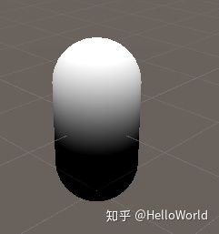

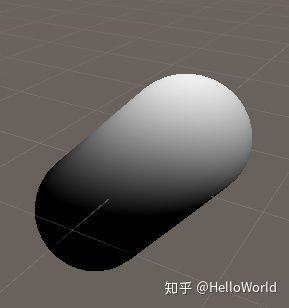

之后我们就可以得到这样一张渐变的效果,然而我们却不需要这样的渐变效果,我们想到的0到1之间的硬切换效果,step函数可以为我们提供这样的效果

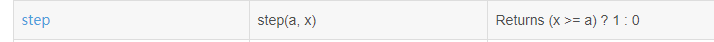

我们修改一下我们的frag函数

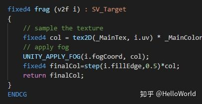

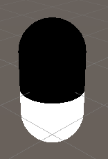

我们得到了这样的新的过渡效果,

然后我们可以使用Blend SrcAlpha OneMinusSrcAlpha来增加透明的效果,将黑色变成透明色

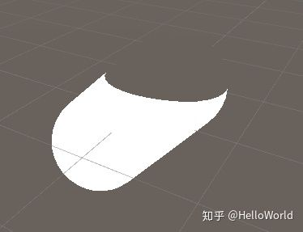

下面我们需要一层液体上层的效果,原理就是在原来step减去一个范围小一点的step,就会得到一个光环 ,我们新申请两个变量_EdgeWidth用于液体的泡沫层的厚度,_TopColor用来区分上层的颜色

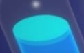

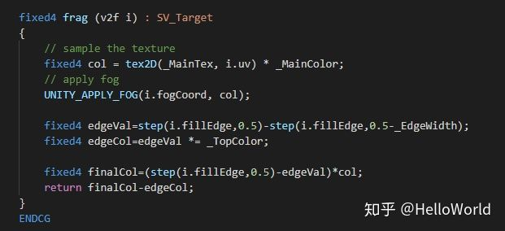

得到了新的带圆环的效果

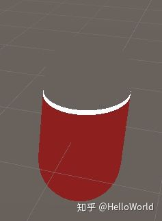

下面我们来实现最上层的液体平面效果,它其实是一种正反面的效果,这里用到了fixed facing : VFace 来实现,我们要使用双面材质需要使用Cull OFF

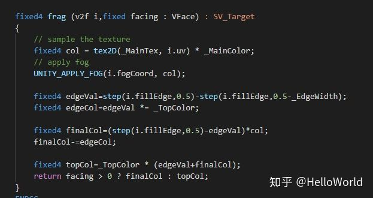

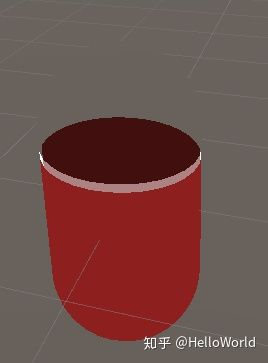


第二个Pass就比较简单,将模型沿着法线方向扩大,和外描边的shader类似

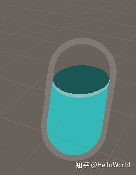


```text
Pass
        {
            Blend SrcAlpha OneMinusSrcAlpha
            CGPROGRAM
            #pragma vertex vert
            #pragma fragment frag
            // make fog work
            #pragma multi_compile_fog

            #include "UnityCG.cginc"

            struct appdata
            {
                float4 vertex : POSITION;
                float2 uv : TEXCOORD0;
                float4 normal : NORMAL;
            };

            struct v2f
            {
                float2 uv : TEXCOORD0;
                UNITY_FOG_COORDS(1)
                float4 vertex : SV_POSITION;
            };

            float4 _BottleColor;
            float _BottleWidth;

            v2f vert (appdata v)
            {
                v2f o;
                v.vertex.xyz+=v.normal.xyz*_BottleWidth;
                o.vertex = UnityObjectToClipPos(v.vertex);
                o.uv = v.uv;
                UNITY_TRANSFER_FOG(o,o.vertex);
                return o;
            }

            fixed4 frag (v2f i,fixed facing : VFace) : SV_Target
            {
                // sample the texture
                fixed4 col = _BottleColor;
                // apply fog
                UNITY_APPLY_FOG(i.fogCoord, col);

              
                return col;
            }
            ENDCG
        }
```

下面我们就可以添加一些光照效果,比如边缘发光和高光效果,使得看上去更加晶莹剔透

我们首先加入边缘发光，边缘发光的原理就是计算物体的法线方向和实现法向的点积，点积的几何意义就是计算两个向量的垂直程度，当两个向量垂直的时候就返回0，相同方向的时候就返回1，相反方向就返回-1，那在模型越边缘就越垂直。

```text
 o.viewDir=normalize(ObjSpaceViewDir(v.vertex));
```

我们可以通过这一行来获得该点的视线方向，然后我们在frag中计算法线与视线防线的点积，并输出颜色看看效果

```text
float dotVal = dot(i.normal, i.viewDir);
return float4(dotVal,dotVal,dotVal,1);
```

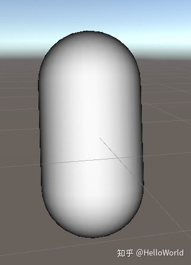

可以发现效果反了，我们稍微改一下

```text
float dotVal = dot(i.normal, i.viewDir);
return float4(dotVal,dotVal,dotVal,1);
```

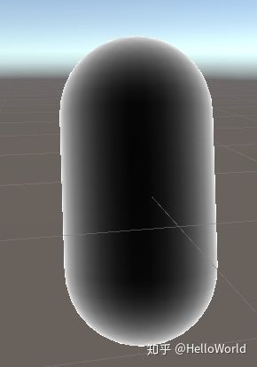

下面我们就需要缩小白色的范围

```text
float dotVal = 1- pow(dot(i.normal, i.viewDir),0.3);
float4 rimCol=_RimColor*smoothstep(0.5,1,dotVal);
```

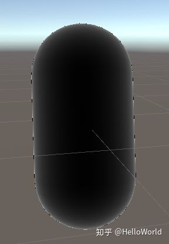

我们把边缘色和原先的颜色相加

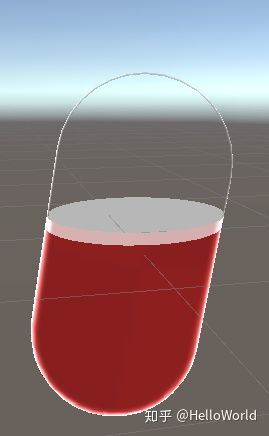

同样瓶子加入一样的边缘发光效果

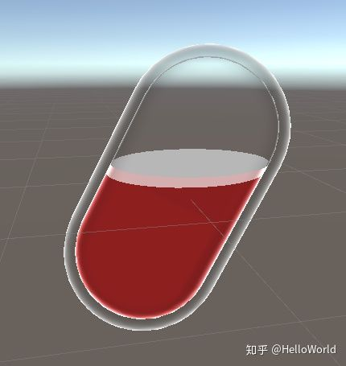

下面我们来加入高光的效果，高光的效果同样用到点积，高光实际上就是物体表面法线方向与光线方向的点积


未完待续...


目前为止的全部代码

```text
Shader "Custom/LiquidBottle"
{
    Properties
    {
        _MainTex ("Texture", 2D) = "white" {}
        _MainColor("MainColor",Color) = (1, 1, 1, 1)
        _TopColor("TopColor",Color) = (1, 1, 0, 1)
        _FillAmount("FillAmout",Range(-1 , 2)) = 0
        _EdgeWidth("EdgeWidth",Range(0 , 1)) = 0.2

        _BottleWidth("BottleWidth",Range(0,1)) = 0.2
        _BottleColor("BottleColor",Color) = (1,1,1,1)

        _RimColor("RimColor",Color)=(1,1,1,1)
        _RimWidth("RimWidth",float)=0.2

    }
    SubShader
    {
        Tags { "RenderType"="Opaque" }
        LOD 100

        Pass
        {
            Cull OFF
            AlphaToMask on
            //ZWrite On
            Blend SrcAlpha OneMinusSrcAlpha
            CGPROGRAM
            #pragma vertex vert
            #pragma fragment frag
            // make fog work
            #pragma multi_compile_fog

            #include "UnityCG.cginc"

            struct appdata
            {
                float4 vertex : POSITION;
                float2 uv : TEXCOORD0;
                float3 normal : NORMAL;
               
            };

            struct v2f
            {
                float2 uv : TEXCOORD0;
                UNITY_FOG_COORDS(1)
                float4 vertex : SV_POSITION;
                float fillEdge : TEXCOORD1;
                float3 viewDir : COLOR;
                float3 normal : COLOR2;
            };

            sampler2D _MainTex;
            float4 _MainTex_ST;

            float4 _MainColor;
            float _FillAmount;
            float4 _TopColor;
            float _EdgeWidth;

            float4 _RimColor;
            float _RimWidth;

            v2f vert (appdata v)
            {
                v2f o;
                o.vertex = UnityObjectToClipPos(v.vertex);
                o.uv = TRANSFORM_TEX(v.uv, _MainTex);
                UNITY_TRANSFER_FOG(o,o.vertex);
                o.fillEdge=mul(unity_ObjectToWorld,v.vertex.xyz).y+_FillAmount;
                o.normal=v.normal;
                o.viewDir=normalize(ObjSpaceViewDir(v.vertex));
                return o;
            }

            fixed4 frag (v2f i,fixed facing : VFace) : SV_Target
            {
                // sample the texture
                fixed4 col = tex2D(_MainTex, i.uv) * _MainColor;
                // apply fog
                UNITY_APPLY_FOG(i.fogCoord, col);

                float dotProduct = 1-pow(dot(i.normal, i.viewDir),_RimWidth);
                float4 rimCol=_RimColor*smoothstep(0.5,1,dotProduct);

                fixed4 edgeVal=step(i.fillEdge,0.5)-step(i.fillEdge,0.5-_EdgeWidth);
                fixed4 edgeCol=edgeVal *= _TopColor*0.9;

                fixed4 finalVal=step(i.fillEdge,0.5)-edgeVal;
                fixed4 finalCol=finalVal*col;
                finalCol+=edgeCol+rimCol;

                 fixed4 topCol=_TopColor * (edgeVal+finalVal);
                // float dotVal = 1- pow(dot(i.normal, i.viewDir),0.3);
                // return float4(dotVal,dotVal,dotVal,1);
                return facing > 0 ? finalCol : topCol;
            }
            ENDCG
        }

        Pass
        {
            //Cull Front
            Blend SrcAlpha OneMinusSrcAlpha
            CGPROGRAM
            #pragma vertex vert
            #pragma fragment frag
            // make fog work
            #pragma multi_compile_fog

            #include "UnityCG.cginc"

            struct appdata
            {
                float4 vertex : POSITION;
                float2 uv : TEXCOORD0;
                float4 normal : NORMAL;
            };

            struct v2f
            {
                float2 uv : TEXCOORD0;
                UNITY_FOG_COORDS(1)
                float4 vertex : SV_POSITION;
                float3 viewDir : COLOR;
                float3 normal :NORMAL;
            };

            float4 _BottleColor;
            float _BottleWidth;

            float4 _RimColor;
            float _RimWidth;

            v2f vert (appdata v)
            {
                v2f o;
                v.vertex.xyz+=v.normal.xyz*_BottleWidth;
                o.vertex = UnityObjectToClipPos(v.vertex);
                o.uv = v.uv;
                UNITY_TRANSFER_FOG(o,o.vertex);
                o.normal=v.normal.xyz;
                o.viewDir=normalize(ObjSpaceViewDir(v.vertex));

                return o;
            }

            fixed4 frag (v2f i,fixed facing : VFace) : SV_Target
            {
                // sample the texture
                fixed4 col = _BottleColor;
                // apply fog
                UNITY_APPLY_FOG(i.fogCoord, col);

                float dotProduct = 1-pow(dot(i.normal, i.viewDir),_RimWidth);//1-pow(dot(i.normal, i.viewDir),_RimWidth/10);
                float4 rimCol=_RimColor*smoothstep(0.2,1,dotProduct);
              
                return rimCol;
            }
            ENDCG
        }
    }
}
```