# 卡通渲染基本光照模型的实现

## 一、第一批

**前言**

本系列的目的是探索游戏中NPR渲染技术的细节处理。因为《重力眩晕2》这款游戏中的卡通渲染效果很具有代表性且技术上有一定的深度，也很好地还原了二次元的美术风格，于是我以此为线索，在逐步复现其中的渲染效果的同时，对卡通渲染的技术细节进行一定的探索和总结。

本文是对《重力眩晕2》中的卡通渲染效果的一些预览。在接下来的文章中，我会逐一去思考和实现。本文没有技术实现的内容，主要是对后续的文章做一个规划。

**目录**

1. 轮廓线

\2. 皮肤的光照效果

\3. 布料的表现

\4. 金属材质的表现

\5. 眼睛材质

\6. 一些特殊的效果


**1. 轮廓线**

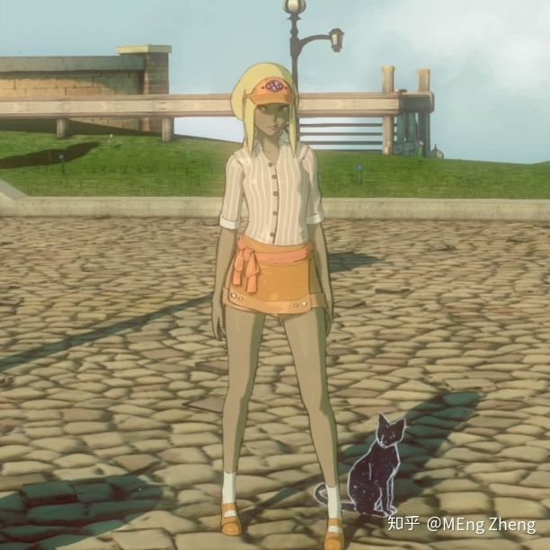图1

图2

这里特意截了物体到屏幕距离不同的图片。这里可看出几个细节：

（1）轮廓线的粗细度并没有因物体到屏幕的距离发生明显的改变。如果我们简单用正面剔除的方法进行描边（即在第二遍绘制的时候，在顶点着色器中让顶点坐标沿法线方向延伸一小段距离，然后进行正面剔除以实现描边的效果），由于顶点向外延伸的距离是相对物体坐标系的一个系数，这个距离一样会参与投影变换的计算，结果是到屏幕的距离近的物体的轮廓线会很粗。（图3为一个简单的正面剔除outline的实现效果，轮廓线的粗细度会受到物体距屏幕距离的影响，图3是我下载的High_Noon大神在GitHub上的demo）

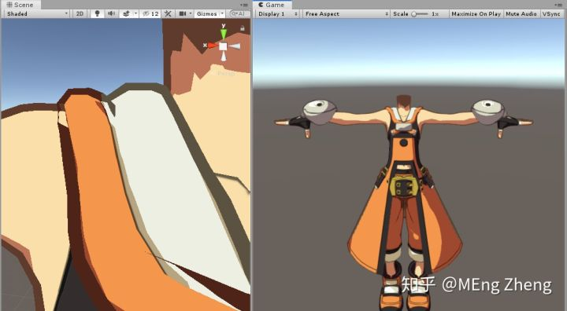图3

（2）《重力眩晕2》中轮廓线的粗细度不是固定的，加粗了需要遮蔽的部分；其次，轮廓线不是完全连续的。轮廓线的渲染效果非常符合手绘的线条效果。

此外脸部的轮廓线可以观察到其他特殊的细节处理：

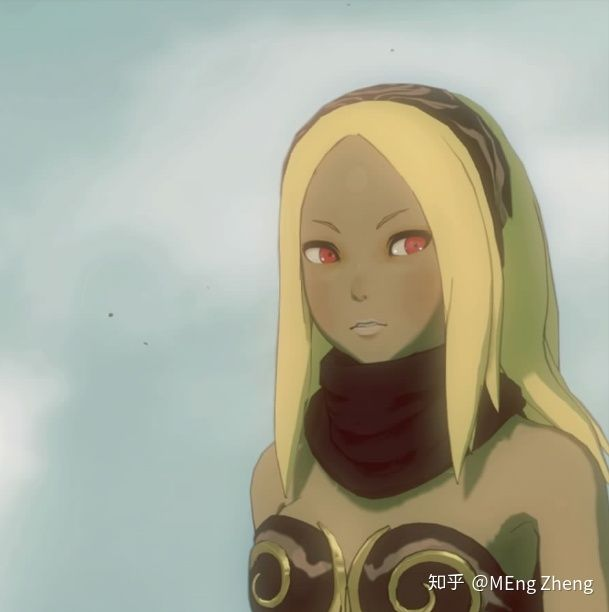图4

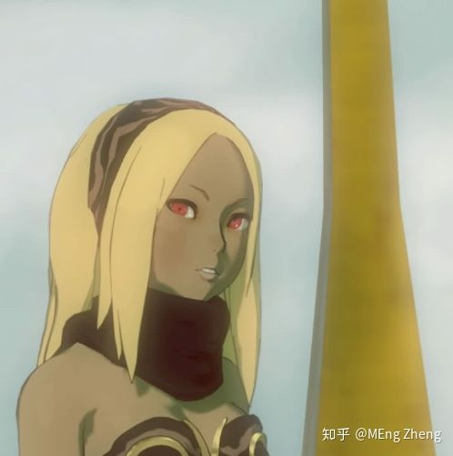图5

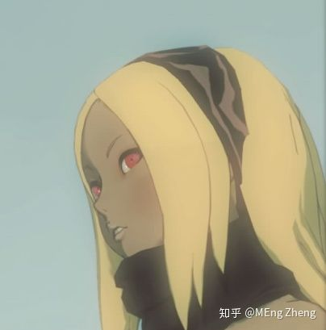图6

（3）嘴角的轮廓线是有加重的。

（4）鼻子部分，嘴唇部分的轮廓线是有特殊的处理的，在一些特定的角度下会出现，效果非常符合美术的要求。

关于描边的抗锯齿：

（5）《重力眩晕2》中轮廓线的抗锯齿处理得非常好，一般利用正面剔除实现outline，或利用屏幕空间的边缘检查实现轮廓线的话，轮廓线会因为欠采样产生非常明显的锯齿效应（例如下图，图7为KurtzPel的截图，可能是使用了MLAA的抗锯齿处理，轮廓线会有明显的模糊）。

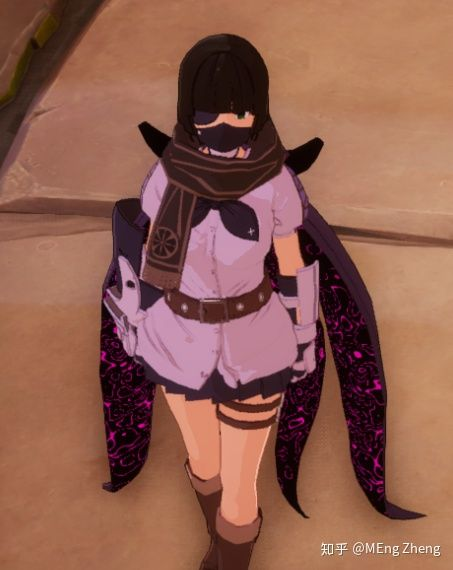图7

总结一下轮廓线的部分，可以看出《重力眩晕2》在轮廓线的渲染上是做了大量的细节处理，很好地还原了二次的美术风格，技术实现的深度是非常值得探究的。

**2. 皮肤的光照效果**

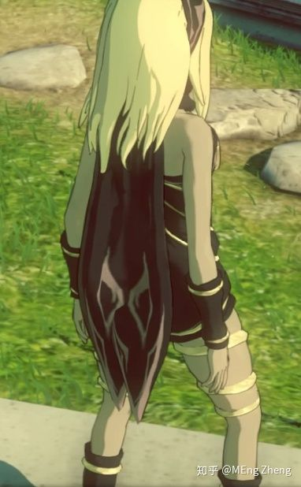图8

（1）与简单的明暗分层不同的是，《重力眩晕2》中的明暗交界有非常平滑的过渡（对比图7），这种过渡也不同于美漫风格的渲染（美漫风格的渲染以Lambert模型为主）。且明暗交界线部分的亮度是比暗面更暗的，以这种方式来强调明暗交界线。另外明暗过渡带的范围大小不是固定的，在过渡平滑的网格位置明暗过渡带较宽，此外，过渡带的范围大小在同一区域甚至存在各向异性。

图9

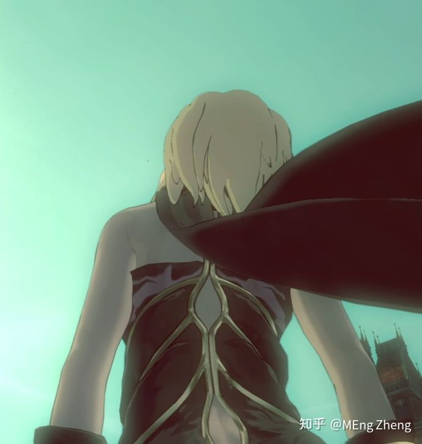图10

（2）逆光下的皮肤光照效果，利用了侧光面的镜面反射来强调轮廓（类似于菲涅尔的效果）；当视角发生改变（图10与图9相机仰角不同），侧光位置的镜面反射的范围随之改变，且过渡区平滑。

（3）逆光下物体边缘使用了环境色的泛光。

**3. 布料的表现**

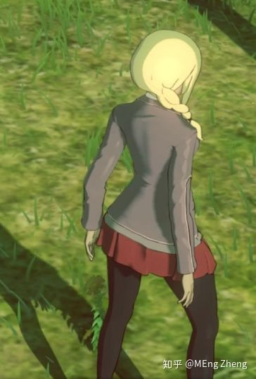图11

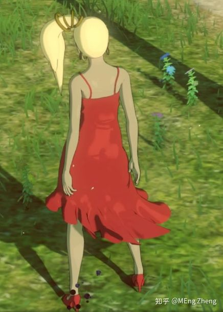图12

（1）图9，图11可以看出，暗面对布料褶皱的表现是非常精细的。

（2）图11，图12可以看到对布料上由菲涅尔效应产生的高光的表现。

**4. 金属材质的表现**

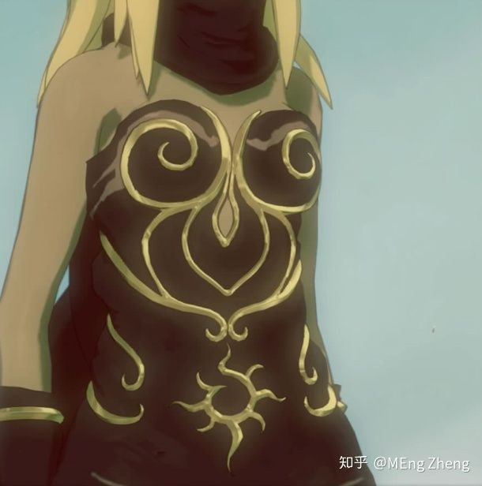图13

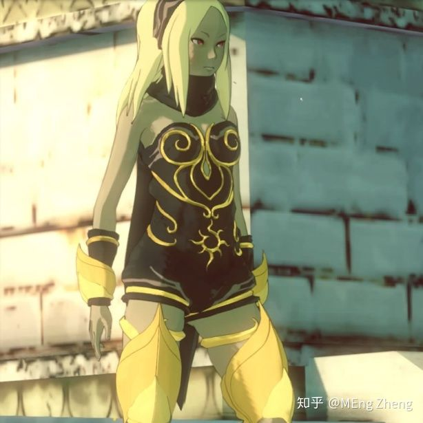图14

（1）凯特的服装上有大量金属部分，图13,14为其金属的各向异性效果的表现。

（2）图13中金属附加了泛光效果。

**5. 眼睛**

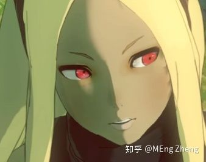图15

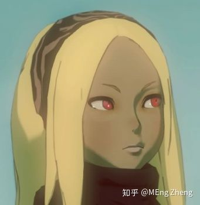图16

（1）非常符合二次美术风格的眼睛效果，虹膜上计算了两个高光点。

（2）眼球表面使用了CubeMap的采样来表现眼球表面光滑的效果。

**6. 一些特殊的效果**

达斯缇（猫）的渲染效果

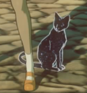图17

图18

（1）达斯缇的轮廓线可以看出是用法线和视线的夹角做边缘检测来实现的，但是仔细观察其夹角和轮廓线亮度的映射关系，更像是一个翻转的GGX法线分布函数的形状的一个函数。

（2）达斯缇表面的着色是利用CubeMap采样实现的（PS4截动图不是很方便，达斯缇表面的纹理会随观察方向发生平移）。

凯特重力模式下的渲染效果：

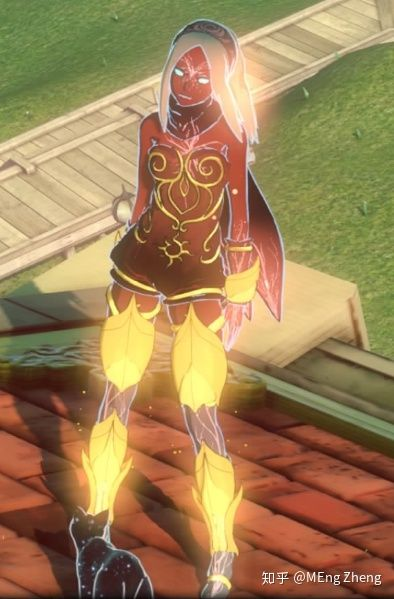图19

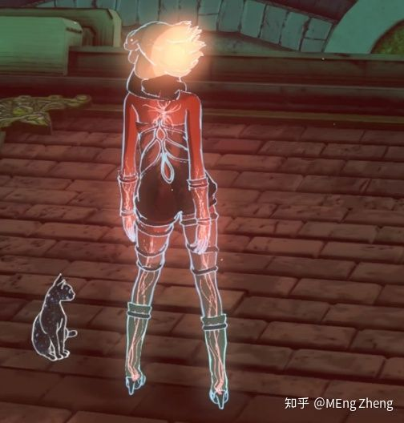图20

（1）轮廓线自发光，同达斯缇效果的第一点。

（2）凯特体内能量回路的效果

（3）头发有类似次表面散射的发光效果

（4）泛光效果


**总结**

本文为本系列的开篇，对重力眩晕2中的渲染效果做了一个概览，无法面面俱到，为之后的文章做了一个初步的规划。更加系统的技术实现细节的探索会在接下来的文章逐步展开。


## 二、实现

## **前言**

本文作为本专栏

[Unity复现《重力眩晕2》中的渲染技术](https://zhuanlan.zhihu.com/c_1183802694685433856)

的第一篇技术实现帖，本文将在unity实现一个基本的卡通渲染的光照模型。**本文暂时不使用任何纹理**，只是先把光照模型实现一下，也暂时不对金属材质做特殊处理。之后的文章中，只要将光照的系数乘上纹理的采样结果即可。特别的，一些用于遮蔽的纹理本文也暂时不使用。

## **目录**

1. 轮廓线的实现
2. 卡通光照模型漫反射部分
3. 光照模型物理化重构
4. 卡通光照模型物理向高光
5. 添加菲涅尔项
6. 明暗交界线部分的额外处理
7. 抗锯齿


## **1. 轮廓线的实现**

首先,我们按照《GGXrd SIGN》的outline的思路先实现一个基本的轮廓线。

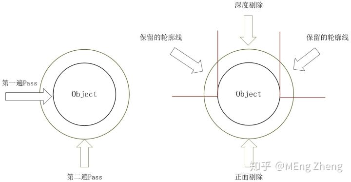

基本思路是，对一个物体做两边遍渲染，用第二遍渲染来实现轮廓线。在第二遍渲染的时候开启正面剔除，在顶点着色器中把顶点沿法线向外延伸一段距离（放大物体）。那么挡在物体前面的部分不会显示，被物体挡住的由于深度剔除也不会显示，就只有轮廓的部分会被保留下来。但这里要注意的是，画轮廓线应该放在第二个Pass进行。如果把两个Pass的顺序调换，当然渲染的结果是一样的，但由于物体部分的像素会被绘制两遍而降低性能。如果把轮廓线放在第二个Pass，可以利用深度测试节省这部分性能。

那么在Unity里放一个球来试一下。我一般喜欢用球来做最开始的着色器调试，因为球的表面均匀分布了所有方向的法线。这里先创建一个unity的Standard的PBR shader给球的材质。然后在subshader的最后加上画轮廓线的Pass。

```glsl
Pass{
		Name "OUTLINE"
		Tags{ "LightMode" = "Always" }
		Cull Front
		ZWrite On
		ColorMask RGB
		Blend SrcAlpha OneMinusSrcAlpha

		CGPROGRAM
			#pragma vertex vert
			#pragma fragment frag

			#include "UnityCG.cginc"
			struct appdata {
				float4 vertex : POSITION;
				float3 normal : NORMAL;
				float4 texCoord : TEXCOORD0;

			};

			struct v2f {
				float4 pos : SV_POSITION;
				float4 color : COLOR;
				float4 tex : TEXCOORD0;
			};

			half _OutlineWidth;
			fixed4 _OutlineColor;

			v2f vert(appdata v) {
			// just make a copy of incoming vertex data but scaled according to normal direction
			v2f o;
			o.pos = UnityObjectToClipPos(v.vertex);
			float3 norm = mul((float3x3)UNITY_MATRIX_IT_MV, v.normal);
			float2 extendDir = normalize(TransformViewToProjection(norm.xy));
			o.pos.xy += extendDir * (_OutlineWidth * 0.1);

			o.tex = v.texCoord;

			o.color = _OutlineColor;
			return o;
		}

			half4 frag(v2f i) :COLOR {
				return i.color;
			}

		ENDCG

		}//Pass
```

顶点着色器中将投影到投影空间的顶点坐标向投影空间的法线方向做一段延伸。注意将法线变换到投影空间要乘以transform的转置逆再乘projection矩阵，这样法线不会受到非等比缩放的影响。然后我们看看效果。

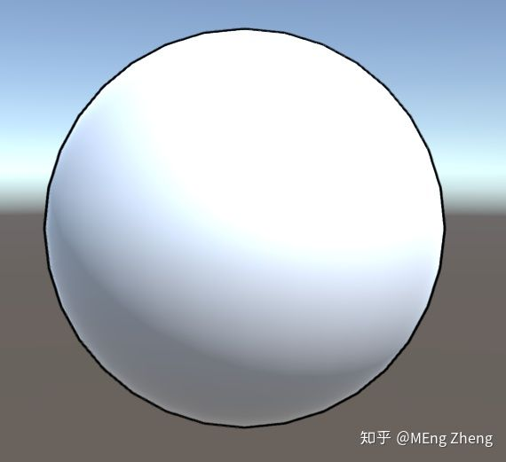

基本实现了一个描边的效果，但是在不同深度下仔细观察还是有一些问题。

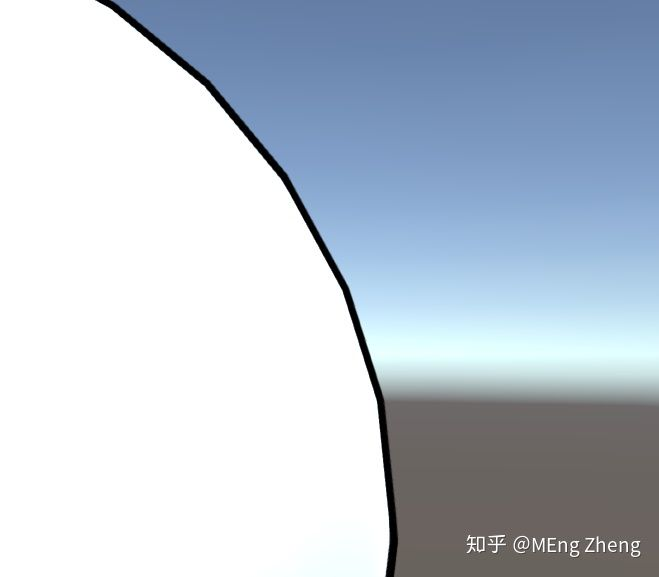

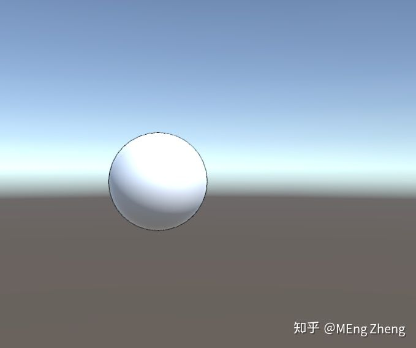

可以看到，当把摄像头拉进，轮廓线会很粗，摄像头拉远，轮廓线会很细。但是在本专栏的【01】开篇里我们看到，重力眩晕2里的轮廓线是不会随深度而改变的。也就是现在的效果并不是我想要的。我这里解释一下原因及解决办法。

讲原因之前，我们首先来看投影空间：[投影空间详解](https://link.zhihu.com/?target=http%3A//www.songho.ca/opengl/gl_projectionmatrix.html)

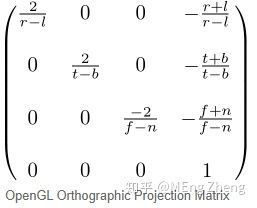

一个顶点坐标的四个值（x,y,z,w），x，y表示投影空间下的横纵坐标，z表示投影空间下的深度值，w等于z，w用于做归一化。

```glsl
o.pos = UnityObjectToClipPos(v.vertex);
```

也就是说，顶点着色器的这行坐标变换得到的x，y的范围是(-w, w)。当在屏幕上做栅格化的时候，管线会将x，y的坐标值除以w就能得到（-1,  1）范围的坐标（ndc）。我们希望得到的是显示在屏幕上的固定宽度的轮廓线，那么顶点向外延伸的距离应该是ndc空间下的固定距离，而不是投影空间下的固定距离。于是我在投影空间下做计算的时候只要将轮廓线宽度乘上w值，再后续的计算中，管线会将坐标值除以w，得到的仍然是人为设定的轮廓线宽度。

将该行代码替换：

```glsl
o.pos.xy += extendDir * (o.pos.w * _OutlineWidth * 0.1);
```

然后我们看下效果。

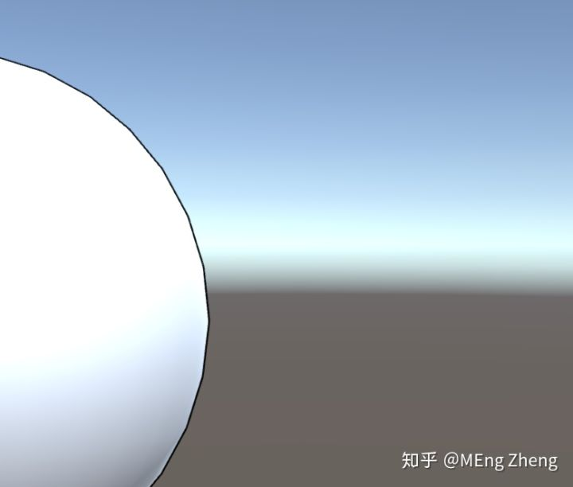

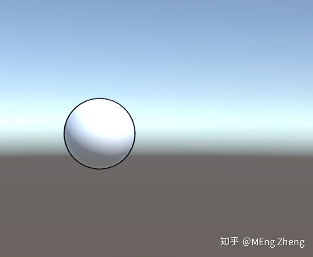

ok，轮廓线的宽度不会随深度改变了，这正是我想要的效果。上两张图轮廓线宽度_OutlineWidth 设的是0.05。

但这样还不够，本专栏【01】开篇中提到，重力眩晕中的轮廓线不是固定宽度的，它通过轮廓线宽度的变化来表现手绘的线条效果。

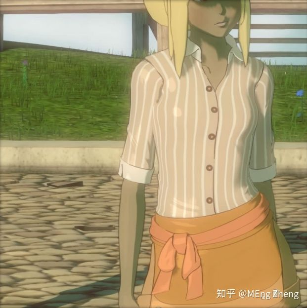

《重力眩晕2》中这个效果的实现可能利用了纹理来写入线条的宽度或者一些遮蔽信息，但是我暂时没去给自己down的模型画额外的纹理。那我暂时用一个简单方法来实现线条的粗细变化。我这里引入柏林噪声（Perlin Noise），柏林噪声的特点是不会剧烈变化。下面这个柏林噪声的发生函数是我从别的帖子上拿过来的，我找不到出处了，这里暂时就不注明了。

```glsl
	float2 hash22(float2 p) {
		p = float2(dot(p, float2(127.1, 311.7)), dot(p, float2(269.5, 183.3)));
		return -1.0 + 2.0 * frac(sin(p) * 43758.5453123);
	}

	float2 hash21(float2 p) {
		float h = dot(p, float2(127.1, 311.7));
		return -1.0 + 2.0 * frac(sin(h) * 43758.5453123);
	}

	//perlin
	float perlin_noise(float2 p) {
		float2 pi = floor(p);
		float2 pf = p - pi;
		float2 w = pf * pf * (3.0 - 2.0 * pf);
		return lerp(lerp(dot(hash22(pi + float2(0.0, 0.0)), pf - float2(0.0, 0.0)),
			dot(hash22(pi + float2(1.0, 0.0)), pf - float2(1.0, 0.0)), w.x),
			lerp(dot(hash22(pi + float2(0.0, 1.0)), pf - float2(0.0, 1.0)),
				dot(hash22(pi + float2(1.0, 1.0)), pf - float2(1.0, 1.0)), w.x), w.y);
	}
```

然后把这个噪声作用到线条宽度上。

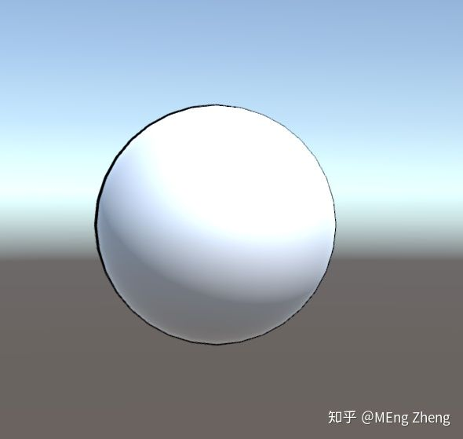

这样一来轮廓线的宽度就会有变化，线条不至于显得太死板。 通过调节Perlin Noise的Tilling和offset可以调节轮廓线宽度的变化程度。

轮廓线部分Pass的代码:

```glsl
	Pass{
		Name "OUTLINE"
		Tags{ "LightMode" = "Always" }
		Cull Front
		ZWrite On
		ColorMask RGB
		Blend SrcAlpha OneMinusSrcAlpha

		CGPROGRAM
			#pragma vertex vert
			#pragma fragment frag

			#include "UnityCG.cginc"
			struct appdata {
				float4 vertex : POSITION;
				float3 normal : NORMAL;
				float4 texCoord : TEXCOORD0;

			};

			struct v2f {
				float4 pos : SV_POSITION;
				float4 color : COLOR;
				float4 tex : TEXCOORD0;
			};

			uniform half _OutlineWidth;
			uniform fixed4 _OutlineColor;
			uniform half4 _NoiseTillOffset;
			uniform half _NoiseAmp;

			v2f vert(appdata v) {
			// just make a copy of incoming vertex data but scaled according to normal direction
			v2f o;
			o.pos = UnityObjectToClipPos(v.vertex);
			float3 norm = mul((float3x3)UNITY_MATRIX_IT_MV, v.normal);
			float2 extendDir = normalize(TransformViewToProjection(norm.xy));

			float2 noiseSampleTex = v.texCoord;
			noiseSampleTex = noiseSampleTex * _NoiseTillOffset.xy + _NoiseTillOffset.zw;
			float nosieWidth = perlin_noise(noiseSampleTex);
			nosieWidth = nosieWidth * 2 - 1;	// ndc Space (-1, 1)

			half outlineWidth = _OutlineWidth + _OutlineWidth * nosieWidth * _NoiseAmp;

			o.pos.xy += extendDir * (o.pos.w * outlineWidth * 0.1);

			o.tex = v.texCoord;

			o.color = _OutlineColor;
			return o;
		}

			half4 frag(v2f i) :COLOR {
				return i.color;
			}

		ENDCG

	}//Pass
```

套用到其他模型上看一下效果。

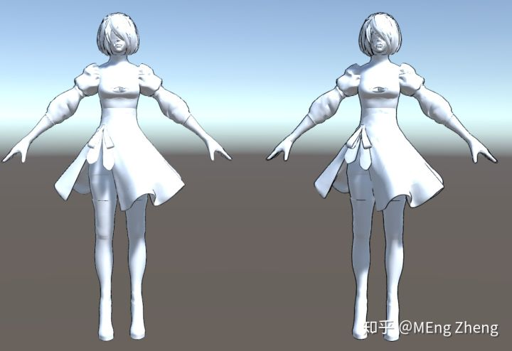

左图是加入了柏林噪声的轮廓线。

另外，利用环境遮蔽的纹理来加粗轮廓线的部分，我会在之后的文章中补充实现。


## **2.卡通光照模型漫反射部分**

漫反射亮度采用Lambert模型，再进行阈值化。也就是利用光线和法线的点积作为亮度强弱的判据，然后大于某一个阈值，则显示最亮的颜色，否则判断第二个阈值，以此类推。这里先偷懒用surface shader实现一下。改写surface部分的代码。

```glsl
#pragma surface surf Toon fullforwardshadows
...
half4 LightingToon(ToonSurfaceOutput s, half3 lightDir, half3 viewDir, half atten) {
        half4 c;

	half3 nNormal = normalize(s.Normal);
	float3 reflectDir = reflect(-viewDir, s.Normal);

	half NoL = dot(nNormal, lightDir) + _ShadowAttWeight * (atten - 1);
	half3 HDir = normalize(lightDir + viewDir);
	half NoH = Pow2(dot(nNormal, HDir)) + _ShadowAttWeight * (atten - 1);
	half VoN = dot(nNormal, viewDir);
	half VoL = dot(viewDir, lightDir);
	half VoH = dot(viewDir, HDir) + _ShadowAttWeight * 2 * (atten - 1);


	half Intensity = (NoL > _DividLineH) ? 1.0 : (NoL > _DividLineM) ? 0.8 : (NoL > _DividLineD) ? 0.5 : 0.3;

	c = half4(s.diffColor.rgb, s.Alpha) * half4(Intensity.xxx, 1.0) * half4(_LightColor0.rgb, 1.0);
	return c;

}
void surf(Input IN, inout ToonSurfaceOutput o)
{
	// Albedo comes from a texture tinted by color
	fixed4 c = tex2D(_MainTex, IN.uv_MainTex) * _Color;

	fixed3 ambient = UNITY_LIGHTMODEL_AMBIENT.xyz;
	o.Albedo = 0.5 * ambient;

	o.diffColor = c.rgb * _Color.rgb;
	o.Alpha = c.a;

}
```

这里通过一个阈值判断来实现一个基本的颜色分层效果。

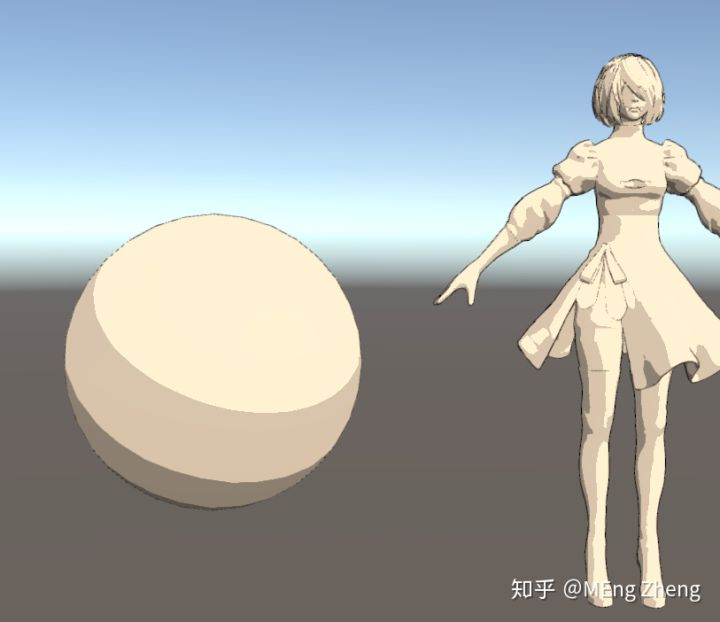

但这样对预期效果来说肯定是远远不够的。第一个问题是，分界线会有很重的锯齿。按照专栏里【01】中的效果，我的明暗分界线应该有一个平滑的过渡，并且在不同的光照角度下，这个过渡区的面积也应该可以变化。这样就可以做出硬边硬和软边影共存的效果。

这里我的想法是，把用if判断亮度级替换为一个平滑阶跃函数（sigmoid）。

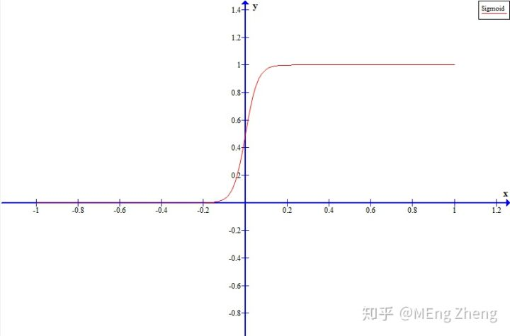

我这里凑了一个底数来让sigmoid函数的锐利程度比较好调整。

![[公式]](Cartoonrenderingofthebasiclightingmodel.assets/equation.svg) 

a参数可以调节sigmoid函数的锐利程度，之后我们把它和粗糙度roughness关联起来。

我们用两个中心不同的sigmoid函数相减就可以造出一个窗函数。

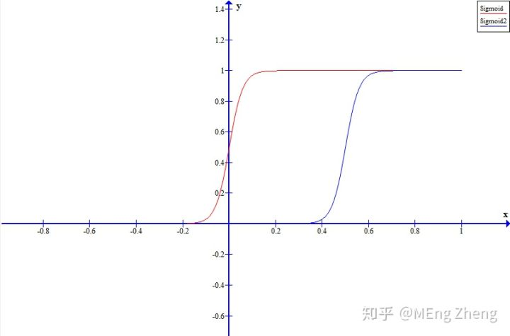

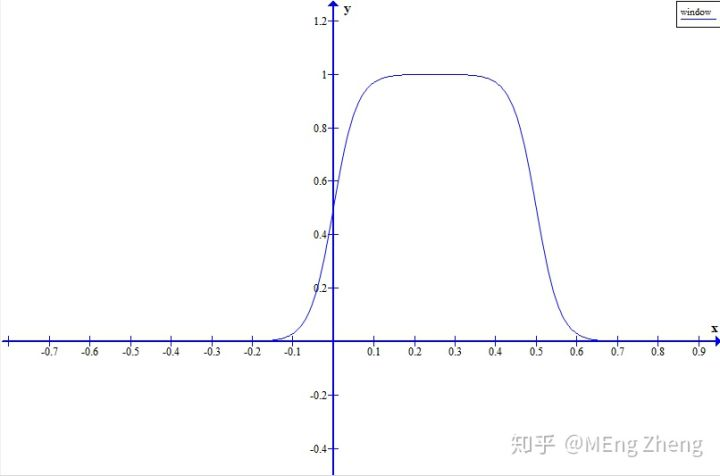

```glsl
	float sigmoid(float x, float center, float sharp) {
		float s;
		s = 1 / (1 + pow(100000, (-3 * sharp * (x - center))));
		return s;
	}
```

然后我利用这个窗函数作为系数乘到亮度级上。

```glsl
		half4 LightingToon(ToonSurfaceOutput s, half3 lightDir, half3 viewDir, half atten) {
			half4 c;

			half3 nNormal = normalize(s.Normal);
			float3 reflectDir = reflect(-viewDir, s.Normal);

			half NoL = dot(nNormal, lightDir) + _ShadowAttWeight * (atten - 1);
			half3 HDir = normalize(lightDir + viewDir);
			half NoH = Pow2(dot(nNormal, HDir)) + _ShadowAttWeight * (atten - 1);
			half VoN = dot(nNormal, viewDir);
			half VoL = dot(viewDir, lightDir);
			half VoH = dot(viewDir, HDir) + _ShadowAttWeight * 2 * (atten - 1);

			half HLightSig = sigmoid(NoL, _DividLineH, _BoundSharp);
			half MidSig = sigmoid(NoL, _DividLineM, _BoundSharp);
			half DarkSig = sigmoid(NoL, _DividLineD, _BoundSharp);

			half HLightWin = HLightSig;
			half MidLWin = MidSig - HLightSig;
			half MidDWin = DarkSig - MidSig;
			half DarkWin = 1 - DarkSig;


			half Intensity = HLightWin * 1.0 + MidLWin * 0.8 + MidDWin * 0.5 + DarkWin * 0.3;

			c = half4(s.diffColor.rgb, s.Alpha) * half4(Intensity.xxx, 1.0) * half4(_LightColor0.rgb, 1.0);
			return c;

		}
```

明暗分界线锐利的情况（_BoundSharp值设置较大）：


明暗分界线边缘平滑的情况（_BoundSharp值设置较小）：


这样一来，我可以把这个分界线锐利度参数和粗糙度联系起来，对光滑的物体，让明暗分界线锐利一些，对粗糙的物体，比如石块，让明暗分界线平滑一些。

第二个好处是，可以实现硬边影和软边影同时存在的艺术效果。

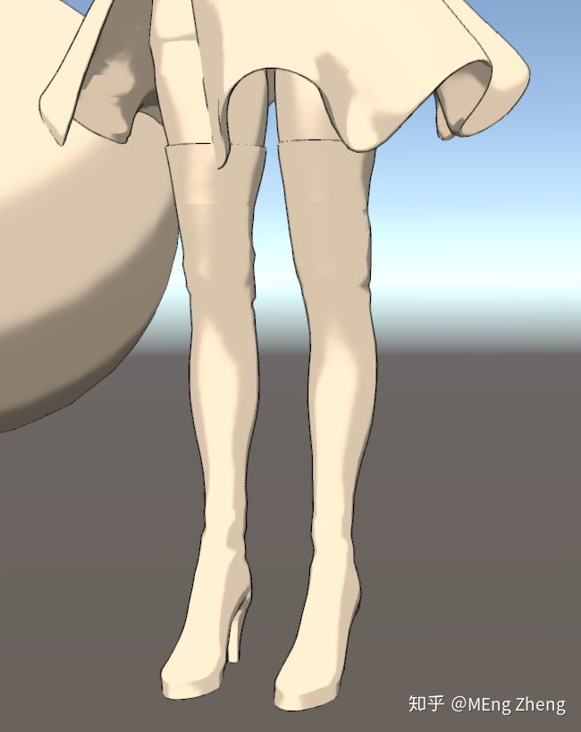

另外，这里解释下，这个2B的模型是我网上down下来的，制作它的美术为了调整光照效果，改变了顶点的法线，我这里为了写基本的光照模型，就没有导入法线，而是用unity重新计算的法线。所以表面某些位置的光照结果可能有问题。

第三个好处是，这里计算了4个窗函数，四个窗函数的和永远等于1，那么漫反射的亮度值不会爆出范围。


## **3. 光照模型物理化重构**

到此为止，当然是远远不够的。一个遵从物理原则的光照模型，应该是满足光照面积越大，亮度越低，光照面积越小，亮度越高。这样才符合能量守恒。所以这里我对每个亮度级的亮度值做一个调整，用该亮度级的上界和下届在lambert下得到的亮度的平均值作为该亮度级的亮度。

```glsl
float ndc2Normal(float x) {
     return x * 0.5 + 0.5;
}

half4 LightingToon(ToonSurfaceOutput s, half3 lightDir, half3 viewDir, half atten) {
			half4 c;

			half3 nNormal = normalize(s.Normal);
			float3 reflectDir = reflect(-viewDir, s.Normal);

			half NoL = dot(nNormal, lightDir) + _ShadowAttWeight * (atten - 1);
			half3 HDir = normalize(lightDir + viewDir);
			half NoH = Pow2(dot(nNormal, HDir)) + _ShadowAttWeight * (atten - 1);
			half VoN = dot(nNormal, viewDir);
			half VoL = dot(viewDir, lightDir);
			half VoH = dot(viewDir, HDir) + _ShadowAttWeight * 2 * (atten - 1);

			//------------------------------------------------------------------------------
			//diffuse

			half MidSig = sigmoid(NoL, _DividLineM, _BoundSharp);
			half DarkSig = sigmoid(NoL, _DividLineD, _BoundSharp);
			half DeepDarkSig = sigmoid(NoL, _DividLineDeepDark, _BoundSharp);

			half MidLWin = MidSig;
			half MidDWin = DarkSig - MidSig;
			half DarkWin = DeepDarkSig - DarkSig;
			half DeepDarkWin = 1 - DeepDarkSig;

			half diffuse = MidLWin * (1 + ndc2Normal(_DividLineM)) / 2 + MidDWin * (ndc2Normal(_DividLineM) + ndc2Normal(_DividLineD)) / 2;
			diffuse += DarkWin * (ndc2Normal(_DividLineD) + ndc2Normal(_DividLineDeepDark)) / 2 + DeepDarkWin * ndc2Normal(_DividLineDeepDark) / 2;


			half Intensity = diffuse;

			c = half4(s.diffColor.rgb, s.Alpha) * half4(Intensity.xxx, 1.0) * half4(_LightColor0.rgb, 1.0);
			return c;

		}
```

当设置的高亮面积小的情况（高亮判决阈值大）：


当设置的高亮面积大的情况（高亮判决阈值小）：


最后把明暗交界线的锐利度和roughness关联起来，方便美术向的调参。

```glsl
half _BoundSharp = 9.5 * Pow2(_Roughness - 1) + 0.5;
```

这个表达式也是我凑的，因为如果直接用 _BoundSharp = 1 - _Roughness 的话，在_Roughness 的调参范围内效果变化不是很线性，这样会让美术调起来不舒服。

再额外解释下，这里我只是做了一个卡通光照模型的实现，之后可以在每个亮度级上乘上美术想要的冷暖色来实现色相的调整。


## **4. 卡通光照模型物理向高光**

前面卡通化的漫反射的实现思路是，我先用lambert算一个亮度，然后再对这个亮度进行阈值化。我这里实现高光的思路类似。但是对高光，我用更合理的方式来替代lambert。这里我用的是GGX法线分布。

我这里之所以使用GGX的法线分布来作为高光的亮度分级的预计算，有两个原因：

（1）GGX是物理的法线分布函数

（2）GGX是形状不变的法线分布函数。之后实现金属材质的时候，要利用各向异性来表现金属。形状不变的法线分布函数是支持各向异性的。

关于形状不变和各向异性可以参照 

[@毛星云](https://www.zhihu.com/people/b34b9010f0bb6b40fe18653f1baeb09e)

 大神的博客


[毛星云：【基于物理的渲染（PBR）白皮书】（四）法线分布函数相关总结](https://zhuanlan.zhihu.com/p/69380665)[zhuanlan.zhihu.com](https://zhuanlan.zhihu.com/p/69380665)

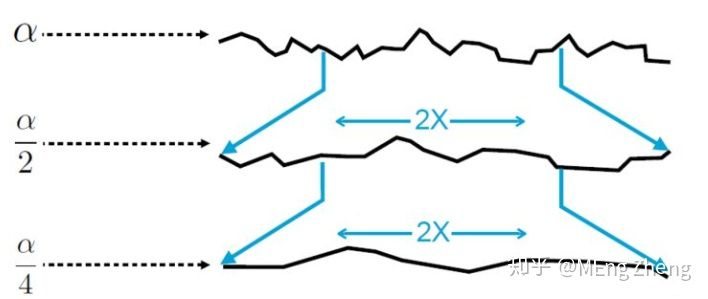

这里引一下 

[@毛星云](https://www.zhihu.com/people/b34b9010f0bb6b40fe18653f1baeb09e)

  大神的图，如果法线分布支持形状不变的话，可以通过给材质沿切线方向和副切线方向不同的粗糙度来实现各向异性。本文暂时用不到各向异性，但是只后要实现金属的卡通渲染，这里提前做个准备。


GGX法线分布函数的大致形状。

```glsl
	// a2 is the roughness^2
	float D_GGX(float a2, float NoH) {
		float d = (NoH * a2 - NoH) * NoH + 1;
		return a2 / (3.14159 * d * d);
	}
```

我这里的想法是，先计算GGX，得到一个物理的亮度，然后对这个亮度做阈值化。当NoH（法线点积半矢量）等于1时就是specular能达到的最大亮度，那我这里以这个亮度的0.85倍作为阈值化的分界线（0.85这个参数可调）。大于0.85的部分为specular的部分，亮度就用最大亮度和NoH=0.85时的亮度的平均值，类似于我第3小节的做法。阈值化仍然使用sigmoid函数。

这样的做法的目的是，我希望粗糙的物体specular面积大，但亮度低；光滑的物体specular面积小，但亮度大。同时，我的高光还是色块化的。

高光部分的计算：

```glsl
half NDF0 = D_GGX(_Roughness * _Roughness, 1);
half NDF_HBound = NDF0 * _DividLineSpec;
half NDF = D_GGX(_Roughness * _Roughness, clamp(0, 1, NoH));

half specularWin = sigmoid(NDF, NDF_HBound, _BoundSharp);

half specular = specularWin * (NDF0 + NDF_HBound) / 2;
```

只对高光部分进行渲染的效果：

光滑材质（低roughness）：

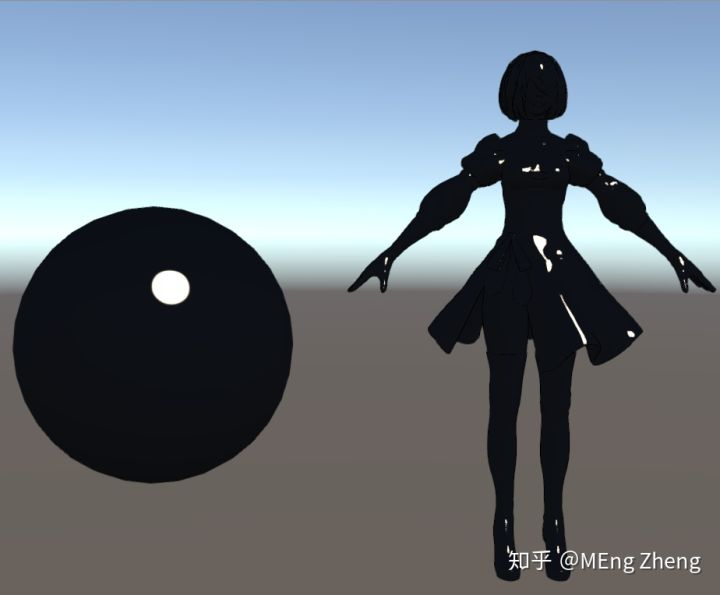

粗糙材质（中roughness）:

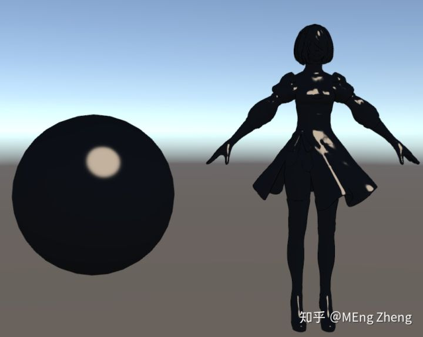

高粗糙材质（高roughness）：

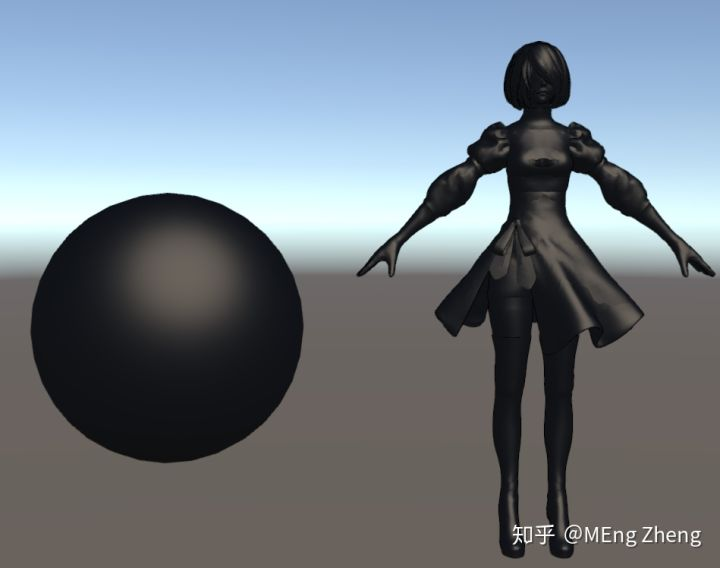

最后把漫反射和高光反射加在一起：

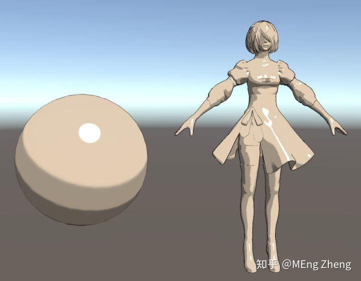

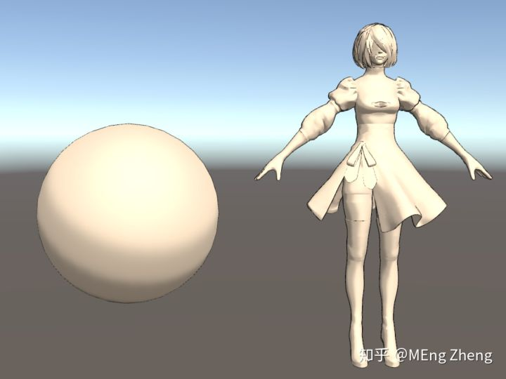

上两图为不同粗糙度的卡通材质表现，这里我偷懒给右边2B的模型的所有物件套的同一个材质。


## **5. 添加菲涅尔项**

在本专栏【01】中提到，在《重力眩晕2》中，从背光面观察，物体的边缘会有一圈边缘光，实现比轮廓线更好的边界区分效果。

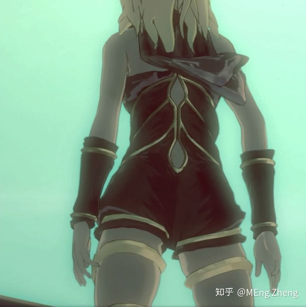

实现这个效果的很容易想到的思路就是利用菲涅尔效应（Fresnel Effect）。

菲涅尔效应表达的效果就是视线和物体法线夹角接近90度时，菲涅尔效应强烈，反之菲涅尔效应弱。一般用Schlick近似：

![[公式]](Cartoonrenderingofthebasiclightingmodel.assets/equation.svg) 

式中x为视线与法线的点积。

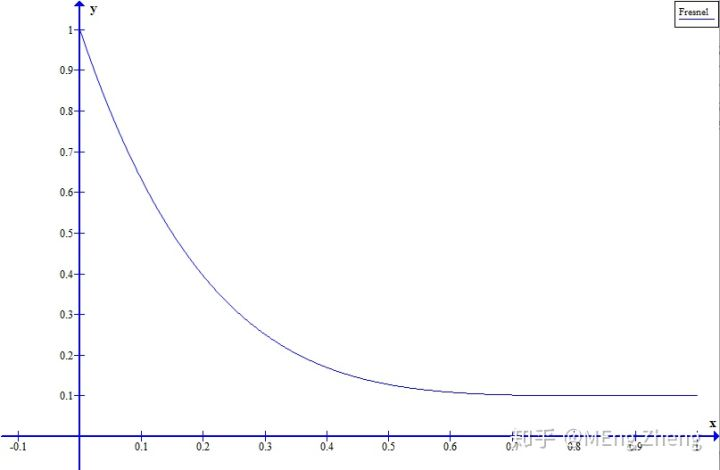

```glsl
	float3 Fresnel_schlick(float VoN, float3 rF0) {
		return rF0 + (1 - rF0) * Pow5(1 - VoN);
	}

	float3 Fresnel_extend(float VoN, float3 rF0) {
		return rF0 + (1 - rF0) * Pow3(1 - VoN);
	}
```

上述代码是菲涅尔的schlick近似的实现，第二个函数是，我这里希望菲涅尔的衰减不要过快，于是把指数降到3。

无菲涅尔项时，背光面观察效果：

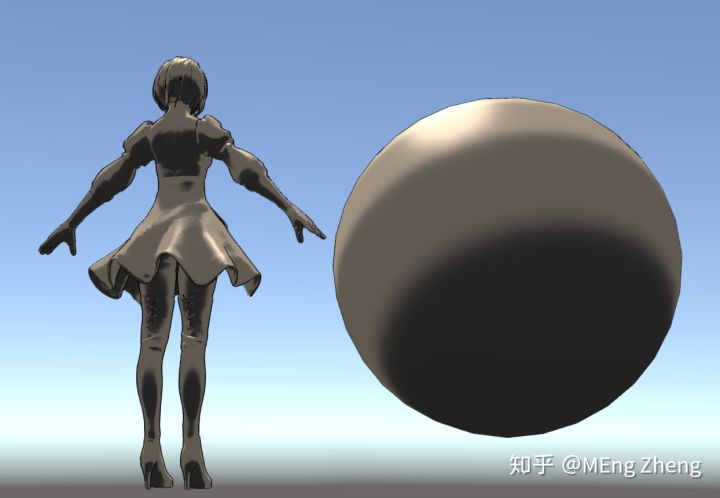

加入菲涅尔项后，背光面观察效果：

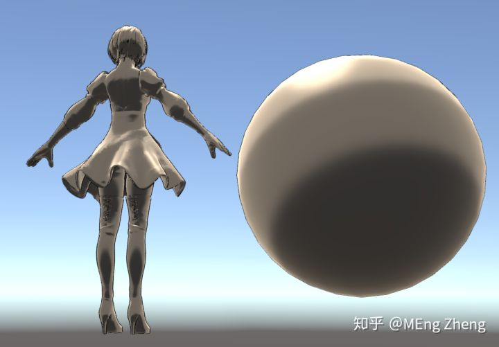

另外，由于在向光面观察时不希望收到菲涅尔效应的影响，于是在菲涅尔项的计算中加入VoL（视线与光线的点积）系数的影响因子。

```glsl
half3 fresnel = Fresnel_extend(VoN, float3(0.1, 0.1, 0.1));
half3 fresnelResult = _FresnelEff * fresnel * (1 - VoL) / 2;
...
half3 Intensity = specular.xxx + diffuse.xxx + fresnelResult.xxx;

c = half4(s.diffColor.rgb, s.Alpha) * half4(Intensity, 1.0) * half4(_LightColor0.rgb, 1.0);
return c;
```

向光面的观察结果：


向光面的光照将不受到菲涅尔项的影响。

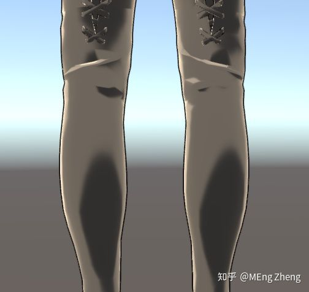

近距离的边缘光效果。


## **6.明暗交界线部分的额外处理**

在一些插画作品中，会在明暗交界线上加一道暖色调的光来达到一定的艺术效果。

这里我截一张ASK太太的图的一部分：

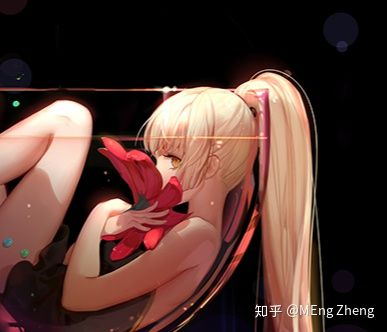（知乎会给图上个水印，但文中我标明了是ASK太太的图）

（知乎会给图上个水印，但文中我标明了是ASK太太的图）

同理的，插画师们也会在一些冷色材质的明暗交界线上加入冷色光。

为了实现一个近似的效果，我的想法是，用我们之前造出的两个窗函数的乘积来实现。

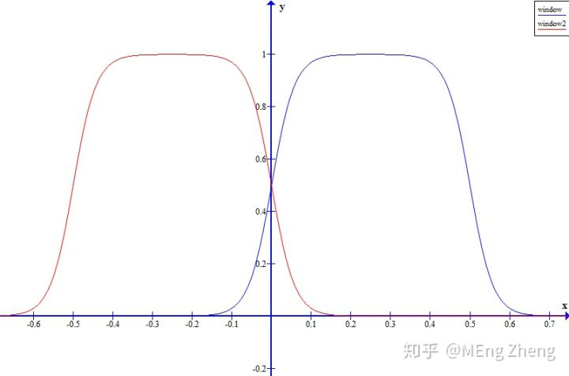

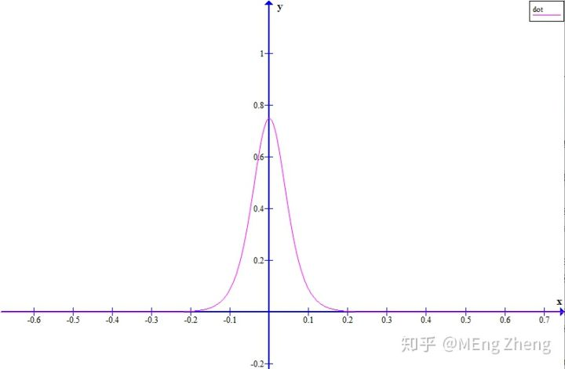

最后用乘积得到的函数乘上一个暖色光的颜色加到光照函数的输出上。

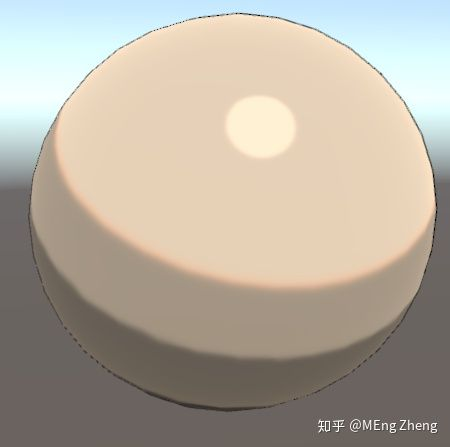


## 7. 抗锯齿

轮廓线的抗锯齿问题我会在后续的文章中专门开一期，这里先简单提一下。

我这里在后效上用了一个FXAA的抗锯齿，具体是在OnRenderImage()里用一个着色器来实现。

使用了FXAA：

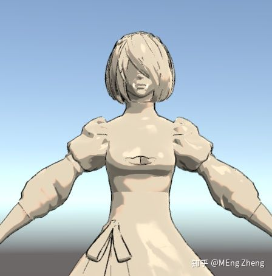

没有使用FXAA

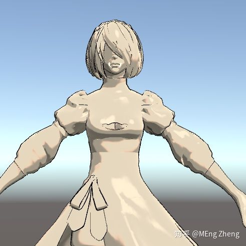


## 总结

本期实现了一个基本的卡通渲染的光照模型，暂时还没有挂上任何纹理。实现的几个关键点：基于正面剔除的轮廓线，柔化的明暗边缘，基于菲涅尔效应的边缘光。

下一期我会换一个模型，这期用的模型本身也不是为卡通渲染制作的，存在不少不方便解决的问题。之后把纹理用上，另外制作一张遮蔽纹理来解决对特殊部分的轮廓线加粗的问题。


## 三、卡通渲染LightMap的使用

## 前言

续上一期，上一期我们实现了一个基本的卡通渲染光照模型，实现了粗糙度控制的物理向的镜面光，过渡带可控的漫反射亮度分级，基于正面剔除的轮廓线。

本期给上一期的光照模型套上纹理，并且利用上LightMap以达到更好的卡通风格效果。

专栏链接： [Unity复现《重力眩晕2》中的渲染技术](https://zhuanlan.zhihu.com/c_1183802694685433856)

## 本期最终效果

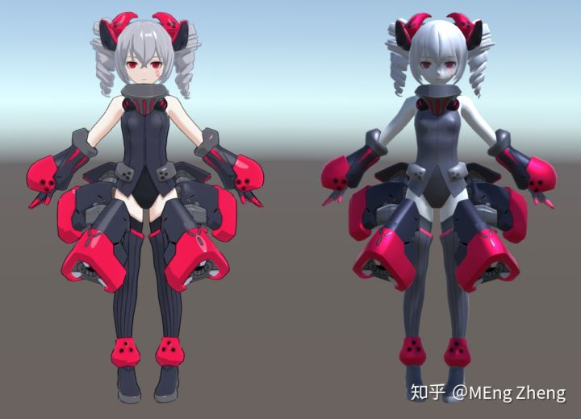

左边是我写文之前先做好的效果，右边是直接用Standard Shader套上Texture的素模。本期的内容就是实现左边效果的技术细节。

关于模型，我暂时没找到Gravity Rush的模型，就先拿布洛尼亚的model凑合用下。这个model里皮肤、头发、布料、金属都有，还是可以用来做不少效果的。

## 目录

1. 卡通渲染中LightMap的作用
2. LightMap对镜面反射项的补正
3. LightMap对漫反射项的补正
4. 一些细节效果的展示
5. 完整shader代码附录
6. 总结
7. 下期计划

## 1. 卡通渲染中LightMap的作用

首先为什么需要LightMap。出于性能的需求，美术制作的Mesh大都是粗模，面数少，顶点数少。所以一种解决方案就是，把更多的模型细节写入Texture，然后在片段着色器中对其进行采样，用以对模型的细节进行补充。常用的有Normal Map, Bump Map,  Distance Map等等。

回到卡通渲染，举例而言，想实现头发上的高光的形状，是需要额外的Texture来提供信息的。

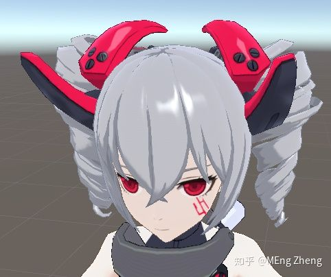

《罪恶装备Xrd》提出了一套基于LightMap的卡通渲染工作流，CodeKiwi在它的博客上有一篇它整理的资料，我这里也引一下：[Guilty Gear Xrd shader test](https://link.zhihu.com/?target=https%3A//forum.unity.com/threads/guilty-gear-xrd-shader-test.448557/)

那我这里按我的方式来重新叙述一遍。

我们首先看下LightMap长什么样子：

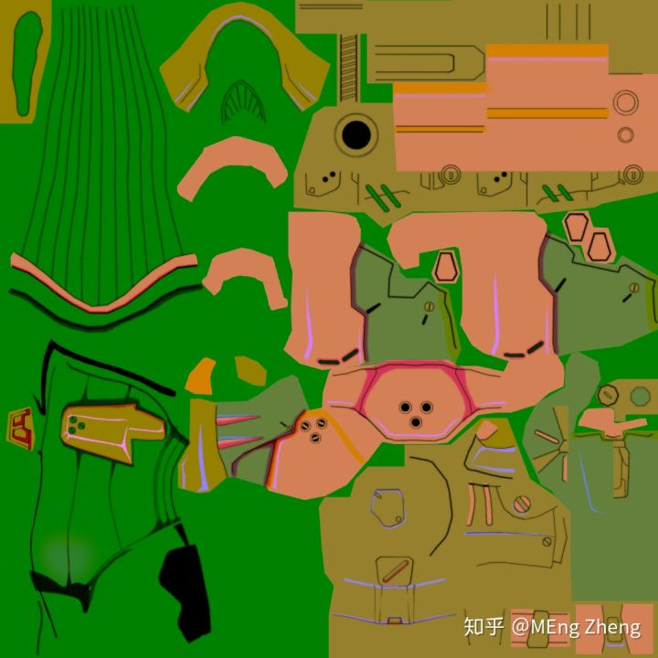

这张是素材包里Bronya身体部分的LightMap，直接看完全看不出是啥。因为美术是把3张Map分别写到一张图的RGB三个通道里了。这一张LightMap里面其实包含了三张功能不同的Map。之所以把三张图写到一张图里，是出于性能的考虑，节省Texture的显存占用，也可减少着色器的采样次数。

那怎么看嘞？当然是直接用着色器刷到模型上去看了。

**我们先渲染B通道：**

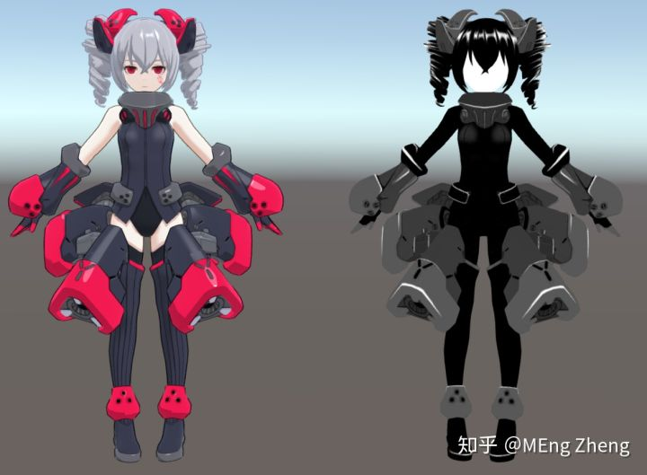LightMap 的 B 通道

首先我把LightMap的B通道渲染上去。根据CodeKiwi的PPT里的解释，再联系观察到的效果。这一通道是Specular Refiection的Mask。这一通道的数值标定了哪些位置可以出现Specular  Refiection，以及出现的镜面反射的亮度应该是多少。例如头发的部分高亮区域，金属部分的边缘区域等。你可以将这个通道的采样值作为一个比例因子乘到着色器计算单的镜面反射的结果上。但是这个比例因子我们要设置自己可调的参数，因为美术无法把最精确合理的数值写到图里，他只能在图写入一个相对关系，至于最终渲染的效果，TA应该用额外的可调参数去调整采样得到的值。

**然后我们再看下G通道：**

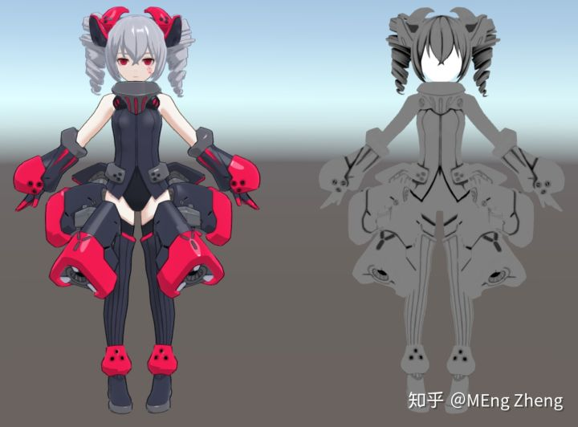LightMap 的 G 通道（正面）

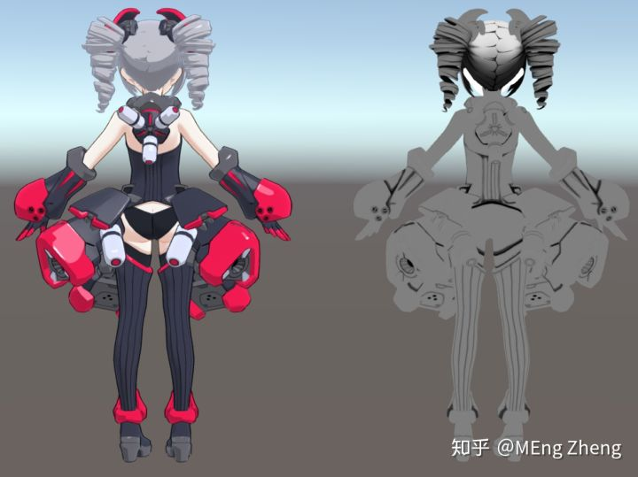LightMap 的 G 通道（背面）

G通道表达的内容是环境遮蔽Ambient  occlusion，某个区域的这个数值越小，就意味着它越应该被划分到暗面的亮度级上。而这个数值越大，就意味着这个区域越应该被划分到亮面的亮度级上。我这里的使用方法是，我把这个[0,1]的采样得到AO值先转换到NDC范围[-1,1]，再以偏置项的形式加到漫反射的lambert系数上，具体在后面会说明。

**最后看下R通道：**

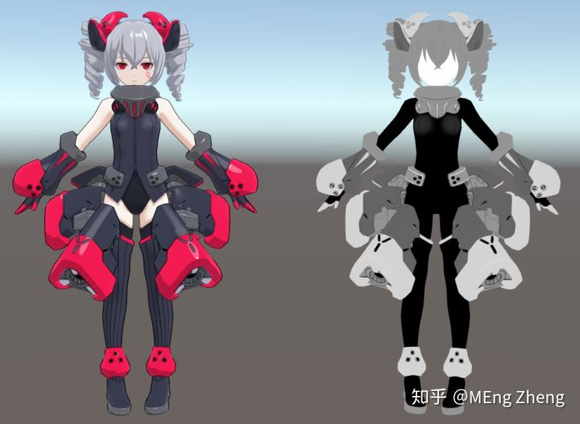LightMap 的 G 通道

我没找到崩3对他们的LightMap解释的官方文档，但是按照《罪恶装备Xrd》的官方文档里，G通道标定的是Light Size，也就是某个区域的该数值越大，在该区域的镜面反射的面积就越大。不过我这里并不打算把它当做Light Size来使用。

我们上期镜面反射的实现方案是偏物理向的，只有一个Roughness参数来调整。上期具体的实现方法先用GGX法线分布函数计算一遍镜面反射光的亮度，然后再用sigmoid做阈值化。这样得到的效果是，越光滑的表面，高光面积越小，亮度越大；越粗糙的表面，高光面积越大，亮度越低。且阈值化之后仍然符合卡通渲染的视觉感受。

所以本期我打算把G通道的采样值当做smoothness来使用，对比左图，红色的金属最光滑，黑色的金属其次，头发再其次，服装和皮肤最粗糙。这样解释似乎也合理。当然需要额外的可调参数对数值进行调整。

特别说明：脸部没有LightMap

## 2. LightMap对镜面反射项的补正

好，既然大致了解了LightMap每个通道的作用，那我们把它组合到上一期的光照模型上。首先先来做镜面反射。

先附一下片段着色器做的一些额外处理。

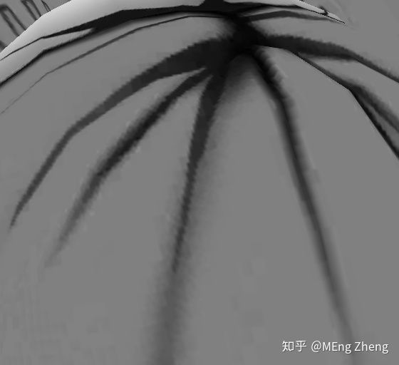

LightMap的G通道（AO遮蔽）在纹理空间的数值似乎有一些锯齿。因为我比较在意这些细节，所以我在对LightMap采样的时候做了一下均值模糊。

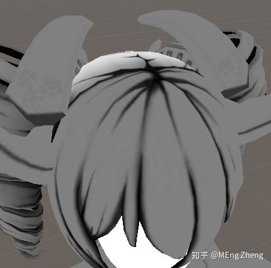

看上去好一些。片段着色器的代码附上：

```glsl
void surf (Input IN, inout ToonSurfaceOutput o)
        {
			// Albedo comes from a texture tinted by color
			fixed4 c = tex2D(_MainTex, IN.uv_MainTex) * _Color;
			o.diffColor = c.rgb;
			o.Albedo = 0.2 * c.rgb;

			fixed4 ilm = tex2D(_LightMap, IN.uv_LightMap);

			
			//-------------------------------------------
			// blur
			float2 tmpuv1 = IN.uv_LightMap + _LightMap_TexelSize.xy;
			float2 tmpuv2 = IN.uv_LightMap - _LightMap_TexelSize.xy;
			float2 tmpuv3 = IN.uv_LightMap;
			tmpuv3.x += _LightMap_TexelSize.x;
			tmpuv3.y -= _LightMap_TexelSize.y;
			float2 tmpuv4 = IN.uv_LightMap;
			tmpuv4.x -= _LightMap_TexelSize.x;
			tmpuv4.y += _LightMap_TexelSize.y;

			fixed4 ilm1 = tex2D(_LightMap, tmpuv1);
			fixed4 ilm2 = tex2D(_LightMap, tmpuv2);
			fixed4 ilm3 = tex2D(_LightMap, tmpuv3);
			fixed4 ilm4 = tex2D(_LightMap, tmpuv4);

			//ilm = 0.4 * ilm + 0.15 * (ilm1 + ilm2 + ilm3 + ilm4);
			ilm = 0.2 * (ilm + ilm1 + ilm2 + ilm3 + ilm4);
			//---------------------------------------
			

			o.smoothMap = ilm.r;

			o.specIntensity = ilm.b;
			o.AO = ilm.g;

			o.Alpha = c.a;
        }
```

但是采样过程做模糊就多了4次采样，对性能是一种浪费。如果不是很在意细节的话可以不做这件事。或者用PS先对LightMap预处理下。

另外我Albedo 赋上了一点点MainTexture 的颜色，这样Albedo会使最终渲染效果吸上一点点环境色。如果直接把MainTexture  赋给Albedo，最终渲染会吸入过多的环境色，而卡通渲染其实并不想要这个效果。关于Albedo在光照计算时会吸上环境色，这个跟surface  shader的封装有关。

好现在来做Specular项。先附代码：

```glsl
float sigmoid(float x, float center, float sharp) {
		float s;
		s = 1 / (1 + pow(100000, (-3 * sharp * (x - center))));
		return s;
}
...
half4 LightingToon(ToonSurfaceOutput s, half3 lightDir, half3 viewDir, half atten) {
	// Array
	half3 nNormal = normalize(s.Normal);
	half3 HDir = normalize(lightDir + viewDir);

	half NoL = dot(nNormal, lightDir);
	half NoH = dot(nNormal, HDir);
	half NoV = dot(nNormal, viewDir);
	half VoL = dot(viewDir, lightDir);
	half VoH = dot(viewDir, HDir);

	half roughness = 0.95 - 0.95 * (s.smoothMap * _Glossiness);
	half _BoundSharp = 9.5 * Pow2(roughness - 1) + 0.5;
	//--------------------------------------------
	// Specular
	//--------------------------------------------

	half NDF0 = D_GGX(roughness * roughness, 1);
	half NDF_HBound = NDF0 * _DividLineSpec;

	half NDF = D_GGX(roughness * roughness, NoH) + _ShadowAttWeight * (atten - 1);
	half specularWin = sigmoid(NDF, NDF_HBound, _BoundSharp * _DividSharpness);

	half SpecWeight = specularWin *(NDF0 + NDF_HBound) / 2 * s.specIntensity; 

	half3 lightResult = SpecWeight * _LightColor0.rgb;

	return half4(lightResult.rgb, 1.0);
}
```

首先算specular项需要的粗糙度参数，我是用光滑度参数取了反。0.95这个数值是为了换算得到的粗糙度不要落到0和1上。_Glossiness这个参数是对LightMap上采样得到的光滑度值乘上一个比例因子，方便调节。接下来的计算就是直接套上一节

[MEng Zheng：【02】卡通渲染基本光照模型的实现](https://zhuanlan.zhihu.com/p/95986273)[zhuanlan.zhihu.com](https://zhuanlan.zhihu.com/p/95986273)

的实现方案。_BoundSharp 是上一节计算用来确定sigmoid函数的过渡带宽的参数，这里为了方便调节，我又乘了一个比例因子_DividSharpness。

最后的镜面反射值要乘上从LightMap采样得到的高光项，进行遮罩。

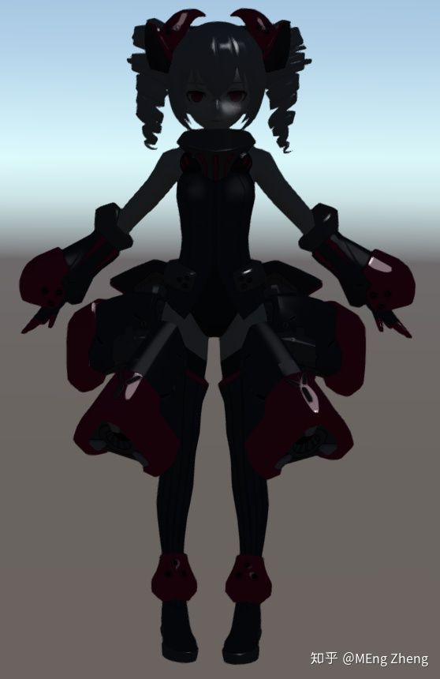

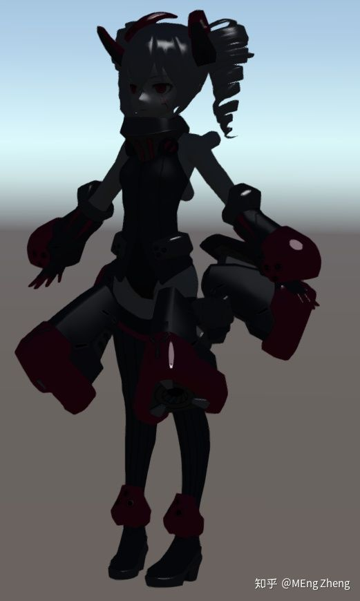

有Specular Mask的作用，镜面光的形状都还ok。部分金属的边缘也有特别的高亮。另外由于我们使用了Smoothness Map，红色金属和黑色金属的光滑程度不同是可以明显感受到的。

另外附一张不使用LightMap的结果。

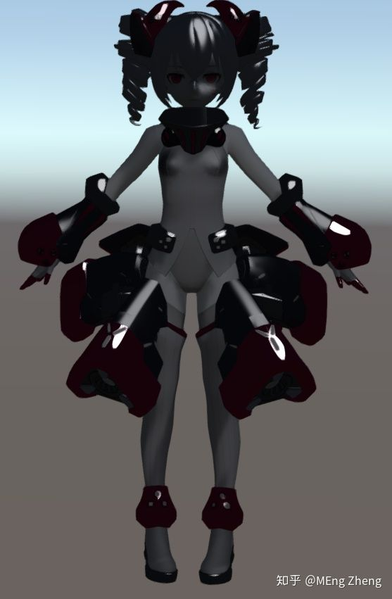

可见没有LightMap辅助的高光效果就很差了。

## 3. LightMap对漫反射项的补正

现在来加漫反射项。把【02】期的漫反射模型搬过来，再组合上LightMap采样得到的遮蔽项。先附代码：

```glsl
float warp(float x, float w) {
	return (x + w) / (1 + w);
}

float3 warp(float3 x, float3 w) {
	return (x + w) / (1 + w);
}
float Normal2ndc(float x) {
	return x * 2.0 - 1.0;
}
...
half4 LightingToon(ToonSurfaceOutput s, half3 lightDir, half3 viewDir, half atten) {
			// Array
			half3 nNormal = normalize(s.Normal);
			half3 HDir = normalize(lightDir + viewDir);

			half NoL = dot(nNormal, lightDir);
			half NoH = dot(nNormal, HDir);
			half NoV = dot(nNormal, viewDir);
			half VoL = dot(viewDir, lightDir);
			half VoH = dot(viewDir, HDir);

			half roughness = 0.95 - 0.95 * (s.smoothMap * _Glossiness);
			half _BoundSharp = 9.5 * Pow2(roughness - 1) + 0.5;
			//--------------------------------------------
			// Specular
			//--------------------------------------------

			half NDF0 = D_GGX(roughness * roughness, 1);
			half NDF_HBound = NDF0 * _DividLineSpec;

			half NDF = D_GGX(roughness * roughness, NoH) + _ShadowAttWeight * (atten - 1);
			half specularWin = sigmoid(NDF, NDF_HBound, _BoundSharp * _DividSharpness);

			half SpecWeight = specularWin * (NDF0 + NDF_HBound) / 2 * s.specIntensity; //optional

			//----------------------------------------------------
			// diffuse
			//--------------------------------------------
			half Lambert = NoL + _AOWeight * Normal2ndc(s.AO) + _ShadowAttWeight * (atten - 1);

			half MidSig = sigmoid(Lambert, _DividLineM, _BoundSharp * _DividSharpness);
			half DarkSig = sigmoid(Lambert, _DividLineD, _BoundSharp * _DividSharpness);

			half MidLWin = MidSig;
			half MidDWin = DarkSig - MidSig;
			half DarkWin = 1 - DarkSig;

			half3 diffuseWeight = (MidLWin * (1 + ndc2Normal(_DividLineM)) / 2).xxx;
			diffuseWeight += (MidDWin * (ndc2Normal(_DividLineM) + ndc2Normal(_DividLineD)) / 2).xxx * _DarkFaceColor.rgb * 3 / (_DarkFaceColor.r + _DarkFaceColor.g + _DarkFaceColor.b);
			diffuseWeight += (DarkWin * (ndc2Normal(_DividLineD))).xxx * _DeepDarkColor.rgb * 3 / (_DeepDarkColor.r + _DeepDarkColor.g + _DeepDarkColor.b);
			diffuseWeight = warp(diffuseWeight, _diffuseBright.xxx);

			half3 lightResult = SpecWeight * _LightColor0.rgb + (1 - SpecWeight) * diffuseWeight * s.diffColor.rgb;

			return half4(lightResult.rgb, 1.0);
		}
```

在上一期的漫反射模型基础上做了几件额外的事情。

```glsl
diffuseWeight = warp(diffuseWeight, _diffuseBright.xxx);
```

其一是我对最终的漫反射计算结果做了一个Warp。

![[公式]](Cartoonrenderingofthebasiclightingmodel.assets/equation-1588829989083.svg) 

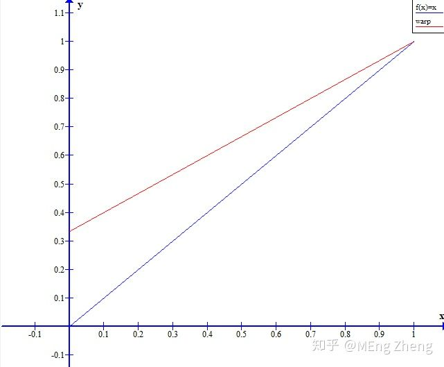

warp函数可以通过调节w参数对[0,1]范围的输出值做一个整体的抬高，但又不会超出[0,1]的范围。

我最后是利用Warp对漫反射的计算结果进行一个亮度的调整。

第二是把从LightMap上采样得到的AO值转到NDC空间再以偏置的形式加到lambert系数上。

```glsl
half Lambert = NoL + _AOWeight * Normal2ndc(s.AO) + _ShadowAttWeight * (atten - 1);
```

这样一来，AO标定的区域就容易被判定到暗面。_AOWeight 是一个可调的比例因子。

使用LightMap AO的效果：

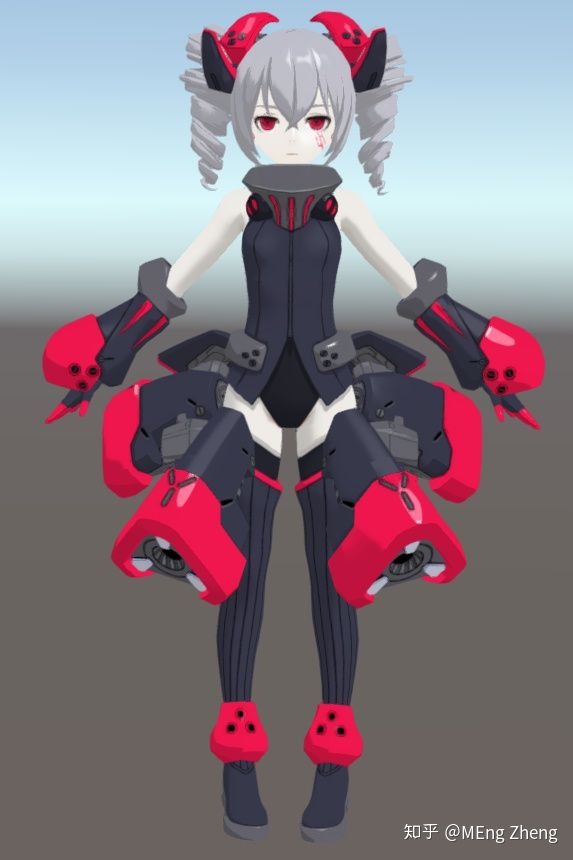使用了LightMap提供的AO

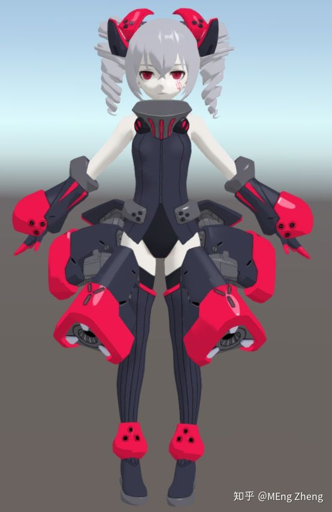不使用LightMap提供的AO

如果没有LightMap的AO项的辅助，头发的效果就差很多了。

第三是加上了对暗面颜色的调整：

```glsl
half3 diffuseWeight = (MidLWin * (1 + ndc2Normal(_DividLineM)) / 2).xxx;
			diffuseWeight += (MidDWin * (ndc2Normal(_DividLineM) + ndc2Normal(_DividLineD)) / 2).xxx * _DarkFaceColor.rgb * 3 / (_DarkFaceColor.r + _DarkFaceColor.g + _DarkFaceColor.b);
			diffuseWeight += (DarkWin * (ndc2Normal(_DividLineD))).xxx * _DeepDarkColor.rgb * 3 / (_DeepDarkColor.r + _DeepDarkColor.g + _DeepDarkColor.b);
			diffuseWeight = warp(diffuseWeight, _diffuseBright.xxx);
```

在上一期计算的漫反射亮度系数的后面乘上我们想要的暗面颜色。但是由于乘上颜色会改变计算得到的亮度，所以乘上的颜色应该对该颜色的亮度做归一化，即除以该颜色的亮度值。在HSV颜色空间下，亮度的定义：

![[公式]](Cartoonrenderingofthebasiclightingmodel.assets/equation-1588829989113.svg) 

这样一来，我们输入的可调颜色就只会影响暗面的色相，而不会影响暗面的亮度了。

调节暗面的颜色。得到结果：

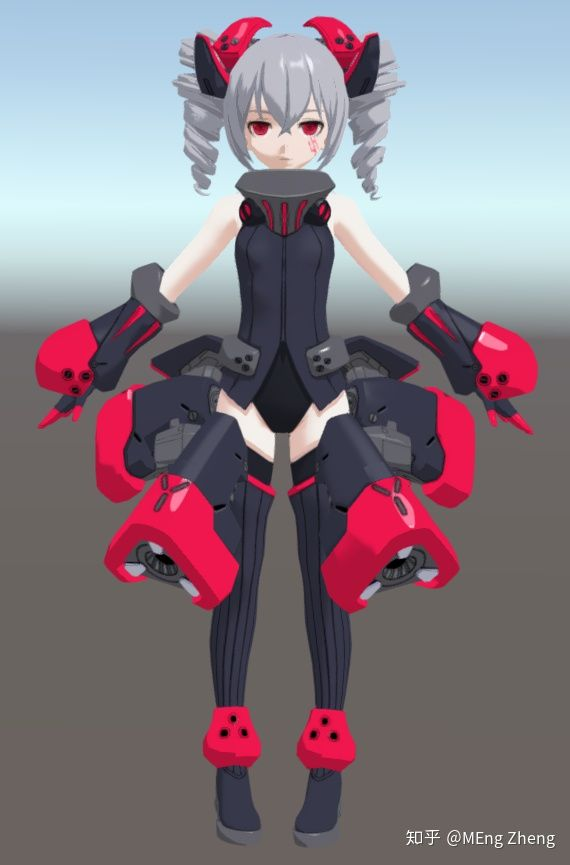

最后再把上一期的轮廓线方案抄过来。


轮廓线方案相比上期我做了些改动。其一是我放弃了使用柏林噪声改变线宽的方案，因为柏林噪声的参数实在是不好调，会让美术调起来很难受。

其二就是轮廓线的颜色我融合了MainTexture的颜色，相比于上期使用纯黑色，会显得不那么突兀。

修改后的轮廓线方案代码附上：

```glsl
	Pass{
		Name "OUTLINE"
		Tags{ "LightMode" = "Always" }
		Cull Front
		ZWrite On
		ColorMask RGB
		Blend SrcAlpha OneMinusSrcAlpha

		CGPROGRAM
			#pragma vertex vert
			#pragma fragment frag

			#include "UnityCG.cginc"
			struct appdata {
				float4 vertex : POSITION;
				float3 normal : NORMAL;
				float4 texCoord : TEXCOORD0;

			};

			struct v2f {
				float4 pos : SV_POSITION;
				float4 color : COLOR;
				float4 tex : TEXCOORD0;
			};

			uniform half _OutlineWidth;
			sampler2D _MainTex;
			fixed4 _OutlineColor;

			v2f vert(appdata v) {
				// just make a copy of incoming vertex data but scaled according to normal direction
				v2f o;
				o.pos = UnityObjectToClipPos(v.vertex);
				float3 norm = mul((float3x3)UNITY_MATRIX_IT_MV, v.normal);
				float2 extendDir = normalize(TransformViewToProjection(norm.xy));

				_OutlineWidth = _OutlineWidth;

				o.pos.xy += extendDir * (o.pos.w * _OutlineWidth * 0.1);

				o.tex = v.texCoord;

				o.color = half4(0,0,0,1);
				return o;
			}

			half4 frag(v2f i) :COLOR{
				fixed4 c = tex2D(_MainTex, i.tex);

				return half4(c.rgb* _OutlineColor.rgb, 1.0);
			}

			ENDCG

		}//Pass
```

到此看起来效果差不多了，对比下我前几天做好的。

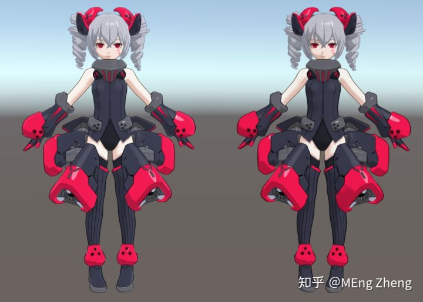

然后你细看就会发现右边的立体感好像没有左边的好，好像还差了点什么。再看背面：


暗面的观察效果就更明显了，左边（背面看是左边的）缺少了菲涅尔的效果，导致它的暗面颜色看起来很死板。

再放一些近距离观察的对比：

有菲涅尔项：

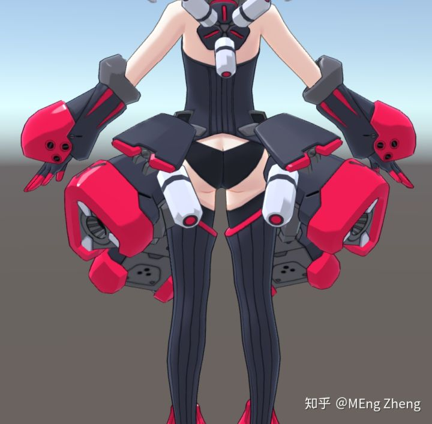Fresnel参与边缘高亮

无菲涅尔项：

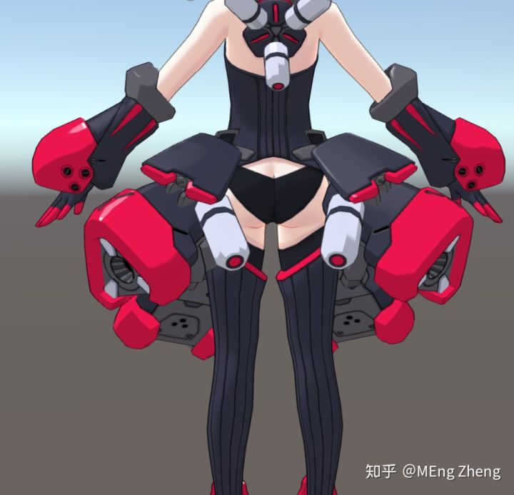Fresnel参与边缘高亮

一些其他视角的观察结果：

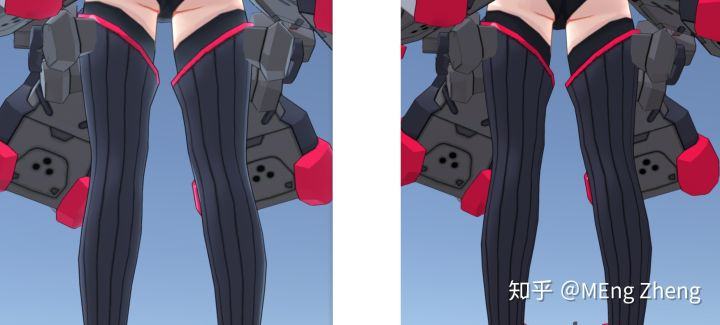左图Fresnel参与边缘高亮

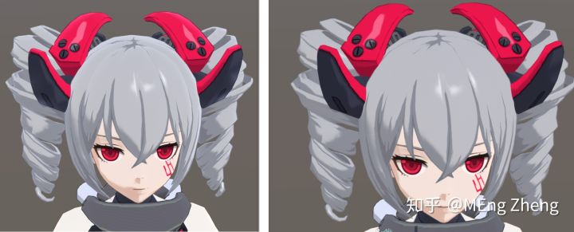左图Fresnel参与边缘高亮

菲涅尔项对边缘的高亮效果对模型的立体感是很有效果的。

把上一期菲涅尔项的代码补上，这期的改动就是我的Fresnel乘上了一个可以调节的颜色。

```glsl
//----------------------------------------------------
// fresnel
//----------------------------------------------------
half3 fresnel = Fresnel_extend(NoV, float3(0.1, 0.1, 0.1));
half3 fresnelResult = _FresnelEff * fresnel * (1 - VoL) / 2;

...

half3 lightResult = SpecWeight * _LightColor0.rgb + (1 - SpecWeight) * diffuseWeight * s.diffColor.rgb + fresnelResult * _FresnelColor.rgb;
```


## 4. 一些细节效果的展示

这一节是我截了一下细节表现。

由于我们上一期的光照模型中实现了明暗软过渡，在皮肤上可以看到一些不错的效果。

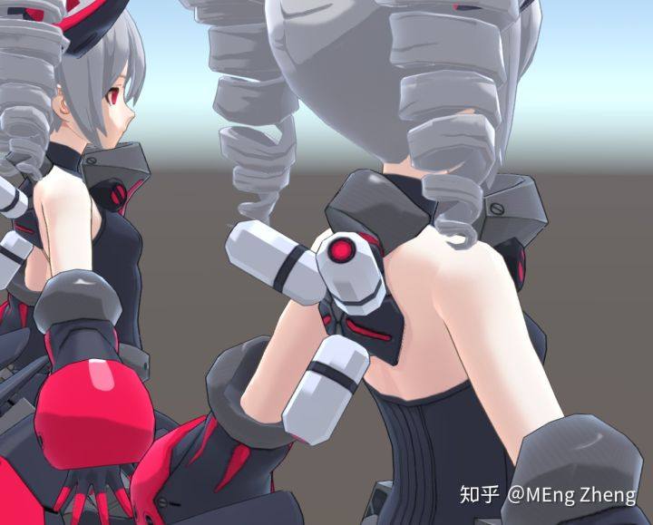

因为皮肤的明暗分界线的过渡我们实现得比较软，表现出来的皮肤质感会比简单的阈值切分好很多。

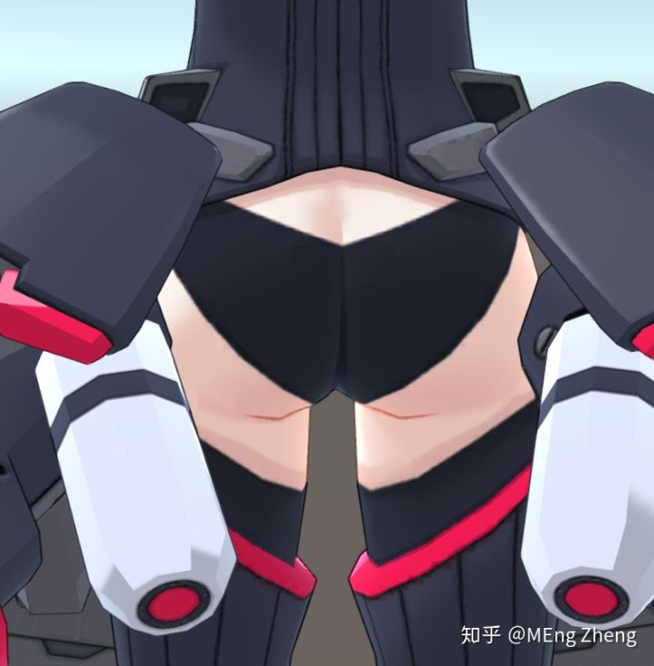

其次就是某些emmm.....绅士领域 的皮肤质感的表现也还不错。


另外不同质感的金属表现也能很好地区分：

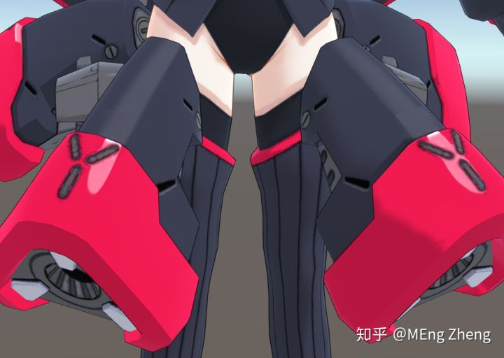


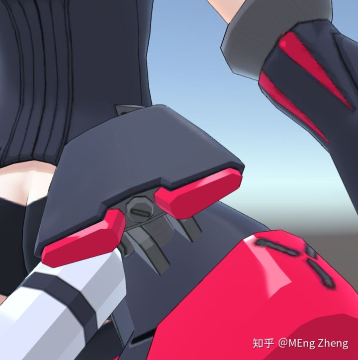


## 5. 完整shader代码附录

我附一下这一期完整的Shader代码。这个系列做到后期我会公布到GitHub上，但是现在很多细节效果我自己还不是很满意，现在的半成品就先不发GitHub了。

```glsl
Shader "Custom/Bronya"
{
    Properties
    {
        _Color ("Color", Color) = (1,1,1,1)
        _MainTex ("Albedo (RGB)", 2D) = "white" {}
        _Glossiness ("Smoothness Scale", Range(0,1)) = 0.5
        _Metallic ("Metallic", Range(0,1)) = 0.0

		_LightMap("Light Map", 2D) = "white" {}

		_DividSharpness("Sharpness of Divide Line", Range(0.2,5)) = 1.0

		_DividLineSpec("DividLine of Specular", Range(0.5, 1.0)) = 0.8
		_DividLineM("DividLine of Middle", Range(-0.5, 0.8)) = 0.0
		_DividLineD("DividLine of Dark", Range(-1.0, 0.0)) = -0.5

		_diffuseBright("diffuse Brightness", Range(0.0,2.0)) = 1.0
		_AOWeight("Weight of Ambient Occlusion", Range(0.0,2.0)) = 1.0

		_ShadowAttWeight("Weight of shadow atten", range(0.0, 0.5)) = 0.3

		_DarkFaceColor("Color of Dark Face", Color) = (1.0, 1.0, 1.0, 1.0)
		_DeepDarkColor("Color of Deep Dark Face", Color) = (1.0, 1.0, 1.0, 1.0)

		_FresnelEff("Fresnel Effect", Range(0, 1)) = 0.5
		_FresnelColor("Fresnel Color", Color) = (1,1,1,1)

		_OutlineWidth("Outline Width", Range(0, 0.5)) = 0.024
		_OutlineColor("Outline Color", Color) = (0.5,0.5,0.5,1)
    }

	CGINCLUDE
	#include "UnityCG.cginc"

	float D_GGX(float a2, float NoH) {
		float d = (NoH * a2 - NoH) * NoH + 1;
		return a2 / (3.14159 * d * d);
	}

	float sigmoid(float x, float center, float sharp) {
		float s;
		s = 1 / (1 + pow(100000, (-3 * sharp * (x - center))));
		return s;
	}

	float Pow2(float x) {
		return x * x;
	}

	float ndc2Normal(float x) {
		return x * 0.5 + 0.5;
	}

	float Normal2ndc(float x) {
		return x * 2.0 - 1.0;
	}

	float warp(float x, float w) {
		return (x + w) / (1 + w);
	}

	float3 warp(float3 x, float3 w) {
		return (x + w) / (1 + w);
	}

	float Pow3(float x) {
		return x * x* x;
	}

	float Pow5(float x) {
		return x * x* x* x* x;
	}

	float3 Fresnel_schlick(float VoN, float3 rF0) {
		return rF0 + (1 - rF0) * Pow5(1 - VoN);
	}

	float3 Fresnel_extend(float VoN, float3 rF0) {
		return rF0 + (1 - rF0) * Pow3(1 - VoN);
	}
	ENDCG

    SubShader
    {
        Tags { "RenderType"="Opaque" }
        LOD 200

        CGPROGRAM
        // Physically based Standard lighting model, and enable shadows on all light types
        #pragma surface surf Toon fullforwardshadows

        // Use shader model 3.0 target, to get nicer looking lighting
        #pragma target 3.0

        sampler2D _MainTex;
		sampler2D _LightMap;
		float4 _LightMap_TexelSize;

		struct Input
		{
			float2 uv_MainTex;
			float2 uv_LightMap;
		};

		struct ToonSurfaceOutput
		{
			fixed3 Albedo;  // diffuse color
			fixed3 Normal;  // tangent space normal, if written
			fixed3 Emission;
			half Specular;  // specular power in 0..1 range
			fixed Gloss;    // specular intensity
			fixed Alpha;    // alpha for transparencies

			fixed3 diffColor;

			half specIntensity;
			half smoothMap;
			half AO;
		};

        half _Glossiness;
        half _Metallic;
        fixed4 _Color;
		half _DividLineSpec;
		half _ShadowAttWeight;
		half _DividSharpness;
		half _DividLineM;
		half _DividLineD;
		half _diffuseBright;
		half _AOWeight;
		fixed4 _DarkFaceColor;
		fixed4 _DeepDarkColor;
		half _FresnelEff;
		fixed4 _FresnelColor;
        // Add instancing support for this shader. You need to check 'Enable Instancing' on materials that use the shader.
        // See https://docs.unity3d.com/Manual/GPUInstancing.html for more information about instancing.
        // #pragma instancing_options assumeuniformscaling
        UNITY_INSTANCING_BUFFER_START(Props)
            // put more per-instance properties here
        UNITY_INSTANCING_BUFFER_END(Props)

		half4 LightingToon(ToonSurfaceOutput s, half3 lightDir, half3 viewDir, half atten) {
			// Array
			half3 nNormal = normalize(s.Normal);
			half3 HDir = normalize(lightDir + viewDir);

			half NoL = dot(nNormal, lightDir);
			half NoH = dot(nNormal, HDir);
			half NoV = dot(nNormal, viewDir);
			half VoL = dot(viewDir, lightDir);
			half VoH = dot(viewDir, HDir);

			half roughness = 0.95 - 0.95 * (s.smoothMap * _Glossiness);
			half _BoundSharp = 9.5 * Pow2(roughness - 1) + 0.5;
			//----------------------------------------------------
			// fresnel
			//----------------------------------------------------
			half3 fresnel = Fresnel_extend(NoV, float3(0.1, 0.1, 0.1));
			half3 fresnelResult = _FresnelEff * fresnel * (1 - VoL) / 2;

			//--------------------------------------------
			// Specular
			//--------------------------------------------

			half NDF0 = D_GGX(roughness * roughness, 1);
			half NDF_HBound = NDF0 * _DividLineSpec;

			half NDF = D_GGX(roughness * roughness, NoH) + _ShadowAttWeight * (atten - 1);
			half specularWin = sigmoid(NDF, NDF_HBound, _BoundSharp * _DividSharpness);

			half SpecWeight = specularWin * (NDF0 + NDF_HBound) / 2 * s.specIntensity; //optional

			//----------------------------------------------------
			// diffuse
			//--------------------------------------------
			half Lambert = NoL + _AOWeight * Normal2ndc(s.AO) + _ShadowAttWeight * (atten - 1);

			half MidSig = sigmoid(Lambert, _DividLineM, _BoundSharp * _DividSharpness);
			half DarkSig = sigmoid(Lambert, _DividLineD, _BoundSharp * _DividSharpness);

			half MidLWin = MidSig;
			half MidDWin = DarkSig - MidSig;
			half DarkWin = 1 - DarkSig;

			half3 diffuseWeight = (MidLWin * (1 + ndc2Normal(_DividLineM)) / 2).xxx;
			diffuseWeight += (MidDWin * (ndc2Normal(_DividLineM) + ndc2Normal(_DividLineD)) / 2).xxx * _DarkFaceColor.rgb * 3 / (_DarkFaceColor.r + _DarkFaceColor.g + _DarkFaceColor.b);
			diffuseWeight += (DarkWin * (ndc2Normal(_DividLineD))).xxx * _DeepDarkColor.rgb * 3 / (_DeepDarkColor.r + _DeepDarkColor.g + _DeepDarkColor.b);
			diffuseWeight = warp(diffuseWeight, _diffuseBright.xxx);

			half3 lightResult = SpecWeight * _LightColor0.rgb + (1 - SpecWeight) * diffuseWeight * s.diffColor.rgb + fresnelResult * _FresnelColor.rgb;

			return half4(lightResult.rgb, 1.0);
		}

        void surf (Input IN, inout ToonSurfaceOutput o)
        {
			// Albedo comes from a texture tinted by color
			fixed4 c = tex2D(_MainTex, IN.uv_MainTex) * _Color;
			o.diffColor = c.rgb;
			o.Albedo = 0.2 * c.rgb;

			fixed4 ilm = tex2D(_LightMap, IN.uv_LightMap);

			
			//-------------------------------------------
			// blur
			float2 tmpuv1 = IN.uv_LightMap + _LightMap_TexelSize.xy;
			float2 tmpuv2 = IN.uv_LightMap - _LightMap_TexelSize.xy;
			float2 tmpuv3 = IN.uv_LightMap;
			tmpuv3.x += _LightMap_TexelSize.x;
			tmpuv3.y -= _LightMap_TexelSize.y;
			float2 tmpuv4 = IN.uv_LightMap;
			tmpuv4.x -= _LightMap_TexelSize.x;
			tmpuv4.y += _LightMap_TexelSize.y;

			fixed4 ilm1 = tex2D(_LightMap, tmpuv1);
			fixed4 ilm2 = tex2D(_LightMap, tmpuv2);
			fixed4 ilm3 = tex2D(_LightMap, tmpuv3);
			fixed4 ilm4 = tex2D(_LightMap, tmpuv4);

			//ilm = 0.4 * ilm + 0.15 * (ilm1 + ilm2 + ilm3 + ilm4);
			ilm = 0.2 * (ilm + ilm1 + ilm2 + ilm3 + ilm4);
			//---------------------------------------
			

			o.smoothMap = ilm.r;

			o.specIntensity = ilm.b;
			o.AO = ilm.g;

			o.Alpha = c.a;
        }
        ENDCG

		Pass{
		Name "OUTLINE"
		Tags{ "LightMode" = "Always" }
		Cull Front
		ZWrite On
		ColorMask RGB
		Blend SrcAlpha OneMinusSrcAlpha

		CGPROGRAM
			#pragma vertex vert
			#pragma fragment frag

			#include "UnityCG.cginc"
			struct appdata {
				float4 vertex : POSITION;
				float3 normal : NORMAL;
				float4 texCoord : TEXCOORD0;

			};

			struct v2f {
				float4 pos : SV_POSITION;
				float4 color : COLOR;
				float4 tex : TEXCOORD0;
			};

			uniform half _OutlineWidth;
			sampler2D _MainTex;
			fixed4 _OutlineColor;

			v2f vert(appdata v) {
				// just make a copy of incoming vertex data but scaled according to normal direction
				v2f o;
				o.pos = UnityObjectToClipPos(v.vertex);
				float3 norm = mul((float3x3)UNITY_MATRIX_IT_MV, v.normal);
				float2 extendDir = normalize(TransformViewToProjection(norm.xy));

				_OutlineWidth = _OutlineWidth;

				o.pos.xy += extendDir * (o.pos.w * _OutlineWidth * 0.1);

				o.tex = v.texCoord;

				o.color = half4(0,0,0,1);
				return o;
			}

			half4 frag(v2f i) :COLOR{
				fixed4 c = tex2D(_MainTex, i.tex);

				return half4(c.rgb* _OutlineColor.rgb, 1.0);
			}

			ENDCG

		}//Pass
    }
    FallBack "Diffuse"
}
```


## 6. 总结

本期在上一期的光照模型的基础上加入了LightMap，介绍了LightMap的使用。根据具体情况对上一期的光照模型做了一些调整。也在Bronya的模型上得到了还ok的渲染效果。


## 7. 下期计划

本期我皮肤暗面的颜色是直接乘了一个红色达到的效果。其实可以用次表面散射达到更好的效果。次表面散射的实现其实并不复杂，但是要讲清楚这个过程还是要一些篇幅的，因为这一期写得挺长了，我就放到下一期来实现预积分的次表面散射，来替换掉皮肤暗面的着色效果。下一期会着重做卡通渲染下的次表面散射。

另外这期的金属和非金属都是以相同的渲染工作流实现的。实际上金属和非金属对镜面光的反应是不同的。而且金属可以用各向异性达到更好的材质表现。所以下下期我打算做一期金属工作流的实现，然后用一个Metallic参数在非金属和金属着色之间做插值，达到金属度可调的效果。


## 四、卡通渲染 次表面散射效果的简易实现

## 前言

续上两期，第二期我们做了一个简单的光照模型：

[MEng Zheng：【02】卡通渲染基本光照模型的实现](https://zhuanlan.zhihu.com/p/95986273)[zhuanlan.zhihu.com](https://zhuanlan.zhihu.com/p/95986273)


第三期我们利用了LightMap作为了光照计算的辅助：

[MEng Zheng：【03】卡通渲染LightMap的使用](https://zhuanlan.zhihu.com/p/97338996)[zhuanlan.zhihu.com](https://zhuanlan.zhihu.com/p/97338996)

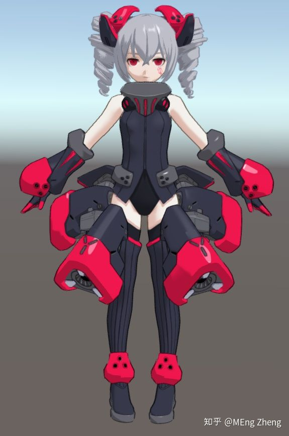

但是第二期做出皮肤的质感，其实可以用次表面散射来做更好地皮肤表面通透效果。

次表面散射效果可以营造一种材质表面透光的效果，也可以使物体视觉上更好地融入环境。我们本期就来尝试做一个近似的效果。

本期我在第二期代码上添加的内容其实很简单，但是我想花很大地篇幅去讲清楚为什么要这么做，以及为什么这么做是有效的，而不是简单地说“怎么做”这件事。

## 目录

1. 皮肤渲染次表面散射技术的简单总结

2. 1. 纹理空间次表面散射
   2. 屏幕空间的次表面散射
   3. 预积分次表面散射

3. 基于预积分次表面散射技术的卡通渲染向的实现

4. 总结及下期计划


##  1. 皮肤渲染次表面散射技术的简单总结

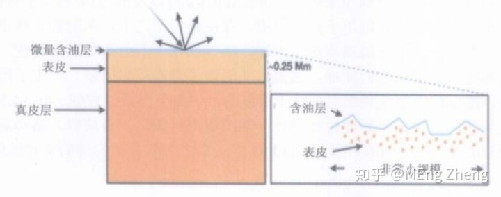

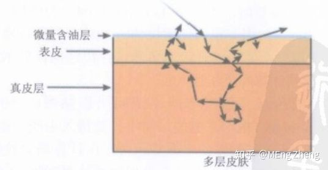

这两张是《GPU Gems3》中的截图，一个简单的剖面模型，把皮肤剖面做了一个分层，一束光线射入表面的某个点之后，在表面下层经历了一系列的散射，以一定比例的亮度从表面的另一个点射出。这样的过程会使观察到的材质表面有一个透光感。

然后光线传输方程（参照@春日老师的博客https://zhuanlan.zhihu.com/p/54120898）告诉我们，光线经历了无数次散射之后，已经失去了方向性，眼睛接收的散射光亮度跟观察的方向无关，只跟散射光的出射点与距离有关。于是就有了散射剖面：


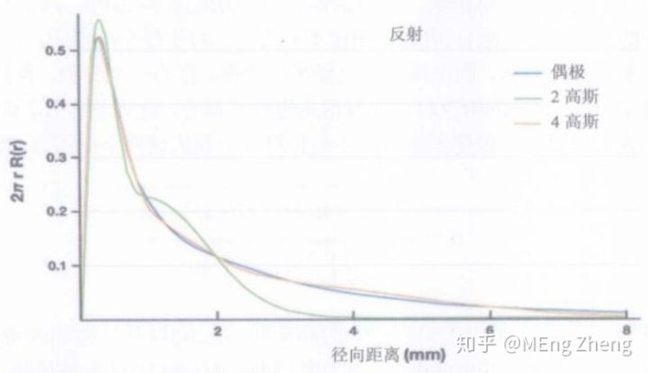

偶极子模型拟合出的曲线是比较精确精确的。R(r)表明，距离入射点的径向距离越远，散射光线亮度越低；距离入射点的径向距离越近，散射光线亮度越高。另外这张图还表明，偶极子模拟的R(r)曲线可以用高斯函数近似，也可以利用高斯函数的级数来更准确地近似。级数的近似这个思路应该很好理解，例如泰勒级数就是微分多项式的逼近，傅里叶级数就是正弦多项式的逼近，等等。图中表明4阶高斯比2阶高斯有更好的近似效果。

## 1.1纹理空间次表面散射

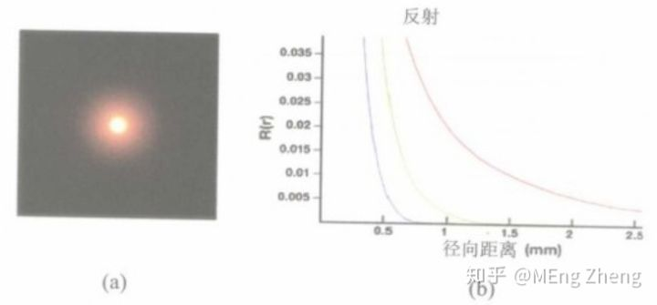

《GPU Gems3》中的这张图表明，红光由于波长最长，在同一径向距离下R(r)的值是最大的，或者可以理解为红光能在次表面扩散得最远。而左图看起来更像一个点扩散函数，点扩散函数是可以用卷积的方式表达的。

于是第一种实现思路就是，既然表明每个点的红光会扩散到其他点上，那换而言之就是其他点在接收漫反射辐照的同时还要接收周围点的散射光，并且接收到距离近的点散射光亮度大，接收到距离远的点散射光亮度小。也就是计算该着色点的亮度还需要把周围点的辐照以一定地比例算进来，然而这个跟距离相关的比例又可以用高斯函数近似。那么这个问题就可以在纹理空间（也可以理解切线空间）用高斯卷积核去实现。

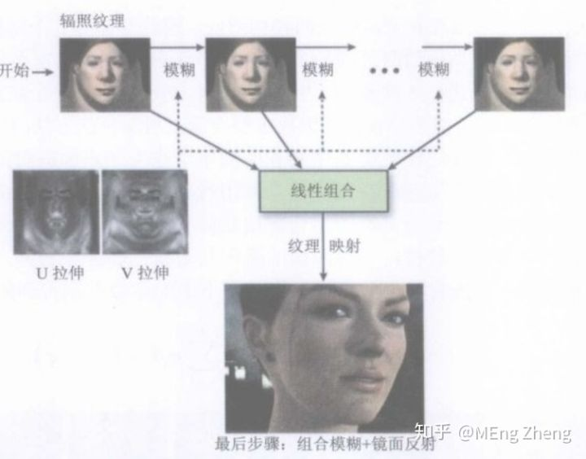

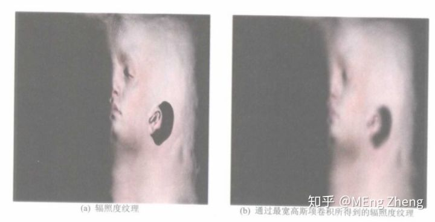

基于纹理空间的次表面散射技术的具体做法是，先将光照计算的结果渲染到纹理空间上，再将这张纹理进行多次高斯核卷积（高斯级数）实现多次模糊，再线性加权组合到一起，最后重新渲染到Mesh上。

但是这么做的问题是，它不符合现有的渲染管线，一些优化策略例如背面剔除等就无法应用了。

## 1.2 屏幕空间的次表面散射

另一种思路是，既然在纹理空间做卷积不合适，那就在屏幕空间做卷积。也就是用后效来实现SSS。

但是这类方法会出现的问题是，会有色光扩散到本不连续的表面上，产生明显的人工痕迹。

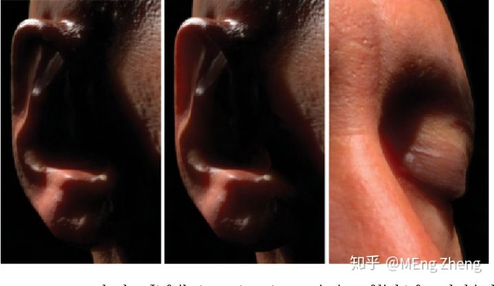

例如图中鼻子部分的红色光扩散到了眼睛。

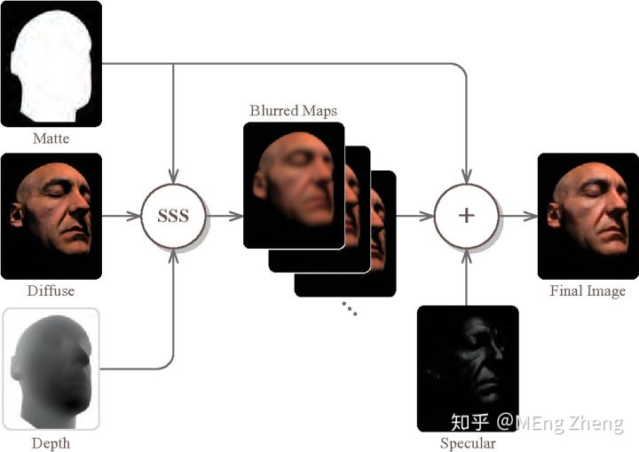

即便可以在渲染之前先渲染一张物体的Mask防止物体的散射光扩散到其他物体，但是仍然避免不了物体自身的表面不连续扩散。

在此基础上15年又出了可分离次表面散射（SSSSS），将高斯核进行了分解，SSSS文中提出了很多种分解方法（参照@春日老师的博客https://zhuanlan.zhihu.com/p/54120898）来提升卷积的运算速度。

最后说一下我对屏幕空间的次表面散射的看法，首先用后效来实现是一个很好的思路，可以把复杂的运算在屏幕空间这个小空间内高性能地完成。利用屏幕空间做后效的方法有很多，例如屏幕空间环境光遮蔽（SSAO），屏幕空间的光线追踪（screen space ray marching），延迟渲染（Deferred Shading），以及对其进一步优化的分块着色（block  shading）,分簇着色（cluster  shading），等等。但也正是因为如此，一个项目中在屏幕空间上完成的工作可能很多，如果算上一般的后效，例如泛光（bloom）等等，就更多了。在这种情况下，把一个方案放在后效上实现，会不会跟其他的后效有冲突，有依赖？是否有先后顺序，这就成了一个很麻烦的问题，也会带来新的程序耦合。我们希望功能的实现之间尽可能独立，才是一个良好的设计模式。因此，我更倾向于在不改变管线，不改变渲染队列的情况下实现次表面散射的方法。

## 1.3 预积分次表面散射

预积分的次表面散射技术[2010]基于两个观察结论：肉眼可见的次表面散射现象只会出现在表面曲率较大且正处于明暗交界线位置的区域。换而言之，次表面散射现象的强弱只和两个量有关，一是表面的曲率，而是法线和光线的点积。表面曲率越大，次表面散射在纹理空间的扩散范围就越大。

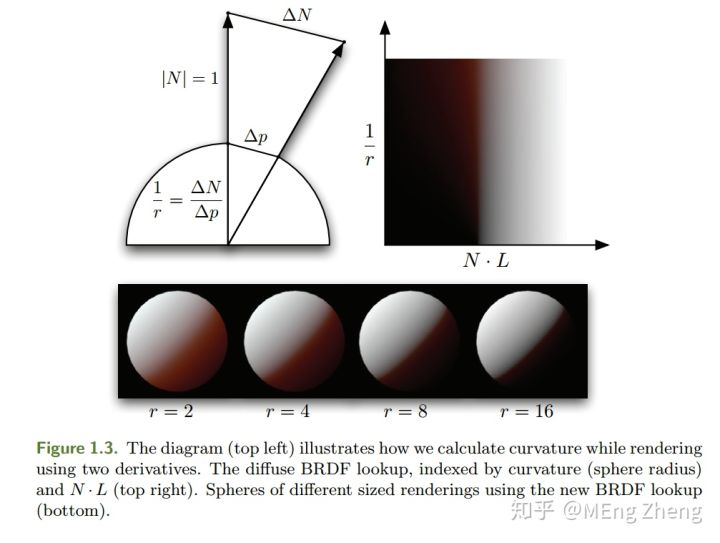

《GPU  Pro3》里关于预积分次表面散射的介绍是，在计算光照前先对整个模型进行一遍预积分计算曲率，在计算次表面散射的时候利用上计算的曲率，再关联上N*L作为扩散的强度和范围的一个参数。当获取了次表面散射的强度之后，就可以利用warp（给红光更慢的衰减速率）或者用高斯函数等方法来近似出次表面散射的效果了。

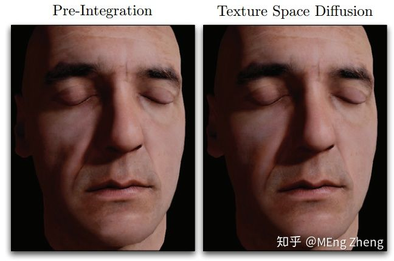

原文中图示表明，利用预积分实现的SS效果与纹理空间的SS效果没有明显的差异。


## 2. 基于预积分次表面散射技术的卡通渲染向的实现

回到卡通渲染，预积分次表面散射中的曲率，可能是唯一麻烦的问题。但是参照第二期LightMap的思路，曲率这个值，完全可以交给美术直接画到Map里，着色的时候直接采样出来用就行了。但是本期我没有额外去制作这个Map，就暂时先不考虑曲率这个影响因素。我暂时只利用光线和法线的点积作为SS扩散程度的一个参数。

正如我这个系列第一期的方式，先找一个球来测试光照计算：

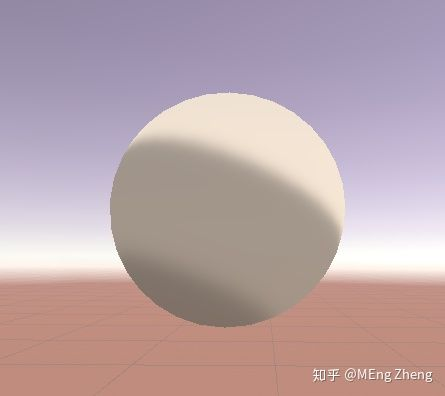

 首先，高斯函数的形式是：

![[公式]](Cartoonrenderingofthebasiclightingmodel.assets/equation-1588830033780.svg) 

b是高斯函数的中心，c是方差，方差越大，高斯函数越分散，反之越集中。

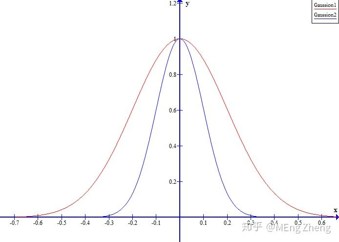方差不同的高斯函数，蓝色曲线的方差小

第2期我们利用Sigmoid函数对每个亮度级做了一个窗函数：

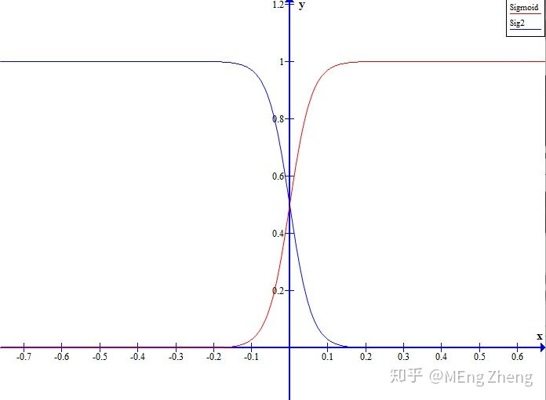

红色曲线为亮面的Mask，蓝色为暗面的Mask。

我希望在暗面的次表面散射效果明显，而亮面的效果较弱。于是我分别用这两个Mask以乘法的形式对方差不同的高斯函数做一个截取：

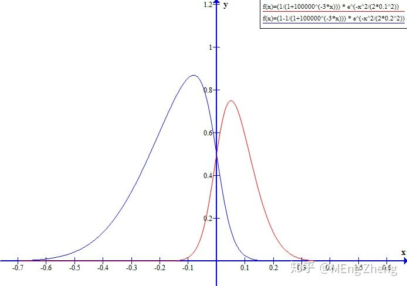

然后以加法的形式合并：

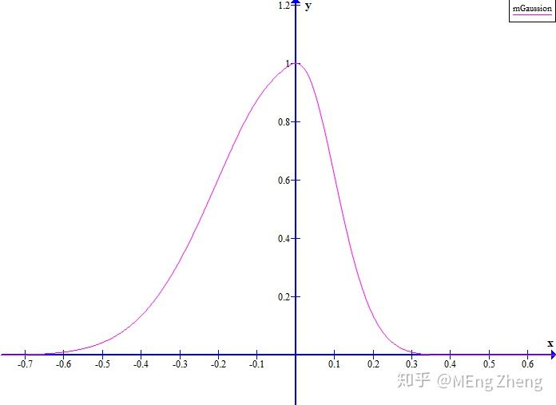

这样我就造出了在两侧扩散程度不同的扩散函数。整体的幅度和方差都可以用可调参数进行调节。如第一节所述，为了更好的拟合真实的扩散函数，应该以高斯级数的形式作为扩散函数。那我这里就简单地用2级。最后把这个函数作为一个比例因子，乘以希望发生次表面散射的颜色，再加到光照计算的结果上。

我把这部分的代码附一下：

```glsl
Shader "Custom/SSS"
{
    Properties
    {
        _Color ("Color", Color) = (1,1,1,1)
        _MainTex ("Albedo (RGB)", 2D) = "white" {}
        _Glossiness ("Smoothness", Range(0,1)) = 0.5
        _Metallic ("Metallic", Range(0,1)) = 0.0

		_SSSColor ("Subsurface Scattering Color", Color) = (1,0,0,1)
		_SSSColorSub("Subsurface Scattering 2nd Color", Color) = (0.8,0,0.2,1)
		_SSSWeight ("Weight of SSS", Range(0,1)) = 0.5
		_SSSSize("Size of SSS", Range(0,1)) = 0.5
		_SSForwardAtt("Atten of SS in forward Dir", Range(0,1)) = 0.5

		_diffuseBright("Brightness", Range(0,2.0)) = 0.0

		_DividLineM("DividLine of Middle", Range(-0.5, 0.8)) = 0.0
		_DividLineD("DividLine of Dark", Range(-1.0, 0.0)) = -0.5

		_DividSharpness("Sharpness of Divide Line", Range(0.2,5)) = 1.0
		
    }

	CGINCLUDE
	float Pow2(float x) {
		return x * x;
	}

	float ndc2Normal(float x) {
		return x * 0.5 + 0.5;
	}

	float warp(float x, float w) {
		return (x + w) / (1 + w);
	}

	float3 warp(float3 x, float3 w) {
		return (x + w) / (1 + w);
	}

	float3 warp(float3 x, float w) {
		return (x + w.xxx) / (1 + w.xxx);
	}

	float sigmoid(float x, float center, float sharp) {
		float s;
		s = 1 / (1 + pow(100000, (-3 * sharp * (x - center))));
		return s;
	}

	float Gaussion(float x, float center, float var) {
		return pow(2.718, -1 * Pow2(x - center) / var);
	}

	ENDCG

    SubShader
    {
        Tags { "RenderType"="Opaque" }
        LOD 200

        CGPROGRAM
        // Physically based Standard lighting model, and enable shadows on all light types
        #pragma surface surf SSS fullforwardshadows

        // Use shader model 3.0 target, to get nicer looking lighting
        #pragma target 3.0

        sampler2D _MainTex;

        struct Input
        {
            float2 uv_MainTex;
        };

        half _Glossiness;
        half _Metallic;
        fixed4 _Color;
		fixed4 _SSSColor;
		fixed4 _SSSColorSub;
		half _SSSWeight;
		half _SSSSize;
		half _diffuseBright;
		half _DividLineM;
		half _DividLineD;
		half _DividSharpness;
		half _SSForwardAtt;

		struct ToonSurfaceOutput
		{
			fixed3 Albedo;  // diffuse color
			fixed3 Normal;  // tangent space normal, if written
			fixed3 Emission;
			half Specular;  // specular power in 0..1 range
			fixed Gloss;    // specular intensity
			fixed Alpha;    // alpha for transparencies

			fixed3 diffColor;

			half specIntensity;
			half smoothMap;
			half AO;
		};

        // Add instancing support for this shader. You need to check 'Enable Instancing' on materials that use the shader.
        // See https://docs.unity3d.com/Manual/GPUInstancing.html for more information about instancing.
        // #pragma instancing_options assumeuniformscaling
        UNITY_INSTANCING_BUFFER_START(Props)
            // put more per-instance properties here
        UNITY_INSTANCING_BUFFER_END(Props)

		half4 LightingSSS(ToonSurfaceOutput s, half3 lightDir, half3 viewDir, half atten) {
			half3 nNormal = normalize(s.Normal);
			half NoL = dot(nNormal, lightDir);
			half Lambert = NoL;
			half SSLambert = warp(Lambert, _SSSWeight);
			
			half roughness = 0.95 - 0.95 * (s.smoothMap * _Glossiness);
			half _BoundSharp = 9.5 * Pow2(roughness - 1) + 0.5;

			//--------------------------------------------
			// diffuse
			//--------------------------------------------
			half MidSig = sigmoid(Lambert, _DividLineM, _BoundSharp * _DividSharpness);
			half DarkSig = sigmoid(Lambert, _DividLineD, _BoundSharp * _DividSharpness);

			half MidLWin = MidSig;
			half MidDWin = DarkSig - MidSig;
			half DarkWin = 1 - DarkSig;

			half diffuseLumin1 = (1 + ndc2Normal(_DividLineM)) / 2;
			half diffuseLumin2 = (ndc2Normal(_DividLineM) + ndc2Normal(_DividLineD)) / 2;
			half diffuseLumin3 = (ndc2Normal(_DividLineD));

			half3 diffuseDeflectedColor1 = MidLWin * diffuseLumin1.xxx;
			half3 diffuseDeflectedColor2 = MidDWin * diffuseLumin2.xxx;
			half3 diffuseDeflectedColor3 = DarkWin * diffuseLumin3.xxx;
			half3 diffuseBrightedColor = warp(diffuseDeflectedColor1 + diffuseDeflectedColor2 + diffuseDeflectedColor3, _diffuseBright.xxx);

			half3 diffuseResult = diffuseBrightedColor * s.diffColor.rgb;

			//----------------------------------------------
			// scattering
			//----------------------------------------------
			half SSMidLWin = Gaussion(Lambert, _DividLineM, _SSForwardAtt * _SSSSize);
			half SSMidDWin = Gaussion(Lambert, _DividLineM, _SSSSize);

			half SSMidLWin2 = Gaussion(Lambert, _DividLineM, _SSForwardAtt * _SSSSize*0.01);
			half SSMidDWin2 = Gaussion(Lambert, _DividLineM, _SSSSize * 0.01);

			half3 SSLumin1 = MidLWin * diffuseLumin2 * _SSForwardAtt * (SSMidLWin + SSMidLWin2);
			half3 SSLumin2 = ((MidDWin + DarkWin) * diffuseLumin2) * (SSMidDWin+ SSMidDWin2);
			
			half3 SS = _SSSWeight * (SSLumin1 + SSLumin2) * _SSSColor.rgb;

			//---------------------------------------------------------------------------
			

			half3 lightResult = diffuseResult.rgb * _LightColor0.rgb + SS;

			return half4(lightResult.rgb, s.Alpha);
		}

        void surf (Input IN, inout ToonSurfaceOutput o)
        {
            // Albedo comes from a texture tinted by color
            fixed4 c = tex2D (_MainTex, IN.uv_MainTex);
            o.Albedo = 0.2 * c.rgb;

            o.smoothMap = _Glossiness;

			o.diffColor = c.rgb * _Color;

            o.Alpha = c.a;
        }
        ENDCG
    }
    FallBack "Diffuse"
}
```

然后我们看一下效果：

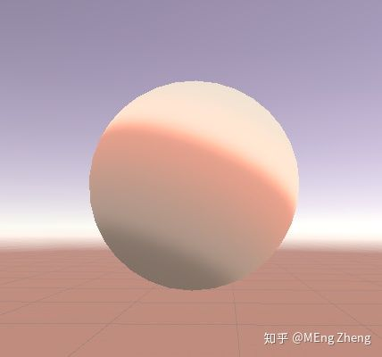

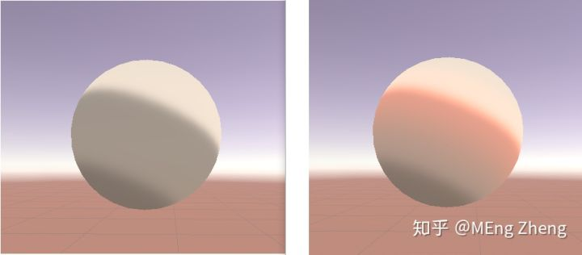

加上次表面散射效果之后，就会让材质表面有一种光线通透的感觉了。

接下来把这个实现思路整合到我们第3期的代码中，整理之后的代码我附一下：

```glsl
Shader "Custom/Bronya"
{
    Properties
    {
        _Color ("Color", Color) = (1,1,1,1)
        _MainTex ("Albedo (RGB)", 2D) = "white" {}
        _Glossiness ("Smoothness Scale", Range(0,1)) = 0.5
        _Metallic ("Metallic", Range(0,1)) = 0.0

		_LightMap("Light Map", 2D) = "white" {}

		_DividSharpness("Sharpness of Divide Line", Range(0.2,5)) = 1.0

		_DividLineSpec("DividLine of Specular", Range(0.5, 1.0)) = 0.8
		_DividLineM("DividLine of Middle", Range(-0.5, 0.8)) = 0.0
		_DividLineD("DividLine of Dark", Range(-1.0, 0.0)) = -0.5

		_diffuseBright("diffuse Brightness", Range(0.0,2.0)) = 1.0
		_AOWeight("Weight of Ambient Occlusion", Range(0.0,2.0)) = 1.0

		_ShadowAttWeight("Weight of shadow atten", range(0.0, 0.5)) = 0.3

		_DarkFaceColor("Color of Dark Face", Color) = (1.0, 1.0, 1.0, 1.0)
		_DeepDarkColor("Color of Deep Dark Face", Color) = (1.0, 1.0, 1.0, 1.0)

		_FresnelEff("Fresnel Effect", Range(0, 1)) = 0.5
		_FresnelColor("Fresnel Color", Color) = (1,1,1,1)

		_SSSColor("Subsurface Scattering Color", Color) = (1,0,0,1)
		_SSSWeight("Weight of SSS", Range(0,1)) = 0.0
		_SSSSize("Size of SSS", Range(0,1)) = 0.0
		_SSForwardAtt("Atten of SS in forward Dir", Range(0,1)) = 0.5

		_OutlineWidth("Outline Width", Range(0, 0.5)) = 0.024
		_OutlineColor("Outline Color", Color) = (0.5,0.5,0.5,1)
    }

	CGINCLUDE
	#include "UnityCG.cginc"

	float D_GGX(float a2, float NoH) {
		float d = (NoH * a2 - NoH) * NoH + 1;
		return a2 / (3.14159 * d * d);
	}

	float sigmoid(float x, float center, float sharp) {
		float s;
		s = 1 / (1 + pow(100000, (-3 * sharp * (x - center))));
		return s;
	}

	float Pow2(float x) {
		return x * x;
	}

	float ndc2Normal(float x) {
		return x * 0.5 + 0.5;
	}

	float Normal2ndc(float x) {
		return x * 2.0 - 1.0;
	}

	float warp(float x, float w) {
		return (x + w) / (1 + w);
	}

	float3 warp(float3 x, float3 w) {
		return (x + w) / (half3(1.0,1.0,1.0) + w);
	}

	float Pow3(float x) {
		return x * x* x;
	}

	float Pow5(float x) {
		return x * x* x* x* x;
	}

	float3 Fresnel_schlick(float VoN, float3 rF0) {
		return rF0 + (1 - rF0) * Pow5(1 - VoN);
	}

	float3 Fresnel_extend(float VoN, float3 rF0) {
		return rF0 + (1 - rF0) * Pow3(1 - VoN);
	}

	float Gaussion(float x, float center, float var) {
		return pow(2.718, -1 * Pow2(x - center) / var);
	}

	ENDCG

    SubShader
    {
        Tags { "RenderType"="Opaque" }
        LOD 200

        CGPROGRAM
        // Physically based Standard lighting model, and enable shadows on all light types
        #pragma surface surf Toon fullforwardshadows

        // Use shader model 3.0 target, to get nicer looking lighting
        #pragma target 3.0

        sampler2D _MainTex;
		sampler2D _LightMap;
		float4 _LightMap_TexelSize;

		struct Input
		{
			float2 uv_MainTex;
			float2 uv_LightMap;
		};

		struct ToonSurfaceOutput
		{
			fixed3 Albedo;  // diffuse color
			fixed3 Normal;  // tangent space normal, if written
			fixed3 Emission;
			half Specular;  // specular power in 0..1 range
			fixed Gloss;    // specular intensity
			fixed Alpha;    // alpha for transparencies

			fixed3 diffColor;

			half specIntensity;
			half smoothMap;
			half AO;
		};

        half _Glossiness;
        half _Metallic;
        fixed4 _Color;
		half _DividLineSpec;
		half _ShadowAttWeight;
		half _DividSharpness;
		half _DividLineM;
		half _DividLineD;
		half _diffuseBright;
		half _AOWeight;
		fixed4 _DarkFaceColor;
		fixed4 _DeepDarkColor;
		half _FresnelEff;
		fixed4 _FresnelColor;

		fixed4 _SSSColor;
		half _SSSWeight;
		half _SSSSize;
		half _SSForwardAtt;

        // Add instancing support for this shader. You need to check 'Enable Instancing' on materials that use the shader.
        // See https://docs.unity3d.com/Manual/GPUInstancing.html for more information about instancing.
        // #pragma instancing_options assumeuniformscaling
        UNITY_INSTANCING_BUFFER_START(Props)
            // put more per-instance properties here
        UNITY_INSTANCING_BUFFER_END(Props)

		half4 LightingToon(ToonSurfaceOutput s, half3 lightDir, half3 viewDir, half atten) {
			// Array
			half3 nNormal = normalize(s.Normal);
			half3 HDir = normalize(lightDir + viewDir);

			half NoL = dot(nNormal, lightDir);
			half NoH = dot(nNormal, HDir);
			half NoV = dot(nNormal, viewDir);
			half VoL = dot(viewDir, lightDir);
			half VoH = dot(viewDir, HDir);

			half roughness = 0.95 - 0.95 * (s.smoothMap * _Glossiness);
			half _BoundSharp = 9.5 * Pow2(roughness - 1) + 0.5;
			//----------------------------------------------------
			// fresnel
			//----------------------------------------------------
			half3 fresnel = Fresnel_extend(NoV, float3(0.1, 0.1, 0.1));
			half3 fresnelResult = _FresnelEff * fresnel * (1 - VoL) / 2;

			//--------------------------------------------
			// Specular
			//--------------------------------------------

			half NDF0 = D_GGX(roughness * roughness, 1);
			half NDF_HBound = NDF0 * _DividLineSpec;

			half NDF = D_GGX(roughness * roughness, NoH) + _ShadowAttWeight * (atten - 1);
			half specularWin = sigmoid(NDF, NDF_HBound, _BoundSharp * _DividSharpness);

			half SpecWeight = specularWin * (NDF0 + NDF_HBound) / 2 * s.specIntensity; //optional

			//----------------------------------------------------
			// diffuse
			//--------------------------------------------
			half Lambert = NoL + _AOWeight * Normal2ndc(s.AO) + _ShadowAttWeight * (atten - 1);

			half MidSig = sigmoid(Lambert, _DividLineM, _BoundSharp * _DividSharpness);
			half DarkSig = sigmoid(Lambert, _DividLineD, _BoundSharp * _DividSharpness);

			half MidLWin = MidSig;
			half MidDWin = DarkSig - MidSig;
			half DarkWin = 1 - DarkSig;


			half diffuseLumin1 = (1 + ndc2Normal(_DividLineM)) / 2;
			half diffuseLumin2 = (ndc2Normal(_DividLineM) + ndc2Normal(_DividLineD)) / 2;
			half diffuseLumin3 = (ndc2Normal(_DividLineD));

			half3 diffuseDeflectedColor1 = MidLWin * diffuseLumin1.xxx;
			half3 diffuseDeflectedColor2 = MidDWin * diffuseLumin2.xxx * _DarkFaceColor.rgb * 3 / (_DarkFaceColor.r + _DarkFaceColor.g + _DarkFaceColor.b);
			half3 diffuseDeflectedColor3 = DarkWin * diffuseLumin3.xxx * _DeepDarkColor.rgb * 3 / (_DeepDarkColor.r + _DeepDarkColor.g + _DeepDarkColor.b);
			half3 diffuseBrightedColor = warp(diffuseDeflectedColor1 + diffuseDeflectedColor2 + diffuseDeflectedColor3, _diffuseBright.xxx);

			half3 diffuseResult = diffuseBrightedColor * s.diffColor.rgb;

			//------------------------------------------------------
			// Subsurface Scattering
			//------------------------------------------------------
			half SSMidLWin = Gaussion(Lambert, _DividLineM, _SSForwardAtt * _SSSSize);
			half SSMidDWin = Gaussion(Lambert, _DividLineM, _SSSSize);
			half3 SSLumin1 = (MidLWin * diffuseLumin2) * _SSForwardAtt * SSMidLWin;
			half3 SSLumin2 = ((MidDWin+ DarkWin) * diffuseLumin2) * SSMidDWin;
			half3 SS = _SSSWeight * (SSLumin1 + SSLumin2) * _SSSColor.rgb;


			//--------------------------------------------------------
			half3 lightResult = SpecWeight * _LightColor0.rgb + (1 - SpecWeight) * diffuseResult.rgb * _LightColor0.rgb + SS + fresnelResult * _FresnelColor.rgb;

			return half4(lightResult.rgb, 1.0);
		}

        void surf (Input IN, inout ToonSurfaceOutput o)
        {
			// Albedo comes from a texture tinted by color
			fixed4 c = tex2D(_MainTex, IN.uv_MainTex) * _Color;
			o.diffColor = c.rgb;
			o.Albedo = 0.2 * c.rgb;

			fixed4 ilm = tex2D(_LightMap, IN.uv_LightMap);

			
			//-------------------------------------------
			// blur
			float2 tmpuv1 = IN.uv_LightMap + _LightMap_TexelSize.xy;
			float2 tmpuv2 = IN.uv_LightMap - _LightMap_TexelSize.xy;
			float2 tmpuv3 = IN.uv_LightMap;
			tmpuv3.x += _LightMap_TexelSize.x;
			tmpuv3.y -= _LightMap_TexelSize.y;
			float2 tmpuv4 = IN.uv_LightMap;
			tmpuv4.x -= _LightMap_TexelSize.x;
			tmpuv4.y += _LightMap_TexelSize.y;

			fixed4 ilm1 = tex2D(_LightMap, tmpuv1);
			fixed4 ilm2 = tex2D(_LightMap, tmpuv2);
			fixed4 ilm3 = tex2D(_LightMap, tmpuv3);
			fixed4 ilm4 = tex2D(_LightMap, tmpuv4);

			//ilm = 0.4 * ilm + 0.15 * (ilm1 + ilm2 + ilm3 + ilm4);
			ilm = 0.2 * (ilm + ilm1 + ilm2 + ilm3 + ilm4);
			//---------------------------------------
			

			o.smoothMap = ilm.r;

			o.specIntensity = ilm.b;
			o.AO = ilm.g;

			o.Alpha = c.a;
        }
        ENDCG

		Pass{
		Name "OUTLINE"
		Tags{ "LightMode" = "Always" }
		Cull Front
		ZWrite On
		ColorMask RGB
		Blend SrcAlpha OneMinusSrcAlpha

		CGPROGRAM
			#pragma vertex vert
			#pragma fragment frag

			#include "UnityCG.cginc"
			struct appdata {
				float4 vertex : POSITION;
				float3 normal : NORMAL;
				float4 texCoord : TEXCOORD0;

			};

			struct v2f {
				float4 pos : SV_POSITION;
				float4 color : COLOR;
				float4 tex : TEXCOORD0;
			};

			uniform half _OutlineWidth;
			sampler2D _MainTex;
			fixed4 _OutlineColor;

			v2f vert(appdata v) {
				// just make a copy of incoming vertex data but scaled according to normal direction
				v2f o;
				o.pos = UnityObjectToClipPos(v.vertex);
				float3 norm = mul((float3x3)UNITY_MATRIX_IT_MV, v.normal);
				float2 extendDir = normalize(TransformViewToProjection(norm.xy));

				_OutlineWidth = _OutlineWidth;

				o.pos.xy += extendDir * (o.pos.w * _OutlineWidth * 0.1);

				o.tex = v.texCoord;

				o.color = half4(0,0,0,1);
				return o;
			}

			half4 frag(v2f i) :COLOR{
				fixed4 c = tex2D(_MainTex, i.tex);

				return half4(c.rgb* _OutlineColor.rgb, 1.0);
			}

			ENDCG

		}//Pass
    }
    FallBack "Diffuse"
}
```

最后展示一下皮肤的效果。

使用了次表面散射的皮肤效果（头发我也加上了，这一点纯粹是为了艺术效果）：

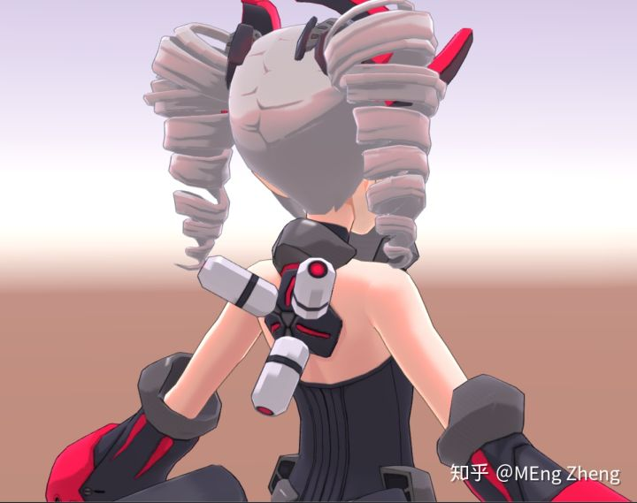

没有使用次表面散射的效果：

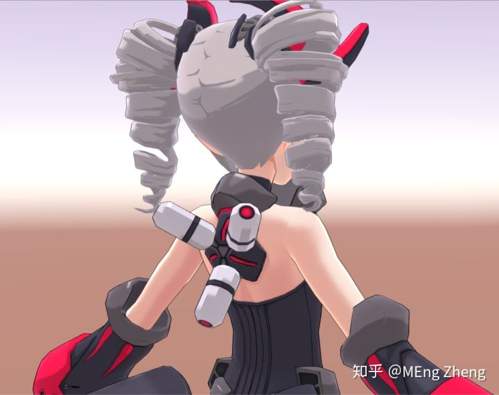

第3期我们设置了一个亮度调整参数，现在我把这个参数降低以模拟强光下的效果：

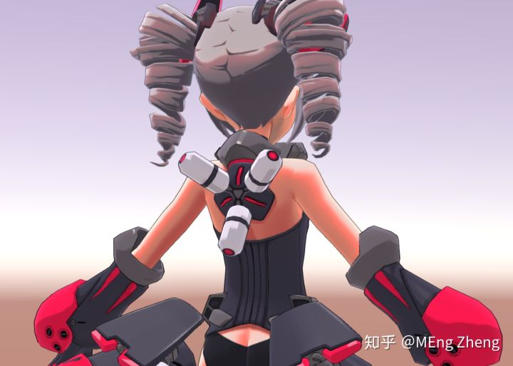

这样看起来皮肤的通透感就更强烈了。当然这张图我为了展示效果，有些校色问题没有处理得很好。

最后是一个整体效果的对比展示：

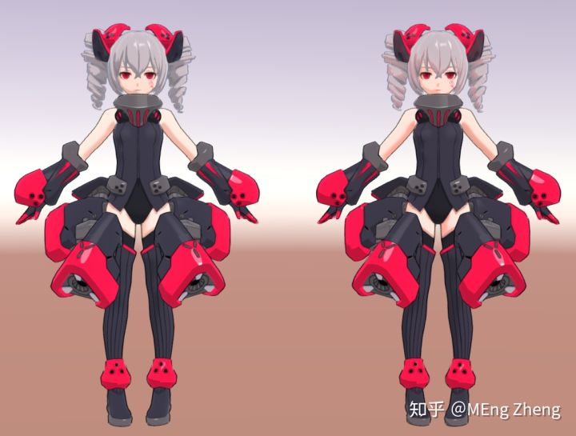

左图是第3期的效果，右图是本期附上SS之后的效果。右图对环境的融入感是好于左图的。


## 3. 总结及下期计划

本期内容很少，简单介绍了下我从pbr的皮肤渲染中得到的启发，并且用高斯函数的级数做扩散近似应用到的卡通渲染的光照模型下实现了简单的次表面散射效果。

应上一期的计划，下期我计划实现一个卡通渲染下的金属材质表现。然后用Metallic参数在金属和非金属的渲染工作流之间做插值，达到金属度可调的效果。


# 【05】金属材质卡通渲染

## 前言

本期做金属材质的卡通渲染。我的实现思路是，先把基本的PBR做出来，然后在PBR的规则下加入阈值化等操作来实现卡通风格。本期的主要涉及PBR，各项异性等内容。本期的结果如上图，左边3个Object是实现的PBR的金属效果，右边是加入了第【2】期中的阈值化等操作后的卡通风格的金属材质效果。

由于被疫情关在家中，而我之前的Project在学校的电脑里，本期就没有之前的Bronya的模型了。暂时就先用几个基本的几何体做效果。

## 目录

1、菲涅尔效应

2、渲染方程

3、离散化的渲染方程

4、各向异性的法线分布函数

5、材质卡通化


## 1、菲涅尔效应

菲涅尔效应在之前的文章中已经提到过，本文着重再说一遍，因为菲涅尔反射率是金属表现的关键。

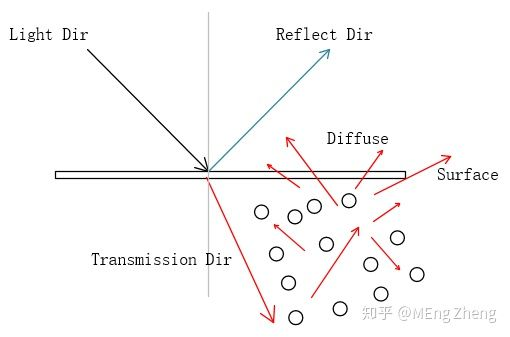

入射光线接触到某个面元，入射光线的一部分辐射量在面元表面发生反射，另一部分辐射量发生折射。由于能量守恒，在面元处发生折射和反射的辐射量等于入射光线携带的辐射量。

反射率是指反射光线和折射光线的辐射亮度之比。如果该面元处的反射率已知，就可以根据入射光线的辐射照度和材质表面的属性来计算反射光线的辐射亮度了。

对不透明物体，折射光线无法穿过物体，在物体表面内部与粒子发生了无数次碰撞后重新射出物体表面。由于发生了无数次碰撞，出射光线已经失去了方向性。出射光线的辐射亮度成为了一个与观察方向无关的量，我们称之为漫反射。所以对不透明物体，漫反射的本质就是表面的折射。

此时我们就可以建立初步的方程，面元s处：

**观察方向亮度 = 反射率 \* 镜面反射亮度 + （1 - 反射率）\* 漫反射亮度**

那么现在要知道反射率跟什么有关。就可以求解这个方程。

菲涅尔效应阐述，反射率和材质的属性和观察方向和面元s的法线方向有关，也就是与dot(N,V)有关。

在本专栏第【2】期，已经列过这个方程了，这里直接粘贴过来。

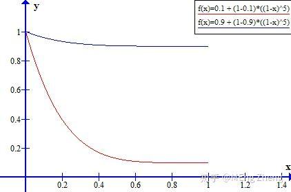


schlick近似公式如下：


x为NoV，当视线与表面相切时，反射率最高，这也就是在物体边缘容易观察到较亮的反射的原因。当视线与表面垂直时，反射率最低。rF0为材质的属性，决定视线与表面垂直时的反射率。红色线为rF0等于0.1时的fresnel，反射率随着视线与法线夹角变化剧烈；蓝色线为rF0等于0.9时的fresnel，反射率基本不随视线与法线夹角变化。

对不同材质，rF0都不同，且材质对每种色光分量都可能有不同的反射率。对非金属而言，rF0比较小，反射率低，观察非金属得到的亮度大部分为漫反射的亮度。对金属材质而言，rF0极高，一般在0.95以上，也就是对全观察方向都有很高的反射率，这就是金属表面光泽的原因。

**2、渲染方程**

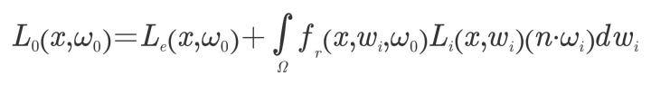

渲染方程很多文章都在讲，我这里再简单提一下。理解连续空间的渲染方程才能理解渲染方程的离散化表达。

Lo是观察到的亮度，x是指发生光线交互的面元位置，wo表示观察方向，wi表示入射光线方向。先看第一项，Le是自发光，作为线性叠加到最终观察到的亮度上，这没什么疑问。看第二项， ![[公式]](Cartoonrenderingofthebasiclightingmodel.assets/equation-1588830063504.svg) 表示面元x表面的一个半球，Li表示入射光线的亮度，fr表示双向反射分布函数。第二项的意思是，面元x表面的所有可能的入射方向（整个半球）光线各自的亮度Li，以一定的比例fr反射出去，这些反射亮度的总和就是在面元x处观察到的亮度。

如果算GI，肯定是要用蒙特卡洛把整个半球方向都积分一遍。但是我们算RealTime的光照，就要把渲染方程离散化。

## 3、离散化的渲染方程

第一节我们接收到的所有入射光线的拆分成镜面反射和漫反射两部分。这里我的漫反射部分就用Lambert做。镜面反射部分我们拆成离散光源和环境反射两部分。对离散光源部分，反射亮度为光源亮度在BRDF的作用结果。BRDF我这里省略掉遮蔽项，只保留NDF（法线分布函数）和菲涅尔反射率。关于NDF与微平面理论在专栏第【2】期有讲。这里还是继续用GGX做表面法线分布，因为GGX具有形状不变性，可以做各向异性。

[MEng Zheng：【02】卡通渲染基本光照模型的实现](https://zhuanlan.zhihu.com/p/95986273)[zhuanlan.zhihu.com](https://zhuanlan.zhihu.com/p/95986273)

环境反射用反射方向对对SkyBox做立方体采样实现。

总结一下：

**Output = (1-Fresnel) \* LambertDiffuse + Fresnel \* (Specular + Ambient)**

**Ambient =** **Sample（Skybox）**

另外对非金属而言，镜面反射直接反射光源的颜色，对金属而言，只反射与金属颜色相关的颜色分量。

**非金属：Specular = LightColor \* BRDF**

**金属：Specular = LightColor \* BRDF \* TextureColor**

按照迪士尼BRDF的工作流，用一个Metallic参数在金属工作流和非金属工作流之间做插值作为最终输出。

**Output = lerp(nonMatallicOutput, MatallicOutput,  Metallic)**

好，根据这个思路，直接来实现。我这里把代码附一下：

```glsl
Shader "Hidden/sphereMat"
{
    Properties
    {
        _MainTex("Texture", 2D) = "white" {}
        _Matallic("Matalic", Range(0,1)) = 0.5
        _Smoothness("Smoothness", Range(0,1)) = 0.5
        _baseColor("Base Color", Color) = (1,1,1)

        _nonMatrF0("NonMatal RF0", Color) = (0.3,0.3,0.3)
        _MatrF0("Matal RF0", Color) = (0.95,0.95,0.95)
    }

    SubShader
    {
        Tags { "RenderType" = "Opaque" }
        // No culling or depth

        Pass
        {
            Tags { "LightMode" = "ForwardBase" }

            CGPROGRAM

        // Apparently need to add this declaration
        #pragma multi_compile_fwdbase	

        #pragma vertex vert
        #pragma fragment frag

        #include "UnityCG.cginc"
        #include "Lighting.cginc"
        #include "AutoLight.cginc"
        #include "mMath.cginc"

        struct appdata
        {
            float4 vertex : POSITION;
            float4 texcoord : TEXCOORD0;
            float3 normal : NORMAL;
            float4 tangent : TANGENT;
        };

        struct v2f {
            float4 pos : SV_POSITION;
            float4 uv : TEXCOORD0;
            float3 worldNormal : TEXCOORD1;
            float3 worldTangent : TEXCOORD2;
            float3 worldBinormal : TEXCOORD3;
            float3 worldPos : TEXCOORD4;

            SHADOW_COORDS(5)
        };

        sampler2D _MainTex;
        float4 _MainTex_ST;
        float _Smoothness;
        float _Matallic;
        half3 _baseColor;
        half3  _nonMatrF0;
        half3  _MatrF0;
        v2f vert(appdata v)
        {
            v2f o;
            o.pos = UnityObjectToClipPos(v.vertex);

            o.uv.xy = v.texcoord.xy * _MainTex_ST.xy + _MainTex_ST.zw;
            o.uv.zw = o.uv.xy;

            o.worldNormal = UnityObjectToWorldNormal(v.normal); // z
            o.worldTangent = UnityObjectToWorldDir(v.tangent.xyz);  // x
            o.worldBinormal = cross(o.worldNormal, o.worldTangent) * v.tangent.w;   // y

            o.worldPos = mul(unity_ObjectToWorld, v.vertex).xyz;

            TRANSFER_SHADOW(o);

            return o;
        }

        fixed4 frag(v2f i) : SV_Target
        {
            half3 bump = half3(0,0,1);
            half3 worldNormal = normalize(bump.x * i.worldTangent + bump.y * i.worldBinormal + bump.z * i.worldNormal);
            half3 tangent = normalize(i.worldTangent);
            half3 binormal = normalize(i.worldBinormal);

            half3 worldLightDir = normalize(_WorldSpaceLightPos0.xyz);
            half3 viewDir = normalize(_WorldSpaceCameraPos.xyz - i.worldPos.xyz);
            half3 halfDir = normalize(worldLightDir + viewDir);

            float VoN = dot(worldNormal, viewDir);
            float NoL = dot(worldNormal, worldLightDir);
            float NoH = dot(worldNormal, halfDir);

            //float roughness = 0.98 * (1 - _Smoothness) + 0.02;

            float roughness = 1 - _Smoothness;
            roughness *= (1.7 - 0.7 * roughness) * 0.98;
            roughness += 0.02;


            float mata = 0.98 * _Matallic;

            fixed4 col = tex2D(_MainTex, i.uv);
            col.rgb *= _baseColor.rgb;

            half3 rF0 = lerp(_nonMatrF0, _MatrF0,mata);
            half3 fresnel = Fresnel_schlick(VoN, rF0);
            half3 fresnelOutline = fresnel;

            UNITY_LIGHT_ATTENUATION(atten, i, i.worldPos);

            atten = warp(atten, 0.3);

            // diffuse
            half3 lambertDiff = saturate(NoL) * col.rgb;
            half3 diffuse = (1 - fresnel) * lambertDiff * atten;

            // specular
            float Ndf =  D_GGX(roughness * roughness, NoH);
            float3 unMatSpecular = fresnel * Ndf * _LightColor0.rgb * atten;
            float3 MatSpecular = unMatSpecular * col.rgb;

            // ambient
            float3 reflectDir = reflect(-viewDir, worldNormal);
            float4 envSample = UNITY_SAMPLE_TEXCUBE_LOD(unity_SpecCube0, reflectDir, roughness * UNITY_SPECCUBE_LOD_STEPS);
            float3 Ambient = fresnel * envSample * col.rgb;

            half3 outColor = diffuse + lerp(unMatSpecular, MatSpecular, mata) + Ambient;

            return half4(outColor,1.0);
            //return half4(tangent.xyz, 1.0);
        }
        ENDCG
    }
    }
        FallBack "Specular" 
}
```

上述代码引用的mMath.cginc，该文件中我定义了一些数学函数的实现。

```glsl
#ifndef MMATH_CGINC
#define MMATH_CGINC

float Pow5(float3 x) {
    return x * x * x * x * x;
}

float3 Fresnel_schlick(float VoN, float3 rF0) {
    return rF0 + (1 - rF0) * Pow5(1 - VoN);
}

float D_GGX(float a2, float NoH) {
    float d = (NoH * a2 - NoH) * NoH + 1;
    return a2 / (3.14159 * d * d + 0.000001);
}

float D_GGXaniso(float ax, float ay, float NoH, float3 H, float3 X, float3 Y)
{
    float XoH = dot(X, H);
    float YoH = dot(Y, H);
    float d = XoH * XoH / (ax * ax) + YoH * YoH / (ay * ay) + NoH * NoH;
    return 1 / (3.14159 * ax * ay * d * d);
}

float warp(float x, float w) {
    return (x + w) / (1 + w);
}

#endif
```

材质效果如下，从左到右为光滑度从低到高，从上到下为金属度从低到高：

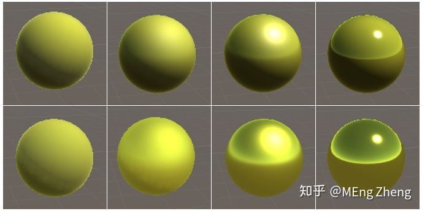

这里我的atten处理还有点问题，之后再想办法改吧。

## **4、各向异性的法线分布函数**

各向异性在金属材质中是出现频繁的现象。例如超市中的不锈钢碗：

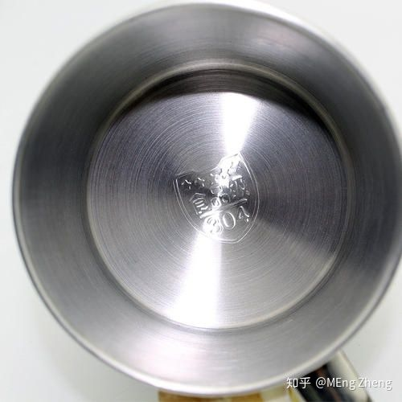


法线分布函数各向异性是指可以在切线空间的不同方向上有不同的表现，本文主要表现在粗糙度上。举例而言，一个各向同性的法线分布可视化如下：

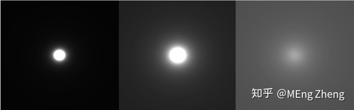粗糙度由小到大的法线分布函数

如果粗糙度小，法线分布集中；如果粗糙度大，法线分布分散。

各项异性的话，我可以让材质沿切线方向和副法线方向的粗糙度不同。那么法线分布就会有如下效果：

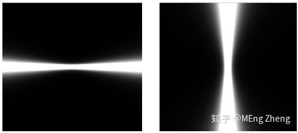

本文的各向异性的GGX的实现如下：

```glsl
float D_GGXaniso(float ax, float ay, float NoH, float3 H, float3 X, float3 Y)
{
    float XoH = dot(X, H);
    float YoH = dot(Y, H);
    float d = XoH * XoH / (ax * ax) + YoH * YoH / (ay * ay) + NoH * NoH;
    return 1 / (3.14159 * ax * ay * d * d);
}
```

将该法线分布替换上文代码的法线分布即可。可以得到这样的效果：

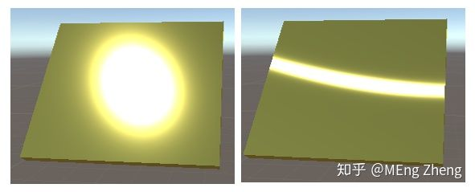左图为各向同性的NDF效果，右侧为各向异性的NDF效果

如果Mesh和UV设置的合理的话就就可以做出更多有趣的效果。对一个圆盘形的物体，如果副法线指向圆的半径方向，切线指向圆的切线方向的话，就可以有以下效果：

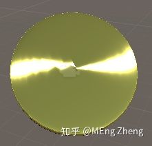

严格地来说，应该对环境反射也进行各向异性的处理。但是由于Unity的天空盒采样是利用MipMap实现的，就不好直接处理。我尝试过利用多次立方体采样，利用方向粗糙度控制采样步长的方法实现环境反射的各向异性，但是效果并不好。这里就暂时不处理。之后我找到合适的方式再加上。

## 5、材质卡通化

PBR的材质都做好了，接下来只有对光照的亮度做阈值化就可以实现基本的卡通效果了。在第【2】期中，我们是用了一个sigmoid函数来实现粗糙度可控的smooth step,

[MEng Zheng：【02】卡通渲染基本光照模型的实现](https://zhuanlan.zhihu.com/p/95986273)[zhuanlan.zhihu.com](https://zhuanlan.zhihu.com/p/95986273)


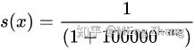

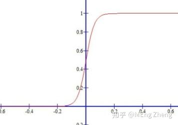


之前有同学建议直接纹理采样来实现阈值化，于是我就把这个函数直接写到texture里。u坐标表示lambert或者NDF的数值，v表示粗糙度：

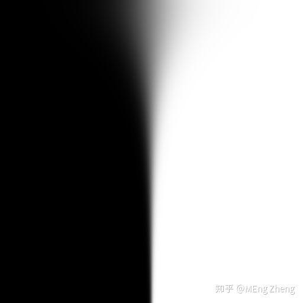

其它卡通化的做法与第【2】期一致。这里我附一下各向异性和各项同性的shader：

各向同性版本：

```glsl
Shader "Hidden/tooMat"
{
    Properties
    {
        _MainTex("Texture", 2D) = "white" {}
        _Matallic("Matalic", Range(0,1)) = 0.5
        _Smoothness("Smoothness", Range(0,1)) = 0.5
        _baseColor("Base Color", Color) = (1,1,1)

        _nonMatrF0("NonMatal RF0", Color) = (0.3,0.3,0.3)
        _MatrF0("Matal RF0", Color) = (0.95,0.95,0.95)

        _StepMap("Step Map", 2D) = "white" {}

        _boardLine1("BoardLine1", Range(-0.3,0.5)) = 0.0
        _boardLine2("BoardLine2", Range(-0.5,-0.1)) = -0.4

        _specBoardLine("SpecBoardLine",  Range(-1,1)) = 0.0
        _smoothScale("Smooth Scale", Range(1,5)) = 1.0

        _ShadowColor("Shadow Color", Color) = (0.95,0.95,0.95)
        _ShadowWeight("Shadow Weight", Range(0,1)) = 1.0
    }
    SubShader
    {
        Tags { "RenderType" = "Opaque" }

        Pass
        {
            Tags { "LightMode" = "ForwardBase" }
            CGPROGRAM

            // Apparently need to add this declaration
            #pragma multi_compile_fwdbase

            #pragma vertex vert
            #pragma fragment frag

            #include "UnityCG.cginc"
            #include "Lighting.cginc"
            #include "AutoLight.cginc"
            #include "mMath.cginc"

            struct appdata
            {
                float4 vertex : POSITION;
                float4 texcoord : TEXCOORD0;
                float3 normal : NORMAL;
                float4 tangent : TANGENT;
            };

            struct v2f
            {
                float4 pos : SV_POSITION;
                float4 uv : TEXCOORD0;
                float3 worldNormal : TEXCOORD1;
                float3 worldTangent : TEXCOORD2;
                float3 worldBinormal : TEXCOORD3;
                float3 worldPos : TEXCOORD4;

                SHADOW_COORDS(5)
            };

            sampler2D _MainTex;
            float4 _MainTex_ST;
            float _Smoothness;
            float _Matallic;
            half3 _baseColor;
            sampler2D _StepMap;

            half _boardLine1;
            half _boardLine2;
            half _specBoardLine;
            half3  _nonMatrF0;
            half3  _MatrF0;
            half _smoothScale;

            half3 _ShadowColor;
            half _ShadowWeight;
            v2f vert (appdata v)
            {
                v2f o;
                o.pos = UnityObjectToClipPos(v.vertex);

                o.uv.xy = v.texcoord.xy * _MainTex_ST.xy + _MainTex_ST.zw;
                o.uv.zw = o.uv.xy;

                o.worldNormal = UnityObjectToWorldNormal(v.normal); // z
                o.worldTangent = UnityObjectToWorldDir(v.tangent.xyz);  // x
                o.worldBinormal = cross(o.worldNormal, o.worldTangent) * v.tangent.w;   // y

                o.worldPos = mul(unity_ObjectToWorld, v.vertex).xyz;

                TRANSFER_SHADOW(o);

                return o;
            }


            fixed4 frag (v2f i) : SV_Target
            {
                fixed4 col = tex2D(_MainTex, i.uv);
                // just invert the colors
                col.rgb = col.rgb * _baseColor;

                UNITY_LIGHT_ATTENUATION(atten, i, i.worldPos);

                half3 bump = half3(0, 0, 1);
                half3 worldNormal = normalize(bump.x * i.worldTangent + bump.y * i.worldBinormal + bump.z * i.worldNormal);
                half3 tangent = normalize(i.worldTangent);
                half3 binormal = normalize(i.worldBinormal);

                half3 worldLightDir = normalize(_WorldSpaceLightPos0.xyz);
                half3 viewDir = normalize(_WorldSpaceCameraPos.xyz - i.worldPos.xyz);
                half3 halfDir = normalize(worldLightDir + viewDir);

                float VoN = dot(worldNormal, viewDir);
                float NoL = dot(worldNormal, worldLightDir);
                float NoH = dot(worldNormal, halfDir);

                float roughness = 1 - _Smoothness;
                roughness *= (1.7 - 0.7 * roughness) *0.98;
                roughness += 0.02;

                // fresnel
                float mata = 0.98 * _Matallic;
                half3 rF0 = lerp(_nonMatrF0, _MatrF0, mata);
                half3 fresnel = Fresnel_schlick(VoN, rF0);
                half3 fresnelOutline = fresnel;

                // difuse
                half halfLambert = NoL * 0.5 + 0.5;
                half step1Lambert = halfLambert - _boardLine1;
                fixed4 step1 = tex2D(_StepMap, half2(step1Lambert, roughness / _smoothScale));
                half step2Lambert = halfLambert - _boardLine2;
                fixed4 step2 = tex2D(_StepMap, half2(step2Lambert, roughness / _smoothScale));

                half winLight = step1;
                half winMiddle = step2 - step1;
                half winDark = 1 - step2;
                half3 diffuse = (winLight + winMiddle * (1 + step1Lambert) / 2 + winDark * (step1Lambert + step2Lambert) / 2) * col.rgb;

                // specular
                half r2 = roughness * roughness;
                half NDF0 = D_GGX(r2, 1);
                half NDF = D_GGX(r2, NoH) / NDF0;
                half ndfs = (NDF - _specBoardLine);
                fixed4 specularStep = tex2D(_StepMap, half2(ndfs, roughness));
                half specularWin = specularStep.x;
                fixed3 specular = specularWin * _LightColor0.rgb * (_specBoardLine*0.5 + 0.5) * NDF0 * atten;
                fixed3 matSpeculat = specular * col.rgb;

                // Ambient
                float3 reflectDir = reflect(-viewDir, worldNormal);
                float4 envSample = UNITY_SAMPLE_TEXCUBE_LOD(unity_SpecCube0, reflectDir, roughness * UNITY_SPECCUBE_LOD_STEPS);
                float3 Ambient = envSample.rgb;
                float3 MatAmbient = Ambient * col.rgb;


                half3 outColor = (1 - fresnel) * diffuse + fresnel * lerp(specular + Ambient, matSpeculat + MatAmbient, mata);
                half3 AttenColor = atten * outColor + outColor * _ShadowColor * (1 - atten);
                outColor = lerp(outColor, AttenColor, _ShadowWeight);
                return half4(outColor,1.0);
            }
            ENDCG
        }
    }
    FallBack "Specular"
}
```

各向异性的版本：

```glsl
Shader "Hidden/tooMatAniso"
{
    Properties
    {
        _MainTex("Texture", 2D) = "white" {}
        _Matallic("Matalic", Range(0,1)) = 0.5
        _SmoothnessX("Smoothness X", Range(0,1)) = 0.5
        _SmoothnessY("Smoothness Y", Range(0,1)) = 0.5
        _baseColor("Base Color", Color) = (1,1,1)

        _nonMatrF0("NonMatal RF0", Color) = (0.3,0.3,0.3)
        _MatrF0("Matal RF0", Color) = (0.95,0.95,0.95)

        _StepMap("Step Map", 2D) = "white" {}

        _boardLine1("BoardLine1", Range(-0.3,0.5)) = 0.0
        _boardLine2("BoardLine2", Range(-0.5,-0.1)) = -0.4

        _specBoardLine("SpecBoardLine",  Range(-1,1)) = 0.0
        _smoothScale("Smooth Scale", Range(1,5)) = 1.0

        _ShadowColor("Shadow Color", Color) = (0.95,0.95,0.95)
    }
        SubShader
        {
            Tags { "RenderType" = "Opaque" }

            Pass
            {
                Tags { "LightMode" = "ForwardBase" }
                CGPROGRAM

            // Apparently need to add this declaration
            #pragma multi_compile_fwdbase

            #pragma vertex vert
            #pragma fragment frag

            #include "UnityCG.cginc"
            #include "Lighting.cginc"
            #include "AutoLight.cginc"
            #include "mMath.cginc"

            struct appdata
            {
                float4 vertex : POSITION;
                float4 texcoord : TEXCOORD0;
                float3 normal : NORMAL;
                float4 tangent : TANGENT;
            };

            struct v2f
            {
                float4 pos : SV_POSITION;
                float4 uv : TEXCOORD0;
                float3 worldNormal : TEXCOORD1;
                float3 worldTangent : TEXCOORD2;
                float3 worldBinormal : TEXCOORD3;
                float3 worldPos : TEXCOORD4;

                SHADOW_COORDS(5)
            };

            sampler2D _MainTex;
            float4 _MainTex_ST;
            float _SmoothnessX;
            float _SmoothnessY;
            float _Matallic;
            half3 _baseColor;
            sampler2D _StepMap;

            half _boardLine1;
            half _boardLine2;
            half _specBoardLine;
            half3  _nonMatrF0;
            half3  _MatrF0;
            half _smoothScale;

            half3 _ShadowColor;

            v2f vert(appdata v)
            {
                v2f o;
                o.pos = UnityObjectToClipPos(v.vertex);

                o.uv.xy = v.texcoord.xy * _MainTex_ST.xy + _MainTex_ST.zw;
                o.uv.zw = o.uv.xy;

                o.worldNormal = UnityObjectToWorldNormal(v.normal); // z
                o.worldTangent = UnityObjectToWorldDir(v.tangent.xyz);  // x
                o.worldBinormal = cross(o.worldNormal, o.worldTangent) * v.tangent.w;   // y

                o.worldPos = mul(unity_ObjectToWorld, v.vertex).xyz;

                TRANSFER_SHADOW(o);

                return o;
            }


            fixed4 frag(v2f i) : SV_Target
            {
                fixed4 col = tex2D(_MainTex, i.uv);
            // just invert the colors
            col.rgb = col.rgb * _baseColor;

            UNITY_LIGHT_ATTENUATION(atten, i, i.worldPos);

            half3 bump = half3(0, 0, 1);
            half3 worldNormal = normalize(bump.x * i.worldTangent + bump.y * i.worldBinormal + bump.z * i.worldNormal);
            half3 tangent = normalize(i.worldTangent);
            half3 binormal = normalize(i.worldBinormal);

            half3 worldLightDir = normalize(_WorldSpaceLightPos0.xyz);
            half3 viewDir = normalize(_WorldSpaceCameraPos.xyz - i.worldPos.xyz);
            half3 halfDir = normalize(worldLightDir + viewDir);

            float VoN = dot(worldNormal, viewDir);
            float NoL = dot(worldNormal, worldLightDir);
            float NoH = dot(worldNormal, halfDir);

            float2 roughness = float2(1 - _SmoothnessX, 1 - _SmoothnessY);
            roughness *= (1.7 - 0.7 * roughness) * 0.98;
            roughness += 0.02;

            half avRough = 0.5 * (roughness.x + roughness.y);

            // fresnel
            float mata = 0.98 * _Matallic;
            half3 rF0 = lerp(_nonMatrF0, _MatrF0, mata);
            half3 fresnel = Fresnel_schlick(VoN, rF0);
            half3 fresnelOutline = fresnel;

            // difuse
            half halfLambert = NoL * 0.5 + 0.5;
            half step1Lambert = halfLambert - _boardLine1;
            fixed4 step1 = tex2D(_StepMap, half2(step1Lambert, avRough / _smoothScale));
            half step2Lambert = halfLambert - _boardLine2;
            fixed4 step2 = tex2D(_StepMap, half2(step2Lambert, avRough / _smoothScale));

            half winLight = step1;
            half winMiddle = step2 - step1;
            half winDark = 1 - step2;
            half3 diffuse = (winLight + winMiddle * (1 + step1Lambert) / 2 + winDark * (step1Lambert + step2Lambert) / 2) * col.rgb;

            // specular
            half NDF0 = D_GGXaniso(roughness.x, roughness.y, 1, worldNormal, tangent, binormal);
            half NDF = D_GGXaniso(roughness.x, roughness.y, NoH, halfDir, tangent, binormal) / NDF0;
            half ndfs = (NDF - _specBoardLine);
            
            fixed4 specularStep = tex2D(_StepMap, half2(ndfs, roughness.x));
            specularStep += tex2D(_StepMap, half2(ndfs, roughness.y));
            specularStep *= 0.5;

            half specularWin = specularStep.x;
            fixed3 specular = specularWin * _LightColor0.rgb * (_specBoardLine * 0.5 + 0.5) * NDF0 * atten;
            fixed3 matSpeculat = specular * col.rgb;
            
            // Ambient
            float3 reflectDir = reflect(-viewDir, worldNormal);
            float4 envSample = UNITY_SAMPLE_TEXCUBE_LOD(unity_SpecCube0, reflectDir, roughness * UNITY_SPECCUBE_LOD_STEPS);
            float3 Ambient = envSample.rgb;
            float3 MatAmbient = Ambient * col.rgb;


            half3 outColor = (1 - fresnel) * diffuse + fresnel * lerp(specular + Ambient, matSpeculat + MatAmbient, mata);
            outColor = atten * outColor + outColor * _ShadowColor * (1 - atten);

            return half4(outColor,1.0);
        }
        ENDCG
    }
        }
            FallBack "Specular"
}
```

效果展示：

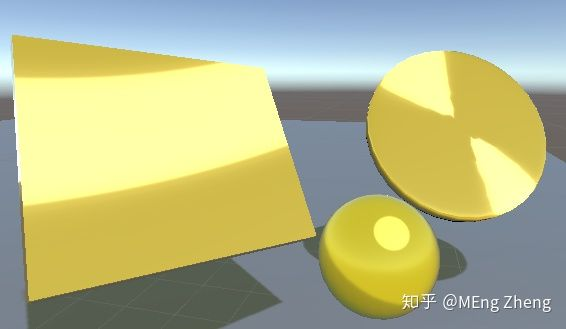

## 总结

本期实现了PBR的金属材质并将其卡通化。下一期我再把这个实现整理到之前Bronya的model上（如果能回到学校的话）。另外下一期我打算做一个屏幕空间RGB+Depth边缘检测后效实现轮廓线的效果，替换掉之前几何着色实现轮廓线的方案。