# Unity的PBR扩展——皮毛材质

最近被王者荣耀的一篇毛发制作文章刷屏：

[真香预警！新版“峡谷第一美”妲己尾巴毛发制作分享](https://link.zhihu.com/?target=https%3A//mp.weixin.qq.com/s/aIWMEO5Qa2gNn2yCmnHbOg)[mp.weixin.qq.com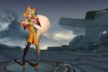](https://link.zhihu.com/?target=https%3A//mp.weixin.qq.com/s/aIWMEO5Qa2gNn2yCmnHbOg)

本文参照其介绍的方法先实现无光照的皮毛，然后再进行PBR扩展，最终实现题图的皮毛效果。

## **层渲染技术**

> 根据模型使用层 (layer) 来渲染毛发长度，
> 在 Unity Shader 中，
> 每一个 Pass 即表示一层。
> 当渲染每一层时，
> 使用法线将顶点位置挤出模型表面 。
> 然后将Noise贴图根据layer做衰减，
> 来当做alpha值。

实现原理本文就不再详述，这里列出一些实现细节。

\1. Shell层

向外突出的层通过在顶点着色器中对顶点位置沿法线做偏移达到，多层的效果需要用当前层作为偏移系数，使pass越靠后的层，向外偏移的越多：

```text
v.vertex.xyz += v.normal * _FurLength * FUR_OFFSET;
```

其中FurLength为总的一个scale变量，FUR_OFFSET为层相关的参数，接下来介绍。

2．Alpha值

层的渲染模式设置为透明渲染。为了符合毛发根部粗，尖部细的特点，所以层越往外，隐藏的部分（alpha值为0）应该越多：

```text
alpha = step(FUR_OFFSET, alpha);
```

其中FUR_OFFSET值为当前层/总层数，这样FUR_OFFSET值在0到1之间变化。假设渲染20层，那么由里向外的层FUR_OFFSET值依次为0、0.05、0.1 …… 0.9、0.95、1。alpha值读取自layer贴图，后面介绍。

这样实现的头发形状就是如下图左的三角形。下图右的抛物线形状，需要修改step的裁剪边界成非线性：

```text
alpha = step(FUR_OFFSET*FUR_OFFSET, alpha);
```

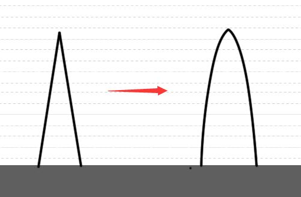毛发形状示意图

毛发还有一个特点，就是尖部会显得更透一些，可以设置层次与alpha值为递减关系：

```text
color.a = 1 - FUR_OFFSET;
```

3．密集毛发

通过一张额外的灰度图作为alpha值，得到圆滑的柱体效果，并通过调整其tiling，可以控制毛发的密集程度：

```text
fixed alpha = tex2D(_LayerTex, TRANSFORM_TEX(i.texcoord.xy, _LayerTex)).r;
```

采样得到的alpha值最后与层alpha值做乘法：

```text
color.a *= alpha;
```

layer图

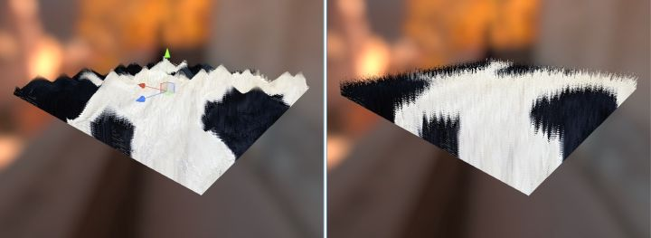tiling分别为1和5疏密效果对比图

4．外力影响

真实的毛发效果应该会受到外力影响，实现方法为对顶点偏移的方向做修改:

```text
half3 direction = _Gravity * _GravityStrength + v.normal * (1 - _GravityStrength);
v.vertex.xyz += direction * _FurLength;
```

其中的Gravity为方向为half3（0, -1, 0）的重力，得到的direction用于顶点偏移。

考虑到实际中外力对发根的影响相对小，对发尖的影响相对大，对direction做些修改：

```text
half3 direction = lerp(v.normal, direction, FUR_OFFSET);
```

其中以FUR_OFFSET作为参数的lerp运算使得毛发根部不受外力影响，尖部完全受重力影响。

下图为绘制20层，layer图tiling为20，受重力作用的无光照版本皮毛效果：

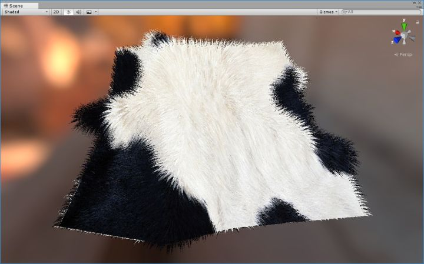无光照皮毛效果

## **PBR扩展**

现实中的布料织物大概可分为表面粗糙和光滑两类。表面粗糙的织物有棉布、亚麻布等，表面光滑的织物有丝绸、天鹅绒等。 棉布类织物表面主要为较淡的织物颜色组成的漫反射，丝绸类织物表面有类金属的反射，而且会有多种的高光颜色。  观察还发现棉布类织物纤维周围有一圈很细的绒毛，丝绸类织物的纤维绒毛很少。 

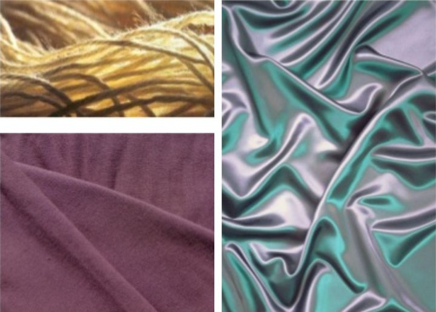现实织物的物理表现

这些物理特性中的主体表面部分适合用PBR的metalic和Rougthness来描述，绒毛和多种高光部分需增加一个Fabric Scatter模型（详细见下文）来描述。 下图为参考文献3的作者给出的描述不同布料织物的PBR**经验**参数： 

模拟织物的PBR参数

注意上图中的velvet（天鹅绒）的rougthness和metalic都为1，这符合天鹅绒表面粗糙，看起来很黑（漫反射很弱）的物理特性。

**Inverted Gaussian**

布料织物有其特有的光照反射模型。以天鹅绒为例，它的高光位置不是灯光和视线的正对区域，而是边缘位置。 

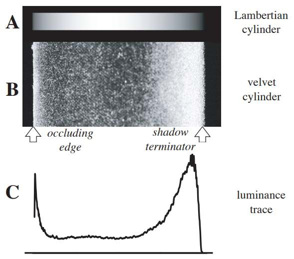理想高光反射与实际织物的反射对比

标准PBR的Microfacet GGX分布在0角度下（法线、灯光和视线同向）获得最大的高光强度，然后随着角度的增大做正太（Gaussian）分布， 而天鹅绒高光分布与GGX刚好相反，可见GGX的分布模型并不适合某些布料的模拟。

*The Order:1886* 游戏采用Inverted Gaussian模型做为布料的高光分布模型，参考文献3的作者在此基础上进一步简化得到： 

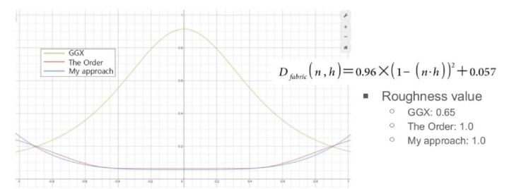GGX分布曲线与自定义分布曲线对比

shader代码：

```text
inline float FabricD (float NdotH, float roughness)
{
     return 0.96 * pow(1 - NdotH, 2) + 0.057;
}
```

用FabricD替换掉UnityStandardBRDF.cginc的BRDF1_Unity_PBS函数的GGXTerm。

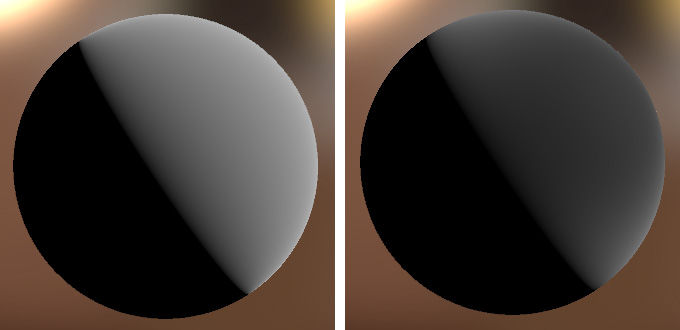Roughness为1时GGXTerm与FabricD结果对比

**Fabric Scatter**

布料织物的绒毛效果可由边缘光来模拟，再综合丝绸的高光颜色，参考文献3的作者给出一个Fabric Scatter**经验**模型：
 1.修改标准PBR的Fresnel term，用4倍pow值代替标准的5倍pow值，用于增大Fresnel的范围；
 2.再叠加一层跟视角相关的范围更大的，可调的Fresnel颜色用于更好的模拟织物表面的高光；
 3.去掉标准PBR的间接光反射，使得metallic-like的布料不那么metallic。

shader代码：

```text
inline half FabricScatterFresnelLerp(half nv, half scale)
{
     half t0 = Pow4 (1 - nv);
     half t1 = 0.4 * (1 - nv);
     return (t1 - t0) * scale + t0; 
}
```

BRDF1_Unity_PBS函数返回颜色：

```text
half3 color = diffColor * (gi.diffuse + light.color * diffuseTerm)  
            + specularTerm * light.color * FresnelTerm (specColor, lh)
            + _FabricScatterColor * (nl*0.5 + 0.5) * FabricScatterFresnelLerp(nv, _FabricScatterScale);
```

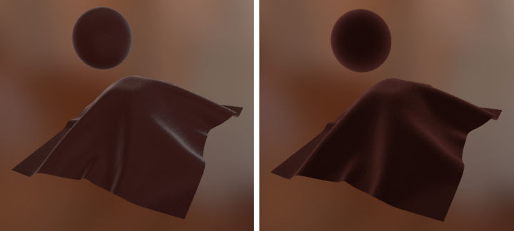标准PBR和自定义实现的天鹅绒效果对比

把天鹅绒的布料光照模型套用到无光照的皮毛上，得到最终效果：

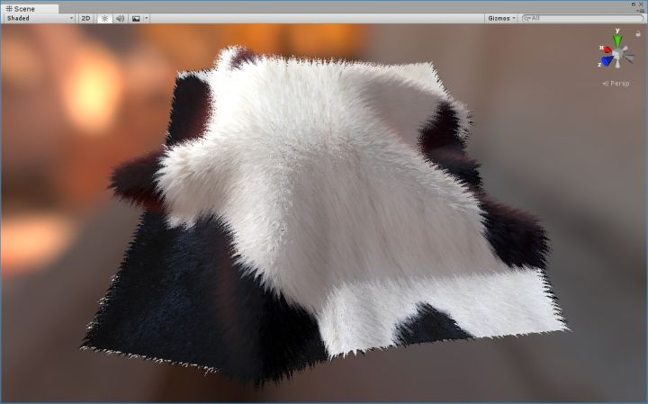基于PBR的皮毛效果

完整工程代码见（包含无光照版本）：

[https://github.com/chenyong2github/ExtendStandard](https://link.zhihu.com/?target=https%3A//github.com/chenyong2github/ExtendStandard)

[github.com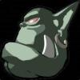](https://link.zhihu.com/?target=https%3A//github.com/chenyong2github/ExtendStandard)

Blessing from Thailand～～～

参考文献：

[Generating Fur in DirectX or OpenGL Easily](https://link.zhihu.com/?target=http%3A//www.xbdev.net/directx3dx/specialX/Fur/)

[gFur Help - Introduction - gim.studio](https://link.zhihu.com/?target=http%3A//gim.studio/gfur-help-introduction/)

[https://www.slideshare.net/jalnaga/custom-fabric-shader-for-unreal-engine-4](https://link.zhihu.com/?target=https%3A//www.slideshare.net/jalnaga/custom-fabric-shader-for-unreal-engine-4)

 [http://gennyx.blogspot.com/2009/11/its-material-world_11.html](https://link.zhihu.com/?target=http%3A//gennyx.blogspot.com/2009/11/its-material-world_11.html) 

 [http://citeseerx.ist.psu.edu/viewdoc/download?doi=10.1.1.105.1847&rep=rep1&type=pdf](https://link.zhihu.com/?target=http%3A//citeseerx.ist.psu.edu/viewdoc/download%3Fdoi%3D10.1.1.105.1847%26rep%3Drep1%26type%3Dpdf)  

 [http://blog.selfshadow.com/publications/s2013-shading-course/rad/s2013_pbs_rad_notes.pdf](https://link.zhihu.com/?target=http%3A//blog.selfshadow.com/publications/s2013-shading-course/rad/s2013_pbs_rad_notes.pdf) 