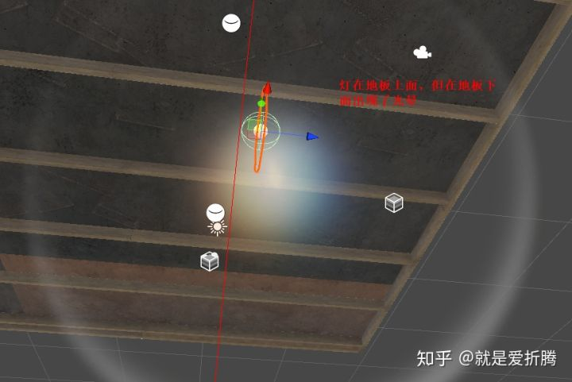
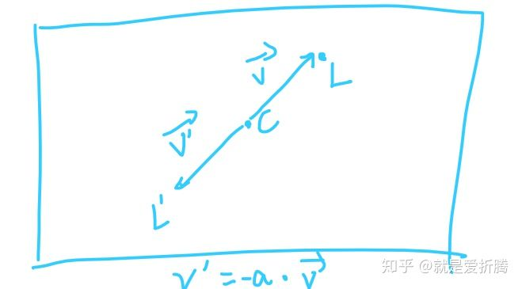
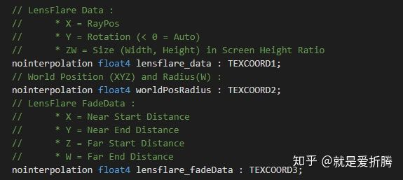
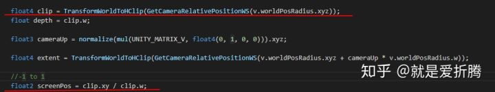
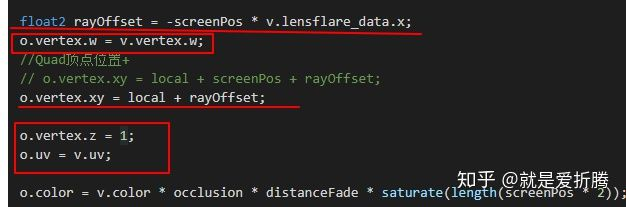
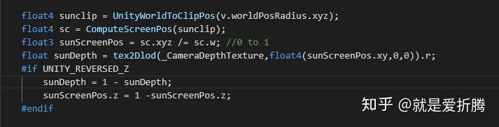
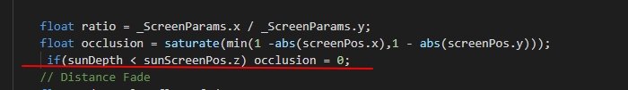

# 一种镜头光晕的原理及优化

本篇文章的原始资源来自这里：[https://connect.unity.com/p/hdrp-lensflare-fen-xiang?signup=true](https://link.zhihu.com/?target=https%3A//connect.unity.com/p/hdrp-lensflare-fen-xiang%3Fsignup%3Dtrue)

这是一个在HDRP中的使用的镜头光晕Shader资源（由于在HDRP中目前还不支持镜头光晕）。根据我个人的使用情况来看，其它方面都不错，主要的问题在于光晕没有遮挡效果。

记得内置管线中，光晕效果遮挡是通过碰撞体来实现的。（想到必定用到了射线检测）

当光源在不透明物体背面时，还是存在光晕效果，出现了明显错误。（当然可能是我设置的错误，忘指正）



所以今天从分析的角度，来讲讲它的镜头光晕的实现原理，并试着修复一些它存在的问题。

- **原资源的使用方法参考文章开头链接**。

它的主要实现原理是**通过在屏幕上绘制多个矩形网格（HDRPLensFlare.cs中），在Shader中，计算灯光位置的屏幕坐标，然后每个矩形网格根据灯光屏幕的位置与屏幕中心的位置偏移进行反向移动。**如下图：

v向量是灯光位置L与屏幕中心位置C的偏移值。L&amp;#39;是某个光晕的位置。图中a是偏移的参数，通过面板来调节



图1

图2

图2就执行了上面的操作。注意图2方框里的代码，**这里是直接将物体的局部坐标赋值到了投影空间，从而实现了直接在屏幕上绘制的矩形网格的目的**。

接下来就是对它进行改进了，**这次我选择将Shader移植回传统管线**。毕竟我对HDRP还不太熟悉，当然后续移植到URP还是很简单的。

- 为了解决最开始提出的那个问题，我想到了一种办法：**通过传入灯光物体的位置，计算出灯光物体的深度值。然后采样_CameraDepthTexture,得到当前的深度值。我们只需要判断两个的深度大小就可以判断灯光是否被遮挡（绘制的光晕属于透明队列，并写入深度，所以深度图中不包含光晕的深度信息）。下面是新增的代码：**



sunDepth:灯光实际深度；sunScreenPos.z:灯光屏幕坐标位置对应的深度。

如图：


可以看出较好的解决了之前的问题。

此外个人感觉原代码还有一些冗余的代码（当然是可能原作者处于自己的考虑吧，不过我感觉去掉之后也没有明显的区别），于是也进行了一些优化，减少了相当的计算量。具体变化可参考开头提供的原始资源链接。

下面贴出Shader部分源代码：

```csharp
Shader "CameraEff/LensFlare"
{
    Properties
    {
        _MainTex ("Texture", 2D) = "white" {}
        _OccludedSizeScale("Occluded Size scale", Float) = 1.0
    }

    CGINCLUDE

    #include "UnityCG.cginc"

    struct appdata
    {
        float4 vertex : POSITION;
        float2 uv : TEXCOORD0;
        float4 color : COLOR;

        // LensFlare Data : 
        //		* X = RayPos 
        //		* Y = Rotation (< 0 = Auto)
        //		* ZW = Size (Width, Height) in Screen Height Ratio
        nointerpolation float4 lensflare_data : TEXCOORD1;
        // World Position (XYZ) and Radius(W) : 
        nointerpolation float4 worldPosRadius : TEXCOORD2;
        // LensFlare FadeData : 
        //		* X = Near Start Distance
        //		* Y = Near End Distance
        //		* Z = Far Start Distance
        //		* W = Far End Distance
        nointerpolation float4 lensflare_fadeData : TEXCOORD3;
    };

    struct v2f
    {
        float2 uv : TEXCOORD0;
        float4 vertex : SV_POSITION;
        float4 color : COLOR;
    };

    sampler2D _MainTex;
    float _OccludedSizeScale;
    uniform float4 _SunPos;
    sampler2D _CameraDepthTexture;

    v2f vert(appdata v)
    {
        v2f o;

        float4 sunclip = UnityWorldToClipPos(v.worldPosRadius.xyz);
        float4 sc = ComputeScreenPos(sunclip);
        float3 sunScreenPos = sc.xyz /= sc.w; //0 to 1
        float sunDepth = tex2Dlod(_CameraDepthTexture,float4(sunScreenPos.xy,0,0)).r;
        #if UNITY_REVERSED_Z
            sunDepth = 1 - sunDepth;
            sunScreenPos.z = 1 -sunScreenPos.z;
        #endif
        
        float depth = sunclip.w;
        float2 screenPos = sunclip.xy / sunclip.w;  //-1 to 1

        float ratio = _ScreenParams.x / _ScreenParams.y;
        float occlusion = saturate(min(1 -abs(screenPos.x),1 - abs(screenPos.y)));
        if(sunDepth < sunScreenPos.z) occlusion = 0;
        // Distance Fade
        float4 d = v.lensflare_fadeData;
        float distanceFade = saturate((depth - d.x) / (d.y - d.x));
        distanceFade *= 1.0f - saturate((depth - d.z) / (d.w - d.z));

        // position and rotate
        float angle = v.lensflare_data.y;
        if (angle < 0) // Automatic
        {
            float2 dir = normalize(screenPos);
            angle = atan2(dir.y, dir.x) + 1.57079632675; // arbitrary, we need V to face the source, not U;
        }

        // apply size
        float2 quad_size = lerp(_OccludedSizeScale, 1.0f, occlusion) * v.lensflare_data.zw;
        if (distanceFade * occlusion == 0.0f) // if either one or other is zeroed
        quad_size = float2(0, 0); // clip

        float2 local = v.vertex.xy * quad_size;

        local = float2(
        local.x * cos(angle) + local.y * (-sin(angle)),
        local.x * sin(angle) + local.y * cos(angle));

        // adjust to correct ratio
        local.x /= ratio;

        float2 rayOffset = -screenPos * v.lensflare_data.x;
        o.vertex.w = v.vertex.w;
        o.vertex.xy = local + rayOffset;

        o.vertex.z = 1;
        o.uv = v.uv;

        o.color = v.color * occlusion * distanceFade * saturate(length(screenPos * 2));
        return o;
    }

    ENDCG

    SubShader
    {
        Pass
        {
            Name "ForwardUnlit"
            Tags{"Queue" = "Transparent" }

            Blend One OneMinusSrcAlpha
            ColorMask RGB
            ZWrite Off
            Cull Off
            ZTest Always

            CGPROGRAM

            #pragma target 3.0
            #pragma vertex vert
            #pragma fragment frag	

            float4 frag (v2f i) : SV_Target
            {
                float4 col = tex2D(_MainTex, i.uv);
                return col * i.color;
            }

            ENDCG
        }
    }
}
```

工程文件地址：

[https://gitee.com/jiuyueqiji123/NextGENProject/tree/master/NextGENProject/Assets/Samples/%E9%95%9C%E5%A4%B4%E5%85%89%E6%99%95%E5%8E%9F%E7%90%86%E4%B8%8E%E4%BC%98%E5%8C%96](https://link.zhihu.com/?target=https%3A//gitee.com/jiuyueqiji123/NextGENProject/tree/master/NextGENProject/Assets/Samples/%E9%95%9C%E5%A4%B4%E5%85%89%E6%99%95%E5%8E%9F%E7%90%86%E4%B8%8E%E4%BC%98%E5%8C%96)[gitee.com](https://link.zhihu.com/?target=https%3A//gitee.com/jiuyueqiji123/NextGENProject/tree/master/NextGENProject/Assets/Samples/%E9%95%9C%E5%A4%B4%E5%85%89%E6%99%95%E5%8E%9F%E7%90%86%E4%B8%8E%E4%BC%98%E5%8C%96)

**后面会把URP的版本也更新上去。**