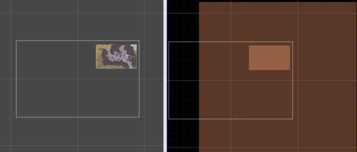
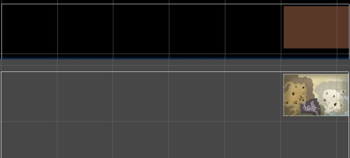
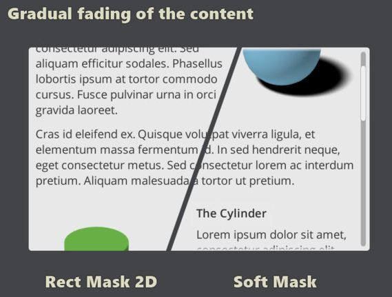
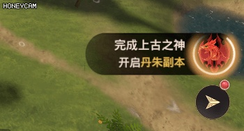
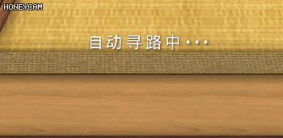
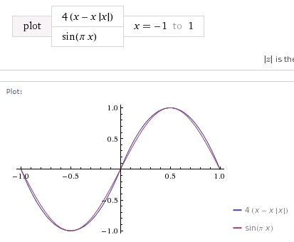
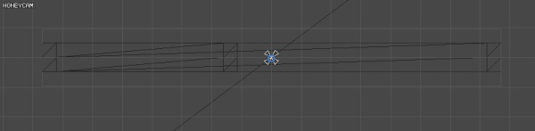
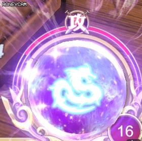

# Unity手游开发札记——使用Shader进行UGUI的优化


@author: 黑袍小道


## **1. 前言**

近期断断续续地做了一些优化的工作，包括资源加载、ui优化、效果分级各个方面。优化本身是一件琐碎且耗神的事情，需要经历**问题定位**、**原因探查**、**优化方案设计和实现**、**效果验证**、**资源修改**多个步骤，也会涉及到各个职位之间的配合和协调。在这其中，可能带来较大工作量的是对于之前普遍使用的一些方法/控件的优化，如果无法兼容之前的使用接口，可能会给美术和程序带来较大的迭代工作量。

UI是这其中可能越早发现问题收益越高的一块内容，所以整理一下这段时间做了一些基于Shader来进行优化的思路和方法，以及分享一下自己构建的代替ugui提供的通用控件的那些Component，希望在项目中前期的同学可以提前发现类似的问题进行尽早的改进。

## **2. 优化目标**

ugui已经提供了非常丰富的控件来给我们使用，但是出于通用性的考虑，其中很多控件的性能和效果都可能存在一些问题，又或者在频繁更改ui数值的需求下会引发持续的Mesh重建导致CPU的消耗。我们期望通过一些简单的Shader逻辑来提升效果或者提高效率，主要会集中在如下几个方面：

- 降低Draw Call；
- 减少Overdraw；
- 减少UI Mesh重建次数和范围。

接下来的内容，我们就从具体的优化内容上来分享下使用简单的Shader进行UGUI优化的过程。

## **3. 小地图**

在我们游戏中，玩家移动的时候右上角会一直有小地图的显示，这个功能在最初的实现方案中是使用ugui的mask组件来做的，给了一个方形的mask组件，然后根据玩家位置计算出地图左下角的位置进行移动。这种实现方式虽然简单，但是会有两个问题：

1. **Overdraw特别大**，几乎很多时候会有整个屏幕的overdraw；
2. 玩家在移动过程中，因为一直在持续移动图片的位置（做了适当的降频处理），所以会一直有UI的**Mesh重建过程**。

当时的prefab已经被修改了，我简单模拟一下使用Mask的方法带来的Overdraw的效果如下图所示：

使用Mask组件带来的Overdraw的问题

在上图中可以看到，左侧是小地图在屏幕中的效果，右侧是选择Overdraw视图之后的效果，整张图片都会有一个绘制的过程，占据几乎整个屏幕（白框），而且Mask也是需要一次绘制过程，这样就是两个Drawcall。其实这里ui同学为了表现品质感，在小地图上又蒙了一层半透的外框效果，消耗更大一些。

针对这一问题，首先对于矩形的地图，可以使用运行效率更高一些的RectMask2D组件，但这并不能有本质的提升，解决Overdraw最根本的方法还是不要绘制那么大的贴图然后通过蒙版或者clip的方式去掉，这是很浪费的方法。有过基本Shader概念的朋友应该可以想到修改uv的方法，这也是我们采用的方法——思路很简单，就做一个和要显示的大小一样的RawImage控件，然后赋给它一个特殊的材质，在vs里面修改要显示的区域的uv就可以做到想要的效果。

直接贴出来Shader代码如下：

```cpp
sampler2D _MainTex;
fixed4 _UVScaleOffset;
sampler2D _BlendTexture;
     
v2f vert(appdata_t IN)     
{     
    v2f OUT;     
    OUT.vertex = mul(UNITY_MATRIX_MVP, IN.vertex);     
    OUT.texcoord = IN.texcoord;
    //计算uv偏移
    OUT.offsetcoord.xy = OUT.texcoord.xy * _UVScaleOffset.zw + _UVScaleOffset.xy;
#ifdef UNITY_HALF_TEXEL_OFFSET     
    OUT.vertex.xy -= (_ScreenParams.zw-1.0);     
#endif     
    return OUT;  
}  
     
fixed4 frag(v2f IN) : SV_Target     
{     
    half4 color = tex2D(_MainTex, IN.offsetcoord);
    half4 blendColor = tex2D(_BlendTexture, IN.texcoord);
    color.rgb = blendColor.rgb + color.rgb * (1 - blendColor.a);
    return color;
}
```

核心的代码就只有加粗的那一句，给uv一个整体的缩放之后再加上左下角的偏移。之后C#逻辑就只需要根据地图的大小和玩家所在的位置计算出想要显示的uv缩放和偏移值就可以了。玩家移动的时候只需要修改材质的参数，这也不会导致UI的mesh重建，一箭双雕，解决两个问题。

小地图的外框也在材质中一并做了，减少一个draw call。最终的效果如下图所示：

优化后的Overdraw对比图

> 这里需要注意的是，对于image控件的material进行赋值时，如果它在一个Mask控件之下，可能会遇到赋值失效的问题，采用materialForRendering或者强制更新材质的方式可能会有新的Material的创建过程导致内存分配，这些在优化之后可能带来问题的点也是需要优化后进行验证的。

## **4. Mask的使用**

除了小地图部分，游戏中比如头像、技能界面等处都大量地使用了Mask。当然通常情况下Mask不会带来像小地图那么高Overdraw，但是因为ugui中的Mask需要一遍绘制过程，因此对于Drawcall的增加还是会有不少。而且Mask也存在边缘锯齿的问题，效果上UI同学也不够满意，因此我们针对像头像这样单张的Mask也进行了一下优化，具体的过程可以参考之前的Unity填坑笔记——《[Unity填坑笔记（三）—ugui中针对单独图片的Mask优化](https://zhuanlan.zhihu.com/p/32561155)》，比较详细地记录了整个优化过程。

这里补充两点：

- 在那篇文章的最后提到，我们自己拷贝了一个ThorImage类，开放部分接口然后继承。我们后来改成了从Image直接继承的方式，否则之前编写的游戏逻辑要在代码上兼容两种Image，会比较烦，这些**向前兼容的需求**也是在优化过程中需要额外考虑和处理的点。
- 针对滚动列表这样需要Mask的地方，一方面建议UI同学使用Rect Mask 2D组件，另外一方面为了边缘的渐变效果为UI引入了[Soft Mask](https://link.zhihu.com/?target=https%3A//assetstore.unity.com/packages/tools/gui/soft-mask-80667) 插件来提供边缘的渐变处理。放一张Soft Mask自己的效果对比截图，需要类似效果的朋友可以自己购买。

Soft Mask 插件效果对比

> UWA针对我们项目的深度优化报告里提到：Soft Mask插件的Component在Disable逻辑里有明显的性能消耗，目前我们未开始针对这块进行优化，不过只在ui关闭的时候才有，所以优先级也比较低，想尝试的朋友可以提前评估下性能。

## **5. 基于DoTween的动画效果优化**

在游戏中，UI比较大量地使用了DoTween插件制作动画效果来强调一些需要醒目提醒玩家的信息。DoTween是一个非常好用的插件，无论是对于程序还是对于UI来说，都可以经过简单的操作来实现较为好的动画效果。

然而，对于UGUI来说，DoTween往往意味着持续的Canvas的重建，因为动画通常是位置、旋转和缩放的变化，这些都会导致其所在的Canvas在动画过程中一直有重建操作，比如我们游戏中会有的如下图所示的旋转提醒的效果：




不断旋转的提示信息

这一效果在DoTween中通过不断改变图片的旋转来实现的，在我们profile过程中发现了可疑的持续canvas重建，最后通常会定位到类似这样界面动画的地方。使用Shader进行优化，只需要把旋转的过程拿到Shader的vs阶段来做，同样是修改uv信息，材质代码的vert函数如下：

```c
v2f vert(appdata_t IN)
{     
    v2f OUT;     
    OUT.vertex = mul(UNITY_MATRIX_MVP, IN.vertex);
    OUT.texcoord = IN.texcoord;

    OUT.texcoord.xy -= 0.5;
    //避免时间过长的时候影响精度
    half t = fmod(_Time.y, 2 * UNITY_PI);
    t *= _RotationSpeed;
    half s, c;
    sincos(t, s, c);
    half2x2 rotationMatrix = half2x2(c, -s, s, c);
    OUT.texcoord.xy = mul(OUT.texcoord.xy, rotationMatrix);
    OUT.texcoord.xy += 0.5;

#ifdef UNITY_HALF_TEXEL_OFFSET     
    OUT.vertex.xy -= (_ScreenParams.zw-1.0);     
#endif
    OUT.color = IN.color;     
    return OUT;  
}  
```

注意，这里因为要求UI控件使用的是一张RawImage，因此uv的中心点就认为了是**（0.5， 0.5）**位置。通过参数可以做到从C#中传递uv的偏移和缩放信息从而兼容Image，但是因为材质不同导致本来就无法合批，所以使用Image和Atlas带来的优势就没有了，所以这里只简单地支持RawImage。

> Tips：注意所使用贴图的边缘处理，因为uv的旋转可能会导致超过之前0和1的范围。首先贴图的采样方式要使用**Clamp**的方式，其次贴图的边缘要留出几个像素的透明区域，保证即使在设备上贴图压缩之后依然可以让边缘的效果正确。

另外使用材质进行优化的地方是自动寻路的提示效果：




常见的动态字体提示动画

最初UI想使用DoTween来制作，但是觉得工作量有点大所以想找程序写DoTween的代码进行开发，为了减少ui的Canvas重建，使用材质来控制每一个字的缩放过程。同样是在vert函数中针对uv进行修改即可：

```c
v2f vert(appdata_t IN)
{
	v2f OUT;
	UNITY_SETUP_INSTANCE_ID(IN);
	UNITY_INITIALIZE_VERTEX_OUTPUT_STEREO(OUT);

	//根据时间和配置参数对顶点进行缩放操作
	OUT.worldPosition = IN.vertex;
	half t = fmod((_Time.y - _TimeOffset) * _TimeScale, 1);
	t = 4 * (t - t * t);
	OUT.worldPosition.xy -= _VertexParmas.xy;
	OUT.worldPosition.xy *= (1 + t*_ScaleRatio);
	OUT.worldPosition.xy += _VertexParmas.xy;
	OUT.vertex = UnityObjectToClipPos(OUT.worldPosition);

	OUT.texcoord = IN.texcoord;

	OUT.color = IN.color * _Color;
	return OUT;
}
```

> Tips：这里使用UWA群里一位朋友之前提供的三角函数近似的方法来略微减少一下指令消耗：

sin函数的近似模拟

这一效果的实现不像之前的旋转效果那么简单，只有Shader的修改就可以了。这里需要额外处理的部分有如下几点：

\1. 逐个缩放的效果需要控制“自动寻路中...”这句话中的每一个字，因此在这个效果中**每一个字都是一个Text控件**。正在缩放的字使用特殊的缩放材质来绘制，其他的字依然使用默认的UI材质绘制，这意味着需要**2个DrawCall**来实现整体效果。

\2. vert函数中需要获取字体的中心点和长宽大小，然后进行缩放计算，也就是参数_VertexParmas的内容。经过测试，在ugui中，**顶点的位置信息worldPosition是其相对于Canvas的位置信息**，因此这里需要在C#中进行计算，计算过程借助RectTransformUtility的ScreenPointToLocalPointInRectangle函数：

```csharp
Vector2 tempPos;
RectTransformUtility.ScreenPointToLocalPointInRectangle(ParentCanvas.transform as RectTransform, 
                    ParentCanvas.worldCamera.WorldToScreenPoint(img.transform.position), 
                    ParentCanvas.worldCamera, out tempPos);
```

这里的ParentCanvas是当前控件向上遍历找到的第一个Canvas对象。

> Tips：这里，搞清楚了vs中顶点的worldPosition对应的属性之后，可以做很多有趣的事情，包括之前的旋转效果也可以不再旋转uv而是对顶点位置进行旋转。

\3. 关于_Time，它的y值与C#中对应的是Time.timeSinceLevelLoad。这里为了实现界面一开始的时候第一个字是从0开始放大的，需要从C#传递给Shader一个起始时间，通过`_Time.y - _TimeOffset` 来确保起始效果。

最后直接贴一下C#部分的代码好了，也很简单，提供给UI配置缩放尺寸、缩放持续时间和间隔等参数，然后通过协程来控制字体的材质参数：

```csharp
using System;
using System.Collections.Generic;
using UnityEngine;
using UnityEngine.EventSystems;
using UnityEngine.UI;
using DG.Tweening;
using ThorUtils;
using System.Collections;

namespace KEngine.UI
{
    public class UIAutoExpand : MonoBehaviour
    {
        public float ScaleDuration = 1;
        public float CycleInterval = 5;
        public float ScaleRatio = 0.5f;
        private Canvas ParentCanvas;

        private Image[] images;
        private Vector4[] meshSizes;
        private int currentScaleIdx = -1;

        private Coroutine playingCoroutine;
        
        private static Material UIExpandMat = null;
        private static int VertexParamsID = -1;
        private static int TimeOffsetID = -1;
        private static int TimeScaleID = -1;
        private static int ScaleRatioID = -1;

        void Awake()
        {
            //初始化静态变量
            if (UIExpandMat == null)
            {
                UIExpandMat = new Material(Shader.Find("ThorShader/UI/UIExpand"));
                VertexParamsID = Shader.PropertyToID("_VertexParmas");
                TimeOffsetID = Shader.PropertyToID("_TimeOffset");
                TimeScaleID = Shader.PropertyToID("_TimeScale");
                ScaleRatioID = Shader.PropertyToID("_ScaleRatio");
            }

            UIExpandMat.SetFloat(TimeScaleID, 1 / ScaleDuration);
            UIExpandMat.SetFloat(ScaleRatioID, ScaleRatio);

            if (ParentCanvas == null)
            {
                Transform trans = transform;
                while(trans != null)
                {
                    ParentCanvas = trans.GetComponent<Canvas>();
                    if (ParentCanvas != null)
                    {
                        break;
                    }
                    trans = trans.parent;
                }
            }
            if (ParentCanvas == null || ParentCanvas.worldCamera == null)
            {
                Debug.LogError("The parent canvas of UIAutoExpand could not be empty!");
                return;
            }
            images = GetComponentsInChildren<Image>();
            if (images.Length > 0)
            {
                meshSizes = new Vector4[images.Length];
            }
            Vector2 tempPos;
            for (int i = 0; i < images.Length; ++i)
            {
                Image img = images[i];
                tempPos.x = 0;
                tempPos.y = 0;
                RectTransformUtility.ScreenPointToLocalPointInRectangle(ParentCanvas.transform as RectTransform, 
                    ParentCanvas.worldCamera.WorldToScreenPoint(img.transform.position), 
                    ParentCanvas.worldCamera, out tempPos);
                meshSizes[i].x = tempPos.x;
                meshSizes[i].y = tempPos.y;
                meshSizes[i].z = 0;
                meshSizes[i].w = 0;
            }
        }

        private void OnEnable()
        {
            playingCoroutine = StartCoroutine(PlayExpandAni());
        }

        private void OnDisable()
        {
            if (playingCoroutine != null)
            {
                StopCoroutine(playingCoroutine);
            }
        }

        private void OnDestroy()
        {
            StartScaleImage(-1);
            if (playingCoroutine != null)
            {
                StopCoroutine(playingCoroutine);
            }
        }

        private void StartScaleImage(int idx)
        {
            if (images == null)
            {
                return;
            }
            if (currentScaleIdx > -1 && currentScaleIdx < images.Length)
            {
                Image preImg = images[currentScaleIdx];
                preImg.material = null;
            }
            if (idx < 0 || idx >= images.Length)
            {
                return;
            }
            currentScaleIdx = idx;
            Image curImg = images[idx];
            UIExpandMat.SetVector(VertexParamsID, meshSizes[idx]);
            curImg.material = UIExpandMat;
        }

        private IEnumerator PlayExpandAni()
        {
            while (true)
            {
                for (int i = 0; i < images.Length; ++i)
                {
                    UIExpandMat.SetFloat(TimeOffsetID, Time.timeSinceLevelLoad);
                    StartScaleImage(i);
                    yield return Yielders.GetWaitForSeconds(ScaleDuration);
                }
                StartScaleImage(-1);
                yield return Yielders.GetWaitForSeconds(CycleInterval);
            }
        }
    }
}
```

> Tips：这里使用了 `Shader.PropertyToID` 方法来**减少给material赋值过程中的消耗**，对于携程使用了一个**Yielders类减少频繁的内存分配**。

总之，基于Shader来对持续的DoTween动画进行优化，可以大大减少Canvas重建的几率。而Shader中基于顶点和_Time属性进行动画计算的消耗非常少，比如通常的Image只有四个顶点而已，再配合部分C#代码提供给材质必须的参数，就可以实现更加复杂的ui动画。尤其对于会长时间存在的动画效果，如果可以善用Shader可以做到兼顾**效果和效率。**

## **6. 进度条**

在进行战斗中的Profile的时候也是发现了每帧都有一个Canvas重建的过程，排查后发现是用于显示倒计时效果的进度条在持续地被更新导致的。

UGUI的进度条控件功能非常通用，但是层次很复杂，包括Background、Fill Area和Handle Slide Area三个部分。它是实现原理是基于Mesh的修改：




Slider控件的更新过程

从上面的gif可以看出，当Slider的value更改的时候，mesh会跟着调整。这可以做到一些UI想要的效果，比如让Fill中的图是一张九宫格的形式，就可以做出比较好看的进度条效果，保证拉伸之后的效果是正确的。

当你需要一条可能持续变化的进度条一直在显示的时候，比如倒计时进度，持续的Canvas重建就不可避免。

针对具体的需求，通过Shader来进行一个简单的ProgressBar也非常容易，通过对于alpha的控制就可以做到截取的效果：

```cpp
fixed4 frag(v2f IN) : SV_Target
{
	half4 color = (tex2D(_MainTex, IN.texcoord) + _TextureSampleAdd) * IN.color;

#if _ISVERTICAL_ON
	float uvValue = IN.texcoord.y - _UVRect.y;
	float totalValue = _UVRect.w;
#else
	float uvValue = IN.texcoord.x - _UVRect.x;
	float totalValue = _UVRect.z;
#endif

#if _ISREVERSE_ON
	uvValue = totalValue - uvValue;
#endif
				
	color.a *= uvValue / totalValue < _Progress;

	color.a *= UnityGet2DClipping(IN.worldPosition.xy, _ClipRect);
	#ifdef UNITY_UI_ALPHACLIP
	clip (color.a - 0.001);
	#endif

	return color;
}
```

这次是在ps阶段进行处理，当然也可以在vs中模拟顶点的缩放效果或者处理uv的偏移。为了支持垂直和反向，这里通过两个宏来进行控制。在实现了条状的进度条，然后准备根据UI的具体需求进行效果上优化的时候，UI同学表示设计方案修改了变成了圆形的进度条（=_=），而且是两个方向同时展示进度，最终效果如下图所示的效果：




红色部分的倒计时进度条效果

不要被酷炫的特效晃瞎眼。。。重点是红色的倒计时进度条部分。在ps中进行位置的计算，然后通过alpha的值同样可以达到控制进度的效果：

```cpp
fixed4 frag(v2f IN) : SV_Target
{
	half4 color = (tex2D(_MainTex, IN.texcoord) + _TextureSampleAdd) * IN.color;
	float theta = atan2((IN.texcoord.y - _UVRect.y)/_UVRect.w - 0.5, 
                            (IN.texcoord.x + 1E-18 - _UVRect.x)/_UVRect.z-0.5);

#ifdef IS_SYMMETRY
	color.a *= ((1 - _Progress) * UNITY_PI < abs(theta));
#else
	color.a *= ((1 - _Progress) * UNITY_PI * 2 < theta + UNITY_PI);
#endif

	color.a *= UnityGet2DClipping(IN.worldPosition.xy, _ClipRect);
#ifdef UNITY_UI_ALPHACLIP
	clip(color.a - 0.001);
#endif

	return color;
}
```

这里用了一个消耗比较大的atan2指令来进行弧度值的计算，支持对称和非对称的两种方式，对称的方式用于上面的特殊进度条，非对称的方式用于下面这种环形的进度条。


环形进度条的效果

UGUI针对Image提供了Filled的Image Type来做环形进度条的效果，其原理是根据角度来更改Mesh实现的。

为了兼容Image中使用的Atlas，这里需要将uv信息设置给材质：

```csharp
/// <summary>
/// 更新贴图的uv值到材质中
/// 注意：需要在Image更新的时候调用本逻辑
/// </summary>
public void UpdateImageUV()
{
    if (relativeImage != null)
    {
        Vector4 uv = (relativeImage.overrideSprite != null) ? 
            DataUtility.GetOuterUV(relativeImage.overrideSprite) : defaultUV;
        uv.z = uv.z - uv.x;
        uv.w = uv.w - uv.y;
        relativeImage.material.SetVector(UVRectId, uv);
    }
}
```

对于进度条的修改，尤其是环形进度条，是在Shader的ps阶段做的，因此消耗可能还比较大，和Mesh重建的过程的消耗我没有做具体的对比，相当于拿GPU换取CPU的消耗，有可能在某些设备上还不够划算。这个具体使用哪种方法更好，或者是否需要继续优化就看读者自己具体的项目需求了。

## **7. 总结**

针对UGUI的优化零零散散也做了不少，上面讨论到的是其中影响相对大的部分，另外一大块内容是**在UGUI中使用特效**，这块和本次博客的主题关系不大就不放一起聊了。

可以看到，虽然从结果上看，这些优化后使用的Shader技术都非常非常简单，大都是一些uv计算或者顶点位置的计算，相对于需要进行光照阴影等计算的3D  Shader，UI中使用的Shader简直连入门都算不上，但是通过合理地使用它，配合部分C#代码逻辑，可以实现**兼顾效果和效率**的UI控件功能。

另外，虽然从结果看很简单，仿佛每一个Shader都只需要1-2个小时就可以完成，但是在排查问题和思考优化方法的过程中其实也花费了很多精力，有很多的纠结和思考。这些方案的对比和思考的过程由于时间关系没有全部反映在这篇博客里，但你从Tips和一些只言片语中也可以窥见到一些当时的心路历程……除此之外，由于项目已经到了中后期，还有不少时间花费在新控件的**易用性和向前兼容**的方面，以让UI和程序同学可以用尽量少的时间来完成对于之前资源的优化工作。

最后，我想坦诚地说，对于UGUI和基于Shader的方案，我没有进行定量的性能对比测试，所以也不能保证基于Shader的方法都一定效率更高，比如最后圆形的Mask就可能会是一个反例。我能做到的是尽量公正地从原理角度分析两者之间在Overdraw、Drawcall和Canvas重建方面的性能差异，也可能有考虑不全的地方，欢迎大家一起讨论~

> 最后的Tips：除了一些“傻X”bug引发的“神级”优化之外，大部分的优化都是琐碎而且成效不会那么直接、显著的工作。比如上面这些内容可能花费了我大约2个周左右的时间，还需要推进UI和程序对于已有的资源进行修改，而且面临着需求变更的问题……然而，面对优化工作还是那句话——**“勿以恶小而为之，勿以善小而不为。”**
> 另外，让团队中的每一个人都了解更多更深入的技术原理，拥有对于性能消耗的警觉，才不至于让问题在最后Profile的时刻集中爆发出来，而是被消化在日常开发的点点滴滴之中，这也是我对于理想团队的期(huan)待(xiang)。


2018年1月31日  于杭州滨江海创基地（拖延症总是最后一天才写这个月的技术博客……）