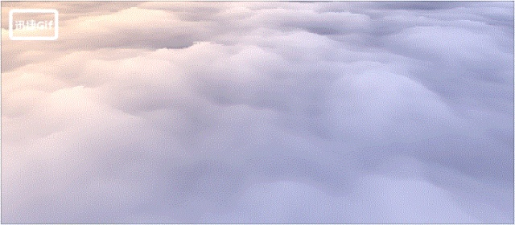
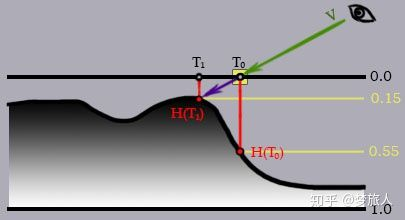
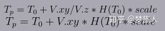
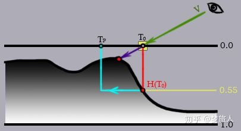
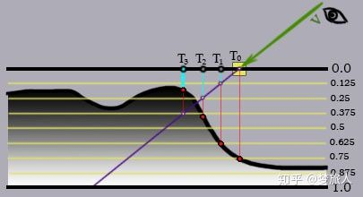
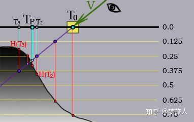
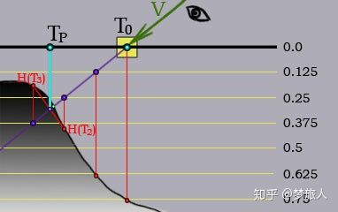

# Unity Shader基于视差映射的云海效果

[毛星云](https://www.zhihu.com/people/mao-xing-yun)、[miccall](https://www.zhihu.com/people/miccall)、[杨超wantnon](https://www.zhihu.com/people/wantnon)、[马甲](https://www.zhihu.com/people/ma-jia-6-99)、[Lele Feng](https://www.zhihu.com/people/lele-feng-15) 等 





还是先上一个动态图

​      这个方法是一个同事教给我的，个人觉得效果很好，在这里借花献佛，拿出来与大家分享。

这种方法是基于一种叫视差映射的方法POM(Parallax Occlusion Mapping)，网上有详细讲解这种方法在图形学里的应用。

地址：[https://segmentfault.com/a/1190000003920502](https://link.zhihu.com/?target=https%3A//segmentfault.com/a/1190000003920502)

原文很长，我这里只简单介绍一下，有兴趣的同学可以深入研究下。

在计算机图形学中视差映射是法线映射的一个增强版本，它不止改变了光照的作用方式，还在平坦的多边形上创建了3D细节的假象，不会生成任何额外的图元。

要实现视差映射你需要一张高度贴图。高度图中的每个像素包含了表面高度的信息。纹理中的高度会被转化成对应的点沉入表面多少的信息。这种情况你得把高度图中读出来的值反过来用。

一般情况，视差映射会把高度图中的值当深度来用，黑色(0)代表和表面齐平的高度，白色(1)代表最深的凹陷值。

设当前点（译者：原文中用的是Fragment，片元。）是图片中用黄色方块高亮出来的那个点，这个点的纹理坐标是T0。

向量V是从摄像机到点的方向向量。用坐标T0在高度图上采样，你能得到这个点的高度值H(T0)=0.55。这个值不是0，所以点并不是在表面上，而是凹陷下去的。

所以你得把向量V继续延长直到与高度图定义出来的表面最近的一个交点。这个交点我们说它的深度就是H(T1)，它的纹理坐标就是T1。所以我们就应该用T1的纹理坐标去对颜色和法线贴图进行采样。

所以说，所有视差映射技术的主要目的，就是要精确的计算摄像机的向量V和高度图定义出来的表面的交点。



##  视差映射和带偏移上限的视差映射

视差映射的计算是在切空间进行的（跟法线映射一样）。所以指向光源的向量(L)和指向摄像机的向量(V)应该先被变换到切空间。

顶点着色器把光照向量和摄像机向量变换到切空间。片元着色器调用视差映射的相关函数，然后计算自阴影系数，并计算最终光照后的颜色值。


视差映射中最简单的版本只取一步近似来计算新的纹理坐标，这项技术被简单的称为视差映射。

视差映射只有在高度图相对比较平滑，并且不存在复杂的细节时，才能得到相对可以接受的效果。如果摄像机向量和法线向量的夹角过大的话，视差映射的效果会是错误的。视差映射近似计算的核心思想是：

（1）从高度图读取纹理坐标T0位置的高度H(T0)

（2）根据H(T0)和摄像机向量V，在初始的纹理坐标基础上进行偏移。

偏移纹理坐标的方法如下。因为摄像机向量是在切空间下，而切空间是沿着纹理坐标方向建立的，所以向量V的X和Y分量就可以直接不加换算的用作纹理坐标的偏移量。

向量V的Z分量是法向分量，垂直于表面。你可以用Z除X和Y。这就是视差映射技术中对纹理坐标的原始计算。你也可以保留X和Y的值，这样的实现叫带偏移上限的视差映射。

带偏移上限的视差映射可以避免在摄像机向量V和法向量N夹角太大时的一些诡异的结果。然后你把V的X和Y分量加到原始纹理坐标上，就得到了沿着V方向的新的纹理坐标。

下面是偏移后的纹理坐标Tp的最终公式：



下图展示了高度图中的深度值H(T0)是如何影响纹理坐标T0沿着V方向偏移的。



## 陡峭视差映射 (Steep Parallax Mapping, SPM)

这种方法的核心思想是把表面的深度切分成等距的若干层。然后从最顶端的一层开始采样高度图，每一次会沿着V的方向偏移纹理坐标。

如果点已经低于了表面（当前的层的深度大于采样出的深度），停止检查并且使用最后一次采样的纹理坐标作为结果。



## 浮雕视差映射 (Relief Parallax Mapping, RPM)

浮雕视差映射升级了陡峭视差映射，让我们的shader能找到更精确的纹理坐标。首先你先用浮雕视差映射，然后你能得到交点前后的两个层，和对应的深度值。

在下面的图中这两个层分别对应纹理坐标T2和T3。现在你可以用二分法来进一步改进你的结果，每一次搜索迭代可以使精确度提升一倍。



## 视差遮蔽映射(Parallax Occlusion Mapping, POM) 

视差遮蔽映射(POM)是陡峭视差映射的另一个改进版本。浮雕视差映射用了二分搜索法来提升结果精度，但是搜索降低程序性能。视差遮蔽映射旨在比浮雕视差映射更好的性能下得到比陡峭视差映射更好的效果。但是POM的效果要比浮雕视差映射差一些。

视差遮蔽映射简单的对陡峭视差映射的结果进行插值。

视差遮蔽映射可以使用相对较少的采样次数产生很好的结果。但视差遮蔽映射比浮雕视差映射更容易跳过高度图中的小细节，也更容易在高度图数据产生大幅度的变化时得到错误的结果。



## 云海效果的实现

这里的云海shader有RPM和POM两个版本，最终使用的是RPM。

在迭代次数足够的情况下，两种差别不大。

躁波图的rgb是颜色，a是高度

VS方法

```text
v2f vert (appdata_full v)
{
    v2f o;
    o.pos = UnityObjectToClipPos(v.vertex);
    o.uv = TRANSFORM_TEX(v.texcoord,_MainTex) + frac(_Time.y*_HeightTileSpeed.zw);
    o.uv2 = v.texcoord * _HeightTileSpeed.xy;
    o.posWorld = mul(unity_ObjectToWorld, v.vertex);
    o.normalDir = UnityObjectToWorldNormal(v.normal);
    TANGENT_SPACE_ROTATION;
    o.viewDir = mul(rotation, ObjSpaceViewDir(v.vertex));
    o.color = v.color;
#if USING_FOG
    HeightFog(o.posWorld.xyz,o.fog);
#endif
    UNITY_TRANSFER_FOG(o,o.pos);
    return o;
}
```

shader计算了两套uv，uv是高度和颜色贴图的uv，uv2是做扰动用的uv

viewDir是切线空间下的视线向量，透明度写在顶点色里

FS方法里初始化

```text
float3 viewRay = normalize(-i.viewDir);
viewRay.z = abs(viewRay.z)+0.42;
viewRay.xy *= _Height;
 
float3 shadeP = float3(i.uv,0);
float3 shadeP2 = float3(i.uv2,0);
```

0.42的一个hack的值，是为了防止摄像机向量V和法向量N夹角过大。本身精度足够是不需要这个值的，但是为了减少迭代次数必须加上这个值。

_Height控制云的凹凸程度。

shadeP、shadeP2 用于记录迭代的状态。

shadeP的xy是采样uv，z是当前深度。

shadeP2的xy是扰动uv,z没有用到。

视差计算

RPM版

```text
const int linearStep = 2;
const int binaryStep = 5;
float4 T = tex2D(_MainTex, shadeP2.xy);
float h2 = T.a * _HeightAmount;
// linear search
float3 lioffset = viewRay / (viewRay.z * (linearStep+1));
for(int k=0; k<linearStep; k++)
{
    float d = 1.0 - tex2Dlod(_MainTex, float4(shadeP.xy,0,0)).a * h2;
    shadeP += lioffset * step(shadeP.z, d);
}
// binary search
float3 biOffset = lioffset;
for(int j=0; j<binaryStep; j++)
{
    biOffset = biOffset * 0.5;
    float d = 1.0 - tex2Dlod(_MainTex, float4(shadeP.xy,0,0)).a * h2;
    shadeP += biOffset * sign(d - shadeP.z);
}
```

先线性查找，再用二分法查找。

采样过程中乘上扰动的高度值。

注：项目用的深度图其实是高度图，所以采样和上文有点区别，取的是一个反向的值。

迭代次数越多，效果越好，过少会出现颜色分层。

POM版

```text
float linearStep = 7;
float4 T = tex2D(_MainTex, shadeP2.xy);
float h2 = T.a * _HeightAmount;
float3 lioffset = viewRay / (viewRay.z * linearStep);
float d = 1.0 - tex2Dlod(_MainTex, float4(shadeP.xy,0,0)).a * h2;
float3 prev_d = d;
float3 prev_shadeP = shadeP;
while(d > shadeP.z)
{
    prev_shadeP = shadeP;
    shadeP += lioffset;
    prev_d = d;
    d = 1.0 - tex2Dlod(_MainTex, float4(shadeP.xy,0,0)).a * h2;
}
float d1 = d - shadeP.z;
float d2 = prev_d - prev_shadeP.z;
float w = d1 / (d1 - d2);
shadeP = lerp(shadeP, prev_shadeP, w);
```

先线性查找，最后直接对最后两次查找做线性插值。

迭代的次数过少会丢失细节。

光照计算

```text
half4 c = tex2D(_MainTex,shadeP.xy) * T * _Color;
half Alpha = i.color.r;
float3 normal = normalize(i.normalDir);
half3 lightDir = UnityWorldSpaceLightDir(i.posWorld);
float NdotL = max(0,dot(normal,lightDir));
 
#if USING_FOG
    fixed3 viewDir = normalize(UnityWorldSpaceViewDir(i.posWorld));
    float sunFog = saturate( dot(-viewDir,lightDir));
    half3 sunFogColor  = lerp(_HeightFogColor,_sunFogColor,pow(sunFog,2));
    fixed3 finalColor = c.rgb * (NdotL * lightColor + unity_AmbientEquator.rgb * sunFogColor * _LightIntensity);
    unity_FogColor.rgb = lerp(sunFogColor, unity_FogColor.rgb, i.fog.y*i.fog.y);
    finalColor.rgb = lerp(finalColor.rgb,unity_FogColor.rgb, i.fog.x);
#else
    fixed3 finalColor = c.rgb*(NdotL*lightColor + unity_AmbientEquator.rgb);
#endif
UNITY_APPLY_FOG(i.fogCoord, finalColor);
 
return ColorOutput(fixed4(finalColor.rgb,Alpha));
```

这里我也放了整个工程文件，有兴趣可以下载来看看

链接：[https://pan.baidu.com/s/1x4dIUwhxHu5jsqPn56TU7w](https://link.zhihu.com/?target=https%3A//pan.baidu.com/s/1x4dIUwhxHu5jsqPn56TU7w) 

提取码：qt14 