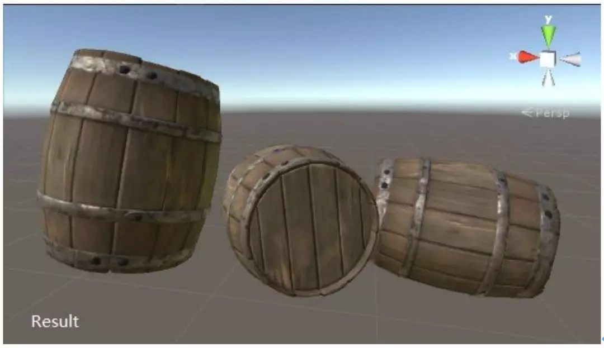
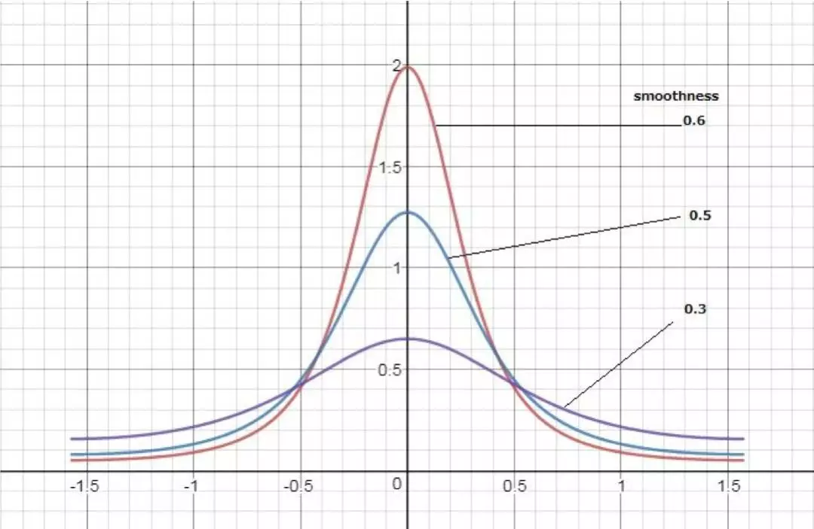
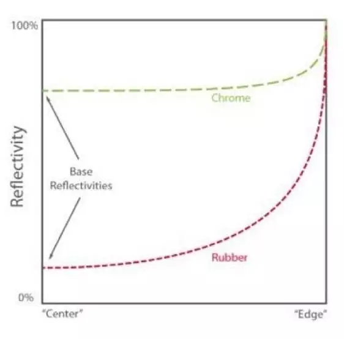
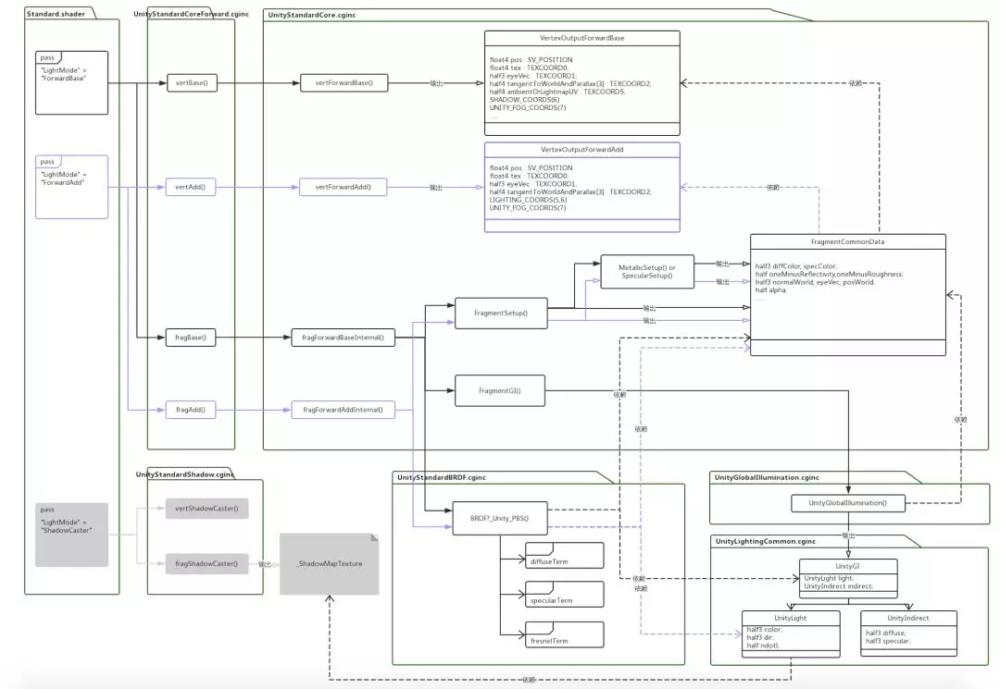
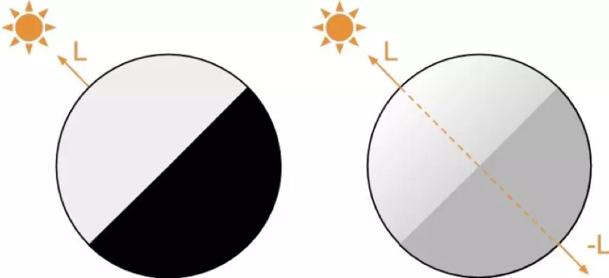
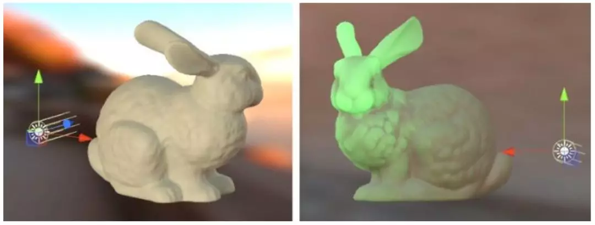
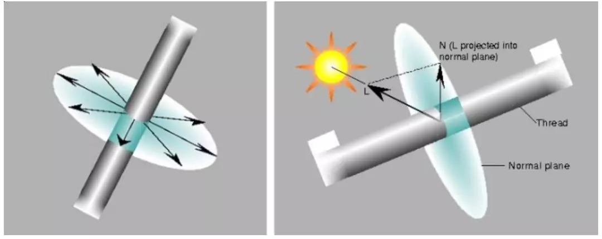

##                                                                             Unity的PBR扩展                                         


这是侑虎科技第497篇文章，感谢作者Young供稿。欢迎转发分享，未经作者授权请勿转载。如果您有任何独到的见解或者发现也欢迎联系我们，一起探讨。（QQ群：793972859）


作者主页：https://www.zhihu.com/people/chen-yong-59-86，作者也是[U Sparkle活动](http://mp.weixin.qq.com/s?__biz=MzI3MzA2MzE5Nw==&mid=2668903877&idx=1&sn=324ac7d58ca5cece51eb197c6d091c74&scene=21#wechat_redirect)参与者，UWA欢迎更多开发朋友加入[U Sparkle开发者计划](http://mp.weixin.qq.com/s?__biz=MzI3MzA2MzE5Nw==&mid=2668903877&idx=1&sn=324ac7d58ca5cece51eb197c6d091c74&scene=21#wechat_redirect)，这个舞台有你更精彩！

------


> **导语**


PBR可理解为是一套渲染标准，标准化有利于简化美术流程，本文作者先剖析Unity的标准PBS的代码实现，基于PBR的核心PBS，再详细讲述了如何通过对PBS的代码的修改来扩展PBR，以支持Subsurface，Skin，ClearCoat，Cloth和Hair等效果。


基于物理的渲染(PBR, Physically Based Rendering)采用了物理真实的光照模型，符合自然世界的直观认知规律，近年来比较流行。


PBR可理解为是一套渲染标准，标准化有利于简化美术流程，但是只使用标准PBR达不到具体项目的渲染需求，因为游戏风格差异化大多来自对渲染的自定义，比如卡通化PBR渲染：



异度之刃2的游戏截图


*上图为NS主机游戏异度之刃2的游戏截图，角色脸部和头发都是比较卡通的，其它部分的金属质感盔甲和场景也都是写实风格的。*


异度之刃2在非真实建模的前提下，使用真实渲染和非真实渲染结合，配合后期调色，形成了游戏特有的卡渲风格。游戏中角色脸部和头发渲染这种具有PBR属性，但又风格化的渲染就属于扩展PBR。

 

> **一、标准PBS**


PBR的核心是PBS（Physically  Based Shading）着色模型，具体实现由各大引擎自己负责，Unity的PBS实现封装为Standard，Unreal  4（下称UE4）中实现封装为Default  Lit。本文的扩展是在Unity的标准PBS的基础上去修改和扩展，这里先剖析Unity的标准PBS的代码实现。


**1.1  BRDF**

BRDF（双向反射分布函数）光照模型是PBS的重要组成部分，用于描述光在物体表面的反射情况。该模型基于微表面理论，认为光在物体表面反射的光量是物体表面的所有微小表面漫反射和镜面反射光量的总和，符合能量守恒：


1） 反射的光总量不大于入射的光总量，且漫反射和镜面反射是互斥关系；

2） 粗糙的表面反射的光线分散且暗，光滑的表面反射集中且亮。


Unity的BRDF的内部实现文件为UnityStandardBRDF.cginc，主要实现函数为BRDF?_Unity_PBS。Unity的BRDF实现按平台分为3个档次，这里讨论的是针对Console/PC平台，光照模型更加精确的第1档实现BRDF1_Unity_PBS。


BRDF的漫反射部分为Disney漫反射模型，该计算模型基于表面粗糙度，主要实现代码为：

```
 half nlPow5 = Pow5 (1-nl);    half nvPow5 = Pow5 (1-nv);    half Fd90 = 0.5 + 2 * lh * lh * roughness;    half disneyDiffuse = (1 + (Fd90-1) * nlPow5) * (1 + (Fd90-1) * nvPow5);     half diffuseTerm = disneyDiffuse * nl; 
```

代码中diffuseTerm 为计算得到的漫反射部分。


*Disney漫反射模型与不考虑表面粗糙度的Lambert漫反射模型实际效果区别不大，所以在Unity的第2,3档中diffuse计算用的是更简单的Lambert模型。*


BRDF的镜面反射部分基于Torrance-Sparrow微表面模型，公式类似为：


主要实现代码为：

```
#if UNITY_BRDF_GGX    half V = SmithJointGGXVisibilityTerm (nl, nv, roughness);    half D = GGXTerm (nh, roughness);#else    half V = SmithBeckmannVisibilityTerm (nl, nv, roughness);    half D = NDFBlinnPhongNormalizedTerm (nh, RoughnessToSpecPower (roughness));#endif F = FresnelTerm (specColor, lh);half specularTerm = (V * D * F) * (UNITY_PI/4); 
```


代码中SpecularTerm 为计算得到的镜面反射部分，实现上基本遵守了Torrance-Sparrow的公式。


其中，法线分布D和几何衰减G按是否采用GGX计算模型会有些不同。这里附一张不同粗糙度的法线分布函数（NDF）曲线示意图：

 




上图中，X轴为Half半角向量和表面Normal的夹角弧度，Y轴为NDF返回值，可看出Smoothness越高的函数曲线越陡峭，可解释“**粗糙的表面反射的光线分散且暗，光滑的表面反射集中且亮**”能量守恒。


公式中的Frensnel部分的代码实现为：

```
inline half3 FresnelTerm (half3 F0, half cosA){    half t = Pow5 (1 - cosA);    // ala Schlick interpoliation    return F0 + (1-F0) * t;} F = FresnelTerm (specColor, lh) 
```


FresnelTerm 的函数曲线符合之前《理论基础》文章所示的**Fresnel**曲线： 



其中，FresnelTerm 函数的第1个参数specColor对应着示意图中的Base Reflectivities。


接下来分析**“Diffuse和Specular互斥”**能量守恒。UnityStandardUtils.cginc文件包含了主要内部实现代码：

```
inline half OneMinusReflectivityFromMetallic(half metallic){ // We'll need oneMinusReflectivity, so //   1-reflectivity = 1-lerp(dielectricSpec, 1, metallic) = lerp(1-dielectricSpec, 0, metallic) // store (1-dielectricSpec) in unity_ColorSpaceDielectricSpec.a, then //     1-reflectivity = lerp(alpha, 0, metallic) = alpha + metallic*(0 - alpha) =  //                  = alpha - metallic * alpha    half oneMinusDielectricSpec = unity_ColorSpaceDielectricSpec.a;    return oneMinusDielectricSpec - metallic * oneMinusDielectricSpec;} inline half3 DiffuseAndSpecularFromMetallic (half3 albedo, half metallic, out half3 specColor, out half oneMinusReflectivity){    specColor = lerp (unity_ColorSpaceDielectricSpec.rgb, albedo, metallic);    oneMinusReflectivity = OneMinusReflectivityFromMetallic(metallic);    return albedo * oneMinusReflectivity;} 
```


代码根据金属度计算漫反射和镜面反射比例，当Metallic为1时，反射率接近1，函数返回的diffColor接近0，表示几乎不反射漫反射。


*Unity的内置变量Unity_ColorSpaceDielectricSpec定义了绝缘体的高光颜色和反射率，不完全为0，是一个经验值。*


Unity还提供了Specular Setup工作流程来控制漫反射和镜面反射比例。内部实现代码为：

```
// Diffuse/Spec Energy conservationinline half3 EnergyConservationBetweenDiffuseAndSpecular (half3 albedo, half3 specColor, out half oneMinusReflectivity){    oneMinusReflectivity = 1 - SpecularStrength(specColor);    #if !UNITY_CONSERVE_ENERGY        return albedo;    #elif UNITY_CONSERVE_ENERGY_MONOCHROME        return albedo * oneMinusReflectivity;    #else        return albedo * (half3(1,1,1) - specColor);    #endif}
```


代码中用1减去镜面反射比例，得到漫反射比例。当传入的specColor为白色时，SpecularStrength返回1，结果漫反射比例为0，发生完美镜面反射。


计算得到的diffColor和specColor作为比例系数用于最终漫反射和镜面反射计算：


```
//   BRDF = kD / pi + kS * (D * V * F) / 4
```


代码中的 kD和kS对应着diffColor和specColor。


**1.2  IBL**

在材质上反应出周围的环境也是PBS的重要组成部分。在光照模型中一般把周围的环境当作一个大的光源来对待，不过环境光不同于实时光，而是作为间接光(Indirect Light)通过IBL(Image Based Lighting)来实现。间接光计算也包含漫反射部分和镜面反射部分。


UnityGlobalIllumination.cginc文件包含了主要内部实现代码：

```
inline UnityGI UnityGI_Base(UnityGIInput data, half occlusion, half3 normalWorld){    UnityGI o_gi;    ResetUnityGI(o_gi);    .....    #if UNITY_SHOULD_SAMPLE_SH        o_gi.indirect.diffuse = ShadeSHPerPixel (normalWorld, data.ambient, data.worldPos);    #endif    #if defined(LIGHTMAP_ON)        // Baked lightmaps        fixed4 bakedColorTex = UNITY_SAMPLE_TEX2D(unity_Lightmap, data.lightmapUV.xy);        half3 bakedColor = DecodeLightmap(bakedColorTex);        #ifdef DIRLIGHTMAP_COMBINED            ......        #elif DIRLIGHTMAP_SEPARATE            .....        #else // not directional lightmap            o_gi.indirect.diffuse = bakedColor;            ......        #endif    #endif    #ifdef DYNAMICLIGHTMAP_ON        ......    #endif    o_gi.indirect.diffuse *= occlusion;    return o_gi;}
```


Unity内置了Unity_Lightmap、Unity_SHAr等全局变量，来从预先烘焙好的Lightmap贴图或Light  Probe中读取颜色，其中UNITY_SHOULD_SAMPLE_SH代码段处理的是从light  probe中读取颜色值。一般渲染时静态物体读取Lightmap，非静态物体读取Light Probe。


UnityGI_Base函数返回的颜色值为间接光的漫反射部分。

```
inline half3 UnityGI_IndirectSpecular(UnityGIInput data, half occlusion, half3 normalWorld, Unity_GlossyEnvironmentData glossIn){    half3 specular;    #if UNITY_SPECCUBE_BOX_PROJECTION        // we will tweak reflUVW in glossIn directly (as we pass it to Unity_GlossyEnvironment twice), so keep original to pass into BoxProjectedCubemapDirection        half3 originalReflUVW = glossIn.reflUVW;    #endif    #if UNITY_SPECCUBE_BOX_PROJECTION        glossIn.reflUVW = BoxProjectedCubemapDirection (originalReflUVW, data.worldPos, data.probePosition[0], data.boxMin[0], data.boxMax[0]);    #endif    #ifdef _GLOSSYREFLECTIONS_OFF        specular = unity_IndirectSpecColor.rgb;    #else        half3 env0 = Unity_GlossyEnvironment (UNITY_PASS_TEXCUBE(unity_SpecCube0), data.probeHDR[0], glossIn);        #if UNITY_SPECCUBE_BLENDING            ......        #else            specular = env0;        #endif    #endif    return specular * occlusion;}
```


Unity用Reflection Probe来保存预先烘焙好的环境光反射贴图，通过内置变量Unity_SpecCube0，Unity_SpecCube1访问。


UnityGI_IndirectSpecular返回的颜色值为间接光的镜面反射部分。


另外，**“粗糙的表面反射的光线分散且暗，光滑的表面反射集中且亮”**能量守恒在这里同样被遵守，函数输入参数包含粗糙度信息，用于环境光贴图的LOD取值：

```
    half mip = roughness * UNITY_SPECCUBE_LOD_STEPS;    half4 rgbm = UNITY_SAMPLE_TEXCUBE_LOD(tex, glossIn.reflUVW, mip);
```


表面越粗糙，用于采样Mipmap贴图的LOD值越高，UNITY_SAMPLE_TEXCUBE_LOD采样的结果越模糊，反之亦然。


**1.3  BRDF+IBL**

正如光照计算公式中多个光源的强度是叠加关系，PBS模型光照计算的结果是实时光BRDF与间接光IBL之和。BRDF1_Unity_PBS函数最后的颜色返回值代码：

  

```
  half grazingTerm = saturate(oneMinusRoughness + (1-oneMinusReflectivity));    half3 color =   diffColor * (gi.diffuse + light.color * diffuseTerm)                    + specularTerm * light.color * FresnelTerm (specColor, lh)            + surfaceReduction * gi.specular * FresnelLerp (specColor, grazingTerm, nv);
```


附自定义Standard Shader得到的结果分解图：





> **二、 扩展**


扩展PBR的具体内容是对标准PBS代码进行修改和扩展。除了核心的光照计算之外还需要对标准PBS的其他代码进行修改和扩展，这里附一张Unity的Standard实现示意图：


 Unity的Standard Forward绘制调用示意图

（点击可放大）


在此基础上去扩展，对内主要包括修改和扩展上图中的数据结构、光照模型和绘制过程。对外给用户提供可选择的Shading Model：



 UE4的Shading Model和Unity扩展代码文件


上图左为UE4引擎的Shading Model，右为本文在Unity中按UE4方式扩展实现的代码文件列表，其中TT_Unity???.cginc文件为Unity内部的Unity???.cginc文件的修改扩展版本。


其中，TT_UnityStandardBRDF.cginc扩展了各个Shadering Model的实现：

```
 half4 SKIN_BRDF_PBS(half3 diffColor, half3 specColor, half oneMinusReflectivity, half smoothness,  float3 normal, float3 viewDir,  UnityLight light, UnityIndirect gi, half4 sssTex) {  ... } half4 HAIR_BRDF_PBS (half3 diffColor, half3 specColor, half oneMinusReflectivity, half smoothness,  float3 normal, float3 viewDir,  UnityLight light, UnityIndirect gi, float3 tangentWorld = float3(0, 0, 1), half2 anisoCtrl = half2(1, 1)) {  ... } half4 CLEARCOAT_BRDF_PBS (half3 diffColor, half3 specColor, half oneMinusReflectivity, half smoothness,  float3 normal, float3 viewDir,  UnityLight light, UnityIndirect gi, float3 normal_clearcoat, UnityIndirect gi_clearcoat) {  ...  } half4 FABRIC_BRDF_PBS (half3 diffColor, half3 specColor, half oneMinusReflectivity, half smoothness,  float3 normal, float3 viewDir,  UnityLight light, UnityIndirect gi) {  ... }TT_UnityStandardCore.cginc根据Shadering Model的类型选择实现： half4 fragForwardBaseInternal (VertexOutputForwardBase i) {  ... #if _SKIN  half4 c = SKIN_BRDF_PBS(s.diffColor, s.specColor, s.oneMinusReflectivity, s.smoothness, s.normalWorld, -s.eyeVec, gi.light, gi.indirect, sssTex); #elif _HAIR  half4 c = HAIR_BRDF_PBS(s.diffColor, s.specColor, s.oneMinusReflectivity, s.smoothness, s.normalWorld, -s.eyeVec, gi.light, gi.indirect, s.tangentWorld, anisoMap.rg); #elif _CLEARCOAT  half4 c = CLEARCOAT_BRDF_PBS(s.diffColor, s.specColor, s.oneMinusReflectivity, s.smoothness, s.normalWorld, -s.eyeVec, gi.light, gi.indirect, s.normalWorld_clearcoat, gi_clearcoat.indirect); #elif _FABRIC  half4 c = FABRIC_BRDF_PBS(s.diffColor, s.specColor, s.oneMinusReflectivity, s.smoothness, s.normalWorld, -s.eyeVec, gi.light, gi.indirect); #else  half4 c = UNITY_BRDF_PBS(s.diffColor, s.specColor, s.oneMinusReflectivity, s.smoothness, s.normalWorld, -s.eyeVec, gi.light, gi.indirect); #endif  ... } ... half4 fragForwardAddInternal (VertexOutputForwardAdd i) {  ... #if _SKIN  half4 c = SKIN_BRDF_PBS (s.diffColor, s.specColor, s.oneMinusReflectivity, s.smoothness, s.normalWorld, -s.eyeVec, light, noIndirect, sssTex); #elif _HAIR  half4 c = HAIR_BRDF_PBS(s.diffColor, s.specColor, s.oneMinusReflectivity, s.smoothness, s.normalWorld, -s.eyeVec, light, noIndirect); #elif _CLEARCOAT  half4 c = CLEARCOAT_BRDF_PBS(s.diffColor, s.specColor, s.oneMinusReflectivity, s.smoothness, s.normalWorld, -s.eyeVec, light, noIndirect, s.normalWorld_clearcoat, noIndirect); #elif _FABRIC  half4 c = FABRIC_BRDF_PBS (s.diffColor, s.specColor, s.oneMinusReflectivity, s.smoothness, s.normalWorld, -s.eyeVec, light, noIndirect); #else  half4 c = UNITY_BRDF_PBS (s.diffColor, s.specColor, s.oneMinusReflectivity, s.smoothness, s.normalWorld, -s.eyeVec, light, noIndirect); #endif  ... }
```


具体的Shader文件去定义Shadering Model的类型，比如TT_Character_Skin.shader定义了_SKIN类型：


```
 SubShader {  Tags{ "RenderType" = "Opaque" "PerformanceChecks" = "False" }  LOD 300  CGINCLUDE  ...  #define _SKIN 1  ... }
```


*Unity的原生内置着色器cginc文件在类似目录：C:\Program Files\Unity 2018.1.0b13\Editor\Data\CGIncludes\，也可到官网下载Unity安装版本对应的内置着色器代码。*


下面对各个Shading Model的理论模型和具体实现依次大致介绍。


**2.1 Subsurface**

*The  Subsurface Shading Model simulates the effect of Subsurface Scattering.  This is a real-world phenomenon in which light penetrates a surface and  then diffuses throughout it. It can be most readily seen on such  objects as ice, wax candles, and skin.* 

*the  final colour of our pixels depend is the sum of two components. The  first one is the “traditional” lighting. The second one is the light  contribution from a virtual light source illuminating the back of our  model. This gives the impression that light from the original source  actually passed through the material.*


 Subsurface理论模型


Subsurface模型实现核心代码：

```
 half4 SKIN_BRDF_PBS(half3 diffColor, half3 specColor, half oneMinusReflectivity, half smoothness,  float3 normal, float3 viewDir,  UnityLight light, UnityIndirect gi, half4 sssTex) {  ...  // Translucency  float3 H = normalize(light.dir + normal * _Distortion);  float transDot = pow(saturate(dot(viewDir, -H)), _Power) * thickness * _ThicknessScale;  half3 lightScattering = transDot * _SubColor;  ... }
```



Subsurface模型实现效果图


**2.2 Skin**

*The  Preintegrated Skin Shading Model is very similar in nature to the  Subsurface model, but geared toward low performance cost skin rendering  on human characters.* 

*the higher curvature on the nose creates stronger incident light gradient, Which will result in a lot more visible scattering.*


 皮肤的Ramp图


Skin模型实现核心代码：

```
 inline fixed4 SKIN_BRDF_PBS(half3 diffColor, half3 specColor, half oneMinusReflectivity, half smoothness,  float3 normal, float3 viewDir,  UnityLight light, UnityIndirect gi,   half4 sssTex) {  ...  // Skin Lighting  float2 brdfUV;  // Half-Lambert lighting value based on blurred normals.  brdfUV.x = dotNL * 0.5 + 0.5;  brdfUV.y = curvature;  // Curvature amount. Multiplied by light's luminosity so brighter light = more scattering.   half3 diffuseTerm = diffColor * light.color * tex2D( _BRDFTex, brdfUV ).rgb;  ...
```


 Skin模型实现效果图


**2.3 ClearCoat**

*The  Clear Coat Shading Model can be used to better simulate multilayer  materials that have a thin translucent layer of film over the surface of  a standard material. In addition to this, the Clear Coat Shading Model  can also be used with either a metal or nonmetal surfaces. In fact, it  was specifically designed to model this second class of smooth colored  films over a non-colored metal. Some examples include acrylic or lacquer  clear coats, and colored films over metals such as soda cans and car  paint.*


 Paint Layers示意图


ClearCoat模型实现核心代码：


```
half4 fragForwardBaseInternal (VertexOutputForwardBase i) {  ... #if _CLEARCOAT  FragmentCommonData s_clearcoat = (FragmentCommonData) 0;  s_clearcoat.specColor = _ReflectionSpecular.rgb;  s_clearcoat.smoothness = _ReflectionGlossiness;  s_clearcoat.normalWorld = s.normalWorld_clearcoat;  s_clearcoat.eyeVec = s.eyeVec;  s_clearcoat.posWorld = s.posWorld;  UnityGI gi_clearcoat = FragmentGI(s_clearcoat, occlusion, i.ambientOrLightmapUV, atten, mainLight);  half4 c = CLEARCOAT_BRDF_PBS(s.diffColor, s.specColor, s.oneMinusReflectivity, s.smoothness, s.normalWorld, -s.eyeVec, gi.light, gi.indirect, s.normalWorld_clearcoat, gi_clearcoat.indirect); #endif   ... } half4 CLEARCOAT_BRDF_PBS (half3 diffColor, half3 specColor, half oneMinusReflectivity, half smoothness,  float3 normal, float3 viewDir,  UnityLight light, UnityIndirect gi, float3 normal_clearcoat, UnityIndirect gi_clearcoat) {  half4 c = BRDF1_Unity_PBS(diffColor, specColor, oneMinusReflectivity, smoothness, normal, viewDir, light, gi);  // SPECULAR & SMOOTHNES  diffColor = 0;  specColor = _ReflectionSpecular.rgb;  smoothness = _ReflectionGlossiness;  oneMinusReflectivity = 1 - SpecularStrength(specColor);  c += BRDF1_Unity_PBS(diffColor, specColor, oneMinusReflectivity, smoothness, normal_clearcoat, viewDir, light, gi_clearcoat);  return c; }
```


 ClearCoat模型实现效果图


**2.4  Cloth**

*For  fabrics, like black velvet, the most distinguishing features are due to  rim lighting (both forward and backward scattering). If the light is in  the same direction as the viewer then specular contributes most towards  the edge of the object due to backscattering and how the fabric is  constructed. Tiny fibers are attached to the surface so that they try to  stand up straight. When the light and view direction are aligned the  light will backscatter when the surface normal is 90 degrees from the  light or view direction. Additionally, if the light is behind the  objects the fibers will forward scatter light through giving a nice rim  light effect.*


理想反射与实际织物的反射对比


Cloth模型实现核心代码：

```
 inline float FabricD (float NdotH, float roughness) {  return 0.96 * pow(1 - NdotH, 2) + 0.057;  } inline half FabricScatterFresnelLerp(half nv, half scale) {  half t0 = Pow4 (1 - nv);   half t1 = 0.4 * (1 - nv);  return (t1 - t0) * scale + t0; } half4 FABRIC_BRDF_PBS (half3 diffColor, half3 specColor, half oneMinusReflectivity, half smoothness,  float3 normal, float3 viewDir,  UnityLight light, UnityIndirect gi) {  ...  float D = FabricD (nh, roughness);  ...  half3 color = diffColor * (gi.diffuse + light.color * diffuseTerm)  + specularTerm * light.color * FresnelTerm (specColor, lh)  + _FabricScatterColor * (nl*0.5 + 0.5) * FabricScatterFresnelLerp(nv, _FabricScatterScale);  ...
```


 Cloth模型实现效果图


**2.5  Hair**

*我们日常生活中有很多物体呈现各向异性反射效果。比如：拉丝金属，毛发，光碟等。一般这种反射效果是由物体表面的微表面特性导致的：物体表面主要由大量的方向一致的细长划痕或纤维微表面组成。   比如，拉丝金属物件表面由大量平行的丝状划痕组成；光碟的表面由一圈一圈的环形细小轨道（用于存放数据）组成；头发的表面由大量的头发丝组成等。沿着这些划痕或纤维的法线分布不同于通常的垂直于表面的法线分布，  使得物体整体的光照反射表现呈现各向异性。*



 各项异性模型


Hair模型实现核心代码：

```
inline half AnisoDCore(half smoothness, half3 normalWorld, half3 tangentWorld, half3 halfDir, half nh, half D, half gloss, half spec, half mask) {  half3 Y = cross(normalWorld, tangentWorld);  half RoughnessX = SmoothnessToRoughness(saturate(smoothness * gloss));  RoughnessX += !RoughnessX * 1e-4f;   half mx = RoughnessX * RoughnessX;  half XdotH = dot(tangentWorld, halfDir);  half YdotH = dot(Y, halfDir);  half d = XdotH * XdotH / (mx * mx) + YdotH * YdotH + nh * nh;  d += !d * 1e-4f;  half Da = 1 / (UNITY_PI * mx * d * d);  D = lerp(Da, D, mask);  D *= lerp(spec, 1, mask);  return D; } inline half3 JitterTangent(half3 T, half3 N, float shift) {  half3 shiftedT = T + shift * N;  return normalize(shiftedT); } inline half AnisoD(half smoothness, half3 normalWorld, half3 tangentWorld, half3 halfDir, half nh, half D, half2 anisoCtrl) {  half jitter = anisoCtrl.r;  half mask = anisoCtrl.g;  half3 tangentWorld1 = JitterTangent(tangentWorld, normalWorld, 0 + _TangentShift1);  half AnisoDLow = AnisoDCore(smoothness, normalWorld, tangentWorld1, halfDir, nh, D, _AnisoGloss1, _AnisoSpec1, mask);  half3 tangentWorld2 = JitterTangent(tangentWorld, normalWorld, jitter + _TangentShift2);  half AnisoDHigh = AnisoDCore(smoothness, normalWorld, tangentWorld2, halfDir, nh, D, _AnisoGloss2, _AnisoSpec2, mask);   return AnisoDLow + AnisoDHigh; } half4 HAIR_BRDF_PBS (half3 diffColor, half3 specColor, half oneMinusReflectivity, half smoothness,  float3 normal, float3 viewDir,  UnityLight light, UnityIndirect gi, float3 tangentWorld = float3(0, 0, 1), half2 anisoCtrl = half2(1, 1)) {  ...   float D = GGXTerm(nh, roughness);  D = AnisoD(smoothness, normal, tangentWorld, halfDir, nh, D, anisoCtrl);  ... }
```


Hair模型实现效果图


完整代码见：

*https://lab.uwa4d.com/lab/5b69a13ed7f10a201f02360a*


> **三、Further**


目前的代码框架扩展实现了上面列举的几种常见的Shading Model，未来的工作就是在这些Shading Model的基础上去风格化，或者扩展新的Shading Model。


*另外，说明一下从源码级别自定义PBR的意义：目前的材质节点编辑器，比如Amplify  Shader Editor，生成的是Surface中间代码，内部走的是Standard流程；Shader  Forge（目前已停更），生成的代码调用的也是内置的Standard接口；Unity官方的SRP配套使用的Shader  Graph只支持Standard材质。*


参考文献：

*https://marmoset.co/posts/physically-based-rendering-and-you-can-too/*

*https://www.alanzucconi.com/2017/08/30/fast-subsurface-scattering-1/*

*https://docs.unrealengine.com/en-us/Engine/Rendering/Materials/MaterialProperties/LightingModels*

*http://web.engr.oregonstate.edu/~mjb/cs519/Projects/Papers/HairRendering.pdf*


文末，再次感谢Young的分享，如果您有任何独到的见解或者发现也欢迎联系我们，一起探讨。（QQ群：793972859）。

也欢迎大家来积极参与**U Sparkle开发者计划**，简称“US”，代表你和我，代表UWA和开发者在一起！