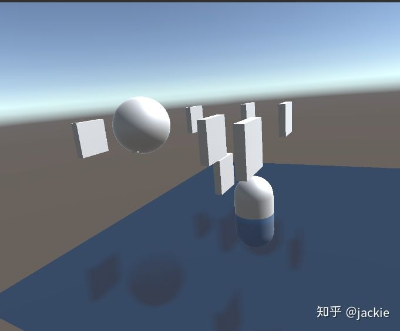
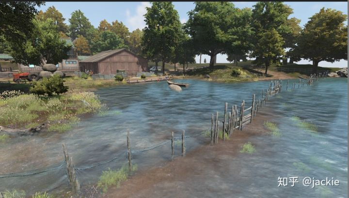
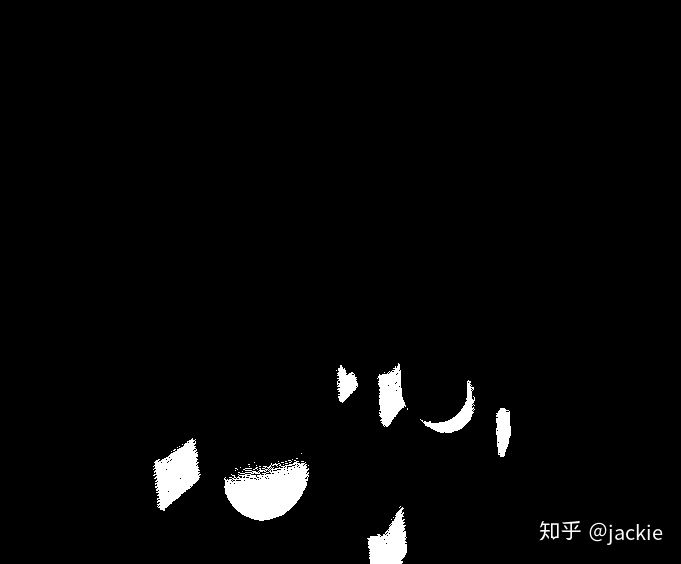

# 一种更简化的SSR

## 前言

从一个程序老鸟到图像萌新到那段时间，我对渲染领域的反射最感兴趣。因为我做技术很多年很难相信这片众多大佬们深耕已久的领域居然连我认为最基础的反射都没一套完整的方案（光追普及之前）。

- 平面反射翻倍开销（虽然可以用代替物和简化材质，但整个相机裁剪 渲染 灯光流程都要走一遍）
- reflectionProbe 室内近景除了拍摄点以外所有位置角度都是错的，虽然box模式 可以修正偏差 但有2点无法绕过 1环境不会刚好是box 2任何位置一处拍摄必定有其他位置可见处的信息丢失
- ssr 屏幕外无反射而且对 roughness处理并不理想

于是年少轻狂之下 脑洞了 这种做法，放到今天我不敢这样了，肯定先查询学习完各种资料先。

## 项目需求

我们需要一个不小的水面反射，周围景物非box排列 无法通过 多个reflectionProbe 实现，一开始使用的 平面反射 优化各种反射对象后 依然裁剪和渲染开销过大，最后几乎锁定ssr。

但是...技术圈一直有个普遍规律 不管理论多先进 不管是什么大神实现或设计的。但只要我的项目能找到肯牺牲的计算点就应该能做性能优化。考虑到对标项目没任何反射所以我说服策划用一种更少开销的反射。就是我脑洞这版。

## 原理与逻辑

1. 我想我们不太需要浅色的武侠的水，我们是写实fps，所以我认为只有深色的水这种水一般不需要镜子一样的投影物体，只需要用一个蓝黑色绘制倒影的轮廓即可。所以这里可以省下一次颜色采样。
2. ssr的开销中 不太好减少的raymarching 只是用来求交判断投影物位置，如果我只做水 那么根据简单几何关系 他是一个平面且已知高度我是可以一个翻转就算出位置的，完全省略了raymarching。

基于以上2点思路我脑洞了这版如有雷同纯属巧合或我了解不足但非抄袭，毕竟喜欢造轮子

## 效果图

demo效果图

《生死狙击2》项目采样后效果

- 相比平面反射 少了大量drawcall和 culling 真实端游项目（生死狙击2）中可省i7-7700 cpu 1ms开销
- 相比常规ssr 效果接近 逻辑更简单 但性能更好 （少了raymatch的n次深度采样检,暂无实际对比数据）

## 关键讲解

传统光栅化过程  是渲染到水面的fragment时候来查找反射来源，这样就需要很复杂的查找方式开销较高。我反过来做屏幕上已经渲染好的每个像素只要世界坐标的y高于水面，我就认为他可能参与反射，把他的世界坐标按水面高度翻转后绘制上白点（在一个独立黑底rt上）这个过程我采样computershader来做更适合写入任意位置的目标像素。这是根据世界坐标翻转  并不能简单的对图像上下翻转因为并不按视角的水平面镜像 而是按 视图空间倾斜的水面镜像。大致如下图

根据水面高度 绘制 物体的 倒影

接下来就简单了 绘制水面的适合来采样这张图 白色区域染成倒影颜色即可。过程简单高效。

生成图片的代码如下

```glsl
#pragma kernel CSMain
#pragma kernel CSClear
RWTexture2D<float> Result;
Texture2D inputTexture;
float3 cmrPos;
int ResultSize;
float WaterHeight;
float4x4 matrix_VP;
[numthreads(8,8,1)]
void CSMain (uint3 id : SV_DispatchThreadID)
{
	 float3 wpos=inputTexture[id.xy].xyz;
	 wpos.y -= WaterHeight;
	 wpos.y=-wpos.y;
	 cmrPos.y  -=WaterHeight;
	 float3 waterWPos=lerp(wpos,cmrPos,abs(wpos.y)/(abs(wpos.y)+abs(cmrPos.y)));
	 waterWPos.y += WaterHeight;
	 float3 uv= mul(matrix_VP,float4(waterWPos,1));
	 uv/=uv.z;
	 uv=uv/2+0.5;
         uint2 uvint=(uint2)( uv.xy*ResultSize +float2(0.5,0.5));
         if (wpos.y < 0)
	   Result[uvint] = 1;
	
}

 
[numthreads(8, 8, 1)]
void CSClear(uint3 id : SV_DispatchThreadID)
{
  Result[id.xy] = 0;
}
```

渲染的时候因为之前的逻辑都是离散point的必定会重叠和镂空（因为屏幕空连续性不代表世界空间也连续 最后镜像水面重新投影更可能不连续）所以需要用filter处理下 否则锯齿严重。我没多想只尝试了 我做软阴影用到的 泊松分布。

如果该方案对手游项目的朋友依然重度(建议测试后) 我还准备了些小礼物 公告板代替倒影 比较简单也肯定有大量人做过就不写教程了 [https://github.com/jackie2009/waterReflectionBillBoard](https://link.zhihu.com/?target=https%3A//github.com/jackie2009/waterReflectionBillBoard)

```text
fixed4 frag (v2f i) : SV_Target {
				 
	 fixed4 col = _Color;
	 float2 screenPos = i.uv.xy / i.uv.w;
	 			 
	 //根据自己需求 如果要更好性能 可以用 相邻4对角 代替12 泊松分布
	  float2 poisson[12] = { float2(-0.326212f, -0.40581f),
	  float2(-0.840144f, -0.07358f),
	  float2(-0.695914f, 0.457137f),
	  float2(-0.203345f, 0.620716f),
	  float2(0.96234f, -0.194983f),
	  float2(0.473434f, -0.480026f),
	  float2(0.519456f, 0.767022f),
	  float2(0.185461f, -0.893124f),
	  float2(0.507431f, 0.064425f),
	  float2(0.89642f, 0.412458f),
	  float2(-0.32194f, -0.932615f),
	  float2(-0.791559f, -0.59771f) };
          half ref =0;
	  float offsetScale = 8;
	  for (int k = 0; k < 12;k++) {
		 ref += tex2D(WaterPssrTex, screenPos.xy + poisson[k]* offsetScale / WaterPssrTexSize ).r;
		}
	   ref /= 12;
	   col.rgb = lerp(_Color.rgb,  _ReflectionColor.rgb, _ReflectionIntensity*ref);
	   return col;
}
```

## 完整工程与代码

[https://github.com/jackie2009/pssr](https://link.zhihu.com/?target=https%3A//github.com/jackie2009/pssr)[github.com](https://link.zhihu.com/?target=https%3A//github.com/jackie2009/pssr)