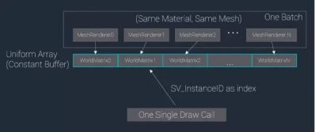

Unity在5.4 Beta版本中引入了一种新的Draw Call Batching方式——GPU Instancing。当场景中有大量使用相同材质和网格的物体时，通过GPU Instancing可以大幅降低Draw Call数量。本文将由Unity官方开发工程师蔡元星，为大家简单介绍GPU Instancing的原理并引导读者修改已有的Shader来开启Instancing。
 
 **什么是GPU Instancing**
 
 GPU Instancing是指由GPU和图形API支持的，用一个Draw Call同时绘制多个Geometry相同的物体的技术。

 上图中的场景有数千块陨石，但只有三种陨石模型，这种情况下使用Instancing之后只需要数十个Draw Call。

 在D3D11中，Instanced Draw Call API如下所示：

 注意前两个参数：IndexCountPerInstance和InstanceCount，这是不同于一般Draw Call API的地方。你需要告诉D3D每个Instance用到多少个顶点索引以及这个Draw Call要画多少个Instances。

 那么如何做到像上图中那样每块石头都有不同的位置、旋转和大小呢？在使用Instancing时，我们一般会把世界矩阵这种每个Instance独有的数据放到一个额外的Buffer中以供Shader访问，可以是第二个Vertex Buffer，也可以是Constant Buffer。

 **Instancing****的应用场景**

 Instancing并不是总能提高性能，所以有必要明白Instancing技术可以做什么、不能做什么。

 Instancing能做什么：

 通过减少Draw Call数量来降低CPU开销。

 Instancing不能做什么：

 减少GPU的负载。实际上，Instancing还会在GPU上带来一些额外的开销。

 具体来说，如果你的场景具备以下条件，使用Instancing可能会给你带来性能提升：
 有大量使用相同材质和相同网格的物体
 性能受制于过多的Draw Call (图形驱动在CPU上负载过大)

 在实际的游戏项目中，最合适使用Instancing来优化的是植被系统。因为通常植被系统需要绘制大量相同的树木和草，使用Instancing之后Draw Call的消耗会大幅降低。

 **在Unity 5.4中使用Instancing**

 在Unity 5.4中使用Instancing需要注意：

 类似于Static / Dynamic Batching，Instancing是一种新的合并Draw Call的方式

 适用于MeshRenderer组件和Graphics.DrawMesh()

 需要使用相同的Material和Mesh

 需要把Shader改成Instanced的版本

 当所有前提条件都满足时，Instancing是自动进行的，并且比Static/Dynamic Batching有更高的优先级

 **Instancing****的实现**

 Instancing的实现步骤如下：

 将Per-Instance Data（世界矩阵、颜色等自定义属性）打包成Uniform Array，存储在Instance Constant Buffers中
 对于可以使用Instancing的Batch，调用各平台图形API的Instanced Draw Call，这样会为每一个Instance生成一个不同的SV_InstanceID
 在Shader中使用SV_InstanceID作为Uniform Array的索引获取当前Instance的Per-Instance Data

 
 **如何修改Shader以支持Instancing**
 
 1、自定义Vertex / Fragment Shader
 下面的代码片段展示了如何把一个简单的Unlit Shader修改为支持Instancing的版本。红色字体的部分是在已有Shader基础上需要添加或修改的地方。

 

 下面我们来逐一解释每一处的修改是什么意思。

 \#pragma multi_compile_instancing

 “multi_compile_instancing”会使你的Shader生成两个Variant，其中一个定义了Shader关键字INSTANCING_ON，另外一个没有定义此关键字。

 除了这个#pragma指令，下面所列其他的修改都是使用了在UnityInstancing.cginc里定义的宏（此cginc文件位于Unity_Install_Dir\Editor\Data\CGIncludes）。取决于关键字INSTANCING_ON是否被定义，这些宏将展开为不同的代码。

 UNITY_INSTANCE_ID

 用于在Vertex Shader输入 / 输出结构中定义一个语义为SV_InstanceID的元素。

 UNITY_INSTANCING_CBUFFER_START(name) / UNITY_INSTANCING_CBUFFER_END

 每个Instance独有的属性必须定义在一个遵循特殊命名规则的Constant Buffer中。使用这对宏来定义这些Constant Buffer。“name”参数可以是任意字符串。

 UNITY_DEFINE_INSTANCED_PROP(float4, _Color)

 定义一个具有特定类型和名字的每个Instance独有的Shader属性。这个宏实际会定义一个Uniform数组。

 UNITY_SETUP_INSTANCE_ID(v)

 这个宏必须在Vertex Shader的最开始调用，如果你需要在Fragment Shader里访问Instanced属性，则需要在Fragment Shader的开始也用一下。这个宏的目的在于让Instance ID在Shader函数里也能够被访问到。

 UNITY_TRANSFER_INSTANCE_ID(v, o)

 在Vertex Shader中把Instance ID从输入结构拷贝至输出结构中。只有当你需要在Fragment Shader中访问每个Instance独有的属性时才需要写这个宏。

 UNITY_ACCESS_INSTANCED_PROP(_Color)

 访问每个Instance独有的属性。这个宏会使用Instance ID作为索引到Uniform数组中去取当前Instance对应的数据。

 最后我们需要提一下UnityObjectToClipPos：

 在写Instanced Shader时，通常情况下你并不用在意顶点空间转换，因为所有内建的矩阵名字在Instanced Shader中都是被重定义过的。比如unity_ObjectToWorld实际上会变成unity_ObjectToWorldArray[unity_InstanceID]；UNITY_MATRIX_MVP会变成mul(UNITY_MATRIX_VP, unity_ObjectToWorldArray[unity_InstanceID])。注意到如果直接使用UNITY_MATRIX_MVP，我们会引入一个额外的矩阵乘法运算，所以推荐使用UnityObjectToClipPos / UnityObjectToViewPos函数，它们会把这一次额外的矩阵乘法优化为向量-矩阵乘法。

 **2****、Surface Shader**

 如果想把一个Surface Shader改写成支持Instancing的版本，你只需要加上“#pragma multi_compile_instancing” 就可以了。设置Instance ID的代码会自动生成。定义或访问每个Instance独有属性的方法同Custom Vertex / Fragment Shader。

 另外，你可以在Project窗口右键单击，选择Create->Shader->Standard Surface Shader (Instanced)来创建一个示例Shader。

 **使用Instancing的限制**

 下列情况不能使用Instancing：

 使用Lightmap的物体
 受不同Light Probe / Reflection Probe影响的物体
 使用包含多个Pass的Shader的物体，只有第一个Pass可以Instancing
 前向渲染时，受多个光源影响的物体只有Base Pass可以instancing，Add Passes不行

 另外，由于Constant Buffer的尺寸限制，一个Instanced Draw Call能画的物体数量是有上限的（参见UnityInstancing.cginc中的UNITY_MAX_INSTANCE_COUNT）

 最后需要再次强调的是，Instancing在Shader上有额外的开销，并不是总能提高帧率。永远要以实际Profiling的结果为准！

 **5.4 Beta****目前支持Instancing的平台**

 Windows: DX11 / DX12 with SM 4.0 and up
 OS X & Linux: OpenGL 4.1 and up
 PlayStation 4
 移动平台和其他主机平台会在后续版本支持

 **立即下载Unity 5.4 Beta 试用Instancing**

 到这里下载：http://unity3d.com/unity/beta
 所有人都可以使用（包括Personal Edition用户）
 反馈意见请到：http://forum.unity3d.com/forums/5-4-beta-forum.97/
 关于Instancing的详尽文档：[https://docs.google.com/document ... Ss/edit?usp=sharing](https://docs.google.com/document/d/1RS6cVjE8mBVOKqQUuXbaZcPW3kmw3ZWySJwr-5rDwSs/edit?usp=sharing)

 （来源：Unity官方平台）[unity3d](http://www.manew.com) 5.0 reflection probe;unity3d reflection probe