# 大气散射明暗器


本教程最后总结了我们模拟行星大气瑞利散射的过程。

下一个（也是最后一个）部分将展示如何更改着色器，使其也包括称为Mie Scattering的其他类型的散射。

您可以在这里找到本系列的所有文章：

- 第1部分。[体积大气散射](https://translate.googleusercontent.com/translate_c?depth=1&pto=aue&rurl=translate.google.com.hk&sl=en&sp=nmt4&tl=zh-CN&u=https://www.alanzucconi.com/%3Fp%3D7374&usg=ALkJrhjYMhWOeFn5j2IlPMWpMA64AiPlMg)
- 第2部分。[大气散射背后的理论](https://translate.googleusercontent.com/translate_c?depth=1&pto=aue&rurl=translate.google.com.hk&sl=en&sp=nmt4&tl=zh-CN&u=https://www.alanzucconi.com/%3Fp%3D7404&usg=ALkJrhhNvWi2Ma8gskQo9lVjBRr-spPMIg)
- 第3部分。 [瑞利散射的数学](https://translate.googleusercontent.com/translate_c?depth=1&pto=aue&rurl=translate.google.com.hk&sl=en&sp=nmt4&tl=zh-CN&u=https://www.alanzucconi.com/%3Fp%3D7472&usg=ALkJrhiArBwcvl4lZ1tg3w6zBYlp7hJKHg)
- 第4部分 [。穿越大气的旅程](https://translate.googleusercontent.com/translate_c?depth=1&pto=aue&rurl=translate.google.com.hk&sl=en&sp=nmt4&tl=zh-CN&u=https://www.alanzucconi.com/%3Fp%3D7557&usg=ALkJrhjMschsdC2q-wdtAHWdFW182MFNug)
- 第5部分。 [大气层着色器](https://translate.googleusercontent.com/translate_c?depth=1&pto=aue&rurl=translate.google.com.hk&sl=en&sp=nmt4&tl=zh-CN&u=https://www.alanzucconi.com/%3Fp%3D7665&usg=ALkJrhgTDkLQgvV6XWqIWD7d38K_d8Quxw)
- 第6部分。 [相交的气氛](https://translate.googleusercontent.com/translate_c?depth=1&pto=aue&rurl=translate.google.com.hk&sl=en&sp=nmt4&tl=zh-CN&u=https://www.alanzucconi.com/%3Fp%3D7781&usg=ALkJrhj54Ie8EPoQkg4AuMrWftgjjy1-aA)
- **第7部分。 [大气散射着色器](https://translate.googleusercontent.com/translate_c?depth=1&pto=aue&rurl=translate.google.com.hk&sl=en&sp=nmt4&tl=zh-CN&u=https://www.alanzucconi.com/%3Fp%3D7793&usg=ALkJrhiya4HGZA53eDuy9guoib53wbK9IQ)**
- 第8部分。 [三重理论概论](https://translate.googleusercontent.com/translate_c?depth=1&pto=aue&rurl=translate.google.com.hk&sl=en&sp=nmt4&tl=zh-CN&u=https://www.alanzucconi.com/%3Fp%3D7578&usg=ALkJrhiT9N0FnH53kCdo8wVccpn3C10IEA)

您可以参考“ [大气散射备忘单”](https://translate.googleusercontent.com/translate_c?depth=1&pto=aue&rurl=translate.google.com.hk&sl=en&sp=nmt4&tl=zh-CN&u=https://www.alanzucconi.com/%3Fp%3D7766&usg=ALkJrhjSEJtCcx3nq0bi_g1cPtOXSryBcg)  以获取所有所用方程式的完整参考。

您可以在页面底部**下载**本教程的**Unity软件包**。


#### 采样视线

让我们回想一下最近得出的大气散射方程：

 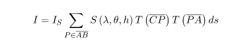

我们接收到的光量等于从太阳发出的光量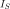，乘以该段中每个点的各个贡献之和。

我们可以直接在着色器中实现该功能。但是，几乎没有可以完成的优化。在以前的教程中曾暗示可以进一步简化该表达式。我们可以采取的第一步是将散射函数分解为两个基本组成部分：

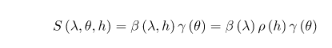

由于角度和波长不取决于采样点，因此**相位函数** 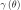和**海平面上** 的**散射系数****相**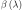对于总和是恒定的。因此，可以将它们排除在外：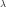

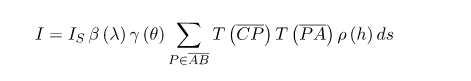

这个新表达式在数学上与上一个等效，但是由于某些最重的部分已从求和中删除，因此该表达式的计算效率更高。

我们还没有准备好开始实施它。我们应该考虑到很多方面。的合理近似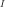是将长度分成几个较小的部分，并累积每个单独部分的贡献。这样做时，我们假设每个段都足够小以具有恒定的密度。一般来说，情况并非如此，但是如果a足够小，我们仍然可以达到一个合理的近似值。

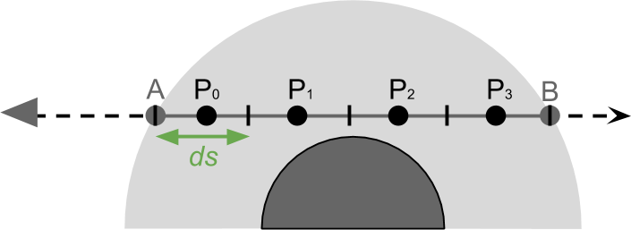

由于所有段都位于视线上，因此其中的段数  称为**视图样本**。在着色器中，这将是_ViewSamples  属性。通过将其作为属性，可以从物料检查器访问它。这使我们可以降低着色器的精度，从而提高其性能。

以下代码允许循环遍历大气中的所有部分。

```glsl
// Numerical integration to calculate
// the light contribution of each point P in AB
float3 totalViewSamples = 0;
float time = tA;
float ds = (tB-tA) / (float)(_ViewSamples);
for (int i = 0; i < _ViewSamples; i ++)
{
	// Point position
	// (sampling in the middle of the view sample segment)
	float3 P = O + D * (time + ds * 0.5);

	// T(CP) * T(PA) * ρ(h) * ds
	totalViewSamples += viewSampling(P, ds);

	time += ds;
}

// I = I_S * β(λ) * γ(θ) * totalViewSamples
float3 I = _SunIntensity *  _ScatteringCoefficient * phase * totalViewSamples;
```

可变时间  用于跟踪我们距原点的距离，并 在每次迭代后增加ds。 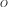

#### 光学深度PA

沿视线的每个点都会对我们绘制的像素的最终颜色产生自己的贡献。从数学上讲，该贡献是求和内的数量：

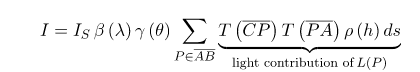

就像我们在上一段中所做的那样，让我们尝试简化它。通过替换其实际定义，我们可以进一步扩展该表达式：

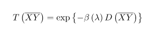

透射过的产品和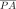变成：

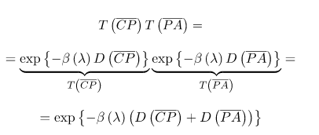

将**合并的透射率**被建模为一个指数衰减与系数是的总和**光学深度**在由光（行进的路径和），乘以*在海平面散射系数*（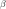与）。

我们开始计算的第一个量是该片段的光学深度，该深度从进入点到大气，一直到我们当前在for循环中采样的点。让我们回想一下光学深度的定义：

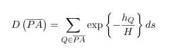

如果必须天真的实现这一点，我们将创建一个名为OpticalDepth的函数，该函数对循环 之间和循环中的点进行采样。这是可能的，但是效率很低。实际上，我们已经在分析最外层的for循环的段的光学深度。如果我们计算当前segmenet居中的光学深度（opticalDepthSegment），并将其累积在for循环（opticalDepthPA）中，则可以节省很多计算。 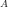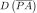

```
// Accumulator for the optical depth
float opticalDepthPA = 0;

// Numerical integration to calculate
// the light contribution of each point P in AB
float time = tA;
float ds = (tB-tA) / (float)(_ViewSamples);
for (int i = 0; i < _ViewSamples; i ++)
{
	// Point position
	// (sampling in the middle of the view sample segment)
	float3 P = O + D * (time + viewSampleSize*0.5);

	// Optical depth of current segment
	// ρ(h) * ds
	float height = distance(C, P) - _PlanetRadius;
	float opticalDepthSegment = exp(-height / _ScaleHeight) * ds;

	// Accumulates the optical depths
	// D(PA)
	opticalDepthPA += opticalDepthSegment;

	...	

	time += ds;
}
```


#### 灯光采样

如果我们回顾一下的光贡献表达式，我们会发现，唯一需要的数量就是线段的光学深度，

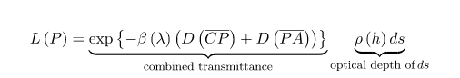

我们将把计算片段光学深度的代码移到一个名为lightSampling的函数中。该名称来自**光线**，**光线**是从此开始并指向太阳的部分。我们称其为离开大气的点是。 

该 lightSampling  功能，但是，将不只是计算的光学厚度。到目前为止，我们只考虑了大气的贡献，却忽略了实际星球的作用。我们的方程式没有考虑从太阳光射向地球的可能性。如果发生这种情况，则必须舍弃到目前为止所做的所有计算，因为实际上没有光会到达相机。 

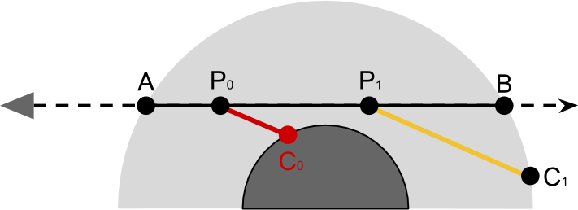

在上图中，很容易看出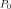应该忽略的光贡献，因为没有太阳光到达。在和之间循环移动时， lightSampling  功能还将检查行星是否被撞到。这可以通过检查点的高度是否为负来完成。

```glsl
bool lightSampling
(	float3 P,	// Current point within the atmospheric sphere
	float3 S,	// Direction towards the sun
	out float opticalDepthCA
)
{
	float _; // don't care about this one
	float C;
	rayInstersect(P, S, _PlanetCentre, _AtmosphereRadius, _, C);

	// Samples on the segment PC
	float time = 0;
	float ds = distance(P, P + S * C) / (float)(_LightSamples);
	for (int i = 0; i < _LightSamples; i ++)
	{
		float3 Q = P + S * (time + lightSampleSize*0.5);
		float height = distance(_PlanetCentre, Q) - _PlanetRadius;
		// Inside the planet
		if (height < 0)
			return false;

		// Optical depth for the light ray
		opticalDepthCA += exp(-height / _RayScaleHeight) * ds;

		time += ds;
	}

	return true;
}
```


|      |      |
| ---- | ---- |
|      |      |

上面的函数首先使用rayInstersect计算点。然后将其划分为 长度为ds的_LightSamples个分段。光学深度的计算与最外层回路中的计算相同。 

如果行星已被撞击，该函数将返回false。我们可以使用它在最外层的循环中更新丢失的代码，代替 。。。。

```glsl
	// D(CP)
	float opticalDepthCP = 0;
	bool overground = lightSampling(P, S);

	if (overground)
	{
		// Combined transmittance
		// T(CP) * T(PA) = T(CPA) = exp{ -β(λ) [D(CP) + D(PA)]}
		float transmittance = exp
		(
			-_ScatteringCoefficient *
			(opticalDepthCP + opticalDepthPA)
		);

		// Light contribution
		// T(CPA) * ρ(h) * ds
		totalViewSamples += transmittance * opticalDepthSegment;
	}
```


|      |      |
| ---- | ---- |
|      |      |

现在我们已经考虑了所有元素，着色器就完成了。

#### 下一步…

这篇文章（最后！）完成了模拟空气散射的体积着色器。到目前为止，我们仅考虑了瑞利散射的贡献。有许多光学现象无法单独用瑞利散射来解释。下一篇文章将介绍第二种类型的散射，即米氏散射。

您可以在这里找到本系列的所有文章：

- 第1部分。[体积大气散射](https://translate.googleusercontent.com/translate_c?depth=1&pto=aue&rurl=translate.google.com.hk&sl=en&sp=nmt4&tl=zh-CN&u=https://www.alanzucconi.com/%3Fp%3D7374&usg=ALkJrhjYMhWOeFn5j2IlPMWpMA64AiPlMg)
- 第2部分。[大气散射背后的理论](https://translate.googleusercontent.com/translate_c?depth=1&pto=aue&rurl=translate.google.com.hk&sl=en&sp=nmt4&tl=zh-CN&u=https://www.alanzucconi.com/%3Fp%3D7404&usg=ALkJrhhNvWi2Ma8gskQo9lVjBRr-spPMIg)
- 第3部分。 [瑞利散射的数学](https://translate.googleusercontent.com/translate_c?depth=1&pto=aue&rurl=translate.google.com.hk&sl=en&sp=nmt4&tl=zh-CN&u=https://www.alanzucconi.com/%3Fp%3D7472&usg=ALkJrhiArBwcvl4lZ1tg3w6zBYlp7hJKHg)
- 第4部分 [。穿越大气的旅程](https://translate.googleusercontent.com/translate_c?depth=1&pto=aue&rurl=translate.google.com.hk&sl=en&sp=nmt4&tl=zh-CN&u=https://www.alanzucconi.com/%3Fp%3D7557&usg=ALkJrhjMschsdC2q-wdtAHWdFW182MFNug)
- 第5部分。 [大气层着色器](https://translate.googleusercontent.com/translate_c?depth=1&pto=aue&rurl=translate.google.com.hk&sl=en&sp=nmt4&tl=zh-CN&u=https://www.alanzucconi.com/%3Fp%3D7665&usg=ALkJrhgTDkLQgvV6XWqIWD7d38K_d8Quxw)
- 第6部分。 [相交的气氛](https://translate.googleusercontent.com/translate_c?depth=1&pto=aue&rurl=translate.google.com.hk&sl=en&sp=nmt4&tl=zh-CN&u=https://www.alanzucconi.com/%3Fp%3D7781&usg=ALkJrhj54Ie8EPoQkg4AuMrWftgjjy1-aA)
- **第7部分。 [大气散射着色器](https://translate.googleusercontent.com/translate_c?depth=1&pto=aue&rurl=translate.google.com.hk&sl=en&sp=nmt4&tl=zh-CN&u=https://www.alanzucconi.com/%3Fp%3D7793&usg=ALkJrhiya4HGZA53eDuy9guoib53wbK9IQ)**
- 第8部分。 [三重理论概论](https://translate.googleusercontent.com/translate_c?depth=1&pto=aue&rurl=translate.google.com.hk&sl=en&sp=nmt4&tl=zh-CN&u=https://www.alanzucconi.com/%3Fp%3D7578&usg=ALkJrhiT9N0FnH53kCdo8wVccpn3C10IEA)

您可以参考“ [大气散射备忘单”](https://translate.googleusercontent.com/translate_c?depth=1&pto=aue&rurl=translate.google.com.hk&sl=en&sp=nmt4&tl=zh-CN&u=https://www.alanzucconi.com/%3Fp%3D7766&usg=ALkJrhjSEJtCcx3nq0bi_g1cPtOXSryBcg)  以获取所有所用方程式的完整参考。