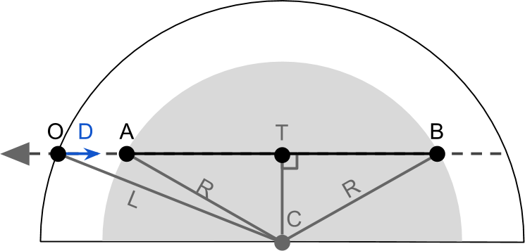
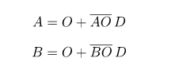
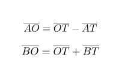
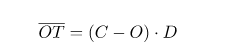
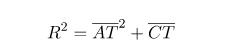
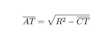
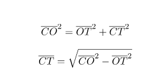
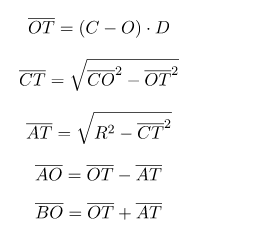
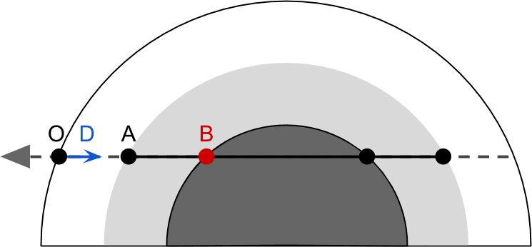

# 相交大气

#### 相交大气

如前所述，我们计算穿过大气层的**光学深度**的唯一方法是通过**数值积分**。这意味着将间隔分成较小的长度段，并在假定其密度恒定的情况下计算每个光学深度。


在上图中，使用4个样本计算的光学深度，每个样本仅考虑片段本身中心的密度。

显然，第一步是找到要点和。如果我们假设我们正在渲染球体，则Unity将尝试渲染其表面。屏幕上的每个像素对应于球体上的一个点。在下图中，该点被称为为*原点*。在表面着色器中，对应于Input  结构 内的worldPos变量。这就是着色器的作用范围。我们唯一可获得的信息是，指示**光线**方向的方向和以半径为中心的大气层。挑战在于计算和  。最快的方法是使用几何方法，从而减少了查找大**气球**与摄像机的**视线**之间的交点的问题。
 

首先，我们应该注意到，并且都位于视线中。这意味着我们可以将其位置称为3D空间中的点，而不是视线到原点的距离。虽然是实际点（在着色器中表示为 float3），但将是其与原点的距离（表示为float）。这两个和两个同等有效的方式来表示同一个点，它认为：  



上划线表示任意点和之间的线段长度。

出于效率方面的考虑，在着色器代码中，我们将使用和，并从中进行计算：

 

我们还应该注意，段和  具有相同的长度。现在我们需要找到交点的是计算和。

最容易计算的细分。如果我们看一下上面的图，我们可以看到这是向量在视线上的投影。从数学上讲，这种投影可以用**点积完成**。如果您熟悉着色器，您可能会知道点积可以衡量两个方向的“对齐”程度。当将其应用于两个向量并且第二个向量具有单位长度时，它将成为投影运算符：



应该注意的是3D向量，而不是和之间的线段长度。

接下来我们需要计算的是片段的长度。这可以使用三角上的**毕达哥拉斯定理**来计算。实际上，它认为：



意思就是：



的长度仍然未知。但是，可以通过在三角形上再次应用毕达哥拉斯定理来计算：



我们知道我们需要的所有数量。把它们加起来：

 

该组方程包含平方根。它们仅在非负数上定义。如果为，则没有解决方案，这意味着视线不与球体相交。

我们可以将其转换为以下Cg函数：

```
bool rayIntersect
(
	// Ray
	float3 O, // Origin
	float3 D, // Direction

	// Sphere
	float3 C, // Centre
	float R,	// Radius
	out float AO, // First intersection time
	out float BO  // Second intersection time
)
{
	float3 L = C - O;
	float DT = dot (L, D);
	float R2 = R * R;

	float CT2 = dot(L,L) - DT*DT;
	
	// Intersection point outside the circle
	if (CT2 > R2)
		return false;

	float AT = sqrt(R2 - CT2);
	float BT = AT;

	AO = DT - AT;
	BO = DT + BT;
	return true;
}
```

没有一个值，但有三个要返回的值：，以及是否存在交集。这两个段的长度使用out  关键字返回，这使函数在终止后对这些参数所做的任何更改都保持不变。

#### 与地球相撞

我们还必须考虑其他问题。某些视线照射到行星上，因此它们穿过大气层的旅程会提前终止。一种方法可能是修改上面介绍的推导。

一种简单但效率较低的方法是运行rayIntersect  两次，然后在需要时调整终点。



这将转换为以下代码：

```
// Intersections with the atmospheric sphere
float tA;	// Atmosphere entry point (worldPos + V * tA)
float tB;	// Atmosphere exit point  (worldPos + V * tB)
if (!rayIntersect(O, D, _PlanetCentre, _AtmosphereRadius, tA, tB))
	return fixed4(0,0,0,0); // The view rays is looking into deep space

// Is the ray passing through the planet core?
float pA, pB;
if (rayIntersect(O, D, _PlanetCentre, _PlanetRadius, pA, pB))
	tB = pA;
```


#### 下一步…

这篇文章展示了如何找到球和射线之间的交点。在下一篇文章中，我们将使用它来计算大气层中视线的入射点和出射点。