# 穿越大气的旅程

#### 大气密度比

我们还没有解决的是大气密度比的作用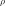。从逻辑观点来看，散射强度与大气密度成正比是有意义的。每平方米更多的分子意味着更多的光子被散射的机会。挑战在于，大气的组成非常复杂，由具有不同压力，密度和温度的几层组成。幸运的是，大多数瑞利散射发生在大气层的前60公里。在**对流层中**，温度呈线性下降，压力呈指数下降。

下图显示了低层大气中密度与高度之间的关系。

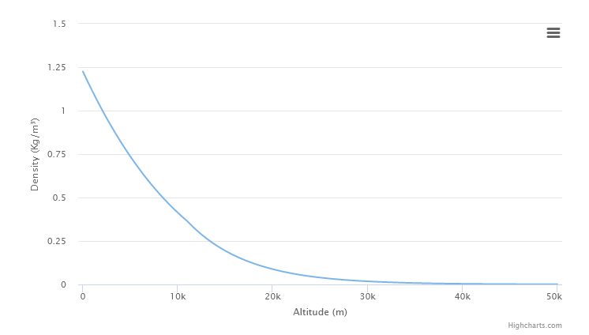

的值表示海拔高度处的大气测量值，已对其进行归一化，使其从零开始。

在许多科学论文中，也称为**密度比，**因为它也可以定义为：

通过将实际密度的原因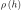是海平面。但是，如前所述，计算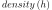远非平凡。我们可以用指数曲线来近似。你们中的一些人实际上可能已经认识到较低大气层中的密度随**指数衰减而变化**。

如果我们想用指数曲线来近似密度比，我们可以这样做：

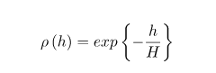

其中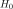的比例因子称为**比例高度**。对于在地球较低层大气中的瑞利散射，通常假定为米（下图）。对于米氏散射，它通常在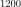米附近。

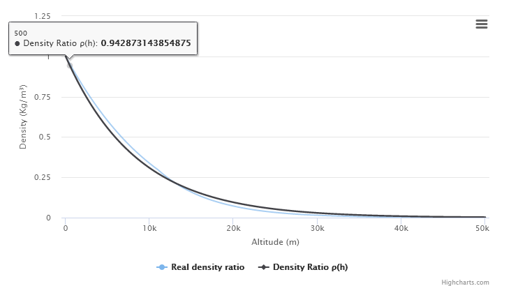

用于的值不能给出的最佳近似值。但是，这并不是真正的问题。本教程中介绍的大多数数量都经过严格的近似。为了获得最佳效果，调整可用参数以匹配参考图像将更加有效。

#### 指数衰减

在本教程的前面部分中，我们导出了一个方程式，该方程式显示了如何解释与单个粒子相互作用后光线受到的向外散射。用于模拟这种现象的数量称为**散射系数** 。我们引入了系数以考虑到这一点。

在瑞利散射的情况下，我们还提供了一种封闭形式来计算每次单次相互作用受到大气散射的光量：

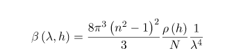

在海平面上进行评估（即使用）时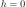，它将产生以下结果：

其中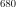，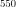并且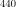是松散地映射到红色，绿色和蓝色波长。

这些数字是什么意思？它们表示与粒子的单次交互所损失的光的比率。如果我们假设一束光线具有初始强度，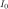并且以（通用）散射系数穿过大气层，则*没有*被散射损失的光量为：

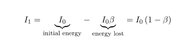

虽然这仅适用于一次碰撞，但我们有兴趣了解在一定距离内散布了多少能量。这意味着，在每个点上，其余的光都要经过此过程。

当光穿过具有散射系数的均匀介质时，如何计算一定距离后仍能存活的光？

对于那些学习微积分的人来说，这听起来很耳熟。每当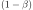在连续段上重复进行类似乘法的过程时，**欧拉数** 就大放异彩。行进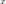米后幸存下来的光量为：

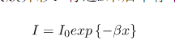

再一次，我们遇到一个指数函数。这与用于描述密度比的指数函数没有任何关系。两种现象都用指数函数描述的原因是它们都经历了指数衰减。除此之外，它们之间没有其他联系。

**exp exp**来自哪里？

#### 均匀透射率

在本教程的第二部分中，我们介绍了**透射** 率的概念，即穿过大气后在散射过程中幸存下来的光的比率。现在，我们拥有了最终导出描述它的方程式所需的所有元素。

让我们看一下下面的图，看看如何计算该段的透射系数。可以很容易地看到到达的光线穿过空的空间。因此，它们不会受到散射。因此，处的光量是**太阳强度** 。在到达的过程中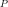，一些光从路径散开了。因此，光到达量，将比较低。

散射的光量取决于行进的距离。路程越长，衰减越大。根据指数衰减定律，可以计算出的光量如下：

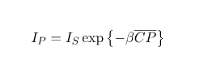

其中是从到的段的长度，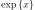是**指数函数** 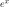。

#### 大气透过率

我们基于以下假设建立方程，即沿的每个点偏转的机会（**散射系数** ）都相同。可悲的是，事实并非如此。

散射系数在很大程度上取决于大气密度。每立方米更多的空气分子意味着更高的撞击机会。行星大气的密度不是均匀的，而是随高度而变化的。这也意味着我们无法在单个步骤中计算出向外散射。为了克服这个问题，我们需要使用其自身的散射系数来计算每个点的向外散射。

要了解其工作原理，让我们从一个近似值开始。该段 分为两部分， 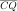和 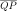。

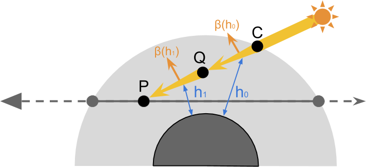

我们首先计算到达的光量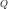：

​    ![\ [I_Q = I_S \ exp {\ left \ {-\ beta {\ left（\ lambda，h_0 \ right）} \ overline {CQ} \ right \}} \]]](JourneyThroughTheAtmosphere.assets/quicklatex.com-bed106a65f8c0a1e2cb10230fa87ea31_l3.svg)

然后，我们使用相同的方法来计算来自的光量：

​    ![\ [I_P = \ boxed {I_Q} \ exp {\ left \ {-\ beta {\ left（\ lambda，h_1 \ right）} \ overline {QP} \ right \}} \]]](JourneyThroughTheAtmosphere.assets/quicklatex.com-f407f4c9bae5534c63499f9e227f95c0_l3.svg)

如果我们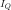用第二个等式代替并简化，我们得到：

如果两者 和 具有相同的长度，我们可以进一步简化表达式：

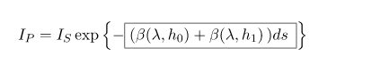

在两个长度相等的段具有不同的散射系数的情况下，可以通过将各个段的散射系数相乘，再乘以段长度来计算外向散射。

我们可以使用任意数量的细分重复此过程，越来越接近实际值。这导致以下等式：

​    ![\ [I_P = I_S \ exp \ left \ {-\ boxed {\ sum_ {Q \ in \ overline {CP}}} {\ beta \ left（\ lambda，h_Q \ right）} \，ds} \ right \} \ ]](JourneyThroughTheAtmosphere.assets/quicklatex.com-b905c9ea8533efb981594e6b6933ca08_l3.svg)

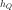该点的高度在哪里。

就像我们所做的那样，将一条线分成多个段的方法称为**数值积分**。

如果我们假设接收到的初始光量等于，则可以得出任意段上的大气透射率方程：

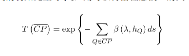

我们可以通过用Rayleigh散射所使用的实际值替换泛型来进一步扩展该表达式：

​    ![\ [T \ left（\ overline {CP} \ right）= \ exp \ left \ {-\ sum_ {Q \ in \ overline {CP}}} {\ boxed {\ frac {8 \ pi ^ 3 \ left（n ^ 2-1 \ right）^ 2} {3} \ frac {\ rho \ left（h_Q \ right）} {N} \ frac {1} {\ lambda ^ 4}}} \，ds \ right \} \ ]](JourneyThroughTheAtmosphere.assets/quicklatex.com-8b74c7ad117f46cc1a67a39d281a6d74_l3.svg)

的许多因素是恒定的，可以从总和中排除：

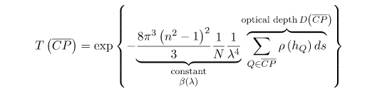

由总和表示的量称为**光学深度** 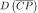，这是我们将在着色器中实际计算的量。其余部分是一个只能计算一次的乘法系数，它对应**于海平面**上的**散射系数**。在最终的着色器中，我们将仅计算光学深度，并提供海平面的散射系数作为输入。

把它们加起来：

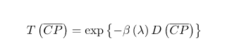

如果您对此主题感兴趣，我还建议您阅读[Carl Davidson](https://translate.googleusercontent.com/translate_c?depth=1&pto=aue&rurl=translate.google.com.hk&sl=en&sp=nmt4&tl=zh-CN&u=https://davidson16807.github.io/tectonics.js//2019/03/24/fast-atmospheric-scattering.html&usg=ALkJrhguC5ChKh6ZD-c1TeYI4319ttUqaQ)关于大气散射的文章，他在其中使用了该迭代方法的改进版本。