# 瑞利散射的数学

这篇文章介绍了瑞利散射的数学原理，这是一种光学现象，可导致天空变蓝。在下一个教程中，本教程中得出的方程式将转换为着色器代码。

您可以在这里找到本系列的所有文章：

- 第1部分。[体积大气散射](https://translate.googleusercontent.com/translate_c?depth=1&pto=aue&rurl=translate.google.com.hk&sl=en&sp=nmt4&tl=zh-CN&u=https://www.alanzucconi.com/%3Fp%3D7374&usg=ALkJrhjYMhWOeFn5j2IlPMWpMA64AiPlMg)
- 第2部分。[大气散射背后的理论](https://translate.googleusercontent.com/translate_c?depth=1&pto=aue&rurl=translate.google.com.hk&sl=en&sp=nmt4&tl=zh-CN&u=https://www.alanzucconi.com/%3Fp%3D7404&usg=ALkJrhhNvWi2Ma8gskQo9lVjBRr-spPMIg)
- **第3部分。 [瑞利散射的数学](https://translate.googleusercontent.com/translate_c?depth=1&pto=aue&rurl=translate.google.com.hk&sl=en&sp=nmt4&tl=zh-CN&u=https://www.alanzucconi.com/%3Fp%3D7472&usg=ALkJrhiArBwcvl4lZ1tg3w6zBYlp7hJKHg)**
- 第4部分 [。穿越大气的旅程](https://translate.googleusercontent.com/translate_c?depth=1&pto=aue&rurl=translate.google.com.hk&sl=en&sp=nmt4&tl=zh-CN&u=https://www.alanzucconi.com/%3Fp%3D7557&usg=ALkJrhjMschsdC2q-wdtAHWdFW182MFNug)
- 第5部分。 [大气层着色器](https://translate.googleusercontent.com/translate_c?depth=1&pto=aue&rurl=translate.google.com.hk&sl=en&sp=nmt4&tl=zh-CN&u=https://www.alanzucconi.com/%3Fp%3D7665&usg=ALkJrhgTDkLQgvV6XWqIWD7d38K_d8Quxw)
- 第6部分。 [相交的气氛](https://translate.googleusercontent.com/translate_c?depth=1&pto=aue&rurl=translate.google.com.hk&sl=en&sp=nmt4&tl=zh-CN&u=https://www.alanzucconi.com/%3Fp%3D7781&usg=ALkJrhj54Ie8EPoQkg4AuMrWftgjjy1-aA)
- 第7部分。 [大气散射着色器](https://translate.googleusercontent.com/translate_c?depth=1&pto=aue&rurl=translate.google.com.hk&sl=en&sp=nmt4&tl=zh-CN&u=https://www.alanzucconi.com/%3Fp%3D7793&usg=ALkJrhiya4HGZA53eDuy9guoib53wbK9IQ)
- 第8部分。 [三重理论概论](https://translate.googleusercontent.com/translate_c?depth=1&pto=aue&rurl=translate.google.com.hk&sl=en&sp=nmt4&tl=zh-CN&u=https://www.alanzucconi.com/%3Fp%3D7578&usg=ALkJrhiT9N0FnH53kCdo8wVccpn3C10IEA)

您可以参考“ [大气散射备忘单”](https://translate.googleusercontent.com/translate_c?depth=1&pto=aue&rurl=translate.google.com.hk&sl=en&sp=nmt4&tl=zh-CN&u=https://www.alanzucconi.com/%3Fp%3D7766&usg=ALkJrhjSEJtCcx3nq0bi_g1cPtOXSryBcg)  以获取所有所用方程式的完整参考。

您可以在页面底部**下载**本教程的**Unity软件包**。

#### 介绍

在上一个教程中，我们导出了一个方程，该方程提供了一个很好的框架来近似着色器中的大气散射。但是，我们忽略的是，一个方程式不会产生可信的结果。如果我们想要一个看起来不错的大气着色器，则必须加强数学运算。

光与物质之间的相互作用极其复杂，没有简单的方法可以完全描述它。实际上，模拟大气散射非常困难。问题的一部分来自大气不是均匀介质的事实。其密度和成分随高度的变化都很大，因此几乎不可能提出“完美”的模型。

这就是为什么科学文献提出几种散射模型的原因，每个模型都旨在描述在特定条件下发生的光学现象的子集。可以通过考虑两种不同的模型来再现行星所表现出的大多数光学效应：**瑞利散射**和**米氏散射**。这两个数学工具可以预测光如何在不同大小的对象上散射。前者模拟组成大部分空气的氧气和氮气分子如何反射光。后者模拟光如何反射悬浮在较低大气层中的更大的化合物，例如花粉，灰尘和污染物。

瑞利散射导致天空为蓝色，日落为红色。三重散射使云彩呈白色。如果您想了解*如何*，我们必须深入钻研散射的数学。

#### 瑞利散射

撞击粒子的光子的命运是什么？要回答这个问题，我们首先需要以更正式的方式重新定义它。想象一下，一束光线穿过空白空间，突然与粒子碰撞。这种碰撞的结果取决于粒子的大小和光的颜色而变化很大。如果粒子足够小（例如原子和分子），则可以通过**瑞利散射**来最好地预测光的行为。

发生的情况是，一部分光线继续其行进不受影响。但是，一小部分原始光与粒子相互作用并在各个方向上散射。但是，并非所有方向都接收相同数量的光。光子更有可能直接穿过粒子或反弹回来。相反，光子的可能性较小的结果将偏转90度。在下图中可以看到这种行为。蓝线显示了散射光的首选方向。

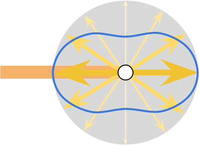

**瑞利散射方程** 用数学方法描述了这种光学现象，该**方程**说明了朝以下方向散射的原始光的比率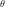：

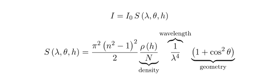

哪里：

- ：**入射光的波长**；
- ：**散射角** ;
- ：该点的**高度**；
- 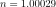：空气的**折射率**；
- 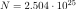：标准大气的**分子数密度**。这是每立方米的分子数。
- ：**密度比**。 此数字等于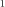海平面上的，并且随着呈指数下降。关于此功能有很多要说的，我们将在本系列的后续文章中介绍。

❓那不是瑞利散射的方程！

如果您在计算机图形以外的其他领域遇到了瑞利散射，则很可能您看到了另一个方程。例如，维基百科在其[瑞利散射](https://translate.googleusercontent.com/translate_c?depth=1&pto=aue&rurl=translate.google.com.hk&sl=en&sp=nmt4&tl=zh-CN&u=https://en.wikipedia.org/wiki/Rayleigh_scattering&usg=ALkJrhh0cHMd2lDll_LKioUEOdDRjXZQTg)条目上呈现的那个看上去就完全不同了。

本教程中使用的方程式来自Nishita *等人*的科学论文[《考虑到大气散射的地球显示》](https://translate.googleusercontent.com/translate_c?depth=1&pto=aue&rurl=translate.google.com.hk&sl=en&sp=nmt4&tl=zh-CN&u=http://nishitalab.org/user/nis/cdrom/sig93_nis.pdf&usg=ALkJrhiR_-jRQOIPVagTubNwuo7Y5D3uWg)*。*。

 

function此功能从何而来？

该博客的任务之一是提供所有引入数量的推导。不幸的是，控制瑞利散射的方程式并非如此。

如果您仍然想知道为什么轻质粒子会以这种怪异的方式反射到空气分子上，那么以下解释可能会让您对实际情况有所了解。

瑞利散射并不是由光线“反弹”出来的粒子引起的。光是电磁波，它可以与某些分子中自然存在的电荷不平衡相互作用。这些电荷通过吸收入射的电磁辐射而被激发，该电磁辐射随后被重新发射。您在相位函数中看到的双瓣形状表明，空气分子变成了**电偶极子**，就像微观天线一样辐射。

 

关于瑞利散射，我们注意到的第一件事是某些方向比其他方向接收更多的光。第二个重要方面是，散射的光量强烈取决于入射光的波长。下面的极坐标图显示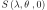了三种不同的波长。评估与通常被称为**海平面散射**。

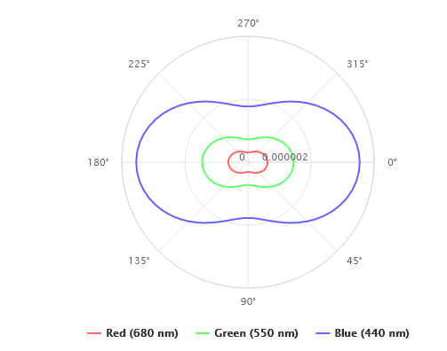

下图显示了可见光谱的波长/颜色连续范围内的散射系数的渲染（可在[ShaderToy](https://translate.googleusercontent.com/translate_c?depth=1&pto=aue&rurl=translate.google.com.hk&sl=en&sp=nmt4&tl=zh-CN&u=https://www.shadertoy.com/view/4tsyWs&usg=ALkJrhgLXvXUyWIhhZ-y1R91aTHFpMwBpQ)上[找到](https://translate.googleusercontent.com/translate_c?depth=1&pto=aue&rurl=translate.google.com.hk&sl=en&sp=nmt4&tl=zh-CN&u=https://www.shadertoy.com/view/4tsyWs&usg=ALkJrhgLXvXUyWIhhZ-y1R91aTHFpMwBpQ)代码）。

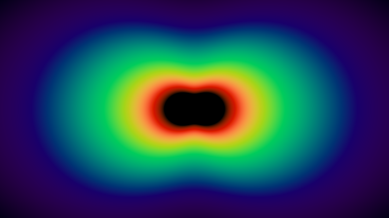

图像中心出现黑色，因为该范围内的波长在可见光谱之外。

#### 瑞利散射系数

瑞利散射方程式表示朝特定方向散射了多少光。但是，它并不能告诉您总共分散了多少能量。要进行计算，我们需要考虑*各个*方向的能量分散。这样的推导不是为胆小的人准备的。如果您不熟悉高级微积分，则结果如下：

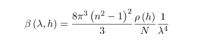

其中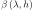表示与单个粒子碰撞后由于散射而损失的能量分数。这通常称为**瑞利散射系数**。

如果你有阅读本教程的前面部分，你可能已经猜到了这确实是**消光系数**的透射率的定义中使用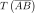过段。

不幸的是，计算非常昂贵。在我们要编写的着色器中，我们将尝试保存尽可能多的计算。因此，从散射系数中“提取”出所有常数都是有用的。这使我们有了，这就是**瑞利散射系数，即海平面**（）：

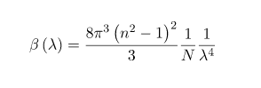

❓给我看数学！

瑞利散射方程式表示在特定方向上损失的能量之比。要计算总损失，我们需要考虑所有可能的方向。连续间隔的求和需要**积分**。

有人可能试图整合过的区间![\ left [0,2 \ pi \ right]](Untitled.assets/quicklatex.com-a90c9c4b24f4b301909cbeb83b6e55f5_l3.svg)，但是这将是一个错误。

尽管我们一直在二维观察瑞利散射，但实际上它是三维现象。散射角可以是3D空间中的任何方向。考虑到依赖于3D空间中的角度（例如）的函数的总贡献，被称为**立体角积分**：

内部积分在XY平面中移动，而外部积分使结果绕X轴旋转以说明第三维。添加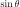的用于球面角。

集成过程只对依赖于什么感兴趣。输入中的几个术语是恒定的，可以移出积分：

这大大简化了内部积分，现在可以执行以下操作：

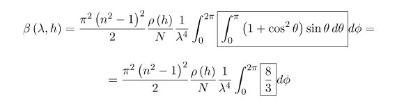

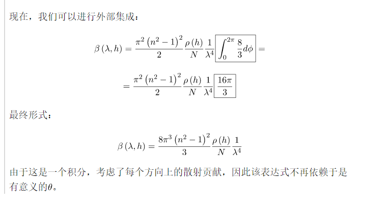

 

这个新方程式提供了另一种理解不同颜色的光如何散射的方法。下图显示了散射光的数量与波长的关系。

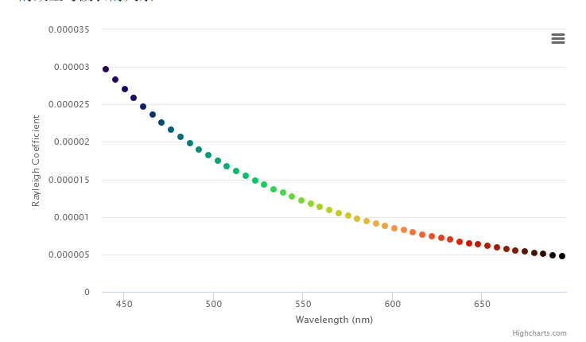

它是散射系数之间的密切关系和其最终变为红色日落天空。我们从太阳接收的光子分布在很宽的波长范围内。瑞利散射告诉我们的是，地球大气中的原子和分子对蓝光的散射比对绿色或红色的散射更强烈。如果允许光线传播足够长的时间，则其所有蓝光都会因散射而丢失。这正是日落时光几乎平行于表面传播时发生的情况。

用同样的理由，我们可以理解为什么天空看起来是蓝色的。来自太阳的光以特定的方向到达。但是，它的蓝色成分分散在各个方向。当您仰望天空时，蓝色的光从各个方向发出。

#### 瑞利相位函数

描述瑞利散射的原始方程式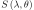可以分解为两个分量。一个是我们刚刚得出的散射系数，该系数将其强度模块化。第二部分与散射的几何形状有关，并控制其方向：

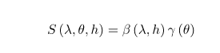

这种新的数量可以得到分割由：

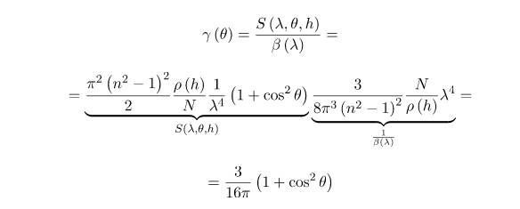

您可以看到此新表达式不依赖于入射光的波长。这似乎是违反直觉的，因为我们肯定知道瑞利散射对较短波长的影响更大。

什么型号，但问题在于，我们以前见过的偶极子的形状。该术语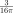用作归一化因子，因此所有可能角度的积分之和为。从技术上讲，可以说在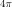球面度上的积分是。

在接下来的部分中，我们将看到如何将这两个组件分开将可以得出更有效的方程式。

#### 快速回顾

- **瑞利散射方程**：表示在方向上偏转的光的比率。散射的强度取决于入射光的波长。

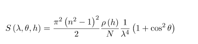

也：

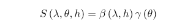

- **瑞利散射系数**：它表示一次碰撞后损失的光与散射的比率。

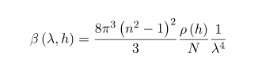

- **海平面上的瑞利散射系数**：等于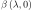。创建此附加系数将对导出更有效的方程式非常有帮助。

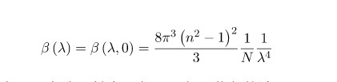

如果我们考虑可以大致映射为红色，绿色和蓝色的波长，则可获得以下结果：

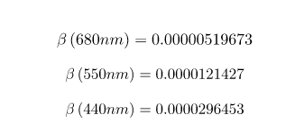

在散射系数处于最大值的海平面上发生。因此，它是散射多少光的“基准”。

- **瑞利相位函数**：控制散射几何形状，该散射几何形状指示在特定方向上损失的光的相对比率。该系数用作归一化因子，因此单位球面上的积分为。

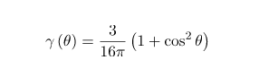

- **密度比**：这是用于模拟大气密度的函数。它将在以后的帖子中正式介绍。如果您不介意数学破坏者，则将其定义为：

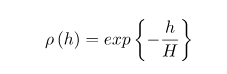

其中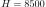米称为**标尺高度**。