# [Rendering] 基于物理的大气渲染

## **# 要解决的问题**

以下我们推导**单次散射（single scattering）**的气渲染模型，即光线从太阳发出过、只经过一次散射被改变方向后射入我们的眼睛。

下图显示了我们观察大气时的观察路径***AB\***，我们想知道***B\***点的大气颜色：

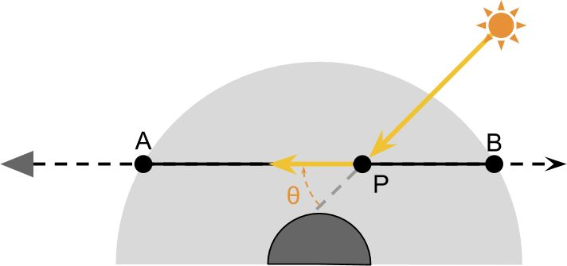来源：https://www.alanzucconi.com/2017/10/10/atmospheric-scattering-1/

这个过程实际上就是对视线路径***AB\***上每一点的光照贡献进行一个积分，下面我们把问题一步步拆分。

**## 问题一：P点的光照是什么？**

由于我们关心的是单级散射，那么唯一的一次散射发生在路径***AB***上的每一点***P***，那么该点的光照强度***Ip***要怎么求呢？它可以理解成是，从***P\***点出发沿着光照方向与大气边缘的交点为***C\***，从***C\***点的光照（我们认为大气层边缘的光照就是太阳发出的光照）经过路径***CP\***衰减后到达***P\***点的光照：

来源：https://www.alanzucconi.com/2017/10/10/atmospheric-scattering-1/

用公式表示就是：

其中，***T项\***是**衰减系数（Transmittance）**，它表示在某段路径上的对光照的衰减程度。该公式也可以被认为是**零级散射（zero scattering）**，即不考虑任何散射事件、直接考虑经过衰减后光强。

**## 问题二：在P点发生了什么？**

我们已知到达***P\***点的光照强度为***Ip\***，那么光线在***P\***点经过一次散射后、经路径***PA\***其他大气粒子的衰减后，最终到达人眼的光照强度***Ipa\***为：

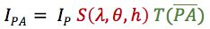

其中，***λ\***是波长，***θ***是图中所示的光线入射方向和观察方向的夹角，***h***是***P\***点的高度。通俗解释下，***S项***是**散射系数（Scattering）**，它表示此次散射事件中有多少光被反射到了***θ\***方向上，***T项\***是衰减系数（Transmittance），它表示在***PA\***路径上的对光照的衰减程度。它们之间是有联系的，简单来说正是因为大气对光线不断发生散射（***S项\***）才导致经过一定路径后光线会发生衰减（***T项***）。接下来对每一项进行解释。

**(1) 散射系数： \*S(λ,θ,h)\***

散射系数和粒子的大小和折射率有关，这里就得解释一下大气粒子的分类。我们知道大气中有很多不同种类的大气分子/粒子，一般在大气渲染模型里把它们分成两大类。一种是小分子，例如氮气和氧气分子等，另一种是大粒子，例如各种尘埃粒子。之所以要进行分类是因为它们对光线有着不一样的行为（这里忽略对光的吸收，只考虑散射）：

- 小分子：指大小远小于光线波长的粒子。小分子对光的散射在前后方向上分布比较均匀，通常会使用**Rayleigh散射（Rayleigh Scattering）**对它们进行建模。由于这些分子大小比波长还要小很多，因此光的波长也会影响Rayleigh散射的程度。
- 大粒子：指大小远大于光线波长的粒子。大粒子在发生散射的时候会把更多的光散射到前向，通常会使用**Mie散射（Mie Scattering）**对它们进行建模。由于光的波长相较于这些粒子大小来说是可以忽略的，因此我们认为Mie散射跟光线波长无关。

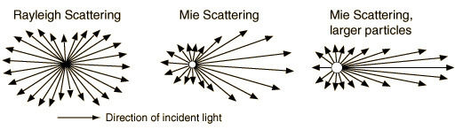

下面以Rayleigh散射为例，解释***S(λ,θ,h)\***的含义。这里直接给出公式，在Rayleigh散射模型中，散射到***θ\***方向上的比例为：

其中，***λ***是光的波长，***n***是粒子折射率，***N***是海平面处的大气密度，***ρ(h)\***是高度***h\***处的相对大气密度（即相对于海平面的密度，可以理解成***h\***处真正的大气密度与海平面处大气密度的比值，因此它在海平面处值为1，随着***h\***增加不断减小），我们一般会使用指数函数对它的真实曲线进行数学拟合（是一种近似拟合，不要和后面提到的指数函数弄混）：

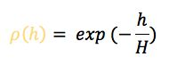

其中，***H\***是大气的整体厚度。

可以看出Rayleigh散射大致和波长的4次幂的成反比，波长越小（越靠近紫光）的光被散射得越厉害。所以白天的时候天空为蓝色，因为蓝光在大气里不断被散射，黄昏的时候天空会变红，因为相比于白天，阳光此时要穿越更厚得多的大气层，在到达人眼之前，大多数蓝光都被散射到其他方向，所以剩下来的就是红光了。

**(2) 衰减系数：\*T(PA)\***

对于大气粒子对光的散射，在传播路径***PA\***上光线会继续衰减。***S(λ,θ,h)\***关心的是被反射到某一特定角度上的光线比例，那么现在我们就需要考虑经过一次散射后，在入射方向上还“剩下来”多少光。

我们先来看一次衰减。假设***I0\***在经过一次散射后损失了***β\***比例的能量，则剩余的能量***I1\***为：

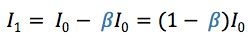

那么经过一段传播路径***PA\***后，余下的能量为：

- 简单情况：如果***β\***为定值，我们可以直接通过微积分得到衰减一段距离***x\***后的剩余能量：

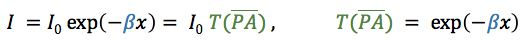

- 复杂情况：复杂情况是***β\***是与波长***λ\***和高度***h\***都相关，即不能简单地当成定值。此时，我们就需要用积分来表示了：

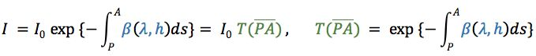

那么问题是，***β\***是什么？在简单情况下，也是很多游戏里雾效的实现方法中，就拿一个类似雾效密度的参数来代替***β\***。在复杂情况下，我们就需要考虑真实的***β\***是如何计算的。

之前我们一直在讨论的***S(λ,θ,h)\***是在某方向上的散射系数，那么***β\***就是在所有方向上的**总散射系数**。我们还是以Rayleigh散射为例，如果我们对Rayleigh散射的***S(λ,θ,h)\***做球面积分，得到总散射系数***β(λ,h)\***为：

终于，我们的公式长度缩短成了两项，不用再看密密麻麻的符号了！上式可以理解成，***β(λ)\***是海平面处的散射系数，随着高度增加，散射强度也不断减小。因为大气相对密度***ρ(h)\***不断减小。据此，我们可以改写***T(PA)\***部分，可以看出，***β(λ)\***其实只跟波长相关，在传播路径上不需要进行积分，因此可以提到积分外部：

我们可以进一步改写其中的积分项。对比简单情况下的公式，积分项对应的其实就是路径长度***x\***，而这部分积分可以理解成**光学距离——Optical Depth**：

同样，我们也可以改写***S(λ,θ,h)\***部分：

其中，***P(θ)\***表示在这些被散射的能量中，有多少比例被反射到了***θ\***方向上，它有一个专有名字——**相位函数（Phase Function）**，也被称为**Scattering Geometry**。所以对于Rayleigh散射来说，它的相位函数就是：

至此，我们简单推导了***S项\***和***T项\***，这样一开始的公式就可以写成：

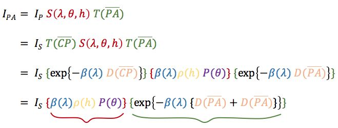

总结起来，公式表示的含义就是，计算观察路径***AB\***上某一点***P\***的光照贡献：

1. 光线从太阳出发，到达大气边缘的***C\***点
2. 经过路径***CP\***上的衰减到达***P\***点（**0级散射**）
3. 在***P\***点发生一次散射，将一部分光散射到了观察方向上（**1级散射**）
4. 这部分光又经过***AP\***路径上的衰减最终到达了我们的眼睛

**## 问题三：路径AB之间发生了什么？**

来源：https://www.alanzucconi.com/2017/10/10/atmospheric-scattering-1/

***P\***只是***AB\***上的某一点，我们需要对路径***AB\***上的每一点进行积分：

其中涉及到了散射系数***β(λ)\***、相位函数***P(θ)\***、光学距离***D(PA)\***等。

**## 小结**

至此，我们完成了单级散射模型的简单推导。但实际情况要复杂得多，在到达人眼之前，光线已经在大气里被散射了无数次，而更高一级的散射总是可以靠它前一级的散射来定义，即是一个**递归定义**：

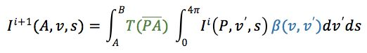

上式的含义是，在***A***点、从观察方向***v\***、光线入射方向***s\***贡献的第***i+1\***级散射（左侧）等于，对观察路径***AB\***上的每一点***P\***的贡献度进行积分：

1. 在***P***点处发生最后一次散射，把光线从积分方向***v'\***散射到观察方向***v\***上（***β(v,v')\***），然后经过***T(PA)\***衰减后到达***A\***点
2. 在最后一次散射前，对之前发生在***P***点、从方向***v'\***、光线入射方向***s\***贡献的第***i\***级散射做球面积分，表示从各个方向***v'\***贡献的第***i\***级散射

回顾我们之前对单级散射的推导过程，其实就是***i=0***的情况。对于第0级散射来说，由于***v'\***不等于***s\***的方向来说，第0级散射都为0，所以我们省略了公式里做球面积分部分。而在***A\***点、从观察方向***v\***、光线入射方向***s\***最后的光照结果应该是把所有级的散射都加起来：

如果是离线渲染，理论上我们可以求得上述公式的精确解。但对于实时渲染来说，第0级和第1级散射都是可以较为快速的求得精确解的，而更高级的散射要计算起来就非常划不来了。在早期的大气渲染资料（例如GPU Gems 2）里，都是对第0级和第1级散射的求解和渲染。直到2008 Precomputed Atmospheric  Scattering的提出，我们也可以实时计算更高级别散射的近似解了。

## **# 大气渲染模型**

具体应用到游戏渲染里，我们一般会把大气渲染分为两个部分：一是天空背景的渲染，即skybox，二是大气透视的渲染，也是我们俗称的大气雾效。在渲染的时候需要考虑光线入射方向***s\***上的遮挡（阴影），通常使用传统的shadow map就可以了。这样我们就可以得到god ray效果。

**## 天空背景**

我们之前推导的公式可以直接拿来渲染天空盒，这里就不重复了。多说一句，第0级散射可以理解成对“sun disk”的渲染。

**## 大气透视**

**大气透视（aerial perspective）**是渲染场景里物体距离摄像机远近的很重要的效果，也是所谓的雾效。与渲染天空盒略微不同的是，我们还需要考虑反射地表颜色等。

依然是考虑在***A\***点、沿着观察路径***AB***接收到的光照。这部分光照可以分为两个部分：一是***B\***点反射的地表颜色***Rb\***经过路径***AB\***衰减后的光照，也就是**第0级反射**，二是路径***AB***上由于散射贡献的光照：

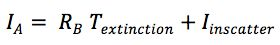

***Textinction\***就是我们之前推导的***T(AB)\***，***Iinscattter\***则是之前推导的多级散射模型。

**## 优化**

核心是使用LUT，例如可以***T(AB)\***存到一张2D纹理里。

**## 例子：简化模型**

大部分游戏的视角只会在地表附近，因此可以使用简化模型来渲染大气雾效。简化模型有两个最明显的特征：

- 使用直线距离***d\***直接代替光学距离***D(AB)\***
- 基于上一点，我们可以使用恒定的散射系数***β\***

**（1）Unity的Exponential Fog**

最简单的例子应该就是**Unity的Exponential Fog**（[https://docs.unity3d.com/Manual/GlobalIllumination.html](https://link.zhihu.com/?target=https%3A//docs.unity3d.com/Manual/GlobalIllumination.html)）了，公式表示就是：

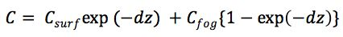

其中的exp部分就是***Textinction\***，即使用恒定的散射系数的简化模型。但后面计算***Iinscattter\***的部分其实是不准确的，可以说是“不怎么基于物理”。

**（2）The Blacksmith中的大气散射**

Unity的The Blacksmith给出了大气散射部分的代码（[https://blogs.unity3d.com/cn/2015/05/28/atmospheric-scattering-in-the-blacksmith/](https://link.zhihu.com/?target=https%3A//blogs.unity3d.com/cn/2015/05/28/atmospheric-scattering-in-the-blacksmith/)，[https://assetstore.unity.com/packages/essentials/the-blacksmith-atmospheric-scattering-39939](https://link.zhihu.com/?target=https%3A//assetstore.unity.com/packages/essentials/the-blacksmith-atmospheric-scattering-39939)）。这部分以后再补吧。

**# 参考资料**

推荐阅读顺序即为排序顺序：

- 入门（理解渲染方程）

- - Atmospheric Scattering系列教程：[https://www.alanzucconi.com/2017/10/10/atmospheric-scattering-1/](https://link.zhihu.com/?target=https%3A//www.alanzucconi.com/2017/10/10/atmospheric-scattering-1/)，详细解释了基本原理和原始的“暴力解法”
  - 2003 Modeling Skylight and Aerial Perspective：[http://mathinfo.univ-reims.fr/IMG/pdf/PreethamSig2003CourseNotes.pdf](https://link.zhihu.com/?target=http%3A//mathinfo.univ-reims.fr/IMG/pdf/PreethamSig2003CourseNotes.pdf)，主要是用来理解大气渲染方程的
  - 2002 Rendering Outdoor Light Scattering in Real Time：[http://developer.amd.com/wordpress/media/2012/10/ATI-LightScattering.pdf](https://link.zhihu.com/?target=http%3A//developer.amd.com/wordpress/media/2012/10/ATI-LightScattering.pdf)，[http://developer.amd.com/wordpress/media/2012/10/ATI-LightScattering.pdf](https://link.zhihu.com/?target=http%3A//developer.amd.com/wordpress/media/2012/10/ATI-LightScattering.pdf)，加上之前的两篇，这三篇看完对渲染方程应该就可以有比较深刻的理解了，可以自己手推

- 进阶（实现渲染方程）

- - GPU Gems 2：[https://developer.nvidia.com/gpugems/GPUGems2/gpugems2_chapter16.html](https://link.zhihu.com/?target=https%3A//developer.nvidia.com/gpugems/GPUGems2/gpugems2_chapter16.html)，经典文章，求解single scattering，虽然文章给出的代码是比较原始的“暴力解法”，但后面给出了关键的优化思想，就是使用LUT
  - 2008 Precomputed Atmospheric Scattering：[https://hal.inria.fr/file/index/docid/288758/filename/article.pdf](https://link.zhihu.com/?target=https%3A//hal.inria.fr/file/index/docid/288758/filename/article.pdf)，[https://ebruneton.github.io/precomputed_atmospheric_scattering/](https://link.zhihu.com/?target=https%3A//ebruneton.github.io/precomputed_atmospheric_scattering/)，除了single scattering还可以得到multiple scattering的近似解，性能也很好，目前是各大3A游戏的标配，缺点是论文写得太难懂，各种数学符号。好在作者给了源码，在2017年的时候甚至优化了代码，增加了可读性和健壮性，良心作者

- 实际应用（GDC）

Unity有很多插件的实现都是基于2008年的Precomputed Atmospheric Scattering，例如uSky（[https://www.assetstore.unity3d.com/#!/content/24830](https://link.zhihu.com/?target=https%3A//www.assetstore.unity3d.com/%23!/content/24830)）、Azure（[https://assetstore.unity.com/packages/tools/particles-effects/azure-sky-dynamic-skybox-36050](https://link.zhihu.com/?target=https%3A//assetstore.unity.com/packages/tools/particles-effects/azure-sky-dynamic-skybox-36050)）等，可以参考和优化。