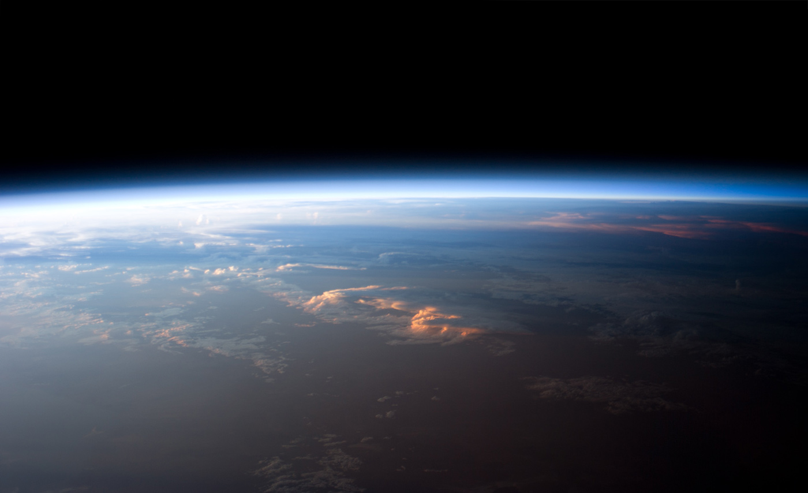

# 大气球体着色器

#### 编写着色器

我们可以通过多种方式来开始为该效果编写着色器代码。由于我们要在行星上渲染大气散射，因此有理由假设它将在球体上使用。

如果您将本教程用于游戏，则很有可能会在现有星球上使用它。可以对球体顶部的大气散射进行计算，但通常会得出较差的结果。原因是大气层大于行星半径，因此需要在透明，稍大的球体上渲染大气层。下图（信用：[NASA](https://translate.googleusercontent.com/translate_c?depth=1&pto=aue&rurl=translate.google.com.hk&sl=en&sp=nmt4&tl=zh-CN&u=https://climate.nasa.gov/&usg=ALkJrhj1aUlLy7cben678KYToVDm1LFC9Q)）显示了大气如何延伸到行星表面上方，并与行星背后的空白空间融为一体。

将散射材料应用于单独的球体是可能的，但是很多余。在本教程中，我建议扩展Unity **标准曲面着色器**，添加一个**着色器通道**以在稍大的球体上渲染气氛。我们将其称为**大气层**。

#### 两遍着色器

如果您以前在Unity中使用过**表面着色器**，则可能会注意到不支持Pass  块，这是通常在**顶点和片段着色器中**定义多次传递的方式。

只需在同一SubShader  块中添加CG代码的两个独立部分，即可创建两次通过的表面着色器：

```glsl
Shader "Custom/NewSurfaceShader" {
	Properties {
		_Color ("Color", Color) = (1,1,1,1)
		_MainTex ("Albedo (RGB)", 2D) = "white" {}
		_Glossiness ("Smoothness", Range(0,1)) = 0.5
		_Metallic ("Metallic", Range(0,1)) = 0.0
	}
	SubShader {

		// --- First pass ---
		Tags { "RenderType"="Opaque" }
		LOD 200
		
		CGPROGRAM
		// Cg code here
		ENDCG
		// ------------------

		// --- Second pass ---
		Tags { "RenderType"="Opaque" }
		LOD 200
		
		CGPROGRAM
		// Cg code here
		ENDCG
		// -------------------
	}
	FallBack "Diffuse"
}
```


您可以编辑第一遍以渲染星球。从现在开始，我们将专注于第二种大气散射。

#### 普通挤出

大气层比行星略大。这意味着第二遍需要将球体挤出。如果您使用的模型具有平滑的法线，则可以使用称为**法线拉伸**的技术来实现此效果。

普通拉伸是最古老的着色器技巧之一，通常是第一个要教的技巧。这个博客有很多参考资料可供参考。一个很好的起点-  来自“ [着色器](https://translate.googleusercontent.com/translate_c?depth=1&pto=aue&rurl=translate.google.com.hk&sl=en&sp=nmt4&tl=zh-CN&u=https://www.alanzucconi.com/%3Fp%3D1900&usg=ALkJrhioGJHahjhDCZhxFh6TbD_3NZPlYg)**的柔和入门** ”系列中的[Surface Shader](https://translate.googleusercontent.com/translate_c?depth=1&pto=aue&rurl=translate.google.com.hk&sl=en&sp=nmt4&tl=zh-CN&u=https://www.alanzucconi.com/%3Fp%3D1900&usg=ALkJrhioGJHahjhDCZhxFh6TbD_3NZPlYg)。

如果您不熟悉法线拉伸的工作方式，则着色器将通过其**顶点函数**来处理所有顶点。我们可以使用该函数来修改每个顶点的位置，从而使球体更大。

第一步是将pragma  指令更改为包含vertex ：vert ; 这迫使Unity  在每个顶点上运行一个称为vert的函数。

```glsl
#pragma surface surf StandardScattering vertex:vert

void vert (inout appdata_full v, out Input o)
{
	UNITY_INITIALIZE_OUTPUT(Input,o);
	v.vertex.xyz += v.normal * (_AtmosphereRadius - _PlanetRadius);
}
```

上面的代码段显示了一个顶点函数，该函数沿其法线拉伸球体。球体的挤出量取决于大气层的大小和行星的大小。这两个数量都需要在着色器中提供为可以从**材质检查**器访问的**属性**。

我们的着色器还需要知道行星的中心。我们也可以将此计算包括在顶点函数中。找到对象在世界空间中的中心位置是我们在《[顶点和片段着色器](https://translate.googleusercontent.com/translate_c?depth=1&pto=aue&rurl=translate.google.com.hk&sl=en&sp=nmt4&tl=zh-CN&u=https://www.alanzucconi.com/%3Fp%3D2001&usg=ALkJrhi9fPVFgLkCjZHR0OfBoLdoK1U4uQ)》一文中讨论的内容。

```glsl
struct Input
{
	float2 uv_MainTex;
	float3 worldPos; // Initialised automatically by Unity
	float3 centre;   // Initialised in the vertex function
};

void vert (inout appdata_full v, out Input o)
{
	UNITY_INITIALIZE_OUTPUT(Input,o);
	v.vertex.xyz += v.normal * (_AtmosphereRadius - _PlanetRadius);
	o.centre = mul(unity_ObjectToWorld, half4(0,0,0,1));
}
```


UN什么是UNITY_INITIALIZE_OUTPUT？


#### 添加剂混合

我们需要解决的另一个重要功能是透明度。通常，透明材料可以看到其背后的内容。该解决方案在这里不能很好地工作，因为大气不仅仅是透明的塑料片。它承载着光，因此我们应该使用**加法混合模式**以确保我们增加行星的发光度。

默认情况下，Unity提供的标准表面着色器没有激活任何混合模式。要更改此设置，我们可以使用以下新标签替换第二遍中的标签：

```glsl
Tags { "RenderType"="Transparent"
	"Queue"="Transparent"}
LOD 200
Cull Back

Blend One One
```

 着色器使用 表达Blend One One来表示加法混合模式。

#### 自定义照明功能

大部分时间程序员必须写一个表面着色，它们修改其冲浪  功能，其用于提供“物理”属性，如漫反射系数，平滑度，金属丰等。然后，着色器将使用所有这些属性来计算逼真的阴影。

在这种情况下，我们不需要任何这些计算。为此，我们需要替换着色器正在使用的**光照模型**。我们已经广泛讨论了这个主题。如果您想更好地了解操作方法，可以参考以下文章：

- [3D打印机着色器效果](https://translate.googleusercontent.com/translate_c?depth=1&pto=aue&rurl=translate.google.com.hk&sl=en&sp=nmt4&tl=zh-CN&u=https://www.alanzucconi.com/%3Fp%3D5660&usg=ALkJrhgylUCqy0O-Jjjwxr40Lz6bcep51Q)
- [CD-ROM着色器：衍射光栅](https://translate.googleusercontent.com/translate_c?depth=1&pto=aue&rurl=translate.google.com.hk&sl=en&sp=nmt4&tl=zh-CN&u=https://www.alanzucconi.com/%3Fp%3D6767&usg=ALkJrhjcXFgRG17HLbuqPLdSgQLvyU336A)
- [Unity中的快速地下散射](https://translate.googleusercontent.com/translate_c?depth=1&pto=aue&rurl=translate.google.com.hk&sl=en&sp=nmt4&tl=zh-CN&u=https://www.alanzucconi.com/%3Fp%3D7053&usg=ALkJrhiPPK8pmH7ejJWQqqc_EmeTHTjgRQ)

新的照明模型将称为StandardScattering；我们需要分别提供用于实时照明和全局照明的函数LightingStandardScattering  和LightingStandardScattering_GI  。

我们需要编写的代码还依赖于诸如**光照方向**和**视图方向之类的**属性。在以下代码段中检索它们。

```glsl
#pragma surface surf StandardScattering vertex:vert

#include "UnityPBSLighting.cginc"
inline fixed4 LightingStandardScattering(SurfaceOutputStandard s, fixed3 viewDir, UnityGI gi)
{
	float3 L = gi.light.dir;
	float3 V = viewDir;
	float3 N = s.Normal;

	float3 S = L;	// Direction of light from the sun
	float3 D = -V;  // Direction of view ray piercing the atmosphere

	...
}

void LightingStandardScattering_GI(SurfaceOutputStandard s, UnityGIInput data, inout UnityGI gi)
{
	LightingStandard_GI(s, data, gi);		
}
```

的。。。 将包含实现此效果所需的实际着色器代码。

#### 浮点精度

就本教程而言，我们将假定所有计算均以米为单位。这意味着，如果要模拟地球，则需要一个半径为6371000米的球体。由于在同时处理非常大和非常小的数字时会发生浮点错误，因此在Unity中实际上是不可能的。

如果要克服这些限制，可以重新调整散射系数以进行相应的补偿。例如，如果您的行星半径只有6.371米，则散射系数应大1000000，标高1000000小。

在实际的Unity项目（可下载）中，所有属性和计算均以米表示。这使我们可以使用真实的物理值作为散射系数和标尺高度。但是，着色器还会接收以米为单位的球体大小，以便可以执行从Unity单位到生命尺度米的尺度转换。

#### 下一步…

这篇文章开始了模拟大气散射所必需的着色器代码。下一篇文章将重点讨论计算大气中视线的入口和出口点所需的几何形状。

您可以在这里找到本系列的所有文章：

- 第1部分。[体积大气散射](https://translate.googleusercontent.com/translate_c?depth=1&pto=aue&rurl=translate.google.com.hk&sl=en&sp=nmt4&tl=zh-CN&u=https://www.alanzucconi.com/%3Fp%3D7374&usg=ALkJrhjYMhWOeFn5j2IlPMWpMA64AiPlMg)
- 第2部分。[大气散射背后的理论](https://translate.googleusercontent.com/translate_c?depth=1&pto=aue&rurl=translate.google.com.hk&sl=en&sp=nmt4&tl=zh-CN&u=https://www.alanzucconi.com/%3Fp%3D7404&usg=ALkJrhhNvWi2Ma8gskQo9lVjBRr-spPMIg)
- 第3部分。 [瑞利散射的数学](https://translate.googleusercontent.com/translate_c?depth=1&pto=aue&rurl=translate.google.com.hk&sl=en&sp=nmt4&tl=zh-CN&u=https://www.alanzucconi.com/%3Fp%3D7472&usg=ALkJrhiArBwcvl4lZ1tg3w6zBYlp7hJKHg)
- 第4部分 [。穿越大气的旅程](https://translate.googleusercontent.com/translate_c?depth=1&pto=aue&rurl=translate.google.com.hk&sl=en&sp=nmt4&tl=zh-CN&u=https://www.alanzucconi.com/%3Fp%3D7557&usg=ALkJrhjMschsdC2q-wdtAHWdFW182MFNug)
- **第5部分。大 [气球着色器](https://translate.googleusercontent.com/translate_c?depth=1&pto=aue&rurl=translate.google.com.hk&sl=en&sp=nmt4&tl=zh-CN&u=https://www.alanzucconi.com/%3Fp%3D7665&usg=ALkJrhgTDkLQgvV6XWqIWD7d38K_d8Quxw)**
- 第6部分。 [相交的气氛](https://translate.googleusercontent.com/translate_c?depth=1&pto=aue&rurl=translate.google.com.hk&sl=en&sp=nmt4&tl=zh-CN&u=https://www.alanzucconi.com/%3Fp%3D7781&usg=ALkJrhj54Ie8EPoQkg4AuMrWftgjjy1-aA)
- 第7部分。 [大气散射着色器](https://translate.googleusercontent.com/translate_c?depth=1&pto=aue&rurl=translate.google.com.hk&sl=en&sp=nmt4&tl=zh-CN&u=https://www.alanzucconi.com/%3Fp%3D7793&usg=ALkJrhiya4HGZA53eDuy9guoib53wbK9IQ)
- 第8部分。 [三重理论概论](https://translate.googleusercontent.com/translate_c?depth=1&pto=aue&rurl=translate.google.com.hk&sl=en&sp=nmt4&tl=zh-CN&u=https://www.alanzucconi.com/%3Fp%3D7578&usg=ALkJrhiT9N0FnH53kCdo8wVccpn3C10IEA)

您可以参考“ [大气散射备忘单”](https://translate.googleusercontent.com/translate_c?depth=1&pto=aue&rurl=translate.google.com.hk&sl=en&sp=nmt4&tl=zh-CN&u=https://www.alanzucconi.com/%3Fp%3D7766&usg=ALkJrhjSEJtCcx3nq0bi_g1cPtOXSryBcg)  以获取所有所用方程式的完整参考。