# 大气散射背后的理论

#### 介绍

在本教程的第一部分中，我们讨论了如何通过行星大气中存在的空气分子来偏转光。这个过程称为**散射**，我们重点介绍了两种特殊情况。当指向照相机的光线偏转离开它时（见下图），就会发生**向外散射**。

相反，当光线直接朝相机偏转时，会发生**散射**。

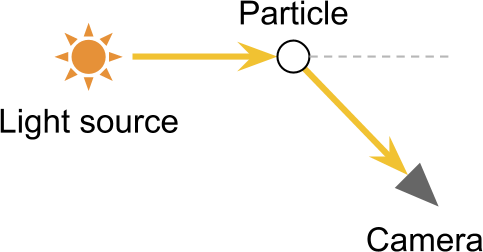

 

#### 透过率函数

要计算传输到相机的光量，有助于完成与太阳光线相同的行程。通过查看下图，可以很容易地看到到达的光线穿过空的空间。由于它们的路径中没有任何东西，因此所有的光都将到达而不会受到任何散射效果的影响。让我们以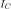该点从太阳接收到的未散射光的数量来表示。在到达的过程中，光进入了行星的大气层。一些射线会与悬浮在空中的分子发生碰撞，并向不同的方向反弹。结果是一些光从路径散射开。到达的光量（用表示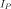）将低于。

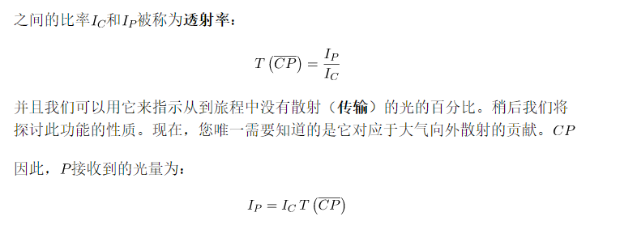

#### 

之间的比率

并且我们可以用它来指示从到旅程中没有散射（**传输**）的光的百分比。稍后我们将探讨此功能的性质。现在，您唯一需要知道的是它对应于大气向外散射的贡献。

因此，接收到的光量为：

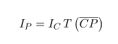

#### 散射功能

该点直接从太阳接收光。但是，并非所有通过的光都传回相机。要计算实际到达相机的光量，我们需要引入另一个概念：**散射函数** 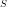。其目的是指示在特定方向上偏转了多少光。如果我们看下面的图，我们注意到只有那些以一个角度偏转的光线才会直接对准相机。

的值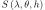表示弧度偏转的光的比率。此功能是我们问题的核心，我们将在以后的文章中探讨其性质。现在，你必须知道的唯一的事情是，它取决于进入光的颜色（其表示**波长** ）的**散射角度** 和**高度** 的。高度之所以重要，是因为大气密度随高度而变化。最终，密度是确定散射多少光的因素之一。

现在，我们有了所有必要的工具，可以编写一个通用方程式，以显示从到的光传输量：

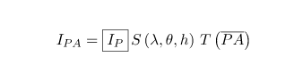

我们可以Ip使用之前的定义进行扩展：

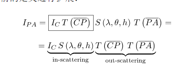

该方程式应易于说明：

- 光是从太阳传播到，并在真空中散射。
- 光进入大气层并从那里传播出去。这样做时，只有小部分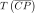由于**向外散射**而到达目的地；
- 来自太阳的部分光线被偏转回相机。发生**散射**的光的比率为；
- 剩余的光从传播到，再次仅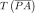透射一部分。

#### 数值积分

如果您已经关注了前面的段落，则可能已经注意到强度的编写方式存在明显的不一致。符号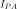表示从传输到的光量。但是，该数量不能解决所有接收到的光。在这种简化的大气散射模型中，我们考虑了沿照相机视线穿过大气的每个点的散射。

通过将所有点的贡献加在一起来计算接收到的总光量。从数学上讲，线段中有无限多个点，因此不可能遍历所有点。但是，我们可以做的是将长度分成许多较小的部分（下图），并累积每个部分的贡献。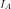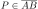

这种近似过程称为**数值积分**，得出以下表达式：

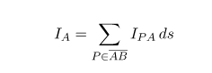

我们考虑的点越多，最终结果就越准确。实际上，我们在大气着色器中要做的就是遍历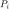大气中的多个点，从而累积它们对整体结果的贡献。

❓为什么我们要乘以*ds*？

我们在这里使用的方法是对连续现象的近似。我们考虑的点越多，就越接近实际结果。通过将每个点乘以Ds，我们根据它们的长度权衡它们的贡献。我们拥有的积分越多，每个积分的重要性就越低。

另一种看待这种情况的方法是乘以ds“平均”所有点的贡献。

#### 定向光

如果太阳相对较近，则最好将其建模为**点光源**。在这种情况下，接收的光量取决于与太阳本身的距离。但是，如果我们谈论的是行星，那么我们通常可以假设太阳是如此遥远，以至于其光线都以相同的角度到达行星。如果是这样，我们可以将太阳建模为**定向光源**。从定向光源接收的光无论行进距离如何都保持恒定。因此，每个点都接收相同量的光，并且所有点的朝向太阳的方向都相同。

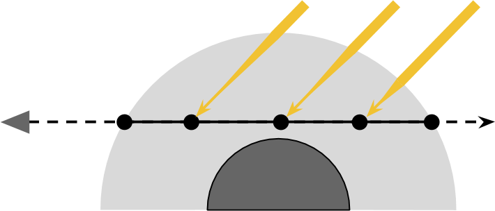

我们可以使用这个假设来简化方程组。

让我们用代表**太阳强度**的常数代替。

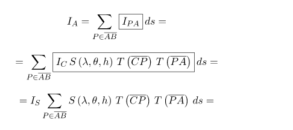

我们可以执行另一个优化，它涉及散射函数如果阳光总是来自同一方向，则角度将变为常数。我们将在以后的文章中看到如何将求和的方向性因素排除在外。现在，让我们将其保留在里面。

#### 吸收系数

当描述光与空气分子之间相互作用的可能结果时，我们仅介绍了两个。直行或偏转。还有第三种可能性。一些化合物吸收光。地球上的大气中有许多化学物质具有这种特性。例如，臭氧存在于较高的大气中，并且已知会与紫外线强烈反应。然而，它的存在实际上对天空的颜色没有影响，因为它吸收了可见光谱之外的光。在地球上，吸光化学物质的贡献通常被忽略。

在地球上，光吸收化学物质的贡献通常被忽略。其他行星无法做到这一点。例如，海王星和天王星的典型颜色是由大气中甲烷的大量存在引起的。甲烷因吸收红光而闻名，产生蓝色。在本教程的其余部分中，我们将忽略吸收系数，尽管我们将添加一种着色大气的方法。

❓是什么导致太阳在2017年的奥菲利亚风暴期间变红？

如果您居住在英国，可能会注意到在名为Ophelia的暴风雨期间太阳变红了。这是因为Ophelia从撒哈拉沙漠带走了沙子。那些悬浮在大气中的微小颗粒会放大散射效果。正如我们将在下一个教程[《瑞利散射的数学》中](https://translate.googleusercontent.com/translate_c?depth=1&pto=aue&rurl=translate.google.com.hk&sl=en&sp=nmt4&tl=zh-CN&u=https://www.alanzucconi.com/%3Fp%3D7472&usg=ALkJrhiArBwcvl4lZ1tg3w6zBYlp7hJKHg)看到的那样 ，蓝光的散射比红光更强烈，如果我们查看可见光谱的颜色，则有可能

如果我们看一下可见光谱的颜色（下图），很容易看到，如果散射了足够多的蓝光，天空确实可以变成黄色或红色。

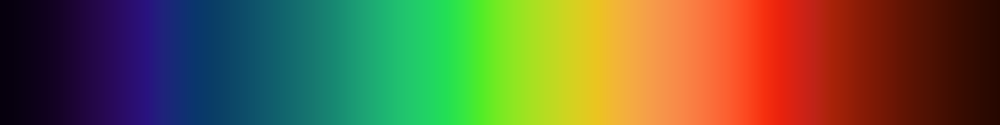

有人可能会说，天空的颜色与撒哈拉沙漠黄色的色彩有关。但是，由于烟雾趋于黑色，在大火中可以看到相同的效果。

#### 下一步…

在本教程中，我们推导了控制**单个散射**的方程的一种非常通用的形式。理论上，所描述的方法适用于从单个光源接收光的所有半透明体积。

当然，这两个关键方面是透射率函数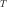和散射函数。在下一个教程中，我们将探索它们的性质，并根据行星大气的物理特性来推导方程式。

您可以在这里找到本系列的所有文章：

- 第1部分。[体积大气散射](https://translate.googleusercontent.com/translate_c?depth=1&pto=aue&rurl=translate.google.com.hk&sl=en&sp=nmt4&tl=zh-CN&u=https://www.alanzucconi.com/%3Fp%3D7374&usg=ALkJrhjYMhWOeFn5j2IlPMWpMA64AiPlMg)
- **第2部分。[大气散射背后的理论](https://translate.googleusercontent.com/translate_c?depth=1&pto=aue&rurl=translate.google.com.hk&sl=en&sp=nmt4&tl=zh-CN&u=https://www.alanzucconi.com/%3Fp%3D7404&usg=ALkJrhhNvWi2Ma8gskQo9lVjBRr-spPMIg)**
- 第3部分。 [瑞利散射的数学](https://translate.googleusercontent.com/translate_c?depth=1&pto=aue&rurl=translate.google.com.hk&sl=en&sp=nmt4&tl=zh-CN&u=https://www.alanzucconi.com/%3Fp%3D7472&usg=ALkJrhiArBwcvl4lZ1tg3w6zBYlp7hJKHg)
- 第4部分 [。穿越大气的旅程](https://translate.googleusercontent.com/translate_c?depth=1&pto=aue&rurl=translate.google.com.hk&sl=en&sp=nmt4&tl=zh-CN&u=https://www.alanzucconi.com/%3Fp%3D7557&usg=ALkJrhjMschsdC2q-wdtAHWdFW182MFNug)
- 第5部分。 [大气层着色器](https://translate.googleusercontent.com/translate_c?depth=1&pto=aue&rurl=translate.google.com.hk&sl=en&sp=nmt4&tl=zh-CN&u=https://www.alanzucconi.com/%3Fp%3D7665&usg=ALkJrhgTDkLQgvV6XWqIWD7d38K_d8Quxw)
- 第6部分。 [相交的气氛](https://translate.googleusercontent.com/translate_c?depth=1&pto=aue&rurl=translate.google.com.hk&sl=en&sp=nmt4&tl=zh-CN&u=https://www.alanzucconi.com/%3Fp%3D7781&usg=ALkJrhj54Ie8EPoQkg4AuMrWftgjjy1-aA)
- 第7部分。 [大气散射着色器](https://translate.googleusercontent.com/translate_c?depth=1&pto=aue&rurl=translate.google.com.hk&sl=en&sp=nmt4&tl=zh-CN&u=https://www.alanzucconi.com/%3Fp%3D7793&usg=ALkJrhiya4HGZA53eDuy9guoib53wbK9IQ)
- 第8部分。 [三重理论概论](https://translate.googleusercontent.com/translate_c?depth=1&pto=aue&rurl=translate.google.com.hk&sl=en&sp=nmt4&tl=zh-CN&u=https://www.alanzucconi.com/%3Fp%3D7578&usg=ALkJrhiT9N0FnH53kCdo8wVccpn3C10IEA)

您可以参考“ [大气散射备忘单”](https://translate.googleusercontent.com/translate_c?depth=1&pto=aue&rurl=translate.google.com.hk&sl=en&sp=nmt4&tl=zh-CN&u=https://www.alanzucconi.com/%3Fp%3D7766&usg=ALkJrhjSEJtCcx3nq0bi_g1cPtOXSryBcg)  以获取所有所用方程式的完整参考