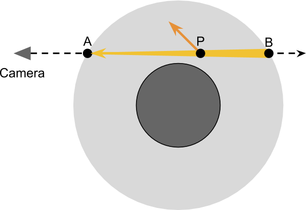

# 体积大气散射

如果您在地球上生活了足够长的时间，您可能想知道为什么天空通常是蓝色的，而在日落时却是红色的。造成这种现象的光学现象（主要是）被称为**瑞利散射**。本教程将说明如何对大气散射建模，以重现行星展示的许多视觉效果。而且，如果您想为外星行星渲染物理上精确的视觉效果，那么这*绝对*是您一直在寻找的教程。

您可以在这里找到本系列的所有文章：

- **第1部分。[体积大气散射](https://translate.googleusercontent.com/translate_c?depth=1&pto=aue&rurl=translate.google.com.hk&sl=en&sp=nmt4&tl=zh-CN&u=https://www.alanzucconi.com/%3Fp%3D7374&usg=ALkJrhjYMhWOeFn5j2IlPMWpMA64AiPlMg)**
- 第2部分。[大气散射背后的理论](https://translate.googleusercontent.com/translate_c?depth=1&pto=aue&rurl=translate.google.com.hk&sl=en&sp=nmt4&tl=zh-CN&u=https://www.alanzucconi.com/%3Fp%3D7404&usg=ALkJrhhNvWi2Ma8gskQo9lVjBRr-spPMIg)
- 第3部分。 [瑞利散射的数学](https://translate.googleusercontent.com/translate_c?depth=1&pto=aue&rurl=translate.google.com.hk&sl=en&sp=nmt4&tl=zh-CN&u=https://www.alanzucconi.com/%3Fp%3D7472&usg=ALkJrhiArBwcvl4lZ1tg3w6zBYlp7hJKHg)
- 第4部分 [。穿越大气的旅程](https://translate.googleusercontent.com/translate_c?depth=1&pto=aue&rurl=translate.google.com.hk&sl=en&sp=nmt4&tl=zh-CN&u=https://www.alanzucconi.com/%3Fp%3D7557&usg=ALkJrhjMschsdC2q-wdtAHWdFW182MFNug)
- 第5部分。 [大气层着色器](https://translate.googleusercontent.com/translate_c?depth=1&pto=aue&rurl=translate.google.com.hk&sl=en&sp=nmt4&tl=zh-CN&u=https://www.alanzucconi.com/%3Fp%3D7665&usg=ALkJrhgTDkLQgvV6XWqIWD7d38K_d8Quxw)
- 第6部分。 [相交的气氛](https://translate.googleusercontent.com/translate_c?depth=1&pto=aue&rurl=translate.google.com.hk&sl=en&sp=nmt4&tl=zh-CN&u=https://www.alanzucconi.com/%3Fp%3D7781&usg=ALkJrhj54Ie8EPoQkg4AuMrWftgjjy1-aA)
- 第7部分。 [大气散射着色器](https://translate.googleusercontent.com/translate_c?depth=1&pto=aue&rurl=translate.google.com.hk&sl=en&sp=nmt4&tl=zh-CN&u=https://www.alanzucconi.com/%3Fp%3D7793&usg=ALkJrhiya4HGZA53eDuy9guoib53wbK9IQ)
- 第8部分。 [三重理论概论](https://translate.googleusercontent.com/translate_c?depth=1&pto=aue&rurl=translate.google.com.hk&sl=en&sp=nmt4&tl=zh-CN&u=https://www.alanzucconi.com/%3Fp%3D7578&usg=ALkJrhiT9N0FnH53kCdo8wVccpn3C10IEA)

您可以参考“ [大气散射备忘单”](https://translate.googleusercontent.com/translate_c?depth=1&pto=aue&rurl=translate.google.com.hk&sl=en&sp=nmt4&tl=zh-CN&u=https://www.alanzucconi.com/%3Fp%3D7766&usg=ALkJrhjSEJtCcx3nq0bi_g1cPtOXSryBcg)  以获取所有所用方程式的完整参考。

您可以在页面底部**下载**本教程的**Unity软件包**。

#### 介绍

使得空气效果如此难以再现的原因是，天空不是固体物体。传统的渲染技术假定对象不过是一个空壳。所有图形计算仅发生在材料表面上，无论内部是什么。这种巨大的简化可以非常有效地渲染实体对象。但是，某些材料的外观取决于光可以穿透它们的事实。**半透明**物体的最终外观是由于光线与其内部结构的相互作用而产生的。在大多数情况下，这种交互可以非常有效地被伪造，如[Unity中快速地下散射](https://translate.googleusercontent.com/translate_c?depth=1&pto=aue&rurl=translate.google.com.hk&sl=en&sp=nmt4&tl=zh-CN&u=https://www.alanzucconi.com/%3Fp%3D7053&usg=ALkJrhiPPK8pmH7ejJWQqqc_EmeTHTjgRQ)的教程所示。。可悲的是，如果我们要重现可信的天空，情况并非如此。不仅要渲染行星的“外壳”，我们还需要模拟穿过大气层的光线发生了什么。在对象内部传播计算称为**体积渲染**，这是在[体积渲染](https://translate.googleusercontent.com/translate_c?depth=1&pto=aue&rurl=translate.google.com.hk&sl=en&sp=nmt4&tl=zh-CN&u=https://www.alanzucconi.com/%3Fp%3D5159&usg=ALkJrhjSIPR3G2fOBpF6UwXzSKP_AHzhKw)系列中广泛讨论的主题。该系列中介绍的两种技术（**光线行进**和有**符号距离函数**）不能有效地用于模拟大气散射。本教程将介绍一种更合适的方法来渲染固体半透明物体，通常称为**体积单散射**。

#### 单次散射

在没有光线的房间里，您什么也看不到。只有当一束光反射并撞击我们的眼睛时，这些对象才可见。大多数游戏引擎（例如Unity和Unreal）都假定光线“在真空中”传播。这意味着物体是唯一会影响光线的事物。实际上，光总是通过介质传播。在我们的案例中，该介质就是我们呼吸的空气。结果，物体的外观会受到穿过的空气量的影响。在地球表面，空气密度相对较低；它的贡献是如此之小，以至于只有在光线传播很远的时候才能真正被欣赏。尽管我们附近的物体几乎不受大气散射的影响，但遥远的山脉却与天空融为一体。

复制大气散射的光学效应的第一步是了解光如何穿过像空气这样的介质。如前所述，只有当光线射入我们的眼睛时，我们才能看到某些东西。在3D图形的上下文中，我们的眼睛是用于渲染场景的相机。构成我们周围空气的分子可以使穿过它们的光线偏转。因此，它们有能力改变我们感知物体的方式。作为一种极大的简化，空气中的分子可以通过两种方式影响我们的视力。

##### 向外散射

空气分子与光相互作用的最明显方式是使光发生偏转，改变其方向。如果一束直接射向相机的光线发生偏转，那么我们处于所谓的“ **向外散射”**过程的前面。

真实的光源每秒可以发射四千万个光子，并且每个光子都有一定的概率撞击空气分子。光在其中传播的介质越密集，单个光子发生偏转的可能性就越大。外散射严重影响光的方式还取决于行进的距离。

向外散射会导致光线逐渐变暗，这取决于行进距离和空气密度。

particles为什么粒子会改变光的方向？

##### 散射内

当光线被粒子偏转时，也可能发生这种情况，将其重定向到摄像机。这实际上与向外散射相反，并且毫不奇怪，这被称为向内**散射**。

在某些情况下，散射可以看到不在相机直接可见光范围内的光源。其最明显的光学效果导致光源周围出现光晕。它们是由于照相机从同一光源接收直接和间接光线，事实上放大了接收到的光子数量。

#### 体积单散射

单束光线可以偏转任意次数。这意味着光在到达相机之前可以经过非常复杂的路径。这带来了巨大的挑战，因为以高保真度渲染半透明材料需要模拟每条单独光线的路径。这称为**光线追踪**，目前对于实时渲染在计算上过于昂贵。本教程中介绍的技术称为**单散射**，因为它仅考虑光线的单散射事件。稍后我们将看到，这种简化如何仍可以以仅真实光线跟踪成本的一小部分获得实际结果。

渲染逼真的天空的关键是模拟光线穿过行星大气时会发生什么。下图显示了通过行星观察的照相机。这种渲染技术背后的基本思想是计算从到传播的光如何受到散射的影响。这意味着要计算出散射光和散射光对相机的光线的贡献。如前所述，我们经历了由于向外散射引起的衰减。在每个点上存在的光线被偏转的可能性很小。

为了正确说明每个点发生了多少向外散射，我们首先需要知道首先存在多少光。假设只有一颗恒星照亮地球，那么接收到的所有光必须来自太阳。某些光线会发生散射，并意外地偏向相机：

这两个步骤足以近似在大气中可以观察到的大多数影响。然而，事情是由光的量的事实compilated 从太阳接收本身进行了散射，同时通过从大气行进到。

总结一下我们要做的事情：

- 摄像机的视线进入大气，并存在于大气;
- 近似地，我们考虑了在每个点上发生的外向和内向散射的贡献；
- 接收到的光量来自太阳。
- 当光线穿过大气层时，接收到的光线会发生散射。
- 接收到的一部分光会发生向内散射，并朝相机的方向发送；
- 从那里射向相机的光的一部分会发生散射，并偏离视线。

is这不是光线可以到达相机的唯一方法！

#### 下一步…

这篇文章介绍了创建可复制大气散射的体积着色器所必需的主要概念。在下一篇文章中，我们将开始规范这些过程。

希望您能在旅途中与我在一起。

您可以在这里找到本系列的所有文章：

- **第1部分。[体积大气散射](https://translate.googleusercontent.com/translate_c?depth=1&pto=aue&rurl=translate.google.com.hk&sl=en&sp=nmt4&tl=zh-CN&u=https://www.alanzucconi.com/%3Fp%3D7374&usg=ALkJrhjYMhWOeFn5j2IlPMWpMA64AiPlMg)**
- 第2部分。[大气散射背后的理论](https://translate.googleusercontent.com/translate_c?depth=1&pto=aue&rurl=translate.google.com.hk&sl=en&sp=nmt4&tl=zh-CN&u=https://www.alanzucconi.com/%3Fp%3D7404&usg=ALkJrhhNvWi2Ma8gskQo9lVjBRr-spPMIg)
- 第3部分。 [瑞利散射的数学](https://translate.googleusercontent.com/translate_c?depth=1&pto=aue&rurl=translate.google.com.hk&sl=en&sp=nmt4&tl=zh-CN&u=https://www.alanzucconi.com/%3Fp%3D7472&usg=ALkJrhiArBwcvl4lZ1tg3w6zBYlp7hJKHg)
- 第4部分 [。穿越大气的旅程](https://translate.googleusercontent.com/translate_c?depth=1&pto=aue&rurl=translate.google.com.hk&sl=en&sp=nmt4&tl=zh-CN&u=https://www.alanzucconi.com/%3Fp%3D7557&usg=ALkJrhjMschsdC2q-wdtAHWdFW182MFNug)
- 第5部分。 [大气层着色器](https://translate.googleusercontent.com/translate_c?depth=1&pto=aue&rurl=translate.google.com.hk&sl=en&sp=nmt4&tl=zh-CN&u=https://www.alanzucconi.com/%3Fp%3D7665&usg=ALkJrhgTDkLQgvV6XWqIWD7d38K_d8Quxw)
- 第6部分。 [相交的气氛](https://translate.googleusercontent.com/translate_c?depth=1&pto=aue&rurl=translate.google.com.hk&sl=en&sp=nmt4&tl=zh-CN&u=https://www.alanzucconi.com/%3Fp%3D7781&usg=ALkJrhj54Ie8EPoQkg4AuMrWftgjjy1-aA)
- 第7部分。 [大气散射着色器](https://translate.googleusercontent.com/translate_c?depth=1&pto=aue&rurl=translate.google.com.hk&sl=en&sp=nmt4&tl=zh-CN&u=https://www.alanzucconi.com/%3Fp%3D7793&usg=ALkJrhiya4HGZA53eDuy9guoib53wbK9IQ)
- 第8部分。 [三重理论概论](https://translate.googleusercontent.com/translate_c?depth=1&pto=aue&rurl=translate.google.com.hk&sl=en&sp=nmt4&tl=zh-CN&u=https://www.alanzucconi.com/%3Fp%3D7578&usg=ALkJrhiT9N0FnH53kCdo8wVccpn3C10IEA)

您可以参考“ [大气散射备忘单”](https://translate.googleusercontent.com/translate_c?depth=1&pto=aue&rurl=translate.google.com.hk&sl=en&sp=nmt4&tl=zh-CN&u=https://www.alanzucconi.com/%3Fp%3D7766&usg=ALkJrhjSEJtCcx3nq0bi_g1cPtOXSryBcg)  以获取所有所用方程式的完整参考。

##### 其他资源

- Scratchpixel 2.0：[模拟天空的颜色](https://translate.googleusercontent.com/translate_c?depth=1&pto=aue&rurl=translate.google.com.hk&sl=en&sp=nmt4&tl=zh-CN&u=https://www.scratchapixel.com/lessons/procedural-generation-virtual-worlds/simulating-sky/simulating-colors-of-the-sky&usg=ALkJrhjURmDhCmsed4Kh8z7zHCcfECvMHQ)
- GPU宝石： [精确的大气散射](https://translate.googleusercontent.com/translate_c?depth=1&pto=aue&rurl=translate.google.com.hk&sl=en&sp=nmt4&tl=zh-CN&u=https://developer.nvidia.com/gpugems/GPUGems2/gpugems2_chapter16.html&usg=ALkJrhhMZqpsVxTl0k2G9RrdzCqr4i4ljQ)
- 原子世界： [灵活的物理精确大气散射](https://translate.googleusercontent.com/translate_c?depth=1&pto=aue&rurl=translate.google.com.hk&sl=en&sp=nmt4&tl=zh-CN&u=https://atomworld.wordpress.com/2014/12/22/flexible-physical-accurate-atmosphere-scattering-part-1/&usg=ALkJrhhLHauolVD0OrnZA12z7O55lgfR4w)

#### 下载

<iframe src="https://www.patreon.com/platform/iframe?widget=become-patron-button&amp;redirectURI=https%3A%2F%2Ftranslate.googleusercontent.com%2Ftranslate_c%3Fdepth%3D1%26pto%3Daue%26rurl%3Dtranslate.google.com.hk%26sl%3Den%26sp%3Dnmt4%26tl%3Dzh-CN%26u%3Dhttps%3A%2F%2Fwww.alanzucconi.com%2F2017%2F10%2F10%2Fatmospheric-scattering-1%2F%26usg%3DALkJrhhnkKl6QJSqPmsMo1ibfe1IAnX7JQ&amp;creatorID=https%3A%2F%2Fwww.patreon.com%2FbePatron%3Fu%3D850572" scrolling="no" allowtransparency="true" class="patreon-widget" style="position: static; visibility: visible;" title="Patreon小部件" frameborder="0"></iframe>

 您可以下载所有必要的资产，以重现本教程中介绍的体积大气散射。

| **特征**   | [**标准**](https://translate.googleusercontent.com/translate_c?depth=1&pto=aue&rurl=translate.google.com.hk&sl=en&sp=nmt4&tl=zh-CN&u=https://www.patreon.com/posts/14807027&usg=ALkJrhg0KTWjZ1O92xGARs7Q_3GBnUsWXg) | [**保费**](https://translate.googleusercontent.com/translate_c?depth=1&pto=aue&rurl=translate.google.com.hk&sl=en&sp=nmt4&tl=zh-CN&u=https://www.patreon.com/posts/14806526&usg=ALkJrhjfCZ1XMN-olA16vJAS3rBYHEYDlg) |
| ---------- | ------------------------------------------------------------ | ------------------------------------------------------------ |
| 体积着色器 | ✅                                                            | ✅                                                            |
| 云支持     | ❌                                                            | ✅                                                            |
| 昼夜循环   | ❌                                                            | ✅                                                            |
| 地球8K     | ✅                                                            | ✅                                                            |
| 火星8K     | ❌                                                            | ✅                                                            |
| 金星8K     | ❌                                                            | ✅                                                            |
| 海王星2K   | ❌                                                            | ✅                                                            |
| 后期处理   | ❌                                                            | ✅                                                            |
| **下载**   | **[标准](https://translate.googleusercontent.com/translate_c?depth=1&pto=aue&rurl=translate.google.com.hk&sl=en&sp=nmt4&tl=zh-CN&u=https://www.patreon.com/posts/14807027&usg=ALkJrhg0KTWjZ1O92xGARs7Q_3GBnUsWXg)** | **[保费](https://translate.googleusercontent.com/translate_c?depth=1&pto=aue&rurl=translate.google.com.hk&sl=en&sp=nmt4&tl=zh-CN&u=https://www.patreon.com/posts/14806526&usg=ALkJrhjfCZ1XMN-olA16vJAS3rBYHEYDlg)** |